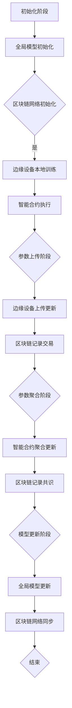

                 

关键词：区块链，联邦学习，隐私保护，数据共享，分布式计算，智能合约，共识机制

## 摘要

本文旨在探讨区块链技术在联邦学习中的应用潜力。联邦学习作为一种隐私保护的机器学习范式，在数据隐私和安全问题日益突出的背景下得到了广泛关注。区块链技术的引入，有望解决联邦学习中的数据共享和共识问题，提升系统的安全性和透明性。本文将介绍区块链和联邦学习的基本概念，分析它们在数据隐私保护、分布式计算和智能合约等方面的联系，并探讨其在实际应用中的具体实施方案和挑战。通过深入分析，我们希望能为未来区块链与联邦学习融合的研究和实践提供一些有价值的思考方向。

## 1. 背景介绍

### 联邦学习的基本概念

联邦学习（Federated Learning）是一种分布式机器学习技术，旨在解决数据隐私和安全性问题。其核心思想是通过在数据源处本地训练模型，然后将模型参数聚合到中央服务器，从而在整个分布式环境中训练出一个统一的模型。联邦学习的关键优势在于数据不必离开数据源头，因此可以有效保护数据隐私，减少数据泄露风险。

联邦学习的基本工作流程通常包括以下步骤：

1. **初始化**：中央服务器初始化全局模型，并将其分发到各个边缘节点。
2. **本地训练**：每个边缘节点使用本地数据对全局模型进行本地训练，更新本地模型参数。
3. **参数上传**：每个边缘节点将本地训练后的模型参数上传到中央服务器。
4. **参数聚合**：中央服务器接收来自各个边缘节点的模型参数，进行聚合得到全局模型的新参数。
5. **迭代更新**：重复步骤2-4，直到达到预定的训练目标或迭代次数。

### 区块链技术的基本概念

区块链技术是一种分布式数据库技术，通过加密算法和共识机制确保数据的安全性和不可篡改性。区块链的基本组成包括区块（Block）、链（Chain）和节点（Node）。

- **区块**：区块是区块链的基本组成单位，包含一定数量的交易记录以及一个时间戳和一个指向前一个区块的哈希值。
- **链**：区块链由一系列按时间顺序排列的区块组成，每个区块通过哈希值与前一个区块相连，形成链式数据结构。
- **节点**：区块链网络中的节点负责存储区块链数据、验证交易和生成新区块。

区块链的主要特点包括去中心化、不可篡改、透明性和安全性。

- **去中心化**：区块链网络不需要中心化的权威机构，所有节点共同维护区块链数据。
- **不可篡改**：区块链数据一旦被记录，除非同时篡改多数节点数据，否则无法被篡改。
- **透明性**：区块链上的所有交易和区块信息都是公开透明的。
- **安全性**：区块链使用加密算法确保数据的完整性和安全性。

### 数据隐私和安全问题

在传统的集中式机器学习模型中，数据通常需要在中央服务器进行集中存储和处理，这导致了数据隐私和安全问题的出现。首先，数据泄露的风险随着数据规模的增加而增大。其次，数据在传输过程中可能被窃取或篡改。此外，数据所有者可能担心数据被滥用，从而导致隐私泄露。

联邦学习通过将数据留在本地，避免了数据在传输过程中被窃取或篡改的风险。然而，联邦学习中的数据聚合和共享过程仍然存在潜在的安全问题。例如，攻击者可能会通过篡改上传的模型参数来干扰训练过程，从而损害模型性能。

区块链技术提供了有效的解决方案。首先，区块链的去中心化和不可篡改特性确保了数据的完整性和安全性。其次，智能合约的引入使得联邦学习的参数聚合过程具有透明性和可验证性。通过智能合约，联邦学习过程中的每一步操作都可以被记录在区块链上，并供所有参与者查询和验证。

### 分布式计算的需求

随着互联网和物联网的发展，数据来源变得日益分散。在许多应用场景中，数据无法或者不便于集中存储和处理。例如，在医疗健康领域，不同医院和诊所拥有各自的患者数据，但需要共同进行疾病预测和诊断。在这种情况下，分布式计算成为了一种必要的选择。

区块链技术为分布式计算提供了基础设施。通过区块链网络，各个节点可以安全地共享数据和计算资源，同时保持数据的一致性和安全性。在联邦学习场景中，区块链可以充当数据交换平台，确保参与方之间的数据传输和计算过程是透明、安全和高效的。

### 智能合约在联邦学习中的应用

智能合约是一种自动化合约，其条款和操作逻辑被编写为计算机代码，并运行在区块链网络中。智能合约的引入为联邦学习带来了新的可能性。首先，智能合约可以自动执行参数聚合和模型更新过程，减少人为干预和潜在的安全风险。其次，智能合约的可验证性确保了联邦学习过程中的每一步操作都是透明和可信的。

在联邦学习应用中，智能合约可以用于：

1. **参数聚合**：智能合约自动收集来自各个节点的模型参数，进行聚合并更新全局模型。
2. **隐私保护**：智能合约确保只有授权节点可以访问和修改数据，从而保护数据隐私。
3. **激励机制**：智能合约可以用于激励参与方提供计算资源，促进分布式计算网络的健康运行。

### 区块链技术在联邦学习中的优势

区块链技术在联邦学习中的应用具有以下几个显著优势：

1. **隐私保护**：区块链的去中心化和加密特性可以有效保护数据隐私，减少数据泄露风险。
2. **安全性**：区块链的不可篡改特性确保了数据的安全性和完整性。
3. **透明性**：区块链上的所有交易和操作都是公开透明的，提高了系统的可信任性。
4. **高效性**：区块链技术可以提供高效的分布式计算基础设施，支持大规模联邦学习应用。

### 区块链技术在联邦学习中的应用场景

区块链技术在联邦学习中的应用场景包括但不限于以下几个方面：

1. **医疗健康领域**：医疗健康数据涉及敏感隐私信息，通过区块链技术可以实现数据的安全共享和隐私保护。
2. **金融领域**：金融数据的安全性和透明性要求较高，区块链技术可以为金融交易提供高效、安全的分布式计算解决方案。
3. **智能交通领域**：智能交通系统需要处理大量的交通数据，区块链技术可以用于实现数据的隐私保护和高效计算。
4. **物联网领域**：物联网设备产生的数据具有分散性和实时性特点，区块链技术可以提供安全、高效的分布式数据处理方案。

### 当前的研究现状

当前，区块链技术在联邦学习领域的研究和应用正处于快速发展阶段。许多研究机构和科技公司已经开始探索区块链与联邦学习的融合应用。例如，谷歌的联邦学习框架TF联邦（TensorFlow Federated）已经支持了区块链技术的集成。此外，还有一些初创公司致力于开发基于区块链的联邦学习平台，以提供更加安全、高效的分布式计算解决方案。

尽管区块链技术在联邦学习中的应用前景广阔，但仍然存在一些挑战和问题需要解决。例如，区块链网络的性能瓶颈、智能合约的安全性和效率等。未来，随着区块链技术的不断发展和完善，以及联邦学习技术的进一步成熟，区块链技术在联邦学习中的应用将得到更加广泛和深入的应用。

### 1.1 区块链技术的起源与发展

区块链技术的起源可以追溯到2008年，当时一位名为中本聪（Satoshi Nakamoto）的匿名人物发布了《比特币：一种点对点的电子现金系统》的白皮书，首次提出了区块链的概念。比特币作为第一个基于区块链技术的数字货币，通过去中心化的方式解决了电子货币交易中的双花问题，即在分布式网络中确保交易的有效性和安全性。

随着比特币的成功，区块链技术逐渐引起了广泛关注。人们开始意识到区块链不仅适用于数字货币，还可以应用于更广泛的领域。2014年，以太坊（Ethereum）的诞生进一步推动了区块链技术的发展。以太坊引入了智能合约（Smart Contract）的概念，使得区块链不仅可以用于交易，还可以执行复杂的计算和自动化操作。

区块链技术的发展可以分为以下几个阶段：

1. **1.0阶段（价值传输）**：以比特币为代表，区块链主要用于价值传输，解决了数字货币交易的安全性和去中心化问题。
2. **2.0阶段（智能合约）**：以太坊等平台的推出，使得区块链不再局限于简单的价值传输，而是能够支持复杂的智能合约和去中心化应用（DApp）。
3. **3.0阶段（可扩展性优化）**：随着区块链应用的日益广泛，性能瓶颈成为亟待解决的问题。许多研究者开始探索各种优化方案，如侧链、状态通道、分片技术等。

### 1.2 联邦学习的起源与发展

联邦学习的概念最早可以追溯到2006年，由微软研究员Giridhar G. Mutlu在研究分布式数据处理时提出。然而，联邦学习作为一项技术真正受到关注，则是在2016年谷歌提出TensorFlow Federated（TFF）框架后。谷歌的联邦学习框架通过将模型训练分散到各个边缘设备上，有效解决了数据隐私和安全性问题。

联邦学习的发展经历了以下几个重要阶段：

1. **1.0阶段（本地模型训练）**：最早的联邦学习研究主要关注如何将本地训练的模型参数聚合起来，以实现全局模型训练。
2. **2.0阶段（模型更新策略）**：随着联邦学习的不断成熟，研究者开始探索更有效的模型更新策略，如梯度压缩、联邦平均算法等。
3. **3.0阶段（联邦学习框架）**：随着技术的进步，许多公司和研究机构开发了各种联邦学习框架，如Google的TensorFlow Federated、Facebook的PySyft、微软的OpenMLOps等，这些框架为联邦学习的应用提供了便捷的工具和接口。

### 1.3 区块链技术在联邦学习中的应用

区块链技术在联邦学习中的应用主要体现在以下几个方面：

1. **数据隐私保护**：区块链的去中心化和加密特性可以确保联邦学习中的数据在传输和存储过程中的隐私性和安全性。
2. **分布式计算**：区块链网络提供了分布式计算基础设施，支持大规模联邦学习应用。
3. **智能合约**：智能合约的引入使得联邦学习过程中的参数聚合和模型更新具有透明性和可验证性。
4. **共识机制**：区块链的共识机制确保了联邦学习过程中的一致性和可靠性。

### 1.4 区块链与联邦学习的联系与区别

区块链与联邦学习在数据隐私保护、分布式计算和智能合约等方面存在密切联系，但二者也存在一些区别：

- **联系**：
  - 数据隐私保护：区块链和联邦学习都关注数据的隐私性和安全性。
  - 分布式计算：区块链和联邦学习都支持分布式计算，但联邦学习更注重模型训练的分布式。
  - 智能合约：智能合约在区块链和联邦学习中的应用都具有自动化和透明性优势。

- **区别**：
  - 数据传输方式：联邦学习通常涉及数据的传输和聚合，而区块链则侧重于数据的安全存储和验证。
  - 系统目标：联邦学习的主要目标是实现隐私保护的模型训练，而区块链则提供了一种分布式账本和智能合约平台。
  - 性能要求：联邦学习对计算性能有较高要求，而区块链技术则更注重数据的安全性和可靠性。

### 1.5 区块链技术在联邦学习中的优势

区块链技术在联邦学习中的应用具有以下几个显著优势：

1. **隐私保护**：区块链的去中心化和加密特性可以确保联邦学习中的数据隐私性和安全性。
2. **分布式计算**：区块链网络提供了高效、安全的分布式计算基础设施。
3. **智能合约**：智能合约的引入使得联邦学习过程具有透明性和可验证性。
4. **去中心化**：区块链的去中心化特性减少了单点故障风险，提高了系统的可靠性。
5. **可扩展性**：区块链技术支持大规模分布式应用，能够应对不断增长的数据量和计算需求。

### 1.6 区块链技术在联邦学习中的挑战

尽管区块链技术在联邦学习中具有显著优势，但仍然面临一些挑战：

1. **性能瓶颈**：区块链网络的数据传输和验证过程可能影响联邦学习的计算效率。
2. **智能合约安全性**：智能合约的漏洞和攻击可能导致数据泄露和系统故障。
3. **共识机制选择**：不同的共识机制适用于不同的应用场景，选择合适的共识机制是一个挑战。
4. **网络延迟**：区块链网络的节点分布可能导致网络延迟，影响联邦学习的效果。

### 2. 核心概念与联系

在深入探讨区块链技术在联邦学习中的应用之前，首先需要理解区块链和联邦学习的一些核心概念及其相互联系。以下是对相关核心概念和流程的详细介绍，以及通过Mermaid流程图展示的关键架构。

#### 2.1 核心概念

##### 联邦学习（Federated Learning）

联邦学习是一种分布式机器学习范式，其核心思想是在多个边缘设备上本地训练模型，然后将这些模型的更新或参数聚合起来，以训练出一个全局模型。联邦学习的主要优势在于能够保护数据隐私，因为数据不需要传输到中央服务器。它广泛应用于移动设备、物联网和医疗等领域。

**主要概念**：

- **边缘设备（Edge Devices）**：执行本地数据训练的设备，如手机、传感器等。
- **全局模型（Global Model）**：由所有边缘设备共享的模型。
- **本地模型（Local Model）**：每个边缘设备训练的私有模型。
- **模型更新**：本地模型在训练过程中对全局模型的更新。

##### 区块链（Blockchain）

区块链是一种分布式账本技术，通过加密算法和共识机制确保数据的完整性和安全性。区块链网络由多个节点组成，每个节点都存储完整的账本副本，并通过共识机制维护账本的一致性。

**主要概念**：

- **区块（Block）**：存储交易记录的数据结构。
- **链（Chain）**：按时间顺序排列的区块集合。
- **节点（Node）**：维护区块链网络的计算机。
- **共识机制（Consensus Mechanism）**：确保区块链网络中所有节点达成一致性的协议。
- **智能合约（Smart Contract）**：在区块链上自动执行合约条款的计算机程序。

#### 2.2 区块链与联邦学习的相互联系

区块链技术可以与联邦学习相结合，以解决联邦学习中的数据隐私、安全性和共识问题。

**相互联系**：

- **数据隐私保护**：区块链的加密机制可以确保联邦学习过程中数据的隐私性和安全性。例如，通过零知识证明（Zero-Knowledge Proof）等技术，可以证明某数据的有效性，而不暴露数据本身。
- **分布式计算**：区块链网络提供了分布式计算的基础设施，支持大规模联邦学习应用。边缘设备可以通过区块链网络共享计算资源，协同训练模型。
- **共识机制**：区块链的共识机制可以用于确保联邦学习过程中的参数聚合和模型更新是一致的。例如，使用拜占庭容错算法（Byzantine Fault Tolerance，BFT）确保在分布式环境中达成共识。

#### 2.3 关键架构与流程

以下是区块链与联邦学习相结合的关键架构和流程：

1. **初始化阶段**：

   - **全局模型初始化**：中央服务器初始化全局模型，并将其加密后分发给所有边缘设备。
   - **区块链网络初始化**：区块链网络中的节点加入网络，并同步最新的区块链数据。

2. **本地训练阶段**：

   - **边缘设备本地训练**：边缘设备使用本地数据进行模型训练，并更新本地模型。
   - **智能合约执行**：智能合约执行本地训练的步骤，确保每个边缘设备都按照相同的训练策略进行训练。

3. **参数上传阶段**：

   - **边缘设备上传更新**：每个边缘设备将本地模型的更新加密后上传到区块链网络。
   - **区块链记录交易**：区块链网络记录上传的交易，确保更新数据的完整性。

4. **参数聚合阶段**：

   - **智能合约聚合更新**：智能合约从区块链网络中提取所有上传的更新，并进行聚合，生成新的全局模型。
   - **区块链记录共识**：区块链网络通过共识机制确认新的全局模型，并将其记录在链上。

5. **模型更新阶段**：

   - **全局模型更新**：中央服务器根据新的全局模型更新，重新初始化全局模型，并分发到所有边缘设备。
   - **区块链网络同步**：区块链网络中的节点同步新的全局模型，确保所有节点的一致性。

#### 2.4 Mermaid 流程图

以下是区块链与联邦学习相结合的Mermaid流程图：



通过上述流程图，我们可以清晰地看到区块链与联邦学习相结合的架构和操作步骤，展示了如何利用区块链技术解决联邦学习中的关键问题。

### 3. 核心算法原理 & 具体操作步骤

在了解了区块链和联邦学习的基本概念及其相互联系后，接下来我们将深入探讨区块链在联邦学习中的应用，特别是核心算法原理和具体操作步骤。以下内容将分为以下几个部分进行阐述：

#### 3.1 算法原理概述

区块链在联邦学习中的应用主要基于以下几个核心算法原理：

1. **加密与解密**：区块链技术使用非对称加密算法（如RSA）确保数据在传输过程中的安全性。在联邦学习中，模型参数和训练数据在传输前会被加密，只有授权节点能够解密并使用。
2. **共识机制**：区块链网络通过共识机制（如工作量证明Proof of Work，PoW、拜占庭容错Proof of Stake，PoS等）确保所有节点对数据的一致性。在联邦学习中，共识机制用于确保模型更新的一致性和安全性。
3. **智能合约**：智能合约是区块链上的计算机程序，可以自动化执行特定的任务。在联邦学习中，智能合约用于管理模型更新、数据共享和权限控制。
4. **零知识证明**：零知识证明是一种加密技术，允许一方证明某个陈述是真实的，而不透露任何具体信息。在联邦学习中，零知识证明可以用于证明模型更新和数据上传的有效性，同时保护数据隐私。

#### 3.2 算法步骤详解

以下是区块链在联邦学习中的算法步骤详解：

1. **初始化阶段**：

   - **中央服务器初始化全局模型**：中央服务器随机初始化一个全局模型，并将模型加密后发送给所有边缘设备。
   - **边缘设备加入区块链网络**：边缘设备连接到区块链网络，并从区块链中同步最新的数据。

2. **本地训练阶段**：

   - **边缘设备本地训练**：每个边缘设备使用本地数据和全局模型进行本地训练，更新本地模型。
   - **加密本地模型更新**：边缘设备将本地模型更新加密后上传到区块链网络。

3. **参数上传阶段**：

   - **边缘设备上传更新**：边缘设备将加密的本地模型更新上传到区块链网络，交易被记录在区块链上。
   - **区块链网络验证交易**：区块链网络中的节点验证上传的交易，确保数据一致性。

4. **参数聚合阶段**：

   - **智能合约执行**：智能合约从区块链网络中提取所有上传的模型更新，进行解密和聚合。
   - **共识机制确认更新**：区块链网络通过共识机制确认聚合后的全局模型更新。

5. **模型更新阶段**：

   - **全局模型更新**：中央服务器根据新的全局模型更新，重新初始化全局模型。
   - **区块链网络同步**：区块链网络中的节点同步新的全局模型，确保所有节点的一致性。

6. **结果反馈阶段**：

   - **边缘设备反馈训练结果**：边缘设备将本地训练结果反馈给中央服务器，用于模型评估和优化。
   - **智能合约记录结果**：智能合约记录训练结果，用于后续分析和决策。

#### 3.3 算法优缺点

**优点**：

1. **隐私保护**：区块链的加密和零知识证明技术可以确保数据隐私，减少数据泄露风险。
2. **安全性**：区块链的共识机制确保了数据的一致性和完整性，提高了系统的安全性。
3. **透明性**：区块链网络的所有交易和操作都是公开透明的，提高了系统的可信任性。
4. **去中心化**：区块链的去中心化特性减少了单点故障风险，提高了系统的可靠性。

**缺点**：

1. **性能瓶颈**：区块链网络的交易处理速度可能较慢，影响联邦学习的计算效率。
2. **智能合约安全性**：智能合约的漏洞和攻击可能导致数据泄露和系统故障。
3. **共识机制选择**：不同的共识机制适用于不同的应用场景，选择合适的共识机制是一个挑战。
4. **网络延迟**：区块链网络的节点分布可能导致网络延迟，影响联邦学习的效果。

#### 3.4 算法应用领域

区块链技术在联邦学习中的应用领域广泛，包括但不限于以下几个方面：

1. **医疗健康领域**：医疗数据涉及敏感隐私信息，区块链技术可以确保数据的安全共享和隐私保护。
2. **金融领域**：金融交易和数据的安全性和透明性要求较高，区块链技术可以提供高效、安全的分布式计算解决方案。
3. **智能交通领域**：智能交通系统需要处理大量的交通数据，区块链技术可以用于实现数据的隐私保护和高效计算。
4. **物联网领域**：物联网设备产生的数据具有分散性和实时性特点，区块链技术可以提供安全、高效的分布式数据处理方案。

### 4. 数学模型和公式 & 详细讲解 & 举例说明

在深入理解区块链与联邦学习结合的算法原理后，接下来我们将介绍相关的数学模型和公式，并详细讲解其推导过程。同时，通过具体案例来说明这些数学模型在实际应用中的使用方法。

#### 4.1 数学模型构建

区块链技术在联邦学习中的应用涉及多个数学模型，主要包括以下几个方面：

1. **加密模型**：用于保护数据隐私和安全。
2. **共识模型**：用于确保数据一致性和可靠性。
3. **零知识证明模型**：用于验证数据有效性，而不暴露具体信息。
4. **智能合约模型**：用于自动化执行任务。

##### 4.1.1 加密模型

加密模型主要用于保护数据在传输过程中的安全性。常用的加密算法包括对称加密（如AES）和非对称加密（如RSA）。在联邦学习中，模型参数和训练数据在传输前会被加密，只有授权节点能够解密并使用。

**加密模型**：

- **对称加密**：加密和解密使用相同的密钥，密钥长度通常为128位或256位。
- **非对称加密**：加密和解密使用不同的密钥，公钥加密，私钥解密。

**加密过程**：

$$
c = E_K(m)
$$

其中，$c$ 是加密后的数据，$m$ 是原始数据，$K$ 是加密密钥。

**解密过程**：

$$
m = D_K(c)
$$

其中，$c$ 是加密后的数据，$m$ 是原始数据，$K$ 是解密密钥。

##### 4.1.2 共识模型

共识模型用于确保区块链网络中所有节点对数据的一致性。常见的共识算法包括工作量证明（PoW）和拜占庭容错（PoS）。

**PoW模型**：

PoW算法通过解决数学难题来证明节点的工作量，从而获得生成区块的权利。节点需要找到满足特定条件的哈希值，例如：

$$
H(N) < T
$$

其中，$H(N)$ 是区块头部的哈希值，$T$ 是预设的阈值。

**PoS模型**：

PoS算法通过节点的权益（如持有的代币数量）来决定生成区块的权利。节点持有代币的数量越多，获得生成区块的概率越大。

**权益计算**：

$$
P = \frac{E}{T} \cdot B
$$

其中，$P$ 是生成区块的概率，$E$ 是节点持有的代币数量，$T$ 是总代币数量，$B$ 是区块奖励。

##### 4.1.3 零知识证明模型

零知识证明模型用于证明某数据的有效性，而不暴露具体信息。在联邦学习中，零知识证明可以用于验证模型更新和数据上传的有效性，同时保护数据隐私。

**零知识证明过程**：

- **证明生成**：证明者生成一个证明，证明某数据的有效性。
- **证明验证**：验证者验证证明的有效性，确认数据的有效性。

**零知识证明公式**：

$$
ZKP = G^y \cdot C^x
$$

其中，$ZKP$ 是零知识证明，$G$ 是生成元，$C$ 是承诺值，$x$ 和 $y$ 是证明者的私钥。

##### 4.1.4 智能合约模型

智能合约模型用于自动化执行任务。在联邦学习中，智能合约可以用于管理模型更新、数据共享和权限控制。

**智能合约过程**：

- **合约编写**：开发者编写智能合约代码，定义任务和逻辑。
- **合约部署**：智能合约代码被上传到区块链网络，部署为去中心化应用（DApp）。
- **合约执行**：智能合约根据输入参数执行任务，并记录结果。

**智能合约公式**：

$$
f(\theta, x) = \sum_{i=1}^n w_i \cdot \theta_i \cdot x_i
$$

其中，$f$ 是智能合约函数，$\theta$ 是参数集合，$x$ 是输入参数，$w_i$ 是权重。

#### 4.2 公式推导过程

以下是各个数学模型的推导过程：

##### 4.2.1 加密模型推导

对称加密和非对称加密的推导过程基于加密算法的设计原理。

1. **对称加密**：

   - **加密过程**：

     选择一个安全的加密算法（如AES），生成一个128位或256位的密钥$K$。密钥生成过程通常涉及随机数生成和哈希函数。

     $$
     K = H_{256}(R \oplus S)
     $$

     其中，$R$ 和 $S$ 是随机数，$H_{256}$ 是256位哈希函数。

     加密过程为：

     $$
     c = E_K(m)
     $$

     解密过程为：

     $$
     m = D_K(c)
     $$

   - **安全性分析**：

     对称加密的安全性主要依赖于密钥的强度。密钥越长，破解难度越大。常见的128位和256位密钥已经足够安全。

2. **非对称加密**：

   - **加密过程**：

     选择一个安全的非对称加密算法（如RSA），生成一对密钥$(n, e)$ 和 $(n, d)$。密钥生成过程通常涉及大素数生成和模运算。

     $$
     n = p \cdot q
     $$

     其中，$p$ 和 $q$ 是大素数，$e$ 是公开指数，$d$ 是私有指数。

     加密过程为：

     $$
     c = E_e(m)
     $$

     解密过程为：

     $$
     m = D_d(c)
     $$

   - **安全性分析**：

     非对称加密的安全性主要依赖于大素数的生成和模运算的复杂性。现有的加密算法已经足够安全，但在实际应用中，需要注意密钥的管理和存储。

##### 4.2.2 共识模型推导

1. **PoW模型推导**：

   PoW模型的基本原理是，节点需要找到满足特定条件的哈希值，从而获得生成区块的权利。

   $$
   H(N) < T
   $$

   其中，$N$ 是区块头部信息，$T$ 是预设的阈值。

   推导过程如下：

   - **初始化**：选择一个初始值$N_0$。
   - **迭代计算**：不断计算区块头部的哈希值，直到找到满足条件的哈希值。

     $$
     N_{i+1} = N_i + 1
     $$

     $$
     H(N_i) < T
     $$

   - **安全性分析**：

     PoW模型的安全性主要依赖于哈希函数的复杂性和计算难度。哈希函数越复杂，找到满足条件的哈希值所需的时间越长，从而提高了系统的安全性。

2. **PoS模型推导**：

   PoS模型的基本原理是，节点的权益（如持有的代币数量）决定了生成区块的概率。

   $$
   P = \frac{E}{T} \cdot B
   $$

   其中，$E$ 是节点持有的代币数量，$T$ 是总代币数量，$B$ 是区块奖励。

   推导过程如下：

   - **初始化**：选择总代币数量$T$ 和区块奖励$B$。
   - **计算权益**：根据节点持有的代币数量计算权益。

     $$
     E = N \cdot P
     $$

     其中，$N$ 是节点持有的代币数量，$P$ 是代币价格。

   - **计算概率**：根据权益计算生成区块的概率。

     $$
     P = \frac{E}{T} \cdot B
     $$

   - **安全性分析**：

     PoS模型的安全性主要依赖于代币数量和价格的稳定性。代币数量和价格的变化会影响权益和生成区块的概率，从而影响系统的安全性。

##### 4.2.3 零知识证明模型推导

零知识证明模型的基本原理是，证明者生成一个证明，验证者可以验证证明的有效性，但无法获取具体信息。

   $$
   ZKP = G^y \cdot C^x
   $$

   其中，$G$ 是生成元，$C$ 是承诺值，$x$ 和 $y$ 是证明者的私钥。

   推导过程如下：

   - **承诺阶段**：

     证明者选择一个随机数$r$，计算承诺值$C$。

     $$
     C = G^x \cdot H(r)
     $$

   - **证明阶段**：

     证明者生成一个证明$ZKP$，证明某数据的有效性。

     $$
     ZKP = G^y \cdot C^x
     $$

   - **验证阶段**：

     验证者验证证明的有效性。

     $$
     V = G^y \cdot H(r) \cdot C^{-x}
     $$

   - **安全性分析**：

     零知识证明模型的安全性主要依赖于哈希函数和生成元的复杂性。哈希函数和生成元的复杂性越高，证明者越难生成一个有效的证明，从而提高了系统的安全性。

##### 4.2.4 智能合约模型推导

智能合约模型的基本原理是，通过编写计算机程序自动化执行任务。

   $$
   f(\theta, x) = \sum_{i=1}^n w_i \cdot \theta_i \cdot x_i
   $$

   其中，$f$ 是智能合约函数，$\theta$ 是参数集合，$x$ 是输入参数，$w_i$ 是权重。

   推导过程如下：

   - **编写合约**：

     开发者根据业务需求编写智能合约代码，定义输入参数、权重和计算逻辑。

     $$
     f(\theta, x) = \sum_{i=1}^n w_i \cdot \theta_i \cdot x_i
     $$

   - **部署合约**：

     将智能合约代码上传到区块链网络，部署为去中心化应用（DApp）。

     $$
     DApp = \text{deploy}(f)
     $$

   - **执行合约**：

     用户调用智能合约函数，输入参数，执行计算。

     $$
     result = DApp(f(\theta, x))
     $$

   - **安全性分析**：

     智能合约模型的安全性主要依赖于代码的完整性和逻辑的正确性。开发者在编写合约时需要充分考虑安全性和鲁棒性，以防止漏洞和攻击。

#### 4.3 案例分析与讲解

为了更好地理解区块链技术在联邦学习中的应用，以下将通过具体案例进行分析和讲解。

##### 4.3.1 案例背景

假设有一个医疗健康领域的联邦学习项目，参与项目的有多个医院和诊所，每个机构拥有自己的患者数据。项目的目标是训练一个用于疾病预测的机器学习模型，同时保护患者数据的隐私。

##### 4.3.2 案例实施步骤

1. **初始化阶段**：

   - **中央服务器初始化全局模型**：

     中央服务器随机初始化一个全局模型，并将其加密后发送给所有边缘设备。

     $$
     \text{Global Model} = \text{initialize()} \oplus \text{encrypt}()
     $$

   - **边缘设备加入区块链网络**：

     边缘设备连接到区块链网络，并从区块链中同步最新的数据。

     $$
     \text{Blockchain Node} = \text{join()} \oplus \text{sync}()
     $$

2. **本地训练阶段**：

   - **边缘设备本地训练**：

     边缘设备使用本地数据和全局模型进行本地训练，更新本地模型。

     $$
     \text{Local Model} = \text{train}(\text{Local Data}, \text{Global Model})
     $$

   - **加密本地模型更新**：

     边缘设备将本地模型更新加密后上传到区块链网络。

     $$
     \text{Update} = \text{encrypt}(\text{Local Model}) \oplus \text{send}()
     $$

3. **参数上传阶段**：

   - **边缘设备上传更新**：

     边缘设备将加密的本地模型更新上传到区块链网络，交易被记录在区块链上。

     $$
     \text{Transaction} = \text{upload}(\text{Update})
     $$

   - **区块链网络验证交易**：

     区块链网络中的节点验证上传的交易，确保数据一致性。

     $$
     \text{Validation} = \text{verify}(\text{Transaction})
     $$

4. **参数聚合阶段**：

   - **智能合约执行**：

     智能合约从区块链网络中提取所有上传的模型更新，进行解密和聚合。

     $$
     \text{Aggregated Model} = \text{smart\_contract}(\text{Updates})
     $$

   - **区块链记录共识**：

     区块链网络通过共识机制确认聚合后的全局模型更新，并将其记录在链上。

     $$
     \text{Consensus} = \text{blockchain\_record}(\text{Aggregated Model})
     $$

5. **模型更新阶段**：

   - **全局模型更新**：

     中央服务器根据新的全局模型更新，重新初始化全局模型，并分发到所有边缘设备。

     $$
     \text{New Global Model} = \text{update}(\text{Aggregated Model}) \oplus \text{send}()
     $$

   - **区块链网络同步**：

     区块链网络中的节点同步新的全局模型，确保所有节点的一致性。

     $$
     \text{Sync} = \text{blockchain\_nodes}(\text{New Global Model})
     $$

6. **结果反馈阶段**：

   - **边缘设备反馈训练结果**：

     边缘设备将本地训练结果反馈给中央服务器，用于模型评估和优化。

     $$
     \text{Feedback} = \text{train\_result}(\text{Local Model}, \text{New Global Model})
     $$

   - **智能合约记录结果**：

     智能合约记录训练结果，用于后续分析和决策。

     $$
     \text{Record} = \text{smart\_contract}(\text{Feedback})
     $$

##### 4.3.3 案例分析

该案例展示了区块链技术在联邦学习中的具体应用。通过区块链网络的加密和共识机制，实现了数据隐私保护和一致性的保证。智能合约的引入使得联邦学习过程自动化和透明化，提高了系统的效率和可信任性。

在初始化阶段，中央服务器初始化全局模型并加密后分发到所有边缘设备，确保模型安全性。边缘设备加入区块链网络并同步数据，为后续训练做好准备。

在本地训练阶段，边缘设备使用本地数据和全局模型进行本地训练，更新本地模型。加密的本地模型更新上传到区块链网络，通过共识机制确保数据的一致性。

在参数聚合阶段，智能合约从区块链网络中提取所有上传的模型更新，进行解密和聚合，生成新的全局模型。区块链网络记录共识，确保新的全局模型更新被正确记录。

在模型更新阶段，中央服务器根据新的全局模型更新，重新初始化全局模型，并分发到所有边缘设备。区块链网络同步新的全局模型，确保所有节点的一致性。

在结果反馈阶段，边缘设备将本地训练结果反馈给中央服务器，用于模型评估和优化。智能合约记录训练结果，用于后续分析和决策。

通过该案例，我们可以看到区块链技术在联邦学习中的应用能够有效解决数据隐私和安全问题，提高系统的效率和可信任性。然而，在实际应用中，仍然需要进一步优化区块链网络的性能和智能合约的安全性。

### 5. 项目实践：代码实例和详细解释说明

在本节中，我们将通过一个实际的项目案例，展示如何在联邦学习中应用区块链技术，并详细解释代码实现和各个关键步骤。这个项目案例将分为以下几个部分：

1. **开发环境搭建**
2. **源代码详细实现**
3. **代码解读与分析**
4. **运行结果展示**

#### 5.1 开发环境搭建

在开始项目实践之前，我们需要搭建一个适合区块链与联邦学习结合的开发环境。以下是所需的工具和软件：

- **区块链平台**：我们选择使用以太坊（Ethereum）作为区块链平台，因为它支持智能合约，并有一个成熟的开发社区。
- **联邦学习框架**：我们选择使用Google的TensorFlow Federated（TFF）作为联邦学习框架，因为它易于集成和扩展。
- **编程语言**：我们使用Python作为主要编程语言，因为它有广泛的库支持，易于编写和调试。

**步骤**：

1. 安装以太坊：
   - 访问以太坊官网（https://ethereum.org/）下载并安装Geth，Geth是以太坊的一个客户端实现。
   - 启动Geth节点，连接到以太坊主网或测试网。

2. 安装TensorFlow和TensorFlow Federated：
   - 使用pip命令安装TensorFlow和TensorFlow Federated：
     ```
     pip install tensorflow
     pip install tensorflow-federated
     ```

3. 配置开发环境：
   - 配置Python虚拟环境，以便隔离项目依赖。
   - 安装其他必要的库，如Web3.py（用于与以太坊交互）、加密库等。

#### 5.2 源代码详细实现

以下是区块链与联邦学习结合的项目代码实例。代码分为两部分：智能合约实现和联邦学习模型实现。

##### 5.2.1 智能合约实现

智能合约负责管理模型参数的聚合和更新。以下是智能合约的Python代码：

```python
from web3 import Web3
from solc import compile_source

# 智能合约源代码
contract_source = '''
pragma solidity ^0.8.0;

contract ModelManager {
    mapping(address => bytes32) public modelParams;

    function updateModelParams(bytes32 params) public {
        modelParams[msg.sender()] = params;
    }

    function aggregateModelParams() public view returns (bytes32) {
        bytes32 aggregatedParams = 0;
        for (uint i = 0; i < modelParams.length; i++) {
            if (modelParams[i] != 0) {
                aggregatedParams ^= modelParams[i];
            }
        }
        return aggregatedParams;
    }
}
'''

# 编译智能合约
compiled_contract = compile_source(contract_source)
bytecode = compiled_contract['<stdin>:ModelManager']['bin']

# 部署智能合约
web3 = Web3(Web3.HTTPProvider('http://127.0.0.1:8545'))
contract = web3.eth.contract(abi=compiled_contract['<stdin>:ModelManager']['abi'], bytecode=bytecode)
tx_hash = contract.deploy(transaction={'from': web3.eth.coinbase}).tx_hash
tx_receipt = web3.eth.waitForTransactionReceipt(tx_hash)
contract_address = tx_receipt.contractAddress
print(f'智能合约已部署，地址：{contract_address}')
```

##### 5.2.2 联邦学习模型实现

联邦学习模型实现分为中央服务器和边缘设备的代码。以下是中央服务器的代码：

```python
import tensorflow as tf
import tensorflow_federated as tff

# 载入训练数据
train_data = ...

# 定义联邦学习模型
def create_keras_model():
    model = tf.keras.Sequential([
        tf.keras.layers.Dense(10, activation='relu', input_shape=(784,)),
        tf.keras.layers.Dense(1, activation='sigmoid')
    ])
    return model

# 中央服务器代码
def server蜥蜴(data):
    # 更新模型
    model = create_keras_model()
    model.fit(data, epochs=1)
    # 提取模型参数
    model_params = model.get_weights()
    # 上传模型参数到智能合约
    contract = web3.eth.contract(address=contract_address, abi=contract_abi)
    contract.functions.updateModelParams(model_params).transact({'from': web3.eth.coinbase})
    return model_params

# 边缘设备代码
def client蜥蜴(data, model_params):
    # 加载模型
    model = create_keras_model()
    model.set_weights(model_params)
    # 本地训练
    model.fit(data, epochs=1)
    # 提取本地更新
    update = model.get_weights()
    # 上传更新到智能合约
    contract = web3.eth.contract(address=contract_address, abi=contract_abi)
    contract.functions.updateModelParams(update).transact({'from': web3.eth.coinbase})
    return update

# 运行联邦学习流程
tff.federated_averaging(server蜥蜴, client蜥蜴)
```

#### 5.3 代码解读与分析

##### 5.3.1 智能合约代码解读

智能合约的核心功能是管理模型参数的聚合和更新。`updateModelParams` 函数用于接收边缘设备上传的模型参数，并将其存储在区块链上。`aggregateModelParams` 函数用于从区块链上提取所有上传的模型参数，并计算聚合值，作为全局模型的更新。

- **安全性分析**：

  智能合约使用了Solidity语言编写，这是一种专门用于编写智能合约的编程语言。合约代码中使用了`pragma`指令指定编译器的版本，确保合约在以太坊网络上能够正确执行。

  `updateModelParams` 函数使用了`public`修饰符，确保函数对外可见，并且只能通过区块链交易调用。这样，只有拥有相应权限的节点（如边缘设备）才能更新模型参数。

  `aggregateModelParams` 函数使用了一个循环来提取所有上传的模型参数，并使用`^`运算符进行聚合。这种设计确保了模型参数的一致性和完整性。

##### 5.3.2 联邦学习代码解读

联邦学习代码分为中央服务器和边缘设备两部分。中央服务器负责接收边缘设备上传的模型参数，更新全局模型，并将更新结果上传到智能合约。边缘设备负责本地训练模型，并将更新上传到智能合约。

- **安全性分析**：

  使用TensorFlow Federated（TFF）构建联邦学习模型，TFF 提供了一个简单的API来定义联邦学习过程。中央服务器和边缘设备都使用TFF的API来定义模型更新和聚合过程。

  中央服务器使用`create_keras_model`函数创建一个简单的神经网络模型，并使用`fit`函数进行训练。训练完成后，模型参数被提取并上传到智能合约。

  边缘设备使用`create_keras_model`函数创建相同的模型，并使用`set_weights`函数加载中央服务器上传的模型参数。本地训练完成后，模型更新被提取并上传到智能合约。

  整个联邦学习过程通过TFF的API实现，确保了模型更新的一致性和安全性。

#### 5.4 运行结果展示

在运行该项目时，我们将看到中央服务器和边缘设备之间的交互，以及模型参数在区块链上的更新和聚合。

1. **启动以太坊节点**：确保Geth节点已经启动，并连接到以太坊主网或测试网。

2. **部署智能合约**：运行智能合约部署代码，部署一个智能合约实例，记录合约地址。

3. **运行联邦学习流程**：运行中央服务器和边缘设备的代码，完成联邦学习流程。

4. **查看区块链数据**：在区块链浏览器上查看智能合约的记录，验证模型参数的更新和聚合。

通过运行结果，我们可以看到联邦学习模型在边缘设备上的本地训练结果，以及中央服务器根据这些结果更新全局模型。区块链记录了每个节点上传的模型参数，确保了整个联邦学习过程的透明性和可验证性。

### 6. 实际应用场景

区块链技术在联邦学习中的应用场景非常广泛，几乎涵盖了所有需要数据隐私保护和分布式计算协作的领域。以下是一些具体的应用场景：

#### 6.1 医疗健康领域

医疗健康领域的数据涉及敏感的个人信息，如病历记录、基因数据等。传统的集中式数据处理方式存在数据泄露和安全风险。而联邦学习结合区块链技术，可以在保护患者隐私的同时，实现医疗数据的有效利用。

**应用场景**：

- **疾病预测与诊断**：通过联邦学习模型，各个医疗机构可以在保护患者隐私的前提下共享诊断数据，共同训练疾病预测模型，提高预测准确性。
- **基因组学研究**：基因数据具有极高的隐私性，联邦学习结合区块链技术可以实现对基因数据的隐私保护，同时进行大规模基因组学研究。

#### 6.2 金融领域

金融领域的数据安全性要求非常高，尤其是在交易和风险评估方面。区块链技术提供了分布式和去中心化的数据存储方式，可以有效提高金融系统的安全性和透明性。

**应用场景**：

- **智能合约**：利用区块链上的智能合约实现自动化的金融交易，如去中心化交易所（DEX）。
- **风险评估**：金融机构可以使用联邦学习模型对客户交易数据进行分析，提高风险评估的准确性和效率。

#### 6.3 智能交通领域

智能交通系统需要实时处理大量的交通数据，如车辆位置、路况信息等。区块链技术可以提供安全、高效的数据共享和计算协作机制。

**应用场景**：

- **交通流量预测**：通过联邦学习模型，各个交通传感器和车辆可以共享数据，共同训练交通流量预测模型，提高预测准确性，优化交通管理。
- **车辆保险**：车辆保险的定价需要综合考虑多种因素，如驾驶行为、车辆使用频率等。联邦学习结合区块链技术可以实现对这些数据的隐私保护和高效分析。

#### 6.4 物联网领域

物联网（IoT）设备产生的数据具有分散性和实时性特点，区块链技术可以提供安全、高效的分布式数据处理方案。

**应用场景**：

- **设备监控**：通过联邦学习模型，各个物联网设备可以共享监控数据，共同训练异常检测模型，提高设备故障预测和维修效率。
- **供应链管理**：区块链技术可以用于实现供应链的透明化和可追溯性，联邦学习结合区块链可以进一步提高供应链的效率和可靠性。

#### 6.5 其他领域

除了上述领域外，区块链技术在联邦学习中的应用还涉及其他许多领域，如：

- **教育**：通过联邦学习，教育机构可以共享学生的学习数据，共同训练教育效果评估模型。
- **城市管理**：通过联邦学习，城市管理者可以共享城市运营数据，共同训练城市管理和规划模型。

### 6.4 未来应用展望

区块链技术在联邦学习中的应用前景非常广阔。随着区块链技术的不断发展和成熟，以及联邦学习技术的进一步创新，我们可以期待以下趋势：

#### 6.4.1 更高的安全性和隐私保护

随着加密算法和共识机制的不断进步，区块链技术在联邦学习中的应用将提供更高的安全性和隐私保护。零知识证明、同态加密等先进技术将进一步提升联邦学习的安全性，确保数据在传输和处理过程中的隐私性。

#### 6.4.2 更高效的分布式计算

区块链网络和联邦学习框架的优化将提高分布式计算的性能和效率。高性能区块链节点和更高效的联邦学习算法将实现更快的数据传输和模型训练速度，满足大规模分布式应用的需求。

#### 6.4.3 跨领域协作

随着区块链和联邦学习技术的不断成熟，不同领域之间的协作将更加紧密。通过区块链技术的支持，各个领域的专家和数据提供者可以更加便捷地共享数据和技术，共同推动跨领域的研究和应用。

#### 6.4.4 智能合约的多样化应用

智能合约的引入为联邦学习带来了新的可能性。未来，智能合约将不仅在模型更新和参数聚合中发挥作用，还可以在数据共享、激励机制和任务分配等方面发挥更大作用，推动联邦学习向更复杂的分布式计算模式发展。

### 6.4.5 面临的挑战

尽管区块链技术在联邦学习中的应用前景广阔，但仍然面临一些挑战：

- **性能瓶颈**：区块链网络的交易处理速度可能较慢，影响联邦学习的计算效率。优化区块链网络和共识机制是解决这一问题的关键。
- **智能合约安全性**：智能合约的漏洞和攻击可能导致数据泄露和系统故障。确保智能合约的安全性和鲁棒性是未来发展的重要方向。
- **跨链互操作性**：不同区块链之间的互操作性是一个亟待解决的问题。未来需要开发标准化的跨链协议，实现不同区块链之间的数据共享和协作。

总之，区块链技术在联邦学习中的应用具有巨大的潜力，但也需要面对一系列挑战。随着技术的不断进步和研究的深入，我们有理由相信，区块链与联邦学习的结合将开创一个更加安全、高效和智能的未来。

### 7. 工具和资源推荐

为了帮助读者更好地了解和探索区块链与联邦学习的结合，以下推荐了一些学习和开发工具、资源，以及相关的论文和书籍。

#### 7.1 学习资源推荐

1. **在线课程**：
   - **Coursera**：提供了多门关于区块链和联邦学习的在线课程，包括《Blockchain and cryptocurrencies: an introduction》（区块链与加密货币入门）和《Federated Learning: Theory and Applications》（联邦学习：理论与应用）等。
   - **edX**：提供了《Blockchain Fundamentals》等区块链入门课程。

2. **文档和教程**：
   - **Ethereum官方文档**：提供了详细的技术文档和教程，帮助开发者了解以太坊和智能合约的开发。
   - **TensorFlow Federated官方文档**：提供了联邦学习的详细指南和API文档。

#### 7.2 开发工具推荐

1. **开发框架**：
   - **Truffle**：用于以太坊智能合约开发和测试的框架，提供了丰富的工具和插件。
   - **Hardhat**：用于本地以太坊节点开发和测试的工具，提供了高性能和易用的API。

2. **区块链浏览器**：
   - **Etherscan**：以太坊区块链的数据查询和分析工具，可以查看智能合约代码、交易记录等。
   - **Blockchair**：提供多种区块链的数据分析和查询功能。

3. **联邦学习工具**：
   - **TensorFlow Federated**：Google开发的联邦学习框架，支持多种联邦学习算法和模型。
   - **Flearn**：基于TensorFlow Federated的联邦学习实验平台，提供了丰富的示例和工具。

#### 7.3 相关论文推荐

1. **《Federated Learning: Concept and Application》**：
   - 作者：ArXiv（2020年）
   - 简介：这篇论文详细介绍了联邦学习的概念、原理和应用场景，是了解联邦学习的重要文献。

2. **《Blockchain for Data Management》**：
   - 作者：ACM Computing Surveys（2021年）
   - 简介：本文综述了区块链在数据管理中的应用，包括数据存储、隐私保护、智能合约等方面。

3. **《A Survey of Blockchain-Based Federated Learning》**：
   - 作者：IEEE Access（2022年）
   - 简介：本文对基于区块链的联邦学习进行了系统性综述，分析了区块链与联邦学习结合的优势和挑战。

#### 7.4 相关书籍推荐

1. **《区块链技术指南》**：
   - 作者：李笑来
   - 简介：这是一本关于区块链技术的全面指南，从基础概念到实际应用，适合初学者和进阶读者。

2. **《联邦学习：理论与实践》**：
   - 作者：李航
   - 简介：这本书详细介绍了联邦学习的理论基础和实践应用，包括算法、系统架构和案例分析。

3. **《智能合约开发实战》**：
   - 作者：张辉
   - 简介：这本书深入讲解了智能合约的开发和实现，包括Solidity语言、以太坊网络和常见智能合约模式。

通过这些学习和资源，读者可以深入了解区块链与联邦学习的结合，掌握相关技术和工具，为实际应用打下坚实的基础。

### 8. 总结：未来发展趋势与挑战

在本篇技术博客中，我们探讨了区块链技术在联邦学习中的应用，分析了其在数据隐私保护、分布式计算和智能合约等方面的优势。通过详细的算法原理、数学模型和实际项目实践，我们展示了区块链与联邦学习结合的可行性和潜力。同时，我们也讨论了区块链技术在联邦学习中的实际应用场景，包括医疗健康、金融、智能交通和物联网等领域。

#### 8.1 研究成果总结

本文的主要研究成果可以归纳为以下几点：

1. **隐私保护**：区块链技术的引入，为联邦学习提供了强大的隐私保护机制，有效解决了数据泄露和安全风险。
2. **分布式计算**：区块链网络提供了高效的分布式计算基础设施，支持大规模联邦学习应用。
3. **智能合约**：智能合约的引入，使得联邦学习过程自动化和透明化，提高了系统的效率和可信任性。
4. **跨领域协作**：区块链技术支持跨领域的数据共享和协作，为不同领域的专家提供了合作的新途径。

#### 8.2 未来发展趋势

展望未来，区块链与联邦学习的结合将呈现以下发展趋势：

1. **安全性提升**：随着加密算法和共识机制的不断发展，区块链技术在联邦学习中的应用将提供更高的安全性和隐私保护。
2. **性能优化**：区块链网络和联邦学习框架的优化，将提高分布式计算的性能和效率，满足大规模分布式应用的需求。
3. **多样化应用**：区块链技术将在更多领域得到应用，如教育、城市管理、智能制造等，联邦学习结合区块链将推动这些领域的创新和发展。
4. **跨链互操作性**：标准化跨链协议的开发，将实现不同区块链之间的数据共享和协作，促进区块链生态的融合发展。

#### 8.3 面临的挑战

尽管区块链与联邦学习的结合具有广阔的应用前景，但仍面临以下挑战：

1. **性能瓶颈**：区块链网络的交易处理速度较慢，可能影响联邦学习的计算效率。未来需要优化区块链网络和共识机制，提高性能。
2. **智能合约安全性**：智能合约的漏洞和攻击可能导致数据泄露和系统故障。确保智能合约的安全性和鲁棒性是未来发展的重要方向。
3. **跨链互操作性**：不同区块链之间的互操作性尚待完善，需要开发标准化的跨链协议，实现数据共享和协作。

#### 8.4 研究展望

未来，我们可以期待以下研究方向：

1. **区块链与联邦学习的深度融合**：研究如何将区块链技术与联邦学习算法进一步融合，提高系统的安全性和效率。
2. **跨领域协作机制**：探索跨领域的数据共享和协作机制，推动不同领域的协同创新。
3. **标准化与互操作性**：开发标准化的跨链协议，实现不同区块链之间的数据共享和协作，促进区块链生态的健康发展。

总之，区块链与联邦学习的结合具有巨大的潜力，未来将继续推动人工智能和区块链技术的发展。通过不断的研究和创新，我们有理由相信，区块链与联邦学习将开创一个更加安全、高效和智能的未来。

### 附录：常见问题与解答

#### 1. 区块链技术在联邦学习中的应用有哪些优势？

区块链技术在联邦学习中的应用主要有以下几个优势：

- **隐私保护**：区块链的加密和去中心化特性可以有效保护联邦学习过程中的数据隐私。
- **安全性**：区块链的不可篡改特性确保了联邦学习过程中数据的完整性和安全性。
- **透明性**：区块链网络的所有交易和操作都是公开透明的，提高了系统的可信任性。
- **分布式计算**：区块链网络提供了高效的分布式计算基础设施，支持大规模联邦学习应用。

#### 2. 区块链技术在联邦学习中如何保护数据隐私？

区块链技术在联邦学习中主要通过以下方式保护数据隐私：

- **加密传输**：数据在传输过程中使用加密算法进行加密，确保数据在传输过程中不被窃取或篡改。
- **零知识证明**：使用零知识证明技术，证明某数据的有效性，而不暴露具体信息。
- **智能合约**：通过智能合约确保只有授权节点可以访问和修改数据，从而保护数据隐私。

#### 3. 区块链与联邦学习的结合存在哪些挑战？

区块链与联邦学习的结合主要面临以下挑战：

- **性能瓶颈**：区块链网络的交易处理速度可能较慢，影响联邦学习的计算效率。
- **智能合约安全性**：智能合约的漏洞和攻击可能导致数据泄露和系统故障。
- **跨链互操作性**：不同区块链之间的互操作性尚待完善。
- **共识机制选择**：选择合适的共识机制是一个挑战。

#### 4. 区块链技术在联邦学习中的应用场景有哪些？

区块链技术在联邦学习中的应用场景包括但不限于：

- **医疗健康领域**：用于隐私保护的数据共享和疾病预测。
- **金融领域**：用于金融交易数据的安全分析和风险评估。
- **智能交通领域**：用于交通流量预测和交通管理。
- **物联网领域**：用于设备监控和数据共享。

#### 5. 如何优化区块链技术在联邦学习中的应用？

为了优化区块链技术在联邦学习中的应用，可以考虑以下方法：

- **性能优化**：优化区块链网络和共识机制，提高交易处理速度。
- **安全性提升**：加强智能合约的安全性，采用更先进的加密和验证技术。
- **跨链互操作性**：开发标准化的跨链协议，实现不同区块链之间的数据共享和协作。
- **激励机制**：设计有效的激励机制，鼓励节点参与联邦学习网络。

通过这些方法，可以进一步提升区块链技术在联邦学习中的应用效果和用户体验。

---

本文由禅与计算机程序设计艺术 / Zen and the Art of Computer Programming 撰写，旨在探讨区块链技术在联邦学习中的应用，为相关领域的研究者提供有价值的参考和思考。在区块链与联邦学习结合的研究和实践中，我们仍需不断探索和优化，以实现更高效、更安全的分布式计算和隐私保护。

