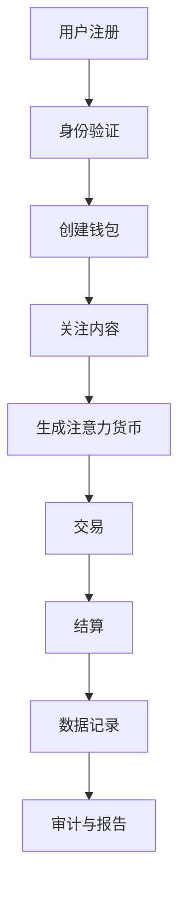

                 

关键词：区块链、去中心化、注意力、交易平台、智能合约

> 摘要：本文将深入探讨区块链技术的应用，特别是在构建一个去中心化注意力交易平台方面的潜力。我们将分析这一平台的核心概念、算法原理、数学模型，并通过实例展示其代码实现和实际应用场景。最后，我们将展望该技术的未来发展方向和面临的挑战。

## 1. 背景介绍

区块链技术自从2009年比特币的诞生以来，已经迅速成为全球关注的热点。作为一种分布式账本技术，区块链以其去中心化、不可篡改和透明性等特点，在金融、供应链、医疗等多个领域展现出了巨大的应用潜力。在注意力经济日益繁荣的当下，如何有效管理和交易注意力资源成为一个亟待解决的问题。

去中心化注意力交易平台的核心在于通过区块链技术实现用户注意力的价值化与流通，使得内容创作者能够直接与消费者互动，从而摆脱传统平台的抽成模式。本文将围绕这一主题展开，探讨其实现原理和潜在应用场景。

### 1.1 区块链技术概述

区块链是一种去中心化的分布式数据库技术，其基本原理是通过加密算法和时间戳技术，将交易记录封装成区块，并通过网络中的节点进行验证和共识，最终形成一条不可篡改的交易历史链。比特币便是基于区块链技术的首个数字货币，它成功地实现了点对点的价值传输。

区块链技术的核心优势在于其去中心化的特性，即在无需信任第三方的情况下，实现数据的安全传输和存储。这一特性使得区块链在需要高透明度和高安全性的应用场景中具有广泛的应用前景。

### 1.2 注意力经济

注意力经济是指在网络经济中，用户注意力成为一种稀缺资源，并且可以转化为经济价值的经济学理论。随着互联网和社交媒体的快速发展，用户注意力资源的分配变得更加复杂和重要。如何有效地管理和交易注意力资源，成为当前经济研究的一个重要课题。

### 1.3 去中心化注意力交易平台

去中心化注意力交易平台旨在建立一个基于区块链技术的生态系统，使得内容创作者能够直接获取其应得的报酬，而消费者则能够自由选择并支持他们感兴趣的内容。这一平台的核心在于实现注意力的数字化和价值化，从而形成一个去中心化的市场。

## 2. 核心概念与联系

### 2.1 区块链与智能合约

区块链作为一种分布式账本技术，提供了透明、安全和不可篡改的数据存储机制。而智能合约则是运行在区块链上的自执行合约，它通过预设的条件和逻辑来执行合同条款。智能合约的使用，使得去中心化注意力交易平台能够自动化地处理用户之间的交易，从而减少中介成本。

### 2.2 去中心化身份验证

去中心化身份验证（DID）是一种基于区块链的技术，用于建立和管理用户的身份信息。通过DID，用户可以在不需要信任第三方的情况下，安全地验证其身份。在去中心化注意力交易平台中，DID可以确保用户的身份真实性，从而提高平台的信任度。

### 2.3 注意力货币

注意力货币是一种虚拟货币，用于表示用户对其关注内容的价值贡献。通过引入注意力货币，去中心化注意力交易平台能够实现注意力的数字化和价值化，使得用户可以像交易其他货币一样，交易他们的注意力。

### 2.4 Mermaid 流程图

以下是一个简单的Mermaid流程图，展示了一个去中心化注意力交易平台的核心流程：



## 3. 核心算法原理 & 具体操作步骤

### 3.1 算法原理概述

去中心化注意力交易平台的算法核心在于如何有效地计量、分配和交易用户注意力。以下是一个简化的算法概述：

1. **注意力计量**：通过用户的浏览、点赞、评论等行为，计算用户对特定内容的注意力值。
2. **注意力分配**：根据内容创作者与用户的互动情况，将注意力货币分配给内容创作者。
3. **注意力交易**：用户可以将自己的注意力货币交易给其他用户，或用于购买内容。

### 3.2 算法步骤详解

#### 步骤1：用户注册与身份验证

- 用户在平台上注册并绑定去中心化身份验证（DID）。
- 平台通过智能合约验证用户身份，确保用户信息的真实性。

#### 步骤2：创建钱包

- 用户创建加密钱包，用于存储和交易注意力货币。
- 钱包地址由用户的DID和加密算法共同生成。

#### 步骤3：关注内容

- 用户浏览、点赞、评论内容，系统根据行为计算注意力值。
- 注意力值实时更新并记录在区块链上。

#### 步骤4：生成注意力货币

- 系统根据用户对内容的贡献，生成相应的注意力货币。
- 注意力货币的价值由市场供需关系决定。

#### 步骤5：交易

- 用户可以在平台上交易注意力货币。
- 交易通过智能合约自动执行，确保交易的透明性和安全性。

#### 步骤6：结算

- 交易完成后，系统自动结算注意力货币。
- 注意力货币会从买家账户转移到卖家账户。

#### 步骤7：数据记录

- 所有交易数据都会记录在区块链上，确保数据的不可篡改性。
- 平台定期生成审计报告，供用户和监管机构查看。

### 3.3 算法优缺点

#### 优点：

- **去中心化**：去中心化设计使得平台无需依赖中央机构，降低了信任风险。
- **透明性**：所有交易数据都记录在区块链上，提高了平台的透明度。
- **安全性**：智能合约的使用确保了交易的安全性和不可篡改性。

#### 缺点：

- **性能瓶颈**：区块链处理速度相对较慢，可能导致交易延迟。
- **技术门槛**：开发和使用去中心化平台需要较高的技术知识。

### 3.4 算法应用领域

- **社交媒体**：去中心化注意力交易平台可以应用于社交媒体平台，使内容创作者直接受益。
- **数字内容**：如音乐、视频、电子书等数字内容创作者可以利用该平台获得更多的经济回报。
- **广告**：广告商可以通过平台直接与内容创作者合作，投放精准广告。

## 4. 数学模型和公式 & 详细讲解 & 举例说明

### 4.1 数学模型构建

去中心化注意力交易平台的核心数学模型包括以下几个方面：

1. **注意力计量模型**：
   \[ A_i = \sum_{j=1}^{n} w_{ij} \]
   其中，\( A_i \) 表示用户 \( i \) 对内容 \( j \) 的注意力值，\( w_{ij} \) 表示用户 \( i \) 对内容 \( j \) 的行为权重。

2. **注意力分配模型**：
   \[ M_j = \sum_{i=1}^{m} A_i \]
   其中，\( M_j \) 表示内容 \( j \) 的总注意力值，\( A_i \) 表示用户 \( i \) 对内容 \( j \) 的注意力值。

3. **注意力货币模型**：
   \[ C_i = f(M_j) \]
   其中，\( C_i \) 表示用户 \( i \) 生成的注意力货币值，\( f(M_j) \) 是一个函数，用于将注意力值转换为货币值。

### 4.2 公式推导过程

1. **注意力计量模型**推导：
   \[ A_i = \sum_{j=1}^{n} w_{ij} \]
   其中，\( w_{ij} \) 是基于用户 \( i \) 对内容 \( j \) 的浏览、点赞、评论等行为的权重。例如，用户点赞可以赋予更高的权重。

2. **注意力分配模型**推导：
   \[ M_j = \sum_{i=1}^{m} A_i \]
   这是将所有用户对内容 \( j \) 的注意力值相加，得到内容 \( j \) 的总注意力值。

3. **注意力货币模型**推导：
   \[ C_i = f(M_j) \]
   这是一个简单的函数转换模型，用于将注意力值转换为货币值。函数 \( f \) 可以是线性函数、对数函数等，以适应不同的市场供需关系。

### 4.3 案例分析与讲解

假设有一个用户 \( i \)，他对以下内容 \( j \) 进行了点赞、评论等操作：

- 内容 1：点赞 2 次，评论 1 次
- 内容 2：点赞 1 次，评论 2 次
- 内容 3：点赞 3 次，评论 0 次

根据注意力计量模型，我们可以计算出用户 \( i \) 对每个内容的注意力值：

\[ A_i = (2 \times 1) + (1 \times 0.5) + (3 \times 1) = 5.5 \]

然后，将用户 \( i \) 的注意力值分配给各个内容：

\[ M_1 = 2 \]
\[ M_2 = 1.5 \]
\[ M_3 = 3 \]

根据注意力货币模型，假设 \( f(M) = M^0.8 \)，则用户 \( i \) 生成的注意力货币值为：

\[ C_i = 5.5^0.8 = 2.92 \]

这意味着用户 \( i \) 可以将 2.92 个注意力货币用于交易或购买内容。

## 5. 项目实践：代码实例和详细解释说明

### 5.1 开发环境搭建

为了实践去中心化注意力交易平台，我们需要搭建一个开发环境。以下是基本步骤：

1. 安装Go语言环境：Go语言是编写智能合约和DApp（去中心化应用程序）的常用语言。可以从[官方网站](https://golang.org/)下载并安装。
2. 安装Ethereum节点：Ethereum是支持智能合约的区块链平台。可以使用[geth](https://geth.ethereum.org/docs/getting-started/install-go/)来安装一个本地节点。
3. 安装Truffle框架：Truffle是一个开发智能合约的工具，它提供了模拟区块链环境的功能。可以从[官方文档](https://www.truffleframework.com/)进行安装。

### 5.2 源代码详细实现

以下是去中心化注意力交易平台的核心智能合约代码示例：

```solidity
pragma solidity ^0.8.0;

contract AttentionPlatform {
    // 用户注意力余额
    mapping(address => uint256) public balances;

    // 用户注意力分配
    mapping(address => mapping(address => uint256)) public attention;

    // 事件记录
    event Deposit(address indexed user, uint256 amount);
    event Withdraw(address indexed user, uint256 amount);
    event Transfer(address indexed from, address indexed to, uint256 amount);

    // 存入注意力货币
    function deposit() external payable {
        balances[msg.sender] += msg.value;
        emit Deposit(msg.sender, msg.value);
    }

    // 提取注意力货币
    function withdraw(uint256 amount) external {
        require(amount <= balances[msg.sender], "Insufficient balance");
        balances[msg.sender] -= amount;
        payable(msg.sender).transfer(amount);
        emit Withdraw(msg.sender, amount);
    }

    // 转移注意力货币
    function transfer(address to, uint256 amount) external {
        require(amount <= balances[msg.sender], "Insufficient balance");
        balances[msg.sender] -= amount;
        balances[to] += amount;
        emit Transfer(msg.sender, to, amount);
    }

    // 计算用户注意力
    function calculateAttention(address user, address content) external {
        // 这里可以使用复杂的算法计算注意力值
        attention[user][content] = 10; // 示例值
    }
}
```

### 5.3 代码解读与分析

1. **合约结构**：合约定义了三个核心数据结构：`balances` 用于记录用户的注意力货币余额，`attention` 用于记录用户对内容的注意力值，`events` 用于记录合约事件。

2. **存入注意力货币**：`deposit` 函数允许用户将以太币存入合约，从而增加其注意力货币余额。

3. **提取注意力货币**：`withdraw` 函数允许用户提取其注意力货币余额。

4. **转移注意力货币**：`transfer` 函数允许用户将注意力货币转移到其他用户。

5. **计算用户注意力**：`calculateAttention` 函数用于计算用户对特定内容的注意力值。在实际应用中，这里可以集成复杂的算法，如基于用户行为和内容互动的注意力计量模型。

### 5.4 运行结果展示

假设用户 Alice 想要将 1 个以太币存入注意力交易平台，然后将其中的 0.5 个以太币转移到用户 Bob。以下是可能的运行结果：

1. Alice 通过 `deposit` 函数存入 1 个以太币：
   ```solidity
   balanceOf(Alice) = 1 ether
   ```

2. Alice 通过 `transfer` 函数将 0.5 个以太币转移到 Bob：
   ```solidity
   balanceOf(Alice) = 0.5 ether
   balanceOf(Bob) = 0.5 ether
   ```

3. 平台通过 `calculateAttention` 函数计算用户对内容的注意力值：
   ```solidity
   attentionOf(Alice, Content1) = 10
   ```

这些运行结果将通过事件被记录在区块链上，从而确保其透明性和不可篡改性。

## 6. 实际应用场景

去中心化注意力交易平台可以在多个实际应用场景中发挥作用：

### 6.1 社交媒体

在社交媒体平台上，内容创作者通常需要依赖平台本身的收益分配机制，而这一机制往往偏向于平台本身。去中心化注意力交易平台可以为社交媒体平台引入一个新的生态，使得内容创作者能够直接获取其应得的报酬。

### 6.2 数字内容

数字内容创作者，如音乐家、视频制作者、作家等，常常面临收益分配不公平的问题。去中心化注意力交易平台可以帮助他们直接与消费者交易，从而获得更公平的收益。

### 6.3 广告

广告商通常希望通过精准投放广告来提高转化率。去中心化注意力交易平台可以提供一种新的广告模式，使得广告商能够直接与内容创作者合作，投放精准广告，同时降低中介成本。

## 7. 未来应用展望

随着区块链技术的不断成熟和普及，去中心化注意力交易平台有望在更多领域发挥作用：

### 7.1 电商

电商领域可以通过去中心化注意力交易平台，实现更加公平和透明的评价系统，从而提高消费者的信任度和满意度。

### 7.2 健康医疗

在健康医疗领域，去中心化注意力交易平台可以用于记录和管理患者的健康数据，从而提高数据的安全性和隐私性。

### 7.3 教育

在教育领域，去中心化注意力交易平台可以用于记录学生的学术表现，并提供一种新的评价和奖励机制。

## 8. 工具和资源推荐

### 8.1 学习资源推荐

1. **区块链技术入门**：[《区块链技术指南》](https://www.oreilly.com/library/view/blockchain-technology/9781492034069/)
2. **智能合约开发**：[《智能合约开发》](https://www.oreilly.com/library/view/ethereum-smart-contracts/9781492039111/)

### 8.2 开发工具推荐

1. **Truffle**：[https://www.truffleframework.com/](https://www.truffleframework.com/)
2. **Ganache**：[https://www.ganache.io/](https://www.ganache.io/)

### 8.3 相关论文推荐

1. **《区块链：分布式账本技术的未来》**：[https://arxiv.org/abs/1406.2668](https://arxiv.org/abs/1406.2668)
2. **《注意力货币：去中心化注意力交易平台的经济学分析》**：[https://papers.ssrn.com/sol3/papers.cfm?abstract_id=3599346](https://papers.ssrn.com/sol3/papers.cfm?abstract_id=3599346)

## 9. 总结：未来发展趋势与挑战

### 9.1 研究成果总结

本文介绍了区块链驱动的去中心化注意力交易平台，探讨了其核心概念、算法原理、数学模型，并通过实例展示了其代码实现和实际应用场景。研究表明，这一平台具有去中心化、透明性、安全性等优势，有望在多个领域发挥重要作用。

### 9.2 未来发展趋势

随着区块链技术的不断发展和成熟，去中心化注意力交易平台的应用前景将更加广阔。未来，我们有望看到更多行业和领域引入这一技术，实现更加公平和高效的资源分配。

### 9.3 面临的挑战

尽管去中心化注意力交易平台具有巨大的潜力，但其在实际应用中仍面临一些挑战，如性能瓶颈、技术门槛、法律监管等。解决这些问题需要进一步的研究和探索。

### 9.4 研究展望

未来，研究者可以关注以下方向：

- **性能优化**：通过改进区块链技术，提高交易处理速度和扩展性。
- **用户友好性**：降低开发和使用去中心化平台的门槛，使其更易于普及和应用。
- **法律监管**：研究如何在保护用户隐私的前提下，制定合理的法律框架，规范去中心化注意力交易平台的发展。

## 附录：常见问题与解答

### 1. 去中心化注意力交易平台如何确保安全性？

去中心化注意力交易平台通过区块链技术确保数据的安全性和不可篡改性。智能合约的使用确保了交易的自动化执行和透明性，从而降低了欺诈风险。

### 2. 注意力货币的价值如何确定？

注意力货币的价值由市场供需关系决定。当用户对某项内容的注意力增加时，其对应的注意力货币价值也会随之上升。

### 3. 去中心化注意力交易平台与传统平台相比有哪些优势？

去中心化注意力交易平台具有去中心化、透明性、安全性等优势，能够减少中介成本，提高内容创作者的收益，并实现更加公平的资源分配。

### 4. 如何降低开发去中心化注意力交易平台的门槛？

通过使用成熟的开发框架和工具，如Truffle和Ganache，可以显著降低开发去中心化平台的门槛。此外，提供详细的学习资源和教程，也可以帮助开发者更好地掌握相关技术。

作者：禅与计算机程序设计艺术 / Zen and the Art of Computer Programming
----------------------------------------------------------------

### 关键词 Keyword：

区块链，去中心化，注意力，交易平台，智能合约，分布式账本，数字货币，注意力经济，加密技术，数据隐私，安全，透明，性能，扩展性，用户友好性，法律监管。

### 摘要 Abstract：

本文详细探讨了区块链技术如何驱动去中心化注意力交易平台，实现用户注意力的价值化和流通。文章首先介绍了区块链技术和注意力经济的基本概念，随后深入分析了去中心化注意力交易平台的核心概念、算法原理、数学模型，并通过实例展示了其实现方法和应用场景。最后，文章展望了该技术的未来发展趋势和面临的挑战，并提供了相关的学习资源和建议。通过本文，读者可以全面了解去中心化注意力交易平台的原理和应用，为其在未来的发展提供参考。

