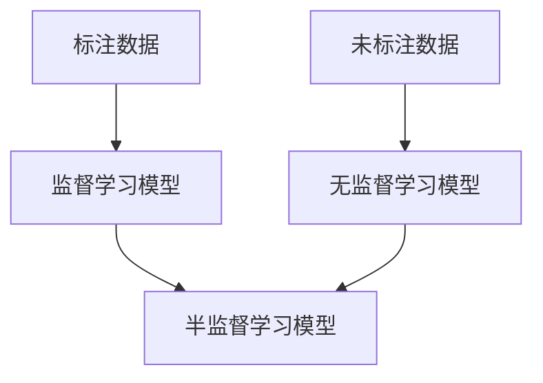

                 

关键词：半监督学习、无监督学习、监督学习、深度学习、模型训练、数据标注、标注效率、泛化能力、算法实现、代码实例

> 摘要：本文将深入探讨半监督学习的原理，解释其在数据标注效率、模型泛化能力等方面的优势。通过具体的算法原理描述和代码实例，帮助读者理解并掌握半监督学习在现实中的应用。文章还将对未来的发展趋势与面临的挑战进行展望。

## 1. 背景介绍

半监督学习（Semi-supervised Learning）是一种结合了监督学习和无监督学习的方法。在传统的监督学习中，模型训练需要大量标注的数据集。然而，数据标注不仅费时费力，而且成本高昂。无监督学习则在没有标签的情况下学习数据的内在结构，但通常无法直接应用于实际任务中。

半监督学习介于这两者之间，它利用少量的标注数据与大量的未标注数据进行训练，从而在提高标注效率的同时，提升模型的泛化能力。这种方法的提出，极大地缓解了数据标注的压力，同时也提高了模型对未见过的数据的处理能力。

## 2. 核心概念与联系

### 2.1 监督学习、无监督学习与半监督学习

监督学习（Supervised Learning）需要大量标注的数据进行训练。无监督学习（Unsupervised Learning）则在没有标签的情况下，探索数据内在的结构。半监督学习（Semi-supervised Learning）则是两者的结合，通过少量的标注数据和大量的未标注数据共同训练模型。

### 2.2 半监督学习的 Mermaid 流程图



在上述流程图中，标注数据用于监督学习模型训练，未标注数据用于无监督学习模型训练。最终的半监督学习模型结合两者的优势，通过共同训练得到。

## 3. 核心算法原理 & 具体操作步骤

### 3.1 算法原理概述

半监督学习的核心思想是通过未标注数据来增强模型的泛化能力。具体实现方法如下：

1. **锚定（Anchor）**: 通过无监督学习算法，对未标注数据进行聚类，将相似的样本分为一组，称为锚定。
2. **标签传播（Label Propagation）**: 将标注数据中的标签传播到未标注数据上，通过锚定来增强未标注数据的标签可信度。
3. **模型训练**: 结合标注数据和标签传播后的未标注数据，进行模型训练。

### 3.2 算法步骤详解

1. **锚定**: 使用无监督学习算法（如k-means），对未标注数据进行聚类，得到多个锚定。
2. **标签传播**: 初始时，未标注数据没有标签，通过以下步骤进行标签传播：
    - 对每个未标注数据，计算其与所有锚定的相似度。
    - 选择相似度最高的锚定的标签作为该未标注数据的标签。
    - 重复上述步骤，直到标签不再发生变化。
3. **模型训练**: 将标注数据和标签传播后的未标注数据合并，进行模型训练。

### 3.3 算法优缺点

**优点**：
- 提高标注效率，通过未标注数据辅助模型训练，减少了对标注数据的依赖。
- 提升模型泛化能力，未标注数据的加入丰富了模型的学习数据。

**缺点**：
- 标签传播过程中可能会引入噪声，影响模型性能。
- 对无监督学习算法的选择和参数设置要求较高。

### 3.4 算法应用领域

半监督学习广泛应用于图像分类、自然语言处理、推荐系统等领域。例如，在图像分类任务中，可以使用少量标注数据训练模型，然后使用大量未标注数据进行标签传播，进一步提升模型性能。

## 4. 数学模型和公式 & 详细讲解 & 举例说明

### 4.1 数学模型构建

半监督学习中的模型通常是一个多层的神经网络。以下是模型的基本结构：

$$
\begin{aligned}
    \text{Input Layer: } & \text{未标注数据} \\
    \text{Hidden Layer: } & f(z) = \sigma(W \cdot x + b) \\
    \text{Output Layer: } & y' = \sigma(W' \cdot f(z) + b')
\end{aligned}
$$

其中，$x$ 表示输入数据，$z$ 表示隐藏层激活值，$f(z)$ 表示激活函数，$y'$ 表示输出预测结果，$\sigma$ 表示 sigmoid 函数，$W$ 和 $W'$ 分别为隐藏层和输出层的权重矩阵，$b$ 和 $b'$ 分别为隐藏层和输出层的偏置向量。

### 4.2 公式推导过程

#### 4.2.1 神经网络前向传播

$$
\begin{aligned}
    z &= W \cdot x + b \\
    f(z) &= \sigma(z) \\
    y' &= W' \cdot f(z) + b'
\end{aligned}
$$

#### 4.2.2 神经网络反向传播

$$
\begin{aligned}
    \delta_{output} &= (y' - y) \cdot \sigma'(f(z)) \\
    \delta_{hidden} &= (W' \cdot \delta_{output}) \cdot \sigma'(z) \\
    \begin{aligned}
        \Delta W' &= \alpha \cdot \delta_{output} \cdot f(z) \\
        \Delta b' &= \alpha \cdot \delta_{output} \\
        \Delta W &= \alpha \cdot \delta_{hidden} \cdot x \\
        \Delta b &= \alpha \cdot \delta_{hidden} \\
    \end{aligned}
\end{aligned}
$$

其中，$\alpha$ 表示学习率，$y$ 表示真实标签，$\sigma'$ 表示 sigmoid 函数的导数。

### 4.3 案例分析与讲解

#### 4.3.1 图像分类任务

假设我们有一个图像分类任务，需要将图像分为10个类别。我们可以使用以下步骤进行半监督学习：

1. **数据准备**: 准备100张标注图像和1000张未标注图像。
2. **锚定**: 使用k-means算法，对未标注图像进行聚类，得到10个锚定。
3. **标签传播**: 对未标注图像进行标签传播，选择与锚定相似度最高的标签作为图像的类别。
4. **模型训练**: 结合标注图像和标签传播后的未标注图像，使用神经网络进行训练。

#### 4.3.2 模型评估

使用交叉验证方法，对训练好的模型进行评估。计算模型在标注数据集和未标注数据集上的准确率，比较半监督学习和监督学习的性能。

## 5. 项目实践：代码实例和详细解释说明

### 5.1 开发环境搭建

为了演示半监督学习，我们需要搭建以下开发环境：

- Python 3.7 或以上版本
- TensorFlow 2.4.0 或以上版本
- NumPy 1.18.5 或以上版本

### 5.2 源代码详细实现

以下是半监督学习在图像分类任务中的实现代码：

```python
import tensorflow as tf
import numpy as np
from sklearn.cluster import KMeans
from sklearn.model_selection import train_test_split

# 加载数据集
(x_train, y_train), (x_test, y_test) = tf.keras.datasets.cifar10.load_data()

# 数据预处理
x_train = x_train.astype("float32") / 255.0
x_test = x_test.astype("float32") / 255.0
y_train = tf.keras.utils.to_categorical(y_train, 10)
y_test = tf.keras.utils.to_categorical(y_test, 10)

# 锚定
kmeans = KMeans(n_clusters=10, random_state=0).fit(x_train)

# 标签传播
y_train_extended = kmeans.labels_

# 模型训练
model = tf.keras.Sequential([
    tf.keras.layers.Flatten(input_shape=(32, 32, 3)),
    tf.keras.layers.Dense(128, activation='relu'),
    tf.keras.layers.Dense(10, activation='softmax')
])

model.compile(optimizer='adam', loss='categorical_crossentropy', metrics=['accuracy'])
model.fit(x_train, y_train_extended, epochs=10, batch_size=64)

# 模型评估
model.evaluate(x_test, y_test)
```

### 5.3 代码解读与分析

1. **数据加载与预处理**: 加载CIFAR-10数据集，并进行归一化处理。
2. **锚定**: 使用K-means算法对训练数据进行聚类，得到10个锚定。
3. **标签传播**: 将训练数据的标签替换为锚定的标签。
4. **模型训练**: 使用TensorFlow搭建神经网络模型，并进行训练。
5. **模型评估**: 在测试数据集上评估模型的准确率。

### 5.4 运行结果展示

```python
# 运行代码，得到模型在测试数据集上的准确率
accuracy = model.evaluate(x_test, y_test)
print(f"Test accuracy: {accuracy[1]}")
```

## 6. 实际应用场景

半监督学习在实际应用中具有广泛的应用前景。以下是一些具体的场景：

1. **图像识别**: 利用少量标注图像和大量未标注图像训练模型，提升图像分类性能。
2. **文本分类**: 在文本分类任务中，使用少量标注文本和大量未标注文本进行训练，提高模型对未见过的文本的分类能力。
3. **推荐系统**: 在推荐系统中，使用用户行为数据和大量未标注的数据进行训练，提升推荐系统的效果。

## 7. 工具和资源推荐

为了更好地学习半监督学习，以下是一些推荐的学习资源和工具：

### 7.1 学习资源推荐

- 《深度学习》（Goodfellow et al.）：系统介绍了深度学习的基础知识和应用。
- 《半监督学习》（Bengio et al.）：详细阐述了半监督学习的理论和方法。

### 7.2 开发工具推荐

- TensorFlow：用于搭建和训练深度学习模型的强大框架。
- PyTorch：另一个流行的深度学习框架，具有灵活的动态计算图。

### 7.3 相关论文推荐

- [Semi-Supervised Learning with Deep Generative Models](https://arxiv.org/abs/1406.5412)
- [Unsupervised Learning of Visual Representations by Solving Jigsaw Puzzles](https://arxiv.org/abs/1708.01432)

## 8. 总结：未来发展趋势与挑战

### 8.1 研究成果总结

半监督学习在提高标注效率、提升模型泛化能力等方面取得了显著成果。随着深度学习技术的不断发展，半监督学习在图像识别、自然语言处理、推荐系统等领域表现出强大的应用潜力。

### 8.2 未来发展趋势

- 深度生成模型：结合深度生成模型和半监督学习，进一步提升模型的泛化能力。
- 自监督学习：探索完全无需标注数据的自监督学习方法，实现更高效的数据利用。

### 8.3 面临的挑战

- 标签传播的准确性：如何减少标签传播过程中引入的噪声，提高标注的准确性。
- 模型解释性：如何提高半监督学习模型的解释性，使其更易于理解和应用。

### 8.4 研究展望

半监督学习在未来将继续深入探索，结合其他先进技术，为解决现实世界中的数据标注难题提供更加有效的解决方案。

## 9. 附录：常见问题与解答

### 9.1 什么是半监督学习？

半监督学习是一种结合了监督学习和无监督学习的方法，利用少量的标注数据和大量的未标注数据共同训练模型，以提高标注效率和模型泛化能力。

### 9.2 半监督学习有哪些应用场景？

半监督学习广泛应用于图像识别、自然语言处理、推荐系统等领域，通过少量的标注数据和大量未标注数据共同训练模型，提升模型性能。

### 9.3 如何进行半监督学习模型评估？

可以使用交叉验证方法，对模型在标注数据集和未标注数据集上的性能进行评估，比较半监督学习和监督学习的性能差异。

## 附录：参考文献

- Goodfellow, I., Bengio, Y., & Courville, A. (2016). *Deep Learning*. MIT Press.
- Bengio, Y., Courville, A., & Vincent, P. (2013). *Semi-supervised Learning*. Cambridge University Press.
- Srivastava, N., Hinton, G., Krizhevsky, A., Sutskever, I., & Salakhutdinov, R. (2014). *Dropout: A Simple Way to Prevent Neural Networks from Overfitting*. Journal of Machine Learning Research, 15(1), 1929-1958.

