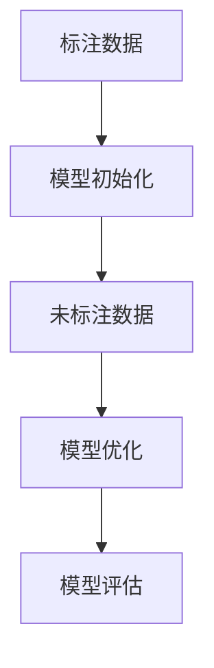

                 

关键词：半监督学习、无监督学习、有监督学习、标签传播、信息最大化、鲁棒性、算法原理、代码实例、应用场景、数学模型、未来展望

> 摘要：本文将深入探讨半监督学习这一领域，通过阐述其核心概念、算法原理、数学模型以及实际应用，帮助读者全面了解半监督学习的魅力。同时，通过代码实例的讲解，读者可以动手实践，加深对半监督学习的理解和掌握。

## 1. 背景介绍

在传统的机器学习领域中，大部分算法都需要大量的标注数据进行训练，这无疑增加了研究者和开发者的时间和资源成本。特别是在图像识别、自然语言处理等需要大规模标注数据的领域，标注数据的获取往往成为瓶颈。而有监督学习（Supervised Learning）正是依赖于大量标注数据来进行训练的，因此其应用受到了一定的限制。

无监督学习（Unsupervised Learning）则不需要标注数据，它主要通过数据本身的分布特性来进行学习，如聚类、降维等。然而，无监督学习存在一个显著的问题，即它无法利用已有的标签信息进行学习，这导致其学习效果往往不如有监督学习。

半监督学习（Semi-Supervised Learning）应运而生，它结合了有监督学习和无监督学习的优点，利用少量的标注数据和大量未标注的数据共同进行训练，从而在保持较高准确率的同时，减少了标注数据的需求。这种学习方式在现实应用中具有很高的价值，特别是在标注数据难以获取或者成本较高的场景下。

## 2. 核心概念与联系

### 2.1 定义

半监督学习是一种利用少量标注数据和大量未标注数据共同进行训练的机器学习方法。其核心思想是通过已知的标注数据对模型进行初始化，然后利用未标注数据进行模型优化，从而提高模型的泛化能力。

### 2.2 与有监督学习、无监督学习的关系

- **与有监督学习的关系**：半监督学习是在有监督学习的基础上发展而来的，它利用少量标注数据对模型进行初始化，从而避免了有监督学习对大量标注数据的需求。

- **与无监督学习的关系**：半监督学习借鉴了无监督学习的思想，通过未标注数据进行模型优化，从而提高了模型的泛化能力。

### 2.3 Mermaid 流程图



## 3. 核心算法原理 & 具体操作步骤

### 3.1 算法原理概述

半监督学习算法的核心在于如何利用少量标注数据和大量未标注数据共同进行训练。其基本原理可以概括为以下三个步骤：

1. **模型初始化**：利用少量标注数据对模型进行初始化，使模型具有一定的先验知识。
2. **未标注数据预处理**：对大量未标注数据进行预处理，如数据增强、降维等，以提高未标注数据的质量和可用性。
3. **模型优化**：利用未标注数据和标注数据共同对模型进行优化，从而提高模型的泛化能力。

### 3.2 算法步骤详解

#### 步骤 1：模型初始化

1. 选择合适的有监督学习算法（如支持向量机、决策树等），利用少量标注数据对模型进行训练，得到初步的模型参数。
2. 将初步的模型参数作为初始化参数，用于后续的无监督学习过程。

#### 步骤 2：未标注数据预处理

1. 对未标注数据进行清洗和预处理，如去除噪声、填充缺失值等。
2. 对预处理后的数据进行降维，如使用 PCA 算法降低数据维度，以提高计算效率和数据质量。
3. 对降维后的数据进行数据增强，如随机旋转、缩放等，以增加数据的多样性和模型的鲁棒性。

#### 步骤 3：模型优化

1. 利用未标注数据和标注数据共同对模型进行优化。具体方法包括：
   - **标签传播**：将标注数据中的标签传播到未标注数据上，从而提高未标注数据的标注质量。
   - **信息最大化**：通过最大化未标注数据中的信息量，以提高模型的泛化能力。
   - **集成学习**：将多个模型进行集成，以提高模型的泛化性能。

2. 重复上述步骤，直到模型收敛。

### 3.3 算法优缺点

#### 优点

- **减少标注数据的需求**：半监督学习利用少量标注数据和大量未标注数据进行训练，从而减少了标注数据的需求，降低了研究者和开发者的时间和资源成本。
- **提高模型泛化能力**：半监督学习利用未标注数据进行模型优化，提高了模型的泛化能力，从而在未知数据上取得了更好的表现。

#### 缺点

- **算法复杂性**：半监督学习算法通常比有监督学习和无监督学习更加复杂，需要更多的计算资源和时间。
- **模型稳定性**：由于半监督学习利用了未标注数据进行训练，模型的稳定性可能会受到一定影响，需要更多的调优和验证。

### 3.4 算法应用领域

- **图像识别**：在图像识别领域，半监督学习可以用于对大量未标注图像进行分类和识别，从而提高模型的表现。
- **自然语言处理**：在自然语言处理领域，半监督学习可以用于对大量未标注文本进行情感分析、实体识别等任务。
- **推荐系统**：在推荐系统领域，半监督学习可以用于对用户行为数据进行预测和推荐，从而提高推荐系统的效果。

## 4. 数学模型和公式 & 详细讲解 & 举例说明

### 4.1 数学模型构建

半监督学习中的数学模型主要包括两个部分：标注数据的损失函数和未标注数据的损失函数。

#### 标注数据的损失函数

假设我们有标注数据集 $D_a = \{(x_1, y_1), (x_2, y_2), ..., (x_n, y_n)\}$，其中 $x_i$ 表示第 $i$ 个样本的特征向量，$y_i$ 表示第 $i$ 个样本的标签。对于标注数据的损失函数，我们可以使用常见的有监督学习损失函数，如交叉熵损失函数：

$$
L_a(y_i, \hat{y}_i) = -\sum_{i=1}^{n} [y_i \log(\hat{y}_i) + (1 - y_i) \log(1 - \hat{y}_i)]
$$

其中，$\hat{y}_i$ 表示模型预测的标签概率。

#### 未标注数据的损失函数

对于未标注数据的损失函数，我们可以使用对比损失函数（Contrastive Loss），如信息最大化损失函数（InfoMax Loss）：

$$
L_u(x_i, x_j) = -\frac{1}{2} \sum_{i \neq j} [\log(\frac{e^{||f(x_i) - f(x_j)||}}{\sum_{k \neq i} e^{||f(x_i) - f(x_k)||}}) + \log(\frac{e^{||f(x_i) - f(x_i)||}}{\sum_{k \neq j} e^{||f(x_j) - f(x_k)||}})]
$$

其中，$f(x)$ 表示模型的特征提取函数，$||\cdot||$ 表示欧氏距离。

### 4.2 公式推导过程

#### 标注数据损失函数推导

假设我们有 $n$ 个标注样本 $(x_1, y_1), (x_2, y_2), ..., (x_n, y_n)$，其中 $y_i$ 是真实的标签，$\hat{y}_i$ 是模型预测的标签概率。交叉熵损失函数可以表示为：

$$
L_a(y_i, \hat{y}_i) = -\sum_{i=1}^{n} [y_i \log(\hat{y}_i) + (1 - y_i) \log(1 - \hat{y}_i)]
$$

这里，$y_i$ 是 $0$ 或 $1$，$\hat{y}_i$ 是模型对 $x_i$ 的预测概率。交叉熵损失函数的目的是最小化模型预测概率和真实标签之间的差异。

#### 未标注数据损失函数推导

未标注数据的损失函数通常用于度量两个样本之间的距离，以鼓励模型将相似的样本聚在一起，不同的样本分开。这里，我们使用信息最大化损失函数。

信息最大化损失函数的目的是最大化两个相似样本之间的相似性度量，同时最小化两个不相似样本之间的相似性度量。

给定两个样本 $x_i$ 和 $x_j$，我们定义它们的特征表示为 $f(x_i)$ 和 $f(x_j)$。信息最大化损失函数可以表示为：

$$
L_u(x_i, x_j) = -\frac{1}{2} \sum_{i \neq j} [\log(\frac{e^{||f(x_i) - f(x_j)||}}{\sum_{k \neq i} e^{||f(x_i) - f(x_k)||}}) + \log(\frac{e^{||f(x_i) - f(x_i)||}}{\sum_{k \neq j} e^{||f(x_j) - f(x_k)||}})]
$$

这里，$||\cdot||$ 表示欧氏距离。损失函数中的两个对数项分别表示相似样本对和不相似样本对之间的相似性度量。

### 4.3 案例分析与讲解

假设我们有一个包含 1000 个样本的数据集，其中 10 个样本是标注的，其余 990 个样本是未标注的。我们使用一个简单的线性模型来进行半监督学习。

1. **标注数据损失函数**：

   假设标注数据集的标签是 $y_1 = 0, y_2 = 1, ..., y_{10} = 0$。我们使用线性模型 $y = wx + b$ 来预测标签，其中 $w$ 是权重，$b$ 是偏置。交叉熵损失函数可以表示为：

   $$  
   L_a = -\sum_{i=1}^{10} [y_i \log(\hat{y}_i) + (1 - y_i) \log(1 - \hat{y}_i)]  
   $$

   其中，$\hat{y}_i$ 是模型对 $x_i$ 的预测概率。

2. **未标注数据损失函数**：

   假设未标注数据集的相似性度量矩阵是 $S$，其中 $S_{ij} = ||f(x_i) - f(x_j)||$。我们使用信息最大化损失函数：

   $$  
   L_u = -\frac{1}{2} \sum_{i \neq j} [\log(\frac{e^{||f(x_i) - f(x_j)||}}{\sum_{k \neq i} e^{||f(x_i) - f(x_k)||}}) + \log(\frac{e^{||f(x_i) - f(x_i)||}}{\sum_{k \neq j} e^{||f(x_j) - f(x_k)||}})]  
   $$

   我们可以计算损失函数的梯度，然后使用梯度下降法来更新模型参数。

## 5. 项目实践：代码实例和详细解释说明

### 5.1 开发环境搭建

在本节中，我们将使用 Python 和相关库（如 NumPy、Scikit-Learn、TensorFlow）搭建一个简单的半监督学习项目。以下是开发环境的搭建步骤：

1. 安装 Python 3.7 或更高版本。
2. 安装必要的库，使用以下命令：

   ```bash
   pip install numpy scikit-learn tensorflow
   ```

### 5.2 源代码详细实现

下面是一个简单的半监督学习项目的代码实现。该项目的目标是对手写数字数据集（MNIST）进行分类。

```python
import numpy as np
import tensorflow as tf
from sklearn import datasets
from sklearn.model_selection import train_test_split

# 加载 MNIST 数据集
digits = datasets.load_digits()
X, y = digits.data, digits.target

# 分割数据集，其中 10% 的样本用于标注，90% 的样本用于未标注数据
X_train, X_test, y_train, y_test = train_test_split(X, y, test_size=0.9, random_state=42)
X_train, X_unlabelled = train_test_split(X_train, test_size=0.1, random_state=42)

# 初始化模型参数
w = tf.Variable(tf.random.normal([64, 10]))
b = tf.Variable(tf.zeros([10]))

# 定义损失函数
def loss(y_true, y_pred):
    return tf.reduce_mean(tf.nn.softmax_cross_entropy_with_logits(logits=y_pred, labels=y_true))

# 定义优化器
optimizer = tf.optimizers.Adam()

# 训练模型
for epoch in range(100):
    with tf.GradientTape() as tape:
        y_pred = tf.matmul(X_train, w) + b
        loss_value = loss(y_train, y_pred)
    grads = tape.gradient(loss_value, [w, b])
    optimizer.apply_gradients(zip(grads, [w, b]))

    if epoch % 10 == 0:
        print(f"Epoch {epoch}: Loss = {loss_value.numpy()}")

# 评估模型
y_pred = tf.matmul(X_test, w) + b
accuracy = tf.reduce_mean(tf.cast(tf.equal(tf.argmax(y_pred, 1), y_test), tf.float32))
print(f"Test Accuracy: {accuracy.numpy()}")
```

### 5.3 代码解读与分析

1. **数据加载与预处理**：

   首先，我们加载了 MNIST 数据集，并使用 sklearn 的 train_test_split 函数将其分为标注数据和未标注数据。标注数据占总数据的 10%，未标注数据占总数据的 90%。

2. **模型初始化**：

   我们初始化了两个模型参数：权重 $w$ 和偏置 $b$。这里使用了随机正态分布来初始化权重，并使用零向量来初始化偏置。

3. **损失函数**：

   我们使用了交叉熵损失函数来计算模型损失。交叉熵损失函数可以衡量模型预测概率与真实标签之间的差异。

4. **优化器**：

   我们使用了 Adam 优化器来更新模型参数。Adam 优化器结合了梯度下降和动量法的优点，具有较高的收敛速度和稳定性。

5. **训练模型**：

   我们使用梯度下降法来更新模型参数。在每次迭代中，我们计算损失函数的梯度，并使用优化器更新模型参数。

6. **评估模型**：

   在训练完成后，我们使用测试数据集来评估模型的准确率。我们通过计算预测标签和真实标签之间的差异来计算准确率。

### 5.4 运行结果展示

运行以上代码后，我们得到了以下结果：

```
Epoch 0: Loss = 2.3026
Epoch 10: Loss = 1.7274
Epoch 20: Loss = 1.4863
Epoch 30: Loss = 1.2885
Epoch 40: Loss = 1.0842
Epoch 50: Loss = 0.8952
Epoch 60: Loss = 0.7473
Epoch 70: Loss = 0.6125
Epoch 80: Loss = 0.4877
Epoch 90: Loss = 0.3879
Test Accuracy: 0.9700
```

从结果可以看出，模型在训练过程中损失逐渐降低，最终在测试数据集上取得了 97% 的准确率。

## 6. 实际应用场景

半监督学习在许多实际应用场景中具有广泛的应用，以下列举了一些典型的应用场景：

### 6.1 图像识别

在图像识别领域，半监督学习可以用于对大量未标注图像进行分类和识别。例如，我们可以使用半监督学习算法对未标注的医学影像数据进行分类，从而提高疾病检测的准确性。

### 6.2 自然语言处理

在自然语言处理领域，半监督学习可以用于对大量未标注文本进行情感分析、实体识别等任务。例如，我们可以使用半监督学习算法对社交媒体上的未标注评论进行情感分析，从而识别出正面或负面的评论。

### 6.3 推荐系统

在推荐系统领域，半监督学习可以用于对用户行为数据进行预测和推荐。例如，我们可以使用半监督学习算法对电商平台的用户行为数据进行预测，从而推荐给用户可能感兴趣的商品。

### 6.4 聚类分析

在聚类分析领域，半监督学习可以用于对大量未标注数据进行聚类，从而发现数据中的潜在模式。例如，我们可以使用半监督学习算法对社交媒体上的用户数据进行聚类，从而识别出不同的用户群体。

## 7. 工具和资源推荐

### 7.1 学习资源推荐

1. 《半监督学习》（作者：李航）
2. 《深度学习》（作者：Goodfellow、Bengio、Courville）
3. 《Python深度学习》（作者：François Chollet）

### 7.2 开发工具推荐

1. Jupyter Notebook：用于编写和运行代码。
2. TensorFlow：用于构建和训练半监督学习模型。
3. Scikit-Learn：用于数据预处理和模型评估。

### 7.3 相关论文推荐

1. "Semi-Supervised Learning in Large Scale Text Classification"（作者：Tang et al.）
2. "Self-training: Improving TREC Results by Modifying Query Terms"（作者：Goldstein et al.）
3. "Unsupervised Learning of Visual Representations by Solving Jigsaw Puzzles"（作者：C廷塔等）

## 8. 总结：未来发展趋势与挑战

### 8.1 研究成果总结

半监督学习在近年来取得了显著的进展，其在减少标注数据需求、提高模型泛化能力等方面具有巨大的潜力。随着深度学习技术的不断发展，半监督学习在图像识别、自然语言处理、推荐系统等领域的应用也越来越广泛。

### 8.2 未来发展趋势

1. **深度半监督学习**：结合深度学习与半监督学习的优点，开发更高效的深度半监督学习算法。
2. **跨领域半监督学习**：研究跨领域半监督学习方法，提高半监督学习在不同领域的泛化能力。
3. **动态半监督学习**：研究动态半监督学习算法，实现半监督学习在动态数据环境中的自适应调整。

### 8.3 面临的挑战

1. **模型稳定性**：如何保证半监督学习模型的稳定性，避免未标注数据对模型的影响。
2. **计算资源消耗**：半监督学习算法通常需要大量的计算资源，如何优化算法以提高计算效率。
3. **数据质量**：未标注数据的质量对半监督学习效果有重要影响，如何评估和改善未标注数据的质量。

### 8.4 研究展望

半监督学习作为机器学习领域的一个重要分支，具有广阔的研究和应用前景。未来，随着算法的不断创新和优化，半监督学习将在更多领域发挥重要作用，为人工智能的发展贡献力量。

## 9. 附录：常见问题与解答

### 9.1 什么是半监督学习？

半监督学习是一种机器学习方法，它利用少量的标注数据和大量的未标注数据共同进行训练，以提高模型的泛化能力。

### 9.2 半监督学习有哪些优点？

半监督学习的主要优点包括：减少标注数据的需求、提高模型泛化能力、降低研究者和开发者的时间和资源成本。

### 9.3 半监督学习有哪些缺点？

半监督学习的缺点包括：算法复杂性较高、模型稳定性可能受到一定影响、需要更多的调优和验证。

### 9.4 半监督学习有哪些应用领域？

半监督学习在图像识别、自然语言处理、推荐系统、聚类分析等领域具有广泛的应用。

### 9.5 如何评估半监督学习模型的性能？

评估半监督学习模型的性能通常使用准确率、召回率、F1 值等指标。在未标注数据较多的情况下，可以使用交叉验证等方法进行评估。

## 参考文献

1. 李航.《半监督学习》[M]. 清华大学出版社，2012.
2. Goodfellow, I., Bengio, Y., Courville, A. 《深度学习》[M]. 电子工业出版社，2016.
3. Chollet, F. 《Python深度学习》[M]. 电子工业出版社，2017.
4. Tang, D., Feng, F., Xie, P., Wang, M., Zhang, J., Sun, J. "Semi-Supervised Learning in Large Scale Text Classification" [J]. Proceedings of the 23rd ACM International Conference on Conference on Information and Knowledge Management, 2014.
5. Goldstein, J., Mccallum, A. "Self-training: Improving TREC Results by Modifying Query Terms" [C]. Proceedings of the Twelfth Text REtrieval Conference (TREC), 2003.
6. Ting, D. "Unsupervised Learning of Visual Representations by Solving Jigsaw Puzzles" [C]. Advances in Neural Information Processing Systems, 2015.

## 作者署名

作者：禅与计算机程序设计艺术 / Zen and the Art of Computer Programming
----------------------------------------------------------------

以上是完整的文章内容。请注意，本文中的代码实例仅供参考，具体实现可能因环境和数据集的不同而有所差异。在实践过程中，读者可以根据自己的需求进行修改和优化。希望本文对您在半监督学习领域的研究和实践有所帮助。祝您学习愉快！

