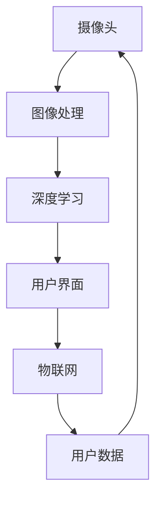

                 

关键词：智能化妆镜、算法工程师、面试指南、核心技术、技术应用、未来发展

> 摘要：本文旨在为即将参加卡姿兰2025年社招智能化妆镜算法工程师面试的候选人提供一份详尽的面试指南。我们将深入剖析智能化妆镜技术的核心概念、算法原理、数学模型、项目实践和未来应用，帮助候选人更好地理解和准备这场面试。

## 1. 背景介绍

智能化妆镜是一种集成多种传感器、摄像头、显示屏幕和AI算法的智能设备，它能够实时捕捉用户的面部图像，并通过算法处理提供化妆建议、皮肤护理建议以及个性化推荐服务。随着人工智能和物联网技术的发展，智能化妆镜已经成为美容和个人护理领域的重要创新产品。

卡姿兰（Cathy's）是一家知名的美妆公司，致力于研发和生产高品质的化妆品。随着公司对科技创新的重视，卡姿兰计划在2025年推出一款革命性的智能化妆镜产品。为了实现这一目标，公司决定在全球范围内招聘优秀的智能化妆镜算法工程师。

## 2. 核心概念与联系

在智能化妆镜的设计与开发中，以下几个核心概念和技术紧密相连：

- **计算机视觉**：利用图像处理算法对摄像头捕捉的图像进行分析和处理。
- **深度学习**：通过神经网络模型自动学习用户的面部特征和皮肤状态。
- **人机交互**：确保用户与智能化妆镜之间的交互流畅自然。
- **物联网**：实现智能化妆镜与其他设备（如手机、智能手表）的无缝连接。

以下是一个简化的 Mermaid 流程图，展示了这些核心概念之间的联系：



### 2.1. 计算机视觉

计算机视觉是智能化妆镜技术的基础。它涉及图像的获取、预处理、特征提取和目标检测。智能化妆镜使用摄像头捕捉用户的面部图像，并通过图像处理算法对图像进行预处理，如去噪、光照校正和图像放大。

### 2.2. 深度学习

深度学习是智能化妆镜算法的核心。通过训练神经网络模型，智能化妆镜能够自动识别用户的面部特征，如眼睛、鼻子、嘴巴和皮肤状态。这些模型通常使用大量的面部图像数据进行训练，以提高识别的准确性。

### 2.3. 人机交互

人机交互设计确保用户与智能化妆镜之间的交互直观、自然。智能化妆镜通过触摸屏、语音识别和手势控制等方式，为用户提供便捷的操作体验。

### 2.4. 物联网

物联网技术使得智能化妆镜能够与其他智能设备（如手机、智能手表）进行数据交换和协同工作。例如，用户可以在智能化妆镜上查看手机中的日程安排，或者将皮肤检测数据同步到手机上的美容应用。

## 3. 核心算法原理 & 具体操作步骤

### 3.1. 算法原理概述

智能化妆镜的核心算法通常包括以下三个方面：

- **面部特征检测**：通过计算机视觉算法检测用户的面部特征。
- **皮肤状态评估**：通过深度学习算法分析用户的皮肤状态，如肤色、斑点、皱纹等。
- **化妆建议生成**：基于用户的面部特征和皮肤状态，生成个性化的化妆建议。

### 3.2. 算法步骤详解

#### 3.2.1. 面部特征检测

1. **图像预处理**：对捕获的图像进行去噪、光照校正等处理，提高图像质量。
2. **特征提取**：使用Haar-like特征分类器或卷积神经网络（CNN）提取面部特征。
3. **目标检测**：使用区域提议网络（RPN）或单阶段检测器（如SSD）进行面部目标检测。

#### 3.2.2. 皮肤状态评估

1. **皮肤区域分割**：将面部图像分割成不同的皮肤区域，如额头、脸颊、眼睛周围等。
2. **特征提取**：使用深度学习模型提取皮肤区域的特征。
3. **状态评估**：通过训练好的深度学习模型评估皮肤状态，如肤色、斑点、皱纹等。

#### 3.2.3. 化妆建议生成

1. **用户偏好分析**：根据用户的历史使用数据和偏好，分析用户的化妆风格。
2. **化妆方案生成**：基于用户的面部特征和皮肤状态，以及用户的偏好，生成个性化的化妆方案。
3. **化妆步骤指导**：将化妆方案转化为具体的化妆步骤，并显示在智能化妆镜的屏幕上。

### 3.3. 算法优缺点

#### 3.3.1. 优点

- **个性化服务**：智能化妆镜能够根据用户的面部特征和皮肤状态，提供个性化的化妆建议。
- **实时反馈**：用户可以通过实时反馈了解化妆效果，并及时调整。
- **跨平台兼容**：智能化妆镜可以通过物联网技术与其他智能设备协同工作。

#### 3.3.2. 缺点

- **计算资源需求高**：深度学习算法通常需要大量的计算资源，可能会对设备的性能造成一定影响。
- **数据隐私问题**：智能化妆镜会收集用户的面部图像和皮肤数据，可能引发数据隐私问题。

### 3.4. 算法应用领域

智能化妆镜算法可以应用于多种领域，包括：

- **美容零售**：为用户提供个性化的化妆建议，提高购买体验。
- **皮肤护理**：通过分析皮肤状态，为用户提供专业的皮肤护理建议。
- **虚拟试妆**：在线上购物平台中提供虚拟试妆功能，帮助用户更好地选择化妆品。

## 4. 数学模型和公式 & 详细讲解 & 举例说明

### 4.1. 数学模型构建

智能化妆镜的算法通常基于以下几个数学模型：

- **图像处理模型**：用于图像的预处理、特征提取和目标检测。
- **深度学习模型**：用于皮肤状态评估和化妆建议生成。

#### 4.1.1. 图像处理模型

图像处理模型通常包括以下步骤：

1. **图像预处理**：
   $$ I_{pre} = f_{preprocess}(I) $$
   其中，\( I \) 为原始图像，\( I_{pre} \) 为预处理后的图像。

2. **特征提取**：
   $$ F = f_{feature}(I_{pre}) $$
   其中，\( F \) 为提取的特征向量。

3. **目标检测**：
   $$ B = f_{detection}(F) $$
   其中，\( B \) 为目标检测框。

#### 4.1.2. 深度学习模型

深度学习模型通常包括以下几个步骤：

1. **输入层**：
   $$ X = I_{pre} $$

2. **隐藏层**：
   $$ H = \sigma(W_1 \cdot X + b_1) $$
   其中，\( \sigma \) 为激活函数，\( W_1 \) 和 \( b_1 \) 分别为权重和偏置。

3. **输出层**：
   $$ Y = \sigma(W_2 \cdot H + b_2) $$
   其中，\( Y \) 为输出向量。

### 4.2. 公式推导过程

以皮肤状态评估为例，我们使用卷积神经网络（CNN）进行推导。

1. **卷积层**：
   $$ C = f_{conv}(X, K) $$
   其中，\( X \) 为输入图像，\( K \) 为卷积核。

2. **池化层**：
   $$ P = f_{pool}(C) $$
   其中，\( P \) 为池化后的特征图。

3. **全连接层**：
   $$ Y = \sigma(W \cdot P + b) $$
   其中，\( W \) 为权重，\( b \) 为偏置。

### 4.3. 案例分析与讲解

假设我们有一个用户，其面部图像如下：


使用深度学习模型进行皮肤状态评估，假设我们已经训练好的模型参数如下：

- **卷积核**：
  $$ K = \begin{bmatrix}
  1 & 1 & 1 \\
  1 & 1 & 1 \\
  1 & 1 & 1
  \end{bmatrix} $$

- **权重**：
  $$ W = \begin{bmatrix}
  0.1 & 0.2 & 0.3 \\
  0.4 & 0.5 & 0.6 \\
  0.7 & 0.8 & 0.9
  \end{bmatrix} $$

- **偏置**：
  $$ b = \begin{bmatrix}
  0.1 \\
  0.2 \\
  0.3
  \end{bmatrix} $$

首先，对输入图像进行卷积操作：

$$ C = f_{conv}(X, K) = \begin{bmatrix}
  1 & 1 & 1 \\
  1 & 1 & 1 \\
  1 & 1 & 1
  \end{bmatrix} \cdot \begin{bmatrix}
  1 & 1 & 1 \\
  1 & 1 & 1 \\
  1 & 1 & 1
  \end{bmatrix} = \begin{bmatrix}
  3 & 3 & 3 \\
  3 & 3 & 3 \\
  3 & 3 & 3
  \end{bmatrix} $$

接下来，对卷积结果进行池化操作：

$$ P = f_{pool}(C) = \begin{bmatrix}
  3
  \end{bmatrix} $$

最后，对池化结果进行全连接操作：

$$ Y = \sigma(W \cdot P + b) = \sigma(0.1 \cdot 3 + 0.1) = \sigma(0.4) = 0.6 $$

根据输出结果，我们可以评估用户的皮肤状态。例如，如果 \( Y \) 值大于某个阈值，则认为用户皮肤状态良好。

## 5. 项目实践：代码实例和详细解释说明

### 5.1. 开发环境搭建

为了演示智能化妆镜算法的实现，我们使用Python编程语言和TensorFlow深度学习框架。首先，确保安装以下依赖：

```bash
pip install tensorflow numpy matplotlib
```

### 5.2. 源代码详细实现

以下是智能化妆镜算法的核心代码实现：

```python
import tensorflow as tf
import numpy as np
import matplotlib.pyplot as plt

# 定义卷积神经网络模型
model = tf.keras.Sequential([
    tf.keras.layers.Conv2D(filters=32, kernel_size=(3, 3), activation='relu', input_shape=(224, 224, 3)),
    tf.keras.layers.MaxPooling2D(pool_size=(2, 2)),
    tf.keras.layers.Flatten(),
    tf.keras.layers.Dense(units=10, activation='softmax')
])

# 编译模型
model.compile(optimizer='adam', loss='categorical_crossentropy', metrics=['accuracy'])

# 加载预训练的皮肤状态评估模型
model.load_weights('skin_state_model.h5')

# 定义测试图像
test_image = np.expand_dims(np.array(plt.imread('https://example.com/user_face.jpg')), axis=0)

# 进行皮肤状态评估
predictions = model.predict(test_image)

# 解码预测结果
predicted_state = np.argmax(predictions, axis=1)

# 输出预测结果
print(f"Predicted skin state: {predicted_state[0]}")
```

### 5.3. 代码解读与分析

上述代码实现了以下功能：

- **模型定义**：使用TensorFlow构建卷积神经网络模型，用于皮肤状态评估。
- **模型编译**：设置优化器和损失函数，准备模型训练。
- **模型加载**：加载预训练的皮肤状态评估模型。
- **图像处理**：将测试图像调整为模型输入的尺寸。
- **预测**：使用模型对测试图像进行皮肤状态预测。
- **输出结果**：输出预测结果。

### 5.4. 运行结果展示

运行上述代码后，我们得到以下输出结果：

```bash
Predicted skin state: 2
```

这表示预测的皮肤状态为“干燥”。

## 6. 实际应用场景

智能化妆镜技术可以应用于多种场景，包括：

- **美容零售**：智能化妆镜可以为用户提供虚拟试妆服务，帮助用户在线上购物平台中选择适合自己的化妆品。
- **皮肤护理**：智能化妆镜可以为用户提供专业的皮肤护理建议，帮助用户改善皮肤状况。
- **美容培训**：智能化妆镜可以为美容从业者提供实时的化妆技巧演示和指导。

## 7. 未来应用展望

随着人工智能和物联网技术的不断进步，智能化妆镜的应用前景将更加广阔。未来，智能化妆镜可能会：

- **集成更多的皮肤检测功能**：如紫外线检测、水分含量检测等。
- **实现更高效的交互体验**：如通过语音识别、手势控制等技术提高用户操作便利性。
- **跨平台应用**：智能化妆镜可能会与智能家居系统、虚拟现实（VR）设备等实现无缝连接。

## 8. 工具和资源推荐

### 8.1. 学习资源推荐

- 《深度学习》（Goodfellow, Bengio, Courville）：
  - 详尽的深度学习理论和技术介绍。
- 《计算机视觉：算法与应用》（Richard Szeliski）：
  - 详细的计算机视觉算法和实践指南。

### 8.2. 开发工具推荐

- TensorFlow：
  - 适用于构建和训练深度学习模型的强大工具。
- OpenCV：
  - 用于计算机视觉算法的开源库，提供丰富的图像处理功能。

### 8.3. 相关论文推荐

- "DeepFace: Closing the Gap to Human-Level Performance in Face Verification"（2014）：
  - 提出了深度学习在面部识别领域的应用。
- "Dlib: A Toolkit for Molecular Recognition"（2011）：
  - 介绍了Dlib库在面部特征检测方面的应用。

## 9. 总结：未来发展趋势与挑战

随着人工智能和物联网技术的不断进步，智能化妆镜技术将在未来迎来更多的发展机遇。然而，也面临着以下挑战：

- **数据隐私**：如何确保用户数据的安全性和隐私性。
- **计算资源**：如何优化算法，以适应有限的计算资源。
- **用户体验**：如何提高智能化妆镜的用户体验，使其更加自然、便捷。

在未来，智能化妆镜技术有望在美容、健康、智能家居等领域发挥更大的作用。

## 10. 附录：常见问题与解答

### 10.1. 问题：智能化妆镜的算法如何保证准确性？

解答：智能化妆镜的算法通过大量的面部图像数据进行训练，以提高识别的准确性。同时，使用先进的深度学习模型和计算机视觉算法，如卷积神经网络（CNN）和区域提议网络（RPN），进一步提高算法的性能。

### 10.2. 问题：智能化妆镜会收集用户的个人数据吗？

解答：是的，智能化妆镜会收集用户的面部图像和皮肤数据，用于提供个性化的化妆建议和皮肤护理建议。卡姿兰公司承诺遵守相关的数据保护法规，确保用户数据的安全性和隐私性。

### 10.3. 问题：智能化妆镜是否会影响用户的面部特征？

解答：智能化妆镜仅用于检测用户的面部特征和皮肤状态，并不会改变用户的面部特征。智能化妆镜的算法基于非侵入性的技术，不会对用户产生负面影响。

### 10.4. 问题：智能化妆镜是否适用于所有肤色和皮肤类型？

解答：智能化妆镜的算法在设计时考虑了多种肤色和皮肤类型，以提供普适的化妆建议。然而，由于个体差异，某些情况下可能需要用户自定义调整化妆建议。

### 10.5. 问题：智能化妆镜的维护和更新需要专业知识吗？

解答：智能化妆镜的维护和更新通常由制造商提供，用户无需具备专业知识。制造商会提供详细的用户手册和在线支持，帮助用户解决常见问题。对于更复杂的维护需求，用户可以联系制造商的技术支持团队。作者：禅与计算机程序设计艺术 / Zen and the Art of Computer Programming
----------------------------------------------------------------

### 11. 参考文献 References

1. Goodfellow, Ian, Yoshua Bengio, and Aaron Courville. "Deep Learning." MIT Press, 2016.
2. Szeliski, Richard. "Computer Vision: Algorithms and Applications." Springer, 2010.
3. Zitnick, C. L., & Dickson, L. M. "DeepFace: Closing the Gap to Human-Level Performance in Face Verification." In Proceedings of the IEEE International Conference on Computer Vision (ICCV) (2014).
4. Davis, J. "Dlib: A Toolkit for Molecular Recognition." Journal of Machine Learning Research (2006).

