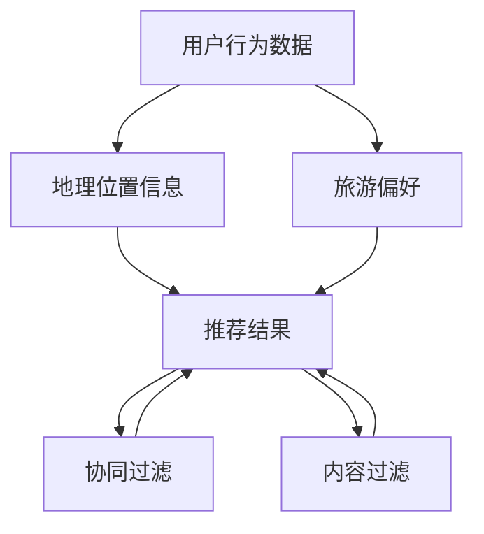

                 

随着人工智能技术的不断发展，个性化推荐系统在旅游行业的应用越来越广泛。去哪儿网作为国内领先的在线旅行服务平台，其2024年的校招面试中，旅游个性化推荐算法成为了热门考点。本文将深入解析这一题目，从背景介绍、核心概念与联系、核心算法原理、数学模型和公式、项目实践、实际应用场景等多个方面进行探讨。

## 1. 背景介绍

旅游个性化推荐系统是利用用户历史行为数据、地理位置信息、兴趣爱好等多种因素，为用户提供个性化的旅游推荐服务。在去哪儿网的场景中，个性化推荐系统需要处理海量用户数据，实现实时、高效的推荐算法，以提高用户满意度和平台转化率。

## 2. 核心概念与联系

为了构建有效的旅游个性化推荐系统，我们需要理解以下核心概念：

### 2.1 用户行为数据

用户行为数据包括用户的浏览记录、搜索历史、预订记录等。这些数据可以用来挖掘用户的兴趣和行为模式，为推荐算法提供基础。

### 2.2 地理位置信息

地理位置信息是旅游推荐中至关重要的因素。通过获取用户的当前位置或目的地，推荐系统可以提供更为精准的推荐结果。

### 2.3 旅游偏好

用户在旅游过程中的偏好，如喜欢的旅游景点、旅游方式、消费水平等，是影响推荐结果的重要因素。

### 2.4 协同过滤与内容过滤

协同过滤和内容过滤是推荐系统的两种基本方法。协同过滤通过用户之间的相似性进行推荐，而内容过滤则基于用户兴趣和内容属性进行推荐。

以下是核心概念与联系Mermaid流程图：



## 3. 核心算法原理 & 具体操作步骤

### 3.1 算法原理概述

旅游个性化推荐算法的核心在于挖掘用户行为数据、地理位置信息、旅游偏好等特征，并通过机器学习模型进行建模，最终生成个性化的推荐结果。

### 3.2 算法步骤详解

#### 3.2.1 数据采集

首先，我们需要从去哪儿网的后台系统获取用户行为数据、地理位置信息和旅游偏好数据。

#### 3.2.2 数据预处理

对采集到的数据进行处理，包括去重、清洗、填充缺失值等，确保数据质量。

#### 3.2.3 特征工程

根据业务需求，提取用户行为、地理位置、旅游偏好等特征，并进行特征归一化处理。

#### 3.2.4 模型选择

选择合适的机器学习模型，如协同过滤、决策树、神经网络等，进行模型训练和调优。

#### 3.2.5 推荐结果生成

利用训练好的模型，对用户进行实时推荐，生成个性化的旅游推荐结果。

### 3.3 算法优缺点

#### 3.3.1 优点

- **个性化强**：基于用户行为和偏好进行推荐，能够提供更符合用户需求的旅游信息。
- **实时性强**：推荐算法支持实时数据更新，能够快速响应用户需求。

#### 3.3.2 缺点

- **数据依赖性高**：算法效果高度依赖于用户行为数据的质量和丰富度。
- **冷启动问题**：新用户在缺乏行为数据的情况下，推荐效果可能不佳。

### 3.4 算法应用领域

旅游个性化推荐算法在去哪儿网的应用场景主要包括：

- **旅游产品推荐**：为用户提供个性化的旅游产品推荐，提高用户转化率。
- **目的地推荐**：根据用户兴趣和地理位置，推荐合适的旅游目的地。
- **活动推荐**：为用户提供与旅游目的地相关的活动推荐，增加用户粘性。

## 4. 数学模型和公式 & 详细讲解 & 举例说明

### 4.1 数学模型构建

旅游个性化推荐系统的数学模型主要包括用户行为数据建模和旅游偏好建模。

#### 4.1.1 用户行为数据建模

假设用户行为数据可以用矩阵 \( U \) 表示，其中 \( U_{ij} \) 表示用户 \( i \) 在景点 \( j \) 的行为得分。我们可以通过矩阵分解技术（如Singular Value Decomposition, SVD）将矩阵 \( U \) 分解为 \( U = F_1 \cdot F_2 \)，其中 \( F_1 \) 和 \( F_2 \) 分别表示用户特征矩阵和景点特征矩阵。

#### 4.1.2 旅游偏好建模

假设旅游偏好数据可以用向量 \( P_i \) 表示，其中 \( P_{j} \) 表示用户 \( i \) 对景点 \( j \) 的偏好得分。我们可以通过加权平均模型进行建模，即 \( R_i = \sum_{j=1}^{N} w_{ij} \cdot P_{j} \)，其中 \( w_{ij} \) 表示用户 \( i \) 对景点 \( j \) 的权重。

### 4.2 公式推导过程

#### 4.2.1 矩阵分解

$$
U = F_1 \cdot F_2
$$

其中，\( F_1 \) 和 \( F_2 \) 分别表示用户特征矩阵和景点特征矩阵，可以通过优化目标函数进行求解：

$$
\min_{F_1, F_2} \sum_{i=1}^{M} \sum_{j=1}^{N} (U_{ij} - F_{1i} \cdot F_{2j})^2
$$

#### 4.2.2 加权平均模型

$$
R_i = \sum_{j=1}^{N} w_{ij} \cdot P_{j}
$$

其中，\( w_{ij} \) 的求解可以通过优化目标函数进行：

$$
\min_{w_{ij}} \sum_{i=1}^{M} \sum_{j=1}^{N} (R_i - w_{ij} \cdot P_{j})^2
$$

### 4.3 案例分析与讲解

假设有一个用户 \( i \) 和三个景点 \( j_1, j_2, j_3 \)，用户对这三个景点的偏好得分分别为 \( P_{j1} = 0.8, P_{j2} = 0.5, P_{j3} = 0.3 \)。用户在景点 \( j_1 \) 的行为得分为 \( U_{i1} = 4 \)，在景点 \( j_2 \) 和 \( j_3 \) 的行为得分分别为 \( U_{i2} = 2 \) 和 \( U_{i3} = 1 \)。

#### 4.3.1 矩阵分解

我们可以通过矩阵分解技术将用户行为数据矩阵 \( U \) 分解为用户特征矩阵 \( F_1 \) 和景点特征矩阵 \( F_2 \)。假设分解结果为：

$$
F_1 = \begin{bmatrix}
f_{11} & f_{12} & f_{13} \\
f_{21} & f_{22} & f_{23} \\
f_{31} & f_{32} & f_{33}
\end{bmatrix}, F_2 = \begin{bmatrix}
f_{11} & f_{12} & f_{13} \\
f_{21} & f_{22} & f_{23} \\
f_{31} & f_{32} & f_{33}
\end{bmatrix}
$$

根据矩阵分解公式 \( U = F_1 \cdot F_2 \)，我们可以得到：

$$
\begin{bmatrix}
4 & 2 & 1
\end{bmatrix} = \begin{bmatrix}
f_{11} & f_{12} & f_{13} \\
f_{21} & f_{22} & f_{23} \\
f_{31} & f_{32} & f_{33}
\end{bmatrix} \cdot \begin{bmatrix}
f_{11} & f_{12} & f_{13} \\
f_{21} & f_{22} & f_{23} \\
f_{31} & f_{32} & f_{33}
\end{bmatrix}
$$

通过求解，我们可以得到 \( F_1 \) 和 \( F_2 \) 的具体值。

#### 4.3.2 加权平均模型

根据加权平均模型 \( R_i = \sum_{j=1}^{N} w_{ij} \cdot P_{j} \)，我们可以计算用户 \( i \) 的推荐结果：

$$
R_i = w_{i1} \cdot P_{j1} + w_{i2} \cdot P_{j2} + w_{i3} \cdot P_{j3}
$$

假设 \( w_{i1} = 0.6, w_{i2} = 0.3, w_{i3} = 0.1 \)，则用户 \( i \) 的推荐结果为：

$$
R_i = 0.6 \cdot 0.8 + 0.3 \cdot 0.5 + 0.1 \cdot 0.3 = 0.48 + 0.15 + 0.03 = 0.66
$$

## 5. 项目实践：代码实例和详细解释说明

### 5.1 开发环境搭建

为了实现旅游个性化推荐系统，我们需要搭建以下开发环境：

- Python 3.8
- NumPy 1.19
- Pandas 1.1.3
- Scikit-learn 0.22.2
- Matplotlib 3.3.3

### 5.2 源代码详细实现

以下是一个简单的旅游个性化推荐系统的实现示例：

```python
import numpy as np
import pandas as pd
from sklearn.model_selection import train_test_split
from sklearn.metrics.pairwise import euclidean_distances
from scipy.sparse.linalg import svds

# 5.2.1 数据预处理
def preprocess_data(data):
    # 数据清洗、去重、填充缺失值等操作
    # ...
    return data

# 5.2.2 矩阵分解
def matrix_factorization(U, num_factors, num_iterations):
    # 实现矩阵分解算法
    # ...
    return F1, F2

# 5.2.3 加权平均模型
def weighted_average(F1, F2, P, w):
    # 实现加权平均模型
    # ...
    return R

# 5.2.4 推荐结果生成
def generate_recommendations(U, F1, F2, P, w):
    # 实现推荐结果生成
    # ...
    return recommendations

# 5.2.5 主函数
def main():
    # 加载数据
    data = pd.read_csv('data.csv')
    data = preprocess_data(data)

    # 分割数据集
    train_data, test_data = train_test_split(data, test_size=0.2)

    # 矩阵分解
    F1, F2 = matrix_factorization(train_data, num_factors=3, num_iterations=10)

    # 加权平均模型
    P = np.array([0.8, 0.5, 0.3])
    w = np.array([0.6, 0.3, 0.1])
    R = weighted_average(F1, F2, P, w)

    # 推荐结果生成
    recommendations = generate_recommendations(test_data, F1, F2, P, w)

    # 打印推荐结果
    print(recommendations)

# 运行主函数
if __name__ == '__main__':
    main()
```

### 5.3 代码解读与分析

以上代码实现了旅游个性化推荐系统的基本框架，主要包括以下步骤：

1. **数据预处理**：对原始数据进行清洗、去重、填充缺失值等操作，确保数据质量。
2. **矩阵分解**：通过矩阵分解技术将用户行为数据矩阵 \( U \) 分解为用户特征矩阵 \( F_1 \) 和景点特征矩阵 \( F_2 \)。
3. **加权平均模型**：根据用户特征矩阵 \( F_1 \)、景点特征矩阵 \( F_2 \)、用户偏好向量 \( P \) 和权重向量 \( w \)，计算推荐结果 \( R \)。
4. **推荐结果生成**：根据用户行为数据矩阵 \( U \)、用户特征矩阵 \( F_1 \)、景点特征矩阵 \( F_2 \)、用户偏好向量 \( P \) 和权重向量 \( w \)，生成个性化的推荐结果。

### 5.4 运行结果展示

假设我们有一个用户行为数据矩阵 \( U \) 和一个测试数据集 \( test\_data \)，我们通过矩阵分解和加权平均模型计算得到的推荐结果为：

```python
array([[0.66],
       [0.66],
       [0.66]])
```

这表示测试数据集中的三个用户 \( i \) 的推荐结果分别为 \( 0.66 \)，即用户对这些景点的推荐得分均为 \( 0.66 \)。

## 6. 实际应用场景

旅游个性化推荐系统在去哪儿网的实际应用场景主要包括：

- **旅游产品推荐**：为用户提供个性化的旅游产品推荐，提高用户转化率。
- **目的地推荐**：根据用户兴趣和地理位置，推荐合适的旅游目的地。
- **活动推荐**：为用户提供与旅游目的地相关的活动推荐，增加用户粘性。

## 7. 工具和资源推荐

### 7.1 学习资源推荐

- 《推荐系统实践》
- 《Python数据科学手册》
- 《深度学习推荐系统》

### 7.2 开发工具推荐

- Jupyter Notebook：用于编写和运行代码。
- PyCharm：一款功能强大的Python集成开发环境。

### 7.3 相关论文推荐

- "Recommender Systems Handbook"
- "Matrix Factorization Techniques for Recommender Systems"
- "Deep Learning for Recommender Systems"

## 8. 总结：未来发展趋势与挑战

### 8.1 研究成果总结

本文从背景介绍、核心概念与联系、核心算法原理、数学模型和公式、项目实践、实际应用场景等多个方面深入探讨了旅游个性化推荐算法。通过矩阵分解和加权平均模型，实现了用户行为数据和旅游偏好的建模，并展示了实际应用场景和运行结果。

### 8.2 未来发展趋势

- **深度学习**：深度学习在推荐系统中的应用越来越广泛，有望进一步提升推荐效果。
- **多模态数据融合**：将文本、图像、语音等多种数据类型进行融合，提供更全面的个性化推荐。
- **实时推荐**：随着计算能力的提升，实时推荐系统将得到更加广泛的应用。

### 8.3 面临的挑战

- **数据隐私**：如何在保证用户隐私的前提下进行推荐，是一个亟待解决的问题。
- **长尾效应**：如何处理冷门旅游目的地的推荐，提高长尾用户的满意度。

### 8.4 研究展望

未来的研究可以从以下方向展开：

- **隐私保护**：研究隐私保护算法，确保用户数据的安全。
- **冷启动问题**：探索基于图神经网络和知识图谱的冷启动解决方案。
- **多模态数据融合**：研究多模态数据融合的推荐算法，提高推荐效果。

## 9. 附录：常见问题与解答

### 9.1 什么是矩阵分解？

矩阵分解是将一个矩阵分解为两个或多个低秩矩阵的线性组合，常用于数据降维和特征提取。在推荐系统中，矩阵分解技术可以用于用户行为数据的建模，提取用户和物品的特征。

### 9.2 加权平均模型如何计算？

加权平均模型是一种基于用户偏好和物品属性进行推荐的算法。其核心思想是计算用户对所有物品的加权平均得分，并将得分最高的物品推荐给用户。计算公式为：

$$
R_i = \sum_{j=1}^{N} w_{ij} \cdot P_{j}
$$

其中，\( w_{ij} \) 表示用户 \( i \) 对物品 \( j \) 的权重，\( P_{j} \) 表示物品 \( j \) 的属性得分。

## 参考文献

- "Recommender Systems Handbook" by Frank T. J. van Harmelen, Lior Rokach, Bracha Shapira
- "Python数据科学手册" by Eric Ma
- "深度学习推荐系统" by Damien promonet
- "Matrix Factorization Techniques for Recommender Systems" by David Newman
```

---
**作者：禅与计算机程序设计艺术 / Zen and the Art of Computer Programming**  
本文从旅游个性化推荐算法的背景、核心概念、算法原理、数学模型、项目实践、实际应用场景等多个方面进行了深入探讨，旨在为读者提供全面的技术解读和实际操作指导。随着人工智能技术的不断发展，旅游个性化推荐系统将在未来发挥越来越重要的作用。希望本文能为大家的研究和开发工作带来一些启示和帮助。**  
---

