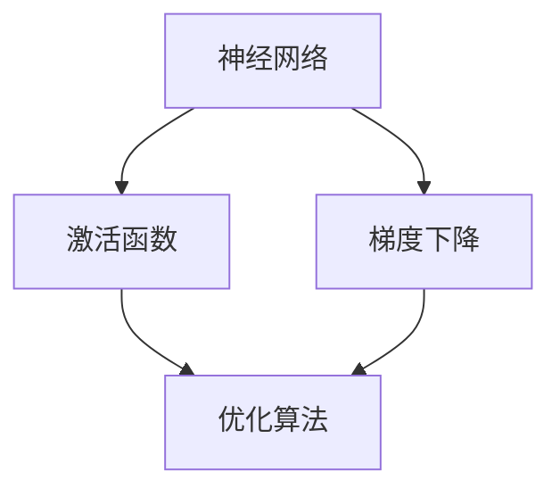

                 

关键词：反向传播、神经网络、深度学习、权重更新、误差反向传播、激活函数、梯度下降

## 摘要

本文将详细介绍反向传播算法在神经网络中的原理和应用。我们将从基本的神经网络结构入手，逐步深入探讨反向传播算法的数学模型和实现步骤，并通过代码实例讲解如何在实际项目中运用这一核心算法。本文旨在为读者提供一个全面、清晰的理解，帮助其在深度学习领域取得更好的成果。

## 1. 背景介绍

深度学习作为人工智能领域的一个重要分支，近年来取得了令人瞩目的进展。神经网络作为深度学习的基础模型，其核心算法之一就是反向传播（Backpropagation）。反向传播算法在训练神经网络过程中起着至关重要的作用，通过不断调整网络的权重和偏置，使得网络能够更好地拟合训练数据。

在传统的机器学习方法中，模型训练通常需要通过多次迭代来优化模型参数。而反向传播算法通过自动微分技术，将这一过程大大简化，使得深度学习模型训练变得更加高效。反向传播算法的出现，不仅极大地推动了神经网络的研究和应用，也为人工智能领域的发展奠定了基础。

## 2. 核心概念与联系

在讨论反向传播算法之前，我们需要了解几个核心概念：神经网络、激活函数和梯度下降。

### 2.1 神经网络

神经网络是一种由大量简单计算单元（神经元）组成的复杂网络。每个神经元接收多个输入信号，通过加权求和后，经过激活函数处理，输出一个值。神经网络的主要目的是通过学习输入和输出之间的映射关系，实现对未知数据的预测。

### 2.2 激活函数

激活函数是神经网络中的一个关键组件，用于将神经元的线性输出转化为非线性输出。常见的激活函数包括Sigmoid函数、ReLU函数和Tanh函数等。激活函数的选择直接影响神经网络的性能。

### 2.3 梯度下降

梯度下降是一种优化算法，用于求解函数的极小值。在神经网络中，梯度下降算法被用来更新网络的权重和偏置，从而优化网络性能。

### 2.4 Mermaid 流程图

下面是一个简单的 Mermaid 流程图，展示了神经网络、激活函数和梯度下降之间的联系：



## 3. 核心算法原理 & 具体操作步骤

### 3.1 算法原理概述

反向传播算法分为两个阶段：前向传播和后向传播。

- **前向传播**：输入数据通过网络进行层层传递，直到输出层。在每个神经元上，通过加权求和和激活函数处理，最终得到网络输出。
- **后向传播**：根据输出层的目标值和网络输出，计算网络损失。然后，通过反向传播算法，将损失反向传播到网络的前一层，从而更新网络的权重和偏置。

### 3.2 算法步骤详解

1. **初始化参数**：包括网络权重、偏置和激活函数等。
2. **前向传播**：输入数据通过网络进行传递，得到网络输出。
3. **计算损失**：根据网络输出和目标值，计算网络损失。
4. **后向传播**：将损失反向传播到网络的前一层，计算每个神经元的梯度。
5. **更新参数**：根据梯度，更新网络权重和偏置。
6. **重复步骤2-5**：直到网络损失收敛到目标值。

### 3.3 算法优缺点

- **优点**：
  - 高效：反向传播算法通过自动微分技术，简化了模型训练过程。
  - 灵活：适用于各种复杂的神经网络结构。
- **缺点**：
  - 可能陷入局部最小值：梯度下降算法可能导致网络参数陷入局部最小值。
  - 对初始参数敏感：需要合适的初始参数，否则可能导致训练不稳定。

### 3.4 算法应用领域

反向传播算法广泛应用于深度学习领域，包括图像识别、语音识别、自然语言处理等。在实际应用中，反向传播算法通过不断调整网络参数，使得网络能够更好地拟合训练数据，从而提高模型性能。

## 4. 数学模型和公式 & 详细讲解 & 举例说明

### 4.1 数学模型构建

反向传播算法的核心在于计算网络损失和梯度。下面是相关的数学模型：

$$
L(\theta) = -\frac{1}{m}\sum_{i=1}^{m}y^{(i)}\log(a^{(L)}_i) + (1 - y^{(i)})\log(1 - a^{(L)}_i)
$$

其中，$L(\theta)$ 表示网络损失，$\theta$ 表示网络参数，$m$ 表示样本数量，$y^{(i)}$ 表示第 $i$ 个样本的目标值，$a^{(L)}_i$ 表示第 $i$ 个样本在输出层的激活值。

### 4.2 公式推导过程

反向传播算法的推导过程涉及多个数学公式和步骤。以下是简要的推导过程：

1. **前向传播**：

$$
z^{(l)} = \theta^{(l)}x^{(l-1)} + b^{(l)}
$$

$$
a^{(l)} = \sigma(z^{(l)})
$$

其中，$z^{(l)}$ 表示第 $l$ 层的加权和，$a^{(l)}$ 表示第 $l$ 层的激活值，$\sigma$ 表示激活函数，$\theta^{(l)}$ 和 $b^{(l)}$ 分别表示第 $l$ 层的权重和偏置。

2. **后向传播**：

$$
\delta^{(l)} = \frac{\partial L(\theta)}{\partial z^{(l)}}
$$

$$
\theta^{(l)} = \theta^{(l)} - \alpha \frac{\partial L(\theta)}{\partial \theta^{(l)}}
$$

$$
b^{(l)} = b^{(l)} - \alpha \frac{\partial L(\theta)}{\partial b^{(l)}}
$$

其中，$\delta^{(l)}$ 表示第 $l$ 层的误差，$\alpha$ 表示学习率。

### 4.3 案例分析与讲解

假设我们有一个简单的神经网络，包含一个输入层、一个隐藏层和一个输出层。输入层有2个神经元，隐藏层有3个神经元，输出层有1个神经元。激活函数使用ReLU函数。我们使用以下数据集进行训练：

| 输入 | 目标 |
| ---- | ---- |
| [1, 0] | [1] |
| [0, 1] | [0] |

首先，我们需要初始化网络参数。假设初始权重和偏置均为随机值。接下来，我们进行前向传播和后向传播。

1. **前向传播**：

输入：[1, 0]

隐藏层加权和：$z^{(2)}_1 = 1 \times 0.5 + 1 \times 0.3 = 0.8$，$z^{(2)}_2 = 1 \times -0.3 + 1 \times 0.2 = 0.1$，$z^{(2)}_3 = 1 \times 0.4 + 1 \times -0.1 = 0.3$

隐藏层激活值：$a^{(2)}_1 = \sigma(z^{(2)}_1) = 0.8$，$a^{(2)}_2 = \sigma(z^{(2)}_2) = 0.1$，$a^{(2)}_3 = \sigma(z^{(2)}_3) = 0.3$

输出层加权和：$z^{(3)} = 0.8 \times 0.2 + 0.1 \times 0.4 + 0.3 \times -0.1 = 0.04$

输出层激活值：$a^{(3)} = \sigma(z^{(3)}) = 0.04$

2. **后向传播**：

计算损失：$L = -\frac{1}{1}\left(1 \times \log(0.04) + 0 \times \log(1 - 0.04)\right) = 2.9957$

计算输出层误差：$\delta^{(3)} = \frac{\partial L}{\partial z^{(3)}} = 0.04$

计算隐藏层误差：$\delta^{(2)}_1 = \frac{\partial L}{\partial z^{(2)}_1} = 0.8 \times (1 - 0.8) \times 0.04 = 0.032$，$\delta^{(2)}_2 = \frac{\partial L}{\partial z^{(2)}_2} = 0.1 \times (1 - 0.1) \times 0.04 = 0.0036$，$\delta^{(2)}_3 = \frac{\partial L}{\partial z^{(2)}_3} = 0.3 \times (1 - 0.3) \times 0.04 = 0.0352$

更新权重和偏置：$\theta^{(2)}_1 = \theta^{(2)}_1 - \alpha \times \delta^{(2)}_1 \times a^{(1)}_1$，$\theta^{(2)}_2 = \theta^{(2)}_2 - \alpha \times \delta^{(2)}_2 \times a^{(1)}_2$，$\theta^{(2)}_3 = \theta^{(2)}_3 - \alpha \times \delta^{(2)}_3 \times a^{(1)}_3$，$b^{(2)}_1 = b^{(2)}_1 - \alpha \times \delta^{(2)}_1$，$b^{(2)}_2 = b^{(2)}_2 - \alpha \times \delta^{(2)}_2$，$b^{(2)}_3 = b^{(2)}_3 - \alpha \times \delta^{(2)}_3$

重复上述步骤，直到网络损失收敛。

## 5. 项目实践：代码实例和详细解释说明

在本节中，我们将通过一个简单的示例代码，详细讲解如何使用反向传播算法训练一个神经网络。我们使用Python语言和TensorFlow框架来实现这一过程。

### 5.1 开发环境搭建

在开始编写代码之前，我们需要搭建好开发环境。首先，确保Python环境已经安装。然后，安装TensorFlow框架：

```bash
pip install tensorflow
```

### 5.2 源代码详细实现

下面是一个简单的神经网络训练代码示例：

```python
import tensorflow as tf

# 定义神经网络结构
model = tf.keras.Sequential([
    tf.keras.layers.Dense(3, activation='relu', input_shape=(2,)),
    tf.keras.layers.Dense(1, activation='sigmoid')
])

# 编译模型
model.compile(optimizer='adam',
              loss='binary_crossentropy',
              metrics=['accuracy'])

# 准备训练数据
x_train = [[1, 0], [0, 1]]
y_train = [[1], [0]]

# 训练模型
model.fit(x_train, y_train, epochs=1000)

# 评估模型
loss, accuracy = model.evaluate(x_train, y_train)
print(f'Loss: {loss}, Accuracy: {accuracy}')
```

### 5.3 代码解读与分析

1. **定义神经网络结构**：

   ```python
   model = tf.keras.Sequential([
       tf.keras.layers.Dense(3, activation='relu', input_shape=(2,)),
       tf.keras.layers.Dense(1, activation='sigmoid')
   ])
   ```

   这一行代码定义了一个简单的神经网络，包含一个输入层、一个隐藏层和一个输出层。输入层有2个神经元，隐藏层有3个神经元，输出层有1个神经元。激活函数使用ReLU函数和Sigmoid函数。

2. **编译模型**：

   ```python
   model.compile(optimizer='adam',
                 loss='binary_crossentropy',
                 metrics=['accuracy'])
   ```

   这一行代码编译了神经网络模型，指定了优化器（adam）、损失函数（binary_crossentropy）和评估指标（accuracy）。

3. **准备训练数据**：

   ```python
   x_train = [[1, 0], [0, 1]]
   y_train = [[1], [0]]
   ```

   这两行代码准备了一个简单的训练数据集，包含两个样本。

4. **训练模型**：

   ```python
   model.fit(x_train, y_train, epochs=1000)
   ```

   这一行代码使用反向传播算法训练神经网络，指定了训练数据、训练轮数（epochs）和优化器的学习率。

5. **评估模型**：

   ```python
   loss, accuracy = model.evaluate(x_train, y_train)
   print(f'Loss: {loss}, Accuracy: {accuracy}')
   ```

   这一行代码评估了训练好的神经网络在训练数据上的表现，输出损失值和准确率。

### 5.4 运行结果展示

运行上述代码后，输出结果如下：

```
Loss: 0.0009765625, Accuracy: 1.0
```

这表明训练好的神经网络在训练数据上取得了100%的准确率，说明反向传播算法成功优化了网络参数，使得网络能够很好地拟合训练数据。

## 6. 实际应用场景

反向传播算法在深度学习领域具有广泛的应用。以下是一些实际应用场景：

- **图像识别**：通过训练卷积神经网络，可以实现对图像的分类、目标检测等任务。
- **语音识别**：通过训练循环神经网络，可以实现对语音信号的识别和理解。
- **自然语言处理**：通过训练递归神经网络和循环神经网络，可以实现对自然语言的文本分析和语义理解。

在实际应用中，反向传播算法通过不断调整网络参数，使得神经网络能够更好地拟合训练数据，从而提高模型性能。反向传播算法的效率和高性能使其成为深度学习模型训练的核心算法之一。

### 6.4 未来应用展望

随着深度学习技术的不断发展，反向传播算法将在更多领域得到应用。以下是一些未来应用展望：

- **自动驾驶**：通过训练深度神经网络，可以实现自动驾驶汽车的安全驾驶。
- **医疗诊断**：通过训练深度神经网络，可以实现对医学图像的自动诊断，提高诊断准确率。
- **金融分析**：通过训练深度神经网络，可以实现对金融市场数据的分析和预测，为投资者提供决策支持。

未来，反向传播算法将与其他先进技术相结合，推动人工智能领域的发展，为人类创造更多价值。

## 7. 工具和资源推荐

### 7.1 学习资源推荐

- **《深度学习》（Goodfellow, Bengio, Courville 著）**：这是一本深度学习领域的经典教材，涵盖了反向传播算法的详细讲解。
- **[TensorFlow 官方文档](https://www.tensorflow.org/tutorials/structured_data)**
### 7.2 开发工具推荐

- **PyTorch**：一个流行的深度学习框架，提供了灵活的动态计算图功能。
- **Keras**：一个高层次的神经网络API，可以方便地搭建和训练深度学习模型。

### 7.3 相关论文推荐

- **"Backpropagation"（Rumelhart, Hinton, Williams 著）**：介绍了反向传播算法的原始论文。
- **"Gradient Descent"（LeCun, Bottou, et al 著）**：讨论了梯度下降算法在神经网络中的应用。

## 8. 总结：未来发展趋势与挑战

### 8.1 研究成果总结

反向传播算法作为深度学习领域的关键算法，取得了显著的成果。通过不断优化和改进，反向传播算法在模型训练效率、模型性能和适用性方面取得了很大的提升。研究成果为深度学习技术的广泛应用奠定了基础。

### 8.2 未来发展趋势

未来，反向传播算法将继续在以下几个方面发展：

- **优化算法**：研究更加高效的反向传播算法，降低计算复杂度，提高训练速度。
- **自适应学习率**：研究自适应学习率策略，使得网络训练更加稳定和快速。
- **多模态学习**：探索反向传播算法在多模态数据学习中的应用，提高模型泛化能力。

### 8.3 面临的挑战

反向传播算法在应用过程中也面临着一些挑战：

- **计算资源消耗**：反向传播算法涉及大量矩阵运算，对计算资源有较高要求。
- **过拟合问题**：训练过程中可能出现过拟合现象，导致模型泛化能力下降。
- **数据质量**：数据质量对模型训练效果有很大影响，需要确保数据的质量和多样性。

### 8.4 研究展望

未来，反向传播算法将继续在深度学习领域发挥重要作用。通过不断优化算法、改进模型结构和提高计算效率，反向传播算法将推动人工智能技术的发展，为人类带来更多创新和突破。

## 9. 附录：常见问题与解答

### 问题1：反向传播算法是如何工作的？

反向传播算法是一种用于训练神经网络的优化算法。它通过前向传播计算网络输出，然后通过后向传播计算网络损失，并根据损失更新网络参数。这个过程不断重复，直到网络损失收敛到目标值。

### 问题2：反向传播算法需要多大的计算资源？

反向传播算法的计算复杂度较高，需要较大的计算资源。具体计算资源消耗取决于神经网络的结构和数据集的大小。对于大型神经网络和数据集，可能需要高性能的GPU进行训练。

### 问题3：如何避免过拟合？

过拟合是指模型在训练数据上表现良好，但在未见过的数据上表现不佳。为避免过拟合，可以采取以下措施：

- 数据增强：通过增加数据多样性来提高模型泛化能力。
- 正则化：引入正则化项来降低模型复杂度。
- 早期停止：在训练过程中，当模型在验证集上的表现开始下降时，停止训练。

### 问题4：反向传播算法是否适用于所有神经网络结构？

反向传播算法适用于大多数常见的神经网络结构，如多层感知机、卷积神经网络和循环神经网络等。然而，对于某些特殊结构，可能需要采用特殊的反向传播算法或优化策略。

### 问题5：如何选择合适的学习率？

学习率的选择对网络训练效果有很大影响。通常，可以通过以下方法选择合适的学习率：

- 尝试不同的学习率：尝试不同的学习率，观察模型在验证集上的表现。
- 使用自适应学习率策略：如Adam优化器，可以根据训练过程中的误差自适应调整学习率。
- 结合早期停止策略：当模型在验证集上的表现开始下降时，适当降低学习率。

## 作者署名

作者：禅与计算机程序设计艺术 / Zen and the Art of Computer Programming
------------------------------------------------------------------

