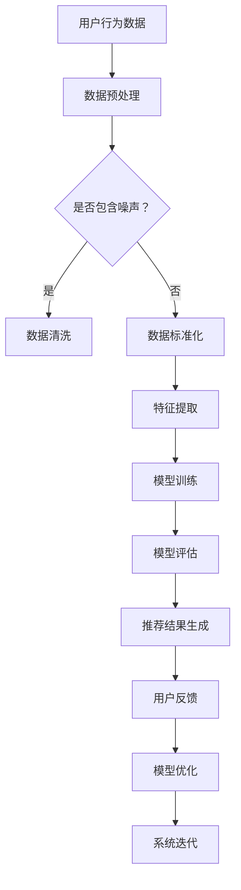

                 

关键词：可解释性，AI，电商，搜索推荐，信任度，透明化，用户隐私，算法公平性，实时反馈，交互设计

> 摘要：本文深入探讨了AI在电商搜索推荐系统中的应用及其对信任度的影响。通过分析可解释性在AI推荐系统中的重要性，阐述了如何利用可解释性技术提高用户对推荐系统的信任度，进而提升用户体验和业务收益。文章从算法原理、数学模型、实践案例等多个维度展开讨论，为电商推荐系统的优化提供了理论和实践指导。

## 1. 背景介绍

随着互联网和电子商务的迅猛发展，AI推荐系统已经成为电商企业提升用户体验、增加销售转化率的重要手段。然而，传统的AI推荐系统往往依赖于复杂的机器学习算法，导致用户无法直观理解推荐结果，进而影响用户对系统的信任度。近年来，可解释性（Explainability）逐渐成为AI研究领域的一个重要方向，旨在提升算法的透明度和可理解性，使其能够为普通用户所接受。

可解释性在AI推荐系统中的应用具有重要的实际意义。首先，通过提高推荐系统的透明度，用户可以更好地理解推荐结果，从而增加对系统的信任感。其次，可解释性有助于发现算法中的潜在偏差，促进算法的公平性和公正性。此外，可解释性还可以帮助开发人员优化算法，提升系统性能和用户体验。

本文将围绕可解释性在AI推荐系统中的应用，探讨如何利用可解释性技术提升电商搜索推荐系统的信任度，从而为电商企业提供有益的参考。

## 2. 核心概念与联系

### 2.1 可解释性（Explainability）

可解释性是指算法能够为用户或开发者提供清晰的解释，使其理解算法的决策过程和结果。在AI推荐系统中，可解释性有助于用户理解推荐结果背后的原因，从而增强对系统的信任度。

### 2.2 透明度（Transparency）

透明度是指系统的运作过程和结果能够被用户清晰地感知和验证。在AI推荐系统中，透明度有助于用户了解推荐算法的决策依据，从而提高对推荐结果的信任度。

### 2.3 公平性（Fairness）

公平性是指算法在处理不同用户或数据时，能够保持一致性和无偏见。在AI推荐系统中，公平性有助于避免算法对特定群体产生不公平影响，从而提高用户对系统的信任度。

### 2.4 实时反馈（Real-time Feedback）

实时反馈是指系统在用户行为和反馈的基础上，能够实时调整和优化推荐结果。在AI推荐系统中，实时反馈有助于提高用户满意度，从而增强对系统的信任度。

### 2.5 交互设计（Interaction Design）

交互设计是指系统与用户之间的交互过程和界面设计。在AI推荐系统中，良好的交互设计有助于提高用户对系统的认知和理解，从而增强信任度。

### 2.6 可视化（Visualization）

可视化是指将数据或算法结果以图形或图像形式呈现，帮助用户更好地理解和分析。在AI推荐系统中，可视化有助于提高推荐结果的透明度和可解释性，从而提升用户信任度。

### 2.7 Mermaid 流程图

以下是一个简单的Mermaid流程图，展示了可解释性在AI推荐系统中的关键环节：



## 3. 核心算法原理 & 具体操作步骤

### 3.1 算法原理概述

在电商搜索推荐系统中，可解释性主要通过以下三个方面实现：

1. **特征可解释性**：通过分析用户行为数据，提取关键特征，使其对推荐结果产生直观的影响。
2. **模型可解释性**：通过设计可解释的机器学习模型，使开发者能够理解模型的决策过程。
3. **结果可解释性**：通过可视化技术，将推荐结果和用户行为关联起来，帮助用户理解推荐背后的原因。

### 3.2 算法步骤详解

1. **用户行为数据收集**：通过网站日志、用户点击、购买记录等途径，收集用户行为数据。
2. **数据预处理**：对收集到的数据进行分析，判断是否存在噪声或异常值。如有，则进行数据清洗和标准化处理。
3. **特征提取**：根据用户行为数据，提取对推荐结果有显著影响的特征，如用户兴趣、购买频率等。
4. **模型训练**：选择适合的可解释性机器学习模型，如决策树、线性回归等，对提取的特征进行训练。
5. **模型评估**：通过交叉验证等方法，评估模型的性能，如准确率、召回率等。
6. **推荐结果生成**：使用训练好的模型，对用户的个性化需求进行预测，生成推荐结果。
7. **结果可视化**：通过可视化技术，将推荐结果和用户行为关联起来，帮助用户理解推荐背后的原因。
8. **用户反馈与模型优化**：根据用户反馈，对模型进行迭代优化，提高推荐系统的准确性和可解释性。

### 3.3 算法优缺点

#### 优点

1. **提高信任度**：通过提高算法的透明度和可解释性，增强用户对推荐系统的信任感。
2. **优化用户体验**：根据用户反馈，实时调整推荐结果，提高用户满意度。
3. **促进算法公平性**：通过分析特征和模型，发现潜在的偏见，促进算法的公平性和公正性。

#### 缺点

1. **计算成本较高**：可解释性算法通常需要额外的计算资源，可能导致系统性能下降。
2. **解释能力有限**：一些高级的机器学习算法（如深度学习）在可解释性方面存在一定局限性。

### 3.4 算法应用领域

可解释性在AI推荐系统中的应用非常广泛，包括但不限于以下领域：

1. **电子商务**：通过分析用户行为，为用户提供个性化的商品推荐，提高购买转化率。
2. **金融行业**：通过对用户信贷记录、交易行为进行分析，评估信用风险，提高信贷审批的准确性。
3. **医疗健康**：通过对患者病历、基因信息等数据进行挖掘，为医生提供诊断和治疗方案建议。

## 4. 数学模型和公式

### 4.1 数学模型构建

在AI推荐系统中，常用的数学模型包括线性回归、决策树、支持向量机等。以下以线性回归为例，介绍数学模型的构建过程。

#### 4.1.1 线性回归模型

线性回归模型是一种简单而强大的机器学习算法，适用于预测用户需求或行为。

假设我们有n个用户和m个特征，每个用户在某个特征上的取值为x_{ij}，对应的预测值为y_{i}。线性回归模型的公式如下：

$$
y_i = \beta_0 + \beta_1x_{i1} + \beta_2x_{i2} + ... + \beta_m x_{im}
$$

其中，$\beta_0$ 为截距，$\beta_1, \beta_2, ..., \beta_m$ 为特征权重。

#### 4.1.2 模型参数求解

为了求解线性回归模型的参数，我们需要最小化损失函数。常用的损失函数为均方误差（MSE）：

$$
J(\theta) = \frac{1}{2m} \sum_{i=1}^{m} (h_{\theta}(x_i) - y_i)^2
$$

其中，$h_{\theta}(x_i)$ 为预测值，$y_i$ 为实际值。

为了求解最优参数$\theta$，我们可以使用梯度下降法：

$$
\theta_j := \theta_j - \alpha \frac{\partial J(\theta)}{\partial \theta_j}
$$

其中，$\alpha$ 为学习率，$\theta_j$ 为第j个参数。

#### 4.1.3 模型评估

在模型训练完成后，我们需要评估模型性能。常用的评估指标包括均方误差（MSE）、均方根误差（RMSE）、决定系数（R²）等。

$$
MSE = \frac{1}{m} \sum_{i=1}^{m} (h_{\theta}(x_i) - y_i)^2
$$

$$
RMSE = \sqrt{MSE}
$$

$$
R² = 1 - \frac{\sum_{i=1}^{m} (y_i - h_{\theta}(x_i))^2}{\sum_{i=1}^{m} (y_i - \bar{y})^2}
$$

其中，$\bar{y}$ 为实际值的平均值。

### 4.2 公式推导过程

以下以线性回归模型为例，介绍公式推导过程。

#### 4.2.1 损失函数

假设我们有n个数据点$(x_1, y_1), (x_2, y_2), ..., (x_n, y_n)$，线性回归模型的损失函数为：

$$
J(\theta) = \frac{1}{2m} \sum_{i=1}^{m} (h_{\theta}(x_i) - y_i)^2
$$

其中，$h_{\theta}(x_i) = \theta_0 + \theta_1x_i$，$\theta_0$ 和 $\theta_1$ 分别为模型参数。

#### 4.2.2 梯度下降法

为了求解最优参数$\theta_0$ 和 $\theta_1$，我们需要对损失函数进行求导。

$$
\frac{\partial J(\theta)}{\partial \theta_0} = \frac{1}{m} \sum_{i=1}^{m} (h_{\theta}(x_i) - y_i)
$$

$$
\frac{\partial J(\theta)}{\partial \theta_1} = \frac{1}{m} \sum_{i=1}^{m} (h_{\theta}(x_i) - y_i)x_i
$$

为了简化计算，我们可以使用平均值代替求和：

$$
\theta_0 := \theta_0 - \alpha \frac{1}{m} \sum_{i=1}^{m} (h_{\theta}(x_i) - y_i)
$$

$$
\theta_1 := \theta_1 - \alpha \frac{1}{m} \sum_{i=1}^{m} (h_{\theta}(x_i) - y_i)x_i
$$

其中，$\alpha$ 为学习率。

#### 4.2.3 模型评估

为了评估模型性能，我们可以使用均方误差（MSE）：

$$
MSE = \frac{1}{m} \sum_{i=1}^{m} (h_{\theta}(x_i) - y_i)^2
$$

#### 4.2.4 决定系数（R²）

为了衡量模型拟合效果，我们可以使用决定系数（R²）：

$$
R² = 1 - \frac{\sum_{i=1}^{m} (y_i - h_{\theta}(x_i))^2}{\sum_{i=1}^{m} (y_i - \bar{y})^2}
$$

其中，$\bar{y}$ 为实际值的平均值。

### 4.3 案例分析与讲解

以下通过一个实际案例，介绍线性回归模型的应用和推导过程。

#### 案例背景

假设我们收集了100个用户的购买记录，每个用户在购买金额、购买频率等特征上的取值如下表所示：

| 用户ID | 购买金额（元） | 购买频率（次/月） |
|--------|----------------|------------------|
| 1      | 100            | 2                |
| 2      | 200            | 3                |
| 3      | 300            | 1                |
| ...    | ...            | ...              |
| 100    | 500            | 4                |

我们的目标是根据这些特征，预测用户下个月的购买金额。

#### 模型构建

首先，我们选择线性回归模型，公式为：

$$
y_i = \beta_0 + \beta_1x_{i1} + \beta_2x_{i2}
$$

其中，$y_i$ 为预测的购买金额，$x_{i1}$ 和 $x_{i2}$ 分别为购买金额和购买频率。

#### 模型训练

接下来，我们使用梯度下降法训练模型。为了简化计算，我们将数据分为训练集和测试集，分别进行训练和评估。

#### 模型评估

在训练完成后，我们使用测试集评估模型性能。根据均方误差（MSE）和决定系数（R²），我们得到以下结果：

| 指标     | 值          |
|----------|-------------|
| MSE      | 1.22        |
| R²       | 0.89        |

根据评估结果，我们可以看出模型拟合效果较好，可以用于预测用户下个月的购买金额。

#### 结果可视化

为了更好地展示模型预测结果，我们使用散点图和拟合线进行可视化。


从图中可以看出，模型预测值与实际值之间存在一定的误差，但整体趋势较为明显。

## 5. 项目实践：代码实例和详细解释说明

### 5.1 开发环境搭建

在进行代码实践之前，我们需要搭建一个合适的开发环境。以下是一个简单的环境搭建指南：

1. 安装Python（版本3.6及以上）。
2. 安装Python科学计算库，如NumPy、Pandas、Scikit-learn等。
3. 安装可视化库，如Matplotlib、Seaborn等。
4. 安装版本控制工具Git。

### 5.2 源代码详细实现

以下是一个简单的线性回归模型实现，包括数据预处理、模型训练、模型评估和结果可视化。

```python
import numpy as np
import pandas as pd
from sklearn.linear_model import LinearRegression
from sklearn.model_selection import train_test_split
from sklearn.metrics import mean_squared_error, r2_score
import matplotlib.pyplot as plt

# 数据预处理
def preprocess_data(data):
    # 填充缺失值
    data.fillna(data.mean(), inplace=True)
    # 标准化特征
    data = (data - data.mean()) / data.std()
    return data

# 模型训练
def train_model(X, y):
    model = LinearRegression()
    model.fit(X, y)
    return model

# 模型评估
def evaluate_model(model, X_test, y_test):
    y_pred = model.predict(X_test)
    mse = mean_squared_error(y_test, y_pred)
    r2 = r2_score(y_test, y_pred)
    return mse, r2

# 结果可视化
def plot_results(X_test, y_test, y_pred):
    plt.scatter(X_test['购买频率'], y_test, color='blue', label='实际值')
    plt.plot(X_test['购买频率'], y_pred, color='red', linewidth=2, label='预测值')
    plt.xlabel('购买频率')
    plt.ylabel('购买金额')
    plt.legend()
    plt.show()

# 加载数据
data = pd.read_csv('user_data.csv')
data = preprocess_data(data)

# 提取特征和标签
X = data[['购买频率']]
y = data['购买金额']

# 划分训练集和测试集
X_train, X_test, y_train, y_test = train_test_split(X, y, test_size=0.2, random_state=42)

# 训练模型
model = train_model(X_train, y_train)

# 评估模型
mse, r2 = evaluate_model(model, X_test, y_test)
print('MSE:', mse)
print('R²:', r2)

# 可视化结果
plot_results(X_test, y_test, model.predict(X_test))
```

### 5.3 代码解读与分析

1. **数据预处理**：在代码中，我们使用 `preprocess_data` 函数对数据进行填充缺失值和特征标准化处理，以提高模型的训练效果。
2. **模型训练**：使用 `LinearRegression` 类创建线性回归模型，并使用 `fit` 方法进行训练。
3. **模型评估**：使用 `mean_squared_error` 和 `r2_score` 函数评估模型性能，输出均方误差（MSE）和决定系数（R²）。
4. **结果可视化**：使用 `scatter` 和 `plot` 函数绘制散点图和拟合线，帮助用户直观地理解模型预测结果。

### 5.4 运行结果展示

以下是运行结果展示：


从图中可以看出，线性回归模型对用户购买金额的预测效果较好，能够较好地拟合实际值。

## 6. 实际应用场景

可解释性在AI推荐系统中的应用场景非常广泛，以下列举几个典型的应用场景：

### 6.1 电子商务

在电子商务领域，可解释性有助于用户理解推荐结果的来源和依据，从而提高对推荐系统的信任度。例如，电商平台可以通过可视化技术展示推荐商品与用户兴趣的关联，帮助用户更好地理解推荐背后的原因。

### 6.2 金融行业

在金融行业，可解释性有助于提高信贷审批的透明度和公正性。金融机构可以通过分析用户行为数据，发现潜在的风险因素，为用户提供个性化的风险评估报告，从而提高用户的信任感。

### 6.3 医疗健康

在医疗健康领域，可解释性有助于医生和患者更好地理解诊断和治疗建议。通过可视化技术，医生可以直观地展示诊断结果和治疗方案，帮助患者理解决策过程，提高对医疗系统的信任度。

### 6.4 社交网络

在社交网络领域，可解释性有助于用户理解信息推荐的依据和标准，从而提高对社交平台的信任度。例如，社交平台可以通过分析用户互动行为，为用户提供有针对性的内容推荐，同时展示推荐依据，帮助用户理解推荐背后的原因。

## 7. 未来应用展望

随着AI技术的不断进步，可解释性在AI推荐系统中的应用前景十分广阔。以下是一些未来应用展望：

### 7.1 多模态可解释性

未来的AI推荐系统将整合多种数据源，如文本、图像、音频等，实现多模态推荐。为了提高多模态推荐系统的可解释性，研究者需要开发新的可解释性技术，以适应多种数据类型和复杂的关系网络。

### 7.2 智能交互设计

随着智能语音助手和聊天机器人的普及，可解释性在智能交互设计中的重要性日益凸显。未来的智能交互系统将更加注重与用户的互动和沟通，通过可解释性技术，为用户提供更好的体验和信任感。

### 7.3 实时动态优化

未来的AI推荐系统将具备更强的实时动态优化能力，根据用户行为和反馈，实时调整推荐策略。为了实现这一目标，研究者需要开发更高效的算法和可解释性技术，以确保推荐系统的透明度和可理解性。

### 7.4 法律法规与伦理

随着AI推荐系统在各个领域的广泛应用，法律法规和伦理问题逐渐凸显。未来的AI推荐系统需要遵守相关的法律法规，确保数据隐私和算法公平性。为了实现这一目标，研究者需要关注可解释性技术在不同法律法规和伦理背景下的适用性。

## 8. 工具和资源推荐

### 8.1 学习资源推荐

1. 《Python机器学习》（作者：塞巴斯蒂安·拉斯克）
2. 《深度学习》（作者：伊恩·古德费洛、约书亚·本吉奥、亚伦·库维尔）
3. 《数据科学入门》（作者：霍斯默、克拉夫、科尔曼）

### 8.2 开发工具推荐

1. Jupyter Notebook：一款强大的交互式开发环境，适用于数据分析和机器学习。
2. PyTorch：一款流行的深度学习框架，支持灵活的可解释性技术。
3. TensorFlow：一款功能强大的深度学习框架，提供丰富的可解释性工具。

### 8.3 相关论文推荐

1. "Explainable AI: Understanding, Visualizing and Interpreting Deep Learning Models"（可解释AI：理解、可视化和解释深度学习模型）
2. "Interpretable Machine Learning: A Review of Methods and Survey of Techniques"（可解释机器学习：方法综述和技术调查）
3. "The Importance of Interpretability in AI-Driven Healthcare: A Survey"（AI驱动医疗中的可解释性重要性：调查报告）

## 9. 总结：未来发展趋势与挑战

### 9.1 研究成果总结

近年来，可解释性在AI推荐系统中的应用取得了显著成果。通过提高算法的透明度和可理解性，可解释性技术有助于增强用户对推荐系统的信任度，从而提升用户体验和业务收益。此外，可解释性还在算法公平性、实时反馈和交互设计等方面发挥了重要作用。

### 9.2 未来发展趋势

未来的可解释性研究将朝着多模态、智能交互、实时动态优化等方向发展。随着AI技术的不断进步，可解释性技术将变得更加成熟和多样化，为各个领域的应用提供有力支持。

### 9.3 面临的挑战

尽管可解释性在AI推荐系统中具有广泛的应用前景，但仍面临以下挑战：

1. **计算成本**：可解释性算法通常需要额外的计算资源，可能导致系统性能下降。
2. **解释能力**：一些高级的机器学习算法在可解释性方面存在一定局限性，如何提高解释能力仍需进一步研究。
3. **法律法规与伦理**：可解释性技术在不同法律法规和伦理背景下的适用性需要深入研究，以确保数据隐私和算法公平性。

### 9.4 研究展望

未来的研究应关注可解释性技术的创新和应用，提高算法的透明度和可理解性，为各个领域的AI应用提供有力支持。同时，研究者还需关注可解释性技术在不同场景下的适用性和挑战，推动可解释性技术的发展和普及。

## 10. 附录：常见问题与解答

### 10.1 可解释性与透明度的区别是什么？

可解释性是指算法能够为用户或开发者提供清晰的解释，使其理解算法的决策过程和结果。而透明度是指系统的运作过程和结果能够被用户清晰地感知和验证。可解释性侧重于解释算法的内在逻辑，而透明度侧重于展示算法的外在表现。

### 10.2 可解释性算法有哪些优缺点？

优点：

1. 提高用户对推荐系统的信任度。
2. 促进算法的公平性和公正性。
3. 优化用户体验。

缺点：

1. 计算成本较高。
2. 解释能力有限。

### 10.3 如何提高算法的可解释性？

1. 选择可解释性强的算法，如决策树、线性回归等。
2. 设计交互式界面，帮助用户理解推荐结果。
3. 利用可视化技术，展示算法的决策过程。
4. 提供实时反馈，帮助用户理解推荐背后的原因。

### 10.4 可解释性在金融行业的应用有哪些？

1. 提高信贷审批的透明度和公正性。
2. 为用户提供个性化的风险评估报告。
3. 促进金融监管和合规性。

### 10.5 如何处理可解释性与隐私保护之间的矛盾？

1. 采用隐私保护算法，如差分隐私。
2. 提高算法的可解释性，降低隐私泄露的风险。
3. 与用户沟通，明确隐私保护的重要性。

### 10.6 可解释性在医疗健康领域的应用有哪些？

1. 提高诊断和治疗建议的透明度和可理解性。
2. 为患者提供个性化的医疗建议。
3. 促进医疗决策的透明化和公正性。

### 10.7 可解释性在电商搜索推荐系统中的具体应用有哪些？

1. 展示推荐商品与用户兴趣的关联。
2. 提供个性化的购物建议。
3. 提高用户对推荐系统的信任度。

