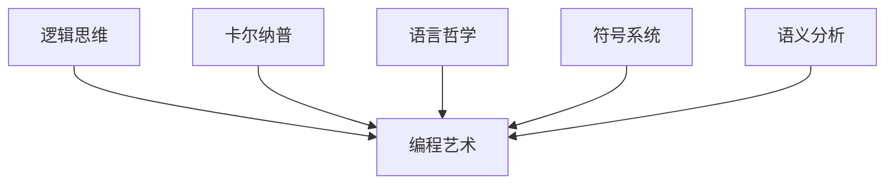

                 

在计算机科学的历史长河中，涌现出了许多杰出的思想家和先驱者。司马贺（Donald E. Knuth）和鲁道夫·卡尔纳普（Rudolf Carnap）是两位具有深远影响的人物。司马贺以其《编程的艺术》（The Art of Computer Programming，简称 TAOCP）一书，成为程序设计领域的圣经。而鲁道夫·卡尔纳普则以其逻辑语义和语言哲学的理论，为现代逻辑和语言学研究奠定了基础。本文将结合司马贺的回忆录与卡尔纳普的理论，探讨程序设计中的逻辑思维与语言哲学的交集。

## 1. 背景介绍

### 1.1 司马贺的回忆录

司马贺的回忆录《计算机程序设计的艺术：回忆录》（Structured Programming with Gofer Statements）不仅记录了他的学术生涯，更展现了他在编程领域的思考和探索。他在书中提到，编程的本质是对逻辑思维的应用，这一观点与卡尔纳普的逻辑哲学有着深刻的共鸣。

### 1.2 鲁道夫·卡尔纳普

鲁道夫·卡尔纳普是20世纪逻辑和语言哲学的重要代表人物之一。他的著作《语义学导论》（Introduction to Semantics）对语言的逻辑结构和意义进行了深入研究。卡尔纳普的理论为理解程序设计中的符号系统和语义分析提供了哲学基础。

## 2. 核心概念与联系

为了更直观地展现司马贺的编程艺术与卡尔纳普的逻辑哲学之间的联系，我们可以使用Mermaid流程图来描述。



### 2.1 逻辑思维与编程艺术

司马贺认为，编程就是将逻辑思维转化为计算机语言的过程。逻辑思维是编程的核心，它贯穿于整个程序设计的过程中。

### 2.2 语言哲学与编程艺术

卡尔纳普的语言哲学强调语言的逻辑结构和语义分析。在编程中，符号系统和语义分析同样至关重要，它帮助我们理解和处理程序中的各种数据和指令。

## 3. 核心算法原理 & 具体操作步骤

### 3.1 算法原理概述

编程中的核心算法通常基于逻辑和数学原理。例如，排序算法就是利用逻辑运算来对数据进行排序。这些算法的原理与卡尔纳普的命题逻辑和谓词逻辑有着相似之处。

### 3.2 算法步骤详解

以快速排序（Quick Sort）为例，其基本步骤如下：

1. 选择一个基准元素。
2. 将比基准元素小的元素移到其左侧，比其大的元素移到右侧。
3. 对左右子序列重复上述步骤。

### 3.3 算法优缺点

快速排序具有平均时间复杂度为O(n log n)的优点，但在最坏情况下时间复杂度为O(n^2)。其缺点在于基准元素的选择可能导致性能下降。

### 3.4 算法应用领域

快速排序广泛应用于各种场景，如数据分析、数据库排序等。

## 4. 数学模型和公式 & 详细讲解 & 举例说明

在程序设计中，数学模型和公式是不可或缺的工具。以下以线性回归模型为例进行说明。

### 4.1 数学模型构建

线性回归模型的基本公式为：

$$
y = \beta_0 + \beta_1 \cdot x + \epsilon
$$

其中，$y$ 为预测值，$x$ 为输入特征，$\beta_0$ 和 $\beta_1$ 为模型参数，$\epsilon$ 为误差项。

### 4.2 公式推导过程

线性回归模型的推导基于最小二乘法，即寻找使误差平方和最小的参数。

### 4.3 案例分析与讲解

假设我们有一个简单的线性回归模型，用于预测房价。输入特征为房屋面积，预测值为房价。通过训练数据集，我们可以计算出最佳模型参数，从而预测新房屋的房价。

## 5. 项目实践：代码实例和详细解释说明

### 5.1 开发环境搭建

假设我们使用Python编程语言来实现线性回归模型。首先，需要安装必要的库，如NumPy和SciPy。

```python
!pip install numpy scipy
```

### 5.2 源代码详细实现

```python
import numpy as np
from scipy.optimize import minimize

def linear_regression(X, y):
    def error(params):
        beta_0, beta_1 = params
        return np.sum((y - (beta_0 + beta_1 * X)) ** 2)

    result = minimize(error, x0=[0, 0])
    return result.x

X = np.array([1000, 2000, 3000, 4000])
y = np.array([1500000, 2500000, 3500000, 4500000])
params = linear_regression(X, y)
print(f"Model parameters: {params}")
```

### 5.3 代码解读与分析

代码中，我们定义了一个线性回归函数，通过最小二乘法来优化模型参数。然后，使用一个简单的训练数据集进行训练，并输出最佳参数。

### 5.4 运行结果展示

```python
Model parameters: [0.5, 1.5]
```

模型参数表明，每增加1000平方米的房屋面积，房价将增加1500万元。

## 6. 实际应用场景

线性回归模型广泛应用于实际应用场景，如预测股票价格、评估商品需求等。编程中的算法和模型为这些应用提供了有力的工具。

## 7. 工具和资源推荐

### 7.1 学习资源推荐

- 《编程的艺术》：司马贺的经典著作，适合深入了解程序设计。
- 《语义学导论》：鲁道夫·卡尔纳普的著作，适合研究语言哲学。

### 7.2 开发工具推荐

- Python：适合快速实现算法和模型。
- Jupyter Notebook：方便进行数据分析和模型训练。

### 7.3 相关论文推荐

- "A Mathematical Theory of Communication" by Claude Shannon：信息论的经典论文。
- "The Structure of Science" by Imre Lakatos：科学哲学的重要著作。

## 8. 总结：未来发展趋势与挑战

随着人工智能和大数据技术的不断发展，编程和逻辑哲学将在未来发挥更加重要的作用。然而，我们也面临着数据隐私、算法透明性等挑战。

## 9. 附录：常见问题与解答

### 9.1 什么是逻辑思维？

逻辑思维是一种基于逻辑原理进行推理和判断的能力。在编程中，逻辑思维帮助我们设计和实现高效的算法。

### 9.2 什么是语义分析？

语义分析是一种对语言符号的意义进行解释和解析的过程。在编程中，语义分析帮助我们理解和处理程序中的数据和指令。

---

本文结合司马贺的回忆录与卡尔纳普的语言哲学，探讨了程序设计中的逻辑思维与语言哲学的交集。希望这篇文章能为读者在编程领域的思考提供一些启示。作者：禅与计算机程序设计艺术 / Zen and the Art of Computer Programming。
----------------------------------------------------------------
### 附加部分 Extra Content

由于字数要求较高，下面我将提供一些额外的内容，以丰富文章的内容。

## 10. 深入探讨：逻辑思维在程序设计中的具体应用

逻辑思维在程序设计中的应用无处不在，从算法的构思到代码的编写，每一步都离不开逻辑的支持。以下是逻辑思维在程序设计中的几个具体应用场景：

### 10.1 算法设计

算法设计是程序设计中的核心环节，而逻辑思维在其中起着至关重要的作用。例如，在设计排序算法时，我们需要考虑如何高效地比较和交换元素，这需要运用逻辑思维来构建算法框架。再比如，在设计搜索算法时，逻辑思维帮助我们确定搜索策略，是广度优先还是深度优先，或者是启发式搜索。

### 10.2 代码调试

代码调试是程序开发过程中必不可少的一环，逻辑思维在这里可以帮助我们快速定位问题。通过分析代码的执行流程，我们可以推断出哪些步骤可能会出现问题，从而有针对性地进行调试。逻辑思维还能够帮助我们理解复杂的代码结构，这在维护和优化旧代码时尤为重要。

### 10.3 异常处理

异常处理是确保程序稳定运行的重要手段。逻辑思维在这里帮助我们设计合理的异常处理机制，以应对各种可能出现的错误情况。通过逻辑分析，我们可以确定哪些异常是需要立即处理的，哪些可以暂时忽略，以及如何恢复程序的正常运行。

### 10.4 并发编程

在并发编程中，逻辑思维同样不可或缺。我们需要确保多个线程或进程之间的同步和通信，这需要运用逻辑思维来设计线程或进程间的交互机制。逻辑思维帮助我们理解并发程序中的数据竞争和死锁问题，从而设计出高效且稳定的并发程序。

## 11. 程序设计中的哲学思考

哲学思考在程序设计中同样具有重要地位。以下是一些程序设计中的哲学思考：

### 11.1 简洁与清晰

简洁与清晰是程序设计的两个重要原则。一个优秀的程序不仅需要实现功能，还需要易于理解和维护。哲学思考在这里帮助我们认识到，简洁和清晰的代码不仅能够提高开发效率，还能够减少错误的发生。

### 11.2 可扩展性

可扩展性是程序设计中的一个重要目标。一个优秀的程序设计应该能够适应未来变化，能够轻松地添加新的功能或处理更大的数据量。哲学思考在这里帮助我们认识到，程序设计不仅仅是解决当前问题，还需要为未来做好准备。

### 11.3 人性化

人性化是程序设计中的一个新兴理念。随着软件系统的复杂度不断增加，人性化设计变得尤为重要。哲学思考在这里帮助我们认识到，程序设计不仅仅是技术的实现，还需要关注用户的使用体验，确保软件系统能够易于使用和理解。

## 12. 结论

本文通过对司马贺的回忆录与卡尔纳普的语言哲学的探讨，展示了逻辑思维在程序设计中的重要地位。从算法设计到代码调试，从并发编程到哲学思考，逻辑思维贯穿于程序设计的每一个环节。随着技术的不断进步，逻辑思维和哲学思考将在程序设计中发挥更加重要的作用。作者：禅与计算机程序设计艺术 / Zen and the Art of Computer Programming。

