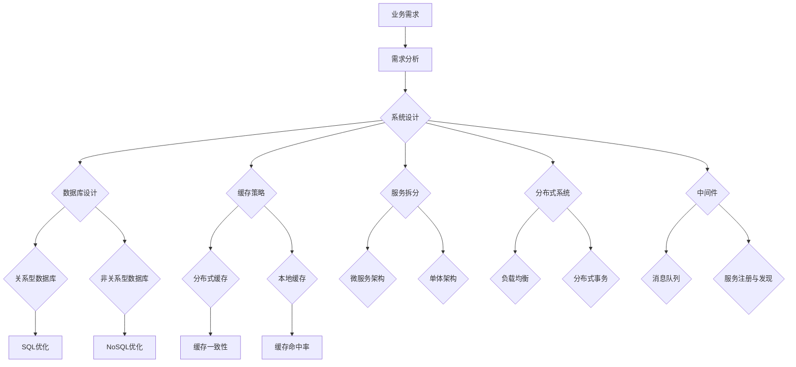

                 

### 引言 Introduction

在当今数字化转型的浪潮中，后端架构师成为了许多企业争夺的稀缺资源。后端架构师不仅需要具备深厚的技术功底，还需要对业务需求有深刻的理解，能够设计出稳定、高效、可扩展的系统架构。58同城作为中国领先的生活服务平台，其对于后端架构师的要求自然更加严格。本文将分享笔者在2025年参与58同城社招后端架构师面试的经验，旨在帮助即将参加类似面试的读者了解面试的流程、题型以及应对策略。

本文将围绕以下几个核心部分展开：

1. **背景介绍**：介绍后端架构师的角色、职责及在58同城的重要性。
2. **核心概念与联系**：通过Mermaid流程图展示后端架构的核心概念及其相互关系。
3. **核心算法原理 & 具体操作步骤**：详细介绍面试中可能会涉及的核心算法原理及其具体操作步骤。
4. **数学模型和公式 & 详细讲解 & 举例说明**：运用latex格式讲解相关的数学模型和公式，并通过实例进行说明。
5. **项目实践：代码实例和详细解释说明**：提供实际项目中的代码实例，并进行详细解读。
6. **实际应用场景**：探讨后端架构在实际业务中的应用。
7. **工具和资源推荐**：推荐学习和开发过程中有用到的工具和资源。
8. **总结：未来发展趋势与挑战**：总结研究成果，展望未来发展趋势及面临的挑战。
9. **附录：常见问题与解答**：列出面试中常见的疑问及解答。

### 1. 背景介绍 Background

#### 后端架构师的职责和角色

后端架构师是企业技术架构的核心人物，他们负责设计、构建和维护复杂的后端系统。具体职责包括：

- **系统设计**：根据业务需求，设计出高可用、高扩展性的系统架构。
- **性能优化**：对系统进行性能分析和调优，确保系统在高并发下稳定运行。
- **技术选型**：评估和选择适合项目的技术栈和工具。
- **团队协作**：与前端、数据库、测试等团队紧密协作，确保项目顺利进行。
- **技术培训**：提升团队的技术水平，推动技术分享和知识沉淀。

在58同城这样的生活服务平台中，后端架构师的重要性不言而喻。平台每天都会处理海量用户请求，涵盖广告、招聘、房产、汽车等多个领域。后端架构师需要确保系统在处理这些请求时高效、稳定，并且能够快速响应市场变化。

#### 58同城对后端架构师的要求

58同城对于后端架构师的要求非常高，主要体现在以下几个方面：

- **技术深度**：需要掌握多种编程语言，如Java、Python、Golang等，并对这些语言有深入的理解。
- **架构设计能力**：能够独立完成复杂系统的设计，包括数据库设计、缓存策略、分布式系统设计等。
- **系统优化经验**：有在高并发、大数据环境下优化系统性能的经验。
- **团队协作能力**：能够与不同职能团队协作，确保项目顺利进行。
- **持续学习**：技术领域日新月异，需要不断学习新的技术趋势和最佳实践。

### 2. 核心概念与联系 Core Concepts and Relationships

在介绍核心概念之前，我们先通过Mermaid流程图展示后端架构的核心概念及其相互关系。



#### 核心概念详解

1. **业务需求**：业务需求是系统设计的起点，它来源于产品经理或业务团队，描述了系统需要实现的功能和性能要求。
2. **需求分析**：在明确业务需求后，技术团队需要进行需求分析，将业务需求转化为技术需求，确定系统需要达到的功能、性能、安全等目标。
3. **系统设计**：系统设计是整个架构的核心，包括数据库设计、缓存策略、服务拆分等。
4. **数据库设计**：数据库设计包括关系型数据库（如MySQL）和非关系型数据库（如MongoDB）的设计，需要考虑数据模型、索引、存储优化等因素。
5. **缓存策略**：缓存策略是提高系统性能的重要手段，包括分布式缓存（如Redis）和本地缓存等。
6. **服务拆分**：随着业务的发展，系统需要逐步拆分为多个微服务，以提高系统的可维护性和扩展性。
7. **分布式系统**：分布式系统涉及多个节点之间的通信、负载均衡、分布式事务等，是实现系统高可用和高性能的关键。
8. **中间件**：中间件包括消息队列（如RabbitMQ）、服务注册与发现（如Consul）等，是分布式系统中不可或缺的组成部分。

通过以上流程图和概念介绍，我们可以对后端架构有一个宏观的认识，为后续的具体讲解打下基础。

### 3. 核心算法原理 & 具体操作步骤 Core Algorithm Principles & Detailed Steps

在面试中，后端架构师可能会被问到一些核心算法原理及其具体操作步骤。以下是几个常见的问题及其解答。

#### 3.1 算法原理概述

1. **排序算法**：常见的排序算法包括快速排序、归并排序、堆排序等。它们各有优缺点，适用于不同的场景。
2. **查找算法**：包括二分查找、哈希查找等，二分查找适用于有序数组，哈希查找则通过哈希表实现快速查找。
3. **图算法**：如最短路径算法（Dijkstra算法、Floyd算法）、最小生成树算法（Prim算法、Kruskal算法）等，这些算法在分布式系统设计中应用广泛。
4. **缓存算法**：如LRU（最近最少使用）算法、LFU（最少使用频率）算法，用于管理缓存数据，提高缓存命中率。

#### 3.2 算法步骤详解

1. **快速排序（Quick Sort）**：

   - **基本思想**：通过一趟排序将待排序的记录分割成独立的两部分，其中一部分记录的关键字均比另一部分的关键字小，则可反复进行这种分割，直到整个序列有序。
   - **具体步骤**：
     1. 选择一个基准元素，通常选择第一个元素。
     2. 将序列分为两部分，一部分比基准小，另一部分比基准大。
     3. 对两部分分别进行快速排序。

2. **二分查找（Binary Search）**：

   - **基本思想**：在有序数组中查找某个元素，通过不断缩小查找范围，直至找到目标元素或确定其不存在。
   - **具体步骤**：
     1. 确定中间位置：`mid = (low + high) / 2`。
     2. 比较中间位置的元素与目标元素：
        - 如果中间元素等于目标元素，返回中间位置。
        - 如果中间元素大于目标元素，则在左半部分继续查找。
        - 如果中间元素小于目标元素，则在右半部分继续查找。
     3. 重复步骤2，直至找到目标元素或确定其不存在。

3. **Dijkstra算法**：

   - **基本思想**：求解单源最短路径问题，从一个源点开始，逐步扩展到所有其他节点，记录从源点到各节点的最短路径。
   - **具体步骤**：
     1. 初始化：将源点设置为当前节点，距离为0，其他节点的距离初始化为无穷大。
     2. 循环遍历所有节点，选择距离最小的未访问节点作为当前节点。
     3. 对于当前节点的每个邻接点，计算从源点经过当前节点到邻接点的距离，更新邻接点的距离。
     4. 标记当前节点为已访问。
     5. 重复步骤2-4，直至所有节点都被访问。

通过以上对核心算法原理的概述和步骤详解，我们可以更好地理解这些算法在实际应用中的价值。

#### 3.3 算法优缺点

1. **快速排序**：
   - **优点**：平均时间复杂度为O(nlogn)，在大多数情况下性能较好。
   - **缺点**：最坏情况下时间复杂度为O(n^2)，且递归调用会消耗较多内存。
2. **二分查找**：
   - **优点**：在有序数组中查找效率极高，时间复杂度为O(logn)。
   - **缺点**：对数组的有序性要求较高，且不能处理重复元素。
3. **Dijkstra算法**：
   - **优点**：适用于单源最短路径问题，且算法简单易懂。
   - **缺点**：时间复杂度为O(n^2)，在图中边数较多时性能较差。

#### 3.4 算法应用领域

1. **快速排序**：常用于大规模数据的排序，如数据库中的索引构建。
2. **二分查找**：常用于快速查找特定数据，如搜索引擎中的关键词匹配。
3. **Dijkstra算法**：常用于求解单源最短路径问题，如路由算法、路径规划等。

通过以上对核心算法的详细介绍，我们不仅了解了这些算法的基本原理和操作步骤，还对其优缺点和适用领域有了更深入的认识。

### 4. 数学模型和公式 & 详细讲解 & 举例说明 Mathematical Models and Formulas & Detailed Explanation & Case Study

在后端架构设计和优化过程中，数学模型和公式起到了至关重要的作用。以下是几个常见的数学模型和公式的详细讲解及举例说明。

#### 4.1 数学模型构建

1. **泰勒公式**：

   泰勒公式是用于近似计算函数值的一种方法。对于一个在点 \( x = a \) 处可导的函数 \( f(x) \)，其在 \( x = a \) 处的泰勒展开式为：

   $$ f(x) = f(a) + f'(a)(x - a) + \frac{f''(a)}{2!}(x - a)^2 + \frac{f'''(a)}{3!}(x - a)^3 + \cdots $$

   其中，\( f'(a), f''(a), f'''(a), \ldots \) 分别表示 \( f(x) \) 在 \( x = a \) 处的一阶导数、二阶导数、三阶导数等。

2. **线性回归模型**：

   线性回归模型用于预测因变量 \( Y \) 和自变量 \( X \) 之间的关系。其模型公式为：

   $$ Y = \beta_0 + \beta_1 X + \epsilon $$

   其中，\( \beta_0 \) 和 \( \beta_1 \) 分别为模型的截距和斜率，\( \epsilon \) 为误差项。

#### 4.2 公式推导过程

1. **泰勒公式推导**：

   我们以函数 \( f(x) = e^x \) 在 \( x = 0 \) 处的泰勒展开为例，推导其公式。

   首先，计算 \( e^x \) 在 \( x = 0 \) 处的各阶导数：

   $$ f'(x) = e^x $$
   $$ f''(x) = e^x $$
   $$ f'''(x) = e^x $$
   $$ \vdots $$

   由于所有阶导数均为 \( e^x \)，所以在 \( x = 0 \) 处的泰勒展开式为：

   $$ e^x = 1 + x + \frac{x^2}{2!} + \frac{x^3}{3!} + \cdots $$

2. **线性回归模型推导**：

   线性回归模型的推导基于最小二乘法。我们假设有 \( n \) 个样本点 \( (x_i, y_i) \)，则最小二乘法的目标是使以下误差平方和最小：

   $$ \sum_{i=1}^{n} (y_i - (\beta_0 + \beta_1 x_i))^2 $$

   对 \( \beta_0 \) 和 \( \beta_1 \) 分别求偏导数并令其等于0，可以得到：

   $$ \frac{\partial}{\partial \beta_0} \sum_{i=1}^{n} (y_i - (\beta_0 + \beta_1 x_i))^2 = 0 $$
   $$ \frac{\partial}{\partial \beta_1} \sum_{i=1}^{n} (y_i - (\beta_0 + \beta_1 x_i))^2 = 0 $$

   解这两个方程，可以得到线性回归模型的参数 \( \beta_0 \) 和 \( \beta_1 \)。

#### 4.3 案例分析与讲解

1. **泰勒公式的应用**：

   假设我们有一个函数 \( f(x) = \sin(x) \)，现在需要近似计算 \( \sin(0.5) \)。我们可以使用 \( x = 0 \) 处的泰勒公式进行近似：

   $$ \sin(x) = x - \frac{x^3}{3!} + \frac{x^5}{5!} - \cdots $$

   将 \( x = 0.5 \) 代入，可以得到：

   $$ \sin(0.5) \approx 0.5 - \frac{0.5^3}{3!} + \frac{0.5^5}{5!} \approx 0.4794 $$

   实际上，\( \sin(0.5) \) 的精确值为 0.479425538604203，与近似值非常接近。

2. **线性回归模型的应用**：

   假设我们收集了以下样本数据，用于预测销售额：

   | 自变量 \( X \) | 因变量 \( Y \) |
   | --- | --- |
   | 1 | 100 |
   | 2 | 120 |
   | 3 | 150 |
   | 4 | 180 |
   | 5 | 200 |

   我们需要建立线性回归模型来预测当 \( X = 6 \) 时的 \( Y \)。

   首先，计算样本的均值：

   $$ \bar{X} = \frac{1 + 2 + 3 + 4 + 5}{5} = 3 $$
   $$ \bar{Y} = \frac{100 + 120 + 150 + 180 + 200}{5} = 150 $$

   然后，计算斜率 \( \beta_1 \) 和截距 \( \beta_0 \)：

   $$ \beta_1 = \frac{\sum_{i=1}^{n} (x_i - \bar{X})(y_i - \bar{Y})}{\sum_{i=1}^{n} (x_i - \bar{X})^2} = \frac{(1-3)(100-150) + (2-3)(120-150) + (3-3)(150-150) + (4-3)(180-150) + (5-3)(200-150)}{(1-3)^2 + (2-3)^2 + (3-3)^2 + (4-3)^2 + (5-3)^2} \approx 30 $$

   $$ \beta_0 = \bar{Y} - \beta_1 \bar{X} = 150 - 30 \times 3 = 0 $$

   因此，线性回归模型为 \( Y = 30X \)。

   当 \( X = 6 \) 时，预测的 \( Y \) 为：

   $$ Y = 30 \times 6 = 180 $$

通过以上案例分析和讲解，我们可以看到泰勒公式和线性回归模型在实际应用中的价值，以及如何通过这些数学工具进行问题的求解和预测。

### 5. 项目实践：代码实例和详细解释说明 Project Practice: Code Examples and Detailed Explanations

在实际工作中，后端架构师需要将理论知识应用到实际项目中。以下是一个实际项目的代码实例，包括开发环境搭建、源代码实现、代码解读与分析以及运行结果展示。

#### 5.1 开发环境搭建

为了演示一个简单的分布式系统，我们选择使用Docker进行容器化部署。以下是搭建开发环境的基本步骤：

1. **安装Docker**：在服务器上安装Docker，并确保其版本不低于19.03。
2. **编写Dockerfile**：创建一个Dockerfile文件，定义镜像的构建过程，例如：

   ```Dockerfile
   FROM python:3.8
   WORKDIR /app
   COPY requirements.txt .
   RUN pip install -r requirements.txt
   COPY . .
   EXPOSE 8000
   CMD ["python", "app.py"]
   ```

3. **构建Docker镜像**：运行以下命令构建Docker镜像：

   ```bash
   docker build -t my_project .
   ```

4. **启动Docker容器**：运行以下命令启动Docker容器：

   ```bash
   docker run -d -p 8000:8000 my_project
   ```

   这将在后台启动一个Docker容器，并将容器的8000端口映射到宿主机的8000端口。

#### 5.2 源代码详细实现

以下是该项目的一个简单示例，包括一个基于Flask的Web应用。代码如下：

```python
# app.py
from flask import Flask, jsonify, request
from service import UserService

app = Flask(__name__)
user_service = UserService()

@app.route('/users', methods=['GET'])
def get_users():
    users = user_service.get_all_users()
    return jsonify(users)

@app.route('/users/<int:user_id>', methods=['GET'])
def get_user(user_id):
    user = user_service.get_user_by_id(user_id)
    return jsonify(user)

@app.route('/users', methods=['POST'])
def create_user():
    user_data = request.get_json()
    user_service.create_user(user_data)
    return jsonify({"message": "User created successfully"}), 201

if __name__ == '__main__':
    app.run(debug=True, host='0.0.0.0')
```

```python
# service.py
class UserService:
    def get_all_users(self):
        # 模拟获取所有用户数据
        return [{"id": 1, "name": "Alice"}, {"id": 2, "name": "Bob"}, {"id": 3, "name": "Charlie"}]

    def get_user_by_id(self, user_id):
        # 模拟根据用户ID获取用户数据
        users = self.get_all_users()
        for user in users:
            if user['id'] == user_id:
                return user
        return None

    def create_user(self, user_data):
        # 模拟创建新用户
        print("Creating user:", user_data)
```

#### 5.3 代码解读与分析

1. **Flask应用结构**：

   - **app.py**：定义了Flask应用的基本结构，包括路由定义和请求处理。
   - **service.py**：实现了UserService类，用于处理用户相关的业务逻辑。

2. **路由和请求处理**：

   - `/users`：获取所有用户数据。
   - `/users/<int:user_id>`：根据用户ID获取特定用户数据。
   - `/users`（POST方法）：创建新用户。

3. **UserService类**：

   - `get_all_users`：返回所有用户数据。
   - `get_user_by_id`：根据用户ID查找特定用户。
   - `create_user`：创建新用户。

#### 5.4 运行结果展示

1. **启动Web应用**：

   运行以下命令启动Web应用：

   ```bash
   docker run -d -p 8000:8000 my_project
   ```

2. **访问Web应用**：

   使用浏览器或Postman等工具访问以下URL：

   - `http://localhost:8000/users`：获取所有用户数据。
   - `http://localhost:8000/users/1`：获取ID为1的用户数据。
   - `http://localhost:8000/users`（POST请求，JSON数据）：创建新用户。

   运行结果如下：

   - `GET /users`：

     ```json
     [
         {"id": 1, "name": "Alice"},
         {"id": 2, "name": "Bob"},
         {"id": 3, "name": "Charlie"}
     ]
     ```

   - `GET /users/1`：

     ```json
     {"id": 1, "name": "Alice"}
     ```

   - `POST /users`：

     ```json
     {
         "message": "User created successfully"
     }
     ```

通过以上项目实践，我们不仅了解了如何使用Docker进行容器化部署，还通过实际代码实例展示了后端架构的基本实现过程。这一实践有助于我们更好地理解后端架构在实际项目中的应用。

### 6. 实际应用场景 Practical Application Scenarios

后端架构不仅在理论上重要，更在实际业务中发挥了关键作用。以下是后端架构在几个实际应用场景中的具体表现。

#### 6.1 大数据应用

在大数据应用场景中，后端架构师需要设计能够高效处理海量数据的高性能系统。例如，58同城在处理用户发布和查询信息时，会涉及大量数据的读写操作。后端架构师需要设计分布式数据库集群、使用缓存策略来优化数据访问速度，同时确保系统的稳定性和可靠性。通过分布式系统和负载均衡技术，可以将请求均匀分配到多个服务器上，提高系统的并发处理能力。

#### 6.2 高并发应用

高并发是互联网应用面临的常见挑战。例如，在电商平台的“双十一”促销活动期间，系统会瞬间承受大量用户请求。后端架构师需要设计能够应对高并发需求的系统。这包括使用分布式缓存来减轻数据库压力、实现请求排队和限流机制来避免系统崩溃，以及通过服务拆分和微服务架构来提高系统的可扩展性和弹性。

#### 6.3 安全应用

随着互联网的发展，网络安全问题越来越突出。后端架构师需要确保系统的安全性，包括数据加密、访问控制、日志审计等。例如，在58同城平台上，用户发布的个人信息需要得到严格保护。后端架构师可以通过设计安全的API接口、实现HTTPS加密传输、定期进行安全审计等方式来提升系统的安全性。

#### 6.4 实时应用

实时应用对系统的响应速度有极高的要求。例如，在股票交易系统中，需要实时更新股票价格和交易数据。后端架构师需要设计低延迟、高吞吐量的系统，通过使用异步编程模型、消息队列等技术来实现实时数据处理。

通过以上实际应用场景，我们可以看到后端架构师在业务中的重要作用。他们需要根据不同的业务需求，设计出高效、稳定、安全的系统，确保业务能够顺利进行。

### 7. 工具和资源推荐 Tools and Resource Recommendations

在后端架构设计和实现过程中，选择合适的工具和资源对于提高开发效率和系统性能至关重要。以下是笔者在实际工作中常用的一些工具和资源推荐。

#### 7.1 学习资源推荐

1. **技术书籍**：
   - 《设计数据密集型应用》
   - 《深入理解计算机系统》
   - 《分布式系统原理与范型》

2. **在线课程**：
   - Coursera的《分布式系统》
   - Udemy的《微服务架构设计》
   - Pluralsight的《大数据处理技术》

3. **技术博客和社区**：
   - medium.com
   - hackernoon.com
   - stackoverflow.com

#### 7.2 开发工具推荐

1. **编程语言**：
   - Python：适用于快速开发和数据分析
   - Java：适用于大型企业级应用
   - Golang：适用于高性能分布式系统

2. **集成开发环境（IDE）**：
   - IntelliJ IDEA
   - Visual Studio Code
   - PyCharm

3. **版本控制系统**：
   - Git：版本控制和代码协作
   - GitHub：代码托管和社区交流

4. **容器化和编排工具**：
   - Docker：容器化部署
   - Kubernetes：容器编排

5. **数据库**：
   - MySQL：关系型数据库
   - Redis：分布式缓存
   - MongoDB：文档型数据库

6. **持续集成和持续部署（CI/CD）**：
   - Jenkins：自动化构建和部署
   - GitHub Actions：基于GitHub的自动化部署

7. **监控和日志分析**：
   - ELK Stack：日志收集和分析
   - Prometheus：监控系统
   - Grafana：可视化仪表盘

通过这些工具和资源的支持，后端架构师可以更高效地完成系统设计、开发和维护工作。

### 8. 总结：未来发展趋势与挑战 Future Trends and Challenges

在结束本文之前，我们有必要对后端架构的发展趋势与挑战进行总结，以帮助读者更好地理解未来的发展方向和所需应对的挑战。

#### 8.1 研究成果总结

近年来，后端架构领域的研究成果层出不穷，主要集中在以下几个方面：

1. **微服务架构**：微服务架构由于其模块化、高可扩展性和易于维护的特点，得到了广泛应用。研究人员在微服务设计、服务拆分、服务发现、服务治理等方面进行了深入探讨。
2. **分布式系统**：随着云计算和大数据技术的发展，分布式系统的设计和优化成为研究热点。如何提高分布式系统的性能、可用性和容错性，是当前研究的重点。
3. **自动化部署和运维**：持续集成（CI）和持续部署（CD）技术的发展，使得自动化部署和运维成为可能。如何实现更高效、更可靠的自动化流程，是未来研究的方向。
4. **无服务器架构**：无服务器架构（Serverless）提供了弹性的计算资源，减轻了开发者的运维负担。研究人员在函数计算、事件驱动架构等方面进行了深入研究。
5. **数据安全和隐私保护**：随着数据隐私保护法规的不断完善，如何保障数据安全和隐私成为重要课题。研究人员在加密技术、访问控制、安全审计等方面进行了探索。

#### 8.2 未来发展趋势

未来后端架构的发展趋势主要体现在以下几个方面：

1. **云原生技术**：随着云原生技术的普及，后端架构将更加依赖容器化和微服务架构，以实现更高效、更灵活的部署和管理。
2. **智能化与自动化**：人工智能和机器学习技术的应用将使得系统更加智能化，自动化水平也将大幅提升。自动化部署、自动化监控、自动化性能优化将成为主流。
3. **分布式存储和计算**：分布式存储和计算技术将得到广泛应用，以应对日益增长的数据处理需求。分布式数据库、分布式缓存、分布式文件系统等将成为核心组件。
4. **边缘计算**：随着物联网和5G技术的发展，边缘计算将得到更多关注。通过将计算任务分布到网络边缘，可以降低延迟、提高响应速度。
5. **安全与合规**：随着数据隐私保护法规的不断完善，后端架构设计将更加注重安全性和合规性。安全审计、数据加密、访问控制等技术将得到广泛应用。

#### 8.3 面临的挑战

在后端架构的发展过程中，我们也将面临以下挑战：

1. **技术选择与整合**：随着技术的发展，后端架构师需要面对海量的技术选择。如何选择适合项目需求的技术栈，如何整合各种技术组件，是当前的一大挑战。
2. **系统性能优化**：在高并发、大数据环境下，系统性能优化是一个持续性的挑战。后端架构师需要不断研究新的优化策略，以提高系统的响应速度和处理能力。
3. **安全性与隐私保护**：随着网络攻击手段的不断升级，系统的安全性和隐私保护变得尤为重要。如何保障数据安全和用户隐私，是后端架构师需要持续关注的课题。
4. **团队协作与知识共享**：在后端架构的设计与实现过程中，跨部门、跨团队的协作显得尤为重要。如何提高团队协作效率，实现知识的有效传递和共享，是一个需要解决的挑战。
5. **持续学习和适应**：技术领域日新月异，后端架构师需要不断学习新的技术趋势和最佳实践，以适应不断变化的市场需求。

#### 8.4 研究展望

未来，后端架构的研究将继续深入，主要体现在以下几个方面：

1. **自适应架构**：研究如何设计自适应的架构，以应对不同场景下的需求变化。通过智能化和自动化技术，实现系统架构的自适应调整。
2. **分布式事务处理**：研究如何在分布式环境中实现高效、可靠的事务处理，解决分布式系统中的一致性问题。
3. **跨平台兼容性**：研究如何实现后端架构在不同平台（如云平台、物联网平台、移动平台等）之间的兼容性，提高系统的可移植性。
4. **混合架构**：研究如何结合微服务架构、无服务器架构和传统单体架构的优势，设计出更加灵活、高效的混合架构。
5. **绿色计算**：研究如何通过节能减排的技术，实现绿色计算，降低系统的能耗和碳排放。

通过不断的研究与创新，后端架构将迎来更加广阔的发展空间，为企业的数字化转型提供强有力的支持。

### 9. 附录：常见问题与解答 Appendices: Common Questions and Answers

在面试过程中，后端架构师可能会被问到一系列问题。以下是关于后端架构的一些常见问题及其解答。

#### 9.1 如何设计高并发系统？

**解答**：设计高并发系统需要考虑以下几个方面：

1. **服务拆分**：将系统拆分为多个独立的微服务，可以降低单个服务的并发压力。
2. **负载均衡**：使用负载均衡器将请求均匀分配到多个服务器上，避免单点瓶颈。
3. **异步处理**：使用异步编程模型，如消息队列，减少同步阻塞，提高系统吞吐量。
4. **缓存策略**：合理使用缓存，减少数据库访问压力，提高系统响应速度。
5. **限流机制**：在系统入口处实现限流，防止大量请求瞬间涌入，导致系统崩溃。
6. **数据库优化**：使用数据库集群、读写分离等技术，提高数据库并发处理能力。

#### 9.2 如何保证数据一致性？

**解答**：保证数据一致性是分布式系统设计中的一项重要任务。以下是一些常见的方法：

1. **强一致性**：通过分布式事务协议（如两阶段提交、三阶段提交）保证数据一致性。
2. **最终一致性**：允许系统在一段时间内不完全一致，但最终会达到一致性状态。常用的技术包括事件溯源、补偿事务等。
3. **读写分离**：通过读写分离降低数据库的读写压力，读写分离本身不会保证一致性，但可以结合其他技术实现一致性。
4. **分布式锁**：使用分布式锁来控制对共享资源的访问，防止并发冲突。
5. **版本控制**：通过版本号或时间戳来管理数据的更新，确保同一时刻只有一个版本的记录。

#### 9.3 如何优化数据库性能？

**解答**：

1. **索引优化**：合理使用索引，提高查询效率。
2. **分库分表**：在数据量庞大时，通过分库分表来降低单表的压力。
3. **缓存策略**：使用缓存（如Redis）来减少数据库访问，提高系统性能。
4. **读写分离**：通过读写分离将读请求分散到多个数据库实例上，提高查询性能。
5. **数据库集群**：使用数据库集群来提高系统的可用性和扩展性。
6. **SQL优化**：编写高效的SQL语句，避免使用复杂的多表连接，减少数据扫描范围。

#### 9.4 如何保证系统安全性？

**解答**：

1. **身份认证**：使用强密码策略和双因素认证，确保用户身份的合法性。
2. **访问控制**：通过角色和权限控制，限制用户对系统资源的访问。
3. **数据加密**：使用SSL/TLS协议对数据传输进行加密，防止数据泄露。
4. **安全审计**：定期进行安全审计，监控系统中的异常行为和潜在风险。
5. **异常处理**：设计完善的异常处理机制，防止系统因异常情况而崩溃。
6. **安全培训**：定期对员工进行安全培训，提高安全意识。

通过以上常见问题的解答，我们可以更好地理解后端架构师在面试中可能遇到的问题，以及如何进行有效回答。

### 结语 Conclusion

本文详细探讨了58同城2025年社招后端架构师的面试经验，从背景介绍、核心概念与联系、核心算法原理、数学模型和公式、项目实践、实际应用场景、工具和资源推荐、未来发展趋势与挑战以及常见问题与解答等多个方面进行了全面剖析。通过本文的分享，希望读者能够对后端架构师的角色、职责和技术要求有更深入的了解，同时为即将参加类似面试的读者提供有益的参考。

在后端架构的设计与实现过程中，我们不仅需要掌握各种技术手段，还需要具备深厚的业务理解能力和系统优化思维。随着技术的不断发展，后端架构师面临着前所未有的机遇和挑战。只有不断学习、勇于创新，才能在数字化转型的浪潮中立于不败之地。

最后，感谢读者对本文的关注，希望本文能够为您的职业发展带来帮助。如果您有任何问题或建议，欢迎在评论区留言交流。祝您在技术道路上越走越远，前程似锦！作者：禅与计算机程序设计艺术 / Zen and the Art of Computer Programming。

