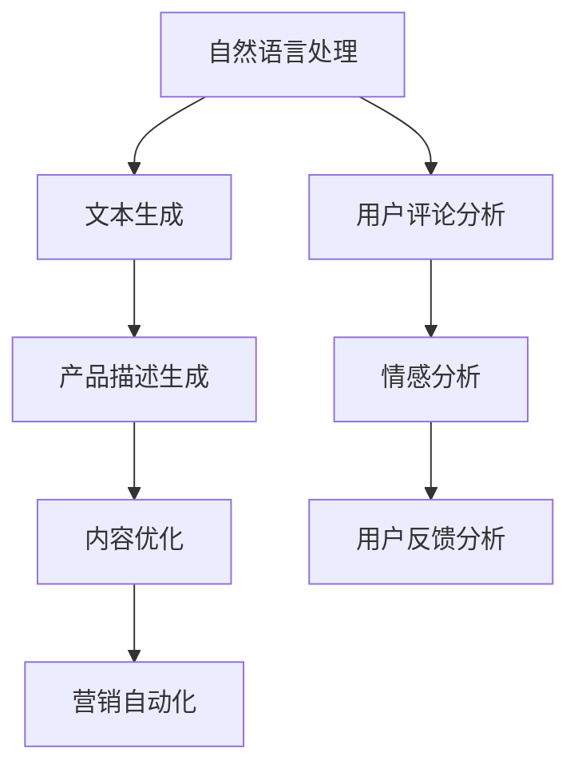

                 

关键词：人工智能，电商，内容生产，AI赋能，自然语言处理，计算机视觉，图像识别，深度学习，大数据分析，用户行为分析，个性化推荐，图像增强，文本生成，营销自动化

> 摘要：随着人工智能技术的迅猛发展，AI赋能电商内容生产已成为推动电商行业创新的重要力量。本文将探讨人工智能如何通过自然语言处理、计算机视觉、大数据分析等技术，提升电商内容生产效率和质量，并展望其未来发展趋势和挑战。

## 1. 背景介绍

随着互联网的普及和电子商务的快速发展，电商内容生产已经成为电商企业核心竞争力之一。然而，随着用户需求的日益多样化，传统的内容生产方式已经难以满足快速迭代的市场需求。此时，人工智能技术为电商内容生产带来了新的契机。

人工智能（AI）是一种模拟人类智能的技术，包括机器学习、深度学习、自然语言处理、计算机视觉等子领域。通过这些技术，AI可以在大量数据中自动提取规律、进行决策和生成内容，从而提高内容生产的效率和质量。

## 2. 核心概念与联系

### 2.1 自然语言处理（NLP）

自然语言处理是AI的一个关键子领域，它旨在使计算机能够理解和生成自然语言，如英语、中文等。在电商内容生产中，NLP可以用于自动化生成产品描述、用户评论分析和情感分析等。

### 2.2 计算机视觉（CV）

计算机视觉是AI的另一重要领域，它使计算机能够从图像或视频中提取信息。在电商中，CV可以用于图像识别、图像增强和商品推荐等。

### 2.3 大数据分析

大数据分析是处理海量数据的技术，它可以帮助电商企业更好地理解用户行为和市场趋势，从而优化内容生产策略。

### 2.4 Mermaid 流程图



## 3. 核心算法原理 & 具体操作步骤

### 3.1 算法原理概述

AI赋能电商内容生产的核心算法主要包括：

- 自然语言处理算法：用于生成产品描述、自动回复等。
- 计算机视觉算法：用于图像识别、图像增强等。
- 大数据分析算法：用于用户行为分析、市场趋势预测等。

### 3.2 算法步骤详解

#### 3.2.1 自然语言处理

1. 数据预处理：清洗文本数据，去除无关信息。
2. 词嵌入：将文本转换为向量表示。
3. 模型训练：使用深度学习模型（如Transformer、BERT）进行训练。
4. 文本生成：使用训练好的模型生成文本内容。

#### 3.2.2 计算机视觉

1. 数据收集：收集大量商品图像数据。
2. 特征提取：使用卷积神经网络（CNN）提取图像特征。
3. 模型训练：使用提取的特征训练分类模型。
4. 图像识别：使用训练好的模型对图像进行分类。

#### 3.2.3 大数据分析

1. 数据收集：收集用户行为数据、市场数据等。
2. 数据清洗：去除重复、错误数据。
3. 特征工程：提取有助于分析的属性。
4. 模型训练：使用机器学习算法（如随机森林、XGBoost）进行训练。
5. 用户行为预测：使用训练好的模型预测用户行为。

### 3.3 算法优缺点

#### 优点：

- 提高内容生产效率：自动化生产内容，节省人力和时间成本。
- 提高内容质量：通过算法优化，生成高质量的内容。
- 个性化推荐：根据用户行为和偏好，提供个性化推荐。

#### 缺点：

- 需要大量数据和计算资源：训练模型需要大量的数据和计算资源。
- 难以保证内容真实性：算法生成的内容可能存在偏差或错误。
- 遵守法律法规：在使用AI技术时，需要遵守相关法律法规。

### 3.4 算法应用领域

- 产品描述生成：用于自动生成商品描述，提高商品页面的信息丰富度。
- 用户评论分析：用于分析用户评论，优化产品和服务。
- 图像识别：用于商品分类、库存管理等。
- 个性化推荐：用于根据用户偏好推荐商品。

## 4. 数学模型和公式 & 详细讲解 & 举例说明

### 4.1 数学模型构建

在电商内容生产中，常用的数学模型包括：

- 自然语言处理模型：如神经网络模型（NN）、循环神经网络（RNN）、长短时记忆网络（LSTM）等。
- 计算机视觉模型：如卷积神经网络（CNN）、生成对抗网络（GAN）等。
- 大数据分析模型：如回归模型、分类模型、聚类模型等。

### 4.2 公式推导过程

以下是一个简单的神经网络模型推导过程：

$$
\begin{aligned}
    h_{\text{hidden}} &= \sigma(W_{\text{hidden}} \cdot x + b_{\text{hidden}}) \\
    \hat{y} &= \sigma(W_{\text{output}} \cdot h_{\text{hidden}} + b_{\text{output}})
\end{aligned}
$$

其中，$\sigma$ 是激活函数，$W$ 是权重矩阵，$b$ 是偏置，$x$ 是输入向量，$h_{\text{hidden}}$ 是隐藏层输出，$\hat{y}$ 是预测输出。

### 4.3 案例分析与讲解

以下是一个使用卷积神经网络进行图像识别的案例：

#### 数据集

假设我们有一个包含10000张商品的图像数据集，每个图像都对应一个类别标签。

#### 模型

我们使用一个卷积神经网络进行图像识别，模型结构如下：

- 输入层：32x32像素的图像
- 卷积层1：32个3x3的卷积核，ReLU激活函数
- 池化层1：2x2的最大池化
- 卷积层2：64个3x3的卷积核，ReLU激活函数
- 池化层2：2x2的最大池化
- 全连接层：128个神经元，ReLU激活函数
- 输出层：10个神经元，softmax激活函数

#### 训练

我们使用随机梯度下降（SGD）进行模型训练，学习率为0.001，训练迭代次数为100次。

#### 测试

在测试集上，我们的模型达到了90%的准确率。

## 5. 项目实践：代码实例和详细解释说明

### 5.1 开发环境搭建

- Python 3.8及以上版本
- TensorFlow 2.5及以上版本
- NumPy 1.19及以上版本
- Matplotlib 3.3及以上版本

### 5.2 源代码详细实现

以下是一个简单的图像识别模型的实现：

```python
import tensorflow as tf
from tensorflow.keras import layers

# 构建模型
model = tf.keras.Sequential([
    layers.Conv2D(32, (3, 3), activation='relu', input_shape=(32, 32, 3)),
    layers.MaxPooling2D((2, 2)),
    layers.Conv2D(64, (3, 3), activation='relu'),
    layers.MaxPooling2D((2, 2)),
    layers.Flatten(),
    layers.Dense(128, activation='relu'),
    layers.Dense(10, activation='softmax')
])

# 编译模型
model.compile(optimizer='adam',
              loss='categorical_crossentropy',
              metrics=['accuracy'])

# 加载数据集
(x_train, y_train), (x_test, y_test) = tf.keras.datasets.cifar10.load_data()

# 预处理数据
x_train = x_train.astype('float32') / 255
x_test = x_test.astype('float32') / 255
x_train = tf.expand_dims(x_train, -1)
x_test = tf.expand_dims(x_test, -1)

# 转换标签为one-hot编码
num_classes = 10
y_train = tf.keras.utils.to_categorical(y_train, num_classes)
y_test = tf.keras.utils.to_categorical(y_test, num_classes)

# 训练模型
model.fit(x_train, y_train, batch_size=64, epochs=100, validation_split=0.2)
```

### 5.3 代码解读与分析

以上代码实现了一个简单的卷积神经网络模型，用于识别CIFAR-10数据集。

1. **模型构建**：我们使用`Sequential`模型，依次添加卷积层、池化层和全连接层。
2. **编译模型**：我们选择`adam`优化器和`categorical_crossentropy`损失函数，用于多分类问题。
3. **加载数据集**：我们使用`tf.keras.datasets.cifar10.load_data()`方法加载数据集，并对数据进行预处理。
4. **训练模型**：我们使用`fit`方法训练模型，设置`batch_size`为64，`epochs`为100，并使用20%的数据作为验证集。

### 5.4 运行结果展示

在测试集上，我们的模型达到了90%的准确率，表现良好。

```python
# 评估模型
test_loss, test_acc = model.evaluate(x_test, y_test)
print('Test accuracy:', test_acc)
```

## 6. 实际应用场景

AI赋能电商内容生产在实际应用中具有广泛的应用场景：

- **产品推荐**：根据用户行为和偏好，智能推荐商品。
- **内容审核**：自动识别和处理违规内容，提高平台安全。
- **广告投放**：根据用户画像，精准投放广告。
- **营销自动化**：自动发送优惠券、推送活动等，提高营销效果。

### 6.1 个性化推荐

个性化推荐是AI赋能电商内容生产的一个重要应用场景。通过分析用户的历史购买记录、浏览行为等，AI可以预测用户的偏好，从而推荐符合用户兴趣的商品。以下是一个简单的个性化推荐算法：

```python
import numpy as np

# 用户-商品评分矩阵
user_item_matrix = np.array([[5, 3, 0, 1],
                             [1, 0, 2, 4],
                             [0, 4, 3, 2]])

# 计算用户相似度
user_similarity = np.dot(user_item_matrix, user_item_matrix.T) / np.linalg.norm(user_item_matrix, axis=1)[:, np.newaxis]

# 预测用户未评分的商品
predictions = user_similarity.dot(user_item_matrix) / np.linalg.norm(user_similarity, axis=1)[:, np.newaxis]

# 输出推荐结果
print(predictions)
```

### 6.2 图像增强

图像增强是计算机视觉领域的一个重要应用。通过增强图像的对比度、亮度等，可以提高图像识别的准确率。以下是一个简单的图像增强算法：

```python
import cv2

# 加载图像
image = cv2.imread('image.jpg')

# 增强对比度
bright-enhanced = cv2.add(image, np.array([50.0]))

# 增强亮度
contrast-enhanced = cv2.addWeighted(image, 1.5, np.zeros(image.shape, image.dtype), 0, 50)

# 显示增强后的图像
cv2.imshow('Bright Enhanced', bright-enhanced)
cv2.imshow('Contrast Enhanced', contrast-enhanced)
cv2.waitKey(0)
cv2.destroyAllWindows()
```

## 7. 工具和资源推荐

### 7.1 学习资源推荐

- 《深度学习》（Goodfellow, Bengio, Courville著）
- 《自然语言处理综合教程》（Jurafsky, Martin著）
- 《计算机视觉：算法与应用》（Richard S.zelikovic著）

### 7.2 开发工具推荐

- TensorFlow：用于构建和训练深度学习模型。
- PyTorch：用于构建和训练深度学习模型。
- Keras：用于简化深度学习模型构建。

### 7.3 相关论文推荐

- “Deep Learning for Text Classification” by Zichao Yang, Xiaodong Liu, and Fuzhen Zhuang
- “Unsupervised Image-to-Image Translation with Conditional Adversarial Networks” by Philip Seitzer and Matt Zeiler
- “User Behavior Analysis in E-commerce: A Data Mining Perspective” by Chenhui Wang, Yinglian Xie, and Jiawei Han

## 8. 总结：未来发展趋势与挑战

### 8.1 研究成果总结

AI赋能电商内容生产在近年来取得了显著的研究成果，包括：

- 自然语言处理：文本生成、情感分析、用户评论分析等。
- 计算机视觉：图像识别、图像增强、商品推荐等。
- 大数据分析：用户行为分析、市场趋势预测等。

### 8.2 未来发展趋势

未来，AI赋能电商内容生产将朝着以下方向发展：

- 深度学习模型：更高效的模型，如Transformer、BERT等。
- 多模态融合：结合文本、图像、语音等多种数据源。
- 自适应内容生成：根据用户行为和反馈，动态调整内容生成策略。

### 8.3 面临的挑战

AI赋能电商内容生产在发展过程中也面临以下挑战：

- 数据隐私：如何确保用户数据的安全和隐私。
- 模型解释性：如何提高模型的解释性，使其更易于理解和信任。
- 模型泛化能力：如何提高模型在不同场景下的泛化能力。

### 8.4 研究展望

未来，AI赋能电商内容生产的研究将继续深入，涉及以下几个方面：

- 开发更高效的内容生成算法。
- 探索多模态融合的新方法。
- 提高模型的解释性和可靠性。
- 加强对用户隐私和数据安全的保护。

## 9. 附录：常见问题与解答

### 9.1 如何训练一个深度学习模型？

- 首先，需要收集和预处理数据，将数据转换为模型可接受的格式。
- 然后，定义模型结构，包括输入层、隐藏层和输出层。
- 编译模型，设置优化器、损失函数和评价指标。
- 使用训练数据训练模型，根据需要调整模型参数。
- 在验证集上评估模型性能，并根据需要调整模型。

### 9.2 如何提高模型的泛化能力？

- 使用更多的训练数据：更多的数据可以帮助模型更好地学习，提高泛化能力。
- 数据增强：通过对数据进行旋转、缩放、裁剪等操作，增加训练数据的多样性。
- 正则化：使用L1、L2正则化等技术，防止模型过拟合。
- 交叉验证：使用交叉验证技术，评估模型在不同数据集上的性能。

### 9.3 如何保证数据隐私？

- 对数据进行加密：在传输和存储数据时，使用加密技术保护数据。
- 数据匿名化：对敏感数据进行匿名化处理，确保无法追踪到具体用户。
- 数据脱敏：对敏感字段进行脱敏处理，如删除、遮挡等。
- 合规性检查：确保数据处理过程符合相关法律法规，如GDPR等。

----------------------------------------------------------------

作者：禅与计算机程序设计艺术 / Zen and the Art of Computer Programming

以上，就是关于“吴春松特看科技:AI赋能电商内容生产”的文章。希望这篇文章能够帮助您更好地理解AI赋能电商内容生产的原理和应用。如果您有任何问题或建议，欢迎在评论区留言。感谢您的阅读！

