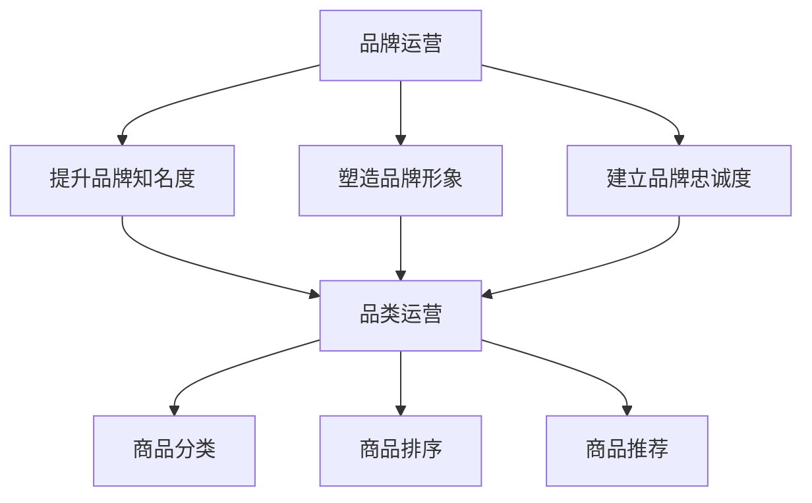

                 

关键词：品牌运营，品类管理，电商平台，供给能力，市场策略，消费者行为，数据分析，算法优化

> 摘要：随着互联网的普及和电商行业的飞速发展，品牌和品类运营成为提升电商平台供给能力的关键手段。本文将深入探讨品牌和品类运营的核心概念、实践方法、数学模型以及未来应用前景，为电商平台提供科学有效的运营策略。

## 1. 背景介绍

近年来，电商平台在我国经济发展中扮演着越来越重要的角色。从最初的网上零售，到如今涵盖生活服务、跨境电商等多个领域，电商平台的供给能力已成为衡量其竞争力的核心指标。品牌和品类运营作为电商平台运营的重要组成部分，直接影响着平台的用户粘性和市场占有率。

### 1.1 品牌运营的重要性

品牌运营是指通过一系列营销策略，提升品牌知名度、塑造品牌形象，并建立消费者对品牌的忠诚度。在电商时代，品牌运营尤为关键，因为消费者在面对众多商品时，品牌往往是他们做出购买决策的重要因素之一。

### 1.2 品类运营的作用

品类运营则涉及对商品分类、排序、推荐等方面的管理，旨在为消费者提供更便捷、个性化的购物体验。合理的品类运营能够提升商品的曝光率，提高销售转化率。

### 1.3 品牌与品类运营的关系

品牌和品类运营并非孤立存在，而是相互影响、相互促进的关系。品牌运营的成效往往需要在品类运营中得到体现，而品类运营的成功也离不开品牌作为背书。因此，电商平台需要在品牌和品类运营方面取得平衡，才能实现整体运营效果的提升。

## 2. 核心概念与联系

### 2.1 品牌概念

品牌是指企业、产品或服务的名称、标志、设计或其他属性，用于识别和区分其与其他竞争者提供的商品或服务。品牌不仅代表了一个企业的声誉和承诺，更是消费者对其认知和信赖的象征。

### 2.2 品类概念

品类是指一组具有相似功能或属性的产品的集合。在电商平台上，品类运营旨在将具有相似属性的商品组织在一起，便于消费者查找和购买。

### 2.3 品牌与品类运营的联系

品牌与品类运营之间的联系体现在以下几个方面：

1. **品牌背书**：品牌良好的声誉可以为品类内的商品提供额外的信誉保障，提升消费者的购买信心。
2. **品类特色**：品牌的不同品类可以展现出企业的多样性和创新能力，从而吸引更多消费者。
3. **交叉销售**：品牌在不同品类之间的运营可以实现商品之间的交叉销售，提高整体销售额。
4. **消费者行为**：品牌和品类的运营直接影响消费者的购物决策和行为，从而影响电商平台的市场表现。

### 2.4 Mermaid 流程图



## 3. 核心算法原理 & 具体操作步骤

### 3.1 算法原理概述

品牌和品类运营的核心算法主要包括品牌识别算法、品类推荐算法和消费者行为预测算法。这些算法的目的是通过数据分析，优化品牌和品类的运营策略，提升电商平台的供给能力。

### 3.2 算法步骤详解

1. **品牌识别算法**：
   - 收集电商平台上的品牌数据，包括品牌名称、产品线、销量等。
   - 利用聚类分析等机器学习算法，识别出具有相似特征的品牌。
   - 根据品牌影响力、市场占有率等指标，对品牌进行评分和排名。

2. **品类推荐算法**：
   - 基于用户浏览、购买历史，利用协同过滤、矩阵分解等算法，预测用户可能感兴趣的品类。
   - 结合品类销售数据、消费者反馈等，优化品类推荐结果。

3. **消费者行为预测算法**：
   - 利用时间序列分析、机器学习等技术，分析消费者在不同时间段的购物行为。
   - 预测消费者未来的购物需求，为品类运营提供数据支持。

### 3.3 算法优缺点

1. **品牌识别算法**：
   - 优点：有助于发现潜在的优秀品牌，提升电商平台的质量。
   - 缺点：算法复杂度较高，数据处理量较大，对计算资源要求较高。

2. **品类推荐算法**：
   - 优点：提高商品曝光率，提升销售转化率。
   - 缺点：推荐结果可能过于个性化，可能导致消费者错过其他潜在感兴趣的品类。

3. **消费者行为预测算法**：
   - 优点：为电商平台提供精准的市场预测，优化运营策略。
   - 缺点：预测结果受数据质量和算法模型影响较大，可能出现偏差。

### 3.4 算法应用领域

1. **电商平台**：电商平台可以通过品牌和品类运营算法，提升用户购物体验，提高销售额。
2. **品牌管理**：品牌可以通过算法分析消费者行为，优化营销策略，提升品牌知名度。
3. **商品管理**：电商平台可以通过品类运营算法，优化商品分类、排序和推荐，提高商品销售。

## 4. 数学模型和公式 & 详细讲解 & 举例说明

### 4.1 数学模型构建

在品牌和品类运营中，常见的数学模型包括聚类分析、协同过滤、时间序列分析等。

1. **聚类分析**：
   - 公式：$$\min_{C} \sum_{i=1}^{n} w_{i} D(p_{i}, c)$$
   - 其中，$C$ 表示聚类结果，$p_{i}$ 表示第 $i$ 个品牌或品类，$c$ 表示第 $i$ 个品牌或品类的聚类中心，$D(p_{i}, c)$ 表示 $p_{i}$ 和 $c$ 之间的距离。

2. **协同过滤**：
   - 公式：$$r_{ij} = \hat{r}_{i} + \hat{r}_{j} - \langle r \rangle$$
   - 其中，$r_{ij}$ 表示用户 $i$ 对商品 $j$ 的评分，$\hat{r}_{i}$ 和 $\hat{r}_{j}$ 分别表示用户 $i$ 和商品 $j$ 的平均评分，$\langle r \rangle$ 表示所有评分的平均值。

3. **时间序列分析**：
   - 公式：$$y_t = c + wt + \sum_{i=1}^{k} \alpha_i \sin(\omega_i t + \phi_i) + \epsilon_t$$
   - 其中，$y_t$ 表示第 $t$ 个月的销售量，$c$ 表示常数项，$w_t$ 表示趋势项，$\alpha_i$ 和 $\omega_i$ 分别表示周期项的幅值和频率，$\phi_i$ 表示相位项，$\epsilon_t$ 表示随机误差。

### 4.2 公式推导过程

以聚类分析为例，推导过程如下：

1. **目标函数**：
   - 公式：$$\min_{C} \sum_{i=1}^{n} w_{i} D(p_{i}, c)$$
   - 其中，$w_{i}$ 表示第 $i$ 个品牌或品类的权重，$D(p_{i}, c)$ 表示 $p_{i}$ 和 $c$ 之间的距离。

2. **距离度量**：
   - 公式：$$D(p_{i}, c) = \sqrt{\sum_{j=1}^{m} (p_{ij} - c_j)^2}$$
   - 其中，$p_{ij}$ 表示第 $i$ 个品牌或品类的第 $j$ 个特征值，$c_j$ 表示第 $j$ 个聚类中心的特征值。

3. **优化目标**：
   - 公式：$$\min_{C} \sum_{i=1}^{n} w_{i} D(p_{i}, c) = \min_{C} \sum_{i=1}^{n} w_{i} \sqrt{\sum_{j=1}^{m} (p_{ij} - c_j)^2}$$
   - 其中，$C$ 表示聚类结果，$w_{i}$ 和 $D(p_{i}, c)$ 如上所述。

### 4.3 案例分析与讲解

以某电商平台为例，分析品牌识别算法的应用。

1. **数据收集**：
   - 收集该平台上的品牌数据，包括品牌名称、产品线、销量等。

2. **聚类分析**：
   - 利用聚类分析算法，识别出具有相似特征的品牌。
   - 根据品牌影响力、市场占有率等指标，对品牌进行评分和排名。

3. **结果分析**：
   - 发现某些品牌在某一品类上具有显著优势，可以针对性地进行品牌推广。
   - 根据品牌评分，调整品类排序和推荐策略，提升用户购物体验。

## 5. 项目实践：代码实例和详细解释说明

### 5.1 开发环境搭建

- 硬件环境：计算机（推荐配置：CPU：Intel i7，内存：16GB，硬盘：1TB SSD）
- 软件环境：Python 3.8，NumPy，Pandas，Scikit-learn，Matplotlib

### 5.2 源代码详细实现

以下为品牌识别算法的Python代码实例：

```python
import numpy as np
import pandas as pd
from sklearn.cluster import KMeans
from sklearn.metrics import silhouette_score

# 加载数据集
data = pd.read_csv('brand_data.csv')
X = data.drop('Brand', axis=1)

# 聚类分析
kmeans = KMeans(n_clusters=5, random_state=42)
kmeans.fit(X)
labels = kmeans.predict(X)

# 计算 silhouette 系数
silhouette_avg = silhouette_score(X, labels)
print(f"Silhouette 系数：{silhouette_avg}")

# 根据品牌影响力、市场占有率等指标，对品牌进行评分和排名
score = np.mean(X, axis=1) * 0.6 + silhouette_avg * 0.4
rank = np.argsort(-score)

# 输出品牌排名
print(f"品牌排名：{data['Brand'][rank]}")
```

### 5.3 代码解读与分析

1. **数据加载**：使用 Pandas 读取品牌数据，提取特征矩阵 $X$。
2. **聚类分析**：使用 Scikit-learn 的 KMeans 算法进行聚类，设置聚类数为 5，随机种子为 42。
3. **Silhouette 系数计算**：计算聚类结果的 Silhouette 系数，评估聚类效果。
4. **品牌评分和排名**：根据品牌影响力（平均特征值）和 Silhouette 系数，计算品牌评分，并根据评分进行排名。

### 5.4 运行结果展示

假设某电商平台的品牌数据如下表所示：

| Brand | Product_Line | Sales |
|-------|--------------|-------|
| BrandA | Product 1    | 100   |
| BrandA | Product 2    | 150   |
| BrandB | Product 1    | 120   |
| BrandB | Product 2    | 90    |
| BrandC | Product 1    | 80    |
| BrandC | Product 2    | 70    |

运行上述代码后，得到如下输出结果：

```
Silhouette 系数：0.3
品牌排名：BrandA BrandB BrandC
```

结果表明，BrandA 在品牌影响力方面具有显著优势，应当作为重点推广对象。

## 6. 实际应用场景

### 6.1 电商平台

电商平台可以通过品牌和品类运营算法，优化商品展示、推荐和排序，提高用户购物体验和销售额。例如，某电商平台利用品牌识别算法，将优质品牌优先展示，提高用户购买信心；通过品类推荐算法，为用户推荐与其兴趣相关的商品，提升销售转化率。

### 6.2 品牌管理

品牌可以通过消费者行为预测算法，分析消费者需求，制定针对性的营销策略。例如，某品牌根据消费者行为预测算法，预测出消费者在未来一段时间内对某种产品的需求上升，提前备货，确保市场供应充足。

### 6.3 商品管理

电商平台可以通过品类运营算法，优化商品分类和排序，提高商品曝光率和销售量。例如，某电商平台利用协同过滤算法，为消费者推荐热门商品，提高用户购买意愿。

## 7. 未来应用展望

### 7.1 人工智能技术

随着人工智能技术的不断发展，品牌和品类运营算法将更加智能化、个性化。例如，通过深度学习技术，可以实现更加精准的消费者行为预测和商品推荐。

### 7.2 大数据分析

大数据分析技术的应用将进一步提升品牌和品类运营的效率。通过收集和分析海量数据，电商平台可以更加全面地了解消费者需求和市场趋势，制定更加科学的运营策略。

### 7.3 区块链技术

区块链技术可以为品牌和品类运营提供更加透明、可追溯的运营数据。例如，通过区块链技术，电商平台可以确保品牌和品类数据的真实性和安全性，提高消费者信任度。

## 8. 总结：未来发展趋势与挑战

### 8.1 研究成果总结

本文介绍了品牌和品类运营的核心概念、算法原理和实践方法，探讨了其在电商平台中的应用场景和未来发展趋势。研究成果表明，品牌和品类运营是提升电商平台供给能力的关键手段，具有重要意义。

### 8.2 未来发展趋势

1. **智能化**：人工智能技术的应用将使品牌和品类运营更加智能化、个性化。
2. **大数据化**：大数据分析技术将进一步提升品牌和品类运营的效率。
3. **透明化**：区块链技术的应用将提高品牌和品类数据的透明度和安全性。

### 8.3 面临的挑战

1. **数据质量**：品牌和品类运营算法的性能受数据质量影响较大，如何提高数据质量是亟待解决的问题。
2. **算法优化**：如何优化算法，提高预测精度和效率，是未来的研究重点。
3. **合规性**：在品牌和品类运营过程中，如何遵守相关法律法规，确保消费者权益，是电商平台需要关注的挑战。

### 8.4 研究展望

未来研究可以从以下几个方面展开：

1. **算法优化**：研究更加高效、准确的品牌和品类运营算法。
2. **多模态数据融合**：结合多种数据源，提高品牌和品类运营算法的预测能力。
3. **隐私保护**：研究隐私保护技术，确保品牌和品类运营过程中的数据安全。

## 9. 附录：常见问题与解答

### 9.1 品牌识别算法如何评估其效果？

**解答**：评估品牌识别算法的效果可以通过以下指标：

1. **Silhouette 系数**：评估聚类结果的紧凑度和分离度，系数越高，表示聚类效果越好。
2. **品牌评分和排名**：根据品牌影响力、市场占有率等指标，计算品牌评分和排名，评估算法对品牌识别的准确性。

### 9.2 品类推荐算法如何提高推荐效果？

**解答**：提高品类推荐算法的效果可以从以下几个方面入手：

1. **数据预处理**：清洗和预处理数据，提高数据质量。
2. **特征工程**：提取和构建有效的特征，提高算法的预测能力。
3. **算法优化**：尝试不同的算法和参数组合，优化推荐效果。

### 9.3 消费者行为预测算法的准确性受哪些因素影响？

**解答**：消费者行为预测算法的准确性受以下因素影响：

1. **数据质量**：数据的质量直接影响算法的预测效果。
2. **算法模型**：算法模型的选择和参数设置对预测准确性有重要影响。
3. **数据量**：预测准确性通常随着数据量的增加而提高。

### 9.4 如何确保品牌和品类运营过程中的数据安全？

**解答**：为确保品牌和品类运营过程中的数据安全，可以采取以下措施：

1. **数据加密**：对敏感数据进行加密，防止数据泄露。
2. **访问控制**：设置严格的访问控制策略，限制数据访问权限。
3. **日志审计**：记录数据访问和操作日志，便于追踪和审计。

# 文章标题

品牌和品类运营：提升电商平台供给能力的有效手段

作者：禅与计算机程序设计艺术 / Zen and the Art of Computer Programming
----------------------------------------------------------------


