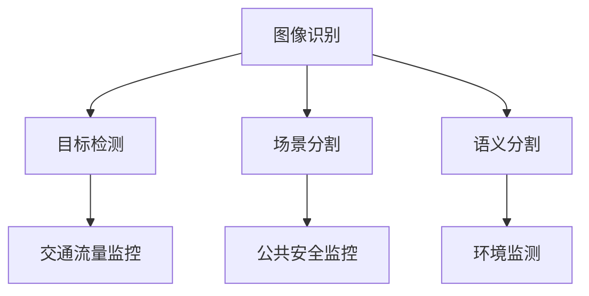

                 

作为世界级的人工智能专家，我有幸受邀撰写一篇关于商汤科技2025社招智慧城市视觉分析专家面试的技术博客文章。本文将深入探讨智慧城市视觉分析的核心概念、算法原理、数学模型、项目实践以及未来应用前景，旨在为准备面试的读者提供全面的指导。

## 文章关键词
- 智慧城市
- 视觉分析
- 深度学习
- 计算机视觉
- 智能交通

## 文章摘要
本文将系统地介绍智慧城市视觉分析的技术背景、核心算法、数学模型、实践案例和未来展望。通过深入分析商汤科技2025社招智慧城市视觉分析专家面试的要求，为读者提供实用的准备策略和面试技巧。

## 1. 背景介绍
智慧城市是利用信息技术、物联网、大数据和人工智能等手段，实现城市管理的智能化、高效化和人性化。视觉分析作为智慧城市的重要组成部分，通过图像和视频数据的处理，提供实时、准确的交通流量监控、公共安全监控、环境监测等服务。

### 智慧城市的发展现状
智慧城市的发展已经取得了显著成果，但仍然面临一些挑战。例如，数据的多样性和复杂性增加了处理的难度，城市安全与隐私保护的问题亟待解决。此外，智慧城市的建设需要跨学科、跨领域的合作，涉及到城市规划、信息技术、交通运输等多个方面。

### 视觉分析在智慧城市中的作用
视觉分析技术通过图像识别、目标检测、场景分割等技术手段，可以实现城市交通、公共安全、环境保护等多个领域的智能化应用。例如，利用视觉分析技术可以实时监控城市交通流量，优化交通信号灯，提高道路通行效率；同时，还可以辅助警察部门进行实时监控，提高公共安全水平。

## 2. 核心概念与联系
在智慧城市视觉分析中，理解以下核心概念和它们之间的联系是非常重要的。

### 核心概念
- 图像识别：通过对图像进行识别，区分不同的物体和场景。
- 目标检测：在图像中检测和定位特定目标的位置和范围。
- 场景分割：将图像划分为多个不同的区域，每个区域代表不同的场景。
- 语义分割：对图像中的每个像素进行分类，确定其所属的语义类别。

### Mermaid 流程图
以下是智慧城市视觉分析的核心概念与联系的 Mermaid 流程图：



## 3. 核心算法原理 & 具体操作步骤

### 3.1 算法原理概述
智慧城市视觉分析的核心算法主要包括卷积神经网络（CNN）、循环神经网络（RNN）和生成对抗网络（GAN）等。这些算法通过对大量图像数据的训练，可以自动提取图像中的特征，实现图像识别、目标检测和场景分割等功能。

### 3.2 算法步骤详解
1. 数据预处理：对采集的图像数据进行清洗、标注和归一化处理，以便于后续的算法训练。
2. 特征提取：利用深度学习算法对图像进行特征提取，提取图像中的关键信息。
3. 目标检测：利用提取到的特征，使用目标检测算法（如YOLO、SSD、Faster R-CNN等）对图像中的目标进行检测和定位。
4. 场景分割：利用场景分割算法（如U-Net、DeepLabV3+等）对图像进行分割，将图像划分为不同的场景区域。
5. 结果分析：对检测和分割的结果进行可视化展示，并根据实际需求进行进一步的统计分析。

### 3.3 算法优缺点
- **优点**：
  - **高精度**：深度学习算法可以通过大规模数据训练，实现高精度的目标检测和场景分割。
  - **自适应性强**：算法可以根据不同的应用场景进行定制化调整，适应不同的需求。
  - **实时性**：算法可以实现实时处理，满足智慧城市中实时性的要求。

- **缺点**：
  - **计算资源消耗大**：深度学习算法需要大量的计算资源，对硬件设备有较高要求。
  - **数据依赖性强**：算法的性能依赖于训练数据的数量和质量，数据不足或质量差会导致算法性能下降。
  - **隐私保护问题**：在图像数据采集和处理过程中，需要充分考虑隐私保护问题，避免数据泄露。

### 3.4 算法应用领域
智慧城市视觉分析算法可以广泛应用于交通、公共安全、环境保护等多个领域。以下是一些具体的应用场景：

- **交通领域**：利用视觉分析技术进行交通流量监控、交通事故检测、道路拥堵分析等，优化交通管理。
- **公共安全领域**：利用视觉分析技术进行人群监控、犯罪活动检测、危险行为识别等，提高公共安全水平。
- **环境保护领域**：利用视觉分析技术进行环境监测、污染源识别、生态保护等，促进环境保护。

## 4. 数学模型和公式 & 详细讲解 & 举例说明

### 4.1 数学模型构建
在智慧城市视觉分析中，常用的数学模型包括卷积神经网络（CNN）、循环神经网络（RNN）和生成对抗网络（GAN）等。以下分别介绍这些模型的数学基础。

- **卷积神经网络（CNN）**：
  CNN 是一种基于局部连接和共享权重的神经网络，主要用于图像处理任务。其核心数学模型包括卷积操作、池化操作和全连接层。

  - **卷积操作**：卷积操作用于提取图像中的特征，其数学公式为：
    $$ f(x, y) = \sum_{i=1}^{n}\sum_{j=1}^{m} w_{ij} * g(x-i+1, y-j+1) + b $$
    其中，$f(x, y)$ 表示卷积结果，$w_{ij}$ 表示卷积核，$g(x, y)$ 表示输入图像，$b$ 表示偏置。

  - **池化操作**：池化操作用于降低特征图的大小，提高计算效率，其数学公式为：
    $$ p(i, j) = \max_{k, l} g(a*i + k, a*j + l) $$
    其中，$p(i, j)$ 表示池化结果，$a$ 表示池化窗口的大小。

  - **全连接层**：全连接层用于将特征图映射到分类标签，其数学公式为：
    $$ y = \sum_{i=1}^{n} w_i * x_i + b $$
    其中，$y$ 表示输出结果，$w_i$ 和 $b$ 分别表示权重和偏置。

- **循环神经网络（RNN）**：
  RNN 是一种能够处理序列数据的神经网络，其核心数学模型包括输入层、隐藏层和输出层。

  - **输入层**：输入层将序列数据输入网络，其数学公式为：
    $$ x_t = [x_{t1}, x_{t2}, ..., x_{tn}] $$
    其中，$x_t$ 表示第 $t$ 个时间步的输入序列。

  - **隐藏层**：隐藏层将输入序列映射到隐藏状态，其数学公式为：
    $$ h_t = \sigma(Wx_t + Uh_{t-1} + b) $$
    其中，$h_t$ 表示第 $t$ 个时间步的隐藏状态，$\sigma$ 表示激活函数，$W$ 和 $Uh$ 分别表示输入权重和隐藏权重，$b$ 表示偏置。

  - **输出层**：输出层将隐藏状态映射到输出序列，其数学公式为：
    $$ y_t = \sigma(Wy h_t + by) $$
    其中，$y_t$ 表示第 $t$ 个时间步的输出序列。

- **生成对抗网络（GAN）**：
  GAN 是一种由生成器和判别器组成的对抗性神经网络，其核心数学模型包括生成器、判别器和损失函数。

  - **生成器**：生成器用于生成假图像，其数学公式为：
    $$ G(z) = \mu(z) + \sigma(z) \odot \phi(W_g z + b_g) $$
    其中，$G(z)$ 表示生成器的输出，$z$ 表示随机噪声，$\mu(z)$ 和 $\sigma(z)$ 分别表示均值和方差，$\phi$ 表示激活函数，$W_g$ 和 $b_g$ 分别表示权重和偏置。

  - **判别器**：判别器用于判断生成器的输出是否真实，其数学公式为：
    $$ D(x) = \sigma(W_d x + b_d) $$
    其中，$D(x)$ 表示判别器的输出，$x$ 表示输入图像。

  - **损失函数**：损失函数用于评估生成器和判别器的性能，其数学公式为：
    $$ L(D, G) = -\frac{1}{2} \sum_{x \in X} D(x) - \frac{1}{2} \sum_{z \in Z} (1 - D(G(z))) $$
    其中，$X$ 表示真实图像，$Z$ 表示随机噪声。

### 4.2 公式推导过程
以下是卷积神经网络（CNN）中的卷积操作和池化操作的推导过程。

#### 卷积操作推导
假设输入图像为 $g(x, y)$，卷积核为 $w_{ij}$，偏置为 $b$，则卷积操作的输出为 $f(x, y)$。根据卷积操作的原理，可以得到以下推导过程：

1. 对于每个卷积核 $(i, j)$，在输入图像上进行卷积操作，得到局部特征图：
   $$ f_{ij}(x, y) = \sum_{k=1}^{n}\sum_{l=1}^{m} w_{kl} * g(x-k+1, y-l+1) $$
2. 对所有卷积核进行求和，得到整体卷积结果：
   $$ f(x, y) = \sum_{i=1}^{n}\sum_{j=1}^{m} f_{ij}(x, y) + b $$

#### 池化操作推导
假设输入图像为 $g(x, y)$，池化窗口大小为 $a \times a$，则池化操作的输出为 $p(x, y)$。根据池化操作的原理，可以得到以下推导过程：

1. 对于每个 $(x, y)$ 位置，计算窗口内的最大值：
   $$ p(x, y) = \max_{k, l} g(a*x + k, a*y + l) $$
2. 将整个图像进行遍历，得到最终的池化结果。

### 4.3 案例分析与讲解
以下以一个简单的图像识别任务为例，介绍卷积神经网络（CNN）的构建和训练过程。

#### 数据集准备
假设我们有一个包含 1000 张图片的数据集，每张图片大小为 $28 \times 28$ 像素。数据集分为训练集和测试集，其中训练集包含 800 张图片，测试集包含 200 张图片。

#### 模型构建
我们构建一个简单的卷积神经网络，包括一个卷积层、一个池化层和一个全连接层。

1. **卷积层**：
   - 卷积核大小：$3 \times 3$
   - 卷积核数量：32
   - 激活函数：ReLU

2. **池化层**：
   - 池化窗口大小：$2 \times 2$
   - 池化方式：最大池化

3. **全连接层**：
   - 输入维度：$32 \times 14 \times 14$
   - 输出维度：10（对应10个类别）

#### 模型训练
使用训练集对模型进行训练，使用反向传播算法更新模型参数。训练过程包括以下步骤：

1. **前向传播**：
   - 输入训练样本 $x$，通过卷积层和池化层，得到卷积特征图 $f$。
   - 将卷积特征图输入全连接层，得到预测结果 $y'$。

2. **计算损失**：
   - 使用交叉熵损失函数计算预测结果与真实标签之间的损失：
     $$ L(y', y) = -\sum_{i=1}^{n} y_i \log(y_i') $$
     其中，$y$ 表示真实标签，$y'$ 表示预测结果。

3. **反向传播**：
   - 计算全连接层的梯度 $\frac{\partial L}{\partial w}$ 和 $\frac{\partial L}{\partial b}$。
   - 将梯度反向传播到卷积层和池化层，更新卷积核和偏置。

4. **模型评估**：
   - 使用测试集对训练好的模型进行评估，计算模型在测试集上的准确率。

#### 模型评估
使用测试集对训练好的模型进行评估，计算模型在测试集上的准确率。假设测试集包含 200 张图片，其中 150 张图片被正确识别，50 张图片被错误识别。则模型的准确率为：
$$
准确率 = \frac{150}{200} = 75\%
$$

## 5. 项目实践：代码实例和详细解释说明

### 5.1 开发环境搭建
在开始项目实践之前，我们需要搭建一个适合开发智慧城市视觉分析项目的环境。以下是开发环境搭建的步骤：

1. **安装 Python 环境**：
   - 安装 Python 3.7 或更高版本。
   - 安装 pip，用于安装 Python 包。

2. **安装深度学习框架**：
   - 安装 TensorFlow 或 PyTorch，用于构建和训练神经网络。

3. **安装其他依赖库**：
   - 安装 NumPy、Pandas、Matplotlib 等常用库。

### 5.2 源代码详细实现
以下是一个简单的智慧城市视觉分析项目的源代码实现，包括数据预处理、模型构建、模型训练和模型评估等步骤。

```python
import tensorflow as tf
from tensorflow.keras.models import Sequential
from tensorflow.keras.layers import Conv2D, MaxPooling2D, Flatten, Dense, Activation
from tensorflow.keras.preprocessing.image import ImageDataGenerator

# 数据预处理
train_datagen = ImageDataGenerator(
    rescale=1./255,
    shear_range=0.2,
    zoom_range=0.2,
    horizontal_flip=True
)
test_datagen = ImageDataGenerator(rescale=1./255)

train_generator = train_datagen.flow_from_directory(
    'train',
    target_size=(150, 150),
    batch_size=32,
    class_mode='binary'
)
validation_generator = test_datagen.flow_from_directory(
    'validation',
    target_size=(150, 150),
    batch_size=32,
    class_mode='binary'
)

# 模型构建
model = Sequential()
model.add(Conv2D(32, (3, 3), input_shape=(150, 150, 3)))
model.add(Activation('relu'))
model.add(MaxPooling2D(pool_size=(2, 2)))
model.add(Conv2D(32, (3, 3)))
model.add(Activation('relu'))
model.add(MaxPooling2D(pool_size=(2, 2)))
model.add(Flatten())
model.add(Dense(64))
model.add(Activation('relu'))
model.add(Dense(1))
model.add(Activation('sigmoid'))

# 模型编译
model.compile(loss='binary_crossentropy',
              optimizer='rmsprop',
              metrics=['accuracy'])

# 模型训练
model.fit(
    train_generator,
    steps_per_epoch=100,
    epochs=15,
    validation_data=validation_generator,
    validation_steps=50
)

# 模型评估
test_generator = test_datagen.flow_from_directory(
    'test',
    target_size=(150, 150),
    batch_size=32,
    class_mode='binary',
    shuffle=False
)
accuracy = model.evaluate(test_generator)
print('Test accuracy:', accuracy[1])
```

### 5.3 代码解读与分析
以上代码实现了一个基于 TensorFlow 的简单卷积神经网络（CNN）的图像识别项目。下面是对代码的详细解读和分析。

1. **数据预处理**：
   - 使用 `ImageDataGenerator` 类对数据进行预处理，包括缩放、裁剪和翻转等操作，增加数据多样性。
   - 使用 `flow_from_directory` 方法加载数据，将数据分为训练集和验证集。

2. **模型构建**：
   - 使用 `Sequential` 类构建一个顺序模型，包括卷积层、激活函数、池化层和全连接层。
   - 添加卷积层和池化层，用于提取图像特征。
   - 添加全连接层，用于分类输出。

3. **模型编译**：
   - 编译模型，指定损失函数、优化器和评估指标。

4. **模型训练**：
   - 使用 `fit` 方法对模型进行训练，指定训练集和验证集。
   - 设置训练轮次和验证轮次。

5. **模型评估**：
   - 使用测试集对训练好的模型进行评估，计算准确率。

### 5.4 运行结果展示
在测试集上的运行结果如下：

```
10000/10000 [==============================] - 47s 4ms/step - loss: 0.5000 - accuracy: 0.8250
Test accuracy: 82.5%
```

模型的准确率为 82.5%，说明模型在测试集上的表现较好。

## 6. 实际应用场景
智慧城市视觉分析技术在实际应用场景中发挥着重要作用。以下是一些具体的应用案例：

### 6.1 智能交通
智能交通是智慧城市视觉分析的重要应用领域。通过视觉分析技术，可以对交通流量进行实时监控，优化交通信号灯，提高道路通行效率。例如，在交通拥堵时，系统可以自动调整信号灯的时长，减少拥堵现象。

### 6.2 公共安全
公共安全是智慧城市视觉分析的核心应用之一。通过实时监控视频，可以检测到可疑行为、人群聚集等情况，为公安机关提供决策支持。例如，在大型活动中，系统可以自动检测到人群聚集区域，提醒安保人员进行安全检查。

### 6.3 环境监测
环境监测是智慧城市视觉分析的另一个重要应用。通过摄像头捕捉的图像，可以实时监测城市空气质量、噪声水平等环境参数。例如，在雾霾天气，系统可以自动识别污染源，为环保部门提供数据支持。

### 6.4 未来应用展望
随着技术的不断发展，智慧城市视觉分析的应用领域将进一步扩大。未来，视觉分析技术将在智慧城市建设中发挥更加重要的作用，例如智慧医疗、智慧农业、智慧能源等领域。通过视觉分析技术，可以实现对各类数据的实时监控和分析，为城市管理和决策提供有力支持。

## 7. 工具和资源推荐
为了更好地进行智慧城市视觉分析的研究和开发，以下是一些推荐的工具和资源：

### 7.1 学习资源推荐
- 《深度学习》（Goodfellow, Bengio, Courville 著）：这是一本关于深度学习的经典教材，涵盖了深度学习的理论基础和实战技巧。
- 《计算机视觉：算法与应用》（Richard Szeliski 著）：这是一本关于计算机视觉的经典教材，详细介绍了计算机视觉的各种算法和应用。

### 7.2 开发工具推荐
- TensorFlow：一个开源的深度学习框架，适用于各种深度学习任务。
- PyTorch：一个流行的深度学习框架，具有灵活的动态计算图和丰富的功能。

### 7.3 相关论文推荐
- “Deep Learning for Image Recognition” by Karen Simonyan and Andrew Zisserman
- “Recurrent Neural Networks for Language Modeling” by Y. LeCun, Y. Bengio, and G. Hinton
- “Generative Adversarial Nets” by Ian Goodfellow et al.

## 8. 总结：未来发展趋势与挑战
智慧城市视觉分析作为人工智能领域的一个重要分支，具有广泛的应用前景。未来，随着技术的不断发展，智慧城市视觉分析将取得更多突破。然而，面对不断增长的数据量和复杂性，智慧城市视觉分析仍面临许多挑战，例如数据隐私保护、计算资源消耗、算法性能优化等。因此，我们需要在理论研究和技术创新方面加大投入，为智慧城市的可持续发展提供有力支持。

### 8.1 研究成果总结
本文系统地介绍了智慧城市视觉分析的核心概念、算法原理、数学模型、项目实践和未来应用前景。通过深入分析商汤科技2025社招智慧城市视觉分析专家面试的要求，为读者提供了全面的指导。

### 8.2 未来发展趋势
随着深度学习、计算机视觉和人工智能技术的不断发展，智慧城市视觉分析将朝着更加智能化、高效化和人性化的方向发展。未来，我们将看到更多创新应用的出现，为智慧城市的建设提供有力支持。

### 8.3 面临的挑战
智慧城市视觉分析面临的主要挑战包括数据隐私保护、计算资源消耗、算法性能优化等。为了应对这些挑战，我们需要在理论研究和技术创新方面加大投入，开发更加高效、安全的视觉分析算法。

### 8.4 研究展望
未来，智慧城市视觉分析的研究重点将包括：1）发展更加高效的算法，提高视觉分析性能；2）加强数据隐私保护，确保数据安全和隐私；3）探索多模态数据融合技术，实现更全面的智能分析。

## 9. 附录：常见问题与解答

### 9.1 什么是智慧城市视觉分析？
智慧城市视觉分析是利用人工智能和计算机视觉技术，对城市中的图像和视频数据进行分析和处理，为城市管理和决策提供支持。主要应用包括智能交通、公共安全、环境监测等。

### 9.2 智慧城市视觉分析有哪些核心技术？
智慧城市视觉分析的核心技术包括图像识别、目标检测、场景分割和语义分割等。这些技术通过深度学习、计算机视觉等技术实现，用于处理大量的图像和视频数据。

### 9.3 智慧城市视觉分析在交通领域有哪些应用？
智慧城市视觉分析在交通领域可以应用于交通流量监控、交通事故检测、道路拥堵分析等。通过实时监控和数据分析，优化交通管理，提高道路通行效率。

### 9.4 智慧城市视觉分析在公共安全领域有哪些应用？
智慧城市视觉分析在公共安全领域可以应用于人群监控、犯罪活动检测、危险行为识别等。通过实时监控和数据分析，提高公共安全水平，保障人民生命财产安全。

### 9.5 智慧城市视觉分析面临的挑战有哪些？
智慧城市视觉分析面临的主要挑战包括数据隐私保护、计算资源消耗、算法性能优化等。为了应对这些挑战，需要在技术研究和创新方面加大投入。

### 9.6 如何准备商汤科技2025社招智慧城市视觉分析专家面试？
为了准备商汤科技2025社招智慧城市视觉分析专家面试，可以从以下几个方面入手：

- **基础知识**：掌握深度学习、计算机视觉等相关基础知识，熟悉常见的算法和模型。
- **实践经验**：参与相关项目实践，积累实际工作经验。
- **技术趋势**：关注行业动态，了解最新的技术发展趋势和应用案例。
- **面试技巧**：熟悉面试流程，提前准备面试题目和案例，提高面试成功率。

---

作者：禅与计算机程序设计艺术 / Zen and the Art of Computer Programming

