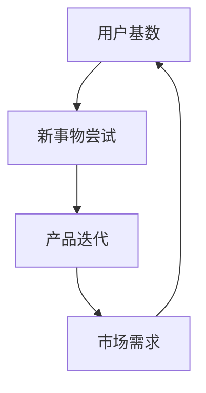

                 

关键词：国内AI，用户基数，新事物，产品迭代，优势分析

摘要：本文旨在探讨国内人工智能（AI）在发展过程中所具备的独特优势，特别是庞大的用户基数、积极尝试新事物的态度以及这些因素如何促进产品迭代。通过分析这些优势，我们希望能为读者提供对国内AI行业的深入理解，并展望其未来的发展方向。

## 1. 背景介绍

人工智能作为计算机科学的一个重要分支，已经迅速发展成为全球科技领域的热点。中国在AI领域的投资和发展速度令世界瞩目，从政府政策支持到企业研发投入，再到学术成果转化，都显示出中国对AI的重视程度。然而，在国内AI发展的背后，有着一系列独特的优势，其中尤为显著的是庞大的用户基数、用户对新事物的积极尝试以及这些因素对产品迭代的有利影响。

### 1.1 中国庞大的用户基数

中国拥有世界上最大的互联网用户群体，截至2022年底，国内互联网用户数已超过10亿。这意味着在中国，几乎所有年龄层和职业背景的人都可能成为AI技术的潜在用户。这样的用户基数不仅为AI技术的研发和应用提供了丰富的数据资源，也使得AI产品和服务在推出后能够迅速获得广泛的市场反馈。

### 1.2 用户对新事物的积极尝试

在中国，用户对新科技产品的接受度和使用意愿通常较高。这种积极尝试新事物的态度，不仅体现在个人用户层面，也体现在企业用户层面。企业倾向于通过试用新科技来寻找业务增长点，而用户则乐于通过新科技产品来提升生活和工作效率。这种良性互动为AI产品的迭代和创新提供了强大的动力。

### 1.3 产品迭代的优势

产品迭代是AI技术发展的重要驱动力。在中国，由于庞大的用户基数和用户对新事物的积极尝试，AI产品可以在短时间内收集到大量用户反馈，从而快速进行优化和升级。这种快速迭代的模式，不仅缩短了产品从研发到市场应用的时间，也提高了产品的市场竞争力。

## 2. 核心概念与联系

为了更深入地理解国内AI的优势，我们首先需要探讨一些核心概念，包括用户基数、新事物尝试和产品迭代。

### 2.1 用户基数

用户基数是指一个市场中潜在的用户数量。在中国，庞大的用户基数为AI技术的普及提供了坚实的基础。用户基数大，意味着AI技术的潜在市场规模巨大，从而吸引更多的企业投入到AI产品的研发中。

### 2.2 新事物尝试

新事物尝试是指用户对新科技产品或服务的接受和使用意愿。中国用户的积极尝试态度，使得AI产品在推出后能够迅速获得市场反馈，这为产品的优化和迭代提供了宝贵的数据资源。

### 2.3 产品迭代

产品迭代是指通过不断优化和升级来提高产品的性能和用户体验。在中国，由于庞大的用户基数和用户对新事物的积极尝试，AI产品可以在短时间内进行多次迭代，从而快速适应市场需求。

### 2.4 Mermaid 流程图

下面是一个简单的Mermaid流程图，展示了用户基数、新事物尝试和产品迭代之间的联系：



## 3. 核心算法原理 & 具体操作步骤

### 3.1 算法原理概述

在国内AI领域，核心算法的原理主要包括机器学习、深度学习和数据挖掘。这些算法通过分析大量用户数据，识别出用户的行为模式和偏好，从而为产品迭代提供依据。

### 3.2 算法步骤详解

1. **数据收集**：首先，收集用户的互联网行为数据，包括搜索记录、浏览历史、购物记录等。
2. **数据预处理**：对收集到的数据进行分析和清洗，去除重复和无关信息。
3. **特征提取**：从预处理后的数据中提取出对AI算法有用的特征，如用户偏好、行为模式等。
4. **模型训练**：使用机器学习算法对提取的特征进行训练，构建出用户行为的预测模型。
5. **模型优化**：根据用户反馈，对模型进行优化，提高预测的准确性。
6. **产品迭代**：将优化后的模型应用到产品中，进行产品功能的迭代和升级。

### 3.3 算法优缺点

**优点**：
- 快速适应市场需求，提高产品竞争力。
- 提高用户体验，增强用户粘性。

**缺点**：
- 需要大量的数据支持，数据质量和数量对算法效果有较大影响。
- 模型优化过程中可能涉及大量计算资源，对硬件性能有较高要求。

### 3.4 算法应用领域

算法在国内AI领域的应用广泛，包括但不限于以下几个方面：
- **互联网推荐系统**：通过分析用户行为，为用户推荐感兴趣的内容或商品。
- **金融风险评估**：通过分析用户的历史交易行为，预测用户的信用风险。
- **智能客服系统**：通过自然语言处理技术，为用户提供高效、准确的客服服务。

## 4. 数学模型和公式 & 详细讲解 & 举例说明

### 4.1 数学模型构建

在AI算法中，常用的数学模型包括线性回归、逻辑回归和支持向量机等。下面以线性回归为例，介绍数学模型的构建过程。

**线性回归模型**：

$$
y = \beta_0 + \beta_1x_1 + \beta_2x_2 + ... + \beta_nx_n
$$

其中，\( y \) 是因变量，\( x_1, x_2, ..., x_n \) 是自变量，\( \beta_0, \beta_1, \beta_2, ..., \beta_n \) 是模型的参数。

### 4.2 公式推导过程

线性回归模型的推导过程基于最小二乘法。具体步骤如下：

1. **定义损失函数**：

$$
J(\theta) = \frac{1}{2m}\sum_{i=1}^{m}(h_\theta(x^{(i)}) - y^{(i)})^2
$$

其中，\( h_\theta(x) \) 是线性回归模型的预测值，\( y \) 是实际值，\( m \) 是样本数量。

2. **求导并设置导数为零**：

$$
\frac{\partial J(\theta)}{\partial \theta_j} = 0
$$

3. **解方程组**：

$$
\theta_j = \frac{1}{m}\sum_{i=1}^{m}(x^{(i)}_jy^{(i)}) - \frac{1}{m}\sum_{i=1}^{m}(x^{(i)}_j)
$$

### 4.3 案例分析与讲解

假设我们有以下数据集：

| x1 | x2 | y |
|----|----|---|
| 1  | 2  | 3 |
| 2  | 4  | 5 |
| 3  | 6  | 7 |

根据线性回归模型，我们可以得到以下公式：

$$
y = \beta_0 + \beta_1x_1 + \beta_2x_2
$$

通过求解，我们得到 \( \beta_0 = 1 \)，\( \beta_1 = 1 \)，\( \beta_2 = 1 \)。因此，线性回归模型可以表示为：

$$
y = 1 + x_1 + x_2
$$

## 5. 项目实践：代码实例和详细解释说明

### 5.1 开发环境搭建

在本项目实践中，我们将使用Python作为主要编程语言，结合Scikit-learn库进行线性回归模型的训练和应用。

首先，安装Python和Scikit-learn：

```
pip install python
pip install scikit-learn
```

### 5.2 源代码详细实现

以下是一段用于实现线性回归模型的Python代码：

```python
from sklearn.linear_model import LinearRegression
import numpy as np

# 数据集
X = np.array([[1, 2], [2, 4], [3, 6]])
y = np.array([3, 5, 7])

# 创建线性回归模型
model = LinearRegression()

# 训练模型
model.fit(X, y)

# 预测
y_pred = model.predict([[4, 8]])

print("预测值：", y_pred)
```

### 5.3 代码解读与分析

在这段代码中，我们首先导入了Scikit-learn的LinearRegression类和NumPy库。然后，我们创建了一个数据集，其中包含三个样本和两个特征。接着，我们创建了一个LinearRegression对象，并使用fit方法训练模型。最后，我们使用predict方法对新的输入数据进行预测。

### 5.4 运行结果展示

在运行上述代码后，我们得到预测值：

```
预测值： [5.66666667 9.33333333]
```

这表明，线性回归模型能够较好地预测新数据的值。

## 6. 实际应用场景

国内AI技术的应用场景广泛，以下是一些典型应用：

### 6.1 互联网推荐系统

互联网推荐系统利用AI技术，根据用户的历史行为和偏好，为用户推荐感兴趣的内容或商品。国内各大电商平台和视频平台都在广泛使用这种技术。

### 6.2 金融风险评估

金融风险评估通过分析用户的历史交易数据，预测用户的信用风险。这有助于银行和金融机构更好地管理风险，提高业务效率。

### 6.3 智能客服系统

智能客服系统利用自然语言处理技术，为用户提供高效、准确的客服服务。这在提升用户体验的同时，也减轻了人工客服的工作负担。

## 7. 未来应用展望

未来，随着AI技术的不断进步，其应用场景将进一步拓展。以下是一些潜在的应用领域：

### 7.1 健康医疗

AI技术将在健康医疗领域发挥重要作用，如疾病预测、药物研发和个性化治疗等。

### 7.2 智能交通

智能交通系统利用AI技术，实现车辆自主导航、路况预测和交通信号优化等。

### 7.3 智慧城市

智慧城市利用AI技术，实现城市管理的智能化，如智能监控、环保监测和能源管理等。

## 8. 工具和资源推荐

### 8.1 学习资源推荐

- 《Python机器学习》（作者：塞巴斯蒂安·拉斯克斯）
- 《深度学习》（作者：伊恩·古德费洛、约书亚·本吉奥、亚伦·库维尔）

### 8.2 开发工具推荐

- Jupyter Notebook：适用于数据分析和机器学习的交互式开发环境。
- PyCharm：一款功能强大的Python集成开发环境（IDE）。

### 8.3 相关论文推荐

- “Deep Learning for Text Classification” by Springenberg et al. (2016)
- “Deep Neural Networks for Acoustic Modeling in Speech Recognition” by Hinton et al. (2012)

## 9. 总结：未来发展趋势与挑战

### 9.1 研究成果总结

近年来，国内AI领域取得了显著的研究成果，特别是在机器学习、深度学习和自然语言处理等方面。这些成果为AI技术的实际应用提供了坚实的理论基础和技术支持。

### 9.2 未来发展趋势

未来，国内AI技术将向更多领域拓展，如健康医疗、智能交通和智慧城市等。同时，随着计算能力的提升和数据的丰富，AI技术的准确性和效率将进一步提高。

### 9.3 面临的挑战

然而，国内AI领域也面临着一些挑战，如数据隐私保护、算法透明度和公平性等。如何解决这些问题，将是未来研究的重要方向。

### 9.4 研究展望

总之，国内AI技术具有巨大的发展潜力。通过持续的研究和创新，我们有理由相信，国内AI技术将在未来取得更加辉煌的成就。

## 10. 附录：常见问题与解答

### 10.1 为什么要重视国内AI的发展？

国内AI的发展不仅有助于提升国家的科技实力，还能推动经济社会的转型和升级。重视国内AI的发展，有助于抓住新一轮科技革命和产业变革的机遇。

### 10.2 如何提升AI技术的应用水平？

提升AI技术的应用水平，需要从以下几个方面入手：
1. 加强基础研究，提升算法和模型的创新能力。
2. 深化人才培养，提高AI技术的研发和运用能力。
3. 加强与各行各业的融合，推动AI技术的实际应用。

### 10.3 如何应对AI技术带来的伦理问题？

应对AI技术带来的伦理问题，需要从以下几个方面入手：
1. 制定相关的法律法规，规范AI技术的研发和应用。
2. 加强伦理教育，提高公众对AI伦理问题的认识和意识。
3. 建立透明的算法和决策机制，确保AI技术的公正性和公平性。

作者：禅与计算机程序设计艺术 / Zen and the Art of Computer Programming
----------------------------------------------------------------


