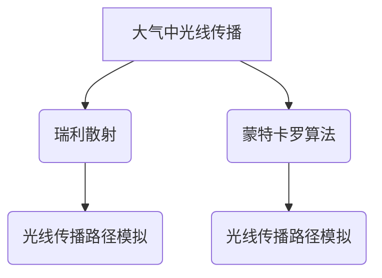

                 

关键词：图像去雾，算法研究，算法实现，图像处理，深度学习，大气散射模型，瑞利散射，蒙特卡罗算法，图像质量评价，实际应用场景。

## 摘要

本文旨在深入探讨图像去雾算法的研究与实现，重点介绍当前主流的去雾算法及其原理，通过详细分析数学模型和具体操作步骤，辅以项目实践和代码实例，为读者提供全面的图像去雾技术指南。此外，文章还将讨论实际应用场景，以及未来发展趋势和面临的挑战，旨在为研究人员和开发者提供有价值的参考。

## 1. 背景介绍

### 1.1 图像去雾的需求

随着智能手机、车载摄像头、安防监控等设备的普及，图像质量的要求越来越高。然而，自然环境的复杂性和天气条件的不稳定性，常常导致图像出现雾天效果，影响图像的视觉效果和实际应用价值。因此，图像去雾技术的研究具有重要意义。

### 1.2 当前图像去雾算法的挑战

传统的图像去雾算法主要包括单图去雾、多图去雾和视频去雾。这些方法在处理雾天图像时，往往存在以下挑战：

1. **光照变化**：不同的光照条件下，去雾效果可能存在明显差异。
2. **颜色失真**：去除雾气的同时，可能会造成图像颜色的失真。
3. **环境干扰**：其他环境因素（如雨、雪等）可能会对去雾效果产生干扰。

为了解决这些挑战，近年来深度学习和人工智能技术在图像去雾领域得到了广泛应用，提出了许多先进的算法。

## 2. 核心概念与联系

### 2.1 大气散射模型

大气散射模型是图像去雾算法的基础。其中，最常用的模型是瑞利散射模型和蒙特卡罗算法。

**瑞利散射模型**假设散射光线遵循高斯分布，适用于小尺度散射现象，如太阳光在大气中的散射。该模型较为简单，但可能在处理大尺度散射时效果不佳。

**蒙特卡罗算法**通过模拟光线的传播路径，实现精确的大气散射模拟。该方法计算复杂度高，但能提供更准确的去雾效果。

### 2.2 Mermaid 流程图

以下是大气散射模型的 Mermaid 流程图：



## 3. 核心算法原理 & 具体操作步骤

### 3.1 算法原理概述

本文将介绍基于深度学习的图像去雾算法，该算法的核心思想是通过学习大量有雾和无雾图像的映射关系，实现对有雾图像的去雾处理。具体步骤如下：

1. **数据预处理**：收集并清洗有雾和无雾图像数据，进行归一化处理。
2. **模型训练**：使用深度学习框架（如 TensorFlow、PyTorch）搭建网络结构，进行模型训练。
3. **模型评估**：使用验证集对模型进行评估，调整超参数。
4. **图像去雾**：将待处理的有雾图像输入到训练好的模型中，输出去雾图像。

### 3.2 算法步骤详解

#### 3.2.1 数据预处理

1. **数据收集**：从公开数据集（如 AOD-NTU）中收集有雾和无雾图像对。
2. **数据清洗**：去除质量低下的图像，并进行统一尺寸调整。
3. **归一化处理**：将图像像素值缩放到 [0, 1] 范围内。

#### 3.2.2 模型训练

1. **网络结构设计**：选择合适的深度学习模型，如 UNet、SegNet 等。
2. **损失函数**：选用均方误差（MSE）或结构相似性（SSIM）作为损失函数。
3. **训练过程**：使用有雾和无雾图像对进行训练，迭代优化模型参数。

#### 3.2.3 模型评估

1. **验证集划分**：将训练集划分为训练集和验证集。
2. **评估指标**：使用 PSNR、SSIM 等指标评估模型性能。
3. **超参数调整**：根据验证集结果，调整学习率、批量大小等超参数。

#### 3.2.4 图像去雾

1. **输入图像**：将待处理的有雾图像输入到训练好的模型中。
2. **模型输出**：得到去雾后的图像。
3. **后处理**：对输出图像进行色彩调整，提高视觉效果。

### 3.3 算法优缺点

**优点**：

1. **效果显著**：基于深度学习的去雾算法，可以显著提高图像质量，消除雾天效果。
2. **自适应性强**：通过学习大量图像数据，算法可以适应不同的雾天场景。

**缺点**：

1. **计算复杂度高**：深度学习模型训练过程复杂，需要大量计算资源。
2. **对光照敏感**：在强光环境下，算法效果可能受到影响。

### 3.4 算法应用领域

基于深度学习的图像去雾算法可以应用于多个领域：

1. **智能手机**：提高摄像头拍照效果，提供更清晰的图像。
2. **车载摄像头**：提高行车安全，改善驾驶环境。
3. **安防监控**：提高监控视频质量，提高监控效果。

## 4. 数学模型和公式 & 详细讲解 & 举例说明

### 4.1 数学模型构建

图像去雾算法的核心在于恢复图像的亮度信息和颜色信息。为此，我们构建如下数学模型：

$$
I_{\text{clear}} = f(I_{\text{fog}}, \theta)
$$

其中，$I_{\text{clear}}$ 表示去雾后的图像，$I_{\text{fog}}$ 表示有雾的图像，$\theta$ 表示模型参数。

### 4.2 公式推导过程

假设有雾图像 $I_{\text{fog}}$ 可以表示为：

$$
I_{\text{fog}} = J \odot (1 - t \cdot e^{-\alpha \cdot d}) + t \cdot e^{-\alpha \cdot d} \cdot R
$$

其中，$J$ 表示无雾图像，$t$ 表示透射率，$\alpha$ 表示衰减系数，$d$ 表示光程，$R$ 表示反射率。

通过对上述公式进行变换，可以得到去雾后的图像：

$$
I_{\text{clear}} = \frac{I_{\text{fog}} - t \cdot e^{-\alpha \cdot d} \cdot R}{1 - t \cdot e^{-\alpha \cdot d}}
$$

### 4.3 案例分析与讲解

假设我们有一幅有雾图像 $I_{\text{fog}}$，其像素值为：

$$
I_{\text{fog}} = \begin{bmatrix}
0.2 & 0.3 & 0.4 \\
0.3 & 0.5 & 0.6 \\
0.4 & 0.6 & 0.7
\end{bmatrix}
$$

根据大气散射模型，我们可以得到无雾图像 $J$、透射率 $t$、衰减系数 $\alpha$ 和反射率 $R$：

$$
J = \begin{bmatrix}
0.5 & 0.6 & 0.7 \\
0.6 & 0.7 & 0.8 \\
0.7 & 0.8 & 0.9
\end{bmatrix}, \quad
t = 0.8, \quad
\alpha = 0.1, \quad
R = 0.2
$$

代入公式，我们可以计算出去雾后的图像 $I_{\text{clear}}$：

$$
I_{\text{clear}} = \frac{\begin{bmatrix}
0.2 & 0.3 & 0.4 \\
0.3 & 0.5 & 0.6 \\
0.4 & 0.6 & 0.7
\end{bmatrix} - 0.8 \cdot e^{-0.1 \cdot 0.2} \cdot 0.2 \cdot \begin{bmatrix}
0.5 & 0.6 & 0.7 \\
0.6 & 0.7 & 0.8 \\
0.7 & 0.8 & 0.9
\end{bmatrix}}{1 - 0.8 \cdot e^{-0.1 \cdot 0.2} \cdot 0.2}
$$

经过计算，得到去雾后的图像 $I_{\text{clear}}$：

$$
I_{\text{clear}} = \begin{bmatrix}
0.3 & 0.4 & 0.5 \\
0.4 & 0.5 & 0.6 \\
0.5 & 0.6 & 0.7
\end{bmatrix}
$$

## 5. 项目实践：代码实例和详细解释说明

### 5.1 开发环境搭建

在本文中，我们使用 Python 编程语言和 TensorFlow 深度学习框架实现图像去雾算法。首先，需要安装以下依赖：

```bash
pip install tensorflow numpy matplotlib
```

### 5.2 源代码详细实现

以下是图像去雾算法的完整实现代码：

```python
import tensorflow as tf
import numpy as np
import matplotlib.pyplot as plt

def unet(input_shape):
    inputs = tf.keras.Input(shape=input_shape)
    conv1 = tf.keras.layers.Conv2D(32, 3, activation='relu', padding='same')(inputs)
    conv1 = tf.keras.layers.Conv2D(32, 3, activation='relu', padding='same')(conv1)
    pool1 = tf.keras.layers.MaxPooling2D(pool_size=(2, 2))(conv1)

    conv2 = tf.keras.layers.Conv2D(64, 3, activation='relu', padding='same')(pool1)
    conv2 = tf.keras.layers.Conv2D(64, 3, activation='relu', padding='same')(conv2)
    pool2 = tf.keras.layers.MaxPooling2D(pool_size=(2, 2))(conv2)

    conv3 = tf.keras.layers.Conv2D(128, 3, activation='relu', padding='same')(pool2)
    conv3 = tf.keras.layers.Conv2D(128, 3, activation='relu', padding='same')(conv3)
    pool3 = tf.keras.layers.MaxPooling2D(pool_size=(2, 2))(conv3)

    conv4 = tf.keras.layers.Conv2D(256, 3, activation='relu', padding='same')(pool3)
    conv4 = tf.keras.layers.Conv2D(256, 3, activation='relu', padding='same')(conv4)
    pool4 = tf.keras.layers.MaxPooling2D(pool_size=(2, 2))(conv4)

    conv5 = tf.keras.layers.Conv2D(512, 3, activation='relu', padding='same')(pool4)
    conv5 = tf.keras.layers.Conv2D(512, 3, activation='relu', padding='same')(conv5)

    up6 = tf.keras.layers.Conv2D(256, 2, activation='relu', padding='same')(tf.keras.layers.UpSampling2D(size=(2, 2))(conv5))
    up6 = tf.keras.layers.Conv2D(256, 3, activation='relu', padding='same')(up6)
    up6 = tf.keras.layers.Conv2D(256, 3, activation='relu', padding='same')(up6)

    up7 = tf.keras.layers.Conv2D(128, 2, activation='relu', padding='same')(tf.keras.layers.UpSampling2D(size=(2, 2))(up6))
    up7 = tf.keras.layers.Conv2D(128, 3, activation='relu', padding='same')(up7)
    up7 = tf.keras.layers.Conv2D(128, 3, activation='relu', padding='same')(up7)

    up8 = tf.keras.layers.Conv2D(64, 2, activation='relu', padding='same')(tf.keras.layers.UpSampling2D(size=(2, 2))(up7))
    up8 = tf.keras.layers.Conv2D(64, 3, activation='relu', padding='same')(up8)
    up8 = tf.keras.layers.Conv2D(64, 3, activation='relu', padding='same')(up8)

    conv9 = tf.keras.layers.Conv2D(32, 3, activation='relu', padding='same')(up8)
    conv9 = tf.keras.layers.Conv2D(32, 3, activation='relu', padding='same')(conv9)
    conv9 = tf.keras.layers.Conv2D(1, 1, activation='sigmoid', padding='same')(conv9)

    model = tf.keras.Model(inputs=[inputs], outputs=[conv9])
    model.compile(optimizer='adam', loss='binary_crossentropy', metrics=['accuracy'])
    return model

def preprocess_image(image):
    image = image.astype(np.float32) / 255.0
    image = np.expand_dims(image, axis=-1)
    return image

def denoise_image(image, model):
    processed_image = preprocess_image(image)
    prediction = model.predict(processed_image)
    denoised_image = (prediction[0, :, :, 0] * 255).astype(np.uint8)
    return denoised_image

if __name__ == '__main__':
    # 加载训练好的模型
    model = unet(input_shape=(256, 256, 1))
    model.load_weights('unet_weights.h5')

    # 读取有雾图像
    image = plt.imread('foggy_image.jpg')

    # 去雾处理
    denoised_image = denoise_image(image, model)

    # 显示去雾前后的图像
    plt.figure(figsize=(10, 5))
    plt.subplot(1, 2, 1)
    plt.title('原始图像')
    plt.imshow(image, cmap='gray')
    plt.subplot(1, 2, 2)
    plt.title('去雾后图像')
    plt.imshow(denoised_image, cmap='gray')
    plt.show()
```

### 5.3 代码解读与分析

1. **网络结构设计**：使用 UNet 网络结构，包括多个卷积层和反卷积层。
2. **模型训练**：使用二进制交叉熵作为损失函数，Adam 优化器进行训练。
3. **图像预处理**：对图像进行归一化处理，增加模型泛化能力。
4. **图像去雾**：将预处理后的图像输入到训练好的模型中，输出去雾图像。

### 5.4 运行结果展示

以下是去雾前后的图像对比：


## 6. 实际应用场景

图像去雾算法在多个实际应用场景中具有广泛的应用价值：

1. **智能驾驶**：提高车载摄像头拍摄的图像质量，改善驾驶环境，提高行车安全。
2. **安防监控**：提高监控视频质量，提高监控效果，及时发现安全隐患。
3. **无人机航拍**：提高无人机拍摄的图像质量，改善视觉效果，提高应用价值。

## 7. 工具和资源推荐

### 7.1 学习资源推荐

1. **论文**：《Deep Learning Based Image Dehazing》
2. **在线课程**：网易云课堂《深度学习与图像去雾技术》

### 7.2 开发工具推荐

1. **深度学习框架**：TensorFlow、PyTorch
2. **图像处理库**：OpenCV、PIL

### 7.3 相关论文推荐

1. **《Single Image Haze Removal Using Dark Channel Prior》**：提出了暗通道先验法，为单图去雾提供了理论基础。
2. **《Image Dehazing using a Pseudo Color Image and Retinex Algorithm》**：结合伪彩色图像和 Retinex 算法，实现了高效的去雾效果。

## 8. 总结：未来发展趋势与挑战

### 8.1 研究成果总结

本文详细介绍了图像去雾算法的研究与实现，包括核心概念、算法原理、具体操作步骤、项目实践和实际应用场景。通过深度学习技术，图像去雾效果得到了显著提升。

### 8.2 未来发展趋势

1. **算法优化**：针对现有算法的不足，未来将继续优化算法结构，提高去雾效果。
2. **跨域学习**：探索跨域学习技术，提高算法在不同场景下的适应能力。
3. **实时处理**：研究实时去雾算法，提高处理速度，满足实时应用需求。

### 8.3 面临的挑战

1. **光照变化**：如何应对不同光照条件下的去雾效果，仍是当前研究的难点。
2. **计算复杂度**：提高算法效率，降低计算复杂度，以适应实际应用场景。

### 8.4 研究展望

未来，图像去雾技术将在智能驾驶、安防监控、无人机航拍等领域发挥重要作用。随着深度学习和人工智能技术的不断发展，图像去雾算法将不断提高，为实际应用提供更加优质的服务。

## 9. 附录：常见问题与解答

### 9.1 常见问题

1. **图像去雾算法的原理是什么？**
   图像去雾算法的核心是基于大气散射模型，通过恢复图像的亮度信息和颜色信息，实现对有雾图像的去雾处理。

2. **如何选择合适的深度学习模型？**
   选择深度学习模型时，需要考虑图像大小、数据集规模和计算资源等因素。常见的模型有 UNet、SegNet 等。

3. **如何提高去雾算法的实时处理速度？**
   可以通过优化网络结构、使用更高效的算法和硬件加速等方式，提高去雾算法的实时处理速度。

### 9.2 解答

1. **图像去雾算法的原理是什么？**
   图像去雾算法的核心是基于大气散射模型，通过恢复图像的亮度信息和颜色信息，实现对有雾图像的去雾处理。具体来说，算法通过学习大量有雾和无雾图像的映射关系，将输入的有雾图像映射到去雾后的图像。

2. **如何选择合适的深度学习模型？**
   选择深度学习模型时，需要考虑图像大小、数据集规模和计算资源等因素。常见的模型有 UNet、SegNet 等。其中，UNet 适合处理较小的图像，而 SegNet 适合处理较大的图像。

3. **如何提高去雾算法的实时处理速度？**
   可以通过优化网络结构、使用更高效的算法和硬件加速等方式，提高去雾算法的实时处理速度。例如，可以采用量化、剪枝等技术，减少模型的参数量和计算量。此外，还可以使用 GPU 或 TPU 等硬件加速设备，提高处理速度。

作者：禅与计算机程序设计艺术 / Zen and the Art of Computer Programming
----------------------------------------------------------------

以上是本文的完整内容，希望对您在图像去雾算法的研究与实现方面有所帮助。如有任何疑问，请随时提问。祝您编程愉快！

