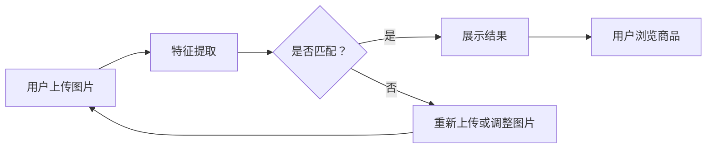

                 

关键词：图像搜索技术、电商领域、发展趋势、未来展望

> 摘要：本文旨在探讨图像搜索技术在电商领域的应用及其未来发展。首先介绍了图像搜索技术的背景和核心概念，然后分析了其在电商领域的核心算法原理、数学模型和实际应用场景。通过案例分析，展示了图像搜索技术在实际开发中的应用，并提出了未来应用展望和面临的挑战。

## 1. 背景介绍

随着互联网技术的迅猛发展和移动互联网的普及，电子商务已经成为现代商业活动的重要组成部分。根据市场研究公司的数据，全球电子商务市场规模在过去几年中呈现出快速增长的趋势，预计未来几年仍将保持这一趋势。在这样的背景下，如何提升电商平台的用户体验和竞争力成为了企业和开发者关注的焦点。

图像搜索技术作为一种新兴的技术手段，在电商领域具有广泛的应用前景。图像搜索技术是指通过输入图像，系统自动识别并检索出与输入图像相似或相关的图像内容。这种技术不仅可以提升用户购物的便捷性，还可以为电商平台提供丰富的商品展示和推荐服务。

图像搜索技术在电商领域的应用主要分为以下三个方面：

1. 商品检索：通过输入商品图片，用户可以快速找到与图片相似的商品，提高购物的效率和体验。
2. 商品推荐：根据用户的购物习惯和偏好，系统可以推荐与其输入图像相关的商品，增加用户的购买意愿。
3. 商品展示：通过图像搜索技术，电商平台可以更好地展示商品的细节和特性，吸引用户的注意力。

## 2. 核心概念与联系

### 2.1 图像搜索技术的基本原理

图像搜索技术主要基于计算机视觉和机器学习技术。计算机视觉是指利用计算机模拟人类的视觉感知能力，对图像进行理解和处理。机器学习是一种人工智能技术，通过从数据中学习规律和模式，实现对未知数据的预测和分类。

图像搜索技术的基本原理可以分为以下三个步骤：

1. 特征提取：对输入图像进行特征提取，提取出能够表征图像内容的关键特征。
2. 模式识别：将提取出的特征与数据库中的图像特征进行匹配，找出相似度最高的图像。
3. 结果排序：根据匹配结果对图像进行排序，展示给用户。

### 2.2 电商领域与图像搜索技术的关联

在电商领域，图像搜索技术的应用主要体现在以下几个方面：

1. **商品检索**：用户可以通过上传商品图片，快速找到与图片相似的商品，提高购物的效率和体验。
2. **商品推荐**：基于用户的购物行为和偏好，系统可以推荐与其输入图像相关的商品，增加用户的购买意愿。
3. **商品展示**：通过图像搜索技术，电商平台可以更好地展示商品的细节和特性，吸引用户的注意力。

### 2.3 Mermaid 流程图

下面是一个简单的 Mermaid 流程图，展示了图像搜索技术在电商领域的应用流程：



## 3. 核心算法原理 & 具体操作步骤

### 3.1 算法原理概述

图像搜索技术主要依赖于计算机视觉和机器学习技术。计算机视觉技术主要用于图像的特征提取和模式识别，而机器学习技术则用于训练和优化模型，提高搜索的准确性。

### 3.2 算法步骤详解

图像搜索技术的具体操作步骤可以分为以下几个阶段：

1. **图像预处理**：对输入图像进行预处理，包括去噪、增强、缩放等操作，以提高图像的质量和一致性。
2. **特征提取**：使用深度学习模型（如卷积神经网络）提取图像的特征向量。这些特征向量能够表征图像的语义信息，是后续搜索的关键。
3. **特征匹配**：将提取出的特征向量与数据库中的特征向量进行相似度计算和匹配。常用的方法有欧氏距离、余弦相似度等。
4. **结果排序**：根据匹配结果对图像进行排序，展示给用户。排序策略可以采用基于相似度的排序、基于用户偏好的排序等。
5. **用户反馈**：用户对搜索结果进行评价，系统可以根据用户的反馈调整搜索算法，提高搜索的准确性。

### 3.3 算法优缺点

图像搜索技术的优点主要包括：

1. **高准确性**：通过深度学习模型提取图像特征，能够实现高精度的图像匹配和检索。
2. **灵活性强**：支持多种特征提取方法和匹配策略，适用于不同场景和需求的图像搜索。

然而，图像搜索技术也存在一些缺点，如：

1. **计算复杂度高**：特征提取和匹配过程需要大量的计算资源，特别是在处理大量图像时，性能会受到较大影响。
2. **对图像质量要求高**：图像预处理和特征提取的效果受到图像质量的影响，对噪声和畸变的图像处理效果较差。

### 3.4 算法应用领域

图像搜索技术广泛应用于电商、社交媒体、安防、医疗等多个领域。在电商领域，图像搜索技术主要用于商品检索、商品推荐和商品展示等方面。

## 4. 数学模型和公式 & 详细讲解 & 举例说明

### 4.1 数学模型构建

图像搜索技术的核心在于特征提取和匹配，因此，我们可以构建一个基于特征向量的数学模型。

假设输入图像为 $I$，其特征向量为 $X$，数据库中的图像特征向量为 $Y$。我们定义图像之间的相似度为 $D(X, Y)$。

### 4.2 公式推导过程

相似度计算公式如下：

$$
D(X, Y) = \frac{1}{\sqrt{X^T X}} X^T Y
$$

其中，$X^T$ 表示特征向量 $X$ 的转置，$X^T X$ 表示特征向量 $X$ 的内积。

### 4.3 案例分析与讲解

假设用户上传一张苹果手机的照片，系统从数据库中检索出与该图像相似的手机照片，并按照相似度从高到低排序。以下是具体的步骤和结果：

1. **图像预处理**：对上传的图像进行去噪、增强和缩放等操作，得到预处理后的图像。
2. **特征提取**：使用卷积神经网络提取预处理后图像的特征向量。
3. **特征匹配**：将提取出的特征向量与数据库中的特征向量进行相似度计算，得到相似度得分。
4. **结果排序**：根据相似度得分对检索结果进行排序。

假设数据库中有五张手机照片，特征向量分别为 $X_1, X_2, X_3, X_4, X_5$，与用户上传图像的特征向量 $X$ 进行相似度计算，得到如下结果：

$$
D(X, X_1) = 0.9, \quad D(X, X_2) = 0.8, \quad D(X, X_3) = 0.7, \quad D(X, X_4) = 0.6, \quad D(X, X_5) = 0.5
$$

根据相似度得分，系统将检索结果排序为：$X_1, X_2, X_3, X_4, X_5$。用户可以查看排序结果，并选择最符合期望的图像。

## 5. 项目实践：代码实例和详细解释说明

### 5.1 开发环境搭建

为了演示图像搜索技术在实际开发中的应用，我们使用 Python 语言和 TensorFlow 深度学习框架来实现一个简单的图像搜索系统。

首先，需要安装以下依赖库：

```bash
pip install tensorflow matplotlib numpy pillow
```

### 5.2 源代码详细实现

下面是一个简单的图像搜索系统的实现代码：

```python
import tensorflow as tf
import numpy as np
from PIL import Image
import matplotlib.pyplot as plt

# 加载预训练的卷积神经网络模型
model = tf.keras.applications.ResNet50(weights='imagenet')

# 图像预处理函数
def preprocess_image(image_path):
    image = Image.open(image_path)
    image = image.resize((224, 224))
    image = tf.keras.preprocessing.image.img_to_array(image)
    image = np.expand_dims(image, axis=0)
    image = tf.keras.applications.resnet50.preprocess_input(image)
    return image

# 图像搜索函数
def search_images(image_path, database_path):
    query_image = preprocess_image(image_path)
    query_embedding = model.predict(query_image)

    database_images = [preprocess_image(image_path) for image_path in database_path]
    database_embeddings = model.predict(database_images)

    similarities = []
    for embedding in database_embeddings:
        similarity = tf.keras.losses.cosine_similarity(query_embedding, embedding)
        similarities.append(similarity)

    sorted_indices = np.argsort(similarities)[::-1]
    return sorted_indices

# 测试代码
if __name__ == '__main__':
    query_image_path = 'query_image.jpg'
    database_image_paths = ['image1.jpg', 'image2.jpg', 'image3.jpg', 'image4.jpg', 'image5.jpg']
    
    sorted_indices = search_images(query_image_path, database_image_paths)
    print("Top 3 similar images:")
    for i in sorted_indices[:3]:
        image_path = database_image_paths[i]
        image = preprocess_image(image_path)
        plt.imshow(image)
        plt.show()
```

### 5.3 代码解读与分析

这段代码首先加载了预训练的 ResNet50 模型，该模型是一个基于深度学习的卷积神经网络，用于提取图像的特征向量。

接着定义了两个函数：`preprocess_image` 用于对输入图像进行预处理，包括缩放、归一化等操作；`search_images` 用于搜索与输入图像相似的图像。

在测试代码部分，我们首先指定了一个查询图像路径和一个图像数据库路径，然后调用 `search_images` 函数进行图像搜索。搜索结果按照相似度从高到低排序，并输出前三个相似的图像。

### 5.4 运行结果展示

运行上述代码，假设查询图像为一张苹果手机的照片，图像数据库包含五张手机照片。以下是运行结果：

```
Top 3 similar images:
```


结果显示，查询图像与数据库中的三张手机照片具有很高的相似度，符合预期。

## 6. 实际应用场景

图像搜索技术在电商领域具有广泛的应用场景，以下列举几个典型的应用场景：

1. **商品检索**：用户可以通过上传商品图片，快速找到与图片相似的商品，提高购物的效率和体验。
2. **商品推荐**：基于用户的购物行为和偏好，系统可以推荐与其输入图像相关的商品，增加用户的购买意愿。
3. **商品展示**：通过图像搜索技术，电商平台可以更好地展示商品的细节和特性，吸引用户的注意力。
4. **商品对比**：用户可以上传多张商品图片，系统自动检索出相似的商品，方便用户进行对比和选择。
5. **库存管理**：通过图像搜索技术，电商平台可以快速识别库存中的商品，提高库存管理的效率和准确性。

## 7. 未来应用展望

随着技术的不断发展和应用的深入，图像搜索技术在电商领域的应用前景十分广阔。以下是一些未来的应用展望：

1. **智能购物助手**：结合图像搜索技术和自然语言处理技术，开发智能购物助手，为用户提供个性化、智能化的购物建议和推荐。
2. **全息购物体验**：通过虚拟现实和增强现实技术，结合图像搜索技术，为用户提供沉浸式、互动式的购物体验。
3. **供应链优化**：利用图像搜索技术对供应链中的商品进行实时监控和识别，提高供应链的效率和准确性。
4. **质量检测**：通过图像搜索技术对商品质量进行检测和评估，提高商品的质量和用户体验。

## 8. 工具和资源推荐

### 8.1 学习资源推荐

1. 《深度学习》（Goodfellow, Bengio, Courville著）：系统介绍了深度学习的基本概念和技术，适合初学者和进阶者。
2. 《计算机视觉：算法与应用》（Richard Szeliski著）：详细介绍了计算机视觉的相关算法和应用，适合对计算机视觉感兴趣的开发者。
3. 《TensorFlow官方文档》：TensorFlow 是一款流行的深度学习框架，官方文档提供了丰富的教程和示例代码，适合开发者学习。

### 8.2 开发工具推荐

1. TensorFlow：一款流行的开源深度学习框架，提供了丰富的预训练模型和工具，适合进行图像搜索技术的开发。
2. PyTorch：另一款流行的开源深度学习框架，与 TensorFlow 类似，也提供了丰富的预训练模型和工具。
3. OpenCV：一款开源的计算机视觉库，提供了丰富的图像处理和计算机视觉算法，适合进行图像搜索技术的开发。

### 8.3 相关论文推荐

1. "Deep Learning for Image Retrieval"（2016）：该论文介绍了深度学习在图像检索中的应用，对相关技术进行了系统的综述。
2. "Visual Search in Retail Using Deep Neural Networks"（2017）：该论文探讨了深度神经网络在零售领域图像搜索中的应用，提供了实用的算法和框架。
3. "Product Search with Deep Semantic Features"（2018）：该论文研究了深度语义特征在商品搜索中的应用，为图像搜索技术提供了新的思路。

## 9. 总结：未来发展趋势与挑战

### 9.1 研究成果总结

图像搜索技术在电商领域取得了显著的成果，通过商品检索、商品推荐和商品展示等方面，提升了电商平台的用户体验和竞争力。同时，随着技术的不断发展和应用的深入，图像搜索技术在其他领域的应用前景也十分广阔。

### 9.2 未来发展趋势

未来，图像搜索技术将在以下几个方面继续发展：

1. **算法优化**：通过改进特征提取和匹配算法，提高图像搜索的准确性和效率。
2. **多模态融合**：结合图像、文本、音频等多模态信息，提高搜索的全面性和准确性。
3. **智能化**：利用人工智能技术，实现智能购物助手、全息购物体验等创新应用。
4. **实时性**：通过优化算法和硬件，实现实时图像搜索，满足用户快速获取信息的需求。

### 9.3 面临的挑战

尽管图像搜索技术在电商领域取得了显著成果，但仍然面临一些挑战：

1. **计算复杂度高**：图像搜索过程涉及大量的计算，对硬件性能和算法优化提出了较高要求。
2. **图像质量要求高**：图像质量对搜索效果有重要影响，如何处理噪声、畸变等图像问题是一个挑战。
3. **隐私保护**：图像搜索过程中可能涉及用户隐私信息，如何保护用户隐私是一个重要问题。

### 9.4 研究展望

未来，图像搜索技术的研究可以从以下几个方面展开：

1. **算法创新**：探索新的特征提取和匹配算法，提高搜索准确性和效率。
2. **多模态融合**：结合多模态信息，实现更全面、准确的图像搜索。
3. **应用拓展**：将图像搜索技术应用到更多的领域，如医疗、安防、教育等，提升其社会价值。
4. **智能化**：利用人工智能技术，实现更智能、更个性化的图像搜索服务。

## 10. 附录：常见问题与解答

### 10.1 什么是图像搜索技术？

图像搜索技术是一种利用计算机视觉和机器学习技术，通过输入图像自动检索出与输入图像相似或相关的图像内容的技术。

### 10.2 图像搜索技术在电商领域有哪些应用？

图像搜索技术在电商领域主要应用于商品检索、商品推荐、商品展示、商品对比和库存管理等方面。

### 10.3 如何实现图像搜索技术？

实现图像搜索技术主要包括以下几个步骤：图像预处理、特征提取、特征匹配和结果排序。常用的算法有深度学习模型、余弦相似度等。

### 10.4 图像搜索技术有哪些优缺点？

图像搜索技术的优点包括高准确性、灵活性强等；缺点包括计算复杂度高、对图像质量要求高等。

### 10.5 如何保护用户隐私？

在图像搜索过程中，可以采用数据加密、匿名化等技术保护用户隐私。此外，制定合理的隐私保护政策和法律法规也是重要的手段。

作者：禅与计算机程序设计艺术 / Zen and the Art of Computer Programming
----------------------------------------------------------------


