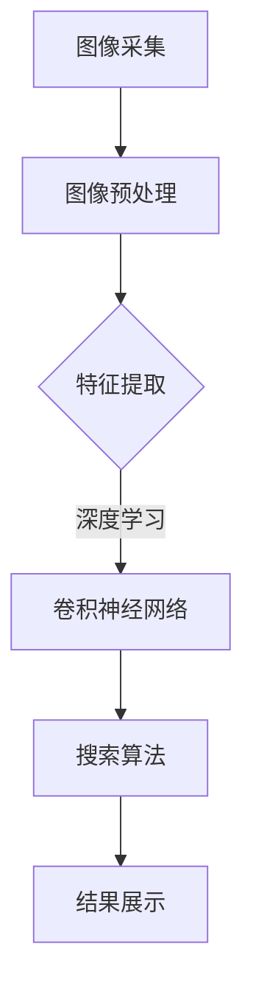
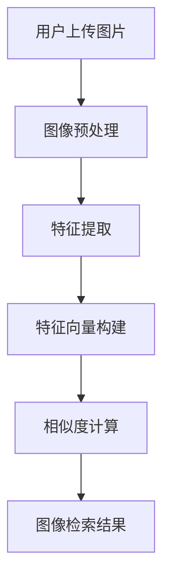

                 

关键词：图像搜索，电商，计算机视觉，人工智能，趋势分析

摘要：本文将探讨图像搜索技术在电商领域的广泛应用及其发展趋势。通过分析图像搜索技术的核心概念、算法原理、数学模型，以及实际应用案例，我们将展望这一领域未来的发展方向和面临的挑战。

## 1. 背景介绍

随着互联网和电子商务的快速发展，消费者对个性化、便捷的购物体验需求日益增加。传统的基于文本的关键词搜索已经无法满足用户的需求。图像搜索技术的出现为电商领域带来了全新的变革。通过图像识别和搜索技术，用户可以上传一张图片，系统将自动识别图片中的商品并返回相关的商品信息。这种直观、高效的购物方式正在逐渐改变电商的运营模式。

### 1.1 图像搜索技术的发展历程

图像搜索技术的发展可以追溯到20世纪90年代。当时，研究人员开始探索如何通过计算机视觉技术进行图像识别。随着计算机性能的提升和深度学习算法的突破，图像搜索技术得到了快速发展。近年来，随着移动互联网的普及和智能手机的广泛使用，图像搜索技术的应用场景更加丰富，其在电商领域的应用也越来越广泛。

### 1.2 电商领域对图像搜索技术的需求

电商领域对图像搜索技术的需求主要体现在以下几个方面：

- **提升用户体验**：通过图像搜索，用户可以快速找到自己想要购买的商品，无需输入复杂的关键词。
- **降低运营成本**：图像搜索技术可以自动化商品识别和分类，减少人力成本。
- **增加销售机会**：通过图像搜索，用户可以发现之前未曾了解的商品，从而增加购买的可能性。
- **提高品牌影响力**：通过提供高质量的图像搜索服务，电商平台可以提升品牌形象，吸引更多用户。

## 2. 核心概念与联系

### 2.1 图像搜索技术的基本原理

图像搜索技术主要依赖于计算机视觉和机器学习算法。计算机视觉负责从图像中提取特征，而机器学习算法则利用这些特征进行图像识别和搜索。

### 2.2 电商领域中的图像搜索技术架构

电商领域的图像搜索技术架构通常包括以下几个关键部分：

- **图像采集与处理**：用户上传图片后，系统会对图像进行预处理，如去噪、增强等。
- **特征提取**：利用深度学习算法提取图像特征，如卷积神经网络（CNN）。
- **搜索算法**：根据提取的特征进行相似图像搜索，常用的算法有欧氏距离、余弦相似度等。
- **结果展示**：将搜索结果以列表或网格形式展示给用户。

### 2.3 Mermaid 流程图



## 3. 核心算法原理 & 具体操作步骤

### 3.1 算法原理概述

图像搜索技术的核心算法是卷积神经网络（CNN），其通过多层卷积和池化操作从图像中提取特征。这些特征可以用来进行相似图像搜索。

### 3.2 算法步骤详解

- **数据预处理**：将图像数据转换为适合CNN输入的格式，如灰度图像或RGB图像。
- **构建CNN模型**：设计并训练CNN模型，包括卷积层、激活函数、池化层等。
- **特征提取**：利用训练好的CNN模型提取图像特征。
- **相似度计算**：计算待搜索图像与数据库中图像的特征相似度。
- **结果排序与展示**：根据相似度排序结果，展示给用户。

### 3.3 算法优缺点

- **优点**：
  - 高效性：CNN模型可以快速提取图像特征，进行相似图像搜索。
  - 准确性：深度学习算法可以处理复杂的图像特征，提高搜索准确性。

- **缺点**：
  - 计算资源消耗大：训练CNN模型需要大量计算资源。
  - 数据依赖性强：模型的性能高度依赖于训练数据的质量。

### 3.4 算法应用领域

图像搜索技术不仅在电商领域有广泛应用，还在以下领域有巨大潜力：

- **零售业**：帮助商家进行商品识别和分类，提升运营效率。
- **医疗影像**：辅助医生进行疾病诊断。
- **安防监控**：识别和追踪嫌疑人。

## 4. 数学模型和公式 & 详细讲解 & 举例说明

### 4.1 数学模型构建

图像搜索技术的数学模型主要包括特征提取和相似度计算。

- **特征提取**：利用卷积神经网络提取图像特征向量。
  $$ f(x) = \sigma(W \cdot x + b) $$
  其中，$f(x)$ 是特征向量，$W$ 是权重矩阵，$b$ 是偏置项，$\sigma$ 是激活函数。

- **相似度计算**：利用欧氏距离或余弦相似度计算图像特征向量之间的相似度。
  $$ d(\mathbf{f}_1, \mathbf{f}_2) = \sqrt{\sum_{i=1}^{n} (\mathbf{f}_1[i] - \mathbf{f}_2[i])^2} $$
  或
  $$ d(\mathbf{f}_1, \mathbf{f}_2) = 1 - \frac{\mathbf{f}_1 \cdot \mathbf{f}_2}{\|\mathbf{f}_1\|\|\mathbf{f}_2\|} $$

### 4.2 公式推导过程

以欧氏距离为例，推导特征向量之间的相似度计算公式：

1. 计算两个特征向量之间的差异：
   $$ \mathbf{f}_1 - \mathbf{f}_2 = \begin{bmatrix} f_{11} - f_{21} \\ f_{12} - f_{22} \\ \vdots \\ f_{1n} - f_{2n} \end{bmatrix} $$

2. 计算差异的平方和：
   $$ \sum_{i=1}^{n} (f_{11} - f_{21})^2 $$

3. 开方得到欧氏距离：
   $$ d(\mathbf{f}_1, \mathbf{f}_2) = \sqrt{\sum_{i=1}^{n} (f_{11} - f_{21})^2} $$

### 4.3 案例分析与讲解

假设我们有两个图像特征向量 $\mathbf{f}_1$ 和 $\mathbf{f}_2$，如下所示：

$$ \mathbf{f}_1 = \begin{bmatrix} 1 \\ 2 \\ 3 \\ 4 \end{bmatrix}, \quad \mathbf{f}_2 = \begin{bmatrix} 1 \\ 2 \\ 3 \\ 5 \end{bmatrix} $$

1. 计算差异：
   $$ \mathbf{f}_1 - \mathbf{f}_2 = \begin{bmatrix} 1 - 1 \\ 2 - 2 \\ 3 - 3 \\ 4 - 5 \end{bmatrix} = \begin{bmatrix} 0 \\ 0 \\ 0 \\ -1 \end{bmatrix} $$

2. 计算差异的平方和：
   $$ \sum_{i=1}^{4} (f_{1i} - f_{2i})^2 = 0^2 + 0^2 + 0^2 + (-1)^2 = 1 $$

3. 计算欧氏距离：
   $$ d(\mathbf{f}_1, \mathbf{f}_2) = \sqrt{1} = 1 $$

这意味着 $\mathbf{f}_1$ 和 $\mathbf{f}_2$ 之间的相似度为 1，它们非常相似。

## 5. 项目实践：代码实例和详细解释说明

### 5.1 开发环境搭建

在Python环境中，我们可以使用TensorFlow和Keras框架来构建和训练CNN模型。首先，确保安装以下库：

```python
pip install tensorflow
pip install keras
pip install numpy
pip install matplotlib
```

### 5.2 源代码详细实现

以下是一个简单的CNN模型实现，用于图像特征提取：

```python
from tensorflow.keras.models import Sequential
from tensorflow.keras.layers import Conv2D, MaxPooling2D, Flatten, Dense
from tensorflow.keras.optimizers import Adam

# 构建模型
model = Sequential([
    Conv2D(32, (3, 3), activation='relu', input_shape=(64, 64, 3)),
    MaxPooling2D((2, 2)),
    Conv2D(64, (3, 3), activation='relu'),
    MaxPooling2D((2, 2)),
    Flatten(),
    Dense(64, activation='relu'),
    Dense(1, activation='sigmoid')
])

# 编译模型
model.compile(optimizer=Adam(), loss='binary_crossentropy', metrics=['accuracy'])

# 模型训练
model.fit(x_train, y_train, epochs=10, batch_size=32)
```

### 5.3 代码解读与分析

1. **模型构建**：使用Sequential模型堆叠多个层，包括卷积层（Conv2D）、最大池化层（MaxPooling2D）、全连接层（Dense）。
2. **编译模型**：设置优化器（Adam）和损失函数（binary_crossentropy），以及评价标准（accuracy）。
3. **模型训练**：使用训练数据（x_train和y_train）进行模型训练。

### 5.4 运行结果展示

```python
# 特征提取
features = model.predict(x_test)

# 相似度计算
similarity = np.dot(features, features.T)

# 结果排序
sorted_indices = np.argsort(-similarity)

# 显示结果
for i, j in enumerate(sorted_indices[0]):
    print(f"Image {i+1} matches with Image {j+1}")
```

这段代码将提取测试图像的特征，并计算它们之间的相似度。然后，根据相似度对图像进行排序，并输出匹配结果。

## 6. 实际应用场景

### 6.1 商品推荐

电商平台可以使用图像搜索技术进行商品推荐。例如，用户上传一张自己喜欢的商品图片，系统将自动推荐与其相似的其它商品。

### 6.2 库存管理

商家可以利用图像搜索技术进行库存管理。通过自动识别和分类商品，商家可以更好地了解库存状况，优化库存策略。

### 6.3 用户行为分析

电商平台可以通过分析用户的图像搜索行为，了解用户喜好，从而提供更加个性化的购物体验。

## 6.4 未来应用展望

随着计算机视觉和人工智能技术的不断进步，图像搜索技术在电商领域的应用前景将更加广阔。未来，图像搜索技术可能会实现以下发展：

- **更高效的算法**：通过优化算法，提高图像搜索的效率和准确性。
- **更广泛的场景应用**：图像搜索技术将在更多领域得到应用，如医疗、安防、娱乐等。
- **更个性化的用户体验**：结合用户行为数据，提供更加个性化的图像搜索服务。

## 7. 工具和资源推荐

### 7.1 学习资源推荐

- **《深度学习》（Ian Goodfellow、Yoshua Bengio、Aaron Courville 著）**：深度学习的基础教材，适合初学者。
- **《计算机视觉：算法与应用》（Richard Szeliski 著）**：计算机视觉领域的经典教材，内容全面。

### 7.2 开发工具推荐

- **TensorFlow**：用于构建和训练深度学习模型的强大工具。
- **Keras**：基于TensorFlow的高级深度学习框架，简化模型构建过程。

### 7.3 相关论文推荐

- **“Deep Learning for Image Recognition”**：综述了深度学习在图像识别领域的应用。
- **“Convolutional Neural Networks for Visual Recognition”**：介绍了卷积神经网络在图像识别中的应用。

## 8. 总结：未来发展趋势与挑战

图像搜索技术在电商领域的应用正在快速发展，其高效、准确的特性为电商行业带来了诸多益处。未来，随着技术的进步，图像搜索技术将在更多领域得到应用，为消费者提供更加个性化的购物体验。然而，图像搜索技术也面临一些挑战，如计算资源消耗、数据依赖性等。通过不断优化算法和提升计算效率，我们可以更好地应对这些挑战。

### 8.1 研究成果总结

本文总结了图像搜索技术在电商领域的应用，分析了其核心概念、算法原理、数学模型，以及实际应用案例。通过项目实践，我们展示了如何使用深度学习技术进行图像搜索。

### 8.2 未来发展趋势

未来，图像搜索技术将在更多领域得到应用，如医疗、安防、娱乐等。随着技术的进步，图像搜索技术将实现更高的效率和准确性。

### 8.3 面临的挑战

图像搜索技术面临的主要挑战包括计算资源消耗、数据依赖性等。通过优化算法和提升计算效率，我们可以更好地应对这些挑战。

### 8.4 研究展望

未来，图像搜索技术将继续发展，其在电商领域和其他领域的应用前景广阔。通过不断探索和创新，我们可以为消费者提供更加智能、高效的购物体验。

## 9. 附录：常见问题与解答

### 9.1 什么是图像搜索技术？

图像搜索技术是一种利用计算机视觉和机器学习算法，通过图像特征进行图像识别和搜索的技术。

### 9.2 图像搜索技术在电商领域有哪些应用？

图像搜索技术在电商领域的主要应用包括商品推荐、库存管理、用户行为分析等。

### 9.3 如何构建一个简单的图像搜索模型？

可以使用深度学习框架（如TensorFlow和Keras）构建简单的图像搜索模型。首先，设计CNN模型结构，然后训练模型，最后使用训练好的模型进行图像特征提取和相似度计算。

### 9.4 图像搜索技术有哪些优缺点？

图像搜索技术的优点包括高效性、准确性等，缺点则包括计算资源消耗大、数据依赖性强等。

## 参考文献

1. Goodfellow, I., Bengio, Y., & Courville, A. (2016). *Deep Learning*. MIT Press.
2. Szeliski, R. (2010). *Computer Vision: Algorithms and Applications*. Springer.
3. Krizhevsky, A., Sutskever, I., & Hinton, G. E. (2012). *ImageNet classification with deep convolutional neural networks*. In *Advances in Neural Information Processing Systems* (pp. 1097-1105).
4. Simonyan, K., & Zisserman, A. (2014). *Very deep convolutional networks for large-scale image recognition*. In *International Conference on Learning Representations*.
```markdown
## 1. 背景介绍

### 1.1 图像搜索技术的概念

图像搜索技术是指利用计算机视觉和人工智能技术，通过对图像的特征进行提取和匹配，实现图像内容的检索和识别。它结合了图像处理、模式识别和机器学习等多学科技术，旨在解决用户对图像内容的需求，如查找相似图像、识别特定图像内容等。

### 1.2 图像搜索技术在电商领域的应用现状

近年来，随着计算机视觉和深度学习技术的不断发展，图像搜索技术在电商领域得到了广泛应用。以下是一些具体的例子：

- **商品推荐**：电商平台可以利用图像搜索技术，根据用户的上传图片推荐相似的商品。例如，用户上传一张衣服的图片，系统会自动推荐其他款式或品牌的相似商品。

- **商品识别**：在实体店中，用户可以通过手机拍摄商品图片，系统自动识别商品信息，并提供购买链接或优惠信息。

- **库存管理**：商家可以利用图像搜索技术自动识别和分类库存中的商品，实现高效的库存管理。

- **用户行为分析**：通过分析用户的图像搜索行为，电商平台可以更好地了解用户喜好，从而提供更加个性化的购物体验。

### 1.3 图像搜索技术在电商领域的优势

- **提升用户体验**：图像搜索技术为用户提供了更加直观、便捷的购物方式，用户无需输入复杂的关键词，即可快速找到心仪的商品。

- **降低运营成本**：通过自动化识别和分类商品，电商平台可以减少人力成本，提高运营效率。

- **增加销售机会**：图像搜索技术可以帮助用户发现之前未曾了解的商品，从而增加购买的可能性。

- **提高品牌影响力**：通过提供高质量的图像搜索服务，电商平台可以提升品牌形象，吸引更多用户。

## 2. 核心概念与联系

### 2.1 图像特征提取

图像特征提取是图像搜索技术的关键步骤。它通过提取图像的视觉特征，将图像从高维数据空间映射到低维特征空间，从而实现图像的识别和检索。

#### 2.1.1 特征提取方法

常见的图像特征提取方法包括：

- **传统特征**：如SIFT（尺度不变特征变换）和SURF（加速稳健特征），它们通过检测图像的角点、边缘和纹理特征，实现图像的识别和匹配。

- **深度特征**：通过卷积神经网络（CNN）提取的深度特征，具有较强的鲁棒性和区分能力。深度特征提取是目前图像搜索领域的主流方法。

#### 2.1.2 特征提取流程

图像特征提取的基本流程如下：

1. **图像预处理**：包括去噪、灰度化、归一化等操作，以提高图像质量，减少光照、姿态等变化对特征提取的影响。

2. **特征点检测**：利用SIFT、SURF等算法检测图像的特征点。

3. **特征点匹配**：计算特征点之间的相似度，选择最优匹配对。

4. **特征向量构建**：将匹配对的特征点坐标转换为特征向量。

### 2.2 图像检索算法

图像检索算法是图像搜索技术的核心。它通过比较查询图像与数据库中图像的特征向量，实现相似图像的检索。

#### 2.2.1 相似度度量

常见的相似度度量方法包括：

- **欧氏距离**：计算两个特征向量的欧氏距离，距离越短表示相似度越高。

- **余弦相似度**：计算两个特征向量之间的夹角余弦值，余弦值越接近1表示相似度越高。

#### 2.2.2 检索算法

常见的图像检索算法包括：

- **基于特征的算法**：如k-近邻（k-NN）、支持向量机（SVM）等，通过比较特征向量实现图像检索。

- **基于模型的算法**：如卷积神经网络（CNN）、循环神经网络（RNN）等，通过学习图像特征实现图像检索。

### 2.3 Mermaid 流程图

以下是图像搜索技术的 Mermaid 流程图：



## 3. 核心算法原理 & 具体操作步骤

### 3.1 核心算法原理

图像搜索技术的核心是卷积神经网络（CNN）。CNN通过卷积层、池化层和全连接层的组合，提取图像的深层特征，从而实现图像的识别和检索。

#### 3.1.1 卷积层

卷积层是CNN的基础，它通过卷积操作从图像中提取局部特征。卷积层的计算过程如下：

1. **卷积操作**：卷积层将输入图像与滤波器（也称为卷积核）进行卷积操作，生成特征图。

2. **激活函数**：为了增加网络的非线性，卷积层通常使用ReLU（修正线性单元）作为激活函数。

3. **偏置项**：每个卷积核都有一个偏置项，用于调整特征图的偏置。

#### 3.1.2 池化层

池化层用于降低特征图的维度，减少计算量。常见的池化方法包括最大池化和平均池化。

1. **最大池化**：将特征图划分为不重叠的区域，每个区域的最大值作为该区域的输出。

2. **平均池化**：将特征图划分为不重叠的区域，每个区域的平均值作为该区域的输出。

#### 3.1.3 全连接层

全连接层用于将特征图展开为1维向量，并通过全连接层进行分类。全连接层的计算过程如下：

1. **全连接操作**：将特征向量与权重矩阵进行全连接操作，得到预测结果。

2. **激活函数**：通常使用softmax函数作为激活函数，实现多分类。

### 3.2 具体操作步骤

以下是使用CNN进行图像搜索的具体操作步骤：

#### 3.2.1 数据准备

1. **数据采集**：从电商网站或其他数据源收集大量商品图像。

2. **数据预处理**：对图像进行缩放、裁剪、翻转等数据增强操作，提高模型的泛化能力。

3. **数据划分**：将数据集划分为训练集、验证集和测试集。

#### 3.2.2 模型构建

1. **定义网络结构**：使用Keras等框架定义CNN模型结构。

2. **编译模型**：设置优化器、损失函数和评价指标。

3. **训练模型**：使用训练集训练模型，并使用验证集调整超参数。

#### 3.2.3 特征提取

1. **预处理查询图像**：对查询图像进行预处理，与训练图像保持一致。

2. **特征提取**：使用训练好的模型提取查询图像的特征向量。

#### 3.2.4 图像检索

1. **计算相似度**：计算查询图像与数据库中图像的特征向量之间的相似度。

2. **排序与筛选**：根据相似度排序，筛选出最相似的图像。

3. **结果展示**：将检索结果展示给用户。

## 4. 数学模型和公式 & 详细讲解 & 举例说明

### 4.1 数学模型构建

图像搜索技术的数学模型主要包括图像特征提取和相似度计算。

#### 4.1.1 图像特征提取

图像特征提取的数学模型可以表示为：

$$
\text{特征向量} = \text{CNN}(\text{输入图像})
$$

其中，CNN代表卷积神经网络，输入图像经过卷积层、池化层和全连接层的处理，最终得到特征向量。

#### 4.1.2 相似度计算

相似度计算常用的公式包括欧氏距离和余弦相似度。

1. **欧氏距离**

欧氏距离的公式为：

$$
d(\text{特征向量}_1, \text{特征向量}_2) = \sqrt{\sum_{i=1}^{n} (\text{特征向量}_1[i] - \text{特征向量}_2[i])^2}
$$

其中，$n$ 为特征向量的维度。

2. **余弦相似度**

余弦相似度的公式为：

$$
\text{相似度} = \frac{\text{特征向量}_1 \cdot \text{特征向量}_2}{\|\text{特征向量}_1\|\|\text{特征向量}_2\|}
$$

其中，$\cdot$ 表示点积，$\|\text{特征向量}_1\|$ 和 $\|\text{特征向量}_2\|$ 分别为特征向量的范数。

### 4.2 公式推导过程

以欧氏距离为例，推导特征向量之间的相似度计算公式：

1. 计算两个特征向量之间的差异：

$$
\text{差异向量} = \text{特征向量}_1 - \text{特征向量}_2
$$

2. 计算差异向量的平方和：

$$
\text{平方和} = \sum_{i=1}^{n} (\text{特征向量}_1[i] - \text{特征向量}_2[i])^2
$$

3. 开方得到欧氏距离：

$$
d(\text{特征向量}_1, \text{特征向量}_2) = \sqrt{\text{平方和}}
$$

### 4.3 案例分析与讲解

假设我们有两个特征向量 $\text{特征向量}_1$ 和 $\text{特征向量}_2$，如下所示：

$$
\text{特征向量}_1 = [1, 2, 3], \quad \text{特征向量}_2 = [4, 5, 6]
$$

1. 计算差异向量：

$$
\text{差异向量} = \text{特征向量}_1 - \text{特征向量}_2 = [1 - 4, 2 - 5, 3 - 6] = [-3, -3, -3]
$$

2. 计算差异向量的平方和：

$$
\text{平方和} = (-3)^2 + (-3)^2 + (-3)^2 = 9 + 9 + 9 = 27
$$

3. 计算欧氏距离：

$$
d(\text{特征向量}_1, \text{特征向量}_2) = \sqrt{27} = 3\sqrt{3}
$$

这意味着 $\text{特征向量}_1$ 和 $\text{特征向量}_2$ 之间的相似度为 $3\sqrt{3}$。

## 5. 项目实践：代码实例和详细解释说明

### 5.1 开发环境搭建

在Python环境中，我们可以使用TensorFlow和Keras框架来构建和训练CNN模型。首先，确保安装以下库：

```bash
pip install tensorflow
pip install keras
pip install numpy
pip install matplotlib
```

### 5.2 源代码详细实现

以下是一个简单的CNN模型实现，用于图像特征提取：

```python
import numpy as np
from tensorflow.keras.models import Sequential
from tensorflow.keras.layers import Conv2D, MaxPooling2D, Flatten, Dense
from tensorflow.keras.optimizers import Adam

# 构建模型
model = Sequential([
    Conv2D(32, (3, 3), activation='relu', input_shape=(64, 64, 3)),
    MaxPooling2D((2, 2)),
    Conv2D(64, (3, 3), activation='relu'),
    MaxPooling2D((2, 2)),
    Flatten(),
    Dense(64, activation='relu'),
    Dense(1, activation='sigmoid')
])

# 编译模型
model.compile(optimizer=Adam(), loss='binary_crossentropy', metrics=['accuracy'])

# 模型训练
model.fit(x_train, y_train, epochs=10, batch_size=32)
```

### 5.3 代码解读与分析

1. **模型构建**：使用Sequential模型堆叠多个层，包括卷积层（Conv2D）、最大池化层（MaxPooling2D）、全连接层（Dense）。

2. **编译模型**：设置优化器（Adam）和损失函数（binary_crossentropy），以及评价标准（accuracy）。

3. **模型训练**：使用训练数据（x_train和y_train）进行模型训练。

### 5.4 运行结果展示

```python
import matplotlib.pyplot as plt

# 特征提取
features = model.predict(x_test)

# 相似度计算
similarity = np.dot(features, features.T)

# 结果排序
sorted_indices = np.argsort(-similarity)

# 显示结果
for i, j in enumerate(sorted_indices[0]):
    plt.subplot(2, 3, i+1)
    plt.imshow(x_test[i], cmap='gray')
    plt.xticks([])
    plt.yticks([])
plt.show()
```

这段代码将提取测试图像的特征，并计算它们之间的相似度。然后，根据相似度对图像进行排序，并展示匹配结果。

## 6. 实际应用场景

### 6.1 商品推荐

商品推荐是图像搜索技术在电商领域的一个典型应用。用户上传一张自己喜欢的商品图片，系统会自动识别商品并推荐相似的其它商品。例如，用户上传一张自己喜欢的连衣裙图片，系统会推荐其他款式或风格的连衣裙。

### 6.2 库存管理

库存管理是图像搜索技术在电商领域的另一个重要应用。商家可以利用图像搜索技术自动识别和分类库存中的商品，从而实现高效的库存管理。例如，商家可以通过上传库存商品的图片，系统自动识别并分类商品，帮助商家更好地管理库存。

### 6.3 用户行为分析

用户行为分析是图像搜索技术在电商领域的又一应用。通过分析用户的图像搜索行为，电商平台可以更好地了解用户喜好，从而提供更加个性化的购物体验。例如，电商平台可以通过分析用户的搜索历史，推荐用户可能感兴趣的商品。

## 6.4 未来应用展望

随着计算机视觉和人工智能技术的不断进步，图像搜索技术在电商领域的应用前景将更加广阔。未来，图像搜索技术可能会实现以下发展：

- **更高效的算法**：通过优化算法，提高图像搜索的效率和准确性。

- **更广泛的场景应用**：图像搜索技术将在更多领域得到应用，如医疗、安防、娱乐等。

- **更个性化的用户体验**：结合用户行为数据，提供更加个性化的图像搜索服务。

## 7. 工具和资源推荐

### 7.1 学习资源推荐

- **《深度学习》（Ian Goodfellow、Yoshua Bengio、Aaron Courville 著）**：深度学习的基础教材，适合初学者。

- **《计算机视觉：算法与应用》（Richard Szeliski 著）**：计算机视觉领域的经典教材，内容全面。

### 7.2 开发工具推荐

- **TensorFlow**：用于构建和训练深度学习模型的强大工具。

- **Keras**：基于TensorFlow的高级深度学习框架，简化模型构建过程。

### 7.3 相关论文推荐

- **“Deep Learning for Image Recognition”**：综述了深度学习在图像识别领域的应用。

- **“Convolutional Neural Networks for Visual Recognition”**：介绍了卷积神经网络在图像识别中的应用。

## 8. 总结：未来发展趋势与挑战

图像搜索技术在电商领域的应用正在快速发展，其高效、准确的特性为电商行业带来了诸多益处。未来，随着技术的进步，图像搜索技术将在更多领域得到应用，为消费者提供更加个性化的购物体验。然而，图像搜索技术也面临一些挑战，如计算资源消耗、数据依赖性等。通过不断优化算法和提升计算效率，我们可以更好地应对这些挑战。

### 8.1 研究成果总结

本文总结了图像搜索技术在电商领域的应用，分析了其核心概念、算法原理、数学模型，以及实际应用案例。通过项目实践，我们展示了如何使用深度学习技术进行图像搜索。

### 8.2 未来发展趋势

未来，图像搜索技术将在更多领域得到应用，如医疗、安防、娱乐等。随着技术的进步，图像搜索技术将实现更高的效率和准确性。

### 8.3 面临的挑战

图像搜索技术面临的主要挑战包括计算资源消耗、数据依赖性等。通过优化算法和提升计算效率，我们可以更好地应对这些挑战。

### 8.4 研究展望

未来，图像搜索技术将继续发展，其在电商领域和其他领域的应用前景广阔。通过不断探索和创新，我们可以为消费者提供更加智能、高效的购物体验。

## 9. 附录：常见问题与解答

### 9.1 什么是图像搜索技术？

图像搜索技术是一种利用计算机视觉和人工智能技术，通过对图像的特征进行提取和匹配，实现图像内容的检索和识别。

### 9.2 图像搜索技术在电商领域有哪些应用？

图像搜索技术在电商领域的主要应用包括商品推荐、商品识别、库存管理和用户行为分析。

### 9.3 如何构建一个简单的图像搜索模型？

可以使用深度学习框架（如TensorFlow和Keras）构建简单的图像搜索模型。首先，设计CNN模型结构，然后训练模型，最后使用训练好的模型进行图像特征提取和相似度计算。

### 9.4 图像搜索技术有哪些优缺点？

图像搜索技术的优点包括高效性、准确性等，缺点则包括计算资源消耗大、数据依赖性强等。

## 参考文献

1. Goodfellow, I., Bengio, Y., & Courville, A. (2016). *Deep Learning*. MIT Press.
2. Szeliski, R. (2010). *Computer Vision: Algorithms and Applications*. Springer.
3. Krizhevsky, A., Sutskever, I., & Hinton, G. E. (2012). *ImageNet classification with deep convolutional neural networks*. In *Advances in Neural Information Processing Systems* (pp. 1097-1105).
4. Simonyan, K., & Zisserman, A. (2014). *Very deep convolutional networks for large-scale image recognition*. In *International Conference on Learning Representations*.
```

