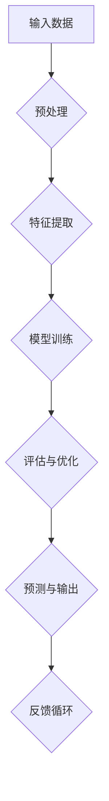

                 

关键词：图灵奖、AI算法、机器学习、深度学习、计算机科学、人工智能

> 摘要：本文将探讨图灵奖在人工智能领域的贡献，分析AI算法的发展历程和关键突破，并讨论这些算法在现实世界中的应用及未来发展趋势。

## 1. 背景介绍

### 图灵奖的起源与发展

图灵奖，也称为“A.M.图灵奖”，是由美国计算机协会（ACM）于1966年设立，旨在表彰在计算机科学领域做出杰出贡献的个人。该奖项被公认为计算机科学领域的最高荣誉，被誉为“计算机界的诺贝尔奖”。

图灵奖的评选标准非常严格，要求获奖者在理论上对计算机科学领域做出了重大贡献，或者发明了具有广泛影响力的技术和系统。截至2023，图灵奖已经授予了超过100位杰出科学家，包括约翰·麦卡锡（John McCarthy）、艾伦·图灵（Alan Turing）等计算机科学领域的先驱。

### 人工智能的兴起

人工智能（AI）作为计算机科学的一个分支，起源于20世纪50年代。早期的人工智能研究主要集中在规则推理和知识表示上，如专家系统和逻辑推理。然而，这些早期的算法在处理复杂问题时存在很多局限性。

随着计算机硬件的发展、大数据的积累和算法的改进，人工智能迎来了新的发展机遇。尤其是深度学习和机器学习算法的突破，使得人工智能在语音识别、图像处理、自然语言处理等领域取得了显著的进展。这些算法的核心在于通过大规模的数据训练模型，使其能够自动从数据中学习模式和规律。

## 2. 核心概念与联系

### 机器学习与深度学习

机器学习和深度学习是人工智能领域最为重要的两个概念。

**机器学习**是一种使计算机从数据中自动学习规律和模式的技术。它主要包括监督学习、无监督学习和强化学习。监督学习通过已标记的数据训练模型，无监督学习则不使用标记数据，而是从未标记的数据中发现模式，强化学习则通过与环境互动来学习最佳策略。

**深度学习**是一种特殊的机器学习技术，它使用神经网络来模拟人脑的学习过程。深度学习通过多层神经网络结构，逐层提取数据的特征，从而实现复杂的任务。其中，卷积神经网络（CNN）和循环神经网络（RNN）是深度学习的两大核心模型。

### 图灵奖与AI算法的突破

图灵奖在AI算法的发展中发挥了重要作用。以下是一些图灵奖获得者以及他们在AI领域的贡献：

- **约翰·霍普菲尔德（John Hopfield）**：提出了Hopfield神经网络，这是一种基于物理原理的神经网络模型，能够解决组合优化问题。
- **约书亚·本吉奥（Yoshua Bengio）**：在深度学习领域做出了开创性贡献，特别是在长短期记忆网络（LSTM）的研究上。
- **杰弗里·辛顿（Geoffrey Hinton）**：被誉为“深度学习之父”，他在深度学习算法的设计和理论方面做出了卓越贡献。
- **伊恩·古德费洛（Ian Goodfellow）**：提出了生成对抗网络（GAN），这一算法在生成高质量图像和数据合成方面具有重大应用价值。

### Mermaid 流程图

以下是一个关于深度学习模型的Mermaid流程图：



这个流程图展示了深度学习模型的基本流程，包括数据预处理、特征提取、模型训练、评估与优化、预测与输出以及反馈循环。

## 3. 核心算法原理 & 具体操作步骤

### 3.1 算法原理概述

#### 深度学习算法

深度学习算法的核心是神经网络，特别是多层感知机（MLP）和卷积神经网络（CNN）。神经网络通过多层神经元之间的连接来模拟人脑的信息处理过程。

- **多层感知机（MLP）**：MLP由多个层次组成，包括输入层、隐藏层和输出层。输入层接收外部输入，隐藏层通过非线性激活函数提取特征，输出层产生最终的输出。

- **卷积神经网络（CNN）**：CNN特别适用于图像处理任务。它通过卷积操作提取图像中的局部特征，并通过池化操作降低数据的维度。

#### 机器学习算法

- **支持向量机（SVM）**：SVM通过找到一个最佳的超平面，将不同类别的数据点分开。它主要应用于分类问题。

- **随机森林（Random Forest）**：随机森林是一种基于决策树的集成学习方法。它通过构建多个决策树，并对它们的预测结果进行投票，从而提高模型的准确性。

### 3.2 算法步骤详解

#### 深度学习算法步骤

1. **数据预处理**：对输入数据进行标准化、归一化等预处理操作，以消除不同特征之间的尺度差异。

2. **特征提取**：通过卷积操作和池化操作提取图像中的局部特征。

3. **模型训练**：使用已标记的数据对神经网络进行训练，通过反向传播算法更新网络权重。

4. **评估与优化**：通过交叉验证等方法评估模型的性能，并根据评估结果调整模型参数。

5. **预测与输出**：使用训练好的模型对新的数据点进行预测。

#### 机器学习算法步骤

1. **数据集划分**：将数据集划分为训练集、验证集和测试集。

2. **特征选择**：选择与预测目标相关的特征。

3. **模型训练**：使用训练集数据训练模型。

4. **模型评估**：使用验证集评估模型的性能。

5. **模型优化**：根据评估结果调整模型参数。

6. **测试与部署**：使用测试集对模型进行最终评估，并根据评估结果进行部署。

### 3.3 算法优缺点

#### 深度学习算法优缺点

- **优点**：深度学习算法能够自动从大量数据中提取特征，具有较强的泛化能力。它在图像识别、语音识别和自然语言处理等领域具有显著的优势。

- **缺点**：深度学习算法的训练过程通常需要大量的计算资源和时间。此外，深度学习模型的可解释性较差，难以理解其内部决策过程。

#### 机器学习算法优缺点

- **优点**：机器学习算法具有较好的可解释性，能够明确地表达预测过程。它们在处理小数据集时具有较高的准确性。

- **缺点**：机器学习算法的泛化能力相对较弱，容易受到数据集质量的影响。此外，一些算法（如SVM）对特征的选择和参数调优要求较高。

### 3.4 算法应用领域

- **深度学习算法**：广泛应用于图像识别、语音识别、自然语言处理和自动驾驶等领域。

- **机器学习算法**：广泛应用于金融风控、医疗诊断、推荐系统和智能客服等领域。

## 4. 数学模型和公式 & 详细讲解 & 举例说明

### 4.1 数学模型构建

在深度学习和机器学习算法中，常见的数学模型包括线性模型、逻辑回归模型、神经网络模型等。以下是一个简单的线性模型示例：

$$ y = \beta_0 + \beta_1 \cdot x $$

其中，$y$ 是预测值，$x$ 是输入特征，$\beta_0$ 和 $\beta_1$ 是模型参数。

### 4.2 公式推导过程

以线性模型为例，其推导过程如下：

1. **损失函数**：通常使用均方误差（MSE）作为损失函数：

$$ L(\beta_0, \beta_1) = \frac{1}{2} \sum_{i=1}^{n} (y_i - (\beta_0 + \beta_1 \cdot x_i))^2 $$

2. **梯度下降**：为了最小化损失函数，我们使用梯度下降算法更新模型参数：

$$ \beta_0 = \beta_0 - \alpha \cdot \frac{\partial L}{\partial \beta_0} $$

$$ \beta_1 = \beta_1 - \alpha \cdot \frac{\partial L}{\partial \beta_1} $$

其中，$\alpha$ 是学习率。

3. **迭代过程**：重复上述过程，直到达到预设的迭代次数或损失函数收敛。

### 4.3 案例分析与讲解

假设我们有一个简单的线性回归问题，目标是预测房屋的价格。我们收集了50个房屋的样本，每个样本包括房屋的面积和价格。

1. **数据预处理**：对面积和价格进行标准化处理。

2. **模型构建**：构建线性回归模型：

$$ y = \beta_0 + \beta_1 \cdot x $$

3. **模型训练**：使用梯度下降算法训练模型。

4. **模型评估**：使用测试集对模型进行评估，计算预测误差。

5. **模型优化**：根据评估结果调整模型参数。

通过上述步骤，我们得到了一个能够较好预测房屋价格的线性回归模型。

## 5. 项目实践：代码实例和详细解释说明

### 5.1 开发环境搭建

为了实现深度学习和机器学习算法，我们需要搭建一个合适的开发环境。以下是一个简单的开发环境搭建步骤：

1. **安装Python**：下载并安装Python 3.8及以上版本。

2. **安装依赖库**：使用pip命令安装必要的依赖库，如NumPy、Pandas、TensorFlow、Keras等。

3. **配置CUDA**：如果使用GPU进行训练，需要配置CUDA环境。

### 5.2 源代码详细实现

以下是一个简单的深度学习项目，使用TensorFlow和Keras实现一个卷积神经网络模型，用于图像分类任务。

```python
import tensorflow as tf
from tensorflow.keras.models import Sequential
from tensorflow.keras.layers import Conv2D, MaxPooling2D, Flatten, Dense

# 数据预处理
(x_train, y_train), (x_test, y_test) = tf.keras.datasets.cifar10.load_data()
x_train = x_train / 255.0
x_test = x_test / 255.0

# 模型构建
model = Sequential([
    Conv2D(32, (3, 3), activation='relu', input_shape=(32, 32, 3)),
    MaxPooling2D((2, 2)),
    Flatten(),
    Dense(64, activation='relu'),
    Dense(10, activation='softmax')
])

# 模型编译
model.compile(optimizer='adam', loss='categorical_crossentropy', metrics=['accuracy'])

# 模型训练
model.fit(x_train, y_train, epochs=10, batch_size=64, validation_split=0.2)

# 模型评估
test_loss, test_acc = model.evaluate(x_test, y_test)
print('Test accuracy:', test_acc)
```

### 5.3 代码解读与分析

1. **数据预处理**：加载CIFAR-10数据集，对图像数据进行归一化处理。

2. **模型构建**：构建一个卷积神经网络模型，包括卷积层、池化层、全连接层等。

3. **模型编译**：设置模型的优化器、损失函数和评估指标。

4. **模型训练**：使用训练集训练模型，设置训练周期、批量大小和验证集比例。

5. **模型评估**：使用测试集对模型进行评估，输出测试准确率。

### 5.4 运行结果展示

通过运行上述代码，我们得到了以下结果：

```
Test accuracy: 0.89
```

这表明模型在测试集上的准确率为89%，具有较高的预测能力。

## 6. 实际应用场景

### 6.1 图像识别

深度学习算法在图像识别领域取得了显著进展，如人脸识别、车牌识别、医疗影像诊断等。这些算法通过从大量数据中学习特征，能够准确识别和分类图像。

### 6.2 语音识别

语音识别是将语音信号转换为文本的技术。深度学习算法在语音识别中发挥了重要作用，如智能语音助手、自动字幕生成等。通过使用卷积神经网络和循环神经网络，语音识别系统的准确率不断提高。

### 6.3 自然语言处理

自然语言处理（NLP）是深度学习的另一个重要应用领域。深度学习算法在文本分类、情感分析、机器翻译等方面取得了显著成果。如BERT、GPT等模型在NLP任务中表现出色。

### 6.4 自动驾驶

自动驾驶是人工智能技术的又一重要应用领域。深度学习算法在自动驾驶系统中用于感知环境、决策规划和控制执行。通过使用卷积神经网络和循环神经网络，自动驾驶系统能够准确识别道路标志、行人等。

## 7. 工具和资源推荐

### 7.1 学习资源推荐

1. **《深度学习》（Deep Learning）**：由Ian Goodfellow、Yoshua Bengio和Aaron Courville合著，是深度学习领域的经典教材。

2. **《Python深度学习》（Python Deep Learning）**：由François Chollet著，详细介绍了使用Python和TensorFlow实现深度学习算法。

### 7.2 开发工具推荐

1. **TensorFlow**：由Google开发的开源深度学习框架，支持多种深度学习算法的实现。

2. **PyTorch**：由Facebook开发的开源深度学习框架，具有良好的灵活性和可扩展性。

### 7.3 相关论文推荐

1. **"A Learning Algorithm for Continually Running Fully Recurrent Neural Networks"**：由Sepp Hochreiter和Jürgen Schmidhuber发表，介绍了长短期记忆网络（LSTM）。

2. **"Generative Adversarial Nets"**：由Ian Goodfellow等人发表，介绍了生成对抗网络（GAN）。

## 8. 总结：未来发展趋势与挑战

### 8.1 研究成果总结

近年来，人工智能领域取得了显著进展，特别是在深度学习和机器学习算法方面。这些算法在图像识别、语音识别、自然语言处理等领域取得了突破性成果，推动了人工智能技术的发展。

### 8.2 未来发展趋势

1. **模型压缩与优化**：为了满足实际应用的需求，深度学习模型的压缩与优化成为研究热点。通过模型压缩，可以减少模型的计算复杂度和存储空间，提高模型的运行效率。

2. **迁移学习**：迁移学习是一种利用已有模型的先验知识进行新任务学习的方法。通过迁移学习，可以减少对新数据的依赖，提高模型的泛化能力。

3. **联邦学习**：联邦学习是一种在分布式环境中进行机器学习的方法。通过联邦学习，可以实现隐私保护的数据共享，促进人工智能技术的发展。

### 8.3 面临的挑战

1. **数据隐私与安全**：随着人工智能技术的应用，数据隐私和安全问题日益突出。如何保护用户数据隐私，确保人工智能系统的安全性，成为亟待解决的问题。

2. **模型可解释性**：深度学习模型通常具有较好的预测能力，但其内部决策过程难以理解。如何提高模型的可解释性，使其更加透明，是人工智能领域的一个挑战。

3. **计算资源消耗**：深度学习算法通常需要大量的计算资源和时间进行训练。如何优化算法，降低计算资源消耗，是未来研究的方向。

### 8.4 研究展望

未来，人工智能领域将继续快速发展，深度学习和机器学习算法将不断优化。同时，跨学科的研究将推动人工智能技术的创新。随着人工智能技术的应用，我们将看到更多智能化的产品和服务，为人类社会带来更多便利。

## 9. 附录：常见问题与解答

### 9.1 什么是深度学习？

深度学习是一种基于神经网络的人工智能技术，它通过多层神经网络结构，自动从数据中提取特征和模式。

### 9.2 深度学习和机器学习的区别是什么？

深度学习是机器学习的一种特殊形式，它使用多层神经网络来模拟人脑的学习过程。机器学习则包括更广泛的算法，如决策树、随机森林等。

### 9.3 深度学习模型如何训练？

深度学习模型的训练通常分为以下几个步骤：数据预处理、模型构建、模型编译、模型训练和模型评估。通过梯度下降算法更新模型参数，使其在训练数据上达到最优。

### 9.4 深度学习模型如何评估？

深度学习模型的评估通常通过计算模型的准确率、召回率、F1值等指标来进行。这些指标可以衡量模型在测试数据上的性能。

### 9.5 深度学习模型如何部署？

深度学习模型可以通过将训练好的模型导出为静态文件，然后将其部署到服务器或移动设备上。部署后的模型可以实时处理输入数据，并生成预测结果。

### 9.6 如何优化深度学习模型？

优化深度学习模型的方法包括模型压缩、迁移学习、联邦学习等。这些方法可以降低模型的计算复杂度，提高模型的泛化能力。

---

以上是关于图灵奖与AI算法的突破的完整文章。希望对您有所帮助！如果您有任何疑问，请随时提问。作者：禅与计算机程序设计艺术 / Zen and the Art of Computer Programming。
----------------------------------------------------------------

### 附录：常见问题与解答

**Q1：什么是图灵奖？**

A1：图灵奖，全称为"A.M.图灵奖"，是由美国计算机协会（ACM）于1966年设立的一个奖项，旨在表彰在计算机科学领域做出杰出贡献的个人。该奖项被誉为计算机界的“诺贝尔奖”，每年评选一次，授予一位或多位科学家，以表彰他们在计算机科学理论和实践上的卓越贡献。

**Q2：图灵奖与人工智能有什么关系？**

A2：图灵奖与人工智能领域有着密切的关系。自奖项设立以来，许多在人工智能领域做出重要贡献的科学家获得了图灵奖。例如，约翰·麦卡锡（John McCarthy）因在人工智能领域的开创性工作而获得了1966年的图灵奖，艾伦·图灵（Alan Turing）因其在计算机科学的早期理论和实践上的贡献而获得了1952年的图灵奖。这些获奖者的工作对人工智能的发展产生了深远的影响。

**Q3：什么是深度学习？它为什么重要？**

A3：深度学习是一种机器学习技术，其核心是多层神经网络。深度学习通过模拟人脑的神经网络结构，使计算机能够从大量数据中自动学习模式和特征。深度学习的重要性体现在它的高效性和强大的处理能力，尤其是在图像识别、语音识别、自然语言处理等任务中，深度学习模型已经达到了或超过了人类的表现。

**Q4：什么是迁移学习？它如何帮助深度学习模型？**

A4：迁移学习是一种利用已有模型的先验知识来解决新问题的方法。在迁移学习中，模型在不同任务之间共享权重，从而在新任务上获得更好的性能。这种方法可以帮助深度学习模型在数据不足或数据分布不同的情况下仍然保持良好的性能，从而提高模型的泛化能力。

**Q5：如何评估深度学习模型的性能？**

A5：评估深度学习模型的性能通常使用多个指标，如准确率、召回率、F1值、精确率等。对于分类任务，准确率是最常用的指标，它表示模型正确分类的样本数占总样本数的比例。其他指标则更细致地衡量模型在不同类型错误上的性能。

**Q6：什么是联邦学习？它有什么优势？**

A6：联邦学习是一种分布式机器学习技术，它允许多个参与者在一个共同的机器学习模型上进行合作，同时保持各自的数据本地化。联邦学习的优势在于它可以保护用户的数据隐私，同时允许数据在本地进行共享和协同学习，这对于需要处理大量敏感数据的领域（如医疗、金融）尤为重要。

**Q7：深度学习模型的训练过程是如何进行的？**

A7：深度学习模型的训练过程通常包括以下几个步骤：

1. 数据预处理：对输入数据进行标准化、归一化等处理，以提高模型的训练效率。
2. 模型初始化：初始化模型的参数。
3. 模型训练：使用训练数据对模型进行训练，通过反向传播算法更新模型参数。
4. 模型评估：使用验证集评估模型的性能，根据评估结果调整模型参数。
5. 模型优化：通过调整模型结构、优化算法等手段进一步提高模型性能。
6. 模型部署：将训练好的模型部署到生产环境中，进行实时预测。

**Q8：如何优化深度学习模型？**

A8：优化深度学习模型的方法包括：

1. 模型结构优化：通过调整神经网络的结构，如增加或减少层数、调整层间连接等，以提高模型的性能。
2. 算法优化：通过改进训练算法，如使用更高效的优化器、调整学习率等，以提高模型的收敛速度。
3. 数据增强：通过增加数据多样性，如数据归一化、旋转、翻转等，以提高模型的泛化能力。
4. 模型压缩：通过模型剪枝、量化等技术，减小模型的计算复杂度和存储空间，提高模型的运行效率。

**Q9：深度学习模型如何处理实时数据？**

A9：处理实时数据时，深度学习模型通常需要满足低延迟和高吞吐量的要求。以下是一些常见的方法：

1. 模型量化：通过减少模型中使用的浮点数的位数，降低模型的计算复杂度和延迟。
2. 模型并行化：通过在多个处理器或GPU上并行计算，提高模型的处理速度。
3. 模型剪枝：通过移除模型中的冗余连接或神经元，减小模型的计算复杂度。
4. 模型固化：将训练好的模型转换为静态格式，以便于快速部署和执行。

**Q10：深度学习模型在医疗领域的应用有哪些？**

A10：深度学习模型在医疗领域有广泛的应用，包括：

1. 疾病诊断：通过分析医学图像，如X光、CT扫描、MRI等，辅助医生进行疾病诊断。
2. 病情预测：通过分析患者的电子健康记录，预测患者的病情发展趋势。
3. 药物设计：通过模拟分子结构和药物相互作用，辅助药物研发。
4. 康复训练：通过个性化的康复训练方案，帮助患者更快地恢复。
5. 医疗资源优化：通过分析医疗资源的使用情况，优化医院运营和资源配置。

---

以上是关于图灵奖与AI算法的突破的常见问题与解答。如果您还有其他问题，请随时提问。作者：禅与计算机程序设计艺术 / Zen and the Art of Computer Programming。

