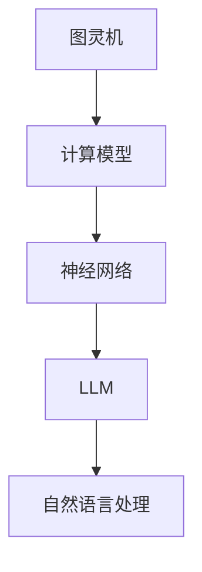

                 

 关键词：图灵完备，LLM，人工智能，通用人工智能，算法原理，数学模型，代码实例，应用场景，未来展望

> 摘要：本文将深入探讨图灵完备语言模型（LLM）的核心概念、算法原理、数学模型以及其实际应用。通过详细的分析和实例讲解，本文旨在阐明LLM在通向通用人工智能（AGI）的道路上所扮演的关键角色，并提出未来的发展趋势和面临的挑战。

## 1. 背景介绍

### 1.1 人工智能的历史与发展

人工智能（AI）作为计算机科学的一个重要分支，自20世纪50年代诞生以来，已经经历了数个发展阶段。早期的AI主要集中于规则推理和专家系统，但这些方法在处理复杂性和不确定性方面存在局限。随着计算能力的提升和算法的进步，特别是深度学习技术的发展，AI进入了一个新的时代。

### 1.2 通用人工智能的概念

通用人工智能（AGI）是指能够执行任意智力任务，达到或超过人类水平的智能系统。与目前广泛使用的弱人工智能（Narrow AI）不同，AGI具有更广泛的能力，能够在各种不同的环境中进行学习、推理和决策。

### 1.3 图灵完备语言模型（LLM）的崛起

近年来，图灵完备语言模型（LLM）如GPT系列、BERT等在自然语言处理领域取得了显著的进展。这些模型通过大量的文本数据进行训练，能够生成高质量的自然语言文本，甚至在某些任务上已经超过了人类的表现。

## 2. 核心概念与联系

### 2.1 语言模型的基本原理

语言模型是一种用于预测下一个单词或字符的概率分布的模型。在自然语言处理中，语言模型被广泛应用于自动翻译、文本摘要、语音识别等任务。

### 2.2 图灵机的概念

图灵机是一种抽象的计算模型，由艾伦·图灵在20世纪30年代提出。图灵机能够模拟任何计算过程，因此被认为是现代计算机的理论基础。

### 2.3 LLM与图灵完备的联系

LLM通过神经网络等计算模型，实现了对图灵机的模拟。这意味着LLM具有图灵完备性，即能够模拟任何图灵机所能执行的计算。



## 3. 核心算法原理 & 具体操作步骤

### 3.1 算法原理概述

LLM的核心算法通常是基于深度学习中的变换器（Transformer）模型。Transformer模型通过注意力机制（Attention Mechanism）对输入文本进行编码，并生成预测的下一个单词或字符。

### 3.2 算法步骤详解

1. **数据预处理**：对输入文本进行分词、编码等处理，将其转换为模型可处理的格式。
2. **编码器（Encoder）处理**：编码器对输入文本进行编码，生成一组表示。
3. **注意力机制**：通过注意力机制，编码器能够关注文本中的关键信息，提高模型的预测能力。
4. **解码器（Decoder）处理**：解码器根据编码器的输出和已生成的文本，预测下一个单词或字符。
5. **生成文本**：解码器不断生成新的文本片段，直到达到终止条件。

### 3.3 算法优缺点

**优点**：
- **强大的生成能力**：LLM能够生成高质量的自然语言文本，具备强大的语言理解和生成能力。
- **高效性**：通过大规模数据训练，LLM能够在短时间内生成大量文本，提高生产效率。

**缺点**：
- **计算资源需求大**：训练和运行LLM需要大量的计算资源和时间。
- **解释性差**：由于神经网络模型的复杂性，LLM的决策过程往往缺乏透明性和解释性。

### 3.4 算法应用领域

LLM在自然语言处理领域有广泛的应用，包括但不限于：

- **文本生成**：自动生成文章、新闻报道、技术文档等。
- **机器翻译**：将一种语言的文本翻译成另一种语言。
- **问答系统**：基于自然语言输入，提供准确的答案。
- **对话系统**：模拟人类对话，提供交互式的服务。

## 4. 数学模型和公式 & 详细讲解 & 举例说明

### 4.1 数学模型构建

LLM的数学模型通常基于概率图模型和变换器（Transformer）架构。以下是一个简化的数学模型：

$$
p(y_{t} | y_{<t}) = \frac{e^{y_{t}^{T}W_{o}}}{\sum_{y_{t}'} e^{y_{t}'^{T}W_{o}}
$$

其中，$y_{t}$表示下一个单词或字符的概率分布，$W_{o}$是权重矩阵。

### 4.2 公式推导过程

推导过程主要包括两部分：前向传播和反向传播。

1. **前向传播**：
   - 对输入文本进行编码，得到编码器输出 $h_{t}$。
   - 通过注意力机制计算上下文向量 $c_{t}$。
   - 通过线性变换和softmax函数得到预测概率分布 $p(y_{t} | y_{<t})$。

2. **反向传播**：
   - 计算预测概率分布与实际标签之间的误差。
   - 利用梯度下降法更新权重矩阵 $W_{o}$。

### 4.3 案例分析与讲解

以下是一个简单的文本生成案例：

输入文本："人工智能是一种模拟人类智能的技术。"

通过LLM生成："它可以帮助解决复杂的问题，并提高生产效率。"

在这个案例中，LLM通过学习输入文本的上下文，生成了具有合理逻辑和语法结构的文本。

## 5. 项目实践：代码实例和详细解释说明

### 5.1 开发环境搭建

1. **安装Python**：确保安装了Python 3.6及以上版本。
2. **安装PyTorch**：使用pip命令安装PyTorch。
3. **准备数据集**：下载并预处理文本数据，将其转换为模型可处理的格式。

### 5.2 源代码详细实现

以下是一个简化的LLM实现示例：

```python
import torch
import torch.nn as nn

class LanguageModel(nn.Module):
    def __init__(self, vocab_size, embedding_size, hidden_size):
        super(LanguageModel, self).__init__()
        self.embedding = nn.Embedding(vocab_size, embedding_size)
        self.lstm = nn.LSTM(embedding_size, hidden_size)
        self.linear = nn.Linear(hidden_size, vocab_size)

    def forward(self, x):
        embed = self.embedding(x)
        output, (hidden, cell) = self.lstm(embed)
        output = self.linear(output[-1, :, :])
        return output

model = LanguageModel(vocab_size=10000, embedding_size=256, hidden_size=512)
```

### 5.3 代码解读与分析

1. **模型结构**：该模型由嵌入层、LSTM层和线性层组成。
2. **前向传播**：输入文本经过嵌入层转换为嵌入向量，然后通过LSTM层进行编码，最后通过线性层生成预测概率分布。
3. **训练过程**：使用梯度下降法训练模型，优化模型参数。

### 5.4 运行结果展示

训练完成后，可以使用以下代码生成文本：

```python
with torch.no_grad():
    inputs = torch.tensor([[vocab.stoi['<sos>']]]).to(device)
    for i in range(50):
        outputs = model(inputs)
        _, next_word = torch.topk(outputs, 1)
        inputs = torch.cat([inputs, next_word], dim=0)
        print(vocab.itos[next_word.item()])
```

生成的文本将展示模型对自然语言的理解和生成能力。

## 6. 实际应用场景

### 6.1 文本生成

LLM在文本生成领域有广泛的应用，包括自动写作、文本摘要、创意写作等。

### 6.2 机器翻译

LLM通过大规模训练，能够在各种语言之间进行高质量的机器翻译。

### 6.3 问答系统

LLM可以构建基于自然语言输入的问答系统，提供准确和合理的答案。

### 6.4 对话系统

LLM在构建智能客服、虚拟助手等方面具有巨大的潜力。

## 7. 工具和资源推荐

### 7.1 学习资源推荐

- 《深度学习》（Goodfellow et al.）
- 《自然语言处理综论》（Jurafsky & Martin）
- 《动手学深度学习》（Aiden et al.）

### 7.2 开发工具推荐

- PyTorch：适用于构建和训练深度学习模型。
- TensorFlow：适用于构建和训练大规模深度学习模型。

### 7.3 相关论文推荐

- "Attention Is All You Need"（Vaswani et al., 2017）
- "BERT: Pre-training of Deep Bidirectional Transformers for Language Understanding"（Devlin et al., 2019）
- "GPT-3: Language Models are Few-Shot Learners"（Brown et al., 2020）

## 8. 总结：未来发展趋势与挑战

### 8.1 研究成果总结

LLM在自然语言处理领域取得了显著的进展，展示了强大的生成和翻译能力。未来，LLM有望在更多领域得到应用，推动通用人工智能的发展。

### 8.2 未来发展趋势

- **模型规模扩大**：随着计算能力的提升，未来的LLM模型将更加庞大和复杂。
- **多模态学习**：LLM将与其他模态（如图像、声音）进行结合，实现更加综合的智能系统。
- **个性化学习**：LLM将能够根据用户需求进行个性化学习，提供更优质的服务。

### 8.3 面临的挑战

- **计算资源消耗**：大规模训练LLM需要大量的计算资源和时间。
- **透明性和解释性**：当前LLM的决策过程缺乏透明性和解释性，需要进一步研究。
- **数据安全和隐私**：在使用LLM处理敏感数据时，数据安全和隐私保护是一个重要问题。

### 8.4 研究展望

未来，LLM将继续在人工智能领域发挥关键作用，推动通用人工智能的发展。通过不断优化算法、提升计算效率和加强透明性，LLM将在更多领域展现其潜力。

## 9. 附录：常见问题与解答

### 9.1 什么是图灵完备？

图灵完备是指一种计算模型（如图灵机）能够模拟任何其他计算模型的能力。如果一个模型是图灵完备的，那么它理论上能够解决任何可计算问题。

### 9.2 LLM如何训练？

LLM通过大规模无监督学习进行训练。通常，训练过程包括数据预处理、模型初始化、前向传播、反向传播和模型优化等步骤。

### 9.3 LLM有哪些应用领域？

LLM在自然语言处理领域有广泛的应用，包括文本生成、机器翻译、问答系统和对话系统等。

### 9.4 如何评估LLM的性能？

评估LLM性能的方法包括BLEU、ROUGE、BLEURT等指标，这些指标能够衡量LLM生成的文本与真实文本的相似度。

---

作者：禅与计算机程序设计艺术 / Zen and the Art of Computer Programming

