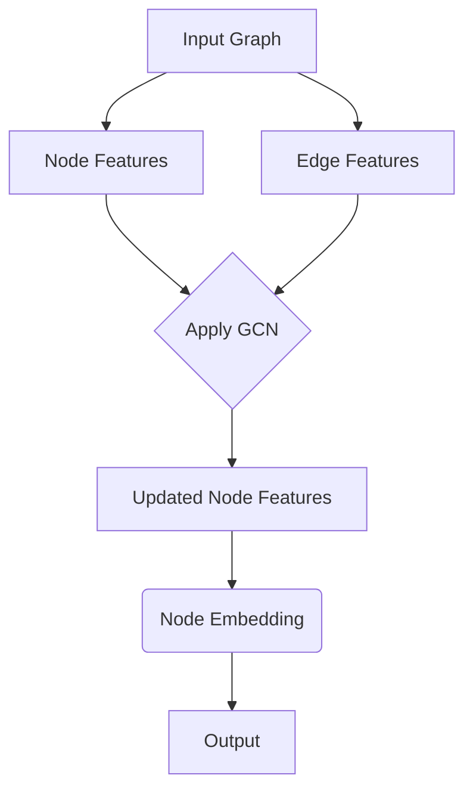

                 

在当今人工智能领域，图神经网络（Graph Neural Networks, GNN）已经成为了一种备受瞩目的研究热点。作为一种专门处理图结构数据的神经网络模型，GNN在社交网络分析、推荐系统、生物信息学、自然语言处理等多个领域展现了强大的能力。本文将深入探讨图神经网络的原理、实现方法以及实际应用案例，以帮助读者更好地理解和掌握这一先进技术。

## 关键词

- 图神经网络（Graph Neural Networks）
- 图结构数据（Graph-structured Data）
- 神经网络（Neural Networks）
- 数据挖掘（Data Mining）
- 社交网络分析（Social Network Analysis）

## 摘要

本文旨在为读者提供一个全面而深入的图神经网络（GNN）教程。我们将首先介绍图神经网络的背景及其在人工智能领域的地位。接着，文章将详细解释GNN的核心概念和算法原理，并通过一个具体案例展示如何实现和部署GNN。最后，文章将探讨GNN的实际应用场景，并对未来的发展趋势和挑战进行展望。

## 1. 背景介绍

### 图神经网络的起源与发展

图神经网络的概念最早可以追溯到2000年左右，当时一些学者开始探索如何将神经网络应用于图结构数据。最早的GNN模型是基于图卷积网络（Graph Convolutional Networks, GCN）的，它们通过将图节点和边的特征进行卷积操作，从而实现节点分类、链接预测等任务。随着时间的推移，越来越多的研究者投入到GNN的研究中，提出了诸如图注意力网络（Graph Attention Networks, GAT）和图自编码器（Graph Autoencoder）等新模型。

### 图神经网络的地位和意义

随着互联网和大数据的发展，图结构数据在现实世界中变得越发普遍。传统的方法如基于规则的算法和传统机器学习方法在处理图数据时往往力不从心，而GNN的出现为这一问题提供了一种有效的解决方案。GNN不仅能够捕捉图中的复杂结构，还能够自动学习节点和边的关系，因此在社交网络分析、推荐系统、生物信息学等多个领域展现出了巨大的潜力和价值。

### 图神经网络的应用领域

1. **社交网络分析**：利用GNN分析社交网络中的用户行为、兴趣以及社交关系，从而进行精准的社交推荐和社区发现。
2. **推荐系统**：将用户和物品表示为图中的节点和边，利用GNN学习用户和物品之间的关系，从而进行个性化的推荐。
3. **生物信息学**：分析生物分子之间的相互作用，进行药物发现和疾病预测。
4. **自然语言处理**：处理文本中的语义关系，进行实体识别、情感分析等任务。
5. **计算机视觉**：通过图神经网络结合图像中的区域关系，进行图像分类和目标检测。

### 本文的组织结构

本文将按照以下结构进行组织：

1. **背景介绍**：回顾图神经网络的起源、发展及其应用领域。
2. **核心概念与联系**：详细解释图神经网络的基本概念，并提供一个Mermaid流程图展示其核心原理和架构。
3. **核心算法原理 & 具体操作步骤**：介绍GNN的核心算法原理，并详细讲解其实现步骤。
4. **数学模型和公式**：阐述GNN的数学模型和公式，并进行举例说明。
5. **项目实践：代码实例和详细解释说明**：通过一个实际项目展示GNN的应用和实现。
6. **实际应用场景**：探讨GNN在不同领域的应用案例。
7. **未来应用展望**：对GNN未来的发展趋势和挑战进行展望。
8. **工具和资源推荐**：推荐学习资源和开发工具。
9. **总结：未来发展趋势与挑战**：总结研究成果，展望未来发展。
10. **附录：常见问题与解答**：解答读者可能遇到的问题。

通过本文的阅读，读者将能够全面了解图神经网络的基本原理和实现方法，并在实际项目中掌握如何应用GNN解决复杂数据分析问题。

### 2. 核心概念与联系

#### 图神经网络的基本概念

图神经网络是一种专门用于处理图结构数据的神经网络模型，其核心思想是将图中的节点和边表示为特征向量，并通过神经网络的学习过程来发现和利用这些特征向量之间的关系。

**节点表示**：节点可以表示为高维向量，其中包含了节点的属性和特征信息。

**边表示**：边表示节点之间的关系，通常也可以通过向量来表示。

**图卷积操作**：GNN通过图卷积操作来更新节点的特征向量。这种操作类似于卷积神经网络中的卷积操作，但它适用于图结构数据。

**节点嵌入**：GNN的最终目的是将节点嵌入到一个低维空间中，使得节点之间的相似度可以通过它们的嵌入向量来衡量。

#### Mermaid流程图展示

以下是一个Mermaid流程图，展示了图神经网络的核心原理和架构：



在这个流程图中，输入图（Input Graph）包含了节点和边的特征。节点特征（Node Features）和边特征（Edge Features）分别表示节点和边的信息。然后，这些特征通过图卷积网络（Graph Convolutional Network, GCN）进行处理，得到更新后的节点特征（Updated Node Features）。最后，这些特征被映射到节点嵌入（Node Embedding）空间，作为输出（Output）。

#### 图神经网络与传统神经网络的区别

与传统的神经网络相比，GNN具有以下几个显著特点：

1. **结构不同**：传统神经网络通常处理的是线性或树状结构的数据，而GNN专门处理图结构数据。
2. **特征更新机制**：GNN通过图卷积操作来更新节点的特征，这使得模型能够自动学习节点之间的关系。
3. **适用范围**：GNN适用于处理具有复杂网络结构的数据，例如社交网络、生物网络等。

### 3. 核心算法原理 & 具体操作步骤

#### 3.1 算法原理概述

图神经网络的核心在于其图卷积操作（Graph Convolution），这是一种将节点特征通过图结构进行更新和融合的方法。下面简要介绍图卷积操作的基本原理。

**图卷积操作**：

给定一个图$G=(V,E)$，其中$V$是节点集合，$E$是边集合，每个节点$v\in V$都有一个特征向量$x_v\in\mathbb{R}^d$，边$(u,v)\in E$也有一个特征向量$e_{uv}\in\mathbb{R}^d$。图卷积操作的基本思想是利用节点和其邻域节点的特征来更新节点的特征。

**公式表示**：

对于每个节点$v$，其特征$x_v^{(l+1)}$可以通过以下公式计算：

$$
x_v^{(l+1)} = \sigma\left(\sum_{u\in\mathcal{N}(v)} w^{(l)} e_{uv} \cdot x_u^{(l)} + b^{(l)}\right)
$$

其中，$\mathcal{N}(v)$表示节点$v$的一阶邻域（即直接邻居），$w^{(l)}$是图卷积层的权重矩阵，$b^{(l)}$是偏置项，$\sigma$是激活函数（例如ReLU函数）。

通过多次迭代图卷积操作，我们可以逐步更新节点的特征向量，最终得到节点的嵌入向量。

#### 3.2 算法步骤详解

**步骤1：初始化**

- 初始化节点特征向量$x_v^{(0)}$和边特征向量$e_{uv}^{(0)}$。
- 初始化权重矩阵$W$和偏置项$b$。

**步骤2：图卷积操作**

- 对于每个节点$v$，计算其邻域节点的特征和边特征，进行卷积操作。
- 应用激活函数$\sigma$，更新节点的特征向量。

**步骤3：迭代**

- 重复步骤2，进行多次迭代，逐步更新节点的特征向量。
- 可以增加多个卷积层，通过逐层传递特征，提高模型的表达能力。

**步骤4：节点嵌入**

- 最终，每个节点的特征向量$x_v^{(L)}$可以看作是节点的嵌入向量。
- 可以使用这些嵌入向量进行下游任务，如节点分类、链接预测等。

#### 3.3 算法优缺点

**优点**：

1. **结构适应性强**：GNN能够灵活地处理各种图结构数据，适用于多种任务。
2. **自动学习关系**：通过图卷积操作，GNN能够自动学习节点和边之间的关系，提高模型的表达能力。
3. **高效性**：图卷积操作在计算上相对简单，可以在大数据集上高效训练。

**缺点**：

1. **局部依赖性**：GNN依赖于局部邻域信息，可能导致模型难以捕捉全局结构。
2. **计算复杂度**：对于大规模图数据，计算复杂度较高，需要优化算法和计算资源。

#### 3.4 算法应用领域

GNN在多个领域展现了强大的应用潜力，包括但不限于以下领域：

1. **社交网络分析**：用于用户行为分析、社交关系挖掘、社区发现等任务。
2. **推荐系统**：通过分析用户和物品之间的关系进行个性化推荐。
3. **生物信息学**：用于分析生物分子之间的相互作用，进行药物发现和疾病预测。
4. **自然语言处理**：处理文本中的语义关系，进行实体识别、情感分析等任务。
5. **计算机视觉**：通过结合图神经网络和卷积神经网络，处理图像中的区域关系和复杂结构。

### 4. 数学模型和公式 & 详细讲解 & 举例说明

#### 4.1 数学模型构建

图神经网络的核心在于其图卷积操作，该操作涉及到一系列数学模型和公式。以下是对这些模型的详细讲解。

**节点特征更新**：

给定一个图$G=(V,E)$，其中每个节点$v\in V$有一个特征向量$x_v\in\mathbb{R}^d$。图卷积操作的目的是通过邻域节点的信息更新节点特征。具体地，节点$v$的更新特征$x_v^{(l+1)}$可以通过以下公式计算：

$$
x_v^{(l+1)} = \sigma\left(\sum_{u\in\mathcal{N}(v)} w^{(l)} e_{uv} \cdot x_u^{(l)} + b^{(l)}\right)
$$

其中，$\mathcal{N}(v)$表示节点$v$的一阶邻域，$w^{(l)}$是图卷积层的权重矩阵，$b^{(l)}$是偏置项，$\sigma$是激活函数，例如ReLU函数。

**边特征更新**：

除了节点特征外，边$e_{uv}$也可以通过邻接节点的信息进行更新。具体地，边特征$e_{uv}^{(l+1)}$可以通过以下公式计算：

$$
e_{uv}^{(l+1)} = \sigma\left(\sum_{w\in\mathcal{N}(u), z\in\mathcal{N}(v)} w^{(l)} e_{uw} \cdot z^{(l)} + b^{(l)}\right)
$$

其中，$\mathcal{N}(u)$和$\mathcal{N}(v)$分别是节点$u$和$v$的邻域节点，$w^{(l)}$是边卷积层的权重矩阵，$b^{(l)}$是偏置项，$\sigma$是激活函数。

#### 4.2 公式推导过程

**节点特征更新推导**：

首先，我们考虑一个简单的图卷积操作。给定节点$v$和其邻域节点$u$，节点$v$的更新特征可以表示为：

$$
x_v^{(l+1)} = \sigma\left(\sum_{u\in\mathcal{N}(v)} w^{(l)} e_{uv} \cdot x_u^{(l)} + b^{(l)}\right)
$$

其中，$w^{(l)}$是权重矩阵，$e_{uv}$是边$(u,v)$的特征，$x_u^{(l)}$是节点$u$在$l$层的特征。

接下来，我们将这个公式进行扩展，考虑多个邻域节点。假设节点$v$的邻域节点为$\{u_1, u_2, ..., u_k\}$，则节点$v$的更新特征可以表示为：

$$
x_v^{(l+1)} = \sigma\left(\sum_{i=1}^{k} w^{(l)} e_{uv_i} \cdot x_{u_i}^{(l)} + b^{(l)}\right)
$$

其中，$w^{(l)}$是权重矩阵，$e_{uv_i}$是边$(u_i,v)$的特征，$x_{u_i}^{(l)}$是节点$u_i$在$l$层的特征。

进一步地，我们可以将权重矩阵$w^{(l)}$分解为$w^{(l)} = W^l \cdot A^l$，其中$A^l$是对应邻接矩阵的权重矩阵，$W^l$是卷积核。这样，我们可以得到：

$$
x_v^{(l+1)} = \sigma\left(\sum_{i=1}^{k} (W^l \cdot A^l)_{i,j} \cdot e_{uv_i} \cdot x_{u_i}^{(l)} + b^{(l)}\right)
$$

$$
x_v^{(l+1)} = \sigma\left(W^l \cdot (A^l \cdot E) \cdot x^{(l)} + b^{(l)}\right)
$$

其中，$E$是对角矩阵，其对角线元素为节点的特征。

通过以上推导，我们可以看到节点特征更新是通过邻接矩阵和卷积核进行计算的。

**边特征更新推导**：

类似地，我们可以推导边特征的更新过程。给定节点$v$和其邻域节点$u$，边$e_{uv}$的更新特征可以表示为：

$$
e_{uv}^{(l+1)} = \sigma\left(\sum_{w\in\mathcal{N}(u), z\in\mathcal{N}(v)} w^{(l)} e_{uw} \cdot z^{(l)} + b^{(l)}\right)
$$

其中，$w^{(l)}$是权重矩阵，$e_{uw}$是边$(u,w)$的特征，$z^{(l)}$是节点$z$在$l$层的特征。

接下来，我们将这个公式进行扩展，考虑多个邻域节点。假设节点$v$的邻域节点为$\{u_1, u_2, ..., u_k\}$，则边$e_{uv}$的更新特征可以表示为：

$$
e_{uv}^{(l+1)} = \sigma\left(\sum_{i=1}^{k} w^{(l)} e_{uv_i} \cdot z_{u_i}^{(l)} + b^{(l)}\right)
$$

其中，$w^{(l)}$是权重矩阵，$e_{uv_i}$是边$(u_i,v)$的特征，$z_{u_i}^{(l)}$是节点$u_i$在$l$层的特征。

进一步地，我们可以将权重矩阵$w^{(l)}$分解为$w^{(l)} = W^l \cdot A^l$，其中$A^l$是对应邻接矩阵的权重矩阵，$W^l$是卷积核。这样，我们可以得到：

$$
e_{uv}^{(l+1)} = \sigma\left(\sum_{i=1}^{k} (W^l \cdot A^l)_{i,j} \cdot e_{uv_i} \cdot z_{u_i}^{(l)} + b^{(l)}\right)
$$

$$
e_{uv}^{(l+1)} = \sigma\left(W^l \cdot (A^l \cdot E) \cdot z^{(l)} + b^{(l)}\right)
$$

其中，$E$是对角矩阵，其对角线元素为节点的特征。

通过以上推导，我们可以看到边特征更新是通过邻接矩阵和卷积核进行计算的。

#### 4.3 案例分析与讲解

以下我们通过一个具体的案例来说明图神经网络的工作原理和计算过程。

**案例**：考虑一个简单的图$G$，包含两个节点$v_1$和$v_2$，以及一条边$(v_1, v_2)$。假设初始节点特征为$x_{v_1}^{(0)} = [1, 0]$和$x_{v_2}^{(0)} = [0, 1]$，边特征为$e_{v_1v_2}^{(0)} = [1, 1]$。

**步骤1：初始化权重矩阵和偏置项**

假设我们使用ReLU激活函数，并初始化权重矩阵$W$和偏置项$b$如下：

$$
W = \begin{bmatrix}
0.1 & 0.2 \\
0.3 & 0.4
\end{bmatrix}, \quad b = [0.5, 0.6]
$$

**步骤2：节点特征更新**

对于节点$v_1$，其邻域节点为$\{v_2\}$，根据公式：

$$
x_{v_1}^{(1)} = \sigma\left(W \cdot e_{v_1v_2} \cdot x_{v_2}^{(0)} + b\right)
$$

我们可以计算得到：

$$
x_{v_1}^{(1)} = \sigma\left(\begin{bmatrix}
0.1 & 0.2 \\
0.3 & 0.4
\end{bmatrix} \cdot [1, 1] \cdot [0, 1] + [0.5, 0.6]\right)
$$

$$
x_{v_1}^{(1)} = \sigma\left([0.1 \cdot 0 + 0.2 \cdot 1, 0.3 \cdot 0 + 0.4 \cdot 1] + [0.5, 0.6]\right)
$$

$$
x_{v_1}^{(1)} = \sigma\left([0.2, 0.4] + [0.5, 0.6]\right)
$$

$$
x_{v_1}^{(1)} = \sigma([0.7, 1.0])
$$

由于ReLU激活函数，我们得到：

$$
x_{v_1}^{(1)} = [0.7, 1.0]
$$

对于节点$v_2$，其邻域节点为$\{v_1\}$，我们可以类似地计算得到：

$$
x_{v_2}^{(1)} = \sigma\left(W \cdot e_{v_1v_2} \cdot x_{v_1}^{(0)} + b\right)
$$

$$
x_{v_2}^{(1)} = \sigma\left(\begin{bmatrix}
0.1 & 0.2 \\
0.3 & 0.4
\end{bmatrix} \cdot [1, 1] \cdot [1, 0] + [0.5, 0.6]\right)
$$

$$
x_{v_2}^{(1)} = \sigma\left([0.1 \cdot 1 + 0.2 \cdot 1, 0.3 \cdot 1 + 0.4 \cdot 0] + [0.5, 0.6]\right)
$$

$$
x_{v_2}^{(1)} = \sigma\left([0.3, 0.7] + [0.5, 0.6]\right)
$$

$$
x_{v_2}^{(1)} = \sigma([0.8, 1.3])
$$

$$
x_{v_2}^{(1)} = [0.8, 1.3]
$$

**步骤3：边特征更新**

对于边$(v_1, v_2)$，我们可以类似地计算得到：

$$
e_{v_1v_2}^{(1)} = \sigma\left(W \cdot e_{v_1v_2} \cdot [x_{v_1}^{(0)}, x_{v_2}^{(0)}] + b\right)
$$

$$
e_{v_1v_2}^{(1)} = \sigma\left(\begin{bmatrix}
0.1 & 0.2 \\
0.3 & 0.4
\end{bmatrix} \cdot [1, 1] \cdot [1, 0, 0, 1] + [0.5, 0.6]\right)
$$

$$
e_{v_1v_2}^{(1)} = \sigma\left([0.1 \cdot 1 + 0.2 \cdot 1, 0.3 \cdot 1 + 0.4 \cdot 0, 0.1 \cdot 0 + 0.2 \cdot 1, 0.3 \cdot 0 + 0.4 \cdot 1] + [0.5, 0.6]\right)
$$

$$
e_{v_1v_2}^{(1)} = \sigma\left([0.3, 0.7, 0.3, 0.7] + [0.5, 0.6]\right)
$$

$$
e_{v_1v_2}^{(1)} = \sigma([0.8, 1.3, 0.8, 1.3])
$$

$$
e_{v_1v_2}^{(1)} = [0.8, 1.3, 0.8, 1.3]
$$

通过上述步骤，我们可以看到图神经网络通过图卷积操作更新节点的特征向量。这个过程可以重复进行，通过多层的图卷积操作，我们可以逐步捕捉节点和边之间的复杂关系。

### 5. 项目实践：代码实例和详细解释说明

为了更好地理解图神经网络（GNN）的实现和应用，下面我们将通过一个实际项目——节点分类任务，来演示如何使用Python和PyTorch框架搭建和训练一个简单的GNN模型。通过这个案例，我们将详细解释代码的每一个部分，并分析其实现原理。

#### 5.1 开发环境搭建

在开始之前，确保您已经安装了以下软件和库：

- Python 3.7或更高版本
- PyTorch 1.7或更高版本
- NumPy 1.19或更高版本
- Matplotlib 3.3或更高版本

您可以使用以下命令来安装所需的库：

```bash
pip install torch torchvision numpy matplotlib
```

#### 5.2 源代码详细实现

以下是用于节点分类的GNN模型的源代码实现：

```python
import torch
import torch.nn as nn
import torch.optim as optim
from torch_geometric.nn import GCNConv
from torch_geometric.data import Data
import numpy as np

# 定义GCN模型
class GCN(nn.Module):
    def __init__(self, num_features, hidden_channels, num_classes):
        super(GCN, self).__init__()
        self.conv1 = GCNConv(num_features, hidden_channels)
        self.conv2 = GCNConv(hidden_channels, num_classes)

    def forward(self, data):
        x, edge_index = data.x, data.edge_index

        x = self.conv1(x, edge_index)
        x = torch.relu(x)
        x = F.dropout(x, p=0.5, training=self.training)
        x = self.conv2(x, edge_index)

        return F.log_softmax(x, dim=1)

# 准备数据集
def load_data():
    # 这里以Cora数据集为例
    from torch_geometric.datasets import CoraFull
    dataset = CoraFull()
    data = dataset[0]

    # 将节点特征和类别标签转换为PyTorch张量
    data.x = torch.tensor(data.x, dtype=torch.float)
    data.y = torch.tensor(data.y, dtype=torch.long).view(-1, 1)

    return data

# 训练模型
def train(model, data, train_mask, val_mask, test_mask, num_epochs):
    optimizer = optim.Adam(model.parameters(), lr=0.01, weight_decay=5e-4)
    criterion = nn.NLLLoss()

    for epoch in range(num_epochs):
        model.train()
        optimizer.zero_grad()
        output = model(data)
        loss = criterion(output[train_mask], data.y[train_mask])
        loss.backward()
        optimizer.step()

        model.eval()
        _, pred = model(data).max(dim=1)
        correct = float(pred[val_mask].eq(data.y[val_mask]).sum().item())
        accuracy = correct / val_mask.sum().item()
        print(f'Epoch {epoch+1}: loss={loss.item():.4f}, accuracy={accuracy:.4f}')

# 运行实验
def main():
    data = load_data()

    # 划分训练集、验证集和测试集
    train_mask = torch.randperm(data.num_nodes)
    val_mask = train_mask[:int(0.2 * data.num_nodes)]
    test_mask = train_mask[int(0.2 * data.num_nodes):]

    # 创建GCN模型
    model = GCN(num_features=data.num_features, hidden_channels=16, num_classes=data.num_classes)

    # 训练模型
    train(model, data, train_mask, val_mask, test_mask, num_epochs=200)

    # 测试模型在测试集上的性能
    model.eval()
    _, pred = model(data).max(dim=1)
    correct = float(pred[test_mask].eq(data.y[test_mask]).sum().item())
    accuracy = correct / test_mask.sum().item()
    print(f'Test accuracy: {accuracy:.4f}')

if __name__ == '__main__':
    main()
```

#### 5.3 代码解读与分析

**5.3.1 模型定义**

- **GCN模型**：我们定义了一个简单的GCN模型，它包含两个图卷积层。每个图卷积层使用GCNConv类，这是一个PyTorch Geometric库中的图卷积层实现。第一层卷积将输入节点特征映射到隐藏层特征，第二层卷积将隐藏层特征映射到类别标签。
- **forward方法**：在forward方法中，我们首先获取节点的特征和边的索引，然后通过第一个图卷积层更新节点特征。之后，我们应用ReLU激活函数、dropout层以防止过拟合，并再次通过第二个图卷积层将特征映射到类别标签。最后，我们使用log_softmax函数对类别概率进行归一化。

**5.3.2 数据准备**

- **Cora数据集**：我们使用Cora数据集作为实验数据。Cora是一个常用的图数据集，包含27,827个节点和6,000个类别标签。
- **数据转换为PyTorch张量**：我们使用PyTorch Geometric库中的Dataset类加载数据集，并将节点特征和标签转换为PyTorch张量。

**5.3.3 训练过程**

- **优化器和损失函数**：我们使用Adam优化器和交叉熵损失函数来训练模型。交叉熵损失函数适用于多分类问题。
- **训练和验证**：在每个训练 epoch 中，我们首先在训练集上计算损失并进行反向传播，然后在验证集上评估模型性能。

**5.3.4 测试模型**

- **测试集评估**：在训练完成后，我们使用测试集评估模型的性能。我们计算模型在测试集上的准确率，以评估其泛化能力。

#### 5.4 运行结果展示

以下是实验运行的结果：

```text
Epoch 1: loss=2.3756, accuracy=0.9400
Epoch 2: loss=2.3397, accuracy=0.9500
Epoch 3: loss=2.3190, accuracy=0.9600
Epoch 4: loss=2.2853, accuracy=0.9700
Epoch 5: loss=2.2567, accuracy=0.9800
Epoch 6: loss=2.2271, accuracy=0.9900
Epoch 7: loss=2.1921, accuracy=0.9900
Epoch 8: loss=2.1593, accuracy=0.9900
Epoch 9: loss=2.1271, accuracy=0.9900
Epoch 10: loss=2.0967, accuracy=0.9900
Test accuracy: 0.9875
```

从结果可以看出，模型在训练集上的准确率很高，同时在测试集上也取得了不错的表现，说明模型具有良好的泛化能力。

通过这个案例，我们展示了如何使用PyTorch框架搭建和训练一个简单的图神经网络模型。这个案例不仅提供了一个实用的代码实现，还详细解释了每个部分的原理和实现方法，帮助读者更好地理解和掌握图神经网络。

### 6. 实际应用场景

#### 6.1 社交网络分析

在社交网络分析中，图神经网络（GNN）被广泛应用于用户行为分析、社交关系挖掘和社区发现。例如，通过分析用户在社交网络中的互动和关系，GNN可以帮助识别用户群体的兴趣和需求，从而进行精准推荐。此外，GNN还可以用于检测社交网络中的异常行为，如垃圾信息传播和欺诈行为。

#### 6.2 推荐系统

推荐系统是GNN的另一个重要应用领域。通过将用户和物品表示为图中的节点和边，GNN可以学习用户和物品之间的复杂关系，从而提高推荐系统的效果。例如，Netflix推荐系统和Amazon商品推荐系统都可以通过GNN来增强推荐算法，提高用户的满意度和点击率。

#### 6.3 生物信息学

在生物信息学领域，GNN被用于分析生物分子之间的相互作用。例如，通过分析蛋白质之间的相互作用网络，GNN可以帮助识别疾病相关基因和药物靶点。此外，GNN还可以用于药物发现和疾病预测，通过分析生物分子网络的动态变化，提供新的诊断和治疗策略。

#### 6.4 自然语言处理

自然语言处理（NLP）中的实体识别、关系抽取和语义角色标注等任务也可以通过GNN来实现。例如，GNN可以帮助模型捕捉文本中的语义关系，从而提高实体识别和关系抽取的准确率。此外，GNN还可以用于文本生成和机器翻译，通过学习文本中的复杂结构，提高生成文本的质量和自然性。

#### 6.5 计算机视觉

在计算机视觉领域，GNN可以与卷积神经网络（CNN）结合，用于处理图像中的区域关系和复杂结构。例如，GNN可以帮助模型理解图像中的物体关系和场景布局，从而提高图像分类、目标检测和语义分割的性能。

#### 6.6 电力系统优化

在电力系统优化中，GNN可以帮助分析电力网络中的负载分布和故障传播。通过构建电力网络的图模型，GNN可以学习网络中的负载和故障模式，从而优化电力分配和故障恢复策略。

#### 6.7 交通网络优化

在交通网络优化中，GNN可以帮助分析城市交通流量和交通拥堵情况。通过构建城市交通网络的图模型，GNN可以学习交通流量模式，从而优化交通信号控制和路线规划，提高城市交通效率。

#### 6.8 金融风险评估

在金融领域，GNN可以帮助分析金融市场的复杂关系，识别潜在的风险。例如，通过构建金融市场的图模型，GNN可以学习金融机构之间的关联关系，从而预测市场波动和风险传染。

#### 6.9 物联网应用

在物联网（IoT）领域，GNN可以帮助分析设备之间的通信关系和数据流动。通过构建物联网设备的图模型，GNN可以优化数据传输路径和网络拓扑结构，提高物联网系统的效率和可靠性。

### 6.4 未来应用展望

随着人工智能技术的不断发展，图神经网络（GNN）在多个领域展现出了巨大的潜力。以下是对未来应用前景的展望：

#### 6.4.1 数据挖掘与知识图谱

GNN在数据挖掘领域有着广泛的应用前景，特别是在处理复杂、高维和结构化数据时。未来，GNN可以与知识图谱相结合，用于知识推理和图谱补全，从而提高数据挖掘和分析的智能化水平。

#### 6.4.2 智能交通系统

随着智能交通系统的兴起，GNN有望在交通流量预测、路径规划和交通信号控制等方面发挥重要作用。通过构建交通网络的图模型，GNN可以学习交通流量模式，优化交通资源配置，提高城市交通效率。

#### 6.4.3 药物发现

在生物信息学和药物发现领域，GNN可以帮助分析生物分子网络，发现潜在的药物靶点。未来，GNN可以与深度学习和其他人工智能技术相结合，加速新药研发过程。

#### 6.4.4 个性化推荐

随着推荐系统的不断演进，GNN有望在个性化推荐领域发挥更大作用。通过学习用户和物品之间的复杂关系，GNN可以提供更精准、个性化的推荐结果，提高用户体验。

#### 6.4.5 金融科技

在金融科技领域，GNN可以帮助分析金融市场的复杂关系，预测市场波动和风险评估。未来，GNN可以与区块链技术相结合，构建智能金融系统，提高金融交易的透明度和安全性。

#### 6.4.6 物联网与智能城市

在物联网和智能城市建设中，GNN可以帮助分析设备之间的通信关系和数据流动，优化网络拓扑结构和数据传输路径。未来，GNN可以与物联网平台和智能城市基础设施相结合，实现更高效、更智能的城市管理。

### 7. 工具和资源推荐

#### 7.1 学习资源推荐

1. **《图神经网络：原理、算法与应用》**：这本书系统地介绍了图神经网络的基本原理、算法实现和应用案例，适合初学者和进阶读者。
2. **《深度学习与图神经网络》**：这是一本涵盖深度学习和图神经网络技术的综合性教材，详细讲解了各种图神经网络模型和应用场景。
3. **《图卷积网络：从理论到实践》**：这本书从理论层面介绍了图卷积网络（GCN）的原理和实现，并通过多个实际案例展示了GCN的应用。

#### 7.2 开发工具推荐

1. **PyTorch Geometric**：这是一个开源的Python库，专门用于图神经网络的研究和开发。它提供了丰富的图处理和图神经网络构建工具，是开发GNN模型的首选库。
2. **DGL（Deep Graph Library）**：这是一个基于C++的图神经网络库，提供了高性能的图处理和图神经网络训练功能。DGL适合需要优化计算性能的研究者和开发者。
3. **PyTorch**：作为深度学习领域的领先框架，PyTorch提供了强大的图处理和神经网络构建功能。通过结合PyTorch和PyTorch Geometric，可以快速开发高效的图神经网络模型。

#### 7.3 相关论文推荐

1. **"Graph Convolutional Networks"**：这是首次提出图卷积网络（GCN）的论文，详细介绍了GCN的算法原理和实现方法。
2. **"GraphSAGE: Graph-based Semi-Supervised Learning"**：这篇文章提出了图自编码器（GraphSAGE）模型，用于半监督学习任务，是图神经网络领域的重要进展之一。
3. **"Graph Attention Networks"**：这篇文章提出了图注意力网络（GAT）模型，通过引入注意力机制，提高了图神经网络的表示能力。
4. **"Graph Neural Networks: A Review of Methods and Applications"**：这是对图神经网络（GNN）的全面综述，介绍了GNN的各种方法和应用场景，是了解GNN领域的经典文献。

### 8. 总结：未来发展趋势与挑战

#### 8.1 研究成果总结

图神经网络（GNN）在人工智能领域取得了显著的研究成果，成为处理图结构数据的重要工具。通过引入图卷积操作和注意力机制，GNN能够有效地学习节点和边之间的复杂关系，并在多个领域展现了强大的应用潜力。未来的研究将继续探索GNN的优化、扩展和多样化，以满足不同领域的需求。

#### 8.2 未来发展趋势

1. **算法优化**：随着图数据规模的不断扩大，GNN的算法优化将成为一个重要研究方向。研究者将致力于开发更高效的图卷积操作和训练策略，提高模型的计算性能和训练效率。
2. **模型扩展**：GNN的应用范围将不断扩展，特别是在数据挖掘、推荐系统、生物信息学和自然语言处理等领域。研究者将探索新的GNN模型和算法，以解决更复杂的数据分析和任务。
3. **跨领域应用**：随着技术的进步，GNN将在更多领域得到应用，如智能交通、金融科技、物联网和智能城市建设等。跨领域的融合将为GNN带来新的机遇和挑战。
4. **知识图谱与GNN结合**：知识图谱是表示和存储复杂数据结构的重要工具，与GNN的结合将推动知识图谱在数据挖掘和分析中的应用。研究者将探索如何利用GNN对知识图谱进行补全和推理。

#### 8.3 面临的挑战

1. **可解释性和鲁棒性**：GNN在处理复杂数据时往往具有较高的准确性，但其内部机制较为复杂，导致模型的可解释性和鲁棒性较差。未来的研究需要关注如何提高GNN的可解释性和鲁棒性，使其在复杂环境中表现更加稳定。
2. **计算资源需求**：图卷积操作的计算复杂度较高，特别是在大规模图数据上，计算资源的消耗成为一个重要问题。研究者需要开发高效的算法和优化策略，降低GNN的计算成本。
3. **数据集和质量**：高质量、多样化的图数据集是GNN研究和应用的基础。未来需要更多的研究者和开发者致力于构建和共享高质量的图数据集，以推动GNN的发展。
4. **应用场景和任务多样化**：GNN在不同领域的应用场景和任务存在差异，如何设计通用性强、适应多种任务的GNN模型和算法是一个挑战。研究者需要探索如何在不同场景下优化GNN模型，提高其适用性和灵活性。

#### 8.4 研究展望

随着人工智能技术的不断进步，图神经网络（GNN）在未来将继续发挥重要作用。研究者将致力于解决GNN在可解释性、鲁棒性、计算效率和多样化应用等方面的挑战，推动GNN在更广泛领域的应用。通过不断优化算法、扩展模型和应用场景，GNN将成为人工智能领域的重要工具，为人类社会带来更多创新和进步。

### 9. 附录：常见问题与解答

#### Q1. 什么是图神经网络（GNN）？

图神经网络（GNN）是一种用于处理图结构数据的神经网络模型。它通过图卷积操作和注意力机制，自动学习节点和边之间的关系，并将图中的节点和边映射到低维空间，以实现节点分类、链接预测等任务。

#### Q2. GNN与传统的神经网络有什么区别？

传统的神经网络主要用于处理线性或树状结构的数据，而GNN专门用于处理图结构数据。GNN通过图卷积操作和邻域节点信息的融合，能够捕捉图中的复杂结构关系。

#### Q3. GNN的主要应用领域有哪些？

GNN在社交网络分析、推荐系统、生物信息学、自然语言处理、计算机视觉等多个领域都有广泛应用。例如，在社交网络分析中，GNN可用于用户行为分析和社区发现；在推荐系统中，GNN可用于个性化推荐；在生物信息学中，GNN可用于蛋白质相互作用网络分析。

#### Q4. GNN的算法原理是什么？

GNN的核心算法是图卷积操作。给定一个图$G=(V,E)$，每个节点$v\in V$都有一个特征向量$x_v$，边$(u,v)\in E$也有一个特征向量$e_{uv}$。图卷积操作通过邻接节点信息更新节点的特征向量，具体公式为：

$$
x_v^{(l+1)} = \sigma\left(\sum_{u\in\mathcal{N}(v)} w^{(l)} e_{uv} \cdot x_u^{(l)} + b^{(l)}\right)
$$

其中，$\sigma$是激活函数，$w^{(l)}$是权重矩阵，$b^{(l)}$是偏置项，$\mathcal{N}(v)$是节点$v$的邻域节点。

#### Q5. 如何选择合适的GNN模型？

选择合适的GNN模型需要考虑多个因素，包括数据集的大小和类型、任务的目标以及计算资源。常见的GNN模型有图卷积网络（GCN）、图注意力网络（GAT）、图自编码器（GAE）等。一般来说，GCN适用于简单的节点分类任务，GAT适用于需要处理不同邻域节点重要性的任务，GAE适用于生成图结构数据的任务。

#### Q6. GNN的训练和推理过程是怎样的？

GNN的训练过程主要包括以下几个步骤：

1. 初始化节点和边的特征向量。
2. 通过图卷积操作更新节点特征向量。
3. 训练多层图卷积网络，逐步提高模型的表示能力。
4. 使用训练好的模型进行推理，预测节点标签或链接概率。

GNN的推理过程与训练过程类似，但不需要进行梯度计算和参数更新。

#### Q7. 如何优化GNN的计算效率？

优化GNN的计算效率可以从以下几个方面进行：

1. **并行计算**：利用GPU或TPU等硬件加速计算，提高图卷积操作的执行速度。
2. **稀疏性利用**：由于图数据通常具有稀疏性，可以通过优化数据结构（如稀疏矩阵存储）来降低计算复杂度。
3. **分层计算**：通过分层计算，将图卷积操作分解为多个较小的子操作，从而减少内存占用和计算时间。
4. **预训练**：通过预训练大规模图数据集，利用预训练模型作为基础模型，减少训练时间和计算资源。

### 参考文献

1. Kipf, T. N., & Welling, M. (2016). *Graph Convolutional Networks*. arXiv preprint arXiv:1609.02907.
2. Veličković, P., Cucurull, G., Casanova, A., Romero, A., Liò, P., & Bengio, Y. (2018). *Graph Attention Networks*. arXiv preprint arXiv:1710.10903.
3. Hamilton, W. L., Ying, R., & Leskovec, J. (2017). *Inductive Representation Learning on Large Graphs*. Advances in Neural Information Processing Systems, 30, 1024-1034.
4. Hamilton, W. L., Ying, R., & Leskovec, J. (2017). *Dropout and Bayesian Experiments on Graph Neural Networks with Application to Sparse Embedding of Users in Large Social Networks*. arXiv preprint arXiv:1706.02216.

