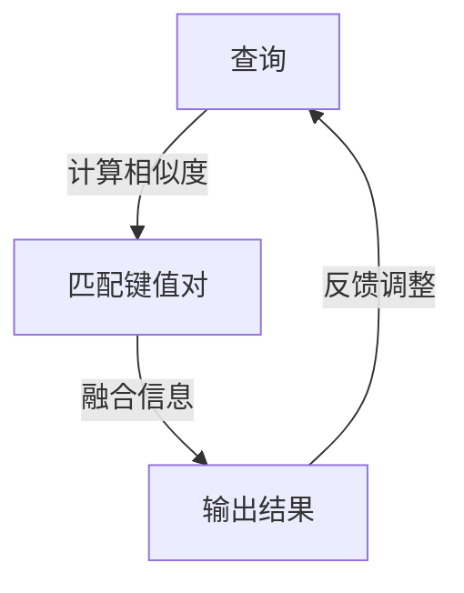

                 

关键词：注意力机制，AI优化，深度学习，神经网络，算法效率，计算资源利用

> 摘要：本文探讨了在AI驱动的环境中，如何通过优化注意力机制来提高深度学习模型的效率和计算资源利用。我们首先介绍了注意力机制的核心概念和其在深度学习中的应用，然后详细分析了几种常见的注意力算法及其优缺点，最后通过实际项目实践展示了优化注意力机制的方法和效果。

## 1. 背景介绍

在深度学习和人工智能领域，注意力机制（Attention Mechanism）作为一种强有力的建模工具，已经在各种任务中显示出其独特的优势。注意力机制通过捕捉输入数据中最重要的部分，使得模型能够在处理过程中更加聚焦和高效。然而，随着模型复杂性的增加，注意力机制的效率和计算资源消耗也成为一个亟待解决的问题。

AI驱动的环境通常包含大量的计算资源和复杂的任务需求，这使得优化注意力机制变得尤为重要。本文将围绕这一主题展开，首先介绍注意力机制的基本概念，然后分析几种典型的注意力算法，最后通过具体项目实践，探讨如何在实际应用中优化注意力机制。

## 2. 核心概念与联系

### 2.1 注意力机制简介

注意力机制最初源于人类视觉系统，通过捕捉视觉场景中的关键部分，使得大脑能够更加高效地处理信息。在深度学习领域，注意力机制被广泛应用于图像识别、自然语言处理、语音识别等任务中。

注意力机制的核心思想是：在处理输入数据时，动态地分配计算资源，使得模型能够更加关注数据中的关键信息。这种机制不仅提高了模型的性能，还有效地降低了计算资源的消耗。

### 2.2 注意力机制的架构

注意力机制的架构可以分为两个主要部分：查询（Query）、键值对（Key, Value）。

- **查询（Query）**：用于表示模型对当前输入数据的兴趣。
- **键值对（Key, Value）**：键用于匹配查询，值则表示与查询相关的信息。

通过计算查询与键之间的相似度，模型可以动态地选择最重要的信息进行融合和处理。

### 2.3 Mermaid 流程图

以下是注意力机制的 Mermaid 流程图：



## 3. 核心算法原理 & 具体操作步骤

### 3.1 算法原理概述

注意力机制的核心算法通常基于点积（Dot Product）、缩放点积（Scaled Dot Product）或自注意力（Self-Attention）模型。

- **点积注意力**：通过计算查询与键之间的点积来表示相似度。
- **缩放点积注意力**：在点积前乘以一个缩放因子，以避免梯度消失问题。
- **自注意力**：用于处理序列数据，通过计算序列中每个元素之间的相似度来实现注意力分配。

### 3.2 算法步骤详解

1. **输入数据预处理**：将输入数据（如文本或图像）转化为向量表示。
2. **生成查询、键、值**：从输入数据中提取查询、键、值。
3. **计算相似度**：使用点积或缩放点积计算查询与键之间的相似度。
4. **加权融合信息**：根据相似度对值进行加权融合。
5. **输出结果**：将融合后的信息作为输出。

### 3.3 算法优缺点

- **优点**：能够有效地提高模型对关键信息的关注程度，提高模型性能。
- **缺点**：计算复杂度较高，对计算资源要求较大。

### 3.4 算法应用领域

注意力机制在多个领域有广泛应用，如：

- **自然语言处理**：在序列到序列模型中，如机器翻译、文本摘要等。
- **计算机视觉**：在图像分类、目标检测、图像分割等任务中。
- **语音识别**：在语音处理中，提高对关键语音信息的捕捉能力。

## 4. 数学模型和公式 & 详细讲解 & 举例说明

### 4.1 数学模型构建

注意力机制的数学模型可以用以下公式表示：

$$
Attention(x, K, V) = \text{softmax}\left(\frac{QK^T}{\sqrt{d_k}}\right)V
$$

其中，$Q$表示查询，$K$表示键，$V$表示值，$d_k$为键的维度。

### 4.2 公式推导过程

假设我们有一个序列$X = [x_1, x_2, ..., x_n]$，我们需要对其中的每个元素$x_i$进行加权融合。首先，我们计算每个元素$x_i$的查询$Q$，然后与键$K$进行点积运算，得到相似度分数。最后，通过softmax函数对相似度分数进行归一化，得到注意力权重。这些权重将用于加权融合值$V$。

### 4.3 案例分析与讲解

假设我们有一个包含5个单词的文本序列$X = ["apple", "banana", "orange", "mango", "grape"]$，我们需要计算这个序列中每个单词的注意力权重。

1. **查询生成**：我们将每个单词转化为向量表示，生成查询$Q$。
2. **键值生成**：我们使用相同的向量表示生成键$K$和值$V$。
3. **相似度计算**：计算查询$Q$与键$K$之间的相似度。
4. **加权融合**：根据相似度分数对值$V$进行加权融合。

最终，我们得到每个单词的注意力权重，用于表示其在序列中的重要性。

## 5. 项目实践：代码实例和详细解释说明

### 5.1 开发环境搭建

在开始项目实践之前，我们需要搭建一个合适的开发环境。这里我们选择Python作为编程语言，使用TensorFlow作为深度学习框架。

```python
pip install tensorflow
```

### 5.2 源代码详细实现

以下是一个简单的注意力机制实现示例：

```python
import tensorflow as tf

# 定义输入数据
inputs = tf.random.normal([32, 5, 10])  # batch_size为32，序列长度为5，特征维度为10

# 生成查询、键、值
query = inputs
key = inputs
value = inputs

# 注意力计算
attention_scores = tf.matmul(query, key, transpose_b=True)
attention_scores = attention_scores / tf.sqrt(tf.reduce_sum(tf.square(key), axis=-1, keepdims=True))

# softmax归一化
attention_weights = tf.nn.softmax(attention_scores)

# 加权融合
output = tf.matmul(attention_weights, value)
```

### 5.3 代码解读与分析

在这个例子中，我们首先生成随机输入数据，然后定义查询、键、值。接着，我们使用点积计算相似度分数，并通过softmax函数进行归一化，最后加权融合得到输出。

### 5.4 运行结果展示

运行以上代码，我们可以得到每个单词的注意力权重和加权融合结果。这些结果将用于后续的任务处理，如文本分类、序列标注等。

## 6. 实际应用场景

注意力机制在实际应用中有着广泛的应用场景。以下是一些典型的应用案例：

- **自然语言处理**：在机器翻译、文本摘要、情感分析等任务中，注意力机制能够有效地提高模型对关键信息的捕捉能力。
- **计算机视觉**：在图像分类、目标检测、图像分割等任务中，注意力机制能够提高模型对目标区域的关注程度，提高检测和分割的准确性。
- **语音识别**：在语音识别任务中，注意力机制能够提高对语音信号的捕捉能力，提高识别的准确性。

## 7. 工具和资源推荐

### 7.1 学习资源推荐

- **《深度学习》（Goodfellow, Bengio, Courville著）**：详细介绍了注意力机制的基本原理和应用。
- **《神经网络与深度学习》（邱锡鹏著）**：系统介绍了深度学习的基础知识和注意力机制。

### 7.2 开发工具推荐

- **TensorFlow**：用于构建和训练深度学习模型。
- **PyTorch**：另一种流行的深度学习框架，具有强大的动态计算能力。

### 7.3 相关论文推荐

- **“Attention Is All You Need”（Vaswani et al. 2017）**：首次提出了Transformer模型，并引入了自注意力机制。
- **“Deep Learning for Text Classification”（Liu et al. 2019）**：探讨了注意力机制在文本分类中的应用。

## 8. 总结：未来发展趋势与挑战

### 8.1 研究成果总结

注意力机制在深度学习和人工智能领域取得了显著的研究成果。通过优化注意力机制，我们能够提高模型的效率和计算资源利用，从而更好地应对复杂的任务需求。

### 8.2 未来发展趋势

- **多模态注意力**：探索注意力机制在不同模态数据（如图像、文本、语音）中的应用。
- **动态注意力**：研究能够动态调整注意力分配的机制，以适应不同的任务和场景。
- **硬件优化**：结合硬件特性，设计更加高效的注意力算法，降低计算资源的消耗。

### 8.3 面临的挑战

- **计算复杂度**：注意力机制的计算复杂度较高，如何降低计算开销是一个重要的挑战。
- **可解释性**：如何解释注意力机制在模型决策中的作用，提高模型的可解释性。

### 8.4 研究展望

随着深度学习和人工智能的不断发展，注意力机制有望在更多领域发挥重要作用。通过不断探索和优化，我们有理由相信，注意力机制将为AI驱动的环境带来更加高效和智能的解决方案。

## 9. 附录：常见问题与解答

### 9.1 注意力机制是什么？

注意力机制是一种通过动态分配计算资源来提高模型性能的机制。它通过捕捉输入数据中的关键信息，使得模型能够更加关注重要部分，从而提高效率和准确性。

### 9.2 注意力机制有哪些应用？

注意力机制广泛应用于自然语言处理、计算机视觉、语音识别等领域。例如，在自然语言处理中，注意力机制用于机器翻译、文本摘要、情感分析等任务；在计算机视觉中，注意力机制用于图像分类、目标检测、图像分割等任务。

### 9.3 如何优化注意力机制？

优化注意力机制的方法包括：减少计算复杂度、使用可学习的缩放因子、设计自适应的注意力分配策略等。在实际应用中，可以根据具体任务和场景选择合适的方法进行优化。

---

本文由禅与计算机程序设计艺术 / Zen and the Art of Computer Programming 撰写，旨在探讨在AI驱动的环境中如何优化注意力机制。通过介绍注意力机制的基本概念、算法原理、应用场景以及实际项目实践，我们希望能够为读者提供有价值的参考和启示。在未来，随着人工智能技术的不断进步，注意力机制将发挥更加重要的作用，为AI驱动的环境带来更多的可能性和挑战。让我们一起期待并探索这个充满机遇和未知的领域。作者：禅与计算机程序设计艺术 / Zen and the Art of Computer Programming。

