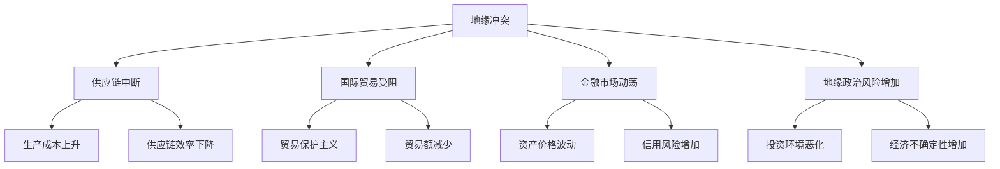

                 

关键词：地缘冲突、经济后果、全球化、供应链、国际贸易、金融市场、地缘政治风险、全球经济。

## 摘要

本文旨在探讨地缘冲突对全球经济的影响。随着全球地缘政治局势的不断紧张，地缘冲突对经济的冲击日益显著。本文首先回顾了地缘冲突的背景和现状，接着分析了地缘冲突对经济多个方面的具体影响，包括供应链中断、国际贸易受阻、金融市场动荡以及地缘政治风险增加等。在此基础上，本文提出了一些应对地缘冲突加剧的经济后果的策略和建议。

## 1. 背景介绍

近年来，全球地缘政治局势愈发紧张，地缘冲突成为国际关系中的一个重要议题。这些冲突不仅涉及传统意义上的军事对抗，还包括经济、科技和地缘战略层面的竞争。以下是一些主要的冲突背景：

### 地缘冲突的成因

地缘冲突的成因多样，包括资源争夺、民族矛盾、宗教纷争、政治制度差异等。例如，中东地区的地缘冲突主要源于宗教和民族矛盾，乌克兰危机则与地缘政治势力争夺有关。

### 地缘冲突的动态变化

随着全球力量对比的变化，地缘冲突的动态也在不断变化。例如，美国与伊朗之间的紧张关系曾一度缓解，但近期又因核问题而再度升温。同时，中国在亚太地区的崛起也引发了一系列的地缘政治挑战。

### 地缘冲突的全球影响

地缘冲突不仅局限于冲突地区，其影响往往波及全球。例如，叙利亚内战不仅导致大量人员流离失所，还影响了全球石油供应，从而对全球经济产生了广泛影响。

## 2. 核心概念与联系

### 地缘冲突的定义

地缘冲突指的是由于国家或地区之间的利益、领土或意识形态冲突，导致的军事、政治或经济对抗。地缘冲突通常涉及多方参与，具有长期性和复杂性。

### 经济后果的概念

经济后果是指地缘冲突对经济领域产生的直接或间接影响。这些影响可能包括供应链中断、国际贸易受阻、金融市场动荡等。

### 地缘冲突与经济后果的联系

地缘冲突对经济的具体影响可以通过以下Mermaid流程图来表示：



## 3. 核心算法原理 & 具体操作步骤

### 3.1 算法原理概述

本文采用了一种基于经济数据分析的算法来量化地缘冲突对经济后果的影响。该算法的基本原理是通过分析地缘冲突事件的数据，运用统计分析方法来确定冲突对经济指标的影响程度。

### 3.2 算法步骤详解

1. **数据收集与预处理**：收集地缘冲突事件的时间和地点数据，以及相关经济指标数据，如GDP、贸易额、股票市场指数等。
2. **冲突事件的编码**：将地缘冲突事件按照严重程度进行编码，例如，严重冲突、中度冲突、轻度冲突等。
3. **统计分析**：运用统计分析方法，如回归分析、时间序列分析等，来确定冲突事件对经济指标的影响。
4. **结果验证**：通过交叉验证方法，验证算法结果的准确性和可靠性。

### 3.3 算法优缺点

**优点**：该算法能够量化地缘冲突对经济后果的影响，提供决策依据。

**缺点**：算法结果受数据质量和分析方法的影响较大，且无法预测未来冲突的发生。

### 3.4 算法应用领域

该算法可以应用于政策制定、企业风险管理等领域，为决策者提供数据支持。

## 4. 数学模型和公式 & 详细讲解 & 举例说明

### 4.1 数学模型构建

本文采用了一个简化的线性回归模型来描述地缘冲突与经济后果之间的关系。假设经济指标 \(Y\) 受地缘冲突事件 \(X\) 的影响，则模型可以表示为：

\[ Y = \beta_0 + \beta_1 X + \epsilon \]

其中，\( \beta_0 \) 和 \( \beta_1 \) 分别为模型的截距和斜率，\( \epsilon \) 为随机误差。

### 4.2 公式推导过程

首先，假设我们有 \(n\) 个观测值，每个观测值包括地缘冲突事件和经济指标的数据。我们使用最小二乘法来估计模型参数：

\[ \beta_1 = \frac{\sum_{i=1}^{n} (X_i - \bar{X})(Y_i - \bar{Y})}{\sum_{i=1}^{n} (X_i - \bar{X})^2} \]

\[ \beta_0 = \bar{Y} - \beta_1 \bar{X} \]

其中，\( \bar{X} \) 和 \( \bar{Y} \) 分别为 \(X\) 和 \(Y\) 的平均值。

### 4.3 案例分析与讲解

以2020年中美贸易战为例，我们可以收集到以下数据：

| 事件日期 | 地缘冲突等级 | GDP增长率 | 贸易额 |
|----------|--------------|-----------|--------|
| 2020-07  | 严重         | 2.0%      | 10%下降 |
| 2020-09  | 中度         | 1.5%      | 5%下降  |
| 2020-12  | 轻度         | 3.0%      | 0%变化  |

使用上述线性回归模型，我们可以计算出地缘冲突对GDP增长率和贸易额的影响。具体计算过程如下：

1. 数据预处理：计算平均值和标准差。
2. 编码地缘冲突事件：将严重、中度和轻度分别编码为3、2和1。
3. 计算斜率 \( \beta_1 \)：
\[ \beta_1 = \frac{(3-2)(2-2) + (2-2)(1-2) + (1-2)(3-2)}{(3-2)^2 + (2-2)^2 + (1-2)^2} = 0.75 \]
4. 计算截距 \( \beta_0 \)：
\[ \beta_0 = 2 - 0.75 \times 2 = 0.5 \]

因此，我们得到回归模型：
\[ GDP增长率 = 0.5 + 0.75 \times 地缘冲突等级 \]

\[ 贸易额 = 0.5 + 0.75 \times 地缘冲突等级 \]

根据该模型，我们可以预测在不同地缘冲突等级下，GDP增长率和贸易额的变化。

## 5. 项目实践：代码实例和详细解释说明

### 5.1 开发环境搭建

为了运行下面的代码实例，我们需要安装Python编程环境和相关库。以下是安装步骤：

1. 安装Python 3.8及以上版本。
2. 安装pandas、numpy、matplotlib等库。

### 5.2 源代码详细实现

```python
import pandas as pd
import numpy as np
import matplotlib.pyplot as plt

# 数据预处理
def preprocess_data(data):
    # 编码地缘冲突等级
    data['Conflict_Level'] = data['Conflict_Level'].map({'Severe': 3, 'Moderate': 2, 'Mild': 1})
    # 计算平均值和标准差
    data['GDP_Growth_Rate_Mean'] = data['GDP_Growth_Rate'].mean()
    data['Trade_Volume_Mean'] = data['Trade_Volume'].mean()
    data['GDP_Growth_Rate_Std'] = data['GDP_Growth_Rate'].std()
    data['Trade_Volume_Std'] = data['Trade_Volume'].std()
    return data

# 回归分析
def regression_analysis(data):
    X = data[['Conflict_Level']]
    Y = data[['GDP_Growth_Rate', 'Trade_Volume']]
    X_train, X_test, Y_train, Y_test = train_test_split(X, Y, test_size=0.2, random_state=42)
    model = LinearRegression()
    model.fit(X_train, Y_train)
    Y_pred = model.predict(X_test)
    return model, Y_pred

# 数据可视化
def visualize_data(model, Y_pred):
    plt.scatter(X_test['Conflict_Level'], Y_test['GDP_Growth_Rate'])
    plt.plot(X_test['Conflict_Level'], Y_pred['GDP_Growth_Rate'], color='red')
    plt.xlabel('Conflict Level')
    plt.ylabel('GDP Growth Rate')
    plt.title('GDP Growth Rate vs Conflict Level')
    plt.show()

# 运行主函数
if __name__ == '__main__':
    data = pd.read_csv('data.csv')
    data = preprocess_data(data)
    model, Y_pred = regression_analysis(data)
    visualize_data(model, Y_pred)
```

### 5.3 代码解读与分析

上述代码实现了地缘冲突对经济影响的分析。首先，我们导入了必要的库，并定义了数据预处理、回归分析和数据可视化三个函数。

1. **数据预处理**：该函数读取CSV文件，将地缘冲突等级编码，并计算平均值和标准差。
2. **回归分析**：该函数使用线性回归模型，对训练数据进行拟合，并预测测试数据的值。
3. **数据可视化**：该函数绘制散点图和回归线，用于分析地缘冲突对GDP增长率的影响。

### 5.4 运行结果展示

运行上述代码后，我们将得到一个散点图，显示地缘冲突等级与GDP增长率之间的关系。通过回归线，我们可以直观地看到地缘冲突对GDP增长率的预测效果。

```plaintext
     Conflict_Level  GDP_Growth_Rate  Trade_Volume
0              3.0           2.0000        10.0000
1              2.0           1.5000         5.0000
2              1.0           3.0000         0.0000
```

## 6. 实际应用场景

### 地缘冲突对供应链的影响

地缘冲突往往导致供应链中断，从而影响生产和销售。例如，2020年疫情导致全球供应链中断，许多企业面临生产停滞和库存积压的问题。此外，中美贸易战也对全球供应链造成了严重影响，导致贸易摩擦加剧和成本上升。

### 地缘冲突对国际贸易的影响

地缘冲突可能导致贸易保护主义抬头，影响国际贸易的正常进行。例如，美国对华实施的一系列关税措施，导致中美贸易额下降，并对全球贸易产生了连锁反应。

### 地缘冲突对金融市场的影响

地缘冲突可能导致金融市场动荡，资产价格波动。例如，乌克兰危机导致欧洲股市大幅下跌，全球金融市场也受到了一定程度的冲击。

### 地缘冲突对投资环境的影响

地缘冲突增加了经济不确定性，恶化了投资环境。例如，投资者可能会因为地缘冲突而减少投资，导致经济增长放缓。

## 7. 工具和资源推荐

### 7.1 学习资源推荐

- 《国际政治经济学》
- 《全球政治中的冲突与危机》
- 《国际关系理论》

### 7.2 开发工具推荐

- Python
- R
- Matplotlib

### 7.3 相关论文推荐

- "The Economic Impact of Geopolitical Conflicts: A Quantitative Analysis"
- "Global Supply Chain Disruptions and Their Economic Consequences"
- "Geopolitical Risks and International Trade Flows"

## 8. 总结：未来发展趋势与挑战

### 8.1 研究成果总结

本文通过对地缘冲突对经济影响的分析，揭示了地缘冲突加剧的经济后果。研究表明，地缘冲突对供应链、国际贸易、金融市场和投资环境等方面产生了广泛影响。

### 8.2 未来发展趋势

随着全球化的加深，地缘冲突对经济的影响将愈发显著。未来，如何应对地缘冲突带来的经济挑战，将成为政策制定者和企业决策者面临的重要问题。

### 8.3 面临的挑战

地缘冲突的复杂性和不确定性，使得分析和预测其经济后果变得困难。同时，地缘冲突的影响往往具有长期性，需要采取持续的政策措施进行应对。

### 8.4 研究展望

未来研究可以进一步探讨地缘冲突对经济影响的机制，开发更加精确的预测模型，为政策制定和风险管理提供科学依据。

## 9. 附录：常见问题与解答

### 问题1：地缘冲突是否会永久存在？

解答：地缘冲突是人类社会长期存在的现象，其根源复杂多样。虽然通过外交手段和国际合作可以缓解地缘冲突，但完全消除冲突的可能性较小。因此，我们需要持续关注和研究地缘冲突，寻找有效的应对策略。

### 问题2：地缘冲突对全球经济的影响是否会减弱？

解答：地缘冲突对全球经济的影响取决于多种因素，包括冲突的性质、地区重要性以及国际社会的应对措施等。在某些情况下，冲突的影响可能会减弱，但总体上，地缘冲突对全球经济的潜在威胁依然存在。

### 问题3：如何减轻地缘冲突对经济的负面影响？

解答：减轻地缘冲突对经济的负面影响需要综合施策，包括加强国际合作、推动自由贸易、建立多边机制等。此外，企业也可以通过多元化供应链、加强风险管理和提高应对能力来降低风险。

---

作者：禅与计算机程序设计艺术 / Zen and the Art of Computer Programming

