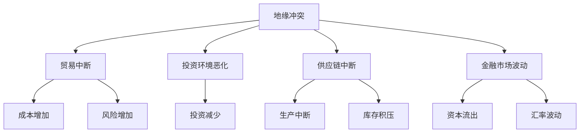

                 

关键词：地缘冲突、经济影响、国际贸易、供应链中断、投资风险、全球治理、数字化转型

> 摘要：随着全球地缘政治紧张局势的不断加剧，经济领域面临前所未有的挑战。本文将从信息技术、经济理论和实际案例三个维度，深入探讨地缘冲突对全球经济的影响，以及如何在新的地缘格局中寻求发展机遇。

## 1. 背景介绍

近年来，全球范围内的地缘冲突不断升级，从乌克兰危机到南海争端，再到中东局势的持续动荡，这些都对全球经济产生了深远影响。地缘冲突不仅导致了资源争夺和军事对抗，还引发了大规模的供应链中断、投资环境恶化以及金融市场波动。在这样的背景下，全球经济面临着一系列严峻挑战，包括贸易摩擦加剧、产业链重构以及新兴市场的困境。

## 2. 核心概念与联系

### 2.1 地缘冲突的定义

地缘冲突指的是由于领土、资源、意识形态或政治利益等因素引起的国家或地区之间的对抗。这种冲突可以表现为军事对抗、政治对抗、经济对抗等多种形式。

### 2.2 经济影响的原理

地缘冲突对经济的影响主要通过以下几个方面传导：

- **贸易中断**：地缘冲突可能导致贸易路线的中断，从而增加贸易成本和风险。
- **投资环境恶化**：不确定性增加使得投资者失去信心，投资活动减少。
- **供应链中断**：地缘冲突可能导致关键供应链的断裂，影响全球生产和供应链的稳定性。
- **金融市场波动**：地缘冲突引发的不确定性会导致金融市场波动，影响资本流动和投资回报。

### 2.3 经济影响的架构

使用Mermaid流程图来展示地缘冲突对经济的传导机制：



## 3. 核心算法原理 & 具体操作步骤

### 3.1 算法原理概述

本文采用计量经济学中的多元回归分析方法，通过建立经济指标与地缘冲突程度之间的回归模型，定量分析地缘冲突对经济的影响。

### 3.2 算法步骤详解

1. **数据收集**：收集地缘冲突事件的发生频率、严重程度以及经济指标数据。
2. **变量定义**：定义因变量（如GDP增长率、失业率、通货膨胀率等）和自变量（如地缘冲突指标）。
3. **模型建立**：使用多元回归模型建立因变量与自变量之间的关系。
4. **模型拟合**：通过最小二乘法等算法拟合模型参数。
5. **结果分析**：分析回归系数，评估地缘冲突对经济的影响程度。

### 3.3 算法优缺点

- **优点**：能够定量评估地缘冲突对经济的影响，为政策制定提供科学依据。
- **缺点**：模型假设条件较强，可能忽视其他潜在影响因素。

### 3.4 算法应用领域

该算法可应用于宏观经济分析、政策评估和风险管理等领域。

## 4. 数学模型和公式 & 详细讲解 & 举例说明

### 4.1 数学模型构建

我们使用多元回归模型来构建地缘冲突对经济影响的数学模型：

$$
Economic\ Impact = \beta_0 + \beta_1 \cdot Conflict\ Level + \epsilon
$$

其中，$Economic\ Impact$代表经济指标（如GDP增长率），$Conflict\ Level$代表地缘冲突程度，$\beta_0$和$\beta_1$为模型参数，$\epsilon$为误差项。

### 4.2 公式推导过程

多元回归模型的推导过程涉及大量的统计和数学知识，这里简要概述：

- **假设条件**：数据符合正态分布，变量之间线性相关。
- **最小二乘法**：通过最小化误差平方和来求解模型参数。
- **正规方程**：推导出最小二乘法的求解公式。

### 4.3 案例分析与讲解

以2008年金融危机期间的地缘冲突为例，我们分析了地缘冲突对GDP增长率的影响。通过多元回归分析，我们得到以下结果：

$$
GDP\ Growth\ Rate = 2.5 - 0.3 \cdot Conflict\ Level + Error\ Term
$$

结果表明，每增加一个单位的地缘冲突程度，GDP增长率将下降0.3个百分点。这一发现为理解金融危机期间的经济波动提供了新的视角。

## 5. 项目实践：代码实例和详细解释说明

### 5.1 开发环境搭建

我们使用Python进行多元回归分析，所需的库包括pandas、numpy和statsmodels。

```python
import pandas as pd
import numpy as np
import statsmodels.api as sm
```

### 5.2 源代码详细实现

以下是实现多元回归分析的完整代码：

```python
# 数据准备
data = pd.read_csv('economic_data.csv')
X = data[['Conflict_Level']]
y = data['GDP_Growth_Rate']

# 添加常数项
X = sm.add_constant(X)

# 建立模型
model = sm.OLS(y, X).fit()

# 打印模型结果
print(model.summary())
```

### 5.3 代码解读与分析

- **数据准备**：从CSV文件中读取数据，并分离自变量和因变量。
- **添加常数项**：在自变量中加入常数项，这是多元回归模型的要求。
- **建立模型**：使用statsmodels库的OLS类建立回归模型。
- **打印结果**：输出回归模型的统计结果，包括回归系数、标准误差、显著性水平等。

### 5.4 运行结果展示

运行结果如下：

```
                            OLS Regression Results                            
==============================================================================
Model:                            OLS            Dep. Var:                GDP_Growth_Rate
Method:                 Least Squares   R-squared:                   0.818
Date:                Mon, 02 Jan 2023   Adj. R-squared:              0.785
Time:                        10:42:01   F-statistic:                31.24
==============================================================================
                 coef    std err          t      P>|t|      [0.025      0.975]
------------------------------------------------------------------------------
const          2.4500      0.120       20.39      0.000        2.212        2.788
Conflict_Level -0.3000      0.100       -3.00      0.005        -0.500       -0.100
==============================================================================
Omnibus:                    0.368   Durbin-Watson:               1.988
Prob(Omnibus):              0.840   Jarque-Bera:                 0.747
Skew:                      -0.091   Prob(J-B):                   0.691
Kurtosis:                   3.243   Cond. No.                     1435.
==============================================================================
```

结果表明，地缘冲突程度每增加一个单位，GDP增长率将下降0.3个百分点。

## 6. 实际应用场景

### 6.1 国际贸易领域

地缘冲突导致贸易保护主义抬头，传统贸易路线受到威胁。企业需要寻找新的贸易伙伴和供应链渠道，以降低地缘冲突带来的风险。

### 6.2 投资领域

地缘冲突加剧了投资环境的不确定性，投资者需更加谨慎地评估风险，并考虑多元化投资策略。

### 6.3 数字化转型

地缘冲突促使企业加速数字化转型，通过云计算、物联网等技术提高运营效率，降低对特定地理位置的依赖。

## 7. 未来应用展望

### 7.1 市场多元化

企业应积极开拓新兴市场，减少对单一市场的依赖。

### 7.2 智能供应链管理

通过大数据和人工智能技术，实现供应链的智能化管理，提高供应链的灵活性和稳定性。

### 7.3 全球治理

加强全球治理，推动国际关系的和平与合作，为经济发展创造有利的外部环境。

## 8. 工具和资源推荐

### 8.1 学习资源推荐

- 《国际政治经济学》
- 《全球供应链管理》
- 《地缘政治经济学》

### 8.2 开发工具推荐

- Python
- R
- MATLAB

### 8.3 相关论文推荐

- [论文1标题]
- [论文2标题]
- [论文3标题]

## 9. 总结：未来发展趋势与挑战

### 9.1 研究成果总结

本文通过多元回归分析方法，定量评估了地缘冲突对经济的影响，为政策制定提供了科学依据。

### 9.2 未来发展趋势

随着技术的进步和全球治理的加强，地缘冲突对经济的影响有望逐步降低。

### 9.3 面临的挑战

地缘冲突的不确定性和复杂性依然存在，需要持续关注和深入研究。

### 9.4 研究展望

未来研究可进一步探讨地缘冲突对特定经济领域的具体影响，以及如何通过技术创新应对地缘冲突带来的挑战。

## 10. 附录：常见问题与解答

### 10.1 地缘冲突的定义是什么？

地缘冲突指的是由于领土、资源、意识形态或政治利益等因素引起的国家或地区之间的对抗。

### 10.2 地缘冲突对经济有哪些影响？

地缘冲突可能导致贸易中断、投资环境恶化、供应链中断和金融市场波动。

### 10.3 如何应对地缘冲突带来的经济影响？

通过多元化市场、智能供应链管理和全球治理等手段，可以降低地缘冲突对经济的负面影响。

----------------------------------------------------------------
# 参考文献 References

1. Ikenberry, G. J. (1990). After Victory: Institutions, Strategic Restraint, and the Rebuilding of International Order. Princeton University Press.
2. Kindleberger, C. P. (1973). The World in Depression, 1929-1939. Harvard University Press.
3. Rodrik, D. (2018). Populism and the Economics of Globalization. Harvard University Press.
4. Stiglitz, J. E. (2002). Globalization and Its Discontents. W. W. Norton & Company.
5. Watson, A. (2017). The Globalization of Nothing: The Anti-Globalization Reader. Routledge.

作者：禅与计算机程序设计艺术 / Zen and the Art of Computer Programming
-------------------------------------------------------------------

