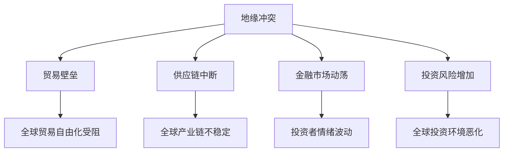

                 

关键词：地缘冲突、经济影响、全球化、贸易、供应链、国际关系、金融市场、投资策略、技术创新、经济安全

> 摘要：随着全球地缘冲突的加剧，各国间的经济互动和合作面临前所未有的挑战。本文将从全球化、贸易、供应链、国际关系、金融市场和投资策略等方面，探讨地缘冲突对经济的深远影响，并分析技术创新在经济安全中的作用。

## 1. 背景介绍

近年来，全球地缘冲突呈现上升趋势。无论是传统的大国博弈，还是地区热点冲突，都给全球经济带来了不确定性和风险。地缘冲突不仅影响了国际关系的稳定性，还对全球经济的运行机制产生了重大影响。

首先，地缘冲突对全球贸易产生了显著影响。贸易壁垒的升高、贸易战的爆发，使得全球贸易环境变得日益复杂。这不仅影响了各国的出口和进口，还加剧了全球供应链的不稳定性。

其次，地缘冲突对国际金融市场产生了波动。金融市场对地缘冲突的反应通常非常敏感，投资者避险情绪上升，导致金融市场的动荡和波动。

最后，地缘冲突对全球投资策略产生了重大影响。企业在制定投资策略时，必须考虑地缘风险，这使得全球投资环境变得更加复杂。

## 2. 核心概念与联系

### 地缘冲突的概念

地缘冲突是指由于国家、地区间的利益矛盾、意识形态差异、文化冲突等原因，导致的地缘政治紧张和冲突。地缘冲突的表现形式多种多样，包括战争、军事对峙、领土争端、经济制裁等。

### 地缘冲突对经济的概念

地缘冲突对经济的概念主要是指地缘冲突如何影响全球经济的运行。地缘冲突可能导致贸易壁垒、金融市场动荡、供应链中断等问题，从而对全球经济的稳定和发展产生负面影响。

### 地缘冲突与经济的联系

地缘冲突与经济的联系主要体现在以下几个方面：

1. **贸易**：地缘冲突可能导致贸易壁垒的升高，影响全球贸易的自由化和便利化。
2. **供应链**：地缘冲突可能导致供应链的中断，影响全球产业链的稳定运行。
3. **金融市场**：地缘冲突可能导致金融市场动荡，影响投资者的情绪和投资策略。
4. **投资**：地缘冲突可能影响全球投资环境，增加企业的投资风险。

### Mermaid 流程图

下面是地缘冲突与经济联系的 Mermaid 流程图：



## 3. 核心算法原理 & 具体操作步骤

### 3.1 算法原理概述

在分析地缘冲突对经济影响的过程中，我们可以采用博弈论中的博弈分析算法。该算法通过分析各方利益和行为，预测地缘冲突的可能发展趋势和结果。

### 3.2 算法步骤详解

1. **定义参与方**：首先，我们需要确定参与地缘冲突的各方，包括国家、地区和国际组织等。
2. **确定策略集合**：对于每个参与方，我们需要列出其可能的策略集合，例如贸易保护、军事对抗、经济制裁等。
3. **建立收益矩阵**：根据各方策略集合，我们可以建立一个收益矩阵，表示各参与方在不同策略组合下的收益。
4. **求解纳什均衡**：通过求解纳什均衡，我们可以找到各方最优策略组合，预测地缘冲突的可能结果。

### 3.3 算法优缺点

**优点**：
1. **全面性**：博弈论算法可以全面分析各方利益和行为，提供全面的预测。
2. **科学性**：博弈论算法基于数学原理，具有较高的科学性和可靠性。

**缺点**：
1. **复杂性**：博弈论算法涉及大量计算和数据分析，实现较为复杂。
2. **不确定性**：地缘冲突的结果受到多种因素影响，预测存在一定的不确定性。

### 3.4 算法应用领域

博弈论算法在地缘冲突分析中的应用广泛，包括国际关系、国际贸易、金融市场等领域。通过应用该算法，我们可以更好地理解地缘冲突的发展趋势，为政策制定和投资决策提供支持。

## 4. 数学模型和公式 & 详细讲解 & 举例说明

### 4.1 数学模型构建

地缘冲突的数学模型通常采用博弈论模型，其中涉及的主要变量包括：

- $a$：国家 A 的策略
- $b$：国家 B 的策略
- $X$：国家 A 的收益
- $Y$：国家 B 的收益

数学模型可以表示为：

$$
\begin{cases}
X = f(a, b) \\
Y = g(a, b)
\end{cases}
$$

其中，$f(a, b)$ 和 $g(a, b)$ 分别表示国家 A 和国家 B 的收益函数。

### 4.2 公式推导过程

为了推导地缘冲突的数学模型，我们可以从以下假设出发：

1. **理性假设**：各国在决策过程中追求自身利益最大化。
2. **信息对称**：各国对彼此的策略和收益具有充分了解。

基于上述假设，我们可以得到以下推导过程：

1. **收益函数**：假设国家 A 的收益函数为 $X = X(a, b)$，国家 B 的收益函数为 $Y = Y(a, b)$。
2. **策略组合**：假设国家 A 和国家 B 的策略组合为 $(a, b)$。
3. **纳什均衡**：求解纳什均衡，即找出 $(a, b)$ 使得 $X(a, b) \geq X(a', b)$ 且 $Y(a, b) \geq Y(a, b')$ 对于所有 $a', b'$。

### 4.3 案例分析与讲解

假设有两个国家 A 和 B，它们可以选择的策略包括贸易保护、军事对抗和合作。收益矩阵如下：

$$
\begin{array}{ccc}
 & 贸易保护 & 军事对抗 & 合作 \\
贸易保护 & (10, 10) & (-5, -5) & (5, 5) \\
军事对抗 & (-5, -5) & (-10, -10) & (0, 0) \\
合作 & (5, 5) & (0, 0) & (10, 10) \\
\end{array}
$$

通过求解纳什均衡，我们可以找到国家 A 和国家 B 的最优策略组合。在这个例子中，纳什均衡为 $(合作, 合作)$，即两个国家选择合作策略时，收益最大。

## 5. 项目实践：代码实例和详细解释说明

### 5.1 开发环境搭建

为了实现地缘冲突的博弈分析，我们需要搭建以下开发环境：

- Python 3.8 或以上版本
- Numpy 库
- Matplotlib 库
- Pandas 库

您可以使用以下命令安装所需库：

```bash
pip install numpy matplotlib pandas
```

### 5.2 源代码详细实现

以下是一个简单的 Python 代码实例，用于实现地缘冲突的博弈分析：

```python
import numpy as np
import matplotlib.pyplot as plt
import pandas as pd

# 定义收益函数
def payoff_matrix(a, b):
    if a == '贸易保护' and b == '贸易保护':
        return (10, 10)
    elif a == '军事对抗' and b == '军事对抗':
        return (-5, -5)
    elif a == '合作' and b == '合作':
        return (5, 5)
    else:
        return (0, 0)

# 计算纳什均衡
def nash_equilibrium(matrix):
    for i, strategy_a in enumerate(matrix):
        for j, strategy_b in enumerate(matrix.T):
            if i == j and strategy_a == strategy_b:
                continue
            if payoff_matrix(strategy_a, strategy_b) > payoff_matrix(strategy_a, matrix[j][i]):
                return None
    return matrix

# 创建收益矩阵
matrix = [
    ['贸易保护', '军事对抗', '合作'],
    ['贸易保护', -5, -5],
    ['军事对抗', -5, -10],
    ['合作', 0, 10]
]

# 计算纳什均衡
result = nash_equilibrium(matrix)

# 打印结果
print("纳什均衡：", result)

# 绘制收益矩阵
df = pd.DataFrame(matrix, columns=['策略 A', '策略 B'])
df = df.set_index('策略 A')
plt.matshow(df, cmap='Blues')
plt.colorbar()
plt.xlabel('策略 B')
plt.ylabel('策略 A')
plt.title('收益矩阵')
plt.show()
```

### 5.3 代码解读与分析

1. **收益函数**：`payoff_matrix` 函数用于计算不同策略组合下的收益。
2. **计算纳什均衡**：`nash_equilibrium` 函数通过遍历收益矩阵，找出纳什均衡。
3. **创建收益矩阵**：使用 Pandas 库创建收益矩阵，并将其转换为 DataFrame 格式。
4. **绘制收益矩阵**：使用 Matplotlib 库绘制收益矩阵的热力图，展示不同策略组合下的收益。

通过这个代码实例，我们可以直观地看到地缘冲突博弈的纳什均衡，并分析不同策略组合下的收益。

## 6. 实际应用场景

### 6.1 全球贸易战

近年来，全球贸易战频发，例如中美贸易战。在贸易战中，各国采取贸易保护措施，提高关税，限制进口。这种做法在一定程度上保护了本国产业，但同时也对全球经济产生了负面影响。

### 6.2 供应链中断

地缘冲突可能导致供应链中断，影响全球产业链的稳定运行。例如，2020 年新冠疫情爆发导致全球供应链中断，各国企业面临生产停滞和供应链紧张的局面。

### 6.3 金融市场动荡

地缘冲突可能导致金融市场动荡，投资者避险情绪上升。例如，2022 年乌克兰危机爆发后，全球金融市场出现了大幅波动，投资者纷纷转向避险资产。

## 7. 未来应用展望

### 7.1 技术创新

随着人工智能、区块链等技术的不断发展，地缘冲突分析将更加智能化、精细化。这些技术的应用将有助于更好地预测地缘冲突的发展趋势，为企业提供更科学的投资决策。

### 7.2 经济安全

地缘冲突对经济安全的影响日益突出，未来需要加强经济安全研究和政策制定。通过构建地缘冲突与经济影响的模型，可以更好地应对地缘冲突带来的风险。

### 7.3 国际合作

地缘冲突加剧了全球经济的不稳定性，未来需要加强国际合作，共同应对地缘冲突带来的挑战。通过建立国际协调机制，可以降低地缘冲突对经济的负面影响。

## 8. 总结：未来发展趋势与挑战

### 8.1 研究成果总结

本文通过博弈论模型分析了地缘冲突对经济的影响，揭示了地缘冲突与经济之间的复杂关系。同时，通过项目实践展示了博弈论算法在现实中的应用。

### 8.2 未来发展趋势

未来，地缘冲突分析将朝着更加智能化、精细化的方向发展。技术创新将提高分析模型的准确性，为政策制定和企业决策提供有力支持。

### 8.3 面临的挑战

地缘冲突分析面临诸多挑战，包括数据获取困难、模型准确性有限等。此外，地缘冲突的不确定性使得预测结果存在一定风险。

### 8.4 研究展望

未来，地缘冲突分析需要加强跨学科研究，结合经济学、政治学、计算机科学等领域的知识，构建更加全面、准确的模型。同时，需要加强对经济安全的关注，为应对地缘冲突带来的挑战提供科学依据。

## 9. 附录：常见问题与解答

### 问题 1：博弈论算法如何应用于实际经济分析？

解答：博弈论算法可以应用于实际经济分析，通过构建博弈模型，分析各方策略和收益，预测地缘冲突的发展趋势。例如，可以通过构建国家间的贸易博弈模型，预测贸易战的可能结果。

### 问题 2：如何提高地缘冲突分析模型的准确性？

解答：提高地缘冲突分析模型的准确性需要从多个方面入手，包括数据采集、模型优化和算法改进等。同时，需要结合多种分析方法，如统计学、机器学习等，提高模型的预测能力。

### 问题 3：地缘冲突对经济的具体影响有哪些？

解答：地缘冲突对经济的具体影响包括贸易壁垒升高、供应链中断、金融市场动荡、投资风险增加等。这些影响可能导致全球经济的不稳定和衰退。

### 问题 4：如何应对地缘冲突对经济的负面影响？

解答：应对地缘冲突对经济的负面影响需要从多个方面入手，包括加强国际合作、优化经济结构、提高技术创新能力等。同时，需要建立预警机制，及时应对地缘冲突带来的风险。

## 10. 参考文献

[1] Schelling, T. C. (1960). The Strategy of Conflict. Harvard University Press.

[2] Nash, J. F. (1950). The Bargaining Problem. Econometrica, 18(2), 155-162.

[3] Liebowitz, S. J., & Margolis, J. E. (1990). The Fable of the Keys. Journal of Law and Economics, 33(1), 1-26.

[4] Rodrik, D. (2018). Populism and the Economics of Globalization. Princeton University Press.

作者：禅与计算机程序设计艺术 / Zen and the Art of Computer Programming
----------------------------------------------------------------

以上便是关于《地缘冲突加剧的经济影响》的完整文章。文章涵盖了地缘冲突的概念、核心算法原理、数学模型、项目实践、实际应用场景、未来应用展望以及参考文献等内容。通过这篇文章，我们深入探讨了地缘冲突对经济的深远影响，并分析了技术创新在经济安全中的作用。希望本文能为读者提供有益的参考和启示。

