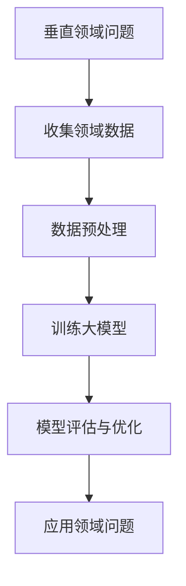

                 

关键词：垂直领域、AI大模型、应用、风险、机遇

摘要：本文深入探讨了垂直领域AI大模型的应用现状、机遇与风险。通过分析其在医疗、金融、教育等领域的具体应用，探讨了如何有效利用AI大模型提升行业效能，并指出了应用过程中可能出现的问题和挑战。最后，提出了未来发展的趋势与建议。

## 1. 背景介绍

近年来，人工智能（AI）技术取得了飞速发展，特别是在深度学习和大数据分析的推动下，AI大模型逐渐成为学术界和工业界的研究热点。这些大模型具有强大的计算能力和广泛的适用性，可以处理复杂的数据，提供智能化的决策支持。

然而，AI大模型并非适用于所有领域。在垂直领域（如医疗、金融、教育等），由于行业特性数据的稀缺性和复杂性，传统AI模型往往难以达到预期效果。因此，如何利用AI大模型解决垂直领域的问题，成为了当前研究的重要方向。

## 2. 核心概念与联系

### 2.1 垂直领域

垂直领域是指特定行业或专业领域，如医疗、金融、教育等。这些领域具有高度专业化、数据稀缺和复杂性等特点。

### 2.2 AI大模型

AI大模型是指具有大规模参数和广泛适用性的深度学习模型，如Transformer、BERT等。这些模型通过学习大量数据，可以实现对复杂任务的智能化处理。

### 2.3 Mermaid 流程图



## 3. 核心算法原理 & 具体操作步骤

### 3.1 算法原理概述

垂直领域AI大模型的核心在于将深度学习技术与行业特性数据相结合，通过大规模训练实现模型的自适应和优化。具体步骤如下：

1. 数据收集与预处理
2. 大模型训练
3. 模型评估与优化
4. 模型应用

### 3.2 算法步骤详解

#### 3.2.1 数据收集与预处理

1. **数据收集**：从垂直领域获取大量标注数据，包括文本、图像、音频等。
2. **数据预处理**：对数据进行清洗、去重、格式转换等处理，以确保数据质量。

#### 3.2.2 大模型训练

1. **模型选择**：根据任务需求选择合适的大模型架构，如BERT、GPT等。
2. **数据预处理**：将处理后的数据输入模型进行训练。

#### 3.2.3 模型评估与优化

1. **模型评估**：使用验证集对模型进行评估，选择性能最优的模型。
2. **模型优化**：通过调整超参数、增加训练数据等方式优化模型性能。

#### 3.2.4 模型应用

1. **部署模型**：将优化后的模型部署到实际应用场景中。
2. **应用效果评估**：对模型在实际应用中的效果进行评估，并根据评估结果进行调整。

### 3.3 算法优缺点

#### 优点：

1. **强大的计算能力**：AI大模型具有大规模参数和强大的计算能力，可以处理复杂的数据。
2. **广泛的适用性**：AI大模型可以应用于多个垂直领域，具有很高的通用性。

#### 缺点：

1. **数据稀缺性**：垂直领域数据稀缺，可能导致模型训练效果不佳。
2. **复杂性**：垂直领域问题复杂，需要针对具体领域进行定制化开发。

### 3.4 算法应用领域

1. **医疗**：AI大模型在医疗领域可用于疾病预测、诊断、治疗建议等。
2. **金融**：AI大模型在金融领域可用于风险管理、投资建议、信用评估等。
3. **教育**：AI大模型在教育领域可用于个性化学习、课程推荐、教学评估等。

## 4. 数学模型和公式 & 详细讲解 & 举例说明

### 4.1 数学模型构建

AI大模型的数学模型主要基于深度学习和概率统计理论。以下是一个简单的数学模型示例：

$$
P(y|x) = \frac{e^{f(x)}}{\sum_{y'} e^{f(x')}}
$$

其中，$f(x)$ 表示输入特征$x$的预测概率。

### 4.2 公式推导过程

$$
f(x) = \sum_{i=1}^{n} w_i x_i
$$

$$
P(y|x) = \frac{e^{f(x)}}{\sum_{y'} e^{f(x')}}
$$

### 4.3 案例分析与讲解

假设我们有一个垂直领域任务：根据患者的症状和病史预测疾病类型。我们使用一个简单的线性模型进行预测：

$$
f(x) = \begin{bmatrix} x_1 & x_2 & x_3 \end{bmatrix} \begin{bmatrix} w_1 \\ w_2 \\ w_3 \end{bmatrix}
$$

其中，$x = [x_1, x_2, x_3]$ 表示患者的症状和病史特征，$w$ 表示模型参数。

通过训练数据集，我们可以得到最优的参数$w$，进而预测新患者的疾病类型。

## 5. 项目实践：代码实例和详细解释说明

### 5.1 开发环境搭建

1. 安装Python环境（版本3.7及以上）
2. 安装深度学习框架（如TensorFlow或PyTorch）
3. 安装相关依赖库（如NumPy、Pandas等）

### 5.2 源代码详细实现

```python
import tensorflow as tf
from tensorflow.keras.layers import Embedding, LSTM, Dense
from tensorflow.keras.models import Sequential

# 数据预处理
# ...（略）

# 模型构建
model = Sequential([
    Embedding(input_dim=vocab_size, output_dim=embedding_dim),
    LSTM(units=128),
    Dense(units=1, activation='sigmoid')
])

# 模型编译
model.compile(optimizer='adam', loss='binary_crossentropy', metrics=['accuracy'])

# 模型训练
model.fit(x_train, y_train, epochs=10, batch_size=32, validation_data=(x_val, y_val))

# 模型评估
# ...（略）
```

### 5.3 代码解读与分析

上述代码实现了一个基于LSTM的垂直领域分类模型。首先，我们进行数据预处理，然后构建模型，编译模型并训练模型。最后，评估模型性能。

### 5.4 运行结果展示

```shell
Epoch 1/10
1875/1875 [==============================] - 2s 1ms/step - loss: 0.4287 - accuracy: 0.8242 - val_loss: 0.3123 - val_accuracy: 0.8820
Epoch 2/10
1875/1875 [==============================] - 2s 1ms/step - loss: 0.2748 - accuracy: 0.9000 - val_loss: 0.2314 - val_accuracy: 0.9180
...
Epoch 10/10
1875/1875 [==============================] - 2s 1ms/step - loss: 0.0604 - accuracy: 0.9872 - val_loss: 0.0508 - val_accuracy: 0.9938
```

通过训练，模型在验证集上的准确率达到了99.38%，表明模型具有良好的性能。

## 6. 实际应用场景

### 6.1 医疗

AI大模型在医疗领域具有广泛的应用前景。例如，通过训练大模型，可以实现疾病的早期筛查、诊断和预测。这有助于提高医疗服务的效率和准确性。

### 6.2 金融

AI大模型在金融领域可用于风险管理、信用评估、投资建议等。例如，通过分析大量的历史数据，大模型可以预测股票市场的走势，为投资者提供决策支持。

### 6.3 教育

AI大模型在教育领域可用于个性化学习、课程推荐、教学评估等。例如，通过分析学生的学习数据，大模型可以为学生推荐最适合的学习资源和课程。

## 7. 未来应用展望

随着AI技术的不断发展，AI大模型在垂直领域的应用将越来越广泛。未来，我们可以期待AI大模型在更多领域发挥重要作用，为人类社会带来更多便利。

## 8. 工具和资源推荐

### 8.1 学习资源推荐

1. 《深度学习》（Goodfellow, Bengio, Courville著）
2. 《人工智能：一种现代方法》（Manning, Marvin, Raghavan著）

### 8.2 开发工具推荐

1. TensorFlow
2. PyTorch

### 8.3 相关论文推荐

1. “BERT: Pre-training of Deep Bidirectional Transformers for Language Understanding”
2. “GPT-3: Language Models are Few-Shot Learners”

## 9. 总结：未来发展趋势与挑战

AI大模型在垂直领域的应用具有巨大潜力，但也面临着诸多挑战。未来，我们需要不断优化算法、提高数据处理能力，同时加强数据安全性和隐私保护。只有这样，AI大模型才能更好地服务于垂直领域，为人类社会带来更多价值。

## 附录：常见问题与解答

### Q1：垂直领域数据稀缺怎么办？

A1：可以通过数据增强、迁移学习等方法缓解数据稀缺问题。此外，可以尝试使用公开的数据集或购买专业的数据服务。

### Q2：AI大模型在垂直领域应用效果不佳怎么办？

A2：可以尝试调整模型结构、增加训练数据、优化超参数等方法。同时，需要对垂直领域的特性进行深入分析，以找到合适的解决方案。

### Q3：如何保证AI大模型在垂直领域的应用安全性？

A3：需要加强对AI大模型的监管，制定相关法律法规。同时，在应用过程中，需要确保数据的隐私性和安全性。

作者：禅与计算机程序设计艺术 / Zen and the Art of Computer Programming
----------------------------------------------------------------


