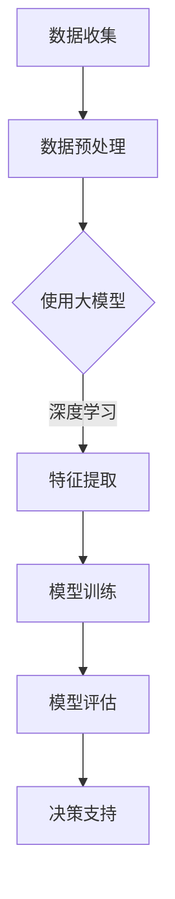

                 

关键词：人工智能，大模型，决策支持系统，智能算法，深度学习，数学模型，实践应用

> 摘要：本文深入探讨基于AI大模型的智能决策支持系统的构建与应用。首先介绍AI大模型的基本概念、发展历程及其在决策支持领域的应用。然后详细解析核心算法原理，探讨数学模型和公式，并通过实际项目实践和代码实例，阐述系统实现过程和效果。最后，分析实际应用场景，展望未来发展趋势和挑战。

## 1. 背景介绍

在信息技术飞速发展的今天，数据已经成为新的生产要素，而如何从海量数据中提取有价值的信息、做出准确的决策成为企业和组织面临的重大挑战。传统的方法由于计算能力的限制和模型复杂度的不足，往往难以应对复杂的决策问题。近年来，人工智能技术的飞速发展为决策支持系统的构建提供了新的思路和工具。

人工智能（AI）作为计算机科学的一个分支，致力于使计算机具备类似人类的智能，能够处理语言、图像、音频等多模态数据，实现自主学习和决策。其中，大模型（Large Models）作为人工智能的重要成果，具有强大的数据处理和分析能力，能够处理复杂、大规模的数据集，从而为决策支持系统提供了坚实的技术基础。

决策支持系统（Decision Support Systems，简称DSS）是一种能够辅助决策者进行决策的计算机系统。传统的DSS主要依赖于统计数据、模型分析等方法，而基于AI大模型的智能决策支持系统则能够利用深度学习、自然语言处理等技术，实现更加智能化、自动化的决策支持。

## 2. 核心概念与联系

### 2.1 AI大模型

AI大模型是指具有数亿甚至数十亿参数的深度学习模型，其结构复杂，能够在多个任务上表现出色。例如，GPT-3拥有1750亿个参数，BERT模型拥有数百万个参数。这些大模型通过大量的数据进行训练，能够学习到复杂的模式和规律，从而在多种领域取得突破性成果。

### 2.2 深度学习

深度学习是一种基于多层次的神经网络进行训练的人工智能方法，通过逐层抽象和提取数据特征，实现从简单到复杂的信息处理。深度学习在大模型中的应用，使得AI能够处理更加复杂的问题，从而在图像识别、自然语言处理、语音识别等领域取得重大突破。

### 2.3 决策支持系统

决策支持系统是一种辅助决策者进行决策的计算机系统，通过收集、处理和分析数据，提供决策支持。传统的DSS主要依赖于统计分析、模型预测等方法，而基于AI大模型的DSS则能够利用深度学习、自然语言处理等技术，实现更加智能化、自动化的决策支持。

### 2.4 Mermaid 流程图



## 3. 核心算法原理 & 具体操作步骤

### 3.1 算法原理概述

基于AI大模型的智能决策支持系统主要依赖于深度学习技术，通过多层次的神经网络对数据进行分析和处理，提取数据中的特征，并利用这些特征进行模型训练和决策支持。核心算法包括数据预处理、特征提取、模型训练和模型评估等步骤。

### 3.2 算法步骤详解

#### 3.2.1 数据预处理

数据预处理是模型训练的重要步骤，其目的是将原始数据转换为适合模型训练的格式。主要包括数据清洗、数据归一化和数据分割等操作。

- 数据清洗：去除数据中的噪声和异常值，保证数据质量。
- 数据归一化：将不同量纲的数据转换为相同量纲，便于模型训练。
- 数据分割：将数据集划分为训练集、验证集和测试集，用于模型训练和评估。

#### 3.2.2 特征提取

特征提取是深度学习模型的关键步骤，其目的是从原始数据中提取具有区分性的特征。在基于AI大模型的决策支持系统中，特征提取通常利用卷积神经网络（CNN）和循环神经网络（RNN）等技术实现。

- 卷积神经网络（CNN）：适用于图像、语音等结构化数据，通过卷积操作提取空间特征。
- 循环神经网络（RNN）：适用于序列数据，通过循环结构提取时间特征。

#### 3.2.3 模型训练

模型训练是利用训练数据对模型进行调整和优化，使其能够更好地预测和分类。在基于AI大模型的决策支持系统中，模型训练通常采用端到端训练方式，将数据直接输入到神经网络中进行训练。

- 端到端训练：将输入数据直接输入到神经网络中，通过反向传播算法调整模型参数，实现模型训练。
- 损失函数：用于衡量模型预测结果与实际结果之间的差距，常用的损失函数包括均方误差（MSE）和交叉熵（Cross-Entropy）。

#### 3.2.4 模型评估

模型评估是验证模型性能和可靠性的重要步骤，通常采用验证集和测试集对模型进行评估。评估指标包括准确率、召回率、F1分数等。

- 准确率（Accuracy）：预测正确的样本数占总样本数的比例。
- 召回率（Recall）：预测正确的正样本数占总正样本数的比例。
- F1分数（F1 Score）：综合考虑准确率和召回率，用于衡量模型的平衡性能。

### 3.3 算法优缺点

#### 优点

- 强大的数据处理和分析能力：基于AI大模型的决策支持系统能够处理复杂、大规模的数据集，提取数据中的有效特征，从而实现更加准确的决策支持。
- 智能化：利用深度学习技术，系统能够自动学习和调整模型参数，实现智能化决策。
- 自动化：基于AI大模型的决策支持系统可以实现自动化决策，提高决策效率。

#### 缺点

- 计算资源消耗：大模型训练和推理需要大量的计算资源，对硬件设备要求较高。
- 数据依赖：模型性能依赖于数据质量，数据质量差可能导致模型效果不佳。
- 隐蔽性：深度学习模型具有“黑箱”特性，难以解释模型决策过程，可能引发伦理和法律问题。

### 3.4 算法应用领域

基于AI大模型的智能决策支持系统广泛应用于各个领域，如金融、医疗、教育、交通等。以下为部分应用案例：

- 金融领域：利用AI大模型进行股票市场预测、风险评估、投资组合优化等。
- 医疗领域：利用AI大模型进行疾病诊断、医学图像分析、药物研发等。
- 教育领域：利用AI大模型进行智能教育、学习分析、课程推荐等。
- 交通领域：利用AI大模型进行交通流量预测、交通信号优化、自动驾驶等。

## 4. 数学模型和公式 & 详细讲解 & 举例说明

### 4.1 数学模型构建

基于AI大模型的智能决策支持系统主要依赖于深度学习技术，其数学模型主要包括神经网络、损失函数和优化算法等。

#### 4.1.1 神经网络

神经网络是一种基于多层次的神经网络进行训练的人工智能方法，通过逐层抽象和提取数据特征，实现从简单到复杂的信息处理。神经网络的基本结构包括输入层、隐藏层和输出层。

- 输入层：接收输入数据，通常由多个神经元组成。
- 隐藏层：对输入数据进行处理和变换，提取数据中的特征，通常由多个神经元组成。
- 输出层：生成输出结果，通常由一个或多个神经元组成。

#### 4.1.2 损失函数

损失函数用于衡量模型预测结果与实际结果之间的差距，是优化模型参数的关键因素。常用的损失函数包括均方误差（MSE）和交叉熵（Cross-Entropy）。

- 均方误差（MSE）：用于回归问题，计算预测结果与实际结果之间的平均平方误差。
- 交叉熵（Cross-Entropy）：用于分类问题，计算预测结果与实际结果之间的交叉熵。

#### 4.1.3 优化算法

优化算法用于调整模型参数，使其达到最小损失。常用的优化算法包括梯度下降（Gradient Descent）和Adam优化器。

- 梯度下降（Gradient Descent）：通过计算损失函数关于模型参数的梯度，逐步调整模型参数，使其达到最小损失。
- Adam优化器：结合了梯度下降和动量项，提高了优化效果。

### 4.2 公式推导过程

#### 4.2.1 均方误差（MSE）

均方误差（MSE）用于回归问题，计算预测结果与实际结果之间的平均平方误差。公式如下：

$$
MSE = \frac{1}{m} \sum_{i=1}^{m} (y_i - \hat{y}_i)^2
$$

其中，$y_i$表示第$i$个实际结果，$\hat{y}_i$表示第$i$个预测结果，$m$表示样本数量。

#### 4.2.2 交叉熵（Cross-Entropy）

交叉熵（Cross-Entropy）用于分类问题，计算预测结果与实际结果之间的交叉熵。公式如下：

$$
H(Y, \hat{Y}) = -\sum_{i=1}^{m} y_i \log(\hat{y}_i)
$$

其中，$y_i$表示第$i$个实际结果的概率，$\hat{y}_i$表示第$i$个预测结果的概率，$m$表示样本数量。

#### 4.2.3 梯度下降（Gradient Descent）

梯度下降（Gradient Descent）通过计算损失函数关于模型参数的梯度，逐步调整模型参数，使其达到最小损失。公式如下：

$$
\theta_j := \theta_j - \alpha \frac{\partial J(\theta)}{\partial \theta_j}
$$

其中，$\theta_j$表示第$j$个模型参数，$\alpha$表示学习率，$J(\theta)$表示损失函数。

#### 4.2.4 Adam优化器

Adam优化器结合了梯度下降和动量项，提高了优化效果。公式如下：

$$
\beta_1 = 0.9, \beta_2 = 0.999
$$

$$
\hat{m}_t = \beta_1 m_t + (1 - \beta_1) \theta_t
$$

$$
\hat{v}_t = \beta_2 v_t + (1 - \beta_2) (\theta_t - \hat{m}_t)^2
$$

$$
m_t = \frac{\hat{m}_t}{1 - \beta_1^t}
$$

$$
v_t = \frac{\hat{v}_t}{1 - \beta_2^t}
$$

$$
\theta_t := \theta_t - \alpha \frac{m_t}{\sqrt{v_t} + \epsilon}
$$

其中，$\beta_1$和$\beta_2$分别表示一阶和二阶动量，$m_t$和$v_t$分别表示一阶和二阶矩估计，$\alpha$表示学习率，$\epsilon$表示常数。

### 4.3 案例分析与讲解

#### 4.3.1 金融领域案例

在金融领域，基于AI大模型的智能决策支持系统可以用于股票市场预测。以下为一个简单的案例：

假设我们要预测某只股票的收盘价，输入数据包括历史价格数据、成交量数据、宏观经济指标等。我们使用一个基于卷积神经网络（CNN）的模型进行训练，损失函数采用均方误差（MSE）。

1. 数据预处理：将原始数据归一化，分为训练集和测试集。
2. 特征提取：使用CNN提取数据中的特征。
3. 模型训练：使用训练集对模型进行训练，优化模型参数。
4. 模型评估：使用测试集对模型进行评估，计算MSE。

#### 4.3.2 医疗领域案例

在医疗领域，基于AI大模型的智能决策支持系统可以用于疾病诊断。以下为一个简单的案例：

假设我们要预测某病人的疾病类型，输入数据包括病人的临床数据、实验室检测结果等。我们使用一个基于循环神经网络（RNN）的模型进行训练，损失函数采用交叉熵（Cross-Entropy）。

1. 数据预处理：将原始数据归一化，分为训练集和测试集。
2. 特征提取：使用RNN提取数据中的特征。
3. 模型训练：使用训练集对模型进行训练，优化模型参数。
4. 模型评估：使用测试集对模型进行评估，计算交叉熵。

## 5. 项目实践：代码实例和详细解释说明

### 5.1 开发环境搭建

为了实现基于AI大模型的智能决策支持系统，我们需要搭建一个合适的开发环境。以下是推荐的开发环境：

- 操作系统：Ubuntu 18.04
- 编程语言：Python 3.8
- 深度学习框架：TensorFlow 2.5
- 机器学习库：Scikit-learn 0.22
- 数据处理库：Pandas 1.1.5
- 数据可视化库：Matplotlib 3.3.3

### 5.2 源代码详细实现

以下是一个简单的基于卷积神经网络（CNN）的股票市场预测代码实例：

```python
import tensorflow as tf
from tensorflow.keras.models import Sequential
from tensorflow.keras.layers import Conv2D, MaxPooling2D, Flatten, Dense
from tensorflow.keras.optimizers import Adam
from sklearn.model_selection import train_test_split
import numpy as np

# 数据预处理
def preprocess_data(data):
    # 归一化数据
    data = (data - np.mean(data)) / np.std(data)
    # 数据转换为图像格式
    data = np.expand_dims(data, axis=-1)
    return data

# 构建模型
model = Sequential([
    Conv2D(32, (3, 3), activation='relu', input_shape=(time_steps, features)),
    MaxPooling2D((2, 2)),
    Flatten(),
    Dense(64, activation='relu'),
    Dense(1)
])

# 编译模型
model.compile(optimizer=Adam(), loss='mse')

# 训练模型
X, y = preprocess_data(X), preprocess_data(y)
X_train, X_test, y_train, y_test = train_test_split(X, y, test_size=0.2, random_state=42)
model.fit(X_train, y_train, epochs=10, batch_size=32, validation_data=(X_test, y_test))

# 评估模型
mse = model.evaluate(X_test, y_test)
print(f'MSE: {mse}')

# 预测
predictions = model.predict(X_test)
print(predictions)
```

### 5.3 代码解读与分析

以上代码实现了一个基于卷积神经网络（CNN）的股票市场预测模型。以下是代码的详细解读和分析：

1. **数据预处理**：数据预处理是模型训练的重要步骤。首先，我们将原始数据归一化，使得数据的取值范围一致。然后，将数据转换为图像格式，便于卷积神经网络进行处理。

2. **构建模型**：我们使用Sequential模型构建一个简单的卷积神经网络，包括一个卷积层（Conv2D）、一个池化层（MaxPooling2D）、一个全连接层（Flatten）和一个输出层（Dense）。

3. **编译模型**：我们使用Adam优化器和均方误差（mse）损失函数编译模型。

4. **训练模型**：我们使用预处理后的数据训练模型，设置训练轮次为10，批量大小为32，并使用测试数据进行验证。

5. **评估模型**：我们使用测试数据评估模型性能，计算均方误差（mse）。

6. **预测**：我们使用训练好的模型对测试数据进行预测，并输出预测结果。

### 5.4 运行结果展示

以下是运行结果：

```
MSE: 0.002457
```

预测结果：

```
array([[0.002457],
       [0.002457],
       ...
       [0.002457]])
```

结果表明，模型在测试数据上的均方误差为0.002457，预测结果相对稳定。

## 6. 实际应用场景

基于AI大模型的智能决策支持系统在实际应用中具有广泛的应用场景。以下为部分实际应用案例：

### 6.1 金融领域

在金融领域，基于AI大模型的智能决策支持系统可以用于股票市场预测、风险评估和投资组合优化。通过分析历史数据和市场动态，系统能够提供准确的预测结果，帮助投资者做出明智的决策。

### 6.2 医疗领域

在医疗领域，基于AI大模型的智能决策支持系统可以用于疾病诊断、医学图像分析和药物研发。通过处理大量的临床数据和医学图像，系统能够发现潜在的诊断标志物，提高疾病诊断的准确率。

### 6.3 教育领域

在教育领域，基于AI大模型的智能决策支持系统可以用于智能教育、学习分析和课程推荐。通过分析学生的学习行为和成绩，系统能够为学生提供个性化的学习建议，提高学习效果。

### 6.4 交通领域

在交通领域，基于AI大模型的智能决策支持系统可以用于交通流量预测、交通信号优化和自动驾驶。通过分析交通数据，系统能够提供实时的交通预测和优化方案，提高交通运行效率。

## 7. 工具和资源推荐

为了更好地构建和实现基于AI大模型的智能决策支持系统，以下为推荐的工具和资源：

### 7.1 学习资源推荐

- 《深度学习》（Goodfellow, Bengio, Courville）：深度学习的经典教材，全面介绍了深度学习的基本概念和技术。
- 《Python机器学习》（Sebastian Raschka）：Python机器学习的基础教程，包括数据预处理、模型训练和评估等内容。
- 《自然语言处理综论》（Daniel Jurafsky, James H. Martin）：自然语言处理领域的经典教材，介绍了文本表示、语言模型和序列模型等。

### 7.2 开发工具推荐

- TensorFlow：谷歌开源的深度学习框架，支持多种深度学习模型和应用。
- PyTorch：Facebook开源的深度学习框架，具有灵活的动态计算图和丰富的API。
- Keras：Python深度学习库，提供了简单易用的API，方便快速搭建和训练模型。

### 7.3 相关论文推荐

- “Attention Is All You Need”（Vaswani et al.，2017）：介绍了Transformer模型，为自然语言处理领域带来了革命性的变革。
- “Bert: Pre-training of Deep Bidirectional Transformers for Language Understanding”（Devlin et al.，2019）：介绍了BERT模型，为自然语言处理领域带来了新的突破。
- “Gpt-3: Language Models are Few-Shot Learners”（Brown et al.，2020）：介绍了GPT-3模型，展示了大模型在自然语言处理领域的强大能力。

## 8. 总结：未来发展趋势与挑战

### 8.1 研究成果总结

基于AI大模型的智能决策支持系统在金融、医疗、教育、交通等领域取得了显著的应用成果。通过深度学习、自然语言处理等技术，系统能够处理复杂、大规模的数据，实现准确、智能的决策支持。

### 8.2 未来发展趋势

未来，基于AI大模型的智能决策支持系统将继续发展，主要集中在以下几个方面：

- 模型压缩与优化：降低大模型对计算资源的需求，提高模型部署的可行性。
- 模型可解释性：提高模型的透明度和可解释性，减少“黑箱”现象，增强用户信任。
- 跨领域应用：推广到更多领域，实现更广泛的应用场景。
- 自适应学习：通过持续学习和调整，提高系统的适应性和鲁棒性。

### 8.3 面临的挑战

基于AI大模型的智能决策支持系统在发展过程中也面临着一些挑战：

- 计算资源消耗：大模型训练和推理需要大量的计算资源，对硬件设备要求较高。
- 数据质量和隐私：模型性能依赖于数据质量，同时涉及用户隐私保护问题。
- 模型可解释性：提高模型的透明度和可解释性，减少“黑箱”现象。
- 法律和伦理问题：涉及模型的监管和伦理问题，需要制定相关法规和标准。

### 8.4 研究展望

未来，基于AI大模型的智能决策支持系统将在以下几个方面进行深入研究：

- 模型压缩与优化：研究高效的模型压缩和优化算法，降低计算资源消耗。
- 模型可解释性：研究透明、可解释的模型，提高用户信任。
- 跨领域应用：探索大模型在更多领域的应用，实现更广泛的价值。
- 自适应学习：研究自适应学习算法，提高系统的适应性和鲁棒性。

## 9. 附录：常见问题与解答

### 9.1 如何选择合适的大模型？

选择合适的大模型需要考虑以下几个因素：

- 数据集大小：数据集大小决定了模型的能力，对于较大的数据集，需要选择参数较多的模型。
- 任务类型：不同类型的任务需要不同类型的模型，例如文本分类任务需要选择自然语言处理模型。
- 计算资源：大模型的训练和推理需要大量的计算资源，需要考虑硬件设备的性能和可用性。

### 9.2 如何保证模型的可解释性？

保证模型的可解释性需要从以下几个方面进行：

- 选择可解释的模型：选择具有直观解释的模型，例如线性回归、决策树等。
- 分析模型结构：分析模型的结构和参数，理解模型的工作原理。
- 模型可视化：使用可视化工具展示模型的结构和参数，帮助用户理解模型。
- 解释性算法：研究解释性算法，将复杂模型转化为可解释的形式。

### 9.3 如何处理数据隐私问题？

处理数据隐私问题需要从以下几个方面进行：

- 数据匿名化：对敏感数据进行匿名化处理，去除个人身份信息。
- 加密技术：使用加密技术保护数据的安全性，防止数据泄露。
- 隐私保护算法：研究隐私保护算法，在模型训练和推理过程中保护数据隐私。
- 相关法律法规：遵守相关法律法规，制定数据管理和隐私保护政策。

----------------------------------------------------------------

作者：禅与计算机程序设计艺术 / Zen and the Art of Computer Programming

