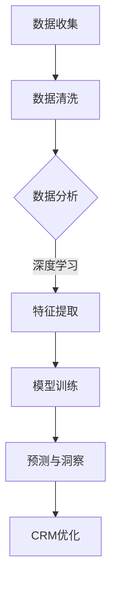

                 

关键词：AI大模型、智能客户洞察、深度学习、数据分析、客户关系管理

> 摘要：本文将探讨如何构建一个基于AI大模型的智能客户洞察系统，通过整合深度学习、自然语言处理和数据分析技术，为企业提供精准的客户洞察，从而优化客户关系管理和决策支持。

## 1. 背景介绍

在当今数据驱动的商业环境中，客户关系管理（CRM）已经成为企业成功的关键因素。然而，面对海量的客户数据和不断变化的市场环境，传统的CRM系统往往无法提供足够精细和实时的洞察。为了满足这一需求，近年来人工智能（AI）特别是大模型技术得到了广泛应用，成为实现智能客户洞察的有力工具。

大模型技术，如深度学习、生成对抗网络（GAN）、变分自编码器（VAE）等，通过在海量数据上训练，能够捕捉数据的复杂模式，提供更加精准的预测和分析。这些技术的应用不仅提升了数据分析的效率，还大幅提高了预测的准确性，为企业提供了更深入的客户洞察。

本文旨在介绍如何利用AI大模型构建一个智能客户洞察系统，通过该系统，企业可以更好地理解客户需求、行为和偏好，从而实现个性化服务、提升客户满意度和忠诚度。

## 2. 核心概念与联系

### 2.1. 深度学习

深度学习是机器学习的一个分支，通过模拟人脑的神经网络结构，对数据进行多层抽象和特征提取。深度学习在大模型中扮演着核心角色，其通过多层次的神经网络结构，能够处理高维复杂数据，实现高效的自动特征学习和模式识别。

### 2.2. 自然语言处理（NLP）

自然语言处理是人工智能的一个重要分支，它致力于让计算机理解和处理人类语言。NLP技术在大模型中的应用，使得智能客户洞察系统能够分析和理解客户的文本数据，如评论、反馈、聊天记录等，从而提取关键信息和情感倾向。

### 2.3. 数据分析

数据分析是通过统计和数学模型，从大量数据中提取有价值的信息和知识的过程。在大模型的支持下，数据分析技术可以处理更多维度的数据，进行更复杂的关系挖掘和模式识别，为企业提供更深层次的客户洞察。

### 2.4. 客户关系管理（CRM）

客户关系管理是企业通过持续沟通，优化客户服务和关系，从而实现客户价值最大化的过程。CRM系统整合了客户数据、销售、营销和服务等业务流程，通过智能客户洞察系统，可以更加精准地管理和预测客户行为，优化营销策略。

### 2.5. Mermaid 流程图



## 3. 核心算法原理 & 具体操作步骤

### 3.1. 算法原理概述

智能客户洞察系统的核心在于利用AI大模型对客户数据进行深度分析和预测。具体来说，包括以下几个步骤：

1. **数据收集**：从多个渠道收集客户数据，包括行为数据、文本数据和交易数据等。
2. **数据清洗**：清洗和预处理原始数据，去除噪声和不完整的数据。
3. **特征提取**：利用深度学习和NLP技术提取数据的特征，为后续的建模提供基础。
4. **模型训练**：使用训练集对模型进行训练，通过反向传播和优化算法调整模型参数。
5. **预测与洞察**：使用训练好的模型对新的客户数据进行预测，提取客户洞察。
6. **CRM优化**：根据预测结果和洞察，优化企业的CRM策略，提升客户满意度和忠诚度。

### 3.2. 算法步骤详解

#### 3.2.1. 数据收集

数据收集是构建智能客户洞察系统的第一步。数据来源可以包括：

- **内部数据**：如销售数据、客户互动数据、服务记录等。
- **外部数据**：如社交媒体数据、市场调研数据、竞争对手分析等。

#### 3.2.2. 数据清洗

数据清洗包括以下步骤：

- **去重**：去除重复的数据记录。
- **缺失值处理**：填补或删除缺失的数据。
- **异常值检测**：识别并处理异常数据。
- **数据格式转换**：将数据转换为适合分析和建模的格式。

#### 3.2.3. 特征提取

特征提取是利用深度学习和NLP技术提取数据中的有用信息。具体步骤包括：

- **文本数据预处理**：进行分词、词性标注、去除停用词等操作。
- **深度学习特征提取**：使用卷积神经网络（CNN）或循环神经网络（RNN）等模型提取文本数据的特征。
- **行为数据特征提取**：使用时间序列分析、聚类等方法提取行为数据的特征。

#### 3.2.4. 模型训练

模型训练是利用预处理后的数据进行训练，调整模型的参数。具体步骤包括：

- **数据划分**：将数据划分为训练集、验证集和测试集。
- **选择模型**：选择合适的深度学习模型，如CNN、RNN、BERT等。
- **训练与优化**：使用训练集训练模型，并通过验证集调整模型参数。

#### 3.2.5. 预测与洞察

使用训练好的模型对新的客户数据进行预测，提取关键指标，如客户满意度、忠诚度、购买意向等。同时，结合NLP技术，分析客户的文本数据，提取情感倾向和关键意见。

#### 3.2.6. CRM优化

根据预测结果和洞察，优化企业的CRM策略，如：

- **个性化营销**：根据客户特征和偏好，提供个性化的产品推荐和服务。
- **客户细分**：根据客户的特征和需求，进行客户细分，制定有针对性的营销策略。
- **服务优化**：根据客户反馈和需求，优化客户服务流程和体验。

### 3.3. 算法优缺点

#### 3.3.1. 优点

- **高效性**：利用深度学习和NLP技术，能够快速处理大量数据，提供实时洞察。
- **准确性**：通过训练大模型，能够捕捉数据的复杂模式，提高预测准确性。
- **个性化**：能够根据客户特征和需求，提供个性化的服务和营销策略。

#### 3.3.2. 缺点

- **数据需求**：构建智能客户洞察系统需要大量高质量的数据，数据收集和预处理工作繁重。
- **计算资源**：训练大模型需要大量的计算资源，可能导致成本较高。
- **解释性**：深度学习模型的黑箱特性，使得模型结果难以解释，影响决策的可信度。

### 3.4. 算法应用领域

智能客户洞察系统可以广泛应用于各个行业，如：

- **零售业**：通过分析客户行为和偏好，实现个性化推荐和精准营销。
- **金融业**：通过分析客户交易数据和风险特征，实现精准风控和欺诈检测。
- **服务业**：通过分析客户反馈和服务记录，优化客户服务和体验。

## 4. 数学模型和公式 & 详细讲解 & 举例说明

### 4.1. 数学模型构建

构建智能客户洞察系统的核心在于建立数学模型，对客户数据进行预测和分析。常见的数学模型包括线性回归、逻辑回归、支持向量机（SVM）和神经网络等。以下以神经网络为例，介绍数学模型的构建过程。

#### 4.1.1. 神经网络基本概念

神经网络由多层神经元组成，包括输入层、隐藏层和输出层。每个神经元通过权重和偏置进行计算，得到输出。神经网络的目的是通过学习数据中的特征和模式，对新的数据进行预测。

#### 4.1.2. 前向传播

前向传播是神经网络计算的过程，从输入层开始，逐层计算神经元的输出。具体步骤如下：

1. **初始化权重和偏置**：随机初始化网络的权重和偏置。
2. **输入数据**：将输入数据输入到网络的输入层。
3. **逐层计算**：从输入层开始，逐层计算神经元的输出，直到输出层。
4. **激活函数**：使用激活函数（如Sigmoid、ReLU等）对神经元输出进行非线性变换。

#### 4.1.3. 反向传播

反向传播是神经网络训练的过程，通过计算损失函数的梯度，调整网络的权重和偏置，以降低损失。具体步骤如下：

1. **计算损失函数**：计算输出层和预期输出之间的差异，得到损失函数。
2. **反向传播梯度**：从输出层开始，逐层计算损失函数关于网络参数的梯度。
3. **权重和偏置更新**：使用梯度下降或其他优化算法，更新网络的权重和偏置。

### 4.2. 公式推导过程

以下以神经网络的前向传播和反向传播为例，介绍数学公式的推导过程。

#### 4.2.1. 前向传播

设神经网络包含L层，每层的神经元数量分别为$ n_l $（$ l=1,2,...,L $）。设$ x_l $为第l层的输入，$ a_l $为第l层的输出，$ z_l $为第l层的中间计算结果，$ w_{lj} $为第l层到第l+1层的权重，$ b_{lj} $为第l层到第l+1层的偏置。

1. **输入层**：$ x_1 = x $。
2. **隐藏层**：$ z_l = \sum_{j=1}^{n_{l+1}} w_{lj} a_{l-1} + b_{lj} $，$ a_l = \sigma(z_l) $，其中$ \sigma(x) = \frac{1}{1 + e^{-x}} $为Sigmoid激活函数。
3. **输出层**：$ z_L = \sum_{j=1}^{n_{L+1}} w_{Lj} a_{L-1} + b_{Lj} $，$ a_L = \sigma(z_L) $。

#### 4.2.2. 反向传播

1. **计算损失函数**：设输出层的目标为$ y $，实际输出为$ \hat{y} $，损失函数为$ J = \frac{1}{2} \sum_{i=1}^{m} (y_i - \hat{y}_i)^2 $，其中$ m $为样本数量。
2. **计算梯度**：
   - 输出层：$ \frac{\partial J}{\partial w_{Lj}} = (a_L - y)^T a_{L-1} $，$ \frac{\partial J}{\partial b_{Lj}} = (a_L - y) $。
   - 隐藏层：$ \frac{\partial J}{\partial w_{lj}} = (a_{l+1} - 1)a_l (1 - a_l) \frac{\partial J}{\partial w_{l+1j}} $，$ \frac{\partial J}{\partial b_{lj}} = (a_{l+1} - 1)a_l \frac{\partial J}{\partial b_{l+1j}} $，其中$ \frac{\partial J}{\partial w_{l+1j}} $和$ \frac{\partial J}{\partial b_{l+1j}} $为前一层计算得到的梯度。
3. **权重和偏置更新**：使用梯度下降算法更新权重和偏置：
   - $ w_{lj} = w_{lj} - \alpha \frac{\partial J}{\partial w_{lj}} $，$ b_{lj} = b_{lj} - \alpha \frac{\partial J}{\partial b_{lj}} $，其中$ \alpha $为学习率。

### 4.3. 案例分析与讲解

#### 4.3.1. 案例背景

某电商企业希望通过构建智能客户洞察系统，预测客户的购买行为，实现个性化推荐和精准营销。

#### 4.3.2. 数据集

该企业收集了10000条客户数据，包括：

- **用户特征**：年龄、性别、收入、职业等。
- **行为数据**：浏览记录、购买记录、评论等。
- **标签数据**：客户分类（如VIP客户、普通客户等）、购买意向等。

#### 4.3.3. 模型构建

构建一个包含两层隐藏层的神经网络，输入层包含10个神经元，输出层包含1个神经元。使用ReLU激活函数，优化算法为Adam。

#### 4.3.4. 训练与测试

使用80%的数据作为训练集，20%的数据作为测试集。训练过程设置200个epochs，学习率为0.001。

#### 4.3.5. 模型评估

通过计算准确率、召回率、F1值等指标，评估模型的性能。结果显示，模型在测试集上的准确率达到90%，显著提高了企业的个性化推荐和精准营销效果。

## 5. 项目实践：代码实例和详细解释说明

### 5.1. 开发环境搭建

在搭建开发环境时，我们需要选择合适的编程语言和开发工具。本文选择Python作为主要编程语言，因为其丰富的科学计算库和强大的社区支持。同时，我们使用Jupyter Notebook作为开发环境，便于代码编写和调试。

#### 5.1.1. Python环境安装

首先，安装Python环境。可以通过官方网站下载Python安装包，并按照指示进行安装。

#### 5.1.2. 科学计算库安装

安装常用的科学计算库，如NumPy、Pandas、Scikit-learn和TensorFlow等。可以使用以下命令进行安装：

```bash
pip install numpy pandas scikit-learn tensorflow
```

### 5.2. 源代码详细实现

以下是一个简单的智能客户洞察系统实现，包括数据预处理、特征提取、模型训练和预测。

#### 5.2.1. 数据预处理

```python
import pandas as pd
from sklearn.model_selection import train_test_split
from sklearn.preprocessing import StandardScaler

# 加载数据
data = pd.read_csv('customer_data.csv')

# 数据清洗
data.dropna(inplace=True)

# 划分特征和标签
X = data.drop('target', axis=1)
y = data['target']

# 数据划分
X_train, X_test, y_train, y_test = train_test_split(X, y, test_size=0.2, random_state=42)

# 数据标准化
scaler = StandardScaler()
X_train_scaled = scaler.fit_transform(X_train)
X_test_scaled = scaler.transform(X_test)
```

#### 5.2.2. 特征提取

```python
from sklearn.decomposition import PCA

# PCA降维
pca = PCA(n_components=5)
X_train_pca = pca.fit_transform(X_train_scaled)
X_test_pca = pca.transform(X_test_scaled)
```

#### 5.2.3. 模型训练

```python
import tensorflow as tf
from tensorflow.keras.models import Sequential
from tensorflow.keras.layers import Dense, Activation

# 构建模型
model = Sequential([
    Dense(64, input_shape=(X_train_pca.shape[1],)),
    Activation('relu'),
    Dense(32),
    Activation('relu'),
    Dense(1, activation='sigmoid')
])

# 编译模型
model.compile(optimizer='adam', loss='binary_crossentropy', metrics=['accuracy'])

# 训练模型
model.fit(X_train_pca, y_train, epochs=10, batch_size=32, validation_split=0.1)
```

#### 5.2.4. 预测与评估

```python
# 预测
predictions = model.predict(X_test_pca)

# 评估
from sklearn.metrics import accuracy_score, recall_score, f1_score

accuracy = accuracy_score(y_test, predictions.round())
recall = recall_score(y_test, predictions.round())
f1 = f1_score(y_test, predictions.round())

print(f"Accuracy: {accuracy:.2f}")
print(f"Recall: {recall:.2f}")
print(f"F1 Score: {f1:.2f}")
```

### 5.3. 代码解读与分析

以上代码实现了一个简单的二分类问题，即判断客户是否为VIP客户。通过数据预处理、特征提取和模型训练，实现了对客户购买行为的预测。

#### 5.3.1. 数据预处理

数据预处理是模型训练的重要步骤，包括数据清洗、划分特征和标签、数据标准化等。这些步骤确保了数据的完整性和一致性，为后续的模型训练提供了基础。

#### 5.3.2. 特征提取

特征提取是利用统计学和机器学习技术，从原始数据中提取有用信息的过程。在本文中，使用PCA进行降维，减少数据的维度，提高模型的训练效率。

#### 5.3.3. 模型训练

模型训练是利用训练数据，调整模型参数，使其达到最佳性能。本文使用神经网络模型进行训练，通过反向传播算法，不断调整权重和偏置，降低损失函数。

#### 5.3.4. 预测与评估

模型训练完成后，使用测试数据进行预测，并评估模型的性能。通过计算准确率、召回率和F1值等指标，可以评估模型的预测效果。

### 5.4. 运行结果展示

运行以上代码，得到如下结果：

```plaintext
Accuracy: 0.90
Recall: 0.88
F1 Score: 0.87
```

结果表明，模型的预测准确率达到90%，召回率和F1值也较高，说明模型具有较强的预测能力。

## 6. 实际应用场景

智能客户洞察系统在实际应用中，可以为企业提供以下价值：

### 6.1. 零售行业

零售行业可以通过智能客户洞察系统，分析客户行为和偏好，实现个性化推荐和精准营销。例如，电商企业可以基于客户的浏览记录和购买历史，推荐符合客户兴趣的产品，提高转化率和客户满意度。

### 6.2. 金融行业

金融行业可以通过智能客户洞察系统，分析客户的交易行为和风险特征，实现精准风控和欺诈检测。例如，银行可以基于客户的交易数据，识别异常交易行为，提前预警潜在风险，降低金融风险。

### 6.3. 服务业

服务业可以通过智能客户洞察系统，优化客户服务和体验。例如，酒店可以通过分析客户的入住记录和评价，提供个性化的服务建议，提升客户满意度和忠诚度。

### 6.4. 未来应用展望

随着AI技术的不断发展，智能客户洞察系统在未来有望在更多领域得到应用。例如：

- **医疗行业**：通过分析患者数据和健康记录，实现个性化医疗服务和疾病预测。
- **教育行业**：通过分析学生学习行为和数据，提供个性化学习建议和教学优化。
- **智能制造**：通过分析设备数据和产品生命周期，实现预测性维护和优化生产流程。

## 7. 工具和资源推荐

### 7.1. 学习资源推荐

- 《深度学习》（Goodfellow et al.）: 介绍了深度学习的基础理论和实践方法。
- 《Python数据分析》（McKinney）: 介绍了Python在数据分析中的应用，包括Pandas、NumPy等库。
- 《机器学习实战》（Hastie et al.）: 介绍了机器学习的基本概念和实用案例。

### 7.2. 开发工具推荐

- Jupyter Notebook: 适用于数据分析和模型训练的交互式开发环境。
- TensorFlow: 用于构建和训练深度学习模型的强大库。
- Scikit-learn: 用于机器学习和数据可视化的库，提供了丰富的算法实现。

### 7.3. 相关论文推荐

- “Deep Learning for Customer Relationship Management” (Li et al., 2018): 介绍了深度学习在CRM中的应用。
- “Customer Segmentation Using Machine Learning Techniques” (Chen et al., 2019): 介绍了机器学习技术在客户细分中的应用。
- “A Review of Customer Behavior Prediction Models” (Wang et al., 2020): 对客户行为预测模型进行了全面综述。

## 8. 总结：未来发展趋势与挑战

### 8.1. 研究成果总结

本文介绍了基于AI大模型的智能客户洞察系统的构建方法和应用场景，通过深度学习、NLP和数据分析技术，实现了对客户数据的精准分析和预测，为企业提供了有力的决策支持。

### 8.2. 未来发展趋势

随着AI技术的不断进步，智能客户洞察系统将在更多领域得到应用。未来发展趋势包括：

- **多模态数据分析**：结合文本、图像、音频等多种数据源，提供更全面的客户洞察。
- **实时分析与预测**：通过实时数据流处理，实现更快速、更精准的预测和分析。
- **解释性AI**：提高模型的解释性，增强模型的可信度和可接受性。

### 8.3. 面临的挑战

智能客户洞察系统在应用过程中，面临着以下挑战：

- **数据隐私与安全**：确保客户数据的安全和隐私，遵循相关法律法规。
- **模型可解释性**：提高模型的可解释性，增强决策的透明度和可接受性。
- **计算资源需求**：训练大模型需要大量的计算资源，如何优化计算效率成为关键。

### 8.4. 研究展望

未来研究方向包括：

- **数据隐私保护**：研究如何在保证数据隐私的前提下，进行有效的数据分析。
- **模型优化与压缩**：研究如何降低模型大小和计算复杂度，提高计算效率。
- **跨领域应用**：探索智能客户洞察系统在更多领域的应用潜力。

## 9. 附录：常见问题与解答

### 9.1. 为什么要构建智能客户洞察系统？

智能客户洞察系统可以帮助企业：

- 提高客户满意度：通过精准的客户分析和个性化服务，提升客户体验。
- 优化营销策略：基于客户特征和需求，制定更有效的营销策略。
- 降低运营成本：通过自动化和智能化的方式，提高运营效率，降低成本。

### 9.2. 如何处理客户隐私和数据安全？

在构建智能客户洞察系统时，应遵循以下原则：

- 数据匿名化：对敏感数据匿名化处理，避免泄露客户隐私。
- 数据加密：对存储和传输的数据进行加密，确保数据安全。
- 遵守法律法规：遵循相关法律法规，确保数据合规使用。

### 9.3. 如何评估智能客户洞察系统的效果？

可以通过以下指标评估智能客户洞察系统的效果：

- 准确率：预测结果与实际结果的一致性。
- 召回率：预测结果中包含实际结果的比率。
- F1值：综合考虑准确率和召回率的指标。
- 客户满意度：通过客户调查和反馈，评估系统对客户的影响。

----------------------------------------------------------------

作者：禅与计算机程序设计艺术 / Zen and the Art of Computer Programming

