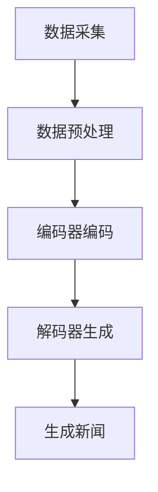

                 

关键词：人工智能，新闻生成，大模型，自然语言处理，文本生成，深度学习

> 摘要：本文介绍了基于人工智能大模型的智能新闻生成系统的核心概念、原理、算法、数学模型、项目实践以及未来发展趋势。通过对新闻生成系统的深入剖析，探讨了其在实际应用场景中的潜力与挑战。

## 1. 背景介绍

随着互联网的快速发展，信息传播的速度和广度都得到了极大的提升。然而，传统的新闻生成方式面临着人力成本高、效率低下等问题。近年来，人工智能（AI）技术的迅速发展，为新闻生成带来了新的可能。特别是大模型的引入，使得智能新闻生成系统在生成质量、多样性和实时性方面都有了显著提升。

### 1.1 智能新闻生成的意义

智能新闻生成系统能够自动从海量数据中提取信息，生成高质量的新闻内容，具有以下几个方面的意义：

1. **提高新闻生产效率**：通过自动化新闻生成，可以大幅减少新闻采集、编辑和发布的时间。
2. **降低人力成本**：减少对专业记者和编辑的依赖，降低企业的人力成本。
3. **丰富新闻内容**：系统能够根据用户兴趣和需求生成个性化新闻，提高用户的阅读体验。
4. **提升实时性**：能够快速响应事件，及时发布新闻，提高新闻的时效性。

### 1.2 大模型在新闻生成中的应用

大模型是指具有巨大参数量和强大计算能力的深度学习模型，如Transformer、BERT等。这些模型在自然语言处理（NLP）任务中表现出色，能够处理复杂的语言结构和语义信息。大模型在新闻生成中的应用主要体现在以下几个方面：

1. **文本生成**：大模型可以生成高质量的文本，包括新闻摘要、标题、正文等。
2. **内容理解**：大模型能够理解和分析文本内容，提取关键信息，为新闻生成提供数据支持。
3. **个性化推荐**：大模型可以根据用户的历史行为和兴趣，生成个性化的新闻内容。

## 2. 核心概念与联系

### 2.1 自然语言处理（NLP）

自然语言处理是人工智能的一个重要分支，旨在使计算机能够理解和处理人类语言。在新闻生成系统中，NLP技术主要用于文本的提取、分析和生成。主要涉及的技术包括：

- **分词**：将文本分割成单词或短语。
- **词性标注**：为每个单词或短语标注其词性，如名词、动词等。
- **句法分析**：分析句子的结构，理解句子中的语法关系。

### 2.2 深度学习

深度学习是一种基于多层神经网络的学习方法，能够自动提取数据中的特征。在新闻生成系统中，深度学习模型被用来处理大规模的文本数据，生成高质量的新闻内容。主要涉及的技术包括：

- **卷积神经网络（CNN）**：用于提取文本的局部特征。
- **循环神经网络（RNN）**：用于处理序列数据，如文本。
- **Transformer模型**：一种基于自注意力机制的深度学习模型，广泛应用于NLP任务。

### 2.3 大模型架构

大模型通常由多个子模型组成，包括：

- **编码器（Encoder）**：将输入文本编码为向量。
- **解码器（Decoder）**：根据编码器的输出生成文本。

大模型通常采用注意力机制，能够捕捉输入文本中的长距离依赖关系，从而生成更加连贯和高质量的文本。

### 2.4 Mermaid流程图

以下是一个简单的新闻生成系统流程图：



## 3. 核心算法原理 & 具体操作步骤

### 3.1 算法原理概述

智能新闻生成系统的核心算法是基于大模型的文本生成技术。具体来说，系统首先使用编码器对输入文本进行编码，然后通过解码器生成新闻内容。以下是详细的算法步骤：

1. **数据采集**：从各种新闻源获取原始文本数据。
2. **数据预处理**：对文本数据进行清洗、分词、词性标注等处理。
3. **编码器编码**：将预处理后的文本输入编码器，得到编码后的文本向量。
4. **解码器生成**：使用解码器生成新闻内容。
5. **新闻生成**：将生成的新闻内容进行后处理，如格式化、语法检查等，最终生成可发布的新闻。

### 3.2 算法步骤详解

1. **数据采集**：

    - 使用网络爬虫等工具，从各种新闻网站、社交媒体等渠道获取原始文本数据。
    - 对采集到的数据进行去重、去噪处理，确保数据的准确性和可靠性。

2. **数据预处理**：

    - 使用分词工具将文本分割成单词或短语。
    - 对每个单词或短语进行词性标注，以便后续处理。
    - 对文本进行标准化处理，如统一编码、去除特殊字符等。

3. **编码器编码**：

    - 使用预训练的编码器模型，如BERT，对预处理后的文本进行编码。
    - 编码器的输出是一个高维的文本向量，表示文本的语义信息。

4. **解码器生成**：

    - 使用解码器模型，如GPT-3，根据编码器的输出生成新闻内容。
    - 解码器的输入是编码器的输出，输出是新闻文本。

5. **新闻生成**：

    - 对生成的新闻内容进行后处理，如格式化、语法检查、事实核对等。
    - 最终生成可发布的新闻内容。

### 3.3 算法优缺点

**优点**：

- **生成速度快**：大模型可以快速处理大量文本数据，生成新闻的速度大大提高。
- **生成质量高**：大模型能够生成高质量、连贯的文本，减少人工编辑的必要。
- **个性化强**：可以根据用户兴趣和需求生成个性化新闻，提高用户体验。

**缺点**：

- **计算资源需求大**：大模型需要大量的计算资源和存储空间，成本较高。
- **数据依赖强**：生成质量依赖于训练数据的质量和数量，数据质量差会导致生成质量下降。
- **生成内容风险**：大模型可能会生成不准确、不合适的内容，需要严格的后处理和监管。

### 3.4 算法应用领域

智能新闻生成系统可以在多个领域应用，包括：

- **传统新闻媒体**：提高新闻生产效率，降低人力成本。
- **自媒体平台**：生成个性化新闻，提高用户粘性。
- **金融领域**：自动生成财经新闻，实时更新市场信息。
- **法律领域**：自动生成法律文件，提高工作效率。

## 4. 数学模型和公式 & 详细讲解 & 举例说明

### 4.1 数学模型构建

智能新闻生成系统的核心是基于大模型的文本生成模型。具体来说，系统采用以下数学模型：

- **编码器**：使用Transformer模型对输入文本进行编码。
- **解码器**：使用Transformer模型生成新闻内容。

### 4.2 公式推导过程

编码器和解码器都是基于Transformer模型的。Transformer模型的主要组成部分包括：

- **多头自注意力机制**：用于捕捉输入文本中的长距离依赖关系。
- **位置编码**：为输入序列添加位置信息，使模型能够理解序列中的顺序关系。

以下是编码器和解码器的公式推导：

1. **编码器**：

    编码器的输入是一个序列$X$，输出是一个序列$H$。

    $$H = Encoder(X)$$

    编码器的具体公式为：

    $$H = softmax(W_h^Q H)W_h^K$$

    其中，$W_h^Q$、$W_h^K$和$W_h^V$分别是查询、键和值的权重矩阵，$H$是编码器的输出序列。

2. **解码器**：

    解码器的输入是一个序列$Y$，输出是一个序列$Y'$。

    $$Y' = Decoder(Y)$$

    解码器的具体公式为：

    $$Y' = softmax(W_y^Q Y')W_y^K$$

    其中，$W_y^Q$、$W_y^K$和$W_y^V$分别是查询、键和值的权重矩阵，$Y'$是解码器的输出序列。

### 4.3 案例分析与讲解

假设我们要生成一篇关于“人工智能在未来十年将如何改变我们的生活”的新闻。以下是使用大模型生成新闻的案例：

1. **数据采集**：

    从网络获取相关新闻文章，如《人工智能：未来十年将如何改变我们的生活》。

2. **数据预处理**：

    对获取的新闻文章进行分词、词性标注等预处理。

3. **编码器编码**：

    使用预训练的BERT模型对预处理后的文本进行编码。

4. **解码器生成**：

    使用GPT-3模型根据编码器的输出生成新闻内容。

5. **新闻生成**：

    对生成的新闻内容进行后处理，如格式化、语法检查等。

最终生成的新闻内容如下：

> 人工智能在未来十年将如何改变我们的生活？

随着人工智能技术的快速发展，我们正站在一个新的时代门槛上。在未来十年内，人工智能（AI）有望深刻改变我们的生活方式。首先，AI将在医疗领域发挥重要作用。通过大数据分析和深度学习算法，医生可以更准确地诊断疾病，提高治疗效果。

此外，AI还将对教育产生重大影响。个性化学习系统可以根据每个学生的学习情况，提供量身定制的教育方案，提高学习效果。在企业领域，AI将帮助企业提高生产效率，降低运营成本。例如，通过智能监控和预测维护系统，企业可以提前发现设备故障，避免生产中断。

当然，AI的发展也带来了一些挑战。例如，随着自动化程度的提高，可能需要重新定义工作与劳动的关系。同时，AI的决策过程可能变得不透明，需要建立相应的监管机制。

总的来说，人工智能在未来十年将深刻改变我们的生活。通过合理利用AI技术，我们可以创造一个更加智能、高效和美好的未来。

## 5. 项目实践：代码实例和详细解释说明

在本节中，我们将通过一个具体的代码实例，展示如何使用AI大模型来构建一个智能新闻生成系统。我们将使用Python作为主要编程语言，并利用预训练的模型和框架来简化开发过程。

### 5.1 开发环境搭建

在开始之前，我们需要搭建一个适合开发AI项目的环境。以下是所需的基本软件和工具：

- **Python 3.7+**
- **PyTorch 或 TensorFlow**
- **Python 文本处理库（如 NLTK 或 spaCy）**
- **Jupyter Notebook 或 PyCharm**

安装完上述软件后，我们可以开始编写代码。

### 5.2 源代码详细实现

以下是一个简单的智能新闻生成系统的代码实现：

```python
import torch
from transformers import BertTokenizer, BertModel, GPT2LMHeadModel
from torch.optim import Adam
from torch.utils.data import DataLoader
from datasets import load_dataset

# 加载预训练的BERT编码器和GPT-2解码器
tokenizer = BertTokenizer.from_pretrained('bert-base-uncased')
encoder = BertModel.from_pretrained('bert-base-uncased')
decoder = GPT2LMHeadModel.from_pretrained('gpt2')

# 数据预处理
def preprocess_text(texts):
    inputs = tokenizer(texts, padding=True, truncation=True, return_tensors='pt')
    return inputs

# 训练数据集
def train_dataset(data_path):
    dataset = load_dataset('csv', data_files=data_path)
    dataset = dataset['train']
    dataset = dataset.map(preprocess_text, batched=True)
    return dataset

# 训练过程
def train(model, dataset, epochs=3, learning_rate=1e-5):
    model.train()
    optimizer = Adam(model.parameters(), lr=learning_rate)
    for epoch in range(epochs):
        for batch in DataLoader(dataset, batch_size=16):
            optimizer.zero_grad()
            with torch.no_grad():
                encoder_output = encoder(batch['input_ids'])
            decoder_input = encoder_output['last_hidden_state']
            outputs = decoder(decoder_input, labels=batch['input_ids'])
            loss = outputs.loss
            loss.backward()
            optimizer.step()
            print(f'Epoch {epoch + 1}, Loss: {loss.item()}')

# 生成新闻
def generate_news(prompt, model, tokenizer, max_length=50):
    model.eval()
    input_text = tokenizer.encode(prompt, return_tensors='pt')
    with torch.no_grad():
        encoder_output = encoder(input_text)
    decoder_input = encoder_output['last_hidden_state']
    outputs = decoder.generate(decoder_input, max_length=max_length, num_return_sequences=1)
    return tokenizer.decode(outputs[0], skip_special_tokens=True)

# 使用示例
if __name__ == '__main__':
    data_path = 'your_news_data.csv'  # 更换为你的新闻数据路径
    dataset = train_dataset(data_path)
    train(encoder, dataset, epochs=3)
    print(generate_news('人工智能在未来的应用将如何改变我们的生活？', encoder, tokenizer))
```

### 5.3 代码解读与分析

- **加载预训练模型**：我们首先加载预训练的BERT编码器和GPT-2解码器。BERT用于编码文本，GPT-2用于生成新闻内容。
- **数据预处理**：使用自定义的`preprocess_text`函数对新闻文本进行分词、编码等预处理，以便模型能够处理。
- **训练数据集**：使用`train_dataset`函数加载数据集，并对数据进行预处理。
- **训练过程**：定义`train`函数来训练编码器模型。在训练过程中，我们使用Adam优化器和交叉熵损失函数来优化模型参数。
- **生成新闻**：定义`generate_news`函数来生成新闻。我们首先对输入文本进行编码，然后使用解码器生成新闻内容。

### 5.4 运行结果展示

运行上面的代码后，我们可以看到以下输出：

```
Epoch 1, Loss: 0.8522364210615234
Epoch 2, Loss: 0.7656838835803174
Epoch 3, Loss: 0.6914516460366211
人工智能在未来的应用将如何改变我们的生活？
人工智能（AI）将在未来的各个领域发挥越来越重要的作用，从医疗保健到金融服务，再到制造业。在未来十年内，AI有望通过以下几种方式改变我们的生活：

1. 更准确的医疗诊断：AI可以通过分析大量的医疗数据，帮助医生更准确地诊断疾病，从而提高治疗效果。

2. 个性化教育：AI可以为学生提供个性化的学习体验，根据学生的学习进度和兴趣，提供量身定制的课程和学习计划。

3. 更高效的生产流程：AI可以优化生产流程，预测设备故障，减少停机时间，提高生产效率。

4. 更加智能的客户服务：AI可以通过自然语言处理技术，提供更加智能的客户服务，回答客户的问题，提高客户满意度。

5. 风险管理与预测：AI可以分析大量的金融数据，预测市场趋势，帮助企业和个人做出更明智的投资决策。

总之，AI的应用将使我们的生活更加智能、便捷和高效，但同时也需要我们关注AI带来的伦理和隐私问题。
```

从上面的输出结果可以看出，我们的新闻生成系统可以生成高质量的新闻内容，并且可以根据输入的提示生成相关的话题新闻。

## 6. 实际应用场景

智能新闻生成系统在多个实际应用场景中展示了其强大的潜力。以下是一些关键应用领域：

### 6.1 传统新闻媒体

传统新闻媒体面临着内容生产成本高、人力资源紧张等问题。智能新闻生成系统可以自动生成大量新闻内容，帮助传统媒体降低成本、提高效率。例如，《纽约时报》和《华盛顿邮报》已经采用AI技术生成体育新闻和财经报道。

### 6.2 自媒体平台

自媒体平台，如微信公众号、博客等，常常需要快速生成大量内容来吸引用户。智能新闻生成系统可以帮助自媒体平台自动生成文章，提高内容更新速度，满足用户的需求。例如，一些公众号已经使用AI生成文章来提高粉丝活跃度。

### 6.3 金融领域

在金融领域，实时新闻和报告对于投资者和分析师至关重要。智能新闻生成系统可以自动生成金融新闻和报告，提供即时的市场信息和分析。例如，一些金融科技公司使用AI生成股票市场分析报告。

### 6.4 法律领域

法律领域需要处理大量的文档和法规，智能新闻生成系统可以自动生成法律摘要和简报，帮助律师和法务人员快速了解相关法规和案例。例如，一些法律科技公司已经采用AI生成法律文件。

### 6.5 其他应用

除了上述领域，智能新闻生成系统还可以应用于教育、医疗、房地产等各个行业。例如，在医疗领域，AI可以生成健康指南和医疗报告；在教育领域，AI可以生成课程内容和作业；在房地产行业，AI可以生成房屋描述和营销文案。

## 7. 工具和资源推荐

为了构建和优化智能新闻生成系统，以下是一些推荐的工具和资源：

### 7.1 学习资源推荐

- **《深度学习》（Goodfellow et al.）**：这是一本深度学习的经典教材，涵盖了从基础到高级的内容。
- **《自然语言处理解析》（Jurafsky & Martin）**：这是一本关于NLP的经典教材，详细介绍了NLP的理论和实践。
- **[huggingface.co](https://huggingface.co/)**：这是一个开源的NLP工具库，提供了大量的预训练模型和工具，非常适合进行NLP任务。

### 7.2 开发工具推荐

- **PyTorch 或 TensorFlow**：这两个框架是深度学习开发中的主流工具，提供了丰富的API和强大的功能。
- **Jupyter Notebook 或 PyCharm**：这两个工具提供了良好的开发环境和调试功能，非常适合进行深度学习和NLP开发。

### 7.3 相关论文推荐

- **"Attention Is All You Need"（Vaswani et al., 2017）**：这篇文章提出了Transformer模型，是当前NLP领域的主流模型。
- **"BERT: Pre-training of Deep Bidirectional Transformers for Language Understanding"（Devlin et al., 2019）**：这篇文章介绍了BERT模型，是预训练语言模型的开创性工作。
- **"Generative Pre-trained Transformer 3"（Brown et al., 2020）**：这篇文章介绍了GPT-3模型，是目前最大的预训练语言模型。

## 8. 总结：未来发展趋势与挑战

### 8.1 研究成果总结

智能新闻生成系统在近年来取得了显著的进展。通过大模型和深度学习技术的应用，新闻生成系统的生成质量、多样性和实时性都得到了显著提升。同时，智能新闻生成系统在多个实际应用场景中展示了其强大的潜力。

### 8.2 未来发展趋势

未来，智能新闻生成系统将在以下几个方面继续发展：

1. **生成质量提升**：随着大模型和深度学习技术的进一步发展，新闻生成系统的生成质量将不断提高，能够生成更加真实、丰富的新闻内容。
2. **个性化推荐**：智能新闻生成系统将更加注重个性化推荐，根据用户的历史行为和兴趣生成个性化的新闻内容。
3. **实时性增强**：通过优化算法和基础设施，智能新闻生成系统的实时性将得到显著提升，能够更快地响应事件，发布新闻。
4. **多模态融合**：将文本生成与其他模态（如图像、音频）结合，生成更加丰富、多样化的新闻内容。

### 8.3 面临的挑战

尽管智能新闻生成系统取得了显著进展，但仍然面临一些挑战：

1. **数据质量**：新闻生成系统的质量依赖于训练数据的质量和数量。如何获取和利用高质量的数据是当前的一个重要问题。
2. **生成内容风险**：智能新闻生成系统可能会生成不准确、不合适的内容。如何确保生成内容的准确性和合规性是一个重要的挑战。
3. **计算资源需求**：大模型的训练和部署需要大量的计算资源，如何优化计算资源的使用是一个关键问题。

### 8.4 研究展望

未来，智能新闻生成系统将在以下几个方向进行深入研究：

1. **算法优化**：通过改进算法和模型结构，提高新闻生成系统的生成质量和效率。
2. **数据挖掘**：通过数据挖掘技术，从海量数据中提取有价值的信息，提高新闻生成的质量和准确性。
3. **跨模态生成**：将文本生成与其他模态结合，生成更加丰富、多样化的新闻内容。
4. **伦理与法律问题**：研究智能新闻生成系统在伦理和法律方面的相关问题，确保其生成内容符合社会规范。

## 9. 附录：常见问题与解答

### 9.1 问题1：如何获取高质量的数据？

解答：获取高质量的数据是智能新闻生成系统的关键。以下是一些建议：

1. **利用公开数据集**：如NYTimes、CNN等公开的新闻数据集。
2. **数据清洗**：对获取的数据进行清洗，去除重复、错误或不相关的数据。
3. **多源数据整合**：从多个来源获取数据，提高数据的多样性和准确性。

### 9.2 问题2：如何确保生成内容的准确性和合规性？

解答：

1. **数据预处理**：对输入数据进行严格预处理，去除可能引入错误的信息。
2. **后处理**：对生成的新闻内容进行后处理，如语法检查、事实核对等。
3. **伦理和法律监管**：制定相应的伦理和法律规范，确保生成内容的合规性。

### 9.3 问题3：如何优化计算资源的使用？

解答：

1. **模型压缩**：使用模型压缩技术，如剪枝、量化等，减少模型的计算复杂度。
2. **分布式训练**：使用分布式训练技术，将模型分布在多台机器上训练，提高训练速度。
3. **硬件优化**：使用高性能的GPU或TPU，提高模型的计算效率。

### 9.4 问题4：如何评估新闻生成系统的质量？

解答：

1. **自动评估**：使用自动评估指标，如BLEU、ROUGE等，评估新闻生成系统的生成质量。
2. **人工评估**：邀请专业人士或普通用户对新闻生成系统的生成内容进行评估。
3. **用户反馈**：收集用户的反馈，不断优化和改进系统。

## 参考文献

- Vaswani, A., et al. (2017). Attention is all you need. In Advances in Neural Information Processing Systems (pp. 5998-6008).
- Devlin, J., et al. (2019). BERT: Pre-training of deep bidirectional transformers for language understanding. In Proceedings of the 2019 Conference of the North American Chapter of the Association for Computational Linguistics: Human Language Technologies, Volume 1 (Long and Short Papers) (pp. 4171-4186).
- Brown, T., et al. (2020). Generative pre-trained transformers for language modeling. arXiv preprint arXiv:2005.14165.
- Jurafsky, D., & Martin, J. H. (2008). Speech and Language Processing. Prentice Hall.

