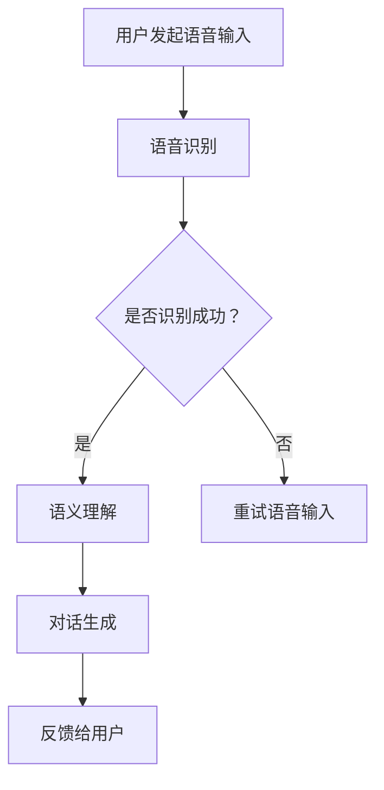

                 

关键词：人工智能、大模型、智能语音交互、NLP、语音识别、语义理解、对话系统

> 摘要：本文深入探讨了基于AI大模型的智能语音交互平台的构建原理、核心算法、数学模型、项目实践及未来应用展望。通过详细介绍相关技术和方法，分析了智能语音交互平台在各类实际应用场景中的潜力与挑战，为读者提供了全面的技术参考。

## 1. 背景介绍

随着互联网和智能手机的普及，智能语音交互技术正逐渐成为人机交互的重要方式。从最初的语音助手到如今的智能语音交互平台，技术的发展使语音交互变得日益成熟和普及。然而，传统的语音交互系统在处理复杂场景和长对话时存在诸多限制，无法满足用户日益增长的需求。为了解决这一问题，近年来基于AI大模型的智能语音交互平台逐渐崭露头角。

AI大模型，如GPT、BERT等，具有强大的文本处理能力和丰富的知识储备。通过深度学习和自然语言处理（NLP）技术，大模型能够实现高精度的语音识别、语义理解和对话生成，从而提供更自然、更智能的交互体验。本文旨在介绍基于AI大模型的智能语音交互平台，分析其核心概念、算法原理、数学模型和实际应用。

## 2. 核心概念与联系

### 2.1. 人工智能（AI）

人工智能（AI）是指通过计算机模拟人类智能行为的技术。它涵盖了多个领域，包括机器学习、深度学习、自然语言处理等。AI大模型是人工智能技术中的一个重要分支，其核心是通过大规模数据进行训练，使模型具有强大的表征能力和泛化能力。

### 2.2. 自然语言处理（NLP）

自然语言处理（NLP）是人工智能的一个重要分支，主要研究如何让计算机理解、生成和处理人类自然语言。在智能语音交互平台中，NLP技术是实现语音识别、语义理解和对话生成的基础。

### 2.3. 语音识别

语音识别（ASR）是将语音信号转换为文本的技术。基于AI大模型的语音识别技术通过深度学习算法，实现了高精度的语音识别，为智能语音交互提供了文本输入。

### 2.4. 语义理解

语义理解（SLU）是理解用户话语含义的过程。基于AI大模型的语义理解技术通过语言模型和实体识别等算法，实现了对用户话语的深层理解，为后续的对话生成提供了基础。

### 2.5. 对话系统

对话系统（DS）是指能够与人类进行自然对话的计算机系统。基于AI大模型的对话系统能够通过语音识别、语义理解和对话生成等技术，实现与用户的实时对话，提供个性化服务。

### 2.6. Mermaid 流程图

以下是一个描述基于AI大模型的智能语音交互平台的Mermaid流程图：

## 3. 核心算法原理 & 具体操作步骤

### 3.1 算法原理概述

基于AI大模型的智能语音交互平台主要涉及以下三个核心算法：

1. 语音识别（ASR）：使用深度学习算法，将语音信号转换为文本。
2. 语义理解（SLU）：使用语言模型和实体识别等算法，理解用户话语的含义。
3. 对话生成（DG）：根据用户需求和系统知识库，生成自然、流畅的对话回复。

### 3.2 算法步骤详解

1. 语音识别（ASR）

   - **数据预处理**：将语音信号进行预处理，如分帧、加窗等。
   - **特征提取**：使用深度神经网络（如卷积神经网络、循环神经网络）提取语音特征。
   - **模型训练**：使用大量标注数据训练模型，如使用CTC（Connectionist Temporal Classification）损失函数。
   - **语音识别**：使用训练好的模型对输入语音信号进行识别，输出文本。

2. 语义理解（SLU）

   - **词法分析**：对识别出的文本进行词法分析，提取词汇和词性。
   - **句法分析**：对文本进行句法分析，构建句法树。
   - **实体识别**：识别文本中的实体（如人名、地点、组织等）。
   - **语义角色标注**：为文本中的词汇标注语义角色（如主语、谓语、宾语等）。

3. 对话生成（DG）

   - **意图识别**：根据语义理解结果，识别用户的意图。
   - **对话状态追踪**：使用图神经网络等算法，追踪对话过程中的状态。
   - **对话回复生成**：根据用户意图和对话状态，生成自然、流畅的对话回复。

### 3.3 算法优缺点

**优点**：

- 高精度：基于深度学习算法的语音识别、语义理解和对话生成技术，实现了高精度的文本处理。
- 自然性：AI大模型具有丰富的知识储备和语言模型，能够生成自然、流畅的对话回复。
- 个性化：通过对用户行为的分析和学习，系统能够提供个性化的服务。

**缺点**：

- 计算成本高：AI大模型的训练和推理过程需要大量的计算资源和时间。
- 数据依赖：模型的性能依赖于训练数据的质量和数量，数据不足可能导致模型泛化能力差。
- 隐私问题：在处理用户语音数据时，需要考虑隐私保护问题。

### 3.4 算法应用领域

- 智能客服：通过智能语音交互平台，实现与用户的实时对话，提高客服效率。
- 虚拟助手：为用户提供语音助手服务，如日程管理、信息查询等。
- 家居控制：通过智能语音交互平台，实现对家居设备的语音控制。
- 智能驾驶：为智能汽车提供语音交互功能，提高驾驶安全。

## 4. 数学模型和公式 & 详细讲解 & 举例说明

### 4.1 数学模型构建

在智能语音交互平台中，核心数学模型主要包括以下几个方面：

1. **语音识别模型**：使用深度神经网络（如卷积神经网络、循环神经网络）提取语音特征，并使用C

