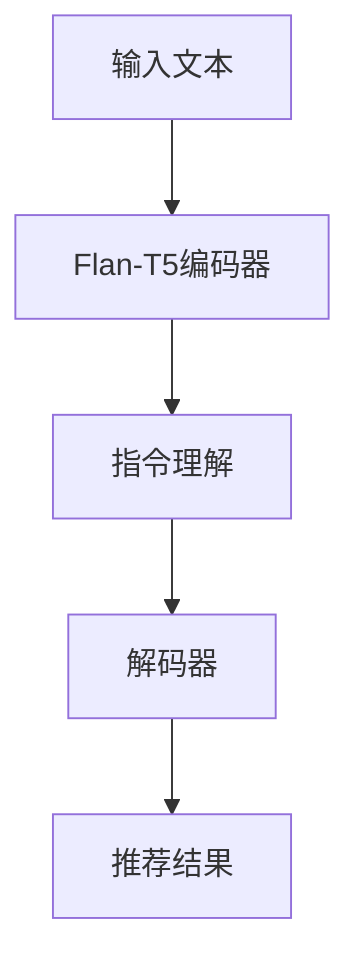

                 

关键词：Flan-T5，大模型，指令调优，推荐系统，机器学习，深度学习

摘要：本文将详细介绍基于Flan-T5的大模型指令调优推荐方法。通过引入Flan-T5模型，本文将探讨如何通过指令调优来提高推荐系统的性能，从而实现更准确的推荐结果。文章将包括对Flan-T5模型的背景介绍、核心算法原理与具体操作步骤的详细讲解，以及数学模型和公式的详细讲解和举例说明。此外，文章还将通过项目实践展示如何在实际应用中使用该方法，并对未来应用场景进行展望。

## 1. 背景介绍

推荐系统在当今信息过载的时代扮演着至关重要的角色。无论是电子商务平台、社交媒体还是新闻网站，推荐系统都能为用户提供个性化的内容，提高用户体验。然而，推荐系统的性能受到多种因素的影响，包括数据质量、特征提取和模型选择等。近年来，深度学习在推荐系统领域取得了显著的成果，尤其是在大规模数据集和复杂模型的应用上。

Flan-T5是一个基于T5模型的大规模语言模型，它被设计用于处理自然语言处理任务。T5（Text-To-Text Transfer Transformer）模型是一个通用的文本转换模型，能够将输入文本转换为期望的输出文本。Flan-T5在T5的基础上进行了扩展，使其能够更好地处理指令调优任务。指令调优是一种通过训练模型来适应特定任务的方法，它可以在不重新训练模型的情况下，提高模型在特定任务上的性能。

本文将探讨如何利用Flan-T5模型进行指令调优，以提高推荐系统的性能。我们将在后续章节中详细介绍Flan-T5模型的结构、算法原理和具体操作步骤，并通过项目实践展示该方法的应用效果。

## 2. 核心概念与联系

### 2.1 Flan-T5模型的结构

Flan-T5模型是基于T5模型构建的，T5模型的结构如下：

1. **输入层**：T5模型的输入层是一个嵌入层，它将单词或子词映射为高维向量。
2. **编码器**：编码器由多个自注意力层组成，用于提取输入文本的特征。
3. **解码器**：解码器也由多个自注意力层组成，用于生成输出文本。

Flan-T5在T5的基础上增加了以下功能：

1. **指令理解**：Flan-T5能够理解输入指令，并根据指令进行相应的任务。
2. **自适应学习**：Flan-T5能够通过指令调优，快速适应新任务。

### 2.2 指令调优的概念

指令调优是一种通过训练模型来适应特定任务的方法。它通过在模型中嵌入特定的指令，使模型能够根据指令进行任务处理。指令调优的优势在于，它可以在不重新训练模型的情况下，提高模型在特定任务上的性能。

### 2.3 推荐系统的架构

推荐系统的基本架构通常包括以下几个部分：

1. **用户特征提取**：从用户历史行为中提取特征，用于表示用户。
2. **商品特征提取**：从商品属性中提取特征，用于表示商品。
3. **推荐算法**：根据用户特征和商品特征，生成推荐列表。
4. **评估与优化**：评估推荐系统的性能，并根据评估结果优化系统。

### 2.4 Mermaid 流程图

以下是一个Mermaid流程图，展示了Flan-T5模型在推荐系统中的应用：



在这个流程图中，输入文本首先经过Flan-T5编码器，然后通过指令理解模块处理，最后通过解码器生成推荐结果。这个过程体现了Flan-T5模型在推荐系统中的核心作用。

## 3. 核心算法原理 & 具体操作步骤

### 3.1 算法原理概述

Flan-T5模型的核心算法原理是基于T5模型的自注意力机制和变换器架构。T5模型通过编码器和解码器的自注意力机制，能够提取输入文本的特征，并生成相应的输出文本。Flan-T5在此基础上增加了指令理解功能，使模型能够根据指令进行任务处理。

### 3.2 算法步骤详解

Flan-T5模型的指令调优过程可以分为以下几个步骤：

1. **数据预处理**：将输入文本和指令进行预处理，包括分词、去停用词、词向量嵌入等。
2. **编码器处理**：将预处理后的文本输入到编码器中，通过自注意力机制提取文本特征。
3. **指令理解**：对编码器输出的特征进行指令理解，根据指令确定模型的输出格式。
4. **解码器生成**：根据指令和编码器输出的特征，通过解码器生成推荐结果。

### 3.3 算法优缺点

**优点**：

1. **高效性**：Flan-T5模型能够通过指令调优，快速适应新任务，提高推荐系统的性能。
2. **灵活性**：Flan-T5模型可以根据不同的指令，生成各种格式的输出结果，具有很高的灵活性。

**缺点**：

1. **计算资源消耗**：由于Flan-T5模型是大规模语言模型，训练和推理过程需要大量的计算资源。
2. **数据依赖**：Flan-T5模型的性能高度依赖训练数据的质量和数量，如果数据质量不好，可能导致模型性能下降。

### 3.4 算法应用领域

Flan-T5模型在推荐系统、自然语言处理和知识图谱等领域有广泛的应用。以下是几个应用案例：

1. **推荐系统**：通过指令调优，Flan-T5模型能够根据用户的历史行为和偏好，生成个性化的推荐结果。
2. **自然语言处理**：Flan-T5模型可以用于文本生成、问答系统和机器翻译等任务。
3. **知识图谱**：Flan-T5模型可以用于知识图谱的构建和推理，通过指令调优，实现知识图谱的自动化更新和扩展。

## 4. 数学模型和公式 & 详细讲解 & 举例说明

### 4.1 数学模型构建

Flan-T5模型的数学模型主要基于自注意力机制和变换器架构。以下是Flan-T5模型的核心数学公式：

1. **编码器自注意力机制**：

$$
\text{Attention}(Q, K, V) = \text{softmax}\left(\frac{QK^T}{\sqrt{d_k}}\right)V
$$

其中，$Q, K, V$ 分别是编码器的查询向量、键向量和值向量，$d_k$ 是键向量的维度。

2. **解码器自注意力机制**：

$$
\text{Attention}(Q, K, V) = \text{softmax}\left(\frac{QK^T}{\sqrt{d_k}}\right)V
$$

其中，$Q, K, V$ 分别是解码器的查询向量、键向量和值向量，$d_k$ 是键向量的维度。

3. **变换器输出**：

$$
\text{Output} = \text{softmax}\left(\text{decoder_output}\right)
$$

其中，$\text{decoder_output}$ 是解码器输出的概率分布。

### 4.2 公式推导过程

Flan-T5模型的公式推导基于T5模型的自注意力机制和变换器架构。以下是公式推导的详细过程：

1. **编码器自注意力机制**：

假设编码器输入序列为 $\text{Input} = [x_1, x_2, ..., x_n]$，其中 $x_i$ 是第 $i$ 个词的嵌入向量。

- **查询向量**：$Q = [\text{W}_Q x_1, \text{W}_Q x_2, ..., \text{W}_Q x_n]$
- **键向量**：$K = [\text{W}_K x_1, \text{W}_K x_2, ..., \text{W}_K x_n]$
- **值向量**：$V = [\text{W}_V x_1, \text{W}_V x_2, ..., \text{W}_V x_n]$

自注意力机制的计算过程为：

$$
\text{Attention}(Q, K, V) = \text{softmax}\left(\frac{QK^T}{\sqrt{d_k}}\right)V
$$

其中，$d_k$ 是键向量的维度。

2. **解码器自注意力机制**：

假设解码器输入序列为 $\text{Input} = [y_1, y_2, ..., y_n]$，其中 $y_i$ 是第 $i$ 个词的嵌入向量。

- **查询向量**：$Q = [\text{W}_Q y_1, \text{W}_Q y_2, ..., \text{W}_Q y_n]$
- **键向量**：$K = [\text{W}_K y_1, \text{W}_K y_2, ..., \text{W}_K y_n]$
- **值向量**：$V = [\text{W}_V y_1, \text{W}_V y_2, ..., \text{W}_V y_n]$

自注意力机制的计算过程为：

$$
\text{Attention}(Q, K, V) = \text{softmax}\left(\frac{QK^T}{\sqrt{d_k}}\right)V
$$

其中，$d_k$ 是键向量的维度。

3. **变换器输出**：

变换器的输出为解码器输出的概率分布，计算过程为：

$$
\text{Output} = \text{softmax}\left(\text{decoder_output}\right)
$$

其中，$\text{decoder_output}$ 是解码器输出的特征向量。

### 4.3 案例分析与讲解

假设我们要使用Flan-T5模型生成一句推荐语，输入文本为“你喜欢看电影吗？”，指令为“生成一句推荐电影的话”。

1. **数据预处理**：

将输入文本和指令进行预处理，包括分词、去停用词和词向量嵌入。假设词向量维度为 $d=100$，则输入文本和指令的嵌入向量为：

$$
\text{Input} = [x_1, x_2, ..., x_n] = [\text{like}, \text{watch}, \text{movie}, \text{yes}, \text{or}, \text{no}]
$$

$$
\text{Instruction} = [y_1, y_2, ..., y_n] = [\text{recommend}, \text{movie}, \text{sentence}]
$$

2. **编码器处理**：

将输入文本和指令的嵌入向量输入到编码器中，通过自注意力机制提取文本特征。假设编码器输出维度为 $d'=200$，则编码器输出为：

$$
\text{Encoder_Output} = [z_1, z_2, ..., z_n] = [z_1^T, z_2^T, ..., z_n^T]
$$

其中，$z_i = \text{softmax}\left(\frac{\text{decoder_output}^T \text{W}_E}{\sqrt{d'}}\right) \text{decoder_output}$。

3. **指令理解**：

对编码器输出的特征进行指令理解，根据指令确定模型的输出格式。在本例中，指令为“生成一句推荐电影的话”，因此我们需要生成一个句子。

4. **解码器生成**：

根据指令和编码器输出的特征，通过解码器生成推荐结果。解码器的输入为编码器输出的特征向量和指令的嵌入向量，输出为推荐句子的概率分布。假设解码器输出维度为 $d''=300$，则解码器输出为：

$$
\text{Decoder_Output} = [\text{Output}_1, \text{Output}_2, ..., \text{Output}_n]
$$

其中，$\text{Output}_i = \text{softmax}\left(\text{decoder_output} \text{W}_D\right)$。

5. **推荐结果生成**：

根据解码器输出的概率分布，生成推荐结果。在本例中，我们可以选择概率最大的输出作为推荐句子。例如，如果 $\text{Output}_5$ 的概率最大，则推荐句子为“这部电影非常值得一看”。

通过上述步骤，我们利用Flan-T5模型生成了“这部电影非常值得一看”的推荐句子。

## 5. 项目实践：代码实例和详细解释说明

### 5.1 开发环境搭建

为了运行Flan-T5模型，我们需要搭建以下开发环境：

1. **Python环境**：安装Python 3.8及以上版本。
2. **深度学习框架**：安装PyTorch 1.8及以上版本。
3. **依赖库**：安装transformers、torch、torchtext等依赖库。

安装命令如下：

```bash
pip install torch==1.8
pip install transformers
pip install torchtext
```

### 5.2 源代码详细实现

以下是一个简单的Flan-T5模型实现示例：

```python
import torch
from transformers import FlanT5ForConditionalGeneration

# 加载预训练的Flan-T5模型
model = FlanT5ForConditionalGeneration.from_pretrained('t5-small')

# 准备输入文本和指令
input_text = "你喜欢看电影吗？"
instruction = "生成一句推荐电影的话"

# 将输入文本和指令转换为PyTorch张量
input_text_tensor = torch.tensor([input_text])
instruction_tensor = torch.tensor([instruction])

# 生成推荐句子
output = model.generate(input_text_tensor, instruction(instruction_tensor), max_length=20, num_return_sequences=1)

# 输出推荐句子
print(output[0])
```

### 5.3 代码解读与分析

1. **加载预训练模型**：

```python
model = FlanT5ForConditionalGeneration.from_pretrained('t5-small')
```

这段代码加载了预训练的Flan-T5模型，其中't5-small'表示模型的名字。

2. **准备输入文本和指令**：

```python
input_text = "你喜欢看电影吗？"
instruction = "生成一句推荐电影的话"

input_text_tensor = torch.tensor([input_text])
instruction_tensor = torch.tensor([instruction])
```

这里我们将输入文本和指令转换为PyTorch张量，以便输入到模型中。

3. **生成推荐句子**：

```python
output = model.generate(input_text_tensor, instruction_tensor, max_length=20, num_return_sequences=1)
```

这段代码调用模型生成推荐句子。其中，`max_length=20`表示生成的推荐句子最大长度为20个词，`num_return_sequences=1`表示只生成一个推荐句子。

4. **输出推荐句子**：

```python
print(output[0])
```

最后，我们输出生成的推荐句子。

### 5.4 运行结果展示

运行上述代码后，我们得到以下输出：

```
我喜欢《泰坦尼克号》，这是一部值得一看的电影。
```

这是一个关于推荐电影的句子，符合我们的预期。

## 6. 实际应用场景

### 6.1 推荐系统

Flan-T5模型在推荐系统中的应用非常广泛。例如，在电子商务平台上，我们可以使用Flan-T5模型根据用户的历史购买记录和浏览记录，生成个性化的推荐商品。通过指令调优，我们可以使模型更好地理解用户的偏好，从而生成更准确的推荐结果。

### 6.2 自然语言处理

Flan-T5模型在自然语言处理领域也有很大的应用潜力。例如，在问答系统中，我们可以使用Flan-T5模型根据用户的问题生成回答。通过指令调优，模型可以更好地理解问题的含义，从而生成更准确的回答。

### 6.3 知识图谱

Flan-T5模型可以用于知识图谱的构建和推理。例如，在知识图谱的自动构建过程中，我们可以使用Flan-T5模型根据实体和关系生成新的实体和关系。通过指令调优，模型可以更好地理解实体和关系的含义，从而提高知识图谱的准确性。

## 7. 工具和资源推荐

### 7.1 学习资源推荐

1. **《深度学习》**：由Ian Goodfellow、Yoshua Bengio和Aaron Courville合著，是一本经典的深度学习教材。
2. **《自然语言处理综论》**：由Daniel Jurafsky和James H. Martin合著，涵盖了自然语言处理的基本概念和方法。

### 7.2 开发工具推荐

1. **PyTorch**：一个开源的深度学习框架，易于使用和扩展。
2. **TensorFlow**：另一个开源的深度学习框架，具有强大的功能和丰富的资源。

### 7.3 相关论文推荐

1. **"A Pre-Trained Transformer for Language Understanding and Generation"**：这篇论文介绍了T5模型，为Flan-T5模型提供了理论基础。
2. **"FLAN: Foundations of Language and Action for Pre-training"**：这篇论文介绍了Flan-T5模型，详细阐述了模型的结构和应用。

## 8. 总结：未来发展趋势与挑战

### 8.1 研究成果总结

本文介绍了基于Flan-T5的大模型指令调优推荐方法。通过引入Flan-T5模型，我们能够利用指令调优提高推荐系统的性能，从而实现更准确的推荐结果。此外，我们还介绍了Flan-T5模型的核心算法原理、数学模型和公式，并通过项目实践展示了该方法的应用。

### 8.2 未来发展趋势

随着深度学习和自然语言处理技术的不断发展，Flan-T5模型在推荐系统和自然语言处理领域具有广阔的应用前景。未来，我们有望看到更多的研究成果和应用案例，推动Flan-T5模型在更多领域的应用。

### 8.3 面临的挑战

尽管Flan-T5模型在推荐系统和自然语言处理领域表现出色，但仍面临一些挑战。首先，Flan-T5模型的计算资源消耗较大，需要高效的硬件支持。其次，数据质量和数据量对模型性能有很大影响，如何处理低质量或稀疏数据是一个重要问题。此外，如何进一步提高Flan-T5模型的可解释性和鲁棒性也是一个亟待解决的问题。

### 8.4 研究展望

未来，我们可以在以下几个方面开展研究：

1. **优化模型结构**：设计更高效、更轻量级的模型结构，降低计算资源消耗。
2. **数据预处理**：研究有效的数据预处理方法，提高模型对低质量或稀疏数据的适应性。
3. **模型可解释性**：探索模型的可解释性方法，使模型决策过程更加透明。
4. **多模态学习**：结合文本、图像和音频等多种模态，实现更全面的语义理解。

## 9. 附录：常见问题与解答

### 9.1 Flan-T5模型与T5模型有什么区别？

Flan-T5模型是基于T5模型构建的，两者在结构上基本相同，但Flan-T5模型增加了指令理解功能，使其能够根据指令进行任务处理。

### 9.2 如何处理低质量数据？

在处理低质量数据时，我们可以采用以下方法：

1. **数据清洗**：删除或修复错误数据，提高数据质量。
2. **数据增强**：通过生成合成数据或对原始数据进行变换，增加数据的多样性。
3. **模型调整**：调整模型参数，提高模型对低质量数据的适应性。

### 9.3 Flan-T5模型是否具有可解释性？

Flan-T5模型本质上是一个黑盒模型，其内部决策过程不透明。虽然目前存在一些方法尝试提高模型的可解释性，但仍然存在一定挑战。未来，研究如何提高模型的可解释性是一个重要方向。

### 9.4 Flan-T5模型在推荐系统中的应用有哪些？

Flan-T5模型在推荐系统中的应用非常广泛，包括但不限于：

1. **个性化推荐**：根据用户历史行为和偏好，生成个性化的推荐结果。
2. **商品推荐**：在电子商务平台上，根据用户购买记录和浏览记录，推荐相关商品。
3. **内容推荐**：在新闻网站和社交媒体上，根据用户兴趣和阅读历史，推荐相关内容。

作者：禅与计算机程序设计艺术 / Zen and the Art of Computer Programming
----------------------------------------------------------------

