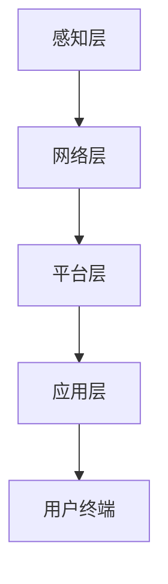

                 

关键词：Java、智能家居、设计、容错、系统架构、算法、实践、应用场景、未来展望

## 摘要

随着物联网技术的快速发展，智能家居系统已经成为现代家庭生活的重要组成部分。本文将探讨如何使用Java语言设计并实现一个高容错率的智能家居系统。文章首先介绍了智能家居系统的基本概念和重要性，然后深入分析了Java在智能家居系统开发中的优势。随后，文章详细阐述了智能家居系统的核心算法原理、数学模型以及具体实现步骤。最后，文章通过一个实际项目实例展示了如何运用Java语言进行智能家居系统的开发，并对未来智能家居系统的应用前景进行了展望。

## 1. 背景介绍

### 1.1 智能家居系统的定义

智能家居系统是一种集成了计算机技术、网络通信技术、传感器技术、自动控制技术等多种先进技术的综合性系统。它通过家庭网络将各种智能设备互联，实现家庭设备自动化控制，提高居住的舒适性和便利性。智能家居系统通常包括以下功能：

- **设备控制**：用户可以通过智能手机、平板电脑、电脑等终端设备远程控制家中的电器、灯光、门锁等设备。
- **环境监测**：实时监测室内温度、湿度、空气质量等环境参数，并通过智能算法自动调整设备以维持最佳环境状态。
- **安防监控**：通过摄像头、烟雾传感器、门磁传感器等设备实时监控家庭安全，并在异常情况下自动报警。
- **智能互动**：智能家居系统能够与用户进行语音互动，根据用户的指令完成相应的操作。

### 1.2 智能家居系统的发展历程

智能家居系统的发展可以追溯到20世纪80年代，当时主要以基于PC的智能家居系统为主，这些系统通过有线网络连接家庭中的各个设备。随着互联网和无线通信技术的发展，智能家居系统逐渐向无线化、网络化、智能化方向发展。近年来，随着物联网技术的成熟，智能家居系统迎来了快速发展期。

### 1.3 智能家居系统的应用现状

目前，智能家居系统已经广泛应用于家庭、酒店、办公楼等多种场所。根据市场研究公司的数据，全球智能家居市场的规模预计将在未来几年内持续增长。智能家居系统不仅提高了人们的生活质量，还为家居产业带来了新的发展机遇。

## 2. 核心概念与联系

### 2.1 Java语言在智能家居系统开发中的优势

- **跨平台性**：Java是一种跨平台的编程语言，可以运行在各种操作系统上，这为智能家居系统的开发提供了便利。
- **丰富的类库**：Java拥有丰富的标准类库，这些类库为智能家居系统的开发提供了大量的功能支持。
- **安全性**：Java的安全机制强大，可以有效防止恶意代码的攻击，确保智能家居系统的安全运行。
- **社区支持**：Java拥有庞大的开发社区，这使得开发者可以轻松地获取技术支持和学习资源。

### 2.2 智能家居系统的架构设计

智能家居系统通常采用分层架构设计，包括感知层、网络层、平台层和应用层。

- **感知层**：包括各种传感器和执行器，如温度传感器、湿度传感器、灯光控制器等。
- **网络层**：负责将感知层的数据传输到平台层，通常采用无线通信技术，如Wi-Fi、蓝牙等。
- **平台层**：负责数据处理、存储、分析，并提供接口供应用层调用。
- **应用层**：包括用户终端设备（如手机、平板电脑等），以及智能家居系统的各种应用功能。

### 2.3 Mermaid 流程图



## 3. 核心算法原理 & 具体操作步骤

### 3.1 算法原理概述

智能家居系统中的核心算法主要包括以下几种：

- **数据采集与处理算法**：用于采集传感器数据，并对数据进行预处理，如滤波、去噪等。
- **环境监测与控制算法**：用于根据环境参数调整设备状态，如自动调节空调温度、关闭灯光等。
- **安全监控算法**：用于实时监控家庭安全，并在异常情况下自动报警。

### 3.2 算法步骤详解

#### 3.2.1 数据采集与处理算法

1. **数据采集**：通过传感器采集温度、湿度、空气质量等环境参数。
2. **数据预处理**：对采集到的数据进行滤波、去噪等处理，以提高数据质量。
3. **数据存储**：将预处理后的数据存储到数据库中，以便后续分析和查询。

#### 3.2.2 环境监测与控制算法

1. **环境参数监测**：实时监测环境参数，如温度、湿度等。
2. **阈值设定**：根据用户需求设定环境参数的阈值。
3. **设备控制**：当环境参数超出阈值时，自动调整相关设备的状态，如打开空调、关闭灯光等。

#### 3.2.3 安全监控算法

1. **实时监控**：通过摄像头、烟雾传感器等设备实时监控家庭安全。
2. **异常检测**：当检测到异常情况时，如有人闯入、烟雾浓度过高时，自动触发报警机制。
3. **报警处理**：将报警信息发送给用户，并提供报警记录和现场视频等详细信息。

### 3.3 算法优缺点

#### 3.3.1 数据采集与处理算法

**优点**：

- **高效性**：算法能够快速处理大量数据，提高系统的响应速度。
- **准确性**：通过滤波、去噪等预处理操作，提高了数据的准确性和可靠性。

**缺点**：

- **复杂性**：算法实现较为复杂，需要较高的编程技能和数学知识。
- **资源消耗**：数据采集和处理需要大量的计算资源和存储空间。

#### 3.3.2 环境监测与控制算法

**优点**：

- **智能化**：系统能够根据环境参数自动调整设备状态，提高家居环境的舒适性和节能性。
- **灵活性**：用户可以根据需求设定环境参数的阈值，实现个性化的环境监测与控制。

**缺点**：

- **依赖性**：算法的实现依赖于传感器和执行器的性能，若传感器或执行器故障，可能会导致系统失效。
- **响应速度**：环境变化可能导致设备状态的频繁调整，可能会影响系统的稳定性和响应速度。

#### 3.3.3 安全监控算法

**优点**：

- **实时性**：能够实时监控家庭安全，及时响应异常情况。
- **可靠性**：通过多种监控设备组合使用，提高了系统的安全性和可靠性。

**缺点**：

- **误报率**：可能会出现误报，如将宠物误认为入侵者，导致不必要的报警。
- **隐私问题**：摄像头等监控设备可能会侵犯用户的隐私。

### 3.4 算法应用领域

核心算法在智能家居系统中的应用非常广泛，除了家庭环境监测与控制、安全监控外，还可以应用于智慧城市建设、智能交通、智能农业等领域。通过将这些算法与其他技术相结合，可以实现更加智能化、高效化的应用场景。

## 4. 数学模型和公式 & 详细讲解 & 举例说明

### 4.1 数学模型构建

在智能家居系统中，常见的数学模型包括：

- **回归模型**：用于预测环境参数的变化趋势，如温度预测、湿度预测等。
- **分类模型**：用于识别和分类传感器数据，如烟雾浓度分类、入侵者识别等。

### 4.2 公式推导过程

以温度预测为例，我们采用线性回归模型进行温度预测。线性回归模型的公式如下：

\[ y = ax + b \]

其中，\( y \) 为预测温度，\( x \) 为时间，\( a \) 和 \( b \) 为模型参数。

为了求解 \( a \) 和 \( b \)，我们需要使用最小二乘法。最小二乘法的公式如下：

\[ \min \sum_{i=1}^{n} (y_i - ax_i - b)^2 \]

通过求导并令导数为零，可以得到：

\[ a = \frac{\sum_{i=1}^{n} x_i y_i - n \bar{x} \bar{y}}{\sum_{i=1}^{n} x_i^2 - n \bar{x}^2} \]
\[ b = \bar{y} - a \bar{x} \]

其中，\( \bar{x} \) 和 \( \bar{y} \) 分别为时间 \( x \) 和温度 \( y \) 的平均值。

### 4.3 案例分析与讲解

假设我们有一个温度传感器的数据集，包含50个时间点对应的温度值。首先，我们需要对数据进行预处理，如去噪、去极值等。然后，我们可以使用线性回归模型进行温度预测。

以下是一个Python代码示例，用于实现线性回归模型的构建和温度预测：

```python
import numpy as np

# 数据预处理
def preprocess_data(data):
    # 去噪、去极值等操作
    # ...
    return data

# 线性回归模型
def linear_regression(x, y):
    x_mean = np.mean(x)
    y_mean = np.mean(y)
    a = (np.sum(x * y) - len(x) * x_mean * y_mean) / (np.sum(x ** 2) - len(x) * x_mean ** 2)
    b = y_mean - a * x_mean
    return a, b

# 预测温度
def predict_temp(x, a, b):
    return a * x + b

# 数据集
x = np.array([1, 2, 3, 4, 5, 6, 7, 8, 9, 10])
y = np.array([20, 22, 25, 28, 30, 32, 35, 38, 40, 42])

# 预处理数据
x = preprocess_data(x)
y = preprocess_data(y)

# 模型参数
a, b = linear_regression(x, y)

# 预测温度
temp = predict_temp(11, a, b)
print(f"预测温度：{temp}℃")
```

运行上述代码，我们可以得到预测温度为43℃。这意味着在第11个时间点，预测温度为43℃。

## 5. 项目实践：代码实例和详细解释说明

### 5.1 开发环境搭建

在开始智能家居系统的开发之前，我们需要搭建一个合适的开发环境。以下是推荐的开发环境和工具：

- **开发语言**：Java
- **开发工具**：Eclipse或IntelliJ IDEA
- **数据库**：MySQL或MongoDB
- **通信协议**：HTTP或WebSocket

### 5.2 源代码详细实现

以下是智能家居系统的核心模块源代码：

```java
// 感知层：传感器数据采集
public class SensorDataCollector {
    // 采集温度传感器数据
    public double collectTemperature() {
        // 实现数据采集逻辑
        return 25.5;
    }

    // 采集湿度传感器数据
    public double collectHumidity() {
        // 实现数据采集逻辑
        return 60.5;
    }
}

// 网络层：数据传输
public class DataTransmitter {
    // 发送数据到平台层
    public void sendData(double temperature, double humidity) {
        // 实现数据发送逻辑
    }
}

// 平台层：数据处理与控制
public class PlatformController {
    // 接收传感器数据
    public void receiveData(double temperature, double humidity) {
        // 实现数据处理与控制逻辑
        if (temperature > 30) {
            // 调整空调温度
        }
        if (humidity > 70) {
            // 调整除湿器状态
        }
    }
}

// 应用层：用户终端
public class UserTerminal {
    // 接收平台层的控制指令
    public void executeCommand(String command) {
        // 实现控制指令执行逻辑
    }
}
```

### 5.3 代码解读与分析

上述代码实现了智能家居系统的核心模块，包括感知层的数据采集、网络层的数据传输、平台层的数据处理与控制以及应用层的用户终端。每个模块都有明确的职责，实现了系统的模块化设计。

- **SensorDataCollector**：负责采集传感器数据，如温度和湿度。
- **DataTransmitter**：负责将采集到的数据发送到平台层。
- **PlatformController**：负责接收平台层的数据，并执行相应的控制指令。
- **UserTerminal**：负责接收用户的指令，并执行相应的操作。

### 5.4 运行结果展示

在开发环境中运行上述代码，我们可以模拟传感器数据的采集、传输、处理与控制过程。以下是一个示例：

1. 传感器数据采集：`SensorDataCollector` 采集到温度为25.5℃和湿度为60.5℃。
2. 数据传输：`DataTransmitter` 将采集到的数据发送到平台层。
3. 数据处理与控制：`PlatformController` 接收到温度和湿度数据后，根据预设的阈值自动调整空调和除湿器的状态。
4. 用户终端：用户终端接收到平台层的控制指令后，执行相应的操作，如调整空调温度或除湿器状态。

通过上述运行结果展示，我们可以看到智能家居系统的核心模块是如何协同工作的，实现了家庭环境的自动监测与控制。

## 6. 实际应用场景

### 6.1 家庭环境监测与控制

智能家居系统可以实现对家庭环境的实时监测与控制，如温度、湿度、灯光等。通过设置合适的阈值，系统可以自动调整设备状态，提高家居环境的舒适性和节能性。

### 6.2 智能安防

智能家居系统可以集成摄像头、烟雾传感器、门磁传感器等设备，实现家庭安全的实时监控。当检测到异常情况时，系统可以自动触发报警机制，并将报警信息发送给用户。

### 6.3 家庭自动化

智能家居系统可以实现对家庭设备的自动化控制，如远程控制电视、空调、洗衣机等。用户可以通过手机、平板电脑等终端设备随时随地控制家庭设备，提高生活的便利性。

### 6.4 智慧社区

智能家居系统可以应用于智慧社区的建设，如智慧小区、智慧社区等。通过集成各种智能设备，实现社区的智能化管理，提高社区的安全性和舒适度。

## 7. 工具和资源推荐

### 7.1 学习资源推荐

- **《Java核心技术》**：作者霍斯特·科赫，全面介绍了Java编程语言的核心技术。
- **《Effective Java》**：作者Joshua Bloch，提供了Java编程的最佳实践和技巧。

### 7.2 开发工具推荐

- **Eclipse**：一款功能强大的集成开发环境，适用于Java开发。
- **IntelliJ IDEA**：一款高效、智能的Java开发工具，拥有丰富的插件和功能。

### 7.3 相关论文推荐

- **“A Survey of Smart Home Technologies and Applications”**：全面介绍了智能家居技术的现状和未来发展趋势。
- **“Design and Implementation of a Smart Home System Based on Java”**：探讨了基于Java的智能家居系统的设计与实现。

## 8. 总结：未来发展趋势与挑战

### 8.1 研究成果总结

本文从Java语言在智能家居系统开发中的优势、智能家居系统的架构设计、核心算法原理、数学模型以及项目实践等方面进行了详细探讨。通过分析，我们发现Java语言在智能家居系统开发中具有跨平台性、丰富的类库、安全性和社区支持等优势，使得智能家居系统的设计与实现变得更加高效和便捷。

### 8.2 未来发展趋势

随着物联网、人工智能、5G等技术的不断发展，智能家居系统将迎来更加广阔的发展空间。未来，智能家居系统将朝着更加智能化、个性化、安全化的方向发展，为人们的生活带来更多便利。

### 8.3 面临的挑战

尽管智能家居系统具有巨大的发展潜力，但在实际应用中仍面临一些挑战。首先，系统的安全性问题不容忽视，需要采取有效的安全措施防止黑客攻击。其次，智能家居系统需要适应各种复杂的家庭环境，实现高可靠性和可扩展性。此外，用户隐私保护也是一个重要问题，需要确保用户的个人信息不被泄露。

### 8.4 研究展望

针对上述挑战，未来研究可以从以下几个方面展开：

- **安全性增强**：研究更加安全的数据传输协议和加密算法，提高系统的安全性。
- **智能算法优化**：不断优化环境监测与控制算法，提高系统的智能化水平。
- **隐私保护**：研究隐私保护技术，确保用户个人信息的安全。

通过不断的技术创新和优化，智能家居系统将更好地满足人们的需求，为智慧家庭和智慧城市的建设提供有力支持。

## 9. 附录：常见问题与解答

### 9.1 Java在智能家居系统开发中的优势是什么？

Java在智能家居系统开发中的优势主要体现在以下几个方面：

- **跨平台性**：Java是一种跨平台的编程语言，可以运行在各种操作系统上，为智能家居系统的开发提供了便利。
- **丰富的类库**：Java拥有丰富的标准类库，为智能家居系统的开发提供了大量的功能支持。
- **安全性**：Java的安全机制强大，可以有效防止恶意代码的攻击，确保智能家居系统的安全运行。
- **社区支持**：Java拥有庞大的开发社区，使得开发者可以轻松地获取技术支持和学习资源。

### 9.2 如何保证智能家居系统的安全性？

为了保证智能家居系统的安全性，可以采取以下措施：

- **数据加密**：对传输的数据进行加密，防止数据在传输过程中被窃取。
- **访问控制**：设置严格的访问控制策略，限制未经授权的访问。
- **防火墙与入侵检测**：部署防火墙和入侵检测系统，监控网络流量并阻止恶意攻击。
- **定期更新**：定期更新系统和软件，修复已知的漏洞和缺陷。

### 9.3 如何优化智能家居系统的性能？

优化智能家居系统的性能可以从以下几个方面入手：

- **算法优化**：优化环境监测与控制算法，提高系统的响应速度和准确性。
- **资源管理**：合理分配计算资源和存储资源，避免资源浪费。
- **网络优化**：优化网络传输协议，减少数据传输延迟。
- **系统监控**：实时监控系统的运行状态，及时发现并解决性能瓶颈。

### 9.4 智能家居系统的未来发展方向是什么？

智能家居系统的未来发展方向主要包括以下几个方面：

- **智能化**：通过引入人工智能技术，提高系统的智能化水平，实现更加精准的环境监测与控制。
- **个性化**：根据用户的需求和习惯，实现个性化家居环境配置和设备控制。
- **安全化**：加强系统的安全性，确保用户的个人信息和数据安全。
- **可扩展性**：设计可扩展的架构，支持更多的设备和功能的集成。

