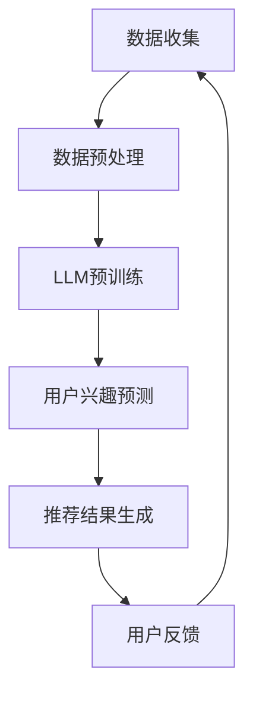

                 

关键词：自然语言处理、推荐系统、兴趣分布、LLM、机器学习

摘要：随着互联网的快速发展，推荐系统已经成为提高用户体验、提升业务价值的重要手段。然而，传统的推荐系统往往难以准确估计用户的兴趣分布，导致推荐结果不够精准。本文将探讨一种基于大型语言模型（LLM）的推荐系统用户兴趣分布估计方法，通过深入分析算法原理、数学模型、项目实践，为推荐系统的研究和应用提供新的思路。

## 1. 背景介绍

推荐系统是一种信息过滤技术，旨在根据用户的兴趣和偏好，向用户推荐他们可能感兴趣的内容。传统的推荐系统主要基于协同过滤、基于内容的方法，虽然在一定程度上能够满足用户的个性化需求，但在处理复杂用户兴趣分布时存在一定的局限性。

近年来，随着自然语言处理（NLP）和机器学习技术的发展，大型语言模型（LLM）如GPT、BERT等在各个领域取得了显著成果。LLM具有强大的语义理解和生成能力，能够处理复杂的文本数据，为推荐系统用户兴趣分布估计提供了新的可能性。

本文将介绍一种基于LLM的推荐系统用户兴趣分布估计方法，通过深入分析算法原理、数学模型、项目实践，探讨如何利用LLM实现用户兴趣分布的准确估计，从而提高推荐系统的性能和用户体验。

## 2. 核心概念与联系

### 2.1 大型语言模型（LLM）

大型语言模型（LLM）是一种基于深度学习的自然语言处理模型，通过大规模语料库的预训练，能够理解并生成自然语言。LLM具有强大的语义理解和生成能力，可以处理复杂的文本数据，从而为推荐系统提供有效的用户兴趣分布估计。

### 2.2 推荐系统

推荐系统是一种基于用户兴趣和偏好，向用户推荐他们可能感兴趣的内容的系统。推荐系统的核心目标是提高用户的满意度和参与度，从而提升业务价值。

### 2.3 用户兴趣分布

用户兴趣分布是指用户在不同领域、不同主题上的兴趣程度。准确估计用户兴趣分布对于推荐系统的性能至关重要，它可以帮助系统更好地理解用户需求，提供更加精准的推荐结果。

### 2.4 Mermaid 流程图

以下是一个基于LLM的推荐系统用户兴趣分布估计的Mermaid流程图：

## 3. 核心算法原理 & 具体操作步骤

### 3.1 算法原理概述

基于LLM的推荐系统用户兴趣分布估计方法主要包括以下步骤：

1. 数据收集：收集用户的兴趣标签、浏览记录、搜索历史等数据。
2. 数据预处理：对收集到的数据进行分析和清洗，为LLM预训练提供高质量的数据集。
3. LLM预训练：利用大规模语料库对LLM进行预训练，使其具备强大的语义理解和生成能力。
4. 用户兴趣预测：通过LLM预测用户在不同领域、不同主题上的兴趣程度，生成用户兴趣分布。
5. 推荐结果生成：根据用户兴趣分布，生成个性化的推荐结果。
6. 用户反馈：收集用户的反馈信息，用于优化推荐系统。

### 3.2 算法步骤详解

1. 数据收集：

   收集用户的兴趣标签、浏览记录、搜索历史等数据，这些数据可以从用户行为日志、社交媒体数据、电商平台数据等渠道获取。

2. 数据预处理：

   对收集到的数据进行清洗、去重、去噪等处理，以消除数据中的噪声和异常值。同时，将不同类型的数据进行统一编码，如将用户兴趣标签转换为数值，将文本数据转换为词向量等。

3. LLM预训练：

   利用大规模语料库对LLM进行预训练。预训练过程主要包括以下步骤：

   - 数据准备：将预处理后的数据集划分为训练集、验证集和测试集。
   - 模型构建：选择合适的LLM架构，如GPT、BERT等，并配置相应的超参数。
   - 模型训练：使用训练集对模型进行训练，并使用验证集对模型进行调优。
   - 模型评估：使用测试集对模型进行评估，以验证模型的性能。

4. 用户兴趣预测：

   通过LLM预测用户在不同领域、不同主题上的兴趣程度。具体步骤如下：

   - 预处理输入数据：将用户的历史数据输入到LLM中，进行预处理，如分词、词向量编码等。
   - 生成兴趣分布：利用预训练好的LLM，对输入数据进行编码，并生成用户兴趣分布。
   - 模型优化：根据用户反馈，对LLM进行优化，以提高用户兴趣预测的准确性。

5. 推荐结果生成：

   根据用户兴趣分布，生成个性化的推荐结果。具体步骤如下：

   - 数据准备：将用户兴趣分布与推荐内容库进行匹配，获取与用户兴趣相关的推荐内容。
   - 推荐策略：根据推荐策略，如基于内容的推荐、基于协同过滤的推荐等，生成推荐结果。
   - 结果展示：将推荐结果呈现给用户，供用户浏览和选择。

6. 用户反馈：

   收集用户的反馈信息，用于优化推荐系统。具体步骤如下：

   - 数据收集：记录用户的点击、点赞、分享等行为数据。
   - 数据分析：对用户反馈进行分析，以了解用户的喜好和需求。
   - 系统优化：根据用户反馈，对推荐系统进行优化，提高推荐效果。

### 3.3 算法优缺点

**优点：**

1. 强大的语义理解和生成能力：LLM能够处理复杂的文本数据，提取用户兴趣的关键信息，提高用户兴趣预测的准确性。
2. 适应性强：LLM可以应用于各种场景，如电商平台、社交媒体、新闻推荐等，具有广泛的适用性。
3. 可扩展性：LLM可以通过预训练和微调，适应不同的用户群体和推荐场景。

**缺点：**

1. 计算资源需求大：LLM的预训练和推理过程需要大量的计算资源，对硬件设备有较高的要求。
2. 数据质量要求高：LLM的性能依赖于输入数据的质

