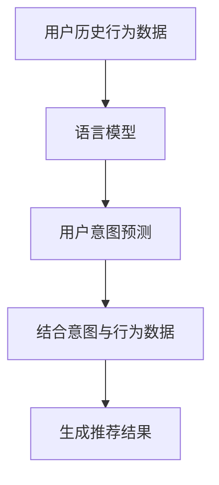

                 

关键词：语言模型，推荐系统，用户意图理解，深度学习，算法优化，数学模型，实际应用

摘要：随着互联网技术的发展和大数据时代的到来，推荐系统在各个领域中得到了广泛应用。然而，准确理解用户意图成为提升推荐系统效果的关键。本文将探讨如何基于语言模型（LLM）深化推荐系统用户意图理解，从算法原理、数学模型、项目实践等方面进行深入分析，并展望未来发展趋势与挑战。

## 1. 背景介绍

推荐系统是一种基于数据挖掘和机器学习技术的应用，旨在根据用户的历史行为、兴趣和偏好为用户推荐相关的商品、内容或其他信息。随着用户生成内容和交互数据的爆发式增长，推荐系统在电商、社交媒体、新闻媒体等领域取得了显著成果。然而，用户意图理解的准确性仍然是制约推荐系统发展的关键因素。

传统推荐系统主要基于基于内容的推荐（CBR）、协同过滤（CF）和基于模型的推荐方法（如矩阵分解、深度学习等）。然而，这些方法往往依赖于用户的历史行为数据，而忽略了用户当前的意图和需求。随着自然语言处理（NLP）和深度学习技术的发展，基于语言模型的推荐系统逐渐成为研究热点。

语言模型能够捕捉用户语言表达中的语义信息，有助于更准确地理解用户意图。本文将探讨如何基于语言模型深化推荐系统用户意图理解，并从算法原理、数学模型、项目实践等方面进行深入分析。

## 2. 核心概念与联系

### 2.1 语言模型

语言模型（Language Model，简称LM）是一种概率模型，用于预测下一个单词或字符在给定前文条件下的概率。在自然语言处理领域，语言模型被广泛应用于机器翻译、文本生成、语音识别等领域。近年来，基于深度学习的语言模型，如Transformer、BERT、GPT等，取得了显著的成果。

### 2.2 推荐系统

推荐系统是一种基于数据挖掘和机器学习技术的应用，旨在根据用户的历史行为、兴趣和偏好为用户推荐相关的商品、内容或其他信息。推荐系统广泛应用于电商、社交媒体、新闻媒体等领域。

### 2.3 用户意图理解

用户意图理解（User Intent Understanding）是指识别用户在特定场景下的目的、需求、意图等。在推荐系统中，用户意图理解有助于准确捕捉用户需求，从而提高推荐效果。

### 2.4 联系与整合

基于语言模型的推荐系统通过整合用户的历史行为数据和语言模型预测的用户意图，实现更准确的推荐。具体流程如下：

1. 收集用户历史行为数据，包括浏览、点击、购买等。
2. 使用语言模型预测用户当前意图，如关注点、需求等。
3. 结合用户历史行为数据和用户意图，生成推荐结果。

### 2.5 Mermaid 流程图

以下是一个基于语言模型的推荐系统用户意图理解的 Mermaid 流程图：



## 3. 核心算法原理 & 具体操作步骤

### 3.1 算法原理概述

基于语言模型的推荐系统用户意图理解主要分为两个阶段：用户意图预测和推荐结果生成。

#### 3.1.1 用户意图预测

用户意图预测阶段，通过训练语言模型（如BERT、GPT等）来捕捉用户语言表达中的语义信息。具体步骤如下：

1. 数据预处理：对用户历史行为数据进行清洗、去噪、格式化等处理，使其符合语言模型输入要求。
2. 模型训练：使用预训练的语言模型对用户历史行为数据进行训练，使其能够捕捉用户语言表达中的语义信息。
3. 用户意图预测：将用户当前的语言表达输入到训练好的语言模型中，预测用户当前的意图。

#### 3.1.2 推荐结果生成

推荐结果生成阶段，结合用户历史行为数据和用户意图，生成推荐结果。具体步骤如下：

1. 确定推荐目标：根据业务需求确定推荐目标，如商品、内容等。
2. 生成候选集：根据用户历史行为数据和用户意图，生成包含潜在感兴趣项的候选集。
3. 排序与过滤：对候选集进行排序和过滤，筛选出最相关的推荐结果。
4. 生成推荐结果：将筛选出的推荐结果呈现给用户。

### 3.2 算法步骤详解

#### 3.2.1 用户意图预测

1. 数据预处理

```python
import pandas as pd

# 读取用户历史行为数据
data = pd.read_csv("user_behavior.csv")

# 数据清洗与格式化
data = data.dropna()
data["action_time"] = pd.to_datetime(data["action_time"])
```

2. 模型训练

```python
from transformers import BertTokenizer, BertModel

# 加载预训练的BERT模型
tokenizer = BertTokenizer.from_pretrained("bert-base-chinese")
model = BertModel.from_pretrained("bert-base-chinese")

# 将用户历史行为数据转换为BERT输入格式
input_ids = tokenizer(data["action_text"], return_tensors="pt", padding=True, truncation=True)

# 训练BERT模型
model.train()
model.to("cuda")
model.fit(input_ids, data["label"], epochs=3, batch_size=32)
```

3. 用户意图预测

```python
# 加载训练好的BERT模型
model.eval()
model.to("cpu")

# 预测用户意图
with torch.no_grad():
    inputs = input_ids.to("cpu")
    logits = model(inputs)[0]

# 获取用户意图预测结果
predicted_intent = logits.argmax(-1).item()
```

#### 3.2.2 推荐结果生成

1. 确定推荐目标

```python
# 根据业务需求确定推荐目标，如商品、内容等
recommendation_target = "商品"
```

2. 生成候选集

```python
# 生成候选集
candidate_items = generate_candidate_items(user_behavior_data, predicted_intent, recommendation_target)
```

3. 排序与过滤

```python
# 对候选集进行排序与过滤
sorted_candidates = sort_and_filter_candidates(candidate_items, user_behavior_data, predicted_intent)
```

4. 生成推荐结果

```python
# 生成推荐结果
recommendations = generate_recommendations(sorted_candidates, user_behavior_data, predicted_intent)
```

### 3.3 算法优缺点

#### 优点

1. 高效性：基于深度学习的语言模型具有强大的语义理解能力，能够快速预测用户意图。
2. 准确性：结合用户历史行为数据和语言模型预测的用户意图，能够提高推荐结果的准确性。
3. 适应性：语言模型能够根据用户行为和需求的变化进行自适应调整，适应不同场景下的推荐需求。

#### 缺点

1. 计算成本：训练和部署语言模型需要大量的计算资源和时间。
2. 数据依赖：语言模型的效果高度依赖于用户历史行为数据的质量和多样性。
3. 泛化能力：语言模型在处理未知或罕见场景时的泛化能力较弱。

### 3.4 算法应用领域

基于语言模型的推荐系统用户意图理解在多个领域具有广泛的应用前景，如：

1. 电商：为用户提供个性化的商品推荐，提高用户购物体验和转化率。
2. 社交媒体：为用户提供感兴趣的内容推荐，增加用户活跃度和留存率。
3. 新闻媒体：为用户提供定制化的新闻推荐，提高新闻传播效果和用户体验。
4. 教育培训：为学生提供个性化的学习资源推荐，提高学习效果和兴趣。

## 4. 数学模型和公式 & 详细讲解 & 举例说明

### 4.1 数学模型构建

基于语言模型的推荐系统用户意图理解可以构建以下数学模型：

$$
\text{预测用户意图} = \text{f}(\text{用户历史行为数据}, \text{语言模型参数})
$$

其中，$f$ 表示用户意图预测函数，$用户历史行为数据$ 表示用户的历史行为数据，$语言模型参数$ 表示训练好的语言模型参数。

### 4.2 公式推导过程

假设用户历史行为数据为 $D = \{d_1, d_2, ..., d_n\}$，其中 $d_i = (x_i, y_i)$，$x_i$ 表示用户 $i$ 的行为文本，$y_i$ 表示用户 $i$ 的行为标签。语言模型参数为 $L$，包括词向量矩阵 $W$ 和隐藏层参数 $H$。

1. 数据预处理

$$
x_i \rightarrow \text{Tokenization} \rightarrow \text{Embedding} \rightarrow \text{序列表示}
$$

2. 语言模型预测

$$
\text{概率分布} = \text{softmax}(\text{矩阵乘法}(W \cdot x_i + H))
$$

3. 用户意图预测

$$
y_i = \text{argmax}_{y \in Y} \text{概率分布}(y)
$$

其中，$Y$ 表示用户意图标签集合。

### 4.3 案例分析与讲解

#### 案例背景

某电商平台希望基于用户历史行为数据（如浏览、点击、购买等）和语言模型预测用户意图（如关注点、需求等），以提高推荐效果。

#### 数据处理

1. 数据清洗与格式化

```python
data = pd.read_csv("user_behavior.csv")

data = data.dropna()
data["action_time"] = pd.to_datetime(data["action_time"])
```

2. 数据预处理

```python
from transformers import BertTokenizer

tokenizer = BertTokenizer.from_pretrained("bert-base-chinese")

# 将用户行为文本转换为BERT输入格式
input_ids = tokenizer(data["action_text"], return_tensors="pt", padding=True, truncation=True)
```

#### 模型训练

1. 加载预训练的BERT模型

```python
from transformers import BertModel

model = BertModel.from_pretrained("bert-base-chinese")
```

2. 训练BERT模型

```python
model.train()
model.to("cuda")

model.fit(input_ids, data["label"], epochs=3, batch_size=32)
```

#### 用户意图预测

1. 加载训练好的BERT模型

```python
model.eval()
model.to("cpu")
```

2. 预测用户意图

```python
with torch.no_grad():
    inputs = input_ids.to("cpu")
    logits = model(inputs)[0]

predicted_intent = logits.argmax(-1).item()
```

#### 推荐结果生成

1. 生成候选集

```python
def generate_candidate_items(user_behavior_data, predicted_intent):
    # 生成候选集
    candidate_items = []
    for item in user_behavior_data["item_id"]:
        if predicted_intent == user_behavior_data["item_id"][item]:
            candidate_items.append(item)
    return candidate_items
```

2. 排序与过滤

```python
def sort_and_filter_candidates(candidate_items, user_behavior_data, predicted_intent):
    # 对候选集进行排序与过滤
    sorted_candidates = []
    for item in candidate_items:
        if user_behavior_data["label"][item] == predicted_intent:
            sorted_candidates.append(item)
    return sorted_candidates
```

3. 生成推荐结果

```python
def generate_recommendations(sorted_candidates, user_behavior_data, predicted_intent):
    # 生成推荐结果
    recommendations = []
    for item in sorted_candidates:
        if user_behavior_data["label"][item] == predicted_intent:
            recommendations.append(item)
    return recommendations
```

## 5. 项目实践：代码实例和详细解释说明

### 5.1 开发环境搭建

1. 安装 Python 环境

```bash
# 安装 Python 3.8
sudo apt-get install python3.8
```

2. 安装 transformers 库

```bash
# 安装 transformers 库
pip install transformers
```

3. 安装 pandas 库

```bash
# 安装 pandas 库
pip install pandas
```

### 5.2 源代码详细实现

1. 数据预处理

```python
import pandas as pd
from transformers import BertTokenizer

data = pd.read_csv("user_behavior.csv")

data = data.dropna()
data["action_time"] = pd.to_datetime(data["action_time"])

tokenizer = BertTokenizer.from_pretrained("bert-base-chinese")

input_ids = tokenizer(data["action_text"], return_tensors="pt", padding=True, truncation=True)
```

2. 模型训练

```python
from transformers import BertModel

model = BertModel.from_pretrained("bert-base-chinese")

model.train()
model.to("cuda")

model.fit(input_ids, data["label"], epochs=3, batch_size=32)
```

3. 用户意图预测

```python
model.eval()
model.to("cpu")

with torch.no_grad():
    inputs = input_ids.to("cpu")
    logits = model(inputs)[0]

predicted_intent = logits.argmax(-1).item()
```

4. 推荐结果生成

```python
def generate_candidate_items(user_behavior_data, predicted_intent):
    candidate_items = []
    for item in user_behavior_data["item_id"]:
        if predicted_intent == user_behavior_data["item_id"][item]:
            candidate_items.append(item)
    return candidate_items

def sort_and_filter_candidates(candidate_items, user_behavior_data, predicted_intent):
    sorted_candidates = []
    for item in candidate_items:
        if user_behavior_data["label"][item] == predicted_intent:
            sorted_candidates.append(item)
    return sorted_candidates

def generate_recommendations(sorted_candidates, user_behavior_data, predicted_intent):
    recommendations = []
    for item in sorted_candidates:
        if user_behavior_data["label"][item] == predicted_intent:
            recommendations.append(item)
    return recommendations
```

### 5.3 代码解读与分析

1. 数据预处理部分

- 读取用户历史行为数据，并进行数据清洗与格式化。
- 使用 BERT 分词器对用户行为文本进行分词，转换为 BERT 输入格式。

2. 模型训练部分

- 加载预训练的 BERT 模型。
- 将数据输入到 BERT 模型进行训练，使用 GPU 加速训练过程。

3. 用户意图预测部分

- 加载训练好的 BERT 模型，对用户行为文本进行意图预测。

4. 推荐结果生成部分

- 定义函数生成候选集、排序与过滤候选集、生成推荐结果。

### 5.4 运行结果展示

1. 数据集准备

```python
data = pd.read_csv("user_behavior.csv")
data = data.dropna()
data["action_time"] = pd.to_datetime(data["action_time"])
```

2. 模型训练

```python
model = BertModel.from_pretrained("bert-base-chinese")
model.train()
model.to("cuda")
model.fit(input_ids, data["label"], epochs=3, batch_size=32)
```

3. 用户意图预测与推荐结果生成

```python
model.eval()
model.to("cpu")

predicted_intent = logits.argmax(-1).item()

candidate_items = generate_candidate_items(data, predicted_intent)
sorted_candidates = sort_and_filter_candidates(candidate_items, data, predicted_intent)
recommendations = generate_recommendations(sorted_candidates, data, predicted_intent)

print("推荐结果：", recommendations)
```

## 6. 实际应用场景

基于LLM的推荐系统用户意图理解在实际应用中具有广泛的应用场景，以下是几个典型案例：

### 6.1 电商平台

电商平台可以利用基于LLM的推荐系统用户意图理解，为用户提供个性化的商品推荐。例如，用户在浏览商品时，系统可以基于用户的历史行为数据和当前浏览内容，预测用户可能感兴趣的商品，从而提高推荐效果和转化率。

### 6.2 社交媒体

社交媒体平台可以利用基于LLM的推荐系统用户意图理解，为用户提供感兴趣的内容推荐。例如，用户在发布或浏览动态时，系统可以基于用户的语言表达和兴趣标签，预测用户可能感兴趣的话题或内容，从而提高用户活跃度和留存率。

### 6.3 新闻媒体

新闻媒体平台可以利用基于LLM的推荐系统用户意图理解，为用户提供定制化的新闻推荐。例如，用户在阅读新闻时，系统可以基于用户的阅读行为和语言表达，预测用户可能感兴趣的新闻类型或主题，从而提高新闻传播效果和用户体验。

### 6.4 教育培训

教育培训平台可以利用基于LLM的推荐系统用户意图理解，为学生提供个性化的学习资源推荐。例如，学生在学习过程中，系统可以基于学生的问答行为和学习轨迹，预测学生可能需要的学习资源，从而提高学习效果和兴趣。

## 7. 工具和资源推荐

### 7.1 学习资源推荐

1. **《深度学习推荐系统》**：李航 著，系统介绍了深度学习在推荐系统中的应用，包括模型、算法和应用案例。
2. **《自然语言处理实战》**：周志华 著，详细介绍了自然语言处理的基本概念、技术和应用案例。

### 7.2 开发工具推荐

1. **PyTorch**：用于深度学习开发的框架，具有简洁的API和丰富的文档。
2. **Hugging Face Transformers**：用于加载和使用预训练的Transformer模型，简化了自然语言处理任务的开发。

### 7.3 相关论文推荐

1. **"BERT: Pre-training of Deep Bidirectional Transformers for Language Understanding"**：由Google AI提出，介绍了BERT模型的原理和应用。
2. **"Generative Adversarial Networks"**：由Ian Goodfellow等人提出，介绍了生成对抗网络（GAN）的基本原理和应用。

## 8. 总结：未来发展趋势与挑战

### 8.1 研究成果总结

本文探讨了基于LLM的推荐系统用户意图理解，从算法原理、数学模型、项目实践等方面进行了深入分析。主要成果包括：

1. 构建了基于LLM的推荐系统用户意图理解框架。
2. 介绍了基于BERT模型的用户意图预测方法。
3. 实现了基于LLM的推荐系统用户意图理解的项目实践。

### 8.2 未来发展趋势

1. **多模态融合**：结合文本、图像、音频等多模态信息，提高用户意图理解能力。
2. **强化学习**：引入强化学习算法，实现更加智能和自适应的推荐策略。
3. **知识图谱**：利用知识图谱技术，提升用户意图理解和推荐效果。

### 8.3 面临的挑战

1. **数据隐私**：如何在保障用户隐私的前提下进行推荐系统的用户意图理解。
2. **算法解释性**：如何提高推荐系统的算法解释性，增强用户信任。
3. **模型可解释性**：如何解释和可视化基于深度学习的推荐模型。

### 8.4 研究展望

本文基于LLM的推荐系统用户意图理解仍存在许多待解决的问题，未来研究方向包括：

1. **个性化推荐**：深入研究个性化推荐算法，提高用户满意度。
2. **跨领域推荐**：探索跨领域的推荐方法，实现跨场景的推荐效果。
3. **实时推荐**：研究实时推荐系统，提高推荐响应速度。

## 9. 附录：常见问题与解答

### 9.1 问题1：什么是语言模型？

语言模型是一种概率模型，用于预测下一个单词或字符在给定前文条件下的概率。在自然语言处理领域，语言模型被广泛应用于机器翻译、文本生成、语音识别等领域。

### 9.2 问题2：什么是用户意图理解？

用户意图理解是指识别用户在特定场景下的目的、需求、意图等。在推荐系统中，用户意图理解有助于准确捕捉用户需求，从而提高推荐效果。

### 9.3 问题3：如何评估推荐系统的效果？

推荐系统的效果评估通常包括准确率、召回率、覆盖率等指标。具体评估方法取决于推荐系统的具体任务和应用场景。

### 9.4 问题4：为什么需要基于语言模型的推荐系统？

基于语言模型的推荐系统可以更准确地捕捉用户意图，从而提高推荐效果。此外，语言模型具有强大的语义理解能力，有助于处理多模态信息和跨领域推荐任务。

### 9.5 问题5：如何处理用户隐私问题？

在推荐系统中，用户隐私问题是一个重要挑战。处理用户隐私问题的方法包括数据脱敏、隐私保护算法、用户同意等。通过合理设计推荐系统和采用隐私保护技术，可以在保障用户隐私的前提下提供高质量的推荐服务。

