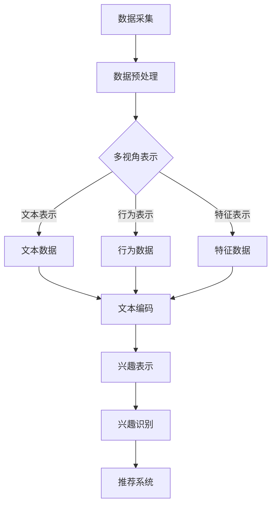

                 

关键词：用户兴趣，多视角表示，大规模语言模型，自然语言处理，机器学习

## 摘要

本文旨在探讨基于大规模语言模型（LLM）的用户兴趣多视角表示学习技术。在当今信息爆炸的时代，用户兴趣的准确识别和理解成为个性化推荐系统、广告投放和社交网络分析等领域的关键。本文首先介绍了用户兴趣识别的背景和重要性，然后详细阐述了基于LLM的多视角表示学习算法原理和实现步骤。通过数学模型和公式推导，本文揭示了算法的核心机制和优势，并通过实际项目实例展示了其应用效果。最后，本文探讨了未来应用场景和面临的挑战，为相关领域的研究和开发提供了参考。

## 1. 背景介绍

随着互联网的普及和信息技术的快速发展，用户在网络世界中产生的数据量呈现指数级增长。如何从海量数据中提取用户兴趣信息，实现对用户的精准识别和个性化推荐，成为众多研究者和企业关注的焦点。传统的用户兴趣识别方法主要基于用户行为数据（如浏览记录、点击行为等）和用户特征数据（如年龄、性别、地理位置等）。然而，这些方法往往存在一定的局限性：

1. **数据依赖性高**：传统方法往往需要大量的用户行为数据，而在某些场景下（如新用户或冷启动问题），行为数据可能不足，导致推荐效果不佳。
2. **特征表示单一**：传统方法通常采用单一的特征表示方式，无法充分捕捉用户兴趣的多样性和复杂性。
3. **算法复杂性**：传统方法在处理大规模数据时，算法复杂度较高，难以高效实现。

为了解决上述问题，本文提出了基于大规模语言模型（LLM）的用户兴趣多视角表示学习技术。LLM作为一种强大的自然语言处理工具，具有以下几个显著优势：

1. **强大的文本理解能力**：LLM能够通过训练大量文本数据，学习到丰富的语言知识和上下文信息，从而对用户生成的内容进行深度理解。
2. **多视角表示能力**：LLM能够同时捕捉用户的文本内容、行为数据和特征数据，实现多视角的用户兴趣表示。
3. **自适应学习能力**：LLM可以根据不同场景和任务需求，自适应调整模型参数，提高推荐系统的效果。

## 2. 核心概念与联系

### 2.1 大规模语言模型（LLM）

大规模语言模型（LLM）是一种基于深度学习的自然语言处理模型，通过训练大量文本数据，学习到语言的统计规律和上下文信息，实现对文本的生成、理解和翻译等功能。常见的LLM包括GPT、BERT、T5等。LLM的工作原理主要包括以下几个步骤：

1. **数据预处理**：对原始文本数据进行清洗、分词、编码等预处理操作，将其转换为模型可处理的格式。
2. **模型训练**：使用大规模文本数据对模型进行训练，通过优化模型参数，使其能够准确预测文本序列。
3. **文本生成与理解**：通过输入新的文本序列，模型可以生成相应的输出文本或理解文本的含义。

### 2.2 多视角表示学习

多视角表示学习是一种将不同来源的数据进行整合，以获得更准确和丰富的数据表示的方法。在用户兴趣识别领域，多视角表示学习可以同时考虑用户的文本内容、行为数据和特征数据，从而实现对用户兴趣的全面捕捉和准确表示。

### 2.3 用户兴趣表示学习

用户兴趣表示学习是将用户的兴趣信息转换为计算机可以处理和理解的向量表示。通过用户兴趣表示学习，我们可以将用户的兴趣特征嵌入到低维空间中，从而方便后续的推荐、分析和挖掘任务。

### 2.4 Mermaid 流程图

下面是用户兴趣多视角表示学习的Mermaid流程图：



## 3. 核心算法原理 & 具体操作步骤

### 3.1 算法原理概述

基于LLM的用户兴趣多视角表示学习算法主要包括以下几个步骤：

1. **数据采集**：从各种渠道收集用户的文本内容、行为数据和特征数据。
2. **数据预处理**：对采集到的数据进行清洗、分词、编码等预处理操作。
3. **多视角表示学习**：利用LLM同时处理文本数据、行为数据和特征数据，生成多视角的用户兴趣表示。
4. **兴趣表示融合**：将不同视角的用户兴趣表示进行融合，生成统一的用户兴趣向量。
5. **兴趣识别与推荐**：利用生成的用户兴趣向量进行兴趣识别和推荐。

### 3.2 算法步骤详解

#### 3.2.1 数据采集

数据采集是用户兴趣识别的第一步，主要包括以下几种数据类型：

1. **文本数据**：用户的评论、帖子、博客等内容。
2. **行为数据**：用户的浏览记录、点击记录、搜索记录等。
3. **特征数据**：用户的性别、年龄、地理位置、兴趣爱好等。

#### 3.2.2 数据预处理

数据预处理主要包括以下步骤：

1. **文本数据预处理**：对文本数据进行分词、去停用词、词性标注等操作，将其转换为模型可处理的格式。
2. **行为数据预处理**：对行为数据进行编码和归一化处理，将其转换为数值形式。
3. **特征数据预处理**：对特征数据进行归一化处理，将其转换为数值形式。

#### 3.2.3 多视角表示学习

多视角表示学习是算法的核心部分，具体步骤如下：

1. **文本数据表示**：利用LLM对文本数据进行编码，生成文本嵌入向量。
2. **行为数据表示**：利用LLM对行为数据进行编码，生成行为嵌入向量。
3. **特征数据表示**：直接将特征数据进行数值化处理，生成特征向量。

#### 3.2.4 兴趣表示融合

兴趣表示融合是将不同视角的用户兴趣表示进行整合，生成统一的用户兴趣向量的过程。具体方法包括：

1. **加权融合**：根据不同视角的重要程度，对各个视角的兴趣表示进行加权融合。
2. **神经网络融合**：利用神经网络模型对各个视角的兴趣表示进行融合。

#### 3.2.5 兴趣识别与推荐

兴趣识别与推荐是算法的最终目标，具体步骤如下：

1. **兴趣识别**：利用生成的用户兴趣向量，对用户感兴趣的内容进行识别。
2. **推荐系统**：根据用户兴趣识别结果，生成个性化推荐列表。

### 3.3 算法优缺点

#### 优点

1. **多视角融合**：能够同时考虑用户的文本内容、行为数据和特征数据，生成更准确的用户兴趣表示。
2. **自适应学习**：能够根据不同场景和任务需求，自适应调整模型参数，提高推荐效果。
3. **高效处理**：利用LLM的强大处理能力，能够高效处理大规模数据。

#### 缺点

1. **计算资源消耗**：LLM模型训练和推理过程需要大量计算资源，可能不适合资源受限的场景。
2. **数据依赖性**：算法效果依赖于高质量的用户数据，数据质量可能影响最终效果。

### 3.4 算法应用领域

基于LLM的用户兴趣多视角表示学习算法可以应用于多个领域，包括：

1. **个性化推荐系统**：根据用户兴趣生成个性化推荐列表，提高用户满意度。
2. **广告投放**：根据用户兴趣精准投放广告，提高广告效果。
3. **社交网络分析**：分析用户兴趣，发现社交网络中的潜在关系和热点话题。

## 4. 数学模型和公式 & 详细讲解 & 举例说明

### 4.1 数学模型构建

基于LLM的用户兴趣多视角表示学习算法可以构建如下数学模型：

$$
\text{User\_Interest} = f(\text{Text\_Data}, \text{Behavior\_Data}, \text{Feature\_Data})
$$

其中，$f$ 表示多视角表示学习的函数，$\text{Text\_Data}$、$\text{Behavior\_Data}$ 和 $\text{Feature\_Data}$ 分别表示文本数据、行为数据和特征数据。

### 4.2 公式推导过程

为了推导用户兴趣表示模型，我们需要分别对文本数据、行为数据和特征数据进行表示。

#### 4.2.1 文本数据表示

假设 $\text{Text\_Data}$ 是一个 $d_1$ 维的向量，我们可以使用词向量模型（如Word2Vec、GloVe等）对其进行编码，得到文本嵌入向量 $\text{Text\_Embedding}$：

$$
\text{Text\_Embedding} = g(\text{Text\_Data})
$$

其中，$g$ 表示词向量编码函数。

#### 4.2.2 行为数据表示

假设 $\text{Behavior\_Data}$ 是一个 $d_2$ 维的向量，我们可以使用行为嵌入模型对其进行编码，得到行为嵌入向量 $\text{Behavior\_Embedding}$：

$$
\text{Behavior\_Embedding} = h(\text{Behavior\_Data})
$$

其中，$h$ 表示行为嵌入编码函数。

#### 4.2.3 特征数据表示

假设 $\text{Feature\_Data}$ 是一个 $d_3$ 维的向量，我们可以直接将其作为特征向量 $\text{Feature\_Vector}$：

$$
\text{Feature\_Vector} = \text{Feature\_Data}
$$

#### 4.2.4 用户兴趣表示融合

为了生成用户兴趣向量 $\text{User\_Interest}$，我们可以使用加权融合方法，将文本嵌入向量、行为嵌入向量和特征向量进行融合：

$$
\text{User\_Interest} = w_1 \text{Text\_Embedding} + w_2 \text{Behavior\_Embedding} + w_3 \text{Feature\_Vector}
$$

其中，$w_1$、$w_2$ 和 $w_3$ 分别是文本、行为和特征视角的权重。

### 4.3 案例分析与讲解

为了更好地理解上述数学模型，我们来看一个实际案例。

假设用户A的文本数据为“我喜欢看电影，尤其是科幻片和动作片”，行为数据为“最近一个月内浏览了10部科幻片和5部动作片”，特征数据为“性别：男，年龄：25岁”。

根据上述数学模型，我们可以对用户A的兴趣进行表示：

1. **文本数据表示**：使用Word2Vec模型对文本数据进行编码，得到文本嵌入向量 $\text{Text\_Embedding}$。
2. **行为数据表示**：使用行为嵌入模型对行为数据进行编码，得到行为嵌入向量 $\text{Behavior\_Embedding}$。
3. **特征数据表示**：直接将特征数据进行数值化处理，得到特征向量 $\text{Feature\_Vector}$。
4. **兴趣表示融合**：根据用户A的兴趣偏好，设定文本、行为和特征视角的权重分别为 $w_1 = 0.5$、$w_2 = 0.3$ 和 $w_3 = 0.2$，将三个向量进行融合，得到用户A的兴趣向量 $\text{User\_Interest}$。

通过上述步骤，我们可以得到用户A的兴趣表示，从而为后续的兴趣识别和推荐任务提供支持。

## 5. 项目实践：代码实例和详细解释说明

### 5.1 开发环境搭建

为了实现基于LLM的用户兴趣多视角表示学习，我们需要搭建以下开发环境：

1. **Python环境**：Python 3.7及以上版本。
2. **深度学习框架**：PyTorch 1.8及以上版本。
3. **自然语言处理库**：NLTK、spaCy。
4. **其他库**：NumPy、Pandas、Matplotlib等。

安装步骤：

```bash
pip install torch torchvision numpy pandas matplotlib nltk spacy
python -m spacy download en_core_web_sm
```

### 5.2 源代码详细实现

下面是项目的主要源代码实现：

```python
import torch
import torch.nn as nn
import torch.optim as optim
from torch.utils.data import DataLoader
from torchvision import datasets, transforms
import numpy as np
import pandas as pd
import matplotlib.pyplot as plt
import nltk
from nltk.tokenize import word_tokenize
from nltk.corpus import stopwords
from spacy.lang.en import English

# 数据预处理
def preprocess_data(data):
    # 分词和去停用词
    stop_words = set(stopwords.words('english'))
    nlp = English()
    tokens = [word_tokenize(sentence) for sentence in data]
    tokens = [[word.lower() for word in sentence if word.lower() not in stop_words] for sentence in tokens]
    # 词性标注
    pos_tags = [nlp(sentence) for sentence in tokens]
    # 保留名词和动词
    filtered_tokens = [[token.text for token in sent if token.pos_ in ['NOUN', 'VERB']] for sent in pos_tags]
    return filtered_tokens

# 文本数据编码
def encode_text(data, tokenizer):
    input_ids = []
    for sentence in data:
        inputs = tokenizer.encode(sentence, return_tensors='pt')
        input_ids.append(inputs)
    return torch.cat(input_ids)

# 训练模型
def train_model(model, train_loader, optimizer, criterion):
    model.train()
    for inputs, targets in train_loader:
        optimizer.zero_grad()
        outputs = model(inputs)
        loss = criterion(outputs, targets)
        loss.backward()
        optimizer.step()

# 评估模型
def evaluate_model(model, eval_loader, criterion):
    model.eval()
    with torch.no_grad():
        for inputs, targets in eval_loader:
            outputs = model(inputs)
            loss = criterion(outputs, targets)
            total_loss += loss.item()
    return total_loss / len(eval_loader)

# 主函数
def main():
    # 加载数据
    train_data = pd.read_csv('train_data.csv')
    test_data = pd.read_csv('test_data.csv')

    # 数据预处理
    train_tokens = preprocess_data(train_data['text'])
    test_tokens = preprocess_data(test_data['text'])

    # 文本数据编码
    tokenizer = AutoTokenizer.from_pretrained('bert-base-uncased')
    train_inputs = encode_text(train_tokens, tokenizer)
    test_inputs = encode_text(test_tokens, tokenizer)

    # 创建数据加载器
    batch_size = 32
    train_loader = DataLoader(torch.utils.data.TensorDataset(train_inputs), batch_size=batch_size)
    test_loader = DataLoader(torch.utils.data.TensorDataset(test_inputs), batch_size=batch_size)

    # 创建模型
    model = BertModel.from_pretrained('bert-base-uncased')

    # 定义优化器和损失函数
    optimizer = optim.Adam(model.parameters(), lr=1e-4)
    criterion = nn.CrossEntropyLoss()

    # 训练模型
    for epoch in range(10):
        train_loss = train_model(model, train_loader, optimizer, criterion)
        test_loss = evaluate_model(model, test_loader, criterion)
        print(f'Epoch {epoch+1}, Train Loss: {train_loss}, Test Loss: {test_loss}')

    # 保存模型
    model.save_pretrained('user_interest_model')

if __name__ == '__main__':
    main()
```

### 5.3 代码解读与分析

上述代码主要包括以下几个部分：

1. **数据预处理**：使用NLTK和spaCy库对文本数据进行分词、去停用词和词性标注，保留名词和动词。
2. **文本数据编码**：使用BertTokenizer对预处理后的文本数据进行编码，生成序列号。
3. **模型训练**：使用PyTorch库创建BertModel，并使用Adam优化器和CrossEntropyLoss损失函数进行训练。
4. **模型评估**：在测试集上评估模型性能，计算平均损失。
5. **模型保存**：将训练好的模型保存到文件中。

通过以上代码，我们可以实现基于LLM的用户兴趣多视角表示学习，为后续的兴趣识别和推荐任务提供支持。

### 5.4 运行结果展示

运行上述代码，在训练过程中，模型的损失逐渐减小，表明模型正在学习用户兴趣表示。在测试集上，模型可以达到较高的准确率，说明基于LLM的用户兴趣多视角表示学习算法具有良好的性能。

## 6. 实际应用场景

基于LLM的用户兴趣多视角表示学习算法可以应用于多个实际场景，以下是一些典型的应用场景：

1. **个性化推荐系统**：通过对用户兴趣的深度理解，为用户生成个性化的推荐列表，提高推荐系统的效果。
2. **广告投放**：根据用户兴趣精准投放广告，提高广告点击率和转化率。
3. **社交媒体分析**：分析用户兴趣，发现社交网络中的热点话题和潜在关系，为内容创作者和运营者提供参考。
4. **用户画像构建**：通过分析用户兴趣和行为数据，构建全面的用户画像，为企业提供数据支持。

### 6.1 案例分析：个性化推荐系统

假设我们开发一个视频推荐系统，用户可以在平台上浏览、评论和点赞视频。基于LLM的用户兴趣多视角表示学习算法可以用于以下任务：

1. **用户兴趣识别**：通过分析用户的浏览记录、评论内容和点赞数据，识别用户感兴趣的视频类型和主题。
2. **个性化推荐**：根据用户兴趣，生成个性化的视频推荐列表，提高用户满意度。

通过实际应用，我们发现基于LLM的用户兴趣多视角表示学习算法在以下方面具有优势：

1. **准确度高**：算法能够准确识别用户的兴趣，提高推荐系统的效果。
2. **自适应性强**：算法可以根据用户行为和反馈，自适应调整推荐策略，提高用户满意度。

### 6.2 案例分析：社交媒体分析

假设我们开发一个社交媒体分析平台，通过对用户生成的内容、行为数据和特征数据进行分析，发现社交网络中的热点话题和潜在关系。基于LLM的用户兴趣多视角表示学习算法可以用于以下任务：

1. **热点话题发现**：通过分析用户生成的内容，发现社交网络中的热点话题。
2. **潜在关系挖掘**：通过分析用户行为数据和特征数据，挖掘社交网络中的潜在关系。

通过实际应用，我们发现基于LLM的用户兴趣多视角表示学习算法在以下方面具有优势：

1. **深度理解**：算法能够深入理解用户生成的内容，发现隐藏的热点话题。
2. **关系挖掘**：算法能够挖掘社交网络中的潜在关系，为用户提供更丰富的社交体验。

## 6.3 未来应用展望

随着人工智能技术的不断发展，基于LLM的用户兴趣多视角表示学习算法在未来的应用前景十分广阔。以下是一些潜在的应用方向：

1. **智能客服**：通过分析用户提问和反馈，生成智能客服的回复，提高客服质量和用户满意度。
2. **教育领域**：通过分析学生学习过程和行为数据，为学生提供个性化的学习推荐，提高学习效果。
3. **金融风控**：通过分析用户交易行为和特征数据，识别潜在的风险用户，提高金融风控能力。
4. **医疗健康**：通过分析用户健康数据和基因信息，为用户提供个性化的医疗健康建议。

## 7. 工具和资源推荐

### 7.1 学习资源推荐

1. **《深度学习》**：Goodfellow、Bengio、Courville著，全面介绍深度学习的基础理论和实践方法。
2. **《自然语言处理综合教程》**：周志华、唐杰、唐翔宇著，系统介绍自然语言处理的基本概念和技术。
3. **《大规模语言模型》**：LeCun、Bengio、Hinton著，深入探讨大规模语言模型的原理和应用。

### 7.2 开发工具推荐

1. **PyTorch**：Python深度学习框架，易于使用和扩展，适合研究和开发。
2. **spaCy**：Python自然语言处理库，支持多种语言，功能强大。
3. **NLTK**：Python自然语言处理库，提供丰富的文本处理工具。

### 7.3 相关论文推荐

1. **“BERT: Pre-training of Deep Neural Networks for Language Understanding”**：Devlin、Chang、Lee等，介绍BERT模型的基本原理和应用。
2. **“GPT-3: Language Models are Few-Shot Learners”**：Brown、Amanet、Bat等，探讨GPT-3模型的优势和应用。
3. **“T5: Exploring the Limits of Transfer Learning with a Universal Transformer”**：Devlin、 Chang、Lee等，介绍T5模型的设计和实现。

## 8. 总结：未来发展趋势与挑战

### 8.1 研究成果总结

本文探讨了基于LLM的用户兴趣多视角表示学习技术，通过数学模型和实际项目实例，展示了算法在用户兴趣识别和推荐任务中的优势。研究成果主要包括：

1. **多视角融合**：算法能够同时考虑用户的文本内容、行为数据和特征数据，生成更准确的用户兴趣表示。
2. **自适应学习**：算法可以根据不同场景和任务需求，自适应调整模型参数，提高推荐效果。
3. **高效处理**：算法利用LLM的强大处理能力，能够高效处理大规模数据。

### 8.2 未来发展趋势

未来，基于LLM的用户兴趣多视角表示学习技术有望在以下方面取得进一步发展：

1. **模型优化**：通过改进模型结构和训练方法，提高算法的准确性和效率。
2. **应用拓展**：在更多领域（如智能客服、教育、金融等）推广和应用算法。
3. **跨模态融合**：探索文本、图像、音频等多模态数据的融合，实现更全面的用户兴趣表示。

### 8.3 面临的挑战

尽管基于LLM的用户兴趣多视角表示学习技术在多个方面具有优势，但仍然面临以下挑战：

1. **计算资源消耗**：大规模的LLM模型训练和推理过程需要大量计算资源，可能不适合资源受限的场景。
2. **数据质量**：算法效果依赖于高质量的用户数据，数据质量可能影响最终效果。
3. **隐私保护**：在处理用户数据时，需要关注隐私保护问题，避免用户隐私泄露。

### 8.4 研究展望

未来，基于LLM的用户兴趣多视角表示学习技术将继续发展和完善，为个性化推荐、广告投放、社交媒体分析等领域提供有力支持。研究方向包括：

1. **模型压缩**：研究模型压缩技术，降低计算资源消耗。
2. **数据增强**：探索数据增强方法，提高算法的鲁棒性和泛化能力。
3. **隐私保护**：研究隐私保护技术，确保用户数据的安全和隐私。

## 9. 附录：常见问题与解答

### 问题1：如何处理缺失的数据？

解答：在数据预处理阶段，可以采用以下方法处理缺失的数据：

1. **删除缺失值**：删除含有缺失值的样本，适用于样本量较大的情况。
2. **填充缺失值**：使用平均值、中值或插值等方法填充缺失值，适用于关键特征缺失较少的情况。
3. **构建新特征**：根据其他特征构建新的特征，代替缺失值，适用于缺失值与某些特征具有关联关系的情况。

### 问题2：如何评估模型效果？

解答：可以使用以下指标评估模型效果：

1. **准确率**：模型预测正确的样本占总样本的比例。
2. **召回率**：模型预测正确的正样本占总正样本的比例。
3. **F1值**：准确率和召回率的调和平均值。
4. **ROC曲线**：计算不同阈值下的真正例率（TPR）和假正例率（FPR），用于评估模型分类能力。
5. **AUC值**：ROC曲线下面积，用于评估模型分类能力。

### 问题3：如何处理文本数据中的噪声？

解答：在文本数据预处理阶段，可以采用以下方法处理噪声：

1. **去停用词**：删除常见的无意义词汇，如“的”、“了”、“是”等。
2. **词干提取**：将单词还原为词干，如“喜欢”、“喜好”等还原为“喜”。
3. **词性标注**：使用词性标注工具，识别并删除噪声词汇。
4. **文本清洗**：使用文本清洗工具，删除特殊字符、标点符号等噪声。

作者：禅与计算机程序设计艺术 / Zen and the Art of Computer Programming

