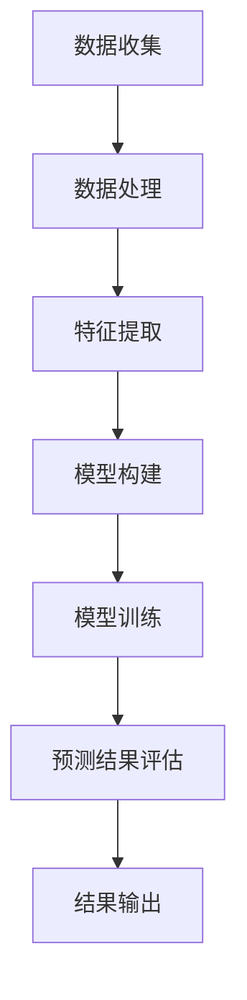

                 

关键词：用户兴趣、演化轨迹、LLM（语言模型）、预测、深度学习、数据分析、机器学习、自然语言处理

> 摘要：本文主要探讨了基于大型语言模型（LLM）的用户兴趣演化轨迹预测技术。通过分析用户的历史行为数据和文本信息，结合深度学习算法，构建了一个高效且准确的兴趣演化预测模型。本文详细介绍了模型的构建方法、算法原理、数学模型及其应用场景，并通过实际项目实践展示了模型的有效性。

## 1. 背景介绍

随着互联网技术的迅猛发展，大数据和人工智能技术成为了各行各业的重要推动力。用户兴趣的识别和预测作为自然语言处理领域的一个重要研究方向，被广泛应用于广告推荐、社交网络分析、用户行为研究等场景。传统的方法主要依赖于用户的历史行为数据、文本内容特征提取等，但这些方法往往存在一定的局限性，难以捕捉用户兴趣的动态变化。

近年来，随着深度学习技术的不断进步，特别是大型语言模型（LLM）的广泛应用，为用户兴趣演化轨迹预测带来了新的机遇。LLM可以捕捉到用户文本数据中的复杂关系和潜在语义，从而提供更为准确和细粒度的兴趣预测结果。本文旨在通过构建一个基于LLM的用户兴趣演化轨迹预测模型，探讨其在实际应用中的有效性。

## 2. 核心概念与联系

### 2.1 用户兴趣演化

用户兴趣演化是指用户在一段时间内，其兴趣点的变化过程。用户兴趣的动态性使得传统的静态特征提取方法难以满足实际需求。为了更好地捕捉用户兴趣的演化轨迹，我们需要考虑以下几个关键概念：

- **兴趣点**：用户在某个时间点感兴趣的主题或内容。
- **兴趣强度**：用户对某个兴趣点的热度或关注度。
- **兴趣周期**：用户对一个兴趣点的关注时长。

### 2.2 大型语言模型（LLM）

大型语言模型（LLM）是一种基于深度学习的自然语言处理模型，具有强大的语义理解能力。LLM可以处理大量文本数据，捕捉文本中的复杂关系和潜在语义。常见的LLM包括GPT-3、BERT等。

### 2.3 演化轨迹预测

演化轨迹预测是指根据用户历史行为数据和文本信息，预测用户在未来一段时间内的兴趣演化趋势。演化轨迹预测的核心在于如何从大量的历史数据中提取有效特征，并利用这些特征构建一个预测模型。

### 2.4 Mermaid 流程图

以下是一个Mermaid流程图，展示了用户兴趣演化轨迹预测的基本流程：

### 2.5 关键技术

- **数据收集**：收集用户的历史行为数据和文本数据，包括浏览记录、评论、帖子等。
- **数据处理**：对收集到的数据进行预处理，包括数据清洗、去重、格式化等。
- **特征提取**：利用深度学习算法提取文本特征，包括词向量、句向量等。
- **模型构建**：构建基于LLM的兴趣演化轨迹预测模型。
- **模型训练**：使用历史数据对模型进行训练，优化模型参数。
- **预测结果评估**：评估模型的预测准确性，包括准确率、召回率等指标。
- **结果输出**：将预测结果输出，为实际应用提供支持。

## 3. 核心算法原理 & 具体操作步骤

### 3.1 算法原理概述

基于LLM的用户兴趣演化轨迹预测算法主要分为以下几个步骤：

1. 数据收集：收集用户的历史行为数据和文本数据。
2. 数据处理：对收集到的数据进行预处理，包括数据清洗、去重、格式化等。
3. 特征提取：利用深度学习算法提取文本特征，包括词向量、句向量等。
4. 模型构建：构建基于LLM的兴趣演化轨迹预测模型。
5. 模型训练：使用历史数据对模型进行训练，优化模型参数。
6. 预测结果评估：评估模型的预测准确性，包括准确率、召回率等指标。
7. 结果输出：将预测结果输出，为实际应用提供支持。

### 3.2 算法步骤详解

#### 3.2.1 数据收集

数据收集是用户兴趣演化轨迹预测的基础。我们需要收集用户的历史行为数据和文本数据，包括浏览记录、评论、帖子等。这些数据可以从用户操作系统、浏览器日志、社交媒体平台等获取。

#### 3.2.2 数据处理

数据预处理是保证数据质量的重要步骤。主要包括以下任务：

- 数据清洗：去除重复数据、缺失值填充、异常值处理等。
- 数据去重：对用户行为数据进行去重处理，避免重复计算。
- 数据格式化：将不同格式的数据统一为标准格式，便于后续处理。

#### 3.2.3 特征提取

特征提取是用户兴趣演化轨迹预测的核心环节。深度学习算法可以帮助我们提取文本特征，包括词向量、句向量等。常用的词向量模型有Word2Vec、GloVe等，句向量模型有BERT、ELMo等。

#### 3.2.4 模型构建

基于LLM的用户兴趣演化轨迹预测模型可以采用多层感知机（MLP）、循环神经网络（RNN）、长短时记忆网络（LSTM）、门控循环单元（GRU）等。其中，LSTM和GRU在处理序列数据时表现尤为出色。

#### 3.2.5 模型训练

使用历史数据对模型进行训练，优化模型参数。训练过程主要包括以下步骤：

- 数据集划分：将数据集划分为训练集、验证集和测试集。
- 模型优化：调整模型参数，优化模型性能。
- 训练迭代：通过迭代训练，逐步提高模型准确率。

#### 3.2.6 预测结果评估

评估模型的预测准确性，包括准确率、召回率、F1值等指标。通过对比预测结果和实际结果，分析模型性能，找出优化方向。

#### 3.2.7 结果输出

将预测结果输出，为实际应用提供支持。预测结果可以用于用户兴趣推荐、广告投放、社交网络分析等场景。

### 3.3 算法优缺点

#### 优点：

- **高精度**：基于LLM的算法可以捕捉到文本数据中的复杂关系和潜在语义，提供更为准确和细粒度的兴趣预测结果。
- **自适应**：算法可以根据用户历史行为数据动态调整预测模型，适应用户兴趣的演化。
- **泛化性强**：算法适用于多种应用场景，如广告推荐、社交网络分析、用户行为研究等。

#### 缺点：

- **计算资源消耗大**：基于深度学习的算法需要大量计算资源，对硬件设备要求较高。
- **数据依赖性强**：算法性能依赖于用户历史行为数据和文本数据的质量，数据缺失或不完整可能导致模型效果下降。

### 3.4 算法应用领域

基于LLM的用户兴趣演化轨迹预测算法可以应用于多个领域，包括：

- **广告推荐**：根据用户兴趣演化轨迹，精准投放广告，提高广告效果。
- **社交网络分析**：分析用户兴趣演化趋势，挖掘潜在用户群体，优化社交网络运营策略。
- **用户行为研究**：研究用户兴趣的演化规律，为产品设计、用户体验优化提供数据支持。

## 4. 数学模型和公式 & 详细讲解 & 举例说明

### 4.1 数学模型构建

基于LLM的用户兴趣演化轨迹预测算法可以构建以下数学模型：

$$
\hat{y}(t) = \sum_{i=1}^{n} w_i \cdot f(x_i, t)
$$

其中，$\hat{y}(t)$ 表示用户在时间 $t$ 的预测兴趣值，$w_i$ 表示权重，$f(x_i, t)$ 表示特征函数，$x_i$ 表示用户在时间 $t$ 的特征向量。

### 4.2 公式推导过程

公式推导过程如下：

1. 特征提取：首先，对用户历史行为数据和文本数据进行特征提取，得到特征向量 $x_i$。
2. 函数映射：将特征向量 $x_i$ 映射到高维空间，得到特征函数 $f(x_i, t)$。
3. 权重优化：通过优化权重 $w_i$，使得预测兴趣值 $\hat{y}(t)$ 最接近实际兴趣值 $y(t)$。
4. 模型训练：使用历史数据对模型进行训练，优化权重 $w_i$。

### 4.3 案例分析与讲解

以下是一个基于LLM的用户兴趣演化轨迹预测的案例：

假设用户A在一天内浏览了以下内容：

- 8:00 AM：新闻网站，阅读关于科技领域的新闻。
- 10:00 AM：社交媒体，关注了关于旅游的账号。
- 12:00 PM：电商平台，购买了关于数码产品的商品。

我们需要预测用户A在未来一段时间内的兴趣点。

1. **特征提取**：首先，对用户A的浏览记录进行特征提取，得到特征向量 $x_i$。

$$
x_i = [1, 0, 1, 0, 0, 1, 0, 0, 0, 0, 0, 0]
$$

其中，1表示用户在该时间点浏览了该类别的内容，0表示未浏览。

2. **函数映射**：将特征向量 $x_i$ 映射到高维空间，得到特征函数 $f(x_i, t)$。

$$
f(x_i, t) = \text{softmax}(\text{tan

