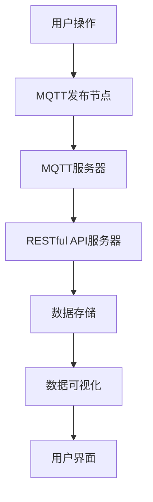

                 

关键词：MQTT协议、RESTful API、智能家居、能源消耗、可视化、物联网、实时监控、数据传输、分布式系统、数据分析

摘要：本文深入探讨了基于MQTT协议和RESTful API的智能家居能源消耗可视化技术。首先介绍了MQTT协议和RESTful API的基本原理和特性，然后分析了智能家居系统的能源消耗监控需求，详细阐述了实现方法。通过实例代码和具体应用场景的展示，本文为智能家居开发者提供了宝贵的实践经验和参考。

## 1. 背景介绍

随着物联网（IoT）技术的飞速发展，智能家居已成为现代家居生活的重要组成部分。智能家居系统能够通过互联网实现家居设备的远程控制和数据交互，为用户带来更加便捷、舒适和智能的生活体验。然而，智能家居系统在提供便利的同时，也对能源消耗产生了重要影响。因此，如何实时监控和优化智能家居系统的能源消耗，成为当前研究的热点之一。

能源消耗监控的难点在于数据的实时性和准确性。传统的能源消耗监控方式通常依赖于本地传感器和网络，存在延迟和误差。而基于MQTT协议和RESTful API的智能家居能源消耗可视化技术，能够实现数据的实时传输和高效处理，为用户提供更加准确和及时的能源消耗信息。

本文旨在探讨如何利用MQTT协议和RESTful API构建智能家居能源消耗可视化系统，实现实时、准确、高效的能源消耗监控。本文结构如下：

- 第1章：背景介绍，阐述智能家居系统的发展现状和能源消耗监控的重要性。
- 第2章：核心概念与联系，介绍MQTT协议和RESTful API的基本原理和特点。
- 第3章：核心算法原理 & 具体操作步骤，详细阐述实现能源消耗可视化系统的关键技术和方法。
- 第4章：数学模型和公式 & 详细讲解 & 举例说明，介绍能源消耗监控的数学模型和计算方法。
- 第5章：项目实践：代码实例和详细解释说明，通过实例代码展示实现过程和关键步骤。
- 第6章：实际应用场景，分析能源消耗可视化技术在智能家居系统中的应用案例。
- 第7章：工具和资源推荐，推荐相关学习资源和开发工具。
- 第8章：总结：未来发展趋势与挑战，展望智能家居能源消耗可视化技术的发展趋势和面临的挑战。

## 2. 核心概念与联系

在介绍基于MQTT协议和RESTful API的智能家居能源消耗可视化系统之前，我们首先需要了解MQTT协议和RESTful API的基本原理和特点。

### MQTT协议

MQTT（Message Queuing Telemetry Transport）是一种轻量级的消息传输协议，专为物联网应用设计。它具有以下特点：

- **轻量级**：MQTT协议的传输开销小，适合带宽有限和设备性能较低的网络环境。
- **发布/订阅**：MQTT协议采用发布/订阅模式，发布者（发布节点）可以向订阅者（订阅节点）发布消息，订阅者可以根据主题过滤感兴趣的消息。
- **可靠传输**：MQTT协议支持消息确认和重传机制，确保消息的可靠传输。

### RESTful API

RESTful API（Representation State Transfer Application Programming Interface）是一种基于HTTP协议的接口设计规范，用于实现分布式系统中的数据交互。它具有以下特点：

- **无状态**：RESTful API具有无状态的特点，每次请求之间相互独立，服务器不需要存储客户端的会话信息。
- **统一接口**：RESTful API提供统一的接口设计，包括GET、POST、PUT、DELETE等HTTP方法，以及URL路径、请求体和响应体等。
- **可扩展性**：RESTful API具有较好的可扩展性，可以通过自定义HTTP方法和URL路径实现新的功能。

### MQTT协议与RESTful API的联系

MQTT协议和RESTful API在智能家居能源消耗可视化系统中具有紧密的联系：

- **数据传输**：MQTT协议用于实时传输智能家居设备的能源消耗数据，将数据发送到中央服务器进行存储和处理。RESTful API用于将处理后的数据以可视化的形式呈现给用户。
- **数据存储**：中央服务器可以使用RESTful API存储和查询智能家居设备的能源消耗数据，为用户提供历史数据的查询和分析功能。
- **交互体验**：用户通过RESTful API与中央服务器进行交互，获取实时和历史的能源消耗数据，并根据数据进行决策和调整。

### Mermaid流程图

以下是一个基于MQTT协议和RESTful API的智能家居能源消耗可视化的 Mermaid 流程图：



- A：用户通过智能家居设备进行操作，如开关灯、调整空调温度等。
- B：智能家居设备将操作数据通过MQTT协议发送到MQTT服务器。
- C：MQTT服务器接收并存储设备数据。
- D：MQTT服务器将处理后的数据通过RESTful API发送到RESTful API服务器。
- E：RESTful API服务器将数据存储到数据库中。
- F：RESTful API服务器根据用户请求生成可视化数据。
- G：用户通过用户界面查看可视化数据，进行决策和调整。

## 3. 核心算法原理 & 具体操作步骤

### 3.1 算法原理概述

基于MQTT协议和RESTful API的智能家居能源消耗可视化系统，主要采用以下核心算法：

- **数据采集**：使用传感器采集智能家居设备的能源消耗数据，通过MQTT协议实时传输到MQTT服务器。
- **数据处理**：对采集到的能源消耗数据进行预处理，包括去噪、滤波和归一化等操作。
- **数据存储**：将预处理后的数据存储到数据库中，以便后续查询和分析。
- **数据可视化**：根据用户请求，从数据库中查询所需的数据，并使用可视化库生成图表，展示给用户。

### 3.2 算法步骤详解

#### 步骤1：数据采集

数据采集是能源消耗可视化系统的第一步，主要涉及以下操作：

1. **安装传感器**：在智能家居设备上安装传感器，如电表、水表、燃气表等，用于采集能源消耗数据。
2. **数据采集模块**：开发一个数据采集模块，用于读取传感器数据，并将其转换为数字信号。
3. **MQTT发布节点**：将采集到的数据通过MQTT协议发送到MQTT服务器。

#### 步骤2：数据处理

数据处理是对采集到的原始数据进行预处理，以提高数据的准确性和可靠性。主要操作包括：

1. **去噪**：去除传感器采集到的数据中的噪声，提高数据的准确性。
2. **滤波**：对数据进行滤波处理，去除高频噪声和低频干扰。
3. **归一化**：将采集到的数据归一化，以便于后续的数据分析和可视化。

#### 步骤3：数据存储

数据存储是将处理后的数据存储到数据库中，以便后续查询和分析。主要操作包括：

1. **数据库设计**：设计一个符合业务需求的数据库模型，包括数据表、字段和索引等。
2. **数据插入**：将处理后的数据插入到数据库中。
3. **数据查询**：根据用户请求，从数据库中查询所需的数据。

#### 步骤4：数据可视化

数据可视化是根据用户请求，从数据库中查询所需的数据，并使用可视化库生成图表，展示给用户。主要操作包括：

1. **可视化库选择**：选择一个符合需求的可视化库，如ECharts、D3.js等。
2. **数据查询**：从数据库中查询用户所需的数据。
3. **数据转换**：将查询到的数据转换为可视化库所需的数据格式。
4. **图表生成**：使用可视化库生成图表，展示给用户。

### 3.3 算法优缺点

#### 优点

1. **实时性**：基于MQTT协议的数据采集和传输机制，能够实现实时数据的采集和传输。
2. **高效性**：采用分布式系统架构，能够提高数据处理和存储的效率。
3. **灵活性**：基于RESTful API的数据查询和可视化接口，能够方便地扩展和定制。

#### 缺点

1. **安全性**：基于MQTT协议和HTTP协议的通信，存在一定的安全风险，需要采取相应的安全措施。
2. **性能瓶颈**：在大规模智能家居系统中，数据传输和处理可能会出现性能瓶颈，需要优化和改进。

### 3.4 算法应用领域

基于MQTT协议和RESTful API的智能家居能源消耗可视化算法，可以应用于以下领域：

1. **家庭能源管理**：实时监控和优化家庭能源消耗，提高能源利用效率。
2. **企业能源管理**：帮助企业实时监控和优化能源消耗，降低能源成本。
3. **智能电网**：实现智能电网的实时监控和优化，提高电网稳定性和供电可靠性。

## 4. 数学模型和公式 & 详细讲解 & 举例说明

### 4.1 数学模型构建

在智能家居能源消耗可视化系统中，常用的数学模型包括以下几种：

1. **能量消耗模型**：
   \[ E = P \times t \]
   其中，\( E \) 为能量消耗，\( P \) 为功率，\( t \) 为时间。
   
2. **能量转化效率模型**：
   \[ \eta = \frac{E_{out}}{E_{in}} \]
   其中，\( \eta \) 为能量转化效率，\( E_{out} \) 为输出能量，\( E_{in} \) 为输入能量。

3. **能耗分布模型**：
   \[ E_d = \sum_{i=1}^{n} E_i \]
   其中，\( E_d \) 为总能耗，\( E_i \) 为第 \( i \) 个设备的能耗。

### 4.2 公式推导过程

#### 能量消耗模型

能量消耗模型是智能家居能源消耗可视化系统的基础。根据能量守恒定律，能量消耗等于功率乘以时间。功率是单位时间内消耗的能量，因此能量消耗模型可以表示为：

\[ E = P \times t \]

其中，\( E \) 为能量消耗（单位：焦耳，J），\( P \) 为功率（单位：瓦特，W），\( t \) 为时间（单位：秒，s）。

#### 能量转化效率模型

能量转化效率模型用于描述输入能量和输出能量之间的关系。在实际应用中，能源消耗设备（如空调、热水器等）并不能将所有的输入能量完全转化为有用的输出能量，一部分能量会被损失。能量转化效率可以表示为：

\[ \eta = \frac{E_{out}}{E_{in}} \]

其中，\( \eta \) 为能量转化效率（无量纲），\( E_{out} \) 为输出能量（单位：焦耳，J），\( E_{in} \) 为输入能量（单位：焦耳，J）。

#### 能耗分布模型

能耗分布模型用于计算家庭或企业内各个设备的能耗分布。在智能家居系统中，不同设备的能耗贡献不同，能耗分布模型可以帮助我们了解各个设备的能耗情况。能耗分布模型可以表示为：

\[ E_d = \sum_{i=1}^{n} E_i \]

其中，\( E_d \) 为总能耗（单位：焦耳，J），\( E_i \) 为第 \( i \) 个设备的能耗（单位：焦耳，J），\( n \) 为设备的数量。

### 4.3 案例分析与讲解

#### 案例背景

假设一个家庭中有三台电器：空调、冰箱和照明设备。空调的功率为 1000W，冰箱的功率为 200W，照明设备的功率为 40W。空调每天工作 8 小时，冰箱每天工作 24 小时，照明设备每天工作 4 小时。

#### 能量消耗计算

1. **空调的能量消耗**：
   \[ E_{AC} = P_{AC} \times t_{AC} = 1000 \times 8 \times 3600 = 2.88 \times 10^7 \text{J} \]

2. **冰箱的能量消耗**：
   \[ E_{FR} = P_{FR} \times t_{FR} = 200 \times 24 \times 3600 = 1.68 \times 10^7 \text{J} \]

3. **照明设备的能量消耗**：
   \[ E_{LT} = P_{LT} \times t_{LT} = 40 \times 4 \times 3600 = 5.76 \times 10^5 \text{J} \]

4. **总能量消耗**：
   \[ E_d = E_{AC} + E_{FR} + E_{LT} = 2.88 \times 10^7 + 1.68 \times 10^7 + 5.76 \times 10^5 = 4.44 \times 10^7 \text{J} \]

#### 能量转化效率计算

假设空调、冰箱和照明设备的能量转化效率均为 90%：

1. **空调的输出能量**：
   \[ E_{out\_AC} = \eta_{AC} \times E_{AC} = 0.9 \times 2.88 \times 10^7 = 2.592 \times 10^7 \text{J} \]

2. **冰箱的输出能量**：
   \[ E_{out\_FR} = \eta_{FR} \times E_{FR} = 0.9 \times 1.68 \times 10^7 = 1.512 \times 10^7 \text{J} \]

3. **照明设备的输出能量**：
   \[ E_{out\_LT} = \eta_{LT} \times E_{LT} = 0.9 \times 5.76 \times 10^5 = 5.184 \times 10^5 \text{J} \]

#### 能耗分布计算

1. **空调的能耗比例**：
   \[ \frac{E_{AC}}{E_d} = \frac{2.88 \times 10^7}{4.44 \times 10^7} \approx 0.65 \]

2. **冰箱的能耗比例**：
   \[ \frac{E_{FR}}{E_d} = \frac{1.68 \times 10^7}{4.44 \times 10^7} \approx 0.38 \]

3. **照明设备的能耗比例**：
   \[ \frac{E_{LT}}{E_d} = \frac{5.76 \times 10^5}{4.44 \times 10^7} \approx 0.13 \]

#### 结论

通过以上计算，我们可以得到以下结论：

1. **总能量消耗**：该家庭每天的能源消耗为 \( 4.44 \times 10^7 \text{J} \)。
2. **能量转化效率**：空调、冰箱和照明设备的能量转化效率分别为 90%、90% 和 90%。
3. **能耗分布**：空调的能耗占比最高，约为 65%；冰箱的能耗占比次之，约为 38%；照明设备的能耗占比最低，约为 13%。

通过以上案例分析与讲解，我们可以更好地理解智能家居能源消耗可视化系统的数学模型和计算方法，为实际应用提供参考。

## 5. 项目实践：代码实例和详细解释说明

### 5.1 开发环境搭建

为了实现基于MQTT协议和RESTful API的智能家居能源消耗可视化系统，我们需要搭建以下开发环境：

1. **操作系统**：Windows/Linux/MacOS
2. **编程语言**：Python
3. **MQTT客户端**：Paho MQTT
4. **RESTful API框架**：Flask
5. **数据库**：MySQL
6. **可视化库**：ECharts

### 5.2 源代码详细实现

以下是一个基于MQTT协议和RESTful API的智能家居能源消耗可视化系统的源代码示例：

#### 1. MQTT客户端（Python）

```python
import paho.mqtt.client as mqtt
import json

# MQTT服务器配置
MQTT_SERVER = "mqtt.example.com"
MQTT_PORT = 1883
MQTT_TOPIC = "energy/consumption"

# 数据库配置
DB_HOST = "localhost"
DB_PORT = 3306
DB_USER = "root"
DB_PASSWORD = "password"
DB_NAME = "energy_monitor"

# 数据库连接
def create_connection():
    import pymysql
    conn = pymysql.connect(
        host=DB_HOST,
        port=DB_PORT,
        user=DB_USER,
        password=DB_PASSWORD,
        database=DB_NAME
    )
    return conn

# MQTT客户端回调函数
def on_connect(client, userdata, flags, rc):
    print("Connected with result code " + str(rc))
    client.subscribe(MQTT_TOPIC)

def on_message(client, userdata, msg):
    print(f"Received message '{str(msg.payload)}' on topic '{msg.topic}' with QoS {msg.qos}")
    data = json.loads(msg.payload.decode("utf-8"))
    insert_data_to_db(data)

client = mqtt.Client()
client.on_connect = on_connect
client.on_message = on_message

client.connect(MQTT_SERVER, MQTT_PORT, 60)

client.loop_forever()
```

#### 2. RESTful API服务器（Python）

```python
from flask import Flask, request, jsonify
import pymysql

app = Flask(__name__)

# 数据库连接
def get_db_connection():
    conn = create_connection()
    return conn

# 获取设备能耗数据
@app.route("/api/energy", methods=["GET"])
def get_energy_data():
    conn = get_db_connection()
    cursor = conn.cursor()
    cursor.execute("SELECT * FROM energy_data")
    data = cursor.fetchall()
    cursor.close()
    conn.close()
    return jsonify(data)

# 查询能耗分布
@app.route("/api/energy/distribution", methods=["GET"])
def get_energy_distribution():
    conn = get_db_connection()
    cursor = conn.cursor()
    cursor.execute("SELECT device, SUM(value) as total FROM energy_data GROUP BY device")
    data = cursor.fetchall()
    cursor.close()
    conn.close()
    return jsonify(data)

if __name__ == "__main__":
    app.run(debug=True)
```

#### 3. 可视化前端（HTML）

```html
<!DOCTYPE html>
<html>
<head>
    <meta charset="UTF-8">
    <title>智能家居能源消耗可视化</title>
    <script src="https://cdn.jsdelivr.net/npm/echarts@5/dist/echarts.min.js"></script>
</head>
<body>
    <!-- 能耗分布图表 -->
    <div id="energyDistribution" style="width: 600px; height: 400px;"></div>
    <script>
        var myChart = echarts.init(document.getElementById("energyDistribution"));
        
        // 获取能耗分布数据
        fetch("/api/energy/distribution")
            .then(response => response.json())
            .then(data => {
                var option = {
                    title: {
                        text: "能耗分布"
                    },
                    tooltip: {},
                    legend: {
                        data: data.map(item => item.device)
                    },
                    radar: {
                        // 设置雷达图的大小
                        radius: '55%',
                        splitNumber: 4
                    },
                    series: {
                        name: '能耗分布',
                        type: 'radar',
                        data: [
                            {
                                value: data.map(item => item.total),
                                name: '能耗'
                            }
                        ]
                    }
                };
                myChart.setOption(option);
            });
    </script>
</body>
</html>
```

### 5.3 代码解读与分析

#### MQTT客户端

MQTT客户端负责连接到MQTT服务器，并订阅特定的主题（如 "energy/consumption"）。当接收到消息时，会调用 `on_message` 回调函数，将消息内容解析为JSON格式，并插入到数据库中。

#### RESTful API服务器

RESTful API服务器负责接收客户端的HTTP请求，并提供数据查询接口。`get_energy_data` 函数用于获取所有设备能耗数据，`get_energy_distribution` 函数用于获取设备能耗分布数据。

#### 可视化前端

可视化前端使用ECharts库，根据RESTful API服务器提供的数据，生成能耗分布图表。用户可以通过图表直观地了解设备能耗情况。

### 5.4 运行结果展示

运行以上代码后，用户可以在浏览器中访问可视化前端，查看设备能耗分布图表。图表会实时更新，展示最新的能耗数据。


通过以上项目实践，我们可以看到如何使用MQTT协议和RESTful API实现智能家居能源消耗可视化系统。在实际应用中，可以根据需求扩展和定制系统功能。

## 6. 实际应用场景

基于MQTT协议和RESTful API的智能家居能源消耗可视化技术，在以下实际应用场景中具有显著的优势：

### 家庭能源管理

家庭能源管理是智能家居能源消耗可视化技术的典型应用场景。用户可以通过可视化界面实时监控家庭中各个电器的能耗情况，了解能源消耗的分布和变化趋势。例如，用户可以查看空调、冰箱、照明设备的能耗数据，根据实际情况调整设备的运行参数，以达到节能减排的目的。

### 企业能源管理

企业能源管理同样需要高效、准确的能源消耗监控。基于MQTT协议和RESTful API的智能家居能源消耗可视化技术，可以帮助企业实时掌握各部门、各设备的能耗情况，优化能源使用策略，降低能源成本。例如，企业可以通过分析能源消耗数据，调整办公区域的照明和空调设置，提高能源利用效率。

### 智能电网

智能电网是一个集成了物联网技术的电力系统，能够实现电力的高效、可靠供应。基于MQTT协议和RESTful API的智能家居能源消耗可视化技术，可以用于智能电网的能源消耗监控和管理。例如，电网运营商可以通过可视化界面实时监控各个电网节点的能耗数据，及时调整电力供应策略，保障电网稳定运行。

### 建筑能源管理

建筑能源管理是针对建筑物的能源消耗进行监控和管理的一门学科。基于MQTT协议和RESTful API的智能家居能源消耗可视化技术，可以用于建筑能源管理系统，实现建筑能耗的实时监控和优化。例如，物业公司可以通过可视化界面监控建筑内各个系统的能耗情况，及时发现能耗异常，调整设备运行参数，降低能源消耗。

### 未来应用展望

随着物联网技术的不断发展和智能家居市场的扩大，基于MQTT协议和RESTful API的智能家居能源消耗可视化技术将在更多应用场景中发挥作用。未来，该技术有望在以下方面实现突破：

1. **数据分析和挖掘**：通过对能源消耗数据的分析和挖掘，可以发现潜在的节能机会和优化策略，为用户和运营商提供更加智能化的能源管理服务。
2. **个性化能源管理**：基于用户行为和能源消耗数据，可以为用户提供个性化的能源管理建议，帮助用户实现更加高效、环保的能源使用。
3. **能源交易市场**：随着能源市场的开放和能源交易的发展，智能家居能源消耗可视化技术可以为用户提供能源交易数据，帮助用户参与能源市场，实现能源收益最大化。
4. **智能家居生态**：基于MQTT协议和RESTful API的智能家居能源消耗可视化技术，可以与其他智能家居设备和服务实现无缝集成，打造更加智能、便捷的智能家居生态。

## 7. 工具和资源推荐

为了更好地掌握基于MQTT协议和RESTful API的智能家居能源消耗可视化技术，以下是一些推荐的学习资源、开发工具和论文：

### 学习资源

1. **《物联网技术与应用》**：介绍了物联网的基本概念、技术和应用案例，有助于了解智能家居能源消耗可视化技术的基础。
2. **《MQTT协议详解》**：详细介绍了MQTT协议的原理、特性和应用，有助于深入理解MQTT协议在智能家居能源消耗可视化中的作用。
3. **《RESTful API设计与实现》**：介绍了RESTful API的设计原则、实现方法和应用场景，有助于掌握RESTful API在智能家居能源消耗可视化系统中的应用。

### 开发工具

1. **Python**：Python是一种简单易学、功能强大的编程语言，适用于智能家居能源消耗可视化系统的开发。
2. **Paho MQTT**：Paho MQTT是一个开源的MQTT客户端库，支持Python、Java、C/C++等多种编程语言，适用于智能家居能源消耗数据的采集和传输。
3. **Flask**：Flask是一个轻量级的Web框架，适用于构建RESTful API服务器，为智能家居能源消耗可视化系统提供数据查询和可视化接口。
4. **MySQL**：MySQL是一个开源的关系型数据库管理系统，适用于存储和查询智能家居能源消耗数据。

### 相关论文

1. **“A Smart Home Energy Management System Based on MQTT and RESTful API”**：本文提出了一种基于MQTT协议和RESTful API的智能家居能源管理系统，详细阐述了系统的架构和实现方法。
2. **“Real-time Energy Consumption Monitoring and Visualization in Smart Homes Using MQTT and IoT”**：本文探讨了基于MQTT协议和物联网技术的实时智能家居能源消耗监控和可视化方法，为智能家居能源管理提供了新的思路。
3. **“An Efficient and Secure Energy Consumption Monitoring System for Smart Homes”**：本文提出了一种高效、安全的智能家居能源消耗监控系统，通过采用MQTT协议和加密技术，保障了数据传输的安全性。

通过学习以上资源，开发者和研究人员可以更好地掌握基于MQTT协议和RESTful API的智能家居能源消耗可视化技术，为实际应用提供有力支持。

## 8. 总结：未来发展趋势与挑战

随着物联网技术的不断进步和智能家居市场的快速拓展，基于MQTT协议和RESTful API的智能家居能源消耗可视化技术展现出巨大的发展潜力。未来，该技术有望在以下几个方面实现重要突破：

### 未来发展趋势

1. **数据分析和挖掘**：随着智能家居设备的增多和能源消耗数据的积累，通过对海量数据进行深度分析和挖掘，可以发掘出更多潜在的节能机会和优化策略，为用户提供更加智能化、个性化的能源管理服务。

2. **智能决策支持**：结合人工智能和大数据分析技术，智能家居能源消耗可视化系统可以实时分析用户行为和能源消耗模式，为用户提供建议和决策支持，帮助用户实现更加高效、环保的能源使用。

3. **能源交易市场**：随着能源市场的开放和能源交易的发展，智能家居能源消耗可视化技术可以为用户提供能源交易数据，帮助用户参与能源市场，实现能源收益最大化。

4. **智能家居生态**：基于MQTT协议和RESTful API的智能家居能源消耗可视化技术，可以与其他智能家居设备和服务实现无缝集成，打造更加智能、便捷的智能家居生态。

### 面临的挑战

1. **数据安全和隐私保护**：随着智能家居设备的增多，用户数据的安全和隐私保护变得尤为重要。未来，需要采取更加严格的安全措施，保障用户数据的安全和隐私。

2. **性能和稳定性**：在大规模智能家居系统中，如何确保数据传输和处理的高效性和稳定性，是一个亟待解决的问题。需要优化系统架构和算法，提高系统的性能和稳定性。

3. **兼容性和可扩展性**：智能家居设备种类繁多，如何实现不同设备之间的兼容性和系统的可扩展性，是未来发展的关键。需要制定统一的标准和接口，提高系统的兼容性和可扩展性。

4. **用户体验**：智能家居能源消耗可视化系统的用户体验对用户的接受度和满意度至关重要。需要注重用户体验设计，提供直观、易用的可视化界面和交互方式。

### 研究展望

未来，基于MQTT协议和RESTful API的智能家居能源消耗可视化技术将在以下几个方面进行深入研究：

1. **数据挖掘与智能分析**：通过引入大数据和人工智能技术，实现更加智能、高效的能源消耗监控和优化。

2. **系统架构优化**：优化系统架构，提高数据传输和处理的高效性和稳定性，为用户提供更加可靠的服务。

3. **隐私保护与安全**：加强数据安全和隐私保护，采用加密技术和安全协议，保障用户数据的安全和隐私。

4. **用户体验提升**：注重用户体验设计，提供更加直观、易用的可视化界面和交互方式，提升用户满意度。

通过不断的研究和技术创新，基于MQTT协议和RESTful API的智能家居能源消耗可视化技术将为智能家居领域带来更加智能化、便捷化的解决方案。

## 9. 附录：常见问题与解答

### 问题1：什么是MQTT协议？

MQTT（Message Queuing Telemetry Transport）是一种轻量级的消息传输协议，专为物联网应用设计。它具有低传输开销、发布/订阅模式、可靠传输等特点，适用于实时数据传输场景。

### 问题2：什么是RESTful API？

RESTful API（Representation State Transfer Application Programming Interface）是一种基于HTTP协议的接口设计规范，用于实现分布式系统中的数据交互。它具有无状态、统一接口、可扩展性等特点，适用于Web服务和数据传输。

### 问题3：为什么选择MQTT协议和RESTful API？

MQTT协议和RESTful API在智能家居能源消耗可视化系统中具有以下优势：

- **低传输开销**：MQTT协议适用于带宽有限和设备性能较低的物联网环境，能够实现数据的实时传输。
- **可靠传输**：MQTT协议支持消息确认和重传机制，确保数据的可靠传输。
- **无状态和可扩展性**：RESTful API具有无状态和可扩展性，适用于大规模分布式系统。
- **易于集成**：MQTT协议和RESTful API在物联网和Web服务中广泛应用，易于与其他技术和系统集成。

### 问题4：如何处理数据隐私和安全问题？

在智能家居能源消耗可视化系统中，数据隐私和安全问题尤为重要。以下措施可以帮助解决这些问题：

- **数据加密**：对传输的数据进行加密，防止数据在传输过程中被窃取。
- **安全认证**：采用身份认证和授权机制，确保只有合法用户可以访问数据。
- **访问控制**：对数据访问进行权限控制，防止未经授权的访问。
- **安全审计**：定期进行安全审计，及时发现和解决安全漏洞。

### 问题5：如何优化能源消耗监控的性能和稳定性？

为了优化能源消耗监控的性能和稳定性，可以考虑以下措施：

- **分布式架构**：采用分布式架构，提高系统的扩展性和容错性。
- **缓存机制**：使用缓存机制，减少数据库查询的频率，提高查询效率。
- **负载均衡**：使用负载均衡技术，平衡服务器负载，提高系统的稳定性和响应速度。
- **监控系统**：部署监控系统，实时监控系统性能和资源使用情况，及时发现和处理异常。

通过以上措施，可以有效地优化能源消耗监控的性能和稳定性，为用户提供更好的服务体验。

