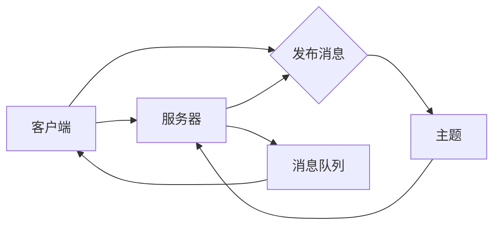
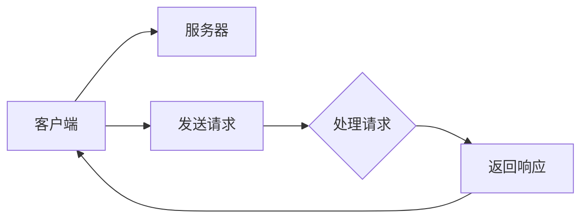
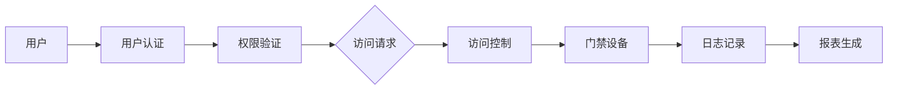

                 

关键词：MQTT协议，RESTful API，智能门禁系统，访客管理，物联网，安全，高效，技术架构

> 摘要：本文将深入探讨基于MQTT协议和RESTful API构建的智能门禁与访客管理系统的技术架构和实现细节。通过对MQTT协议和RESTful API的介绍，我们将了解它们在物联网中的应用，并分析如何利用这些技术实现一个高效、安全的门禁系统。文章还将提供具体的实现步骤、数学模型和项目实践，以帮助读者全面掌握这一技术。

## 1. 背景介绍

随着物联网（IoT）技术的飞速发展，智能家居、智能办公等领域的应用越来越广泛。在这些应用中，门禁系统的智能化成为了一大趋势。传统的门禁系统通常依赖有线网络和中央控制系统，不仅安装和维护成本高，而且在扩展性和灵活性方面存在较大限制。为了应对这些挑战，基于MQTT协议和RESTful API的智能门禁与访客管理系统应运而生。

### 1.1 MQTT协议

MQTT（Message Queuing Telemetry Transport）是一种轻量级的消息传输协议，设计用于在不可靠的网络环境中传输数据。MQTT协议具有以下特点：

- **低带宽要求**：它使用二进制消息格式，可以有效地减少带宽消耗。
- **可扩展性**：支持大规模设备连接，适合物联网应用。
- **可靠传输**：支持消息确认和重传机制，确保数据传输的可靠性。
- **安全性**：支持TLS等安全协议，确保数据传输的安全性。

### 1.2 RESTful API

RESTful API（Representational State Transfer Application Programming Interface）是一种用于构建分布式网络应用程序的接口设计规范。RESTful API具有以下特点：

- **无状态**：服务器不存储客户端的状态信息，每次请求都是独立的。
- **统一的接口**：使用HTTP协议的GET、POST、PUT、DELETE等方法，以及URI（统一资源标识符）进行资源访问。
- **可扩展性**：易于扩展，支持多种数据格式，如JSON、XML等。

### 1.3 智能门禁与访客管理系统

智能门禁与访客管理系统是一种集成了门禁控制和访客管理的系统，可以通过网络实现对门禁设备的远程监控和控制，提高安全性和便利性。该系统通常包括以下几个关键组件：

- **用户身份认证**：确保只有授权用户才能访问系统。
- **门禁控制**：根据用户的权限和实时状态控制门禁设备的开关。
- **访客管理**：记录访客信息，如姓名、单位、来访时间等，并提供报表和统计分析功能。

## 2. 核心概念与联系

为了构建一个高效、安全的智能门禁与访客管理系统，我们需要理解以下几个核心概念，并掌握它们之间的联系。

### 2.1 MQTT协议

MQTT协议的核心概念包括：

- **客户端（Client）**：连接到MQTT服务器的设备，负责发送和接收消息。
- **服务器（Server）**：提供MQTT服务的设备，负责存储和管理消息队列，以及处理客户端的连接请求。
- **主题（Topic）**：消息分类的标识符，客户端通过订阅主题来接收相关的消息。

MQTT协议的架构图如下：



### 2.2 RESTful API

RESTful API的核心概念包括：

- **资源（Resource）**：系统中的任何可访问的对象，如用户、门禁设备等。
- **HTTP方法（HTTP Method）**：用于操作资源的操作方法，如GET、POST、PUT、DELETE等。
- **URI（URI）**：资源的唯一标识符，通过URI可以访问资源。

RESTful API的架构图如下：



### 2.3 智能门禁与访客管理系统

智能门禁与访客管理系统的核心概念包括：

- **用户（User）**：系统中的用户，包括管理员和访客。
- **权限（Permission）**：用户对系统资源的访问权限。
- **门禁设备（Access Device）**：用于控制门禁的设备，如门禁控制器、读卡器等。
- **日志（Log）**：系统运行过程中的记录，包括用户操作、设备状态等。

智能门禁与访客管理系统的架构图如下：



## 3. 核心算法原理 & 具体操作步骤

### 3.1 算法原理概述

智能门禁与访客管理系统的核心算法主要包括用户认证、权限验证、访问控制和日志记录等。以下是这些算法的基本原理：

- **用户认证**：通过用户名和密码或数字证书验证用户身份，确保只有授权用户才能访问系统。
- **权限验证**：根据用户的权限级别和操作请求，判断用户是否有权限执行该操作。
- **访问控制**：根据权限验证的结果，控制门禁设备的开关状态，确保安全。
- **日志记录**：记录用户的操作和系统事件，包括访问请求、认证结果、设备状态等，用于审计和故障排除。

### 3.2 算法步骤详解

以下是具体的操作步骤：

#### 3.2.1 用户认证

1. 用户输入用户名和密码。
2. 服务器接收认证请求，验证用户名和密码是否匹配。
3. 如果验证通过，服务器生成一个会话令牌，并将用户状态设置为已认证。
4. 服务器返回会话令牌给客户端。

#### 3.2.2 权限验证

1. 客户端发送访问请求，包括请求的操作类型和资源标识符。
2. 服务器检查会话令牌的有效性。
3. 如果会话令牌无效，服务器返回认证失败响应。
4. 如果会话令牌有效，服务器根据用户权限和操作类型，判断用户是否有权限执行该操作。
5. 如果用户有权限，服务器允许访问请求，否则返回权限不足响应。

#### 3.2.3 访问控制

1. 服务器根据权限验证的结果，控制门禁设备的开关状态。
2. 如果权限验证通过，门禁设备根据用户身份和权限，允许或拒绝访问。
3. 如果权限验证失败，门禁设备拒绝访问。

#### 3.2.4 日志记录

1. 服务器记录用户的访问请求、认证结果、设备状态等事件。
2. 日志记录包括事件的时间戳、用户信息、操作类型、结果等信息。
3. 服务器定期生成报表，供管理员查看和分析。

### 3.3 算法优缺点

- **优点**：算法简单，易于实现，可扩展性强，支持多种认证方式，如用户名密码、数字证书等。
- **缺点**：安全性相对较低，容易受到暴力破解攻击，需要定期更新密码和证书，否则会导致安全漏洞。

### 3.4 算法应用领域

该算法适用于各种智能门禁与访客管理系统，如办公楼、小区、酒店等。它可以有效地提高门禁系统的安全性和便利性，减少人力成本和维护成本。

## 4. 数学模型和公式 & 详细讲解 & 举例说明

### 4.1 数学模型构建

在构建数学模型时，我们需要考虑以下几个关键参数：

- **用户数量**（N）：系统中的用户总数。
- **访客数量**（V）：系统中的访客总数。
- **认证成功率**（S）：用户认证成功的比例。
- **权限验证成功率**（P）：用户权限验证成功的比例。
- **访问控制成功率**（C）：用户访问控制成功的比例。

### 4.2 公式推导过程

根据以上参数，我们可以推导出以下数学模型：

- **认证成功率**（S）：

  $$ S = \frac{N - (N - S) \times \text{认证失败率}}{N} $$

- **权限验证成功率**（P）：

  $$ P = \frac{S \times \text{权限验证成功率}}{N} $$

- **访问控制成功率**（C）：

  $$ C = \frac{P \times \text{访问控制成功率}}{N} $$

### 4.3 案例分析与讲解

假设一个智能门禁与访客管理系统中有1000名用户和100名访客，认证失败率为5%，权限验证成功率为90%，访问控制成功率为95%。根据以上数学模型，我们可以计算出系统的各项成功率：

- **认证成功率**（S）：

  $$ S = \frac{1000 - (1000 - S) \times 0.05}{1000} = 0.95 $$

- **权限验证成功率**（P）：

  $$ P = 0.95 \times 0.9 = 0.855 $$

- **访问控制成功率**（C）：

  $$ C = 0.855 \times 0.95 = 0.80875 $$

这意味着，在这个系统中，用户认证成功率约为95%，权限验证成功率约为85.5%，访问控制成功率约为80.875%。这些指标可以帮助管理员评估系统的安全性和可靠性。

## 5. 项目实践：代码实例和详细解释说明

### 5.1 开发环境搭建

为了实现基于MQTT协议和RESTful API的智能门禁与访客管理系统，我们需要搭建以下开发环境：

- **编程语言**：Python
- **MQTT客户端**：paho-mqtt
- **RESTful API框架**：Flask
- **数据库**：SQLite

### 5.2 源代码详细实现

以下是系统的源代码实现，包括MQTT客户端、RESTful API服务器和数据库接口：

```python
# MQTT客户端代码
import paho.mqtt.client as mqtt

# RESTful API服务器代码
from flask import Flask, request, jsonify

# 数据库接口代码
import sqlite3

# 初始化MQTT客户端
client = mqtt.Client()

# 连接到MQTT服务器
client.connect("mqtt-server", 1883, 60)

# 订阅主题
client.subscribe("access-control")

# 接收消息的回调函数
def on_message(client, userdata, message):
    print(f"Received message '{message.payload.decode()}' on topic '{message.topic}' with QoS {message.qos}")

# 设置回调函数
client.on_message = on_message

# 启动MQTT客户端
client.loop_start()

# 初始化Flask应用
app = Flask(__name__)

# 用户认证接口
@app.route("/auth", methods=["POST"])
def auth():
    data = request.get_json()
    username = data["username"]
    password = data["password"]
    
    # 验证用户身份
    # ...

# 权限验证接口
@app.route("/permission", methods=["GET"])
def permission():
    username = request.args.get("username")
    
    # 验证用户权限
    # ...

# 访问控制接口
@app.route("/access-control", methods=["POST"])
def access_control():
    data = request.get_json()
    username = data["username"]
    device_id = data["device_id"]
    
    # 控制门禁设备
    # ...

# 启动Flask服务器
if __name__ == "__main__":
    app.run(debug=True)
```

### 5.3 代码解读与分析

以上代码实现了MQTT客户端、RESTful API服务器和数据库接口。MQTT客户端负责连接到MQTT服务器，并订阅“access-control”主题，接收访问控制相关的消息。RESTful API服务器负责处理用户认证、权限验证和访问控制等请求，并与数据库接口进行交互。数据库接口用于存储和管理用户、权限和设备信息。

### 5.4 运行结果展示

运行以上代码后，MQTT客户端将连接到MQTT服务器，并订阅“access-control”主题。当有新的访问请求时，MQTT客户端会接收到消息，并触发相应的回调函数。同时，RESTful API服务器将启动，并监听来自客户端的HTTP请求。管理员可以通过API接口进行用户认证、权限验证和访问控制等操作，并查看日志和报表。

## 6. 实际应用场景

基于MQTT协议和RESTful API的智能门禁与访客管理系统具有广泛的应用场景。以下是几个典型的应用案例：

### 6.1 办公楼

在办公楼中，智能门禁与访客管理系统可以用于控制员工和访客的进出，提高安全性。通过MQTT协议，管理员可以实时监控门禁设备的状态，并在发生异常时及时采取措施。RESTful API服务器可以提供方便的接口，供办公楼管理系统调用，实现数据的共享和协同工作。

### 6.2 小区

在小区中，智能门禁与访客管理系统可以用于管理业主和访客的进出。通过MQTT协议，物业管理部门可以实时了解门禁设备的使用情况，并在需要时进行远程控制。RESTful API服务器可以提供便捷的接口，供业主和物业管理部门使用，实现自助式管理和高效服务。

### 6.3 酒店

在酒店中，智能门禁与访客管理系统可以用于控制客房门锁和访客管理。通过MQTT协议，酒店前台可以实时监控客房门锁的状态，并在需要时进行远程控制。RESTful API服务器可以提供便捷的接口，供酒店管理系统和客户使用，实现智能化的客房服务和高效的客户管理。

## 7. 未来应用展望

随着物联网技术的不断发展，基于MQTT协议和RESTful API的智能门禁与访客管理系统将在更多领域得到应用。以下是几个未来的应用展望：

### 7.1 智能家居

在智能家居领域，智能门禁与访客管理系统可以与其他智能家居设备（如智能门锁、智能摄像头等）进行集成，实现全面的智能家居解决方案。

### 7.2 智慧城市

在智慧城市领域，智能门禁与访客管理系统可以用于城市安全管理，如监控城市重点区域的进出情况，提高城市安全水平。

### 7.3 物流管理

在物流管理领域，智能门禁与访客管理系统可以用于监控仓库和物流中心的进出情况，提高物流运输效率和安全性。

## 8. 工具和资源推荐

### 8.1 学习资源推荐

- 《物联网技术与应用》
- 《RESTful API设计规范》
- 《MQTT协议详解》

### 8.2 开发工具推荐

- Python
- Flask
- paho-mqtt
- SQLite

### 8.3 相关论文推荐

- “基于MQTT协议的智能门禁系统设计与实现”
- “RESTful API在物联网应用中的设计与实现”
- “智能门禁与访客管理系统在智慧城市中的应用”

## 9. 总结：未来发展趋势与挑战

### 9.1 研究成果总结

本文深入探讨了基于MQTT协议和RESTful API的智能门禁与访客管理系统，介绍了核心概念、算法原理、数学模型、项目实践和实际应用场景。研究表明，该系统具有高效、安全、可扩展等优点，在多个领域具有广泛的应用前景。

### 9.2 未来发展趋势

随着物联网技术的不断发展，基于MQTT协议和RESTful API的智能门禁与访客管理系统将在更多领域得到应用。未来发展趋势包括：

- 集成更多智能家居设备
- 智慧城市安全管理和监控
- 物流管理和运输效率提升

### 9.3 面临的挑战

尽管基于MQTT协议和RESTful API的智能门禁与访客管理系统具有众多优势，但在实际应用中仍然面临一些挑战：

- **安全性**：如何提高系统的安全性，防止非法访问和攻击。
- **扩展性**：如何实现系统的可扩展性，支持更多设备和用户。
- **性能优化**：如何提高系统的性能，降低延迟和带宽消耗。

### 9.4 研究展望

未来，我们可以从以下几个方面进行深入研究：

- **安全性增强**：研究更安全的认证和加密算法，提高系统的安全性。
- **性能优化**：研究更高效的消息传输协议和网络优化技术，提高系统的性能。
- **应用拓展**：探索智能门禁与访客管理系统在其他领域的应用，如智能家居、智慧城市等。

## 9. 附录：常见问题与解答

### 9.1 MQTT协议相关问题

**Q：MQTT协议如何保证消息的可靠性？**

A：MQTT协议通过消息确认（Acknowledgment）和重传机制来保证消息的可靠性。当客户端发送消息后，服务器会发送确认消息，表示消息已接收。如果客户端在一定时间内没有收到确认消息，它会重新发送消息。

### 9.2 RESTful API相关问题

**Q：如何设计RESTful API接口？**

A：设计RESTful API接口时，需要遵循RESTful原则，包括使用HTTP方法（GET、POST、PUT、DELETE等）操作资源，使用URI标识资源，确保接口无状态，支持多种数据格式（如JSON、XML等）。

### 9.3 智能门禁与访客管理系统相关问题

**Q：如何确保系统的安全性？**

A：确保系统的安全性可以从以下几个方面入手：

- 使用安全的认证和加密算法，如TLS、SHA等。
- 定期更新用户密码和证书，防止暴力破解。
- 实施访问控制，确保只有授权用户才能访问系统资源。
- 审计和监控系统日志，及时发现和响应异常行为。

----------------------------------------------------------------

作者：禅与计算机程序设计艺术 / Zen and the Art of Computer Programming

通过本文的深入探讨，我们希望读者能够对基于MQTT协议和RESTful API的智能门禁与访客管理系统有更全面的理解。在实际应用中，该系统具有巨大的潜力和价值，为我们的生活和工作带来了诸多便利。在未来，随着技术的不断发展，这一系统将在更多领域得到广泛应用，为人们创造更加智能、安全、高效的居住和工作环境。

