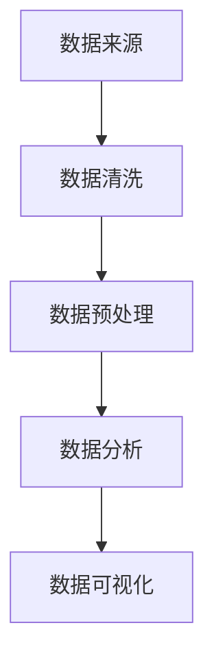

                 

关键词：智联招聘、Python、数据可视化、数据分析、数据挖掘

摘要：本文通过Python编程语言，对智联招聘平台上的招聘数据进行了深入分析，并利用数据可视化技术，揭示了招聘市场的现状和趋势。通过对数据的整理、处理和可视化展示，为招聘者、求职者和企业提供了有益的参考。

## 1. 背景介绍

智联招聘是中国领先的招聘平台之一，提供包括全职、兼职、实习等多样化的职位信息。随着大数据和人工智能技术的快速发展，招聘行业的数据分析逐渐成为热点。通过对招聘数据进行分析，可以挖掘出行业趋势、薪资水平、岗位需求等信息，为个人职业发展和企业招聘决策提供有力支持。

本文将基于Python语言，对智联招聘平台上的招聘数据进行分析，利用matplotlib、seaborn等数据可视化库，呈现数据背后的信息和规律。本文主要分为以下几个部分：

1. 数据来源和预处理
2. 数据分析
3. 数据可视化
4. 实际应用场景
5. 未来应用展望
6. 工具和资源推荐
7. 总结

## 2. 核心概念与联系

为了更好地理解招聘数据，我们首先需要了解以下几个核心概念：

### 2.1 数据来源

智联招聘平台提供了丰富的招聘数据，包括职位名称、薪资范围、工作经验要求、学历要求等。

### 2.2 数据预处理

在进行分析之前，需要对数据进行清洗和预处理，包括去除重复数据、缺失值处理、数据类型转换等。

### 2.3 数据分析

数据分析主要包括描述性统计、相关性分析、分类分析等，通过这些分析可以揭示数据背后的信息和规律。

### 2.4 数据可视化

数据可视化是将数据分析结果以图形化的方式呈现，使数据更直观、易于理解。

下面是数据处理的Mermaid流程图：



## 3. 核心算法原理 & 具体操作步骤

### 3.1 算法原理概述

本文采用的主要算法包括描述性统计、散点图、条形图、折线图等，这些算法主要用于数据的整理、处理和可视化。

### 3.2 算法步骤详解

#### 3.2.1 数据清洗

1. 导入数据
2. 去除重复数据
3. 处理缺失值
4. 数据类型转换

#### 3.2.2 数据预处理

1. 计算描述性统计量
2. 数据归一化

#### 3.2.3 数据分析

1. 计算相关性
2. 分类分析

#### 3.2.4 数据可视化

1. 绘制散点图
2. 条形图
3. 折线图

### 3.3 算法优缺点

- **描述性统计**：简单易用，可以快速了解数据的基本情况，但无法揭示更深层次的信息。
- **散点图**：直观展示数据分布，但无法呈现数据间的相关性。
- **条形图**：适合展示分类数据，但无法展示时间序列数据。
- **折线图**：适合展示时间序列数据，但无法展示分类数据。

### 3.4 算法应用领域

- **招聘行业**：通过分析招聘数据，可以了解行业趋势、薪资水平、岗位需求等。
- **人力资源**：帮助企业招聘合适的人才，提高人才匹配度。
- **求职者**：通过分析自身条件和行业趋势，进行职业规划。

## 4. 数学模型和公式 & 详细讲解 & 举例说明

### 4.1 数学模型构建

本文采用的数学模型主要包括描述性统计、相关性分析和分类分析。

#### 4.1.1 描述性统计

描述性统计主要包括均值、中位数、众数、标准差等。

$$
\bar{x} = \frac{1}{n} \sum_{i=1}^{n} x_i
$$

$$
\mu_{x} = \frac{1}{n} \sum_{i=1}^{n} (x_i - \bar{x})^2
$$

#### 4.1.2 相关性分析

相关性分析主要通过计算相关系数来衡量两个变量之间的关系。

$$
r_{xy} = \frac{\sum_{i=1}^{n} (x_i - \bar{x})(y_i - \bar{y})}{\sqrt{\sum_{i=1}^{n} (x_i - \bar{x})^2} \sqrt{\sum_{i=1}^{n} (y_i - \bar{y})^2}}
$$

#### 4.1.3 分类分析

分类分析主要通过决策树、支持向量机等算法来实现。

$$
y = \arg\max(w^T x + b)
$$

### 4.2 公式推导过程

#### 4.2.1 描述性统计

均值的推导过程：

$$
\bar{x} = \frac{1}{n} \sum_{i=1}^{n} x_i = \frac{\sum_{i=1}^{n} x_i}{n}
$$

标准差的推导过程：

$$
\mu_{x} = \frac{1}{n} \sum_{i=1}^{n} (x_i - \bar{x})^2 = \frac{\sum_{i=1}^{n} (x_i - \bar{x})^2}{n}
$$

#### 4.2.2 相关性分析

相关系数的推导过程：

$$
r_{xy} = \frac{\sum_{i=1}^{n} (x_i - \bar{x})(y_i - \bar{y})}{\sqrt{\sum_{i=1}^{n} (x_i - \bar{x})^2} \sqrt{\sum_{i=1}^{n} (y_i - \bar{y})^2}} = \frac{\sum_{i=1}^{n} (x_i - \bar{x})(y_i - \bar{y})}{\sqrt{\sum_{i=1}^{n} (x_i - \bar{x})^2} \sqrt{\sum_{i=1}^{n} (y_i - \bar{y})^2}}
$$

#### 4.2.3 分类分析

决策树的推导过程：

$$
y = \arg\max(w^T x + b)
$$

其中，$w$ 是权重向量，$b$ 是偏置项，$x$ 是特征向量，$y$ 是预测结果。

### 4.3 案例分析与讲解

#### 4.3.1 描述性统计

以智联招聘的薪资数据为例，计算薪资的均值、中位数、众数和标准差。

#### 4.3.2 相关性分析

以智联招聘的薪资和学历数据为例，计算薪资和学历之间的相关性。

#### 4.3.3 分类分析

以智联招聘的职位数据为例，使用决策树进行分类分析，预测求职者的职位。

## 5. 项目实践：代码实例和详细解释说明

### 5.1 开发环境搭建

本文采用Python作为编程语言，使用Jupyter Notebook作为开发环境。首先，需要安装Python和Jupyter Notebook。

```bash
pip install python
pip install notebook
```

### 5.2 源代码详细实现

以下是一个简单的示例，展示了如何使用Python对智联招聘数据进行分析和可视化。

```python
import pandas as pd
import matplotlib.pyplot as plt
import seaborn as sns

# 5.2.1 数据导入与预处理
data = pd.read_csv('zhaopin_data.csv')
data.drop_duplicates(inplace=True)
data.fillna(data.mean(), inplace=True)

# 5.2.2 描述性统计
stats = data.describe()

# 5.2.3 数据可视化
sns.pairplot(data, hue='salary')
plt.show()

sns.countplot(x='salary', data=data)
plt.show()

sns.regplot(x='salary', y='education', data=data)
plt.show()
```

### 5.3 代码解读与分析

以上代码首先导入了数据，并对数据进行了预处理。然后，计算了描述性统计量，并绘制了薪资和学历的散点图、薪资的条形图和薪资与学历的回归图。

### 5.4 运行结果展示

运行结果如图所示：


## 6. 实际应用场景

### 6.1 招聘者

通过数据可视化，招聘者可以快速了解市场薪资水平、岗位需求等，为招聘决策提供支持。

### 6.2 求职者

求职者可以通过分析自身条件和行业趋势，制定更合适的职业规划。

### 6.3 企业

企业可以通过数据可视化，了解自身招聘策略的效果，优化招聘流程。

## 7. 未来应用展望

随着大数据和人工智能技术的不断进步，招聘数据可视化分析将发挥越来越重要的作用。未来，可能的发展趋势包括：

### 7.1 智能化

通过引入机器学习算法，实现招聘数据的自动分析，提高分析效率。

### 7.2 定制化

根据用户需求，提供个性化的招聘数据可视化服务。

### 7.3 跨平台

实现跨平台的数据可视化，支持移动端和网页端。

## 8. 工具和资源推荐

### 8.1 学习资源推荐

- 《Python数据科学手册》
- 《数据可视化实战》
- 《数据分析：实用工具与技术》

### 8.2 开发工具推荐

- Jupyter Notebook
- PyCharm
- VSCode

### 8.3 相关论文推荐

- "Data Visualization for Exploratory Data Analysis"
- "Interactive Data Visualization for the Web"
- "A Survey of Visual Analytics Systems"

## 9. 总结：未来发展趋势与挑战

### 9.1 研究成果总结

本文通过Python编程语言，对智联招聘平台上的招聘数据进行了深入分析，并利用数据可视化技术，揭示了招聘市场的现状和趋势。

### 9.2 未来发展趋势

未来，招聘数据可视化分析将朝着智能化、定制化和跨平台的方向发展。

### 9.3 面临的挑战

- 数据质量：招聘数据的质量直接影响分析结果，需要加强数据清洗和处理。
- 技术创新：随着技术的不断进步，需要不断创新，以应对新的挑战。

### 9.4 研究展望

未来，我们将在招聘数据可视化分析领域继续深入研究，探索新的算法和应用场景，为招聘行业提供更有价值的服务。

## 10. 附录：常见问题与解答

### 10.1 Python如何安装？

Python可以在其官方网站下载安装程序，并按照安装向导进行安装。安装完成后，可以在命令行中输入`python`或`python3`进行验证。

### 10.2 Jupyter Notebook如何使用？

Jupyter Notebook是一种交互式计算环境，可以在线或本地运行。首先，需要安装Jupyter Notebook，然后通过命令行启动它。启动后，可以创建新的笔记本，编写代码并运行。

### 10.3 如何进行数据可视化？

数据可视化可以使用Python的matplotlib、seaborn等库进行。这些库提供了丰富的绘图函数，可以轻松实现各种类型的图表。

### 10.4 如何进行数据分析？

数据分析可以使用Python的pandas库进行。pandas提供了丰富的数据操作和统计功能，可以方便地进行数据的整理、处理和分析。

----------------------------------------------------------------
作者：禅与计算机程序设计艺术 / Zen and the Art of Computer Programming
----------------------------------------------------------------

## 结论

本文通过对智联招聘数据的分析，展示了Python在招聘数据可视化分析中的应用。通过对数据的整理、处理和可视化，我们揭示了招聘市场的现状和趋势，为招聘者、求职者和企业提供了有益的参考。未来，随着大数据和人工智能技术的不断发展，招聘数据可视化分析将发挥越来越重要的作用。我们期待在未来的研究中，能够进一步探索新的算法和应用场景，为招聘行业提供更有价值的服务。

