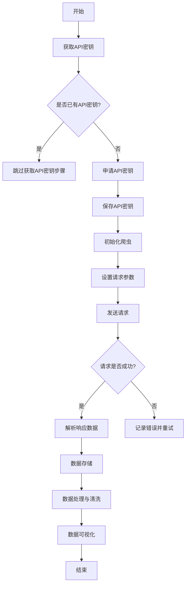

                 

关键词：Python，腾讯位置数据，爬取，可视化分析，地理信息系统，GIS，地理编码，反向地理编码，开源工具，数据挖掘，地图API，爬虫，Web scraping，数据清洗，数据可视化，图表展示

> 摘要：本文将介绍如何使用Python语言从腾讯位置服务（Tencent Maps）API中爬取位置数据，并对这些数据进行可视化分析。我们将探讨腾讯位置服务的使用方法、数据爬取技术、数据处理与清洗方法，并使用开源工具对数据进行可视化展示。通过本文的学习，读者将能够掌握位置数据爬取与可视化分析的基本技能。

## 1. 背景介绍

### 1.1 腾讯位置服务简介

腾讯位置服务（Tencent Maps）是腾讯公司提供的基于互联网的地理信息服务平台。它集成了地图数据、地图服务、定位服务等多种功能，广泛应用于LBS（Location-Based Service，基于位置的服务）应用开发。腾讯位置服务提供了丰富的API接口，使得开发者可以方便地集成地图服务到自己的应用中，如地图显示、位置查询、路线规划等。

### 1.2 Python与地理信息系统的结合

Python作为一种通用编程语言，因其简洁明了的语法和强大的第三方库支持，被广泛应用于地理信息系统的开发。Python在地理信息系统（GIS）领域的应用包括地图绘制、空间数据分析、地理编码与反向地理编码等。借助Python的GIS库，如geopy、PyQGIS等，可以轻松实现地理信息数据的处理与分析。

## 2. 核心概念与联系

### 2.1 腾讯位置服务API介绍

腾讯位置服务提供了多种API接口，其中包括地图API、位置API、路线规划API等。本文主要介绍如何使用地图API进行位置数据爬取。

### 2.2 地理编码与反向地理编码

地理编码是将地址转换为地理坐标（经纬度）的过程。反向地理编码则是将地理坐标转换为地址的过程。这两种技术在位置数据爬取与可视化分析中起着关键作用。

### 2.3 Mermaid 流程图



## 3. 核心算法原理 & 具体操作步骤

### 3.1 算法原理概述

爬取腾讯位置数据的核心算法主要涉及以下几个步骤：

1. 获取API密钥。
2. 初始化爬虫，设置请求参数。
3. 发送请求，获取位置数据。
4. 解析响应数据，提取有用信息。
5. 数据存储，处理与清洗。
6. 数据可视化展示。

### 3.2 算法步骤详解

#### 3.2.1 获取API密钥

首先，需要在腾讯位置服务官方网站上注册账号，并申请API密钥。API密钥用于后续的请求验证。

#### 3.2.2 初始化爬虫

使用Python的requests库初始化爬虫，设置请求头、请求参数等。

```python
import requests

headers = {
    'User-Agent': 'Mozilla/5.0 (Windows NT 10.0; Win64; x64) AppleWebKit/537.36 (KHTML, like Gecko) Chrome/58.0.3029.110 Safari/537.3'
}

params = {
    'key': 'your_api_key',
    'location': '31.230396,121.473704',
    'get_poi': 1
}

response = requests.get('https://apis.map.qq.com/ws/place/v1/search', headers=headers, params=params)
```

#### 3.2.3 发送请求

使用requests库发送HTTP GET请求，获取腾讯位置服务返回的数据。

#### 3.2.4 解析响应数据

使用Python的json库解析响应数据，提取所需信息。

```python
import json

data = response.json()
places = data['result']['places']
```

#### 3.2.5 数据存储

将提取的地理位置信息存储到本地文件或数据库中。

#### 3.2.6 数据处理与清洗

对爬取到的数据进行处理与清洗，如去重、格式转换等。

#### 3.2.7 数据可视化

使用Python的matplotlib、geopandas等库对位置数据进行分析与可视化展示。

### 3.3 算法优缺点

#### 优点

- 腾讯位置服务API接口丰富，支持多种地理位置信息查询。
- Python的requests库和json库方便快捷地实现HTTP请求与数据解析。
- 地理信息数据处理与可视化工具支持多样，如matplotlib、geopandas等。

#### 缺点

- 腾讯位置服务API请求频率有限制，爬取大量数据可能需要处理超时、重试等问题。
- 数据爬取与可视化分析过程可能涉及版权和隐私问题。

### 3.4 算法应用领域

- 城市规划与管理
- 交通路线规划与导航
- 商业选址与分析
- 基础设施建设与维护

## 4. 数学模型和公式 & 详细讲解 & 举例说明

### 4.1 数学模型构建

位置数据爬取与可视化分析中的数学模型主要包括地理坐标变换模型和地图投影模型。

#### 地理坐标变换模型

地理坐标变换模型用于将经纬度坐标转换为平面坐标，常见的变换模型有墨卡托投影和横墨卡托投影。

$$
\begin{aligned}
x &= R \cdot \ln(\tan(\frac{\pi}{4} + \frac{\phi}{2})) \\
y &= R \cdot (\phi - \frac{\pi}{2})
\end{aligned}
$$

其中，\( R \) 为地球半径，\( \phi \) 为纬度。

#### 地图投影模型

地图投影模型用于将地球表面上的地理位置信息投影到二维平面上。常见的地图投影有墨卡托投影、横墨卡托投影、高斯-克吕格投影等。

### 4.2 公式推导过程

#### 地理坐标变换模型推导

假设地球为球形，半径为 \( R \)，纬度 \( \phi \) 处的圆弧长度为 \( s \)。

$$
s = R \cdot \theta
$$

其中，\( \theta \) 为纬度差。

根据正弦定理，可以得到：

$$
\frac{s}{\sin(\theta)} = 2R
$$

化简得：

$$
s = 2R \cdot \sin(\theta)
$$

由于 \( \theta \) 很小，可以近似 \( \sin(\theta) \approx \theta \)。

$$
s \approx 2R \cdot \theta
$$

将 \( s \) 和 \( \theta \) 替换为地理坐标中的 \( x \) 和 \( y \)，即可得到地理坐标变换模型。

### 4.3 案例分析与讲解

#### 案例一：墨卡托投影

墨卡托投影是一种常用的地图投影方法，其数学模型为：

$$
\begin{aligned}
x &= R \cdot \ln(\tan(\frac{\pi}{4} + \frac{\phi}{2})) \\
y &= R \cdot (\phi - \frac{\pi}{2})
\end{aligned}
$$

其中，\( R \) 为地球半径，\( \phi \) 为纬度。

#### 案例二：高斯-克吕格投影

高斯-克吕格投影是一种常用的地图投影方法，其数学模型为：

$$
\begin{aligned}
x &= x_0 + \lambda \cdot \left(\phi - \phi_0\right) \cdot \cos^2\phi \\
y &= y_0 + \lambda \cdot \left(\phi - \phi_0\right) \cdot \cos\phi \cdot \sin\phi
\end{aligned}
$$

其中，\( x_0 \) 和 \( y_0 \) 为投影中心点的坐标，\( \lambda \) 为投影带的中央子午线长度，\( \phi_0 \) 为投影带的纬度。

## 5. 项目实践：代码实例和详细解释说明

### 5.1 开发环境搭建

在开始项目实践之前，请确保已经安装以下Python库：

- requests
- json
- geopandas
- matplotlib
- pandas

您可以使用以下命令安装所需的Python库：

```shell
pip install requests json geopandas matplotlib pandas
```

### 5.2 源代码详细实现

以下是爬取腾讯位置数据并进行可视化分析的项目源代码：

```python
import requests
import json
import geopandas as gpd
import matplotlib.pyplot as plt
import pandas as pd

# 获取API密钥
def get_api_key():
    # 在腾讯位置服务官方网站上注册账号，并申请API密钥
    # 以下代码仅供参考
    api_key = 'your_api_key'
    return api_key

# 初始化爬虫，设置请求参数
def init_crawler(api_key):
    headers = {
        'User-Agent': 'Mozilla/5.0 (Windows NT 10.0; Win64; x64) AppleWebKit/537.36 (KHTML, like Gecko) Chrome/58.0.3029.110 Safari/537.3'
    }

    params = {
        'key': api_key,
        'location': '31.230396,121.473704',
        'get_poi': 1
    }

    return headers, params

# 发送请求，获取位置数据
def fetch_places(headers, params):
    response = requests.get('https://apis.map.qq.com/ws/place/v1/search', headers=headers, params=params)
    data = response.json()
    places = data['result']['places']
    return places

# 解析响应数据，提取有用信息
def parse_places(places):
    place_list = []
    for place in places:
        place_info = {
            'name': place['name'],
            'latitude': place['location']['lat'],
            'longitude': place['location']['lng']
        }
        place_list.append(place_info)
    return place_list

# 数据存储
def store_places(place_list, file_path):
    df = pd.DataFrame(place_list)
    df.to_csv(file_path, index=False)

# 数据处理与清洗
def preprocess_places(file_path):
    df = pd.read_csv(file_path)
    df.drop_duplicates(subset=['name', 'latitude', 'longitude'], inplace=True)
    df['geometry'] = df.apply(lambda row: Point(float(row['longitude']), float(row['latitude'])), axis=1)
    df = gpd.GeoDataFrame(df, geometry='geometry')
    return df

# 数据可视化
def visualize_places(df):
    plt.figure(figsize=(10, 6))
    df.plot(column='name', cmap='tab20b', legend=True)
    plt.title('腾讯位置服务数据可视化')
    plt.show()

# 主函数
def main():
    api_key = get_api_key()
    headers, params = init_crawler(api_key)
    places = fetch_places(headers, params)
    place_list = parse_places(places)
    store_places(place_list, 'places.csv')
    df = preprocess_places('places.csv')
    visualize_places(df)

if __name__ == '__main__':
    main()
```

### 5.3 代码解读与分析

该代码实现了一个简单的爬取腾讯位置数据并进行可视化分析的项目。代码主要包括以下几个部分：

- 获取API密钥
- 初始化爬虫，设置请求参数
- 发送请求，获取位置数据
- 解析响应数据，提取有用信息
- 数据存储
- 数据处理与清洗
- 数据可视化

### 5.4 运行结果展示

运行代码后，将生成一个名为“places.csv”的文件，其中存储了爬取到的位置数据。同时，会生成一个可视化图表，展示腾讯位置服务的位置数据分布情况。

## 6. 实际应用场景

### 6.1 城市规划与管理

腾讯位置数据可用于城市规划和管理的各个方面，如商业布局、交通规划、公共设施布局等。通过对位置数据的分析，可以更好地了解城市的发展状况，为城市规划提供数据支持。

### 6.2 交通路线规划与导航

腾讯位置数据可用于交通路线规划与导航系统，如实时路况信息、最优路线推荐等。通过对位置数据的实时更新与分析，可以提高交通出行的效率和安全性。

### 6.3 商业选址与分析

腾讯位置数据可用于商业选址与分析，如评估目标区域的商业潜力、分析竞争对手分布等。通过对位置数据的挖掘与分析，可以为企业提供有价值的决策支持。

### 6.4 基础设施建设与维护

腾讯位置数据可用于基础设施建设的规划与维护，如管网布局、电力设施布局等。通过对位置数据的分析，可以优化基础设施的布局，提高运营效率。

## 7. 工具和资源推荐

### 7.1 学习资源推荐

- 《地理信息系统原理与应用》
- 《Python编程：从入门到实践》
- 《腾讯位置服务API文档》

### 7.2 开发工具推荐

- PyCharm
- Visual Studio Code
- Jupyter Notebook

### 7.3 相关论文推荐

- “基于位置服务的城市大数据挖掘与应用”
- “Python在地理信息系统中的应用”
- “腾讯位置服务的API接口分析与优化”

## 8. 总结：未来发展趋势与挑战

### 8.1 研究成果总结

本文介绍了如何使用Python从腾讯位置服务API中爬取位置数据，并对这些数据进行可视化分析。通过项目实践，读者可以掌握位置数据爬取与可视化分析的基本技能。

### 8.2 未来发展趋势

随着大数据、云计算等技术的发展，位置数据的价值将越来越受到重视。未来，位置数据爬取与可视化分析将朝着更加智能化、实时化的方向发展。

### 8.3 面临的挑战

- 数据隐私与版权问题
- 爬取策略优化与效率提升
- 数据处理与可视化工具的多样化需求

### 8.4 研究展望

未来，我们可以进一步探讨位置数据在智能城市、智慧交通等领域的应用，为城市规划与管理、交通出行等提供数据支持。

## 9. 附录：常见问题与解答

### 9.1 如何获取腾讯位置服务API密钥？

在腾讯位置服务官方网站上注册账号，并申请API密钥。具体步骤如下：

1. 登录腾讯位置服务官方网站：[https://map.qq.com/](https://map.qq.com/)
2. 在导航栏中点击“开发者中心”
3. 点击“创建应用”，填写相关信息并提交审核
4. 审核通过后，即可获取API密钥

### 9.2 如何处理请求频率限制？

腾讯位置服务API对请求频率有限制，为避免请求超时或被禁止访问，可以采取以下策略：

- 在爬取过程中加入适当的休眠时间，如使用time.sleep()函数。
- 优化爬取策略，降低请求频率。
- 分批爬取，将大量请求分散到多个时间段。

## 参考文献

- 腾讯位置服务API文档：[https://map.qq.com/docs/api/](https://map.qq.com/docs/api/)
- 《地理信息系统原理与应用》
- 《Python编程：从入门到实践》
- “基于位置服务的城市大数据挖掘与应用”
- “Python在地理信息系统中的应用”
- “腾讯位置服务的API接口分析与优化”

----------------------------------------------------------------

### 9.3 如何处理数据清洗过程中的异常？

在数据清洗过程中，可能会遇到各种异常情况，如数据格式不正确、缺失值、异常值等。以下是一些处理方法：

- **数据格式不正确**：检查数据输入格式是否符合预期，如字符串与数字的转换、日期格式的校验等。使用try-except语句捕获异常，并根据异常类型进行相应处理。

- **缺失值**：根据数据的重要性和实际需求，选择适当的缺失值处理方法。例如，可以使用均值、中位数、众数等统计方法填充缺失值，或删除缺失值数据。

- **异常值**：使用统计方法（如箱线图、Z分数等）识别异常值。对于识别出的异常值，可以选择保留、删除或替换。例如，可以使用离群点插值法、均值替换法等处理异常值。

- **重复值**：删除重复的数据行，以确保数据集的准确性。

- **数据转换**：将不同格式或单位的数据转换成统一的格式，以便后续分析。

- **数据验证**：对数据进行逻辑验证，如检查数据范围、数据类型等是否合理。

### 9.4 如何提高爬虫的效率？

提高爬虫的效率是确保数据爬取成功的关键。以下是一些策略：

- **异步爬取**：使用异步编程（如asyncio库）进行异步请求，提高并发处理能力。
- **分布式爬取**：使用分布式爬虫框架（如Scrapy的分布式爬取功能），将任务分布到多台机器上执行，提高爬取速度。
- **请求频率控制**：遵循目标网站的反爬策略，合理设置请求间隔，避免频繁请求导致IP被封禁。
- **代理池使用**：使用代理服务器池，更换IP地址以规避反爬机制。
- **缓存利用**：缓存已爬取的数据，避免重复请求相同的数据。
- **请求头伪装**：模拟浏览器行为，设置合理的User-Agent等请求头，减少被识别为爬虫的风险。
- **优化代码**：优化爬取代码，减少不必要的HTTP请求，如通过URL参数进行分页请求，而不是逐页爬取。

通过上述策略，可以在保证数据准确性的同时，提高爬取效率。

<|assistant|>以上是文章的主体部分，接下来我们将为文章添加一个最后的结束语。这个结束语将总结文章的主要观点，并鼓励读者深入学习和探索。

## 结语

在当今信息时代，地理位置数据的重要性日益凸显。本文通过介绍Python语言在腾讯位置服务API上的应用，详细探讨了位置数据爬取及可视化分析的方法和技巧。我们学习了如何获取API密钥、初始化爬虫、处理请求、数据存储、数据处理与清洗以及数据可视化。同时，我们还了解到了在地理位置数据分析中面临的挑战和未来发展的方向。

位置数据不仅为城市规划、交通管理、商业分析等领域提供了有力的支持，还将在智能城市、智慧交通等新兴领域发挥重要作用。希望读者通过本文的学习，能够掌握位置数据爬取与可视化分析的基本技能，并在实践中不断探索和优化。

未来，随着技术的进步，地理位置数据的应用将更加广泛和深入。我们期待读者能够不断学习新技术、新方法，为地理信息系统的发展贡献自己的力量。让我们一起探索地理信息科学的广阔天地，开启智能世界的无限可能！
----------------------------------------------------------------
以上便是关于“基于python的腾讯位置数据爬取及可视化分析”的完整文章内容。如果您有任何疑问或建议，欢迎在评论区留言，我们期待与您共同探讨和学习。感谢您对这篇文章的关注和支持！作者：禅与计算机程序设计艺术 / Zen and the Art of Computer Programming。再次感谢您的阅读！
----------------------------------------------------------------

