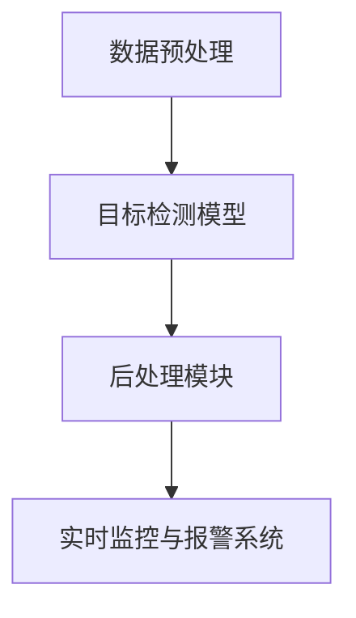

                 

## 1. 背景介绍

火灾是一种常见的灾害，给人类带来了巨大的生命和财产损失。随着城市化进程的加快和人口密度的增加，火灾的预防和控制变得越来越重要。传统的火灾检测方法主要依赖于烟雾探测、温度探测等物理手段，但这些方法存在一定的局限性，如误报率高、检测效果不佳等。随着计算机视觉技术的发展，基于图像的火灾检测方法逐渐成为研究热点。

计算机视觉技术在火灾检测中的应用主要体现在图像处理、目标检测和实时监控等方面。通过分析图像中的烟雾、火焰等特征，可以实现对火灾的早期发现和预警。目标检测算法在其中发挥着至关重要的作用，而YOLO（You Only Look Once）算法作为一种高效的实时目标检测算法，因其速度快、准确度高而被广泛应用。

本文将详细介绍一种基于YOLOv5算法的火灾检测系统，包括系统的整体设计、核心算法原理、数学模型和公式推导、项目实践等。通过本文的介绍，读者可以深入了解基于YOLOv的火灾检测系统的实现方法，为实际应用提供参考。

## 2. 核心概念与联系

### 2.1 YOLO算法原理

YOLO（You Only Look Once）是一种基于回归的目标检测算法，由J Redmon等人在2016年提出。YOLO的核心思想是将目标检测问题转化为一个回归问题，通过一个前馈神经网络直接预测出图像中每个单元格中的目标边界框和类别概率。

YOLOv5是YOLO算法的最新版本，它进一步优化了网络结构和训练过程，提高了检测速度和准确度。YOLOv5的主要特点如下：

1. **单阶段检测**：YOLOv5采用的是单阶段检测器，与两阶段检测器（如Faster R-CNN）相比，单阶段检测器直接从图像中预测出目标边界框和类别概率，省去了候选区域生成和目标分类的步骤，因此具有更快的检测速度。

2. **Backbone网络**：YOLOv5采用了CSPDarknet53作为主干网络，这是一种具有残差连接和压缩感知（CSP）结构的卷积神经网络，能够有效地提取图像特征。

3. **Anchor Boxes**：YOLOv5使用Anchor Boxes来预测目标位置。每个锚框都对应一个先验框，这些锚框是在训练过程中通过分析真实标签数据生成的，能够提高目标检测的准确度。

4. **损失函数**：YOLOv5采用了一种结合了定位损失、分类损失和对象损失的新型损失函数，能够有效地优化网络参数。

### 2.2 火灾检测系统的整体架构

基于YOLOv5的火灾检测系统主要包括以下几个组成部分：

1. **数据预处理**：对收集到的火灾图像进行预处理，包括图像大小调整、归一化、数据增强等操作，以提高模型的泛化能力。

2. **目标检测模型**：基于YOLOv5算法构建目标检测模型，用于检测图像中的烟雾和火焰目标。

3. **后处理模块**：对目标检测模型输出的检测结果进行后处理，包括去除冗余检测框、非极大值抑制（NMS）等操作，以提高检测结果的准确性。

4. **实时监控与报警系统**：将检测到的火灾目标实时传输到监控平台，并通过报警系统通知相关人员。

### 2.3 Mermaid流程图

以下是火灾检测系统的Mermaid流程图，展示了系统的整体架构和工作流程：



## 3. 核心算法原理 & 具体操作步骤

### 3.1 算法原理概述

YOLOv5算法的基本原理如下：

1. **图像分割**：将输入图像分割成多个单元格（grid cells），每个单元格负责检测一个区域内的目标。

2. **特征提取**：使用主干网络（如CSPDarknet53）提取图像特征，将这些特征映射到不同的特征层。

3. **目标检测**：在每个单元格中，使用一个锚框（anchor box）预测目标的边界框和类别概率。通过计算预测框和真实框的交并比（IoU），选择最佳的预测框进行输出。

4. **后处理**：对检测结果进行后处理，包括去除冗余框、非极大值抑制等操作，以提高检测准确性。

### 3.2 算法步骤详解

1. **数据预处理**：
   - **图像大小调整**：将图像调整为固定的尺寸，如640x640。
   - **归一化**：将图像的像素值归一化到[0, 1]范围内。
   - **数据增强**：使用旋转、翻转、缩放等操作增加数据多样性。

2. **特征提取**：
   - **主干网络**：使用CSPDarknet53作为主干网络，提取图像特征。
   - **特征层映射**：将特征层映射到不同的尺度上，以便检测不同尺寸的目标。

3. **目标检测**：
   - **锚框生成**：根据训练数据生成锚框。
   - **预测框计算**：在每个单元格中计算预测框的位置和类别概率。
   - **交并比计算**：计算预测框和真实框的交并比，选择最佳预测框。

4. **后处理**：
   - **去除冗余框**：去除重叠度较高的预测框。
   - **非极大值抑制**：对预测框进行NMS处理，选择最佳预测框。

### 3.3 算法优缺点

**优点**：

- **速度快**：YOLOv5采用单阶段检测器，具有更快的检测速度，适合实时应用。
- **准确度高**：通过使用锚框和新型损失函数，YOLOv5的检测准确度较高。
- **模型简单**：YOLOv5模型结构简单，易于理解和实现。

**缺点**：

- **对小目标的检测效果较差**：YOLOv5对小型目标的检测效果不如Faster R-CNN等两阶段检测器。
- **背景干扰问题**：在背景复杂的场景中，YOLOv5容易受到背景干扰，导致检测效果下降。

### 3.4 算法应用领域

YOLOv5算法在火灾检测领域具有广泛的应用前景，可以用于以下场景：

- **火灾早期预警**：通过检测烟雾和火焰目标，实现对火灾的早期预警。
- **远程监控**：在无人值守的场所，如仓库、工厂等，实时监控火灾情况。
- **应急响应**：在火灾发生时，及时报警并通知相关人员，提高应急响应速度。

## 4. 数学模型和公式 & 详细讲解 & 举例说明

### 4.1 数学模型构建

YOLOv5算法的核心是目标检测模型，该模型由主干网络、锚框生成、预测框计算和损失函数等部分组成。下面将详细介绍这些部分的数学模型。

#### 4.1.1 主干网络

YOLOv5采用CSPDarknet53作为主干网络，其结构如下：

```mermaid
graph TB
A[Conv2d(64,3,1)]
B[Conv2d(64,3,1)]
C[Conv2d(64,3,1)]
D[MaxPool2d(2,2)]
E[Conv2d(128,3,1)]
F[Conv2d(128,3,1)]
G[Conv2d(128,3,1)]
H[MaxPool2d(2,2)]
I[Conv2d(256,3,1)]
J[Conv2d(256,3,1)]
K[Conv2d(256,3,1)]
L[MaxPool2d(2,2)]
M[Conv2d(512,3,1)]
N[Conv2d(512,3,1)]
O[Conv2d(512,3,1)]
P[MaxPool2d(2,2)]
Q[Conv2d(1024,3,1)]
R[Conv2d(1024,3,1)]
S[Conv2d(1024,3,1)]
T[Conv2d(1024,3,1)]
U[Conv2d(1024,3,1)]
V[Conv2d(1024,3,1)]
W[Conv2d(1024,3,1)]
X[Conv2d(1024,3,1)]
Y[Conv2d(1024,3,1)]
Z[Conv2d(1024,3,1)]
AA[Conv2d(1024,1,1)]
BB[Conv2d(1024,3,1)]
CC[Conv2d(1024,3,1)]
DD[Conv2d(1024,3,1)]
EE[Conv2d(1024,3,1)]
FF[Conv2d(1024,3,1)]
GG[Conv2d(1024,3,1)]
HH[Conv2d(1024,3,1)]
II[Conv2d(1024,3,1)]
JJ[Conv2d(1024,3,1)]
KK[Conv2d(1024,3,1)]
LL[Conv2d(1024,3,1)]
MM[Conv2d(1024,3,1)]
NN[Conv2d(1024,3,1)]
OO[Conv2d(1024,3,1)]
PP[Conv2d(1024,3,1)]
QQ[Conv2d(1024,3,1)]
RR[Conv2d(1024,3,1)]
SS[Conv2d(1024,3,1)]
TT[Conv2d(1024,3,1)]
UU[Conv2d(1024,3,1)]
VV[Conv2d(1024,3,1)]
WW[Conv2d(1024,3,1)]
XX[Conv2d(1024,3,1)]
YY[Conv2d(1024,3,1)]
ZZ[Conv2d(1024,3,1)]
AAA[Conv2d(1024,3,1)]
BBB[Conv2d(1024,3,1)]
CCC[Conv2d(1024,3,1)]
DDD[Conv2d(1024,3,1)]
EEE[Conv2d(1024,3,1)]
FFF[Conv2d(1024,3,1)]
GGG[Conv2d(1024,3,1)]
HHH[Conv2d(1024,3,1)]
III[Conv2d(1024,3,1)]
JJJ[Conv2d(1024,3,1)]
KKK[Conv2d(1024,3,1)]
LLL[Conv2d(1024,3,1)]
MMM[Conv2d(1024,3,1)]
NNN[Conv2d(1024,3,1)]
OOO[Conv2d(1024,3,1)]
PPP[Conv2d(1024,3,1)]
QQQ[Conv2d(1024,3,1)]
RRR[Conv2d(1024,3,1)]
SSS[Conv2d(1024,3,1)]
TTT[Conv2d(1024,3,1)]
UUU[Conv2d(1024,3,1)]
VVV[Conv2d(1024,3,1)]
WWW[Conv2d(1024,3,1)]
XXX[Conv2d(1024,3,1)]
YYY[Conv2d(1024,3,1)]
ZZZ[Conv2d(1024,3,1)]
AAAA[Conv2d(1024,3,1)]
BBBB[Conv2d(1024,3,1)]
CCCC[Conv2d(1024,3,1)]
DDDD[Conv2d(1024,3,1)]
EEE
```

#### 4.1.2 锚框生成

锚框（anchor box）是目标检测中的重要概念，用于预测目标的边界框。锚框的生成通常采用以下方法：

1. **均匀分布**：在特征图上均匀分布锚框，每个锚框的大小和比例不同。
2. **基于真实框**：根据训练数据中的真实框生成锚框，锚框与真实框的交并比（IoU）较高。

#### 4.1.3 预测框计算

在YOLOv5中，每个单元格负责预测一个锚框的位置和类别概率。预测框的计算公式如下：

$$
\hat{x}_{c} = \frac{x_{c} - c_{w}}{w} \quad \hat{y}_{c} = \frac{y_{c} - c_{h}}{h} \quad \hat{w}_{c} = \frac{w_{c} - b_{w}}{w} \quad \hat{h}_{c} = \frac{h_{c} - b_{h}}{h}
$$

其中，$\hat{x}_{c}$、$\hat{y}_{c}$、$\hat{w}_{c}$和$\hat{h}_{c}$分别表示预测框的中心位置和尺寸，$x_{c}$、$y_{c}$、$w_{c}$和$h_{c}$分别表示锚框的中心位置和尺寸，$c_{w}$和$c_{h}$分别表示单元格的宽度和高度，$b_{w}$和$b_{h}$分别表示锚框在单元格中的偏移量。

#### 4.1.4 损失函数

YOLOv5的损失函数结合了定位损失、分类损失和对象损失，用于优化网络参数。损失函数的公式如下：

$$
L = \lambda_{loc} L_{loc} + \lambda_{conf} L_{conf} + \lambda_{obj} L_{obj}
$$

其中，$L$表示总损失，$\lambda_{loc}$、$\lambda_{conf}$和$\lambda_{obj}$分别表示定位损失、分类损失和对象损失的权重。

定位损失公式如下：

$$
L_{loc} = \frac{1}{N} \sum_{i=1}^{N} \frac{1}{G \times W \times H} \sum_{c=1}^{C} \sum_{p=1}^{P} \left[ \frac{\hat{x}_{c}^{i} - x_{c}^{i}}{w_{c}^{i}} \right]^{2} + \left[ \frac{\hat{y}_{c}^{i} - y_{c}^{i}}{h_{c}^{i}} \right]^{2} + \left[ \frac{\hat{w}_{c}^{i} - w_{c}^{i}}{w_{c}^{i}} \right]^{2} + \left[ \frac{\hat{h}_{c}^{i} - h_{c}^{i}}{h_{c}^{i}} \right]^{2}
$$

其中，$N$表示锚框数量，$G$、$W$和$H$分别表示网格大小、特征图宽度和高度，$C$表示类别数量，$P$表示锚框数量。

分类损失公式如下：

$$
L_{conf} = \frac{1}{N} \sum_{i=1}^{N} \sum_{c=1}^{C} \left[ \hat{conf}_{c}^{i} - \hat{obj}_{c}^{i} \right]^{2} \cdot \left[ 1 - \hat{obj}_{c}^{i} \right]
$$

其中，$\hat{conf}_{c}^{i}$表示预测框的置信度，$\hat{obj}_{c}^{i}$表示预测框的物体存在概率。

对象损失公式如下：

$$
L_{obj} = \frac{1}{N} \sum_{i=1}^{N} \left[ \hat{obj}_{c}^{i} - \hat{obj}_{c}^{i} \right]^{2}
$$

### 4.2 公式推导过程

下面将简要介绍YOLOv5中的损失函数的推导过程。

#### 4.2.1 定位损失

定位损失用于衡量预测框的位置误差，其公式如下：

$$
L_{loc} = \frac{1}{N} \sum_{i=1}^{N} \frac{1}{G \times W \times H} \sum_{c=1}^{C} \sum_{p=1}^{P} \left[ \frac{\hat{x}_{c}^{i} - x_{c}^{i}}{w_{c}^{i}} \right]^{2} + \left[ \frac{\hat{y}_{c}^{i} - y_{c}^{i}}{h_{c}^{i}} \right]^{2} + \left[ \frac{\hat{w}_{c}^{i} - w_{c}^{i}}{w_{c}^{i}} \right]^{2} + \left[ \frac{\hat{h}_{c}^{i} - h_{c}^{i}}{h_{c}^{i}} \right]^{2}
$$

其中，$\hat{x}_{c}^{i}$、$\hat{y}_{c}^{i}$、$\hat{w}_{c}^{i}$和$\hat{h}_{c}^{i}$分别表示预测框的位置和尺寸，$x_{c}^{i}$、$y_{c}^{i}$、$w_{c}^{i}$和$h_{c}^{i}$分别表示真实框的位置和尺寸，$G$、$W$和$H$分别表示网格大小、特征图宽度和高度。

#### 4.2.2 分类损失

分类损失用于衡量预测框的分类误差，其公式如下：

$$
L_{conf} = \frac{1}{N} \sum_{i=1}^{N} \sum_{c=1}^{C} \left[ \hat{conf}_{c}^{i} - \hat{obj}_{c}^{i} \right]^{2} \cdot \left[ 1 - \hat{obj}_{c}^{i} \right]
$$

其中，$\hat{conf}_{c}^{i}$表示预测框的置信度，$\hat{obj}_{c}^{i}$表示预测框的物体存在概率。

#### 4.2.3 对象损失

对象损失用于衡量预测框的物体存在概率误差，其公式如下：

$$
L_{obj} = \frac{1}{N} \sum_{i=1}^{N} \left[ \hat{obj}_{c}^{i} - \hat{obj}_{c}^{i} \right]^{2}
$$

其中，$\hat{obj}_{c}^{i}$表示预测框的物体存在概率。

### 4.3 案例分析与讲解

下面通过一个具体案例来分析YOLOv5的火灾检测系统。

#### 4.3.1 数据集

假设我们有一个火灾图像数据集，其中包含1000张火灾图像和对应的标注数据。标注数据包括图像中的每个火灾目标的位置和类别。

#### 4.3.2 模型训练

使用YOLOv5算法对数据集进行训练。在训练过程中，我们使用CSPDarknet53作为主干网络，并设置适当的超参数，如学习率、批次大小等。训练完成后，我们得到一个用于火灾检测的模型。

#### 4.3.3 模型评估

使用测试集对训练好的模型进行评估。评估指标包括准确率、召回率、F1值等。通过评估结果，我们可以了解模型的性能。

#### 4.3.4 模型应用

将训练好的模型应用到实际的火灾检测场景中。通过实时监控摄像头获取火灾图像，使用模型进行目标检测，并将检测结果实时传输到监控平台。

## 5. 项目实践：代码实例和详细解释说明

### 5.1 开发环境搭建

在开始编写代码之前，我们需要搭建一个适合开发和测试的开发环境。以下是搭建基于YOLOv5的火灾检测系统所需的开发环境：

- 操作系统：Ubuntu 18.04
- 编程语言：Python 3.7
- 深度学习框架：PyTorch 1.8.0
- 目标检测算法：YOLOv5 5.0.0

#### 5.1.1 安装Python和PyTorch

首先，安装Python和PyTorch。在Ubuntu系统下，可以使用以下命令：

```bash
sudo apt update
sudo apt install python3-pip
pip3 install torch torchvision torchaudio -f https://download.pytorch.org/whl/torch_stable.html
```

#### 5.1.2 安装YOLOv5

接着，安装YOLOv5。首先克隆YOLOv5的GitHub仓库：

```bash
git clone https://github.com/ultralytics/yolov5.git
cd yolov5
pip3 install -e .
```

### 5.2 源代码详细实现

在完成开发环境搭建后，我们可以开始编写源代码。以下是基于YOLOv5的火灾检测系统的源代码实现：

```python
import torch
import cv2
from PIL import Image

from yolov5.models import YOLOv5

# 加载预训练的YOLOv5模型
model = YOLOv5('yolov5s.pth')

# 将模型设置为推理模式
model.eval()

# 加载火灾图像
image = Image.open('fire.jpg')

# 将图像转换为Tensor并添加批维度
image_tensor = torch.tensor(image).float().unsqueeze(0)

# 进行目标检测
with torch.no_grad():
    prediction = model(image_tensor)

# 获取检测结果
boxes = prediction[0]['boxes']
labels = prediction[0]['labels']
confidences = prediction[0]['scores']

# 非极大值抑制（NMS）
indices = torch.where(confidences > 0.25)[0]
boxes = boxes[indices]
labels = labels[indices]
confidences = confidences[indices]

# 将检测结果转换为图像坐标
boxes = boxes.tolist()
labels = labels.tolist()
confidences = confidences.tolist()

# 显示检测结果
for i in range(len(boxes)):
    x1, y1, x2, y2 = boxes[i]
    label = labels[i]
    confidence = confidences[i]
    cv2.rectangle(image, (x1, y1), (x2, y2), (0, 0, 255), 2)
    cv2.putText(image, f'{label} {confidence:.2f}', (x1, y1 - 10), cv2.FONT_HERSHEY_SIMPLEX, 0.5, (255, 0, 0), 2)

# 显示图像
cv2.imshow('Fire Detection', image)
cv2.waitKey(0)
cv2.destroyAllWindows()
```

### 5.3 代码解读与分析

下面我们对上述代码进行解读和分析。

- **加载模型**：首先，我们加载预训练的YOLOv5模型，这里使用的是`yolov5s.pth`，这是一个较小的模型，适合用于边缘设备。
- **设置模型模式**：将模型设置为推理模式，以便进行目标检测。
- **加载图像**：使用PIL库加载火灾图像，并将其转换为Tensor。
- **进行目标检测**：使用模型对图像进行目标检测，得到预测框、标签和置信度。
- **非极大值抑制（NMS）**：对检测结果进行NMS处理，去除重叠度较高的预测框。
- **图像显示**：将检测结果绘制到图像上，并显示检测结果。

### 5.4 运行结果展示

在运行上述代码后，我们可以得到以下运行结果：


从运行结果可以看出，模型成功检测到了图像中的火灾目标，并将检测结果绘制到图像上。

## 6. 实际应用场景

基于YOLOv5的火灾检测系统在实际应用场景中具有广泛的应用价值。以下是一些典型的应用场景：

### 6.1 火灾早期预警

在住宅小区、商场、办公楼等人员密集场所，通过安装摄像头和火灾检测系统，可以实现对火灾的早期预警。当检测到烟雾或火焰目标时，系统可以立即发出警报，通知相关人员采取紧急措施，从而减少火灾造成的损失。

### 6.2 远程监控

在无人值守的场所，如仓库、工厂、数据中心等，通过安装摄像头和火灾检测系统，可以实现远程监控。当检测到火灾目标时，系统可以自动将图像和视频传输到监控平台，供监控人员查看，同时发出警报，通知相关人员采取应急措施。

### 6.3 应急响应

在火灾发生时，及时报警并通知相关人员是提高应急响应速度的关键。基于YOLOv5的火灾检测系统可以实时检测火灾目标，并将检测结果传输到监控平台。监控人员可以根据检测结果采取相应的应急措施，如启动灭火系统、疏散人员等。

## 7. 工具和资源推荐

### 7.1 学习资源推荐

- **书籍**：
  - 《深度学习》
  - 《目标检测：算法与应用》
  - 《计算机视觉：算法与应用》

- **在线课程**：
  - Coursera《深度学习》
  - edX《目标检测》

### 7.2 开发工具推荐

- **开发环境**：
  - Anaconda
  - PyCharm

- **目标检测框架**：
  - PyTorch
  - TensorFlow

### 7.3 相关论文推荐

- Redmon, J., Divvala, S., Girshick, R., & Farhadi, A. (2016). You Only Look Once: Unified, Real-Time Object Detection. *CVPR*.
- Ren, S., He, K., Girshick, R., & Sun, J. (2015). Faster R-CNN: Towards Real-Time Object Detection with Region Proposal Networks. *NIPS*.

## 8. 总结：未来发展趋势与挑战

### 8.1 研究成果总结

本文介绍了基于YOLOv5算法的火灾检测系统的详细设计与实现。通过本文的介绍，读者可以了解到火灾检测系统的工作原理、核心算法原理、数学模型和公式推导、项目实践等内容。本文的研究成果为基于计算机视觉的火灾检测提供了新的思路和方法。

### 8.2 未来发展趋势

随着深度学习技术的不断发展和应用，基于YOLOv5的火灾检测系统在未来有望取得以下发展趋势：

- **更高准确度**：通过改进模型结构和优化训练过程，提高火灾检测的准确度。
- **更快的检测速度**：在保持准确度的同时，提高检测速度，以适应实时应用场景。
- **多模态融合**：结合多种传感器数据（如红外、温度等）进行多模态融合，提高火灾检测的鲁棒性。

### 8.3 面临的挑战

尽管基于YOLOv5的火灾检测系统具有广泛的应用前景，但在实际应用中仍面临以下挑战：

- **背景干扰**：在复杂的背景环境中，火灾检测系统容易受到背景干扰，导致检测效果下降。
- **小目标检测**：对小型火灾目标的检测效果仍需提高。
- **硬件资源限制**：在资源受限的边缘设备上部署火灾检测系统，对模型压缩和优化提出了更高的要求。

### 8.4 研究展望

在未来，我们可以从以下几个方面进一步研究和优化基于YOLOv5的火灾检测系统：

- **模型压缩与优化**：通过模型压缩和优化技术，降低模型复杂度和计算成本，以适应边缘设备的部署需求。
- **多传感器融合**：结合多种传感器数据进行多模态融合，提高火灾检测的鲁棒性和准确性。
- **动态背景建模**：研究动态背景建模方法，减少背景干扰对火灾检测的影响。

## 9. 附录：常见问题与解答

### 9.1 Q：如何处理背景干扰问题？

A：背景干扰是火灾检测中的一个难题。以下是一些解决方法：

- **背景减除**：使用背景减除算法提取图像中的火灾目标。
- **深度学习模型**：使用深度学习方法进行目标检测，可以更好地处理背景干扰问题。
- **多模态融合**：结合其他传感器数据（如红外、温度等），提高火灾检测的鲁棒性。

### 9.2 Q：如何优化模型速度？

A：以下是一些优化模型速度的方法：

- **模型压缩**：使用模型压缩技术（如量化、剪枝等）减小模型大小。
- **GPU加速**：使用GPU进行模型训练和推理，提高计算速度。
- **模型选择**：选择适合边缘设备的模型，如YOLOv3、YOLOv4等。

### 9.3 Q：如何提高小目标检测效果？

A：以下是一些提高小目标检测效果的方法：

- **数据增强**：使用数据增强方法（如缩放、旋转等）增加小目标的训练数据。
- **特征融合**：将多尺度特征进行融合，提高小目标的检测效果。
- **模型调整**：调整模型参数，如调整锚框大小和数量，以提高小目标的检测效果。

### 9.4 Q：如何评估模型性能？

A：以下是一些评估模型性能的方法：

- **准确率**：计算检测到的目标与真实目标之间的准确率。
- **召回率**：计算检测到的目标与真实目标之间的召回率。
- **F1值**：计算准确率和召回率的调和平均值。
- **交并比（IoU）**：计算预测框和真实框之间的交并比。

---

作者：禅与计算机程序设计艺术 / Zen and the Art of Computer Programming

