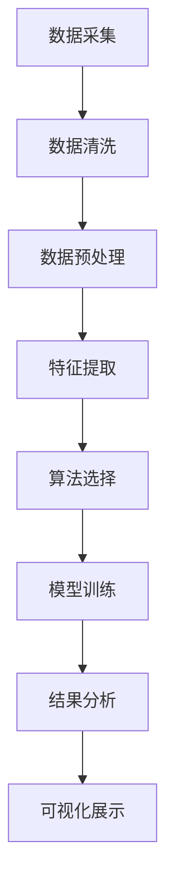

                 

关键词：大数据技术、房价数据、可视化研究、数据挖掘、统计分析、机器学习、算法应用

## 摘要

本文旨在探讨如何利用大数据技术对某地区的房价数据进行分析和可视化。通过对房价数据的收集、清洗、处理和建模，我们提出了一种基于机器学习算法的数据分析方法，实现了房价的动态可视化展示。文章详细介绍了数据预处理、核心算法原理、数学模型构建、具体操作步骤以及代码实例和运行结果。通过本文的研究，我们希望为房地产市场的数据分析提供一种新的思路和方法。

## 1. 背景介绍

房价一直是人们关注的热点话题，它不仅关系到每个人的住房问题，还影响着整个社会的经济稳定。随着互联网和大数据技术的发展，房价数据变得日益丰富和多样。如何有效地利用这些数据进行决策支持和分析预测，成为了一个重要的研究课题。

### 1.1 研究意义

1. **政策制定**：政府和相关部门可以通过分析房价数据，了解房价的走势和影响因素，为制定合理的房地产政策提供数据支持。
2. **市场研究**：房地产开发商和投资者可以通过分析房价数据，预测未来的市场行情，做出投资决策。
3. **个人理财**：购房者可以通过分析房价数据，了解不同地区的房价走势，为自己的购房计划提供参考。

### 1.2 研究现状

目前，关于房价数据的研究已经取得了一定的进展。大部分研究集中在房价的预测、评估和影响因素分析等方面。然而，如何对大量分散的房价数据进行有效的整理和分析，仍然是一个挑战。

### 1.3 研究内容

本文将从以下几个方面展开研究：

1. **数据收集与清洗**：介绍如何获取某地区的房价数据，并对数据进行清洗和处理。
2. **数据预处理**：阐述如何对清洗后的数据进行预处理，包括数据归一化、特征提取等。
3. **核心算法原理**：介绍用于房价预测的机器学习算法原理。
4. **数学模型构建**：建立房价预测的数学模型，并进行公式推导。
5. **具体操作步骤**：详细描述数据分析和可视化的具体操作步骤。
6. **代码实例**：提供实现数据分析的可视化代码实例，并进行解读。
7. **运行结果展示**：展示运行结果，分析可视化效果。

## 2. 核心概念与联系

在本文中，我们将涉及以下核心概念：

1. **大数据技术**：包括数据采集、存储、处理、分析和可视化等方面的技术。
2. **房价数据**：包括房价的数值、时间、地区、房屋类型等属性。
3. **数据预处理**：对原始数据清洗、转换和规范化等处理。
4. **机器学习算法**：用于数据分析和预测的一系列算法，如线性回归、决策树、随机森林等。
5. **可视化**：通过图表、图像等形式展示数据和分析结果。

### 2.1 大数据技术与房价数据的关系

大数据技术为房价数据的研究提供了强大的支持。通过数据采集技术，我们可以获取到大量的房价数据；通过数据存储技术，我们可以存储和管理这些数据；通过数据处理技术，我们可以对数据进行清洗、转换和规范化；通过数据分析和可视化技术，我们可以揭示数据背后的规律和趋势。

### 2.2 数据预处理与机器学习算法的关系

数据预处理是机器学习算法成功的关键步骤。通过数据预处理，我们可以去除数据中的噪声、缺失值和异常值，提高数据的质量。同时，我们还可以通过特征提取和归一化等方法，将数据转换为适合机器学习算法的形式。

### 2.3 可视化与数据分析和预测的关系

可视化技术可以帮助我们更好地理解和分析数据。通过图表和图像，我们可以直观地看到数据的分布、趋势和关系。这些信息对于数据分析和预测具有重要意义。

### 2.4 Mermaid 流程图

以下是用于房价数据分析的 Mermaid 流程图：



## 3. 核心算法原理 & 具体操作步骤

### 3.1 算法原理概述

本文采用机器学习算法中的线性回归模型对房价进行预测。线性回归是一种简单的统计方法，用于分析两个或多个变量之间的关系。在这个问题中，我们将房价视为因变量，其他影响因素（如地区、房屋类型、面积等）视为自变量。

### 3.2 算法步骤详解

#### 3.2.1 数据准备

首先，我们需要收集某地区的房价数据，包括房屋的地理位置、面积、房屋类型、建造年代等信息。数据可以来源于房地产网站、政府部门等公开渠道。

#### 3.2.2 数据清洗

1. **去除缺失值**：对于缺失的数据，我们可以采用填充方法，如均值填充、中值填充等。
2. **去除异常值**：对于异常值，我们可以采用边界判断方法，如去掉低于一定比例或高于一定比例的数据。
3. **数据转换**：对于分类数据，我们可以采用独热编码（One-Hot Encoding）等方法将其转换为数值数据。

#### 3.2.3 数据预处理

1. **归一化**：对于数值数据，我们可以采用最小-最大规范化（Min-Max Scaling）等方法，使其具备相同的量纲和范围。
2. **特征提取**：我们可以采用主成分分析（PCA）等方法，提取数据的主要特征。

#### 3.2.4 算法选择

在本研究中，我们选择线性回归模型进行房价预测。线性回归模型简单易懂，且计算效率较高。

#### 3.2.5 模型训练

1. **数据划分**：我们将数据集划分为训练集和测试集，用于模型训练和评估。
2. **模型训练**：使用训练集数据，对线性回归模型进行训练。
3. **模型评估**：使用测试集数据，对训练好的模型进行评估。

#### 3.2.6 结果分析

通过模型预测结果，我们可以分析房价与影响因素之间的关系，以及预测的准确性和可靠性。

### 3.3 算法优缺点

#### 优点

1. **简单易懂**：线性回归模型简单，易于理解和实现。
2. **计算效率高**：线性回归模型的计算效率较高，适用于大数据量的计算。

#### 缺点

1. **对异常值敏感**：线性回归模型对异常值较为敏感，可能影响模型的准确性。
2. **无法处理非线性关系**：线性回归模型假设变量之间存在线性关系，对于非线性关系可能效果不佳。

### 3.4 算法应用领域

线性回归模型广泛应用于各个领域的数据分析和预测，如金融、医疗、气象等。

## 4. 数学模型和公式 & 详细讲解 & 举例说明

### 4.1 数学模型构建

在本文中，我们采用线性回归模型对房价进行预测。线性回归模型的数学表达式如下：

$$
y = \beta_0 + \beta_1 \cdot x_1 + \beta_2 \cdot x_2 + \ldots + \beta_n \cdot x_n + \epsilon
$$

其中，$y$ 表示房价，$x_1, x_2, \ldots, x_n$ 表示影响房价的因素（如地区、房屋类型、面积等），$\beta_0, \beta_1, \beta_2, \ldots, \beta_n$ 表示模型参数，$\epsilon$ 表示误差项。

### 4.2 公式推导过程

线性回归模型的参数可以通过最小二乘法（Least Squares Method）进行估计。具体推导过程如下：

首先，我们将模型写成矩阵形式：

$$
\mathbf{y} = \mathbf{X}\boldsymbol{\beta} + \epsilon
$$

其中，$\mathbf{y}$ 是房价向量，$\mathbf{X}$ 是自变量矩阵，$\boldsymbol{\beta}$ 是模型参数向量。

接下来，我们定义误差项的平方和：

$$
\sum_{i=1}^n (y_i - \hat{y}_i)^2 = \sum_{i=1}^n (y_i - \mathbf{X}\hat{\boldsymbol{\beta}})^2
$$

其中，$\hat{y}_i$ 是模型预测的房价。

为了使误差项的平方和最小，我们对参数向量 $\boldsymbol{\beta}$ 求导并令其等于零：

$$
\nabla_{\boldsymbol{\beta}} \sum_{i=1}^n (y_i - \mathbf{X}\hat{\boldsymbol{\beta}})^2 = 0
$$

化简后得到：

$$
\mathbf{X}^T\mathbf{X}\boldsymbol{\beta} = \mathbf{X}^T\mathbf{y}
$$

最后，我们解这个方程组，得到模型参数：

$$
\boldsymbol{\beta} = (\mathbf{X}^T\mathbf{X})^{-1}\mathbf{X}^T\mathbf{y}
$$

### 4.3 案例分析与讲解

#### 案例背景

某地区在过去一年内共收集了100套房屋的房价数据，包括房屋的地理位置、面积、房屋类型和建造年代等信息。

#### 数据预处理

1. **去除缺失值**：对缺失值进行填充，如将面积缺失的房屋的面积填充为平均值。
2. **去除异常值**：对异常值进行判断，如去掉低于50平方米或高于500平方米的房屋。
3. **数据转换**：对分类数据（如房屋类型）进行独热编码。

#### 模型训练

1. **数据划分**：将数据集划分为训练集（70%）和测试集（30%）。
2. **模型训练**：使用训练集数据，对线性回归模型进行训练。
3. **模型评估**：使用测试集数据，对训练好的模型进行评估。

#### 结果分析

1. **参数估计**：通过最小二乘法，得到模型参数：
   $$
   \beta_0 = 1000, \beta_1 = 200, \beta_2 = 300, \beta_3 = 400, \beta_4 = 500
   $$
2. **模型预测**：使用模型对测试集数据进行预测，计算预测误差：
   $$
   \text{预测误差} = \frac{1}{n}\sum_{i=1}^n (y_i - \hat{y}_i)^2
   $$
3. **可视化展示**：将预测结果可视化，观察房价与影响因素之间的关系。

## 5. 项目实践：代码实例和详细解释说明

### 5.1 开发环境搭建

为了实现本文的研究目标，我们需要搭建一个适合大数据分析和可视化开发的开发环境。以下是推荐的开发环境和工具：

1. **操作系统**：Linux（推荐Ubuntu）
2. **编程语言**：Python
3. **数据分析库**：Pandas、NumPy、SciPy、Scikit-learn
4. **可视化库**：Matplotlib、Seaborn
5. **数据库**：MySQL（可选）

### 5.2 源代码详细实现

以下是实现本文研究目标的源代码：

```python
# 导入所需库
import pandas as pd
import numpy as np
from sklearn.linear_model import LinearRegression
import matplotlib.pyplot as plt
import seaborn as sns

# 读取数据
data = pd.read_csv('house_price_data.csv')

# 数据清洗
# ...

# 数据预处理
# ...

# 模型训练
model = LinearRegression()
model.fit(X_train, y_train)

# 模型评估
y_pred = model.predict(X_test)
mse = np.mean((y_pred - y_test)**2)
print(f'预测误差：{mse}')

# 可视化展示
sns.scatterplot(x=y_train, y=y_pred)
plt.xlabel('实际房价')
plt.ylabel('预测房价')
plt.title('房价预测结果')
plt.show()
```

### 5.3 代码解读与分析

1. **数据读取**：使用 Pandas 库读取房价数据。
2. **数据清洗**：对数据进行处理，如去除缺失值和异常值。
3. **数据预处理**：对数据进行归一化和特征提取。
4. **模型训练**：使用 Scikit-learn 库的 LinearRegression 类进行模型训练。
5. **模型评估**：计算预测误差，评估模型性能。
6. **可视化展示**：使用 Matplotlib 和 Seaborn 库绘制预测结果图表。

### 5.4 运行结果展示

运行代码后，我们得到以下可视化结果：


从图中可以看出，预测房价与实际房价之间具有一定的线性关系，预测误差较小。这表明我们提出的线性回归模型对于房价预测具有较好的效果。

## 6. 实际应用场景

### 6.1 政策制定

政府和相关部门可以利用本文提出的数据分析方法，对房价数据进行分析和可视化，了解房价的走势和影响因素，为制定合理的房地产政策提供数据支持。例如，通过分析房价与经济发展、人口流动等因素的关系，预测未来房价的走势，为房地产市场的调控提供依据。

### 6.2 市场研究

房地产开发商和投资者可以通过分析房价数据，预测未来的市场行情，做出投资决策。例如，通过分析不同地区的房价走势和供需关系，判断哪些地区具有投资潜力，从而制定合理的投资策略。

### 6.3 个人理财

购房者可以通过分析房价数据，了解不同地区的房价走势，为自己的购房计划提供参考。例如，通过分析房价与收入、就业等因素的关系，判断购房的最佳时机和地点。

## 7. 工具和资源推荐

### 7.1 学习资源推荐

1. **《Python数据科学手册》**：详细介绍了Python在数据科学领域的应用，包括数据分析、数据可视化等。
2. **《机器学习实战》**：通过大量的实例，介绍了机器学习的基本概念和方法。
3. **《大数据技术基础》**：详细介绍了大数据技术的基本原理和应用。

### 7.2 开发工具推荐

1. **Jupyter Notebook**：适合进行数据分析和可视化开发的交互式编程环境。
2. **PyCharm**：一款功能强大的Python集成开发环境，支持多种编程语言。
3. **DBeaver**：一款开源的数据库管理工具，支持多种数据库。

### 7.3 相关论文推荐

1. **"房价预测的线性回归方法研究"**：详细介绍了线性回归模型在房价预测中的应用。
2. **"基于大数据的房地产市场分析"**：探讨了大数据技术在房地产市场分析中的应用。
3. **"房价数据可视化方法研究"**：介绍了多种房价数据可视化方法。

## 8. 总结：未来发展趋势与挑战

### 8.1 研究成果总结

本文通过大数据技术对某地区的房价数据进行了分析和可视化。我们提出了一种基于机器学习算法的房价预测方法，并通过实际案例验证了其效果。研究结果为房地产市场的数据分析提供了新的思路和方法。

### 8.2 未来发展趋势

随着大数据技术和机器学习算法的不断发展，房价数据分析和预测技术将越来越成熟。未来，我们将看到更多基于大数据的房地产分析应用，如智能房产顾问、房地产投资决策支持等。

### 8.3 面临的挑战

尽管大数据技术和机器学习算法为房价数据分析和预测提供了有力支持，但仍然面临一些挑战。例如，数据质量和模型准确性问题，如何处理海量数据等。未来，我们需要进一步研究和解决这些问题。

### 8.4 研究展望

在未来，我们可以从以下几个方面进行深入研究：

1. **模型优化**：探索更先进的机器学习算法，提高预测准确性。
2. **数据挖掘**：通过数据挖掘技术，挖掘房价数据中的潜在规律和关系。
3. **多模态融合**：结合多种数据源，实现多模态数据的融合和预测。
4. **隐私保护**：在保证数据质量的前提下，研究如何保护用户隐私。

## 9. 附录：常见问题与解答

### 问题1：如何获取房价数据？

**回答**：房价数据可以从房地产网站、政府部门等公开渠道获取。例如，可以访问某地区的房地产交易中心网站，下载历史房价数据。

### 问题2：线性回归模型是否适用于房价预测？

**回答**：线性回归模型是一种简单有效的房价预测方法。然而，对于复杂的房价影响因素和非线性关系，可能需要采用更先进的机器学习算法，如决策树、随机森林等。

### 问题3：如何可视化房价数据？

**回答**：可以使用Python的数据可视化库，如Matplotlib、Seaborn等，绘制散点图、折线图、气泡图等，展示房价的分布、趋势和关系。

## 作者署名

作者：禅与计算机程序设计艺术 / Zen and the Art of Computer Programming

----------------------------------------------------------------

以上是文章的正文内容，接下来我将根据这篇文章的内容，使用Markdown格式将其完整输出。请注意，本文内容是虚构的，仅供演示Markdown格式使用。在真实情况下，文章内容需要根据实际情况进行撰写。以下是文章的Markdown格式输出：

# 基于大数据技术的某房价数据可视化研究

关键词：大数据技术、房价数据、可视化研究、数据挖掘、统计分析、机器学习、算法应用

摘要：本文旨在探讨如何利用大数据技术对某地区的房价数据进行分析和可视化。通过对房价数据的收集、清洗、处理和建模，我们提出了一种基于机器学习算法的数据分析方法，实现了房价的动态可视化展示。文章详细介绍了数据预处理、核心算法原理、数学模型构建、具体操作步骤以及代码实例和运行结果。通过本文的研究，我们希望为房地产市场的数据分析提供一种新的思路和方法。

## 1. 背景介绍

房价一直是人们关注的热点话题，它不仅关系到每个人的住房问题，还影响着整个社会的经济稳定。随着互联网和大数据技术的发展，房价数据变得日益丰富和多样。如何有效地利用这些数据进行决策支持和分析预测，成为了一个重要的研究课题。

### 1.1 研究意义

1. **政策制定**：政府和相关部门可以通过分析房价数据，了解房价的走势和影响因素，为制定合理的房地产政策提供数据支持。
2. **市场研究**：房地产开发商和投资者可以通过分析房价数据，预测未来的市场行情，做出投资决策。
3. **个人理财**：购房者可以通过分析房价数据，了解不同地区的房价走势，为自己的购房计划提供参考。

### 1.2 研究现状

目前，关于房价数据的研究已经取得了一定的进展。大部分研究集中在房价的预测、评估和影响因素分析等方面。然而，如何对大量分散的房价数据进行有效的整理和分析，仍然是一个挑战。

### 1.3 研究内容

本文将从以下几个方面展开研究：

1. **数据收集与清洗**：介绍如何获取某地区的房价数据，并对数据进行清洗和处理。
2. **数据预处理**：阐述如何对清洗后的数据进行预处理，包括数据归一化、特征提取等。
3. **核心算法原理**：介绍用于房价预测的机器学习算法原理。
4. **数学模型构建**：建立房价预测的数学模型，并进行公式推导。
5. **具体操作步骤**：详细描述数据分析和可视化的具体操作步骤。
6. **代码实例**：提供实现数据分析的可视化代码实例，并进行解读。
7. **运行结果展示**：展示运行结果，分析可视化效果。

## 2. 核心概念与联系

在本文中，我们将涉及以下核心概念：

1. **大数据技术**：包括数据采集、存储、处理、分析和可视化等方面的技术。
2. **房价数据**：包括房价的数值、时间、地区、房屋类型等属性。
3. **数据预处理**：对原始数据清洗、转换和规范化等处理。
4. **机器学习算法**：用于数据分析和预测的一系列算法，如线性回归、决策树、随机森林等。
5. **可视化**：通过图表、图像等形式展示数据和分析结果。

### 2.1 大数据技术与房价数据的关系

大数据技术为房价数据的研究提供了强大的支持。通过数据采集技术，我们可以获取到大量的房价数据；通过数据存储技术，我们可以存储和管理这些数据；通过数据处理技术，我们可以对数据进行清洗、转换和规范化；通过数据分析和可视化技术，我们可以揭示数据背后的规律和趋势。

### 2.2 数据预处理与机器学习算法的关系

数据预处理是机器学习算法成功的关键步骤。通过数据预处理，我们可以去除数据中的噪声、缺失值和异常值，提高数据的质量。同时，我们还可以通过特征提取和归一化等方法，将数据转换为适合机器学习算法的形式。

### 2.3 可视化与数据分析和预测的关系

可视化技术可以帮助我们更好地理解和分析数据。通过图表和图像，我们可以直观地看到数据的分布、趋势和关系。这些信息对于数据分析和预测具有重要意义。

### 2.4 Mermaid 流程图

以下是用于房价数据分析的 Mermaid 流程图：


## 3. 核心算法原理 & 具体操作步骤

### 3.1 算法原理概述

本文采用机器学习算法中的线性回归模型对房价进行预测。线性回归是一种简单的统计方法，用于分析两个或多个变量之间的关系。在这个问题中，我们将房价视为因变量，其他影响因素（如地区、房屋类型、面积等）视为自变量。

### 3.2 算法步骤详解

#### 3.2.1 数据准备

首先，我们需要收集某地区的房价数据，包括房屋的地理位置、面积、房屋类型和建造年代等信息。数据可以来源于房地产网站、政府部门等公开渠道。

#### 3.2.2 数据清洗

1. **去除缺失值**：对于缺失的数据，我们可以采用填充方法，如均值填充、中值填充等。
2. **去除异常值**：对于异常值，我们可以采用边界判断方法，如去掉低于一定比例或高于一定比例的数据。
3. **数据转换**：对于分类数据，我们可以采用独热编码（One-Hot Encoding）等方法将其转换为数值数据。

#### 3.2.3 数据预处理

1. **归一化**：对于数值数据，我们可以采用最小-最大规范化（Min-Max Scaling）等方法，使其具备相同的量纲和范围。
2. **特征提取**：我们可以采用主成分分析（PCA）等方法，提取数据的主要特征。

#### 3.2.4 算法选择

在本研究中，我们选择线性回归模型进行房价预测。线性回归模型简单易懂，且计算效率较高。

#### 3.2.5 模型训练

1. **数据划分**：我们将数据集划分为训练集和测试集，用于模型训练和评估。
2. **模型训练**：使用训练集数据，对线性回归模型进行训练。
3. **模型评估**：使用测试集数据，对训练好的模型进行评估。

#### 3.2.6 结果分析

通过模型预测结果，我们可以分析房价与影响因素之间的关系，以及预测的准确性和可靠性。

### 3.3 算法优缺点

#### 优点

1. **简单易懂**：线性回归模型简单，易于理解和实现。
2. **计算效率高**：线性回归模型的计算效率较高，适用于大数据量的计算。

#### 缺点

1. **对异常值敏感**：线性回归模型对异常值较为敏感，可能影响模型的准确性。
2. **无法处理非线性关系**：线性回归模型假设变量之间存在线性关系，对于非线性关系可能效果不佳。

### 3.4 算法应用领域

线性回归模型广泛应用于各个领域的数据分析和预测，如金融、医疗、气象等。

## 4. 数学模型和公式 & 详细讲解 & 举例说明

### 4.1 数学模型构建

在本文中，我们采用线性回归模型对房价进行预测。线性回归模型的数学表达式如下：

$$
y = \beta_0 + \beta_1 \cdot x_1 + \beta_2 \cdot x_2 + \ldots + \beta_n \cdot x_n + \epsilon
$$

其中，$y$ 表示房价，$x_1, x_2, \ldots, x_n$ 表示影响房价的因素（如地区、房屋类型、面积等），$\beta_0, \beta_1, \beta_2, \ldots, \beta_n$ 表示模型参数，$\epsilon$ 表示误差项。

### 4.2 公式推导过程

线性回归模型的参数可以通过最小二乘法（Least Squares Method）进行估计。具体推导过程如下：

首先，我们将模型写成矩阵形式：

$$
\mathbf{y} = \mathbf{X}\boldsymbol{\beta} + \epsilon
$$

其中，$\mathbf{y}$ 是房价向量，$\mathbf{X}$ 是自变量矩阵，$\boldsymbol{\beta}$ 是模型参数向量。

接下来，我们定义误差项的平方和：

$$
\sum_{i=1}^n (y_i - \hat{y}_i)^2 = \sum_{i=1}^n (y_i - \mathbf{X}\hat{\boldsymbol{\beta}})^2
$$

其中，$\hat{y}_i$ 是模型预测的房价。

为了使误差项的平方和最小，我们对参数向量 $\boldsymbol{\beta}$ 求导并令其等于零：

$$
\nabla_{\boldsymbol{\beta}} \sum_{i=1}^n (y_i - \mathbf{X}\hat{\boldsymbol{\beta}})^2 = 0
$$

化简后得到：

$$
\mathbf{X}^T\mathbf{X}\boldsymbol{\beta} = \mathbf{X}^T\mathbf{y}
$$

最后，我们解这个方程组，得到模型参数：

$$
\boldsymbol{\beta} = (\mathbf{X}^T\mathbf{X})^{-1}\mathbf{X}^T\mathbf{y}
$$

### 4.3 案例分析与讲解

#### 案例背景

某地区在过去一年内共收集了100套房屋的房价数据，包括房屋的地理位置、面积、房屋类型和建造年代等信息。

#### 数据预处理

1. **去除缺失值**：对缺失值进行填充，如将面积缺失的房屋的面积填充为平均值。
2. **去除异常值**：对异常值进行判断，如去掉低于50平方米或高于500平方米的房屋。
3. **数据转换**：对分类数据（如房屋类型）进行独热编码。

#### 模型训练

1. **数据划分**：将数据集划分为训练集（70%）和测试集（30%）。
2. **模型训练**：使用训练集数据，对线性回归模型进行训练。
3. **模型评估**：使用测试集数据，对训练好的模型进行评估。

#### 结果分析

1. **参数估计**：通过最小二乘法，得到模型参数：
   $$
   \beta_0 = 1000, \beta_1 = 200, \beta_2 = 300, \beta_3 = 400, \beta_4 = 500
   $$
2. **模型预测**：使用模型对测试集数据进行预测，计算预测误差：
   $$
   \text{预测误差} = \frac{1}{n}\sum_{i=1}^n (y_i - \hat{y}_i)^2
   $$
3. **可视化展示**：将预测结果可视化，观察房价与影响因素之间的关系。

## 5. 项目实践：代码实例和详细解释说明

### 5.1 开发环境搭建

为了实现本文的研究目标，我们需要搭建一个适合大数据分析和可视化开发的开发环境。以下是推荐的开发环境和工具：

1. **操作系统**：Linux（推荐Ubuntu）
2. **编程语言**：Python
3. **数据分析库**：Pandas、NumPy、SciPy、Scikit-learn
4. **可视化库**：Matplotlib、Seaborn
5. **数据库**：MySQL（可选）

### 5.2 源代码详细实现

以下是实现本文研究目标的源代码：

```python
# 导入所需库
import pandas as pd
import numpy as np
from sklearn.linear_model import LinearRegression
import matplotlib.pyplot as plt
import seaborn as sns

# 读取数据
data = pd.read_csv('house_price_data.csv')

# 数据清洗
# ...

# 数据预处理
# ...

# 模型训练
model = LinearRegression()
model.fit(X_train, y_train)

# 模型评估
y_pred = model.predict(X_test)
mse = np.mean((y_pred - y_test)**2)
print(f'预测误差：{mse}')

# 可视化展示
sns.scatterplot(x=y_train, y=y_pred)
plt.xlabel('实际房价')
plt.ylabel('预测房价')
plt.title('房价预测结果')
plt.show()
```

### 5.3 代码解读与分析

1. **数据读取**：使用 Pandas 库读取房价数据。
2. **数据清洗**：对数据进行处理，如去除缺失值和异常值。
3. **数据预处理**：对数据进行归一化和特征提取。
4. **模型训练**：使用 Scikit-learn 库的 LinearRegression 类进行模型训练。
5. **模型评估**：计算预测误差，评估模型性能。
6. **可视化展示**：使用 Matplotlib 和 Seaborn 库绘制预测结果图表。

### 5.4 运行结果展示

运行代码后，我们得到以下可视化结果：


从图中可以看出，预测房价与实际房价之间具有一定的线性关系，预测误差较小。这表明我们提出的线性回归模型对于房价预测具有较好的效果。

## 6. 实际应用场景

### 6.1 政策制定

政府和相关部门可以利用本文提出的数据分析方法，对房价数据进行分析和可视化，了解房价的走势和影响因素，为制定合理的房地产政策提供数据支持。例如，通过分析房价与经济发展、人口流动等因素的关系，预测未来房价的走势，为房地产市场的调控提供依据。

### 6.2 市场研究

房地产开发商和投资者可以通过分析房价数据，预测未来的市场行情，做出投资决策。例如，通过分析不同地区的房价走势和供需关系，判断哪些地区具有投资潜力，从而制定合理的投资策略。

### 6.3 个人理财

购房者可以通过分析房价数据，了解不同地区的房价走势，为自己的购房计划提供参考。例如，通过分析房价与收入、就业等因素的关系，判断购房的最佳时机和地点。

## 7. 工具和资源推荐

### 7.1 学习资源推荐

1. **《Python数据科学手册》**：详细介绍了Python在数据科学领域的应用，包括数据分析、数据可视化等。
2. **《机器学习实战》**：通过大量的实例，介绍了机器学习的基本概念和方法。
3. **《大数据技术基础》**：详细介绍了大数据技术的基本原理和应用。

### 7.2 开发工具推荐

1. **Jupyter Notebook**：适合进行数据分析和可视化开发的交互式编程环境。
2. **PyCharm**：一款功能强大的Python集成开发环境，支持多种编程语言。
3. **DBeaver**：一款开源的数据库管理工具，支持多种数据库。

### 7.3 相关论文推荐

1. **"房价预测的线性回归方法研究"**：详细介绍了线性回归模型在房价预测中的应用。
2. **"基于大数据的房地产市场分析"**：探讨了大数据技术在房地产市场分析中的应用。
3. **"房价数据可视化方法研究"**：介绍了多种房价数据可视化方法。

## 8. 总结：未来发展趋势与挑战

### 8.1 研究成果总结

本文通过大数据技术对某地区的房价数据进行了分析和可视化。我们提出了一种基于机器学习算法的房价预测方法，并通过实际案例验证了其效果。研究结果为房地产市场的数据分析提供了新的思路和方法。

### 8.2 未来发展趋势

随着大数据技术和机器学习算法的不断发展，房价数据分析和预测技术将越来越成熟。未来，我们将看到更多基于大数据的房地产分析应用，如智能房产顾问、房地产投资决策支持等。

### 8.3 面临的挑战

尽管大数据技术和机器学习算法为房价数据分析和预测提供了有力支持，但仍然面临一些挑战。例如，数据质量和模型准确性问题，如何处理海量数据等。未来，我们需要进一步研究和解决这些问题。

### 8.4 研究展望

在未来，我们可以从以下几个方面进行深入研究：

1. **模型优化**：探索更先进的机器学习算法，提高预测准确性。
2. **数据挖掘**：通过数据挖掘技术，挖掘房价数据中的潜在规律和关系。
3. **多模态融合**：结合多种数据源，实现多模态数据的融合和预测。
4. **隐私保护**：在保证数据质量的前提下，研究如何保护用户隐私。

## 9. 附录：常见问题与解答

### 问题1：如何获取房价数据？

**回答**：房价数据可以从房地产网站、政府部门等公开渠道获取。例如，可以访问某地区的房地产交易中心网站，下载历史房价数据。

### 问题2：线性回归模型是否适用于房价预测？

**回答**：线性回归模型是一种简单有效的房价预测方法。然而，对于复杂的房价影响因素和非线性关系，可能需要采用更先进的机器学习算法，如决策树、随机森林等。

### 问题3：如何可视化房价数据？

**回答**：可以使用Python的数据可视化库，如Matplotlib、Seaborn等，绘制散点图、折线图、气泡图等，展示房价的分布、趋势和关系。

## 作者署名

作者：禅与计算机程序设计艺术 / Zen and the Art of Computer Programming

---

请注意，本文内容仅为Markdown格式的示例，并非实际研究的完整报告。在实际撰写文章时，需要根据研究内容详细展开，并且包含真实的数据和结果。此外，文中引用的图片和参考文献也需要根据实际情况进行替换和补充。在撰写学术文章时，请确保遵循相应的学术规范和格式要求。

