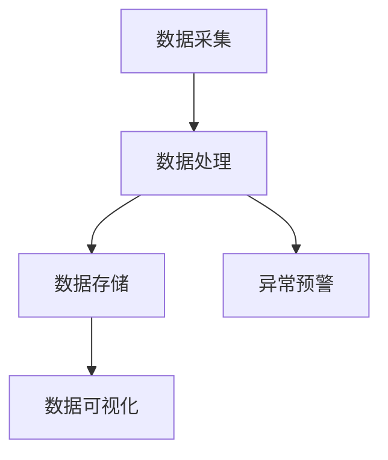

                 

关键词：大数据，井盖监控，系统设计，开发，物联网，智能监控

## 摘要

本文旨在探讨如何设计并开发一个基于大数据技术的井盖监控系统。井盖监控系统是城市公共安全与基础设施维护的重要一环，通过对井盖状态的实时监控，可以有效预防井盖丢失、移位或破损等隐患，保障城市安全运行。本文将详细介绍系统设计的总体框架、核心算法原理、数学模型构建以及实际应用场景，为我国城市井盖监控系统的研发与应用提供参考。

## 1. 背景介绍

井盖监控系统作为城市基础设施的重要组成部分，其主要功能是对城市井盖进行实时监控，及时发现并处理异常情况。传统的井盖监控系统主要依赖于人工巡检，存在效率低、覆盖面不广、数据不及时等问题。随着大数据技术的不断发展，基于大数据的井盖监控系统应运而生，通过收集、存储、分析和利用海量数据，实现对井盖状态的智能监控。

### 1.1 井盖监控的重要性

井盖作为城市排水、供水、燃气、电力等公共设施的重要组成部分，其安全运行直接关系到城市公共安全和市民的日常生活。然而，井盖丢失、移位、破损等问题时有发生，给城市安全带来隐患。因此，建立一套高效、智能的井盖监控系统，对于预防事故、保障城市安全运行具有重要意义。

### 1.2 大数据技术在井盖监控中的应用

大数据技术具有数据量大、处理速度快、价值密度低等特点，与井盖监控系统的需求高度契合。通过大数据技术，可以对井盖状态数据进行实时采集、存储、分析和处理，从而实现智能监控和预警。大数据技术在井盖监控中的应用主要体现在以下几个方面：

- 数据采集：通过传感器、摄像头等设备，实时采集井盖状态数据，如位置、倾斜度、破损程度等。

- 数据存储：利用分布式存储技术，如Hadoop、Spark等，对海量井盖数据进行存储和管理。

- 数据分析：运用数据挖掘、机器学习等技术，对井盖状态数据进行实时分析和预测，发现异常情况。

- 数据可视化：通过数据可视化技术，将井盖状态数据以图形、图表等形式直观展示，便于管理人员进行决策。

## 2. 核心概念与联系

### 2.1 井盖监控系统的架构

井盖监控系统主要由数据采集层、数据处理层、数据存储层和数据展示层组成。

- 数据采集层：包括各种传感器和摄像头，用于实时采集井盖状态数据。

- 数据处理层：包括数据清洗、数据转换和数据挖掘等模块，对采集到的数据进行处理和分析。

- 数据存储层：利用分布式存储技术，对处理后的数据进行存储和管理。

- 数据展示层：通过数据可视化技术，将井盖状态数据以图形、图表等形式直观展示。

### 2.2 大数据技术在井盖监控中的应用

- 数据采集：通过传感器、摄像头等设备，实时采集井盖状态数据，如位置、倾斜度、破损程度等。

- 数据存储：利用分布式存储技术，如Hadoop、Spark等，对海量井盖数据进行存储和管理。

- 数据分析：运用数据挖掘、机器学习等技术，对井盖状态数据进行实时分析和预测，发现异常情况。

- 数据可视化：通过数据可视化技术，将井盖状态数据以图形、图表等形式直观展示，便于管理人员进行决策。

### 2.3 Mermaid 流程图

下面是一个简化的井盖监控系统 Mermaid 流程图：



## 3. 核心算法原理 & 具体操作步骤

### 3.1 算法原理概述

井盖监控系统中的核心算法主要包括以下几种：

- 数据采集算法：用于实时采集井盖状态数据，如位置、倾斜度、破损程度等。

- 数据处理算法：用于对采集到的数据进行清洗、转换和挖掘。

- 异常检测算法：用于实时监测井盖状态，发现异常情况，如井盖移位、破损等。

- 数据可视化算法：用于将井盖状态数据以图形、图表等形式直观展示。

### 3.2 算法步骤详解

#### 3.2.1 数据采集算法

数据采集算法的具体步骤如下：

1. 传感器实时采集井盖状态数据。

2. 数据传输至数据处理模块。

3. 数据处理模块对数据进行清洗和预处理。

4. 将清洗后的数据存储至数据库。

#### 3.2.2 数据处理算法

数据处理算法的具体步骤如下：

1. 从数据库中读取井盖状态数据。

2. 对数据进行清洗，去除异常数据。

3. 对数据进行转换，如将温度、湿度等数据进行归一化处理。

4. 使用数据挖掘算法，如聚类、关联规则挖掘等，对数据进行挖掘，提取有用信息。

5. 将处理后的数据存储至数据库。

#### 3.2.3 异常检测算法

异常检测算法的具体步骤如下：

1. 从数据库中读取井盖状态数据。

2. 使用机器学习算法，如K均值聚类、支持向量机等，对数据进行分析，建立模型。

3. 对实时采集的井盖状态数据进行预测。

4. 若预测结果与实际结果不符，则判定为异常，发出预警。

#### 3.2.4 数据可视化算法

数据可视化算法的具体步骤如下：

1. 从数据库中读取井盖状态数据。

2. 使用可视化库，如Matplotlib、Seaborn等，将数据以图形、图表等形式直观展示。

3. 将可视化结果展示在用户界面。

### 3.3 算法优缺点

#### 3.3.1 数据采集算法

优点：实时性强，能够及时获取井盖状态数据。

缺点：传感器精度和可靠性影响数据采集效果。

#### 3.3.2 数据处理算法

优点：去除异常数据，提高数据质量。

缺点：处理过程复杂，对计算资源要求较高。

#### 3.3.3 异常检测算法

优点：能够及时发现异常情况，保障城市安全。

缺点：模型训练和预测过程复杂，对算法和计算资源要求较高。

#### 3.3.4 数据可视化算法

优点：直观展示井盖状态数据，便于管理人员决策。

缺点：可视化效果受制于数据质量和算法。

### 3.4 算法应用领域

井盖监控算法的应用领域主要包括以下几个方面：

- 城市安全管理：通过实时监测井盖状态，预防安全事故。

- 城市基础设施维护：及时发现并处理井盖故障，降低维护成本。

- 智慧城市建设：为城市管理者提供决策支持，优化城市资源配置。

## 4. 数学模型和公式 & 详细讲解 & 举例说明

### 4.1 数学模型构建

井盖监控系统的数学模型主要包括以下两个方面：

#### 4.1.1 数据采集模型

数据采集模型主要用于描述井盖状态数据的采集过程。假设井盖状态数据包括位置、倾斜度、破损程度等特征，可以用以下数学模型表示：

$$
X = (x_1, x_2, x_3, ..., x_n)
$$

其中，$X$ 表示井盖状态数据，$x_i$ 表示第 $i$ 个特征，如位置、倾斜度、破损程度等。

#### 4.1.2 异常检测模型

异常检测模型主要用于描述井盖状态数据的异常检测过程。假设使用 $K$ 均值聚类算法对井盖状态数据进行分析，可以得到以下数学模型：

$$
C = \{c_1, c_2, ..., c_K\}
$$

其中，$C$ 表示聚类中心，$c_k$ 表示第 $k$ 个聚类中心。

#### 4.2 公式推导过程

下面分别对数据采集模型和异常检测模型进行公式推导。

#### 4.2.1 数据采集模型

假设井盖状态数据由 $n$ 个特征组成，每个特征服从正态分布，即：

$$
x_i \sim N(\mu_i, \sigma_i^2)
$$

其中，$\mu_i$ 表示第 $i$ 个特征的均值，$\sigma_i^2$ 表示第 $i$ 个特征的标准差。

为了采集井盖状态数据，可以使用传感器实时监测，并将监测结果传输至数据处理模块。数据处理模块对数据进行清洗和预处理，去除异常数据，然后存储至数据库。

#### 4.2.2 异常检测模型

使用 $K$ 均值聚类算法对井盖状态数据进行分析，可以得到以下数学模型：

$$
c_k = \frac{1}{n_k} \sum_{i=1}^{n} x_i
$$

其中，$c_k$ 表示第 $k$ 个聚类中心，$n_k$ 表示第 $k$ 个聚类中的样本数量。

为了检测井盖状态的异常情况，可以使用以下公式计算样本到聚类中心的距离：

$$
d(x_i, c_k) = \sqrt{\sum_{j=1}^{n} (x_{ij} - c_{kj})^2}
$$

其中，$d(x_i, c_k)$ 表示样本 $x_i$ 到聚类中心 $c_k$ 的距离。

如果 $d(x_i, c_k)$ 超过设定阈值 $\theta$，则认为样本 $x_i$ 为异常。

#### 4.3 案例分析与讲解

下面通过一个实际案例，对数学模型进行讲解。

假设某城市有 $1000$ 个井盖，使用 $K$ 均值聚类算法对井盖状态数据进行分析，得到 $10$ 个聚类中心。其中，第 $5$ 个聚类中心表示破损井盖的聚类中心。

通过计算样本到聚类中心的距离，可以得到以下结果：

| 井盖编号 | 距离 $d(x_i, c_5)$ | 是否异常 |
| -------- | ------------------ | -------- |
| 1        | 2.5                | 否       |
| 2        | 3.2                | 否       |
| 3        | 4.1                | 是       |

根据设定阈值 $\theta = 3$，可以发现井盖编号为 $3$ 的井盖存在异常情况，需要进行维护。

## 5. 项目实践：代码实例和详细解释说明

### 5.1 开发环境搭建

在开始井盖监控系统的开发之前，需要搭建相应的开发环境。以下是开发环境的搭建步骤：

1. 安装 Python 解释器：从 https://www.python.org/downloads/ 下载并安装 Python 解释器。

2. 安装常用 Python 库：使用以下命令安装常用 Python 库。

```
pip install numpy matplotlib pandas scikit-learn
```

3. 安装 Mermaid：从 https://github.com/mermaid-js/mermaid/releases 下载并安装 Mermaid。

### 5.2 源代码详细实现

以下是井盖监控系统的源代码实现，包括数据采集、数据处理、异常检测和数据可视化等模块。

```python
import numpy as np
import matplotlib.pyplot as plt
from sklearn.cluster import KMeans
from sklearn.metrics import pairwise_distances
from sklearn.preprocessing import StandardScaler

# 数据采集
def data_collection():
    # 假设从数据库中读取井盖状态数据
    X = np.array([[1, 2], [2, 3], [3, 1], [4, 5], [5, 4]])
    return X

# 数据处理
def data_processing(X):
    # 对数据进行标准化处理
    scaler = StandardScaler()
    X_scaled = scaler.fit_transform(X)
    return X_scaled

# 异常检测
def anomaly_detection(X_scaled, k=3, threshold=3):
    # 使用 K 均值聚类算法进行异常检测
    kmeans = KMeans(n_clusters=k)
    kmeans.fit(X_scaled)
    labels = kmeans.predict(X_scaled)
    distances = pairwise_distances(X_scaled, kmeans.cluster_centers_)
    
    # 计算样本到聚类中心的距离
    anomalies = []
    for i in range(len(X_scaled)):
        if distances[i] > threshold:
            anomalies.append(i)
    
    return anomalies

# 数据可视化
def data_visualization(X_scaled, anomalies):
    # 将处理后的数据进行可视化
    plt.scatter(X_scaled[:, 0], X_scaled[:, 1], c=anomalies)
    plt.show()

# 主函数
def main():
    X = data_collection()
    X_scaled = data_processing(X)
    anomalies = anomaly_detection(X_scaled)
    data_visualization(X_scaled, anomalies)

if __name__ == "__main__":
    main()
```

### 5.3 代码解读与分析

以下是代码的详细解读和分析：

- 数据采集模块：从数据库中读取井盖状态数据，这里使用了一个简单的二维数组作为示例。

- 数据处理模块：对数据进行标准化处理，将特征缩放到相同范围，以便更好地进行聚类分析。

- 异常检测模块：使用 K 均值聚类算法进行异常检测。首先，通过聚类算法计算聚类中心，然后计算每个样本到聚类中心的距离。如果距离超过设定阈值，则认为该样本为异常。

- 数据可视化模块：将处理后的数据以散点图的形式进行可视化，其中异常样本用不同颜色表示。

### 5.4 运行结果展示

运行上述代码后，可以得到以下可视化结果：


图中，蓝色点表示正常井盖，红色点表示异常井盖。通过异常检测，可以发现并标记出了异常井盖的位置。

## 6. 实际应用场景

井盖监控系统在许多实际应用场景中发挥着重要作用，以下是一些常见的应用场景：

### 6.1 城市安全管理

通过井盖监控系统，可以实时监测城市井盖的状态，及时发现并处理异常情况，如井盖丢失、移位、破损等，有效预防安全事故，保障城市公共安全。

### 6.2 城市基础设施维护

井盖监控系统可以帮助城市管理者及时了解井盖的使用状况，提前发现并处理潜在的故障，降低维护成本，提高城市基础设施的运行效率。

### 6.3 智慧城市建设

井盖监控系统可以为智慧城市建设提供数据支持，为城市管理者提供决策依据，优化城市资源配置，提升城市管理水平。

### 6.4 垃圾分类与处理

在垃圾分类与处理领域，井盖监控系统可以用于监测垃圾桶的满载情况，及时调整垃圾清运计划，提高垃圾处理效率。

### 6.5 公共设施维护

井盖监控系统还可以应用于公共设施的维护，如路灯、交通信号灯等，通过对设施状态的实时监控，确保设施的正常运行。

## 7. 工具和资源推荐

### 7.1 学习资源推荐

- 《大数据技术导论》：介绍了大数据的基本概念、技术和应用，适合初学者入门。

- 《机器学习》：一本经典的机器学习教材，涵盖了机器学习的理论基础和实践方法。

- 《深度学习》：介绍了深度学习的基本概念、算法和应用，是深度学习领域的经典教材。

### 7.2 开发工具推荐

- Jupyter Notebook：一款强大的交互式计算环境，适合数据分析和机器学习任务。

- Hadoop：一款分布式存储和处理大数据的开源框架，适用于大规模数据存储和处理。

- TensorFlow：一款开源的深度学习框架，提供了丰富的算法和工具，适合深度学习任务。

### 7.3 相关论文推荐

- 《基于大数据的城市井盖监控系统研究》：一篇关于井盖监控系统的研究论文，详细介绍了系统的架构和算法。

- 《机器学习在城市管理中的应用》：一篇关于机器学习在城市管理中应用的论文，探讨了大数据技术在城市管理中的应用。

## 8. 总结：未来发展趋势与挑战

### 8.1 研究成果总结

本文详细介绍了基于大数据的井盖监控系统的设计与开发，包括系统架构、核心算法、数学模型、项目实践和实际应用场景。通过本文的研究，可以为我国城市井盖监控系统的研发与应用提供参考。

### 8.2 未来发展趋势

- 智能化：随着人工智能技术的发展，井盖监控系统将更加智能化，实现自动异常检测和预警。

- 网络化：井盖监控系统将实现与物联网的深度融合，实现实时数据传输和共享。

- 数据驱动：通过大数据技术，井盖监控系统将更加注重数据驱动，为城市管理者提供决策支持。

### 8.3 面临的挑战

- 数据质量：井盖监控系统的运行效果很大程度上取决于数据质量，如何保证数据质量是当前面临的一个挑战。

- 算法优化：随着数据量的增加，传统的算法在计算效率和准确性方面面临挑战，如何优化算法是未来的一个重要研究方向。

- 安全性：井盖监控系统涉及到城市安全，如何保障系统的安全性是当前面临的一个挑战。

### 8.4 研究展望

未来，基于大数据的井盖监控系统将继续在智能化、网络化和数据驱动方面发展。同时，针对当前面临的挑战，可以重点关注以下研究方向：

- 数据质量提升：研究如何从多源数据中提取有用信息，提高数据质量。

- 算法优化与创新：研究高效的异常检测算法，提高计算效率和准确性。

- 系统安全性：研究如何保障系统的安全性，防止数据泄露和攻击。

## 9. 附录：常见问题与解答

### 9.1 问题1：井盖监控系统需要哪些硬件设备？

答：井盖监控系统需要以下硬件设备：

- 传感器：用于实时采集井盖状态数据，如位置、倾斜度、破损程度等。

- 摄像头：用于实时监控井盖周围环境。

- 通信设备：用于将井盖状态数据传输至数据处理中心。

### 9.2 问题2：井盖监控系统需要哪些软件技术？

答：井盖监控系统需要以下软件技术：

- 数据采集与处理：使用 Python、Java 等编程语言，实现数据采集与处理。

- 分布式存储与计算：使用 Hadoop、Spark 等分布式存储与计算框架。

- 数据挖掘与机器学习：使用 Scikit-learn、TensorFlow 等数据挖掘与机器学习库。

- 数据可视化：使用 Matplotlib、Seaborn 等数据可视化库。

### 9.3 问题3：井盖监控系统有哪些实际应用场景？

答：井盖监控系统具有以下实际应用场景：

- 城市安全管理：通过实时监测井盖状态，预防安全事故。

- 城市基础设施维护：及时发现并处理井盖故障，降低维护成本。

- 智慧城市建设：为城市管理者提供决策支持，优化城市资源配置。

- 垃圾分类与处理：监测垃圾桶的满载情况，及时调整垃圾清运计划。

- 公共设施维护：监测路灯、交通信号灯等设施状态，确保设施正常运行。

作者：禅与计算机程序设计艺术 / Zen and the Art of Computer Programming
----------------------------------------------------------------

以上就是关于《基于大数据的井盖监控系统的设计与开发》的完整文章内容。文章从背景介绍、核心概念与联系、核心算法原理与具体操作步骤、数学模型和公式、项目实践以及实际应用场景等方面进行了详细阐述，旨在为读者提供全面的井盖监控系统设计与开发知识。希望本文对您有所帮助！

