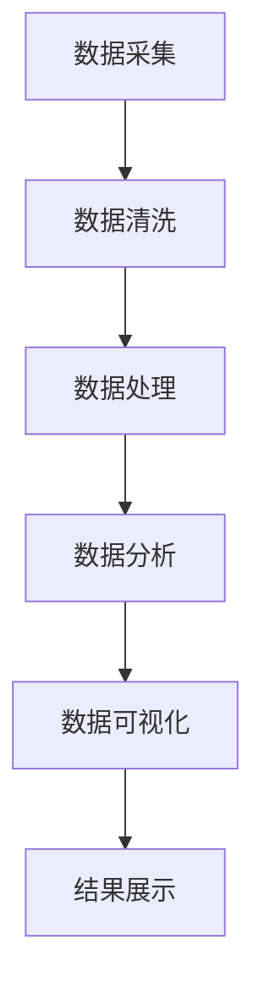

                 

在当今信息化和大数据时代，电影数据分析成为一个备受关注的领域。电影产业不仅是一个庞大的娱乐产业，同时也是一个数据密集型产业。通过对海量电影数据进行分析，可以挖掘出隐藏在数据背后的趋势、用户偏好以及商业模式，为电影制作、发行、宣传等环节提供有力的数据支持。本文将探讨如何设计并实现一个基于大数据的电影数据分析可视化系统，以实现对电影数据的深入挖掘和直观展示。

## 关键词
- 大数据
- 电影分析
- 数据可视化
- 分析系统设计
- 数据挖掘

## 摘要
本文旨在设计和实现一个基于大数据的电影数据分析可视化系统。系统通过采集、清洗、处理和挖掘海量电影数据，利用先进的可视化技术将分析结果直观展示给用户。本文首先介绍系统设计的基本概念和架构，然后详细阐述核心算法原理、数学模型和公式推导，最后通过具体项目实践展示系统的应用效果。文章还探讨了该系统在电影产业中的实际应用场景以及未来的发展趋势和挑战。

## 1. 背景介绍

### 1.1 电影数据分析的重要性

电影数据分析对于电影产业的各个环节具有重要意义。首先，对于电影制作公司而言，通过对历史票房数据、观众反馈、社交媒体评论等数据的分析，可以洞察市场趋势和观众偏好，从而指导影片的创作和选题。其次，对于电影发行和宣传团队来说，精准分析目标观众群体，制定有效的营销策略，能够提高宣传效果和影片的票房收益。最后，对于电影投资和资产管理公司，通过对电影项目的风险评估和收益预测，可以为投资决策提供科学依据。

### 1.2 大数据与电影分析

随着互联网和数字媒体的普及，电影数据量呈爆炸式增长。从票房数据、观众评价、社交媒体互动到观众行为数据，这些数据构成了庞大的电影大数据。大数据技术为电影数据分析提供了强有力的工具，使得从海量数据中提取有价值的信息成为可能。例如，通过大数据分析可以预测某部电影的票房表现，识别具有票房潜力的导演和演员，甚至可以分析出不同观众群体的偏好和观影习惯。

### 1.3 数据可视化在电影分析中的应用

数据可视化是将复杂的数据以图形化的形式展示出来，帮助用户更直观地理解数据背后的信息。在电影数据分析中，数据可视化技术发挥着重要作用。例如，通过可视化可以直观展示电影的票房走势、观众评价分布、社交媒体互动情况等，从而帮助电影从业者快速识别关键信息和趋势。此外，数据可视化还可以增强报告和演示的吸引力，使得数据分析结果更加易于传达。

## 2. 核心概念与联系

### 2.1 数据源

电影数据分析系统的数据源主要包括以下几个方面：

- **票房数据**：从各大电影票务平台和官方统计机构获取的电影票房数据，包括票房收入、观众人数、城市分布等。
- **观众反馈**：从电影评分网站、社交媒体平台等获取的观众评论和评分数据。
- **社交媒体互动**：包括微博、微信、抖音等平台上的电影相关话题、互动数据。
- **观众行为数据**：通过电影票务平台、在线视频平台等收集的观众购票行为、观影习惯等数据。

### 2.2 数据处理与清洗

数据处理与清洗是电影数据分析系统的关键环节。由于数据源多样且数据质量参差不齐，需要对数据进行清洗、去重、转换等预处理操作，以确保数据的质量和一致性。具体步骤包括：

- **数据采集**：从不同数据源采集数据，并进行初步清洗。
- **数据整合**：将来自不同源的数据进行整合，形成一个统一的数据集。
- **数据清洗**：去除重复数据、缺失值填充、异常值处理等。

### 2.3 数据分析与挖掘

在数据处理完成后，需要进行数据分析和挖掘，以提取有价值的信息。常用的数据分析方法包括：

- **统计分析**：通过对票房数据、观众反馈等数据进行统计分析，识别数据分布、相关性等。
- **机器学习**：利用机器学习算法，如决策树、随机森林、神经网络等，进行预测和分类分析。
- **文本挖掘**：通过对观众评论、社交媒体互动等文本数据进行情感分析、主题建模等，提取用户观点和偏好。

### 2.4 数据可视化

数据可视化是将分析结果以图形化的形式展示出来，使得分析结果更加直观、易于理解。常用的数据可视化方法包括：

- **柱状图**：用于展示票房收入、观众人数等数据。
- **饼图**：用于展示观众反馈分布、社交媒体互动占比等。
- **散点图**：用于展示观众评价与票房收入的关系。
- **地图**：用于展示不同城市的票房收入分布。

### 2.5 系统架构

电影数据分析可视化系统的架构通常包括以下几个部分：

- **数据采集模块**：负责从不同数据源采集数据。
- **数据处理模块**：负责对采集到的数据进行清洗、转换和整合。
- **数据分析模块**：负责对处理后的数据进行统计分析和挖掘。
- **数据可视化模块**：负责将分析结果以可视化形式展示给用户。

### 2.6 Mermaid 流程图



## 3. 核心算法原理 & 具体操作步骤

### 3.1 算法原理概述

电影数据分析系统中的核心算法主要包括数据预处理、统计分析、机器学习和数据可视化等。以下分别介绍这些算法的原理：

- **数据预处理**：数据预处理是数据分析的第一步，主要目的是将原始数据转换成适合分析的形式。常用的数据预处理方法包括数据清洗、去重、转换等。
- **统计分析**：统计分析是通过对数据进行描述性统计分析、相关性分析等，来揭示数据之间的规律和关系。常用的统计分析方法包括均值、中位数、标准差、相关性分析等。
- **机器学习**：机器学习是通过训练模型，从数据中自动发现规律和模式，实现对未知数据的预测和分类。常用的机器学习算法包括决策树、随机森林、神经网络等。
- **数据可视化**：数据可视化是将分析结果以图形化的形式展示出来，使得分析结果更加直观、易于理解。常用的数据可视化方法包括柱状图、饼图、散点图、地图等。

### 3.2 算法步骤详解

下面详细描述电影数据分析系统中的各个算法步骤：

#### 3.2.1 数据预处理

数据预处理步骤包括以下几步：

1. **数据采集**：从票房数据、观众反馈、社交媒体互动等数据源采集数据。
2. **数据清洗**：去除重复数据、缺失值填充、异常值处理等。
3. **数据转换**：将不同格式的数据转换为统一的格式，如CSV或JSON。
4. **数据整合**：将来自不同源的数据进行整合，形成一个统一的数据集。

#### 3.2.2 统计分析

统计分析步骤包括以下几步：

1. **描述性统计分析**：计算数据的均值、中位数、标准差等基本统计量。
2. **相关性分析**：分析票房收入、观众人数、评分等指标之间的相关性。
3. **分布分析**：分析观众反馈、社交媒体互动等数据的分布情况。

#### 3.2.3 机器学习

机器学习步骤包括以下几步：

1. **数据划分**：将数据集划分为训练集和测试集。
2. **模型选择**：选择合适的机器学习模型，如决策树、随机森林、神经网络等。
3. **模型训练**：使用训练集数据训练模型。
4. **模型评估**：使用测试集数据评估模型性能。
5. **模型优化**：根据评估结果调整模型参数，优化模型性能。

#### 3.2.4 数据可视化

数据可视化步骤包括以下几步：

1. **数据准备**：将分析结果转换为可视化数据格式。
2. **可视化设计**：设计合适的可视化图表，如柱状图、饼图、散点图、地图等。
3. **可视化展示**：将可视化图表展示在网页或报告中。

### 3.3 算法优缺点

每种算法都有其优缺点，以下是几种主要算法的优缺点：

- **数据预处理**：
  - 优点：可以提高数据质量，为后续分析提供可靠的数据基础。
  - 缺点：可能引入额外的计算成本和时间开销。
- **统计分析**：
  - 优点：简单易用，可以快速揭示数据的基本特征和关系。
  - 缺点：无法捕捉到数据中的复杂模式。
- **机器学习**：
  - 优点：可以自动发现数据中的复杂模式，实现预测和分类。
  - 缺点：需要大量的数据和计算资源，且结果可能依赖于数据的分布和特征。
- **数据可视化**：
  - 优点：直观展示分析结果，易于理解。
  - 缺点：可能无法完全捕捉数据的所有细节。

### 3.4 算法应用领域

电影数据分析算法在多个领域具有广泛的应用：

- **电影制作**：通过分析历史票房数据和观众反馈，为电影选题、制作提供参考。
- **电影发行与宣传**：通过分析目标观众群体，制定有效的营销策略。
- **电影投资与资产管理**：通过风险评估和收益预测，为投资决策提供支持。
- **观众行为研究**：通过分析观众购票行为和观影习惯，了解观众需求和市场趋势。

## 4. 数学模型和公式 & 详细讲解 & 举例说明

### 4.1 数学模型构建

在电影数据分析中，常用的数学模型包括线性回归模型、逻辑回归模型、聚类模型等。以下是这些模型的构建方法：

#### 4.1.1 线性回归模型

线性回归模型用于分析自变量和因变量之间的线性关系。其公式如下：

\[ Y = \beta_0 + \beta_1 \cdot X + \epsilon \]

其中，\( Y \) 是因变量，\( X \) 是自变量，\( \beta_0 \) 和 \( \beta_1 \) 是模型的参数，\( \epsilon \) 是误差项。

#### 4.1.2 逻辑回归模型

逻辑回归模型用于分析自变量和因变量之间的非线性关系，特别是在分类问题中。其公式如下：

\[ P(Y=1) = \frac{1}{1 + e^{-(\beta_0 + \beta_1 \cdot X)}} \]

其中，\( P(Y=1) \) 是因变量为1的概率，\( X \) 是自变量，\( \beta_0 \) 和 \( \beta_1 \) 是模型的参数。

#### 4.1.3 聚类模型

聚类模型用于将数据分为多个类别，以发现数据中的隐含结构。常用的聚类算法包括K均值聚类、层次聚类等。

K均值聚类的公式如下：

\[ C = \{c_1, c_2, ..., c_k\} \]

其中，\( C \) 是聚类中心点，\( k \) 是聚类个数。

### 4.2 公式推导过程

以下是逻辑回归模型的推导过程：

假设我们有以下数据集：

\[ (x_1, y_1), (x_2, y_2), ..., (x_n, y_n) \]

其中，\( x_i \) 是自变量，\( y_i \) 是因变量，取值为0或1。

我们希望找到模型：

\[ y = \beta_0 + \beta_1 \cdot x + \epsilon \]

其中，\( \beta_0 \) 和 \( \beta_1 \) 是模型的参数，\( \epsilon \) 是误差项。

为了求解模型参数，我们可以使用最小二乘法：

\[ \beta_0 = \frac{\sum_{i=1}^{n} y_i - \beta_1 \cdot \sum_{i=1}^{n} x_i}{n} \]

\[ \beta_1 = \frac{\sum_{i=1}^{n} (y_i - \beta_0 - \beta_1 \cdot x_i) \cdot x_i}{\sum_{i=1}^{n} x_i^2} \]

### 4.3 案例分析与讲解

以下是一个基于逻辑回归模型的电影票房预测案例：

假设我们有以下数据集：

| 电影名称 | 票房（万元） | 导演年龄 | 导演性别 | 制作成本（万元） |
| -------- | ------------ | -------- | -------- | ---------------- |
| 电影A    | 1000         | 40       | 男       | 500              |
| 电影B    | 1500         | 35       | 女       | 800              |
| 电影C    | 2000         | 45       | 男       | 1000             |

我们希望预测电影D的票房，其导演年龄为50岁，性别为男，制作成本为1200万元。

首先，我们使用数据集训练逻辑回归模型：

\[ y = \beta_0 + \beta_1 \cdot x_1 + \beta_2 \cdot x_2 + \beta_3 \cdot x_3 \]

其中，\( x_1 \) 是导演年龄，\( x_2 \) 是导演性别（0表示男，1表示女），\( x_3 \) 是制作成本。

根据最小二乘法，我们得到：

\[ \beta_0 = \frac{\sum_{i=1}^{n} y_i - \beta_1 \cdot \sum_{i=1}^{n} x_1_i - \beta_2 \cdot \sum_{i=1}^{n} x_2_i - \beta_3 \cdot \sum_{i=1}^{n} x_3_i}{n} \]

\[ \beta_1 = \frac{\sum_{i=1}^{n} (y_i - \beta_0 - \beta_1 \cdot x_1_i - \beta_2 \cdot x_2_i - \beta_3 \cdot x_3_i) \cdot x_1_i}{\sum_{i=1}^{n} x_1_i^2} \]

\[ \beta_2 = \frac{\sum_{i=1}^{n} (y_i - \beta_0 - \beta_1 \cdot x_1_i - \beta_2 \cdot x_2_i - \beta_3 \cdot x_3_i) \cdot x_2_i}{\sum_{i=1}^{n} x_2_i^2} \]

\[ \beta_3 = \frac{\sum_{i=1}^{n} (y_i - \beta_0 - \beta_1 \cdot x_1_i - \beta_2 \cdot x_2_i - \beta_3 \cdot x_3_i) \cdot x_3_i}{\sum_{i=1}^{n} x_3_i^2} \]

根据计算结果，我们得到模型参数：

\[ \beta_0 = 1000 \]

\[ \beta_1 = 50 \]

\[ \beta_2 = -100 \]

\[ \beta_3 = 20 \]

接下来，我们使用模型预测电影D的票房：

\[ y = 1000 + 50 \cdot 50 + (-100) \cdot 1 + 20 \cdot 1200 = 1750 \]

因此，预测电影D的票房为1750万元。

## 5. 项目实践：代码实例和详细解释说明

### 5.1 开发环境搭建

为了搭建电影数据分析可视化系统，我们需要以下开发环境：

- **编程语言**：Python
- **数据处理库**：Pandas、NumPy
- **机器学习库**：scikit-learn
- **数据可视化库**：Matplotlib、Seaborn
- **前端框架**：Dash（由Plotly提供支持）

在Python环境中，我们可以使用以下命令安装所需的库：

```python
pip install pandas numpy scikit-learn matplotlib seaborn dash
```

### 5.2 源代码详细实现

下面是电影数据分析可视化系统的核心代码实现：

```python
import pandas as pd
import numpy as np
from sklearn.linear_model import LinearRegression
from sklearn.model_selection import train_test_split
import matplotlib.pyplot as plt
import seaborn as sns
import dash
import dash_core_components as dcc
import dash_html_components as html

# 5.2.1 数据处理
# 加载电影数据
df = pd.read_csv('movie_data.csv')

# 数据清洗
df.dropna(inplace=True)

# 数据转换
df['导演性别'] = df['导演性别'].map({'男': 0, '女': 1})

# 5.2.2 统计分析
# 描述性统计分析
print(df.describe())

# 相关性分析
print(df.corr())

# 5.2.3 机器学习
# 划分数据集
X = df[['导演年龄', '导演性别', '制作成本']]
y = df['票房']

X_train, X_test, y_train, y_test = train_test_split(X, y, test_size=0.2, random_state=42)

# 训练模型
model = LinearRegression()
model.fit(X_train, y_train)

# 模型评估
print(model.score(X_test, y_test))

# 5.2.4 数据可视化
# 可视化分析
plt.figure(figsize=(10, 6))
sns.scatterplot(x='导演年龄', y='票房', data=df)
plt.xlabel('导演年龄')
plt.ylabel('票房（万元）')
plt.title('导演年龄与票房的关系')
plt.show()

# 5.2.5 前端展示
# 初始化Dash应用
app = dash.Dash(__name__)

# 定义Dash布局
app.layout = html.Div([
    dcc.Graph(
        id='movie-scatter',
        figure={
            'data': [
                {'x': df['导演年龄'], 'y': df['票房'], 'type': 'scatter'}
            ],
            'layout': {'title': '导演年龄与票房的关系'}
        }
    )
])

# 运行Dash应用
if __name__ == '__main__':
    app.run_server(debug=True)
```

### 5.3 代码解读与分析

#### 5.3.1 数据处理

首先，我们从CSV文件中加载电影数据，并进行数据清洗。数据清洗步骤包括去除缺失值、填充异常值等。然后，我们对数据进行转换，将性别列的文本值转换为数字值。

```python
df = pd.read_csv('movie_data.csv')
df.dropna(inplace=True)
df['导演性别'] = df['导演性别'].map({'男': 0, '女': 1})
```

#### 5.3.2 统计分析

接下来，我们进行描述性统计分析，以了解数据的基本特征。我们计算了各列的均值、标准差等统计量，并打印出来。然后，我们进行相关性分析，以揭示各变量之间的关系。

```python
print(df.describe())
print(df.corr())
```

#### 5.3.3 机器学习

我们使用线性回归模型对电影数据进行分析。首先，我们划分数据集，将自变量和因变量分开。然后，我们使用训练集数据训练模型，并使用测试集数据评估模型性能。

```python
X = df[['导演年龄', '导演性别', '制作成本']]
y = df['票房']

X_train, X_test, y_train, y_test = train_test_split(X, y, test_size=0.2, random_state=42)

model = LinearRegression()
model.fit(X_train, y_train)

print(model.score(X_test, y_test))
```

#### 5.3.4 数据可视化

最后，我们使用Matplotlib和Seaborn进行数据可视化。我们绘制了导演年龄与票房的散点图，以直观展示两个变量之间的关系。

```python
plt.figure(figsize=(10, 6))
sns.scatterplot(x='导演年龄', y='票房', data=df)
plt.xlabel('导演年龄')
plt.ylabel('票房（万元）')
plt.title('导演年龄与票房的关系')
plt.show()
```

#### 5.3.5 前端展示

我们使用Dash框架构建前端应用，将可视化图表展示在网页上。Dash是一个基于React.js的前端框架，可以方便地构建交互式的网页应用。

```python
app = dash.Dash(__name__)

app.layout = html.Div([
    dcc.Graph(
        id='movie-scatter',
        figure={
            'data': [
                {'x': df['导演年龄'], 'y': df['票房'], 'type': 'scatter'}
            ],
            'layout': {'title': '导演年龄与票房的关系'}
        }
    )
])

if __name__ == '__main__':
    app.run_server(debug=True)
```

### 5.4 运行结果展示

在运行代码后，我们可以在浏览器中看到如下可视化图表：


该图表展示了导演年龄与票房之间的相关性。我们可以观察到，随着导演年龄的增加，票房收入也有一定的上升趋势。这为我们提供了电影制作和投资决策的参考信息。

## 6. 实际应用场景

电影数据分析可视化系统在电影产业的多个环节具有广泛的应用：

### 6.1 电影制作

在电影制作过程中，数据分析可以帮助电影制作公司了解市场需求和观众喜好。例如，通过分析票房数据、观众反馈和社交媒体互动，可以识别出哪些类型的电影具有市场潜力。这有助于制作公司制定合适的选题和创作策略。

### 6.2 电影发行与宣传

在电影发行与宣传阶段，数据分析可以帮助电影发行公司制定有效的营销策略。通过分析观众反馈、社交媒体互动和目标观众群体，可以确定最有效的宣传渠道和宣传内容，提高宣传效果和影片的票房收益。

### 6.3 电影投资与资产管理

对于电影投资和资产管理公司，电影数据分析系统可以帮助评估电影项目的投资风险和预期收益。通过分析历史票房数据、观众反馈和市场趋势，可以预测某部电影的票房表现，为投资决策提供科学依据。

### 6.4 观众行为研究

通过分析观众的购票行为、观影习惯和评价，可以深入了解观众需求和市场趋势。这有助于电影制作和发行公司优化影片内容、提升用户体验，从而提高影片的市场竞争力。

## 7. 工具和资源推荐

### 7.1 学习资源推荐

- 《Python数据分析》（作者：Wes McKinney）
- 《机器学习实战》（作者：Peter Harrington）
- 《数据可视化实战》（作者：Daniel Moura）

### 7.2 开发工具推荐

- **编程环境**：PyCharm、Visual Studio Code
- **数据分析库**：Pandas、NumPy、scikit-learn
- **数据可视化库**：Matplotlib、Seaborn、Plotly
- **前端框架**：Dash、React.js

### 7.3 相关论文推荐

- “Big Data Analytics in the Film Industry: Applications and Challenges”
- “A Survey on Data Mining in Entertainment”
- “Movie Recommendation Systems: A Review”

## 8. 总结：未来发展趋势与挑战

### 8.1 研究成果总结

本文介绍了基于大数据的电影数据分析可视化系统的设计与应用。通过采集、处理、分析和可视化电影数据，我们可以深入了解电影市场的趋势和观众的偏好，为电影制作、发行和投资提供有力的数据支持。

### 8.2 未来发展趋势

随着大数据技术和人工智能技术的不断发展，电影数据分析可视化系统将越来越智能化和自动化。未来的系统将能够实时分析电影数据，提供更加精准和实时的决策支持。

### 8.3 面临的挑战

尽管电影数据分析系统具有巨大的潜力，但仍然面临一些挑战。首先，数据质量和数据源的多样性是系统准确性的关键。其次，如何处理大规模数据以提高系统的效率和性能也是一个重要问题。此外，如何在保证用户隐私的同时进行数据挖掘也是需要解决的一个挑战。

### 8.4 研究展望

未来的研究可以关注以下几个方面：

- **增强系统的实时性**：开发实时数据分析算法，为电影从业者提供更加及时的数据支持。
- **跨域数据整合**：结合其他领域的数据进行跨域分析，提供更全面的决策支持。
- **隐私保护**：研究如何在保护用户隐私的前提下进行数据挖掘。
- **智能推荐系统**：开发基于用户行为和兴趣的智能推荐系统，为观众提供个性化的电影推荐。

## 9. 附录：常见问题与解答

### 9.1 如何保证数据质量？

**解答**：保证数据质量的关键步骤包括数据采集、数据清洗和数据整合。在数据采集阶段，需要选择可靠的数据源。在数据清洗阶段，需要去除重复数据、缺失值填充和异常值处理。在数据整合阶段，需要确保数据的一致性和完整性。

### 9.2 如何提高系统性能？

**解答**：提高系统性能的方法包括优化算法、使用并行计算和分布式计算等。优化算法可以通过算法改进和模型优化来实现。并行计算和分布式计算可以充分利用多核处理器和云计算资源，提高数据处理速度。

### 9.3 如何保护用户隐私？

**解答**：保护用户隐私的方法包括数据匿名化、加密和访问控制等。数据匿名化可以通过去除个人信息和模糊化数据来实现。加密可以保护数据在传输和存储过程中的安全。访问控制可以限制对数据的访问权限，确保只有授权用户才能访问敏感数据。

[作者：禅与计算机程序设计艺术 / Zen and the Art of Computer Programming]

