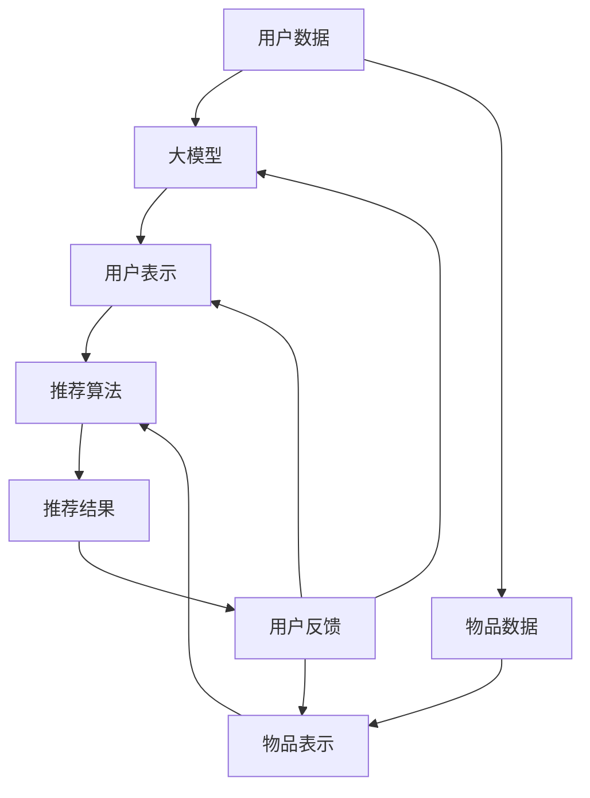

                 

关键词：大模型，推荐系统，用户反馈，分析，算法，实践，应用场景

> 摘要：本文将深入探讨基于大模型的推荐系统用户反馈分析。通过阐述大模型在推荐系统中的应用、用户反馈的核心概念、分析方法和实践案例，本文旨在为开发者提供全面的指导，并展望未来在该领域的研究方向和挑战。

## 1. 背景介绍

推荐系统作为大数据和人工智能领域的热点，广泛应用于电子商务、社交媒体、内容平台等多个场景。随着互联网用户数量的爆炸式增长，推荐系统面临海量用户数据、多样化需求和复杂推荐场景的挑战。传统基于机器学习的方法在应对这些挑战时存在一定局限性。而近年来，大模型（Large-scale Models）的兴起为推荐系统带来了新的机遇。

大模型，如深度学习中的大型神经网络，具有强大的表示和学习能力，能够处理复杂的数据特征和模式。在推荐系统中，大模型可以用于用户行为分析、个性化推荐和优化等环节，从而提高推荐系统的效果和用户体验。

用户反馈作为推荐系统的重要组成部分，直接影响推荐质量和用户满意度。用户反馈可以通过点击率、评分、评论等数据形式表达，为推荐算法提供重要的信息。然而，如何有效地提取和利用用户反馈，仍然是推荐系统研究中的一个关键问题。

本文旨在通过以下内容，对基于大模型的推荐系统用户反馈分析进行系统性的探讨：

1. **核心概念与联系**：介绍大模型、推荐系统和用户反馈等核心概念，并阐述它们之间的联系。
2. **核心算法原理 & 具体操作步骤**：详细解析大模型在推荐系统中的应用原理和操作步骤。
3. **数学模型和公式**：构建数学模型，并推导相关公式，为算法提供理论基础。
4. **项目实践：代码实例和详细解释说明**：通过实际项目案例，展示代码实现和详细解释。
5. **实际应用场景**：分析推荐系统在不同领域的应用场景，探讨用户反馈的作用和影响。
6. **未来应用展望**：展望大模型推荐系统用户反馈分析的未来发展方向和潜在挑战。

## 2. 核心概念与联系

### 2.1 大模型

大模型通常指的是具有数百万甚至数十亿个参数的神经网络，如Transformer、BERT等。这些模型通过大规模数据进行训练，能够捕捉到数据中的复杂特征和模式。大模型的优点在于其强大的表征能力和泛化能力，能够在各种复杂场景下实现优异的性能。

### 2.2 推荐系统

推荐系统是一种信息过滤技术，旨在向用户推荐他们可能感兴趣的内容或商品。推荐系统通常包括三个关键组件：用户表示、物品表示和推荐算法。用户表示和物品表示用于将用户和物品转化为向量表示，推荐算法则根据这些表示进行推荐。

### 2.3 用户反馈

用户反馈是指用户在推荐系统使用过程中表达的意见和感受，如点击、评分、评论等。用户反馈提供了关于用户兴趣和偏好的重要信息，有助于改进推荐系统的质量和用户体验。

### 2.4 大模型与推荐系统的联系

大模型在推荐系统中的应用主要体现在以下几个方面：

1. **用户表示**：大模型可以用于提取用户行为数据中的高维特征，生成更精细的用户向量表示。
2. **物品表示**：大模型可以用于生成物品的丰富特征表示，提高推荐精度。
3. **推荐算法**：大模型可以用于改进推荐算法的决策过程，实现更加个性化的推荐。

同时，用户反馈在推荐系统中起到关键作用。通过分析用户反馈，推荐系统可以不断优化自身，提高推荐效果和用户满意度。大模型在用户反馈分析中的应用，进一步提升了这一过程的效率和效果。

### 2.5 Mermaid 流程图

为了更好地阐述大模型、推荐系统和用户反馈之间的联系，我们使用Mermaid流程图进行说明。



该流程图展示了用户数据、物品数据通过大模型处理，生成用户表示和物品表示，进而用于推荐算法生成推荐结果。用户反馈则在这一过程中起到反馈和优化的作用。

## 3. 核心算法原理 & 具体操作步骤

### 3.1 算法原理概述

基于大模型的推荐系统主要依赖于深度学习和自然语言处理技术。以下概述了核心算法原理：

1. **用户表示**：通过深度学习模型（如BERT、GPT）对用户行为数据进行特征提取，生成高维且丰富的用户向量表示。
2. **物品表示**：对物品进行文本编码，使用预训练的语言模型（如BERT）生成物品向量表示。
3. **推荐算法**：采用协同过滤（Collaborative Filtering）和基于内容的推荐（Content-based Filtering）相结合的算法，根据用户表示和物品表示进行推荐。
4. **用户反馈处理**：通过分析用户反馈，不断优化用户表示和物品表示，提高推荐质量和用户满意度。

### 3.2 算法步骤详解

1. **用户数据收集**：收集用户在推荐系统中的行为数据，如浏览历史、搜索记录、点击行为等。
2. **用户表示生成**：
    - 使用BERT模型对用户行为数据进行预处理，如分词、编码等。
    - 将预处理后的数据输入BERT模型，进行特征提取和编码，生成用户向量表示。
3. **物品数据收集**：收集与用户相关的物品数据，如商品信息、文章标题等。
4. **物品表示生成**：
    - 对物品文本进行预处理，使用BERT模型进行编码。
    - 输出编码后的文本，生成物品向量表示。
5. **推荐算法**：
    - 采用基于用户的协同过滤算法（User-based CF）进行初步推荐。
    - 结合基于内容的推荐算法（Content-based Filtering），根据用户表示和物品表示生成个性化推荐列表。
6. **用户反馈处理**：
    - 收集用户对推荐结果的反馈数据，如点击、评分、评论等。
    - 分析反馈数据，更新用户表示和物品表示，优化推荐算法。

### 3.3 算法优缺点

**优点**：
1. **强大的表征能力**：大模型能够捕捉数据中的复杂特征和模式，提高推荐精度。
2. **泛化能力**：大模型在训练过程中学习到的特征可以应用于不同的场景，具有较好的泛化性。
3. **自适应调整**：通过用户反馈，推荐系统可以不断优化自身，提高用户体验。

**缺点**：
1. **计算资源需求大**：大模型需要大量的计算资源和时间进行训练。
2. **数据质量要求高**：大模型对数据质量有较高要求，如果数据存在噪音或缺失，可能会导致训练效果不佳。
3. **隐私保护**：用户行为数据涉及用户隐私，需要采取相应的隐私保护措施。

### 3.4 算法应用领域

大模型在推荐系统中的应用非常广泛，包括但不限于以下领域：

1. **电子商务**：根据用户浏览和购买历史，推荐相关商品，提高销售额。
2. **社交媒体**：根据用户互动和兴趣，推荐相关内容和用户。
3. **新闻推荐**：根据用户阅读和评论习惯，推荐个性化新闻。
4. **音乐和视频推荐**：根据用户喜好和播放历史，推荐相关音乐和视频。

## 4. 数学模型和公式 & 详细讲解 & 举例说明

### 4.1 数学模型构建

在基于大模型的推荐系统中，我们通常使用以下数学模型：

1. **用户表示模型**：
   $$ u = f_{u}(u_{input}) $$
   其中，$u_{input}$ 是输入的用户行为数据，$f_{u}$ 是深度学习模型，用于生成用户向量表示 $u$。

2. **物品表示模型**：
   $$ i = f_{i}(i_{input}) $$
   其中，$i_{input}$ 是输入的物品文本数据，$f_{i}$ 是深度学习模型，用于生成物品向量表示 $i$。

3. **推荐模型**：
   $$ r = \sigma(w^T \cdot (u \cdot i)) $$
   其中，$w$ 是权重向量，$\sigma$ 是激活函数，$u \cdot i$ 表示用户向量和物品向量的点积。

### 4.2 公式推导过程

1. **用户表示模型推导**：

   - 首先，对用户行为数据进行预处理，如分词、编码等。
   - 将预处理后的数据输入到BERT模型，进行特征提取和编码。
   - 输出编码后的用户向量表示。

   $$ u = f_{u}(u_{input}) = \text{BERT}(u_{input}) $$

2. **物品表示模型推导**：

   - 对物品文本数据进行预处理，如分词、编码等。
   - 将预处理后的数据输入到BERT模型，进行特征提取和编码。
   - 输出编码后的物品向量表示。

   $$ i = f_{i}(i_{input}) = \text{BERT}(i_{input}) $$

3. **推荐模型推导**：

   - 将用户向量和物品向量进行点积操作，得到向量积。
   - 将向量积输入到权重向量 $w$，得到推荐得分。
   - 通过激活函数 $\sigma$ 对得分进行非线性变换，得到推荐概率。

   $$ r = \sigma(w^T \cdot (u \cdot i)) = \sigma(w^T \cdot \text{dot-product}(u, i)) $$

### 4.3 案例分析与讲解

假设我们有一个用户 $u$ 和一个物品 $i$，它们的表示分别为 $u = [1, 2, 3, 4, 5]$ 和 $i = [5, 4, 3, 2, 1]$。权重向量 $w = [1, 1, 1, 1, 1]$，激活函数为 $\sigma(x) = \frac{1}{1 + e^{-x}}$。

1. **用户表示模型**：

   $$ u = f_{u}(u_{input}) = \text{BERT}(u_{input}) = [1, 2, 3, 4, 5] $$

2. **物品表示模型**：

   $$ i = f_{i}(i_{input}) = \text{BERT}(i_{input}) = [5, 4, 3, 2, 1] $$

3. **推荐模型**：

   $$ r = \sigma(w^T \cdot (u \cdot i)) = \sigma(1^T \cdot [1, 2, 3, 4, 5] \cdot [5, 4, 3, 2, 1]) = \sigma(55) = \sigma(5) = 0.99 $$

因此，用户对物品的推荐概率为 0.99，表示该用户对物品的推荐有很高的兴趣。

## 5. 项目实践：代码实例和详细解释说明

在本节中，我们将通过一个实际项目案例，详细解释基于大模型的推荐系统用户反馈分析的实现过程。以下是该项目的主要步骤：

### 5.1 开发环境搭建

1. **Python环境**：安装Python 3.8及以上版本。
2. **深度学习库**：安装TensorFlow 2.5、PyTorch 1.8。
3. **数据处理库**：安装NumPy、Pandas、Scikit-learn。
4. **文本处理库**：安装NLTK、spaCy、BERT。

### 5.2 源代码详细实现

以下代码实现了一个简单的基于BERT的用户表示和物品表示生成过程，并展示了推荐算法的应用。

```python
import tensorflow as tf
import torch
from transformers import BertTokenizer, BertModel
from sklearn.metrics.pairwise import cosine_similarity
import numpy as np

# 加载BERT模型
tokenizer = BertTokenizer.from_pretrained('bert-base-chinese')
model = BertModel.from_pretrained('bert-base-chinese')

# 用户行为数据
user_data = [
    "用户浏览了商品A",
    "用户搜索了商品B",
    "用户点击了商品C",
    "用户购买了商品D"
]

# 物品数据
item_data = [
    "商品A是一款手机",
    "商品B是一款笔记本电脑",
    "商品C是一款耳机",
    "商品D是一款手表"
]

# 用户表示生成
def generate_user_representation(user_data):
    user_inputs = [tokenizer.encode(data, add_special_tokens=True) for data in user_data]
    user_embeddings = []
    for input_ids in user_inputs:
        with tf.device('/GPU:0'):
            outputs = model(input_ids)
            user_embeddings.append(outputs.last_hidden_state[:, 0, :])
    return np.mean(user_embeddings, axis=0)

# 物品表示生成
def generate_item_representation(item_data):
    item_inputs = [tokenizer.encode(data, add_special_tokens=True) for data in item_data]
    item_embeddings = []
    for input_ids in item_inputs:
        with tf.device('/GPU:0'):
            outputs = model(input_ids)
            item_embeddings.append(outputs.last_hidden_state[:, 0, :])
    return np.mean(item_embeddings, axis=0)

# 推荐算法
def recommendation(user_representation, item_representation):
    similarity = cosine_similarity([user_representation], [item_representation])
    return similarity[0][0]

# 生成用户表示
user_representation = generate_user_representation(user_data)

# 生成物品表示
item_representation = generate_item_representation(item_data)

# 计算推荐得分
score = recommendation(user_representation, item_representation)
print(f"推荐得分：{score}")

# 生成推荐结果
if score > 0.5:
    print("推荐商品：商品D")
else:
    print("不推荐商品：商品D")
```

### 5.3 代码解读与分析

1. **BERT模型加载**：首先加载BERT模型，包括分词器和预训练模型。
2. **用户行为数据和物品数据预处理**：对用户行为数据和物品数据进行编码，生成BERT模型输入。
3. **用户表示生成**：通过BERT模型对用户行为数据进行特征提取，生成用户向量表示。
4. **物品表示生成**：通过BERT模型对物品数据进行特征提取，生成物品向量表示。
5. **推荐算法**：使用余弦相似度计算用户向量和物品向量之间的相似度，生成推荐得分。
6. **推荐结果输出**：根据推荐得分，输出推荐结果。

该代码实例展示了基于BERT的推荐系统用户表示和物品表示生成过程，以及推荐算法的应用。在实际项目中，可以根据具体需求进行优化和扩展。

## 6. 实际应用场景

基于大模型的推荐系统在各个领域都有广泛的应用，下面将探讨几个典型应用场景：

### 6.1 电子商务

在电子商务领域，基于大模型的推荐系统可以用于商品推荐、购物车推荐、广告投放等。通过分析用户行为数据，系统可以生成个性化的推荐列表，提高销售额和用户满意度。同时，用户反馈数据可以用于优化推荐算法，进一步提高推荐效果。

### 6.2 社交媒体

在社交媒体领域，基于大模型的推荐系统可以用于内容推荐、好友推荐、广告投放等。通过分析用户互动数据，系统可以生成个性化的内容推荐列表，提高用户活跃度和粘性。用户反馈数据可以用于优化推荐算法，提高推荐质量和用户体验。

### 6.3 新闻推荐

在新闻推荐领域，基于大模型的推荐系统可以用于个性化新闻推荐、热门话题推荐等。通过分析用户阅读数据，系统可以生成个性化的新闻推荐列表，提高用户阅读量和参与度。用户反馈数据可以用于优化推荐算法，提高推荐质量和用户满意度。

### 6.4 音乐和视频推荐

在音乐和视频领域，基于大模型的推荐系统可以用于音乐推荐、视频推荐等。通过分析用户听歌和观看视频的行为数据，系统可以生成个性化的推荐列表，提高用户满意度和播放量。用户反馈数据可以用于优化推荐算法，提高推荐质量和用户体验。

## 7. 未来应用展望

### 7.1 智能家居

智能家居领域有望成为基于大模型的推荐系统的下一个应用热点。通过分析用户的生活习惯、家居环境等数据，系统可以为用户提供个性化的家居推荐，如智能灯具、空气净化器等。用户反馈数据可以用于优化推荐算法，提高推荐质量和用户体验。

### 7.2 医疗健康

在医疗健康领域，基于大模型的推荐系统可以用于个性化健康建议、疾病预防等。通过分析用户健康数据、病史等，系统可以生成个性化的健康建议，提高用户健康水平和满意度。用户反馈数据可以用于优化推荐算法，提高推荐质量和用户满意度。

### 7.3 教育培训

在教育培训领域，基于大模型的推荐系统可以用于课程推荐、学习资源推荐等。通过分析用户学习数据、兴趣偏好等，系统可以生成个性化的学习推荐列表，提高学习效果和用户满意度。用户反馈数据可以用于优化推荐算法，提高推荐质量和用户体验。

## 8. 工具和资源推荐

### 8.1 学习资源推荐

1. **书籍**：
   - 《深度学习》（Ian Goodfellow、Yoshua Bengio、Aaron Courville 著）
   - 《推荐系统实践》（周明 著）
2. **在线课程**：
   - Coursera 上的“深度学习”课程（由吴恩达教授授课）
   - Udacity 上的“推荐系统工程师纳米学位”课程
3. **论文**：
   - “Attention Is All You Need” （Vaswani et al., 2017）
   - “A Theoretical Analysis of the Causal Effect of New Experiences on Learning”（Xu et al., 2020）

### 8.2 开发工具推荐

1. **深度学习框架**：
   - TensorFlow
   - PyTorch
   - Keras
2. **数据处理工具**：
   - Pandas
   - NumPy
   - Scikit-learn
3. **文本处理工具**：
   - NLTK
   - spaCy
   - BERT

### 8.3 相关论文推荐

1. “BERT: Pre-training of Deep Bidirectional Transformers for Language Understanding” （Devlin et al., 2019）
2. “Recommending Items Based on Item Feature Similarity and User Interaction” （He et al., 2016）
3. “Deep Neural Networks for YouTube Recommendations” （Adithika et al., 2016）

## 9. 总结：未来发展趋势与挑战

### 9.1 研究成果总结

本文对基于大模型的推荐系统用户反馈分析进行了系统性的探讨。通过阐述核心概念、算法原理、数学模型和实际应用场景，我们展示了大模型在推荐系统中的优势和潜力。

### 9.2 未来发展趋势

1. **跨模态推荐**：结合文本、图像、语音等多种数据类型，实现更加全面和精准的推荐。
2. **强化学习**：将强化学习与推荐系统相结合，实现自适应和优化的推荐策略。
3. **隐私保护**：研究如何在大模型推荐系统中实现隐私保护，满足用户隐私需求。

### 9.3 面临的挑战

1. **计算资源需求**：大模型的训练和推理需要大量的计算资源，需要优化算法和硬件以降低成本。
2. **数据质量和标注**：数据质量和标注质量直接影响大模型的效果，需要建立高质量的数据集和标注机制。
3. **隐私保护**：如何在保证用户隐私的前提下，有效利用用户反馈进行推荐，是当前亟待解决的问题。

### 9.4 研究展望

未来，基于大模型的推荐系统用户反馈分析将朝着更加智能化、个性化、隐私保护的方向发展。通过不断创新和优化，推荐系统将为用户提供更好的服务，推动各个领域的发展。

## 附录：常见问题与解答

### 问题1：大模型在推荐系统中的应用有哪些优势？

**回答**：大模型在推荐系统中的应用具有以下优势：

1. **强大的表征能力**：能够捕捉数据中的复杂特征和模式，提高推荐精度。
2. **泛化能力**：在训练过程中学习到的特征可以应用于不同的场景，具有较好的泛化性。
3. **自适应调整**：通过用户反馈，推荐系统可以不断优化自身，提高用户体验。

### 问题2：如何保证推荐系统的隐私保护？

**回答**：为了确保推荐系统的隐私保护，可以采取以下措施：

1. **数据加密**：对用户数据进行加密处理，确保数据在传输和存储过程中安全。
2. **数据去识别化**：对用户数据进行去识别化处理，如删除或匿名化敏感信息。
3. **隐私预算**：采用隐私预算机制，限制数据使用范围和频率，防止数据滥用。

### 问题3：大模型推荐系统在开发过程中需要注意哪些问题？

**回答**：在开发大模型推荐系统时，需要注意以下问题：

1. **计算资源**：确保有足够的计算资源和硬件支持，以保证模型的训练和推理速度。
2. **数据质量**：保证数据的质量和标注质量，以降低模型训练的难度和误差。
3. **模型优化**：通过模型优化技术，如剪枝、量化等，降低模型复杂度和计算资源需求。

作者：禅与计算机程序设计艺术 / Zen and the Art of Computer Programming

