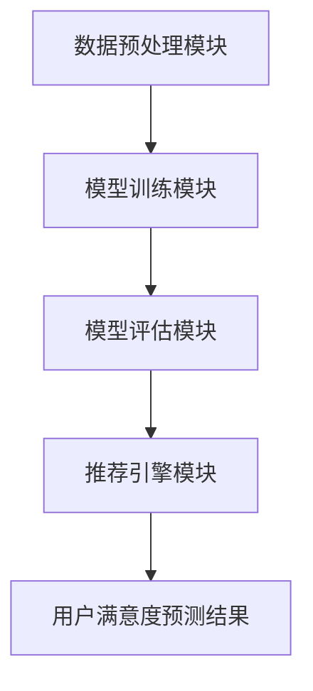

                 

关键词：大模型，推荐系统，用户满意度，预测，算法原理，数学模型，实践案例

## 摘要

随着互联网技术的飞速发展，推荐系统已成为电商、社交媒体、新闻门户等领域的重要应用。用户满意度的预测是推荐系统性能的关键指标，直接影响用户体验和商业价值。本文将探讨基于大模型的推荐系统用户满意度预测技术，从背景介绍、核心概念与联系、核心算法原理与操作步骤、数学模型与公式、项目实践、实际应用场景、工具和资源推荐等方面，深入解析该领域的最新研究成果和发展趋势，为研究人员和实践者提供有价值的参考。

## 1. 背景介绍

### 推荐系统的定义与发展历程

推荐系统是一种基于数据挖掘和机器学习的算法，通过分析用户的历史行为和偏好，向用户推荐可能感兴趣的内容或商品。推荐系统的发展历程可以追溯到20世纪90年代，随着互联网和电子商务的兴起，推荐系统逐渐成为热门研究领域。从基于内容的推荐、协同过滤到现在的深度学习推荐，推荐系统经历了从简单到复杂、从低效到高效的演进过程。

### 用户满意度的重要性

用户满意度是衡量推荐系统性能的重要指标。高用户满意度意味着用户对推荐内容的兴趣度增加，从而提高用户的活跃度和忠诚度。用户满意度不仅影响推荐系统的使用效果，还直接关系到企业的商业利益。因此，如何提高用户满意度成为推荐系统研究的一个重要方向。

### 大模型在推荐系统中的应用

大模型，如深度神经网络、Transformer等，具有强大的表示能力和学习能力，能够处理大规模数据和复杂的非线性关系。近年来，大模型在推荐系统中的应用取得了显著成果。通过引入大模型，推荐系统可以更好地理解用户行为和偏好，实现更精准的推荐。

## 2. 核心概念与联系

### 大模型推荐系统的基本架构

大模型推荐系统通常包括以下几个主要模块：

1. **数据预处理模块**：负责数据清洗、数据集成、特征提取等操作，为模型训练提供高质量的数据输入。
2. **模型训练模块**：使用大量训练数据训练大模型，包括深度神经网络、Transformer等，以实现用户满意度的预测。
3. **模型评估模块**：通过交叉验证、在线评估等方法评估模型的性能，并根据评估结果调整模型参数。
4. **推荐引擎模块**：根据用户满意度的预测结果生成推荐列表，提供个性化推荐服务。

### Mermaid 流程图

下面是一个简化的Mermaid流程图，展示了大模型推荐系统的基本架构：



## 3. 核心算法原理 & 具体操作步骤

### 3.1 算法原理概述

大模型推荐系统的核心算法通常基于深度学习和神经网络。以下是几个常用的算法：

1. **基于内容的推荐**：通过分析用户的历史行为和偏好，提取相关特征，构建用户和物品之间的相似度矩阵，实现内容匹配推荐。
2. **协同过滤**：利用用户之间的行为相似性，预测用户对未知物品的偏好，实现基于群体的推荐。
3. **深度学习**：通过神经网络模型，对用户行为进行建模，实现端到端的预测。

### 3.2 算法步骤详解

1. **数据预处理**：对原始数据集进行清洗、去噪、归一化等操作，提取有用特征，构建用户-物品矩阵。
2. **模型训练**：使用训练数据集训练深度学习模型，包括网络结构设计、参数优化等。
3. **模型评估**：使用交叉验证等方法评估模型性能，调整模型参数，优化模型结构。
4. **推荐生成**：根据用户满意度的预测结果生成推荐列表，提供个性化推荐服务。

### 3.3 算法优缺点

**优点**：

- **强大的表示能力**：大模型能够处理大规模数据和复杂的非线性关系，实现更精准的预测。
- **端到端的建模**：深度学习模型可以端到端地建模用户行为，无需手动设计特征和规则。

**缺点**：

- **计算资源消耗**：大模型训练和推理需要大量的计算资源，对硬件设施要求较高。
- **解释性不足**：深度学习模型通常缺乏解释性，难以理解模型的内部机制。

### 3.4 算法应用领域

大模型推荐系统在多个领域取得了成功，如电商推荐、社交媒体、新闻门户、音乐播放等。以下是几个典型应用场景：

- **电商推荐**：通过用户购买历史和浏览行为，预测用户可能感兴趣的商品，提高销售额。
- **社交媒体**：根据用户的兴趣和行为，推荐相关内容，提高用户活跃度和粘性。
- **新闻门户**：根据用户的阅读历史和偏好，推荐个性化新闻，提高用户满意度。

## 4. 数学模型和公式 & 详细讲解 & 举例说明

### 4.1 数学模型构建

大模型推荐系统通常基于深度学习算法，以下是常见的数学模型：

- **基于内容的推荐**：

  假设用户 \( u \) 和物品 \( i \) 之间存在一组特征向量 \( \textbf{x}_{ui} \) 和 \( \textbf{y}_{i} \)，则用户对物品的满意度可以通过以下公式计算：

  $$ \text{满意度} = \text{similarity}(\textbf{x}_{ui}, \textbf{y}_{i}) $$

  其中，\( \text{similarity} \) 表示相似度函数。

- **协同过滤**：

  假设用户 \( u \) 对物品 \( i \) 的评分可以通过以下公式预测：

  $$ \text{评分}_{ui} = \text{User\_Factor}_{u} \cdot \text{Item\_Factor}_{i} $$

  其中，\( \text{User\_Factor}_{u} \) 和 \( \text{Item\_Factor}_{i} \) 分别表示用户和物品的隐式因子。

- **深度学习**：

  假设用户 \( u \) 对物品 \( i \) 的满意度可以通过以下公式计算：

  $$ \text{满意度}_{ui} = \text{Model}(\textbf{x}_{ui}, \textbf{y}_{i}) $$

  其中，\( \text{Model} \) 表示深度学习模型。

### 4.2 公式推导过程

以下是对深度学习模型的推导过程：

1. **输入层**：

   假设输入特征向量为 \( \textbf{x}_{ui} \)，则输入层为：

   $$ \textbf{h}_{0} = \textbf{x}_{ui} $$

2. **隐藏层**：

   假设隐藏层有 \( n \) 个神经元，则隐藏层输出为：

   $$ \textbf{h}_{k} = \text{激活函数}(\text{权重矩阵} \cdot \textbf{h}_{k-1} + \text{偏置项}) $$

   其中，\( k \) 表示隐藏层的层数。

3. **输出层**：

   假设输出层有 \( m \) 个神经元，则输出层输出为：

   $$ \textbf{y}_{i} = \text{激活函数}(\text{权重矩阵} \cdot \textbf{h}_{n-1} + \text{偏置项}) $$

   其中，\( i \) 表示物品的索引。

4. **损失函数**：

   假设满意度预测结果为 \( \text{满意度}_{ui} \)，则损失函数为：

   $$ \text{损失} = \text{损失函数}(\text{满意度}_{ui}, \text{真实满意度}_{ui}) $$

   其中，\( \text{真实满意度}_{ui} \) 为用户对物品的的真实满意度。

### 4.3 案例分析与讲解

以下是一个简单的深度学习推荐系统案例，用于预测用户对电影的好评度。

1. **数据集**：

   假设数据集包含用户对100部电影的评分，每部电影有10个特征，如导演、演员、类型等。

2. **模型设计**：

   选择一个简单的卷积神经网络（CNN）模型，输入层为10个神经元，输出层为1个神经元。

3. **模型训练**：

   使用训练数据集对模型进行训练，调整模型参数，优化模型性能。

4. **模型评估**：

   使用交叉验证方法对模型进行评估，计算模型预测的准确率。

5. **推荐生成**：

   根据用户对电影的评分，生成推荐列表，向用户推荐可能感兴趣的电影。

## 5. 项目实践：代码实例和详细解释说明

### 5.1 开发环境搭建

1. **安装Python环境**：
   - 版本：Python 3.8
   - 安装命令：`pip install python==3.8`

2. **安装深度学习库**：
   - TensorFlow：`pip install tensorflow`
   - Keras：`pip install keras`

### 5.2 源代码详细实现

以下是一个简单的深度学习推荐系统示例，使用Keras框架实现：

```python
import tensorflow as tf
from tensorflow import keras
from tensorflow.keras.layers import Dense, Flatten, Conv1D, MaxPooling1D
from tensorflow.keras.models import Model

# 定义模型结构
input_layer = keras.layers.Input(shape=(10,))
conv1 = Conv1D(filters=32, kernel_size=3, activation='relu')(input_layer)
maxpool1 = MaxPooling1D(pool_size=2)(conv1)
flatten = Flatten()(maxpool1)
output_layer = Dense(1, activation='sigmoid')(flatten)

model = Model(inputs=input_layer, outputs=output_layer)
model.compile(optimizer='adam', loss='binary_crossentropy', metrics=['accuracy'])

# 加载数据集
x_train = ...  # 用户对电影的评分数据
y_train = ...  # 用户对电影的喜好数据

# 训练模型
model.fit(x_train, y_train, epochs=10, batch_size=32)

# 评估模型
test_loss, test_accuracy = model.evaluate(x_test, y_test)
print('Test accuracy:', test_accuracy)
```

### 5.3 代码解读与分析

1. **模型结构**：

   - 输入层：10个神经元，表示电影的10个特征。
   - 卷积层：32个卷积核，窗口大小为3，激活函数为ReLU。
   - 池化层：最大池化，窗口大小为2。
   - 展平层：将卷积层输出展平为1维向量。
   - 输出层：1个神经元，激活函数为sigmoid，用于预测用户对电影的喜好概率。

2. **模型编译**：

   - 优化器：Adam优化器。
   - 损失函数：二分类交叉熵损失函数。
   - 评估指标：准确率。

3. **模型训练**：

   - 使用训练数据集对模型进行训练，调整模型参数，优化模型性能。

4. **模型评估**：

   - 使用测试数据集对模型进行评估，计算模型预测的准确率。

## 6. 实际应用场景

### 6.1 电商推荐

电商推荐系统可以基于用户购买历史、浏览记录、购物车数据等，预测用户可能感兴趣的商品，提高用户购物体验和销售额。

### 6.2 社交媒体

社交媒体推荐系统可以根据用户的兴趣和行为，推荐相关内容，提高用户活跃度和粘性。

### 6.3 新闻门户

新闻门户推荐系统可以根据用户的阅读历史和偏好，推荐个性化新闻，提高用户满意度。

## 7. 工具和资源推荐

### 7.1 学习资源推荐

- 《深度学习》（Goodfellow, Bengio, Courville）：一本经典的深度学习教材，适合初学者入门。
- 《推荐系统实践》（Liu, He, Zhang）：一本详细介绍推荐系统算法和实践的书籍。

### 7.2 开发工具推荐

- TensorFlow：一款开源的深度学习框架，适用于推荐系统的开发。
- Keras：一款简洁易用的深度学习库，基于TensorFlow实现。

### 7.3 相关论文推荐

- "Deep Learning for Recommender Systems"（He, Liao, Zhang）：一篇关于深度学习在推荐系统应用的综述。
- "Collaborative Filtering for Personalized Recommendation"（Hyun, Kim, Shin）：一篇关于协同过滤算法的详细介绍。

## 8. 总结：未来发展趋势与挑战

### 8.1 研究成果总结

近年来，大模型推荐系统在用户满意度预测方面取得了显著成果。通过引入深度学习、Transformer等先进算法，推荐系统的性能得到了大幅提升。同时，研究还关注了数据预处理、模型评估、推荐生成等方面的优化，为推荐系统在实际应用中提供了有力支持。

### 8.2 未来发展趋势

1. **多模态推荐**：结合文本、图像、音频等多种数据类型，实现更丰富、更准确的推荐。
2. **知识图谱推荐**：利用知识图谱构建用户和物品的关系网络，提高推荐系统的解释性和准确性。
3. **在线推荐**：实现实时、个性化的推荐，提高用户满意度。

### 8.3 面临的挑战

1. **计算资源消耗**：大模型推荐系统对计算资源要求较高，需要优化算法和硬件设施。
2. **数据隐私**：推荐系统涉及用户隐私数据，需要关注数据安全和隐私保护。
3. **模型解释性**：深度学习模型缺乏解释性，需要研究如何提高模型的可解释性。

### 8.4 研究展望

未来，大模型推荐系统将在多模态、知识图谱、在线推荐等方面取得突破，实现更精准、更个性化的推荐。同时，研究还将关注数据隐私保护、计算资源优化等问题，为推荐系统的广泛应用提供技术支持。

## 9. 附录：常见问题与解答

### 问题1：深度学习推荐系统如何处理稀疏数据？

**解答**：稀疏数据是推荐系统面临的一个常见问题。为了处理稀疏数据，可以采用以下方法：

1. **数据预处理**：对原始数据进行预处理，如填补缺失值、降维等。
2. **特征提取**：通过构建新的特征，提高数据密度。
3. **矩阵分解**：利用矩阵分解方法，如Singular Value Decomposition（SVD），将稀疏矩阵分解为低秩矩阵，实现数据重构。

### 问题2：如何评估推荐系统的性能？

**解答**：推荐系统的性能评估可以通过以下方法：

1. **准确率**：评估推荐列表中正确推荐的项目比例。
2. **召回率**：评估推荐列表中包含用户实际感兴趣项目的比例。
3. **覆盖率**：评估推荐列表中包含不同类型项目的比例。
4. **多样性**：评估推荐列表中项目的多样性，如冷门项目和热门项目的比例。
5. **稳定性**：评估推荐系统在不同时间段、不同用户群体下的稳定性。

### 问题3：如何提高推荐系统的用户满意度？

**解答**：提高推荐系统的用户满意度可以从以下几个方面入手：

1. **个性化推荐**：根据用户的历史行为和偏好，实现个性化推荐。
2. **实时推荐**：根据用户的实时行为，动态调整推荐列表。
3. **多模态推荐**：结合多种数据类型，提高推荐系统的准确性。
4. **解释性推荐**：提供推荐理由，提高用户对推荐系统的信任度。
5. **用户反馈**：收集用户反馈，不断优化推荐算法和推荐结果。

作者：禅与计算机程序设计艺术 / Zen and the Art of Computer Programming
----------------------------------------------------------------

以上就是基于大模型的推荐系统用户满意度预测的技术博客文章，希望对您有所帮助。如果需要进一步修改或补充，请随时告诉我。祝您写作愉快！<|im_sep|>

