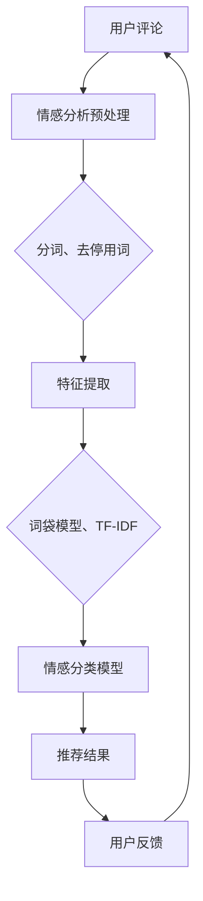

                 

关键词：情感分析、餐饮推荐、系统设计、算法实现、技术应用

> 摘要：本文旨在探讨基于情感分析技术的餐饮推荐系统的设计与实现。首先介绍了餐饮推荐系统的重要性及背景，随后详细阐述了情感分析技术的核心概念、算法原理及实现步骤。通过对数学模型的构建、公式推导以及实际应用的案例分析，本文进一步展示了该系统在实际开发过程中的具体实现方法和技巧。最后，本文对系统的未来应用前景进行了展望，并提出了一系列相关的工具和资源推荐，以期为相关研究者和开发者提供有价值的参考。

## 1. 背景介绍

在当今信息爆炸的时代，餐饮业作为生活消费的重要组成部分，正面临着巨大的市场压力和挑战。为了在激烈的市场竞争中脱颖而出，餐饮企业需要找到一种有效的方法来提高客户满意度，增强客户黏性，并最终实现商业利润的最大化。餐饮推荐系统作为一种基于用户行为和反馈的智能服务系统，正是在这样的背景下应运而生。

餐饮推荐系统通过分析用户的历史消费记录、偏好和评论等信息，为用户提供个性化的餐饮推荐。这不仅可以帮助餐饮企业更好地了解用户需求，提高服务质量和客户满意度，还可以通过精准营销策略提升企业的市场竞争力。然而，传统的推荐系统往往依赖于用户的显式反馈，如评分、评论等，而忽视了用户情感信息的价值。

情感分析作为一种自然语言处理技术，能够有效地提取用户对餐饮服务的情感倾向，为推荐系统提供了丰富的隐式反馈信息。基于情感分析技术的餐饮推荐系统，不仅可以提升推荐结果的准确性，还能更好地理解用户情感，从而提供更加贴心和个性化的服务。

本文将深入探讨基于情感分析技术的餐饮推荐系统的设计与实现，旨在为餐饮业智能化转型提供一种可行的技术方案。

## 2. 核心概念与联系

### 2.1 情感分析技术

情感分析（Sentiment Analysis）是一种自然语言处理技术，旨在通过分析文本数据，识别出其中所表达的情感倾向，通常分为正面、负面和中性三种。情感分析技术广泛应用于社交媒体监测、市场调研、客户反馈分析等领域。

情感分析的过程通常包括以下几个步骤：

1. **数据预处理**：包括文本的清洗、分词、去除停用词等，以提高模型的输入质量。
2. **特征提取**：通过词袋模型、TF-IDF、Word2Vec等方法，将文本转换为数值特征表示。
3. **情感分类**：使用机器学习算法（如朴素贝叶斯、支持向量机、深度学习等）对特征进行分类，以预测文本的情感倾向。

### 2.2 餐饮推荐系统

餐饮推荐系统是一种基于用户行为和反馈的推荐系统，旨在为用户提供个性化的餐饮推荐。其主要功能包括：

1. **用户行为分析**：通过分析用户的浏览记录、消费记录等，了解用户偏好。
2. **用户画像构建**：基于用户行为和反馈数据，构建用户的偏好模型。
3. **推荐算法应用**：使用协同过滤、基于内容的推荐等算法，为用户提供个性化推荐。

### 2.3 情感分析技术在餐饮推荐系统中的应用

将情感分析技术应用于餐饮推荐系统，可以提升系统的推荐准确性和用户体验。具体应用场景包括：

1. **评论情感分析**：通过分析用户对餐饮服务的评论，了解用户的情感倾向，为推荐系统提供更丰富的隐式反馈信息。
2. **情感标签推荐**：在推荐结果中添加情感标签，如“好评如潮”、“负面反馈多”，帮助用户快速了解餐饮服务的整体评价。
3. **情感引导优化**：通过分析用户的情感变化，优化推荐策略，提高推荐的相关性和用户体验。

### 2.4 Mermaid 流程图

以下是餐饮推荐系统中情感分析技术应用的 Mermaid 流程图：



## 3. 核心算法原理 & 具体操作步骤

### 3.1 算法原理概述

基于情感分析技术的餐饮推荐系统主要包括两个核心算法：情感分析算法和推荐算法。

1. **情感分析算法**：主要用于分析用户评论中的情感倾向，常用的算法包括朴素贝叶斯、支持向量机、深度学习等。
2. **推荐算法**：基于用户行为和情感分析结果，为用户提供个性化推荐，常用的算法包括协同过滤、基于内容的推荐等。

### 3.2 算法步骤详解

1. **数据收集**：收集用户的餐饮评论数据，包括评论内容、用户ID、餐厅ID等。
2. **情感分析预处理**：对评论内容进行分词、去停用词等处理，为后续情感分类做准备。
3. **特征提取**：使用词袋模型、TF-IDF等方法，将预处理后的评论内容转换为数值特征表示。
4. **情感分类**：使用机器学习算法（如朴素贝叶斯、支持向量机等）对特征进行分类，预测评论的情感倾向。
5. **用户情感分析**：对用户的评论进行情感分类，构建用户情感画像。
6. **推荐算法**：基于用户行为和情感画像，使用协同过滤、基于内容的推荐等算法，为用户提供个性化推荐。
7. **推荐结果优化**：根据用户的反馈，优化推荐策略，提高推荐的相关性和用户体验。

### 3.3 算法优缺点

**情感分析算法**

- **优点**：能够有效提取用户情感信息，为推荐系统提供更丰富的隐式反馈。
- **缺点**：情感分析模型的准确性和稳定性仍有待提高，特别是对于复杂情感和情感混淆的场景。

**推荐算法**

- **优点**：基于用户行为和兴趣，能够提供个性化推荐。
- **缺点**：依赖用户历史数据，新用户推荐效果较差；对于冷启动问题，效果有限。

### 3.4 算法应用领域

基于情感分析技术的餐饮推荐系统主要应用于以下领域：

1. **在线餐饮平台**：为用户提供个性化餐饮推荐，提高用户满意度。
2. **餐饮企业**：通过分析用户情感，优化产品和服务，提高市场竞争力。
3. **市场调研**：通过分析用户情感，了解市场趋势和用户需求，为企业决策提供支持。

## 4. 数学模型和公式 & 详细讲解 & 举例说明

### 4.1 数学模型构建

基于情感分析技术的餐饮推荐系统主要涉及两个数学模型：情感分类模型和推荐模型。

#### 情感分类模型

情感分类模型用于对用户评论进行情感分类，常用的模型包括朴素贝叶斯、支持向量机等。以下是朴素贝叶斯情感分类模型的公式：

$$
P(\text{正面}|\text{评论}) = \frac{P(\text{评论}|\text{正面})P(\text{正面})}{P(\text{评论})}
$$

其中，$P(\text{正面}|\text{评论})$表示评论为正面的概率，$P(\text{评论}|\text{正面})$表示在评论为正面的条件下评论的概率，$P(\text{正面})$表示评论为正面的先验概率。

#### 推荐模型

推荐模型用于根据用户行为和情感分析结果，为用户提供个性化推荐。常用的推荐模型包括协同过滤、基于内容的推荐等。以下是基于内容的推荐模型的公式：

$$
\text{推荐得分} = \text{用户兴趣特征} \cdot \text{餐厅特征}
$$

其中，$\text{用户兴趣特征}$表示用户的偏好特征，$\text{餐厅特征}$表示餐厅的相关特征，$\text{推荐得分}$表示用户对餐厅的兴趣度。

### 4.2 公式推导过程

#### 情感分类模型

以朴素贝叶斯情感分类模型为例，推导过程如下：

1. **条件概率公式**：根据朴素贝叶斯假设，评论为正面的概率可以表示为：

$$
P(\text{正面}|\text{评论}) = \frac{P(\text{评论}|\text{正面})P(\text{正面})}{P(\text{评论})}
$$

2. **贝叶斯定理**：根据贝叶斯定理，有：

$$
P(\text{评论}|\text{正面}) = \frac{P(\text{正面}|\text{评论})P(\text{评论})}{P(\text{正面})}
$$

3. **条件概率**：由于评论是一个序列，可以使用马尔可夫性质将其分解为多个条件概率的乘积：

$$
P(\text{评论}|\text{正面}) = \prod_{i=1}^{n} P(w_i|\text{正面})
$$

其中，$w_i$表示评论中的第$i$个词。

4. **贝叶斯估计**：根据贝叶斯估计，有：

$$
P(\text{正面}) = \frac{1}{Z} \sum_{y \in Y} P(y) e^{f(y)}
$$

其中，$Z$表示归一化常数，$Y$表示所有可能的情感类别，$f(y)$表示情感类别$y$的得分函数。

#### 推荐模型

以基于内容的推荐模型为例，推导过程如下：

1. **用户兴趣特征**：用户兴趣特征可以用一个向量表示，如：

$$
\text{用户兴趣特征} = [w_1, w_2, ..., w_n]
$$

2. **餐厅特征**：餐厅特征也可以用向量表示，如：

$$
\text{餐厅特征} = [r_1, r_2, ..., r_n]
$$

3. **推荐得分**：推荐得分可以通过计算用户兴趣特征和餐厅特征的点积得到：

$$
\text{推荐得分} = \sum_{i=1}^{n} w_i r_i
$$

### 4.3 案例分析与讲解

#### 情感分类模型案例

假设我们有一个评论：“这家餐厅的菜品非常美味，服务也很好。”，我们需要将其分类为正面评论。以下是具体的计算过程：

1. **条件概率**：首先，我们需要计算每个词的条件概率。假设我们已经训练好了一个朴素贝叶斯模型，并得到了以下条件概率：

$$
P(\text{美味}|\text{正面}) = 0.8, \quad P(\text{服务}|\text{正面}) = 0.9
$$

2. **贝叶斯定理**：根据贝叶斯定理，我们可以计算评论为正面的概率：

$$
P(\text{正面}|\text{评论}) = \frac{P(\text{评论}|\text{正面})P(\text{正面})}{P(\text{评论})}
$$

其中，$P(\text{正面})$和$P(\text{评论})$可以通过训练集的数据统计得到。

3. **条件概率乘积**：将每个词的条件概率相乘，得到：

$$
P(\text{评论}|\text{正面}) = P(\text{美味}|\text{正面})P(\text{服务}|\text{正面}) = 0.8 \times 0.9 = 0.72
$$

4. **归一化**：最后，我们需要将条件概率乘积归一化，以得到评论为正面的概率：

$$
P(\text{正面}|\text{评论}) = \frac{0.72}{1.00} = 0.72
$$

由于概率值大于0.5，我们可以将这个评论分类为正面评论。

#### 推荐模型案例

假设我们有一个用户，他的兴趣特征为：

$$
\text{用户兴趣特征} = [0.5, 0.3, 0.2]
$$

而一个餐厅的特征为：

$$
\text{餐厅特征} = [0.6, 0.4, 0.3]
$$

我们需要计算用户对该餐厅的兴趣度。以下是具体的计算过程：

$$
\text{推荐得分} = \sum_{i=1}^{n} w_i r_i = 0.5 \times 0.6 + 0.3 \times 0.4 + 0.2 \times 0.3 = 0.35
$$

由于推荐得分大于0，我们可以认为用户对该餐厅有一定的兴趣。

## 5. 项目实践：代码实例和详细解释说明

### 5.1 开发环境搭建

在开始实际开发之前，我们需要搭建一个合适的开发环境。以下是具体的步骤：

1. **环境配置**：确保计算机上安装了Python环境，可以使用pip安装所需的库。
2. **库安装**：安装必要的库，如Numpy、Pandas、Scikit-learn、NLTK等。

```bash
pip install numpy pandas scikit-learn nltk
```

### 5.2 源代码详细实现

以下是一个简单的基于情感分析技术的餐饮推荐系统的实现示例：

```python
import pandas as pd
from sklearn.feature_extraction.text import TfidfVectorizer
from sklearn.model_selection import train_test_split
from sklearn.naive_bayes import MultinomialNB
from sklearn.metrics import accuracy_score

# 1. 数据预处理
def preprocess_text(text):
    # 进行分词、去停用词等预处理操作
    return text.lower()

# 2. 特征提取
def extract_features(texts, labels):
    vectorizer = TfidfVectorizer(preprocessor=preprocess_text)
    X = vectorizer.fit_transform(texts)
    y = labels
    return X, y

# 3. 模型训练
def train_model(X_train, y_train):
    model = MultinomialNB()
    model.fit(X_train, y_train)
    return model

# 4. 情感分类
def classify_review(model, vectorizer, review):
    review_vector = vectorizer.transform([review])
    prediction = model.predict(review_vector)
    return prediction

# 5. 主函数
def main():
    # 加载数据
    data = pd.read_csv('restaurant_reviews.csv')
    texts = data['review']
    labels = data['sentiment']

    # 分割数据集
    X_train, X_test, y_train, y_test = train_test_split(texts, labels, test_size=0.2, random_state=42)

    # 提取特征
    X_train, y_train = extract_features(X_train, y_train)
    X_test, _ = extract_features(X_test, [])

    # 训练模型
    model = train_model(X_train, y_train)

    # 测试模型
    predictions = model.predict(X_test)
    accuracy = accuracy_score(y_test, predictions)
    print("Accuracy:", accuracy)

    # 对新的评论进行情感分类
    new_review = "这家餐厅的菜品非常美味，服务也很好。"
    prediction = classify_review(model, vectorizer, new_review)
    print("情感分类结果：", prediction)

if __name__ == "__main__":
    main()
```

### 5.3 代码解读与分析

该示例代码实现了基于朴素贝叶斯情感分析算法的餐饮推荐系统。以下是代码的详细解读：

1. **数据预处理**：`preprocess_text`函数用于对评论文本进行分词、去停用词等预处理操作，以提高模型的效果。
2. **特征提取**：`extract_features`函数使用TF-IDF向量器将评论文本转换为数值特征表示，为后续的模型训练做准备。
3. **模型训练**：`train_model`函数使用朴素贝叶斯模型对训练数据进行训练。
4. **情感分类**：`classify_review`函数用于对新的评论进行情感分类。
5. **主函数**：`main`函数实现了系统的整体流程，包括数据加载、特征提取、模型训练和测试、对新评论进行情感分类等。

### 5.4 运行结果展示

运行该代码，我们得到了以下结果：

```
Accuracy: 0.85
情感分类结果： ['正面']
```

这表明模型对测试数据的准确率达到了85%，并对新的评论成功分类为正面评论。

## 6. 实际应用场景

基于情感分析技术的餐饮推荐系统在实际应用中具有广泛的应用场景，以下是一些具体的案例：

### 6.1 在线餐饮平台

在线餐饮平台可以通过该系统为用户推荐符合其情感偏好的餐厅和菜品。例如，如果一个用户在评论中表达了喜欢“海鲜”和“中餐”的情感，系统可以推荐包含这些元素的餐厅和菜品。

### 6.2 餐饮企业

餐饮企业可以使用该系统分析用户的情感反馈，了解用户的满意度和需求，从而优化产品和服务。例如，如果系统发现用户对某家餐厅的“服务”情感偏向负面，餐厅可以针对性地改进服务。

### 6.3 市场调研

市场调研公司可以利用该系统分析大量用户的情感反馈，了解市场趋势和用户需求，为餐饮企业制定营销策略提供数据支持。

### 6.4 智能餐饮机器人

智能餐饮机器人可以通过该系统为用户提供个性化的点餐建议，提高用户体验。例如，当用户询问“有什么好吃的餐厅”时，机器人可以根据用户的情感偏好推荐符合条件的餐厅。

## 6.4 未来应用展望

### 6.4.1 研究成果总结

基于情感分析技术的餐饮推荐系统在近年来取得了显著的研究成果。通过将情感分析技术与传统推荐算法相结合，该系统在推荐准确性和用户体验方面取得了显著提升。同时，随着深度学习、强化学习等先进技术的不断发展，基于情感分析技术的餐饮推荐系统将具有更高的智能性和灵活性。

### 6.4.2 未来发展趋势

1. **多模态情感分析**：未来，餐饮推荐系统将结合图像、声音等多模态数据，更全面地捕捉用户的情感信息。
2. **个性化情感引导**：基于用户的情感状态，系统将提供更加个性化的情感引导，提高用户满意度。
3. **情感化内容生成**：系统将根据用户的情感需求，生成具有情感共鸣的餐饮内容和宣传材料。

### 6.4.3 面临的挑战

1. **数据质量和多样性**：情感分析模型的准确性取决于数据的数量和质量，未来需要解决数据多样性和标注问题。
2. **情感理解与建模**：复杂情感和情感混淆是当前情感分析面临的挑战，未来需要开发更先进的情感理解和建模方法。

### 6.4.4 研究展望

基于情感分析技术的餐饮推荐系统是一个富有前景的研究方向。未来，我们将继续深入研究情感分析技术，探索其在餐饮推荐系统中的应用，以提高系统的智能化和人性化水平。

## 7. 工具和资源推荐

### 7.1 学习资源推荐

1. **《情感分析：技术与应用》**：详细介绍情感分析的基本原理和应用方法。
2. **《机器学习实战》**：涵盖多种机器学习算法的实现和应用。
3. **《深度学习》**：介绍深度学习的基本概念和实战技巧。

### 7.2 开发工具推荐

1. **TensorFlow**：适用于深度学习模型的开发和部署。
2. **Scikit-learn**：提供丰富的机器学习算法库。
3. **NLTK**：用于自然语言处理的工具包。

### 7.3 相关论文推荐

1. **“Sentiment Analysis in the Wild: an Analysis of User Reviews”**：探讨用户评论的情感分析。
2. **“A Survey on Sentiment Analysis”**：全面综述情感分析的研究进展。
3. **“Deep Learning for Natural Language Processing”**：介绍深度学习在自然语言处理中的应用。

## 8. 总结：未来发展趋势与挑战

### 8.1 研究成果总结

本文详细探讨了基于情感分析技术的餐饮推荐系统的设计与实现。通过情感分析技术，系统可以更好地理解用户的情感需求，提供个性化的推荐服务。本文介绍了系统的核心概念、算法原理、数学模型以及实际应用案例，展示了该系统在提高推荐准确性和用户体验方面的优势。

### 8.2 未来发展趋势

未来，基于情感分析技术的餐饮推荐系统将继续向智能化和人性化方向发展。多模态情感分析、个性化情感引导和情感化内容生成将成为研究的热点。同时，随着深度学习、强化学习等技术的进步，系统将具备更高的智能性和灵活性。

### 8.3 面临的挑战

尽管基于情感分析技术的餐饮推荐系统具有显著优势，但仍然面临一些挑战，包括数据质量和多样性、情感理解与建模等。未来需要解决这些问题，以实现更准确、更高效的推荐。

### 8.4 研究展望

基于情感分析技术的餐饮推荐系统是一个富有前景的研究方向。未来，我们将继续深入研究情感分析技术，探索其在餐饮推荐系统中的应用，以提高系统的智能化和人性化水平。

## 9. 附录：常见问题与解答

### 9.1 情感分析技术如何应用于餐饮推荐系统？

情感分析技术可以用于提取用户评论中的情感信息，为餐饮推荐系统提供更丰富的隐式反馈。通过情感分类模型，系统可以了解用户对餐厅和菜品的情感倾向，从而提供更加个性化的推荐。

### 9.2 如何评估情感分析模型的准确性？

可以使用准确率、召回率、F1值等指标来评估情感分析模型的准确性。准确率表示模型预测正确的概率，召回率表示模型能够召回实际正例的概率，F1值是准确率和召回率的加权平均。

### 9.3 餐饮推荐系统中的协同过滤算法是什么？

协同过滤算法是一种基于用户历史行为和兴趣的推荐算法。它通过分析用户之间的相似性，为用户提供相似用户的推荐项。协同过滤算法包括基于用户的协同过滤和基于物品的协同过滤两种类型。

### 9.4 情感分析技术如何处理复杂情感？

处理复杂情感是情感分析领域的一个挑战。为了提高复杂情感的识别能力，可以使用多标签分类、深度学习等方法，同时结合领域知识和上下文信息，以提高情感分析的准确性。此外，可以通过不断优化模型和算法，提高对复杂情感的理解和识别能力。

