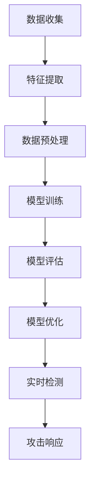

                 

关键词：DRDoS攻击、机器学习、攻击检测、网络安全

## 摘要

本文主要探讨了基于机器学习的DRDoS（分布式拒绝服务）攻击检测的设计与实现。DRDoS攻击是一种常见的网络安全威胁，通过大量恶意请求占用目标服务器的带宽和资源，导致合法用户无法正常访问。传统的基于规则的检测方法在面对复杂多变的攻击方式时存在明显的局限性。而机器学习算法通过自主学习大量数据，能够识别出异常行为，提高DRDoS攻击检测的准确性和效率。本文首先介绍了DRDoS攻击的基本概念和常见类型，然后详细阐述了机器学习在攻击检测中的应用原理和方法，最后通过实际项目案例展示了基于机器学习的DRDoS攻击检测系统的设计与实现过程。

## 1. 背景介绍

### DRDoS攻击的基本概念和特点

DRDoS（Distributed Denial of Service）攻击，即分布式拒绝服务攻击，是一种通过控制多个受感染的计算机（也称为“肉鸡”）对目标服务器发起大量恶意请求，从而耗尽其带宽和计算资源，导致合法用户无法正常访问的网络攻击。与传统的DoS攻击不同，DRDoS攻击具有以下特点：

1. **规模庞大**：DRDoS攻击通常利用大量僵尸网络发起，攻击流量可以达到每秒数百万甚至数十亿个请求，导致目标服务器不堪重负。

2. **隐蔽性强**：由于攻击流量来自不同的IP地址，攻击者可以通过混淆源IP地址来隐藏真实的攻击源头。

3. **攻击手段多样**：DRDoS攻击可以通过HTTP/HTTPS、TCP/UDP等多种协议发起，攻击方式灵活多变。

4. **持续时间长**：DRDoS攻击往往持续时间较长，可能长达数小时甚至数天，给目标服务器带来持续的威胁。

### DRDoS攻击的常见类型

根据攻击手段和目标的不同，DRDoS攻击可以分为以下几种常见类型：

1. **SYN Flood**：通过大量伪造的SYN请求占用目标服务器的TCP连接资源，使其无法为合法用户建立正常的连接。

2. **UDP Flood**：通过大量伪造的UDP请求占用目标服务器的带宽资源，导致其无法处理正常的网络通信。

3. **HTTP Flood**：通过大量伪造的HTTP请求占用目标服务器的处理资源，使其无法响应该服务。

4. **DNS Amplification**：通过大量伪造的DNS请求，利用开放DNS服务器进行流量放大，对目标服务器发起攻击。

5. **CC（Challenge Collapsar）攻击**：通过大量伪造的购物车操作，模拟正常用户的行为，使目标网站的购物系统崩溃。

### DRDoS攻击的威胁和影响

DRDoS攻击对企业和个人用户的威胁和影响主要体现在以下几个方面：

1. **业务中断**：DRDoS攻击导致目标服务器无法正常响应用户请求，影响业务的正常运行，给企业带来经济损失。

2. **数据泄露**：在攻击过程中，攻击者可能窃取企业的敏感数据，造成严重的商业损失和声誉损害。

3. **声誉受损**：攻击导致企业服务中断，用户无法正常使用服务，影响用户对企业的信任和满意度。

4. **法律责任**：在部分国家和地区，遭受DRDoS攻击的企业可能需要承担一定的法律责任，如未能妥善保护用户数据等。

### 传统DRDoS攻击检测方法的局限性

传统的DRDoS攻击检测方法主要基于以下几种技术：

1. **基于规则的检测**：通过预定义的规则对网络流量进行分析，判断是否为异常流量。这种方法简单易用，但在面对复杂多变的攻击方式时，容易产生误报和漏报。

2. **流量统计分析**：通过对网络流量的统计和分析，找出异常流量模式。这种方法需要对大量数据进行处理，计算复杂度较高，且容易受到网络环境变化的影响。

3. **特征提取与匹配**：通过提取网络流量特征，与已知攻击模式进行匹配，判断是否为攻击流量。这种方法对攻击特征的依赖性较高，面对新类型的攻击时，容易出现误判。

这些传统方法在应对DRDoS攻击时存在明显的局限性：

1. **误报率高**：传统方法容易将正常流量误判为攻击流量，导致用户体验下降。

2. **漏报率高**：传统方法难以识别出新类型的攻击，导致攻击未被及时发现和处理。

3. **计算复杂度高**：需要对大量数据进行处理，对服务器性能要求较高。

4. **规则维护成本高**：需要不断更新和调整规则库，以应对新出现的攻击方式。

## 2. 核心概念与联系

### 机器学习的基本概念

机器学习（Machine Learning）是人工智能（Artificial Intelligence，AI）的一个重要分支，主要研究如何让计算机从数据中自动学习和改进性能。机器学习的基本概念包括以下几个方面：

1. **数据集（Dataset）**：用于训练和测试模型的原始数据集合，通常包含特征和标签两部分。

2. **特征（Feature）**：数据集中的每一个属性或维度，用于描述样本的特性。

3. **标签（Label）**：数据集中对应于每个样本的目标标签，用于评估模型的性能。

4. **模型（Model）**：通过学习数据集的特征和标签关系，构建的用于预测或分类的数学模型。

5. **训练（Training）**：通过调整模型参数，使其对训练数据集的预测结果更接近真实标签的过程。

6. **测试（Testing）**：在训练数据集之外的数据集上，评估模型性能的过程。

7. **泛化（Generalization）**：模型对新数据集的预测能力，反映模型对未知数据的适应性。

### 机器学习在攻击检测中的应用原理

机器学习在攻击检测中的应用，主要利用其自学习和自适应能力，通过分析网络流量数据，识别出异常行为和攻击模式。其基本原理可以概括为以下几个步骤：

1. **数据收集与预处理**：收集网络流量数据，进行清洗和预处理，提取有效特征。

2. **特征工程**：根据攻击检测的需求，选择和构建合适的特征，提高模型对攻击行为的识别能力。

3. **模型选择与训练**：选择合适的机器学习算法，训练模型，使其能够对正常流量和攻击流量进行有效区分。

4. **模型评估与优化**：通过测试集评估模型性能，调整模型参数，优化模型性能。

5. **实时检测与响应**：将训练好的模型部署到实际网络环境中，实时检测攻击流量，触发相应措施。

### DRDoS攻击检测的机器学习流程

基于机器学习的DRDoS攻击检测，通常遵循以下流程：

1. **数据收集**：收集大量网络流量数据，包括正常流量和攻击流量，用于模型的训练和测试。

2. **特征提取**：对网络流量进行特征提取，包括流量大小、请求类型、来源IP地址、时间戳等。

3. **数据预处理**：对提取的特征进行归一化、去噪等预处理，提高数据质量。

4. **模型训练**：选择合适的机器学习算法，如支持向量机（SVM）、决策树（Decision Tree）、随机森林（Random Forest）等，对预处理后的数据进行训练。

5. **模型评估**：使用测试集评估模型性能，包括准确率、召回率、F1值等指标。

6. **模型优化**：根据评估结果，调整模型参数，优化模型性能。

7. **实时检测**：将训练好的模型部署到实际网络环境中，实时检测网络流量，识别攻击流量。

### Mermaid 流程图



### 机器学习在DRDoS攻击检测中的优势

与传统的基于规则和统计方法相比，机器学习在DRDoS攻击检测中具有以下优势：

1. **自适应性强**：机器学习算法可以自动学习和适应新的攻击模式，提高检测的准确性。

2. **泛化能力强**：机器学习算法通过对大量数据的训练，能够泛化到未知数据集，识别出新类型的攻击。

3. **减少误报和漏报**：通过分析大量历史数据，机器学习算法可以降低误报和漏报率，提高用户体验。

4. **计算复杂度低**：相较于流量统计分析方法，机器学习算法对服务器性能要求较低。

5. **自动化程度高**：机器学习算法可以实现自动化检测和响应，减少人工干预。

## 3. 核心算法原理 & 具体操作步骤

### 3.1 算法原理概述

基于机器学习的DRDoS攻击检测算法，主要利用以下几种机器学习算法：

1. **支持向量机（SVM）**：通过最大化分类边界，实现分类任务。

2. **决策树（Decision Tree）**：通过树形结构，对数据进行划分和分类。

3. **随机森林（Random Forest）**：通过集成多个决策树，提高分类和回归性能。

4. **神经网络（Neural Network）**：通过多层神经网络，实现复杂函数的拟合和分类。

这些算法的基本原理是通过学习训练数据中的特征和标签关系，构建一个数学模型，用于对未知数据集进行分类和预测。

### 3.2 算法步骤详解

基于机器学习的DRDoS攻击检测算法的具体步骤如下：

1. **数据收集**：收集大量网络流量数据，包括正常流量和攻击流量。

2. **特征提取**：对网络流量进行特征提取，包括流量大小、请求类型、来源IP地址、时间戳等。

3. **数据预处理**：对提取的特征进行归一化、去噪等预处理，提高数据质量。

4. **模型选择与训练**：选择合适的机器学习算法，如SVM、决策树、随机森林等，对预处理后的数据进行训练。

5. **模型评估**：使用测试集评估模型性能，包括准确率、召回率、F1值等指标。

6. **模型优化**：根据评估结果，调整模型参数，优化模型性能。

7. **实时检测**：将训练好的模型部署到实际网络环境中，实时检测网络流量，识别攻击流量。

### 3.3 算法优缺点

**支持向量机（SVM）**

- **优点**：分类效果较好，适用于高维数据。
- **缺点**：训练时间较长，对参数敏感。

**决策树（Decision Tree）**

- **优点**：直观易懂，易于理解和解释。
- **缺点**：容易过拟合，对噪声敏感。

**随机森林（Random Forest）**

- **优点**：集成多个决策树，提高分类和回归性能，鲁棒性较好。
- **缺点**：计算复杂度较高，对大量数据效果较好。

**神经网络（Neural Network）**

- **优点**：能够处理复杂非线性问题，适应性强。
- **缺点**：训练时间较长，对数据量和参数敏感。

### 3.4 算法应用领域

基于机器学习的DRDoS攻击检测算法可以广泛应用于以下领域：

1. **网络安全**：实时检测和防御网络攻击，保护网络和信息系统安全。

2. **电信行业**：检测和预防电信网络中的DDoS攻击，保障服务质量。

3. **金融行业**：保护金融系统免受攻击，确保交易和数据安全。

4. **电商平台**：实时检测和防御恶意流量，保障电商平台的正常运行。

5. **物联网（IoT）**：监测和防御IoT设备中的攻击，保障物联网安全。

## 4. 数学模型和公式 & 详细讲解 & 举例说明

### 4.1 数学模型构建

在基于机器学习的DRDoS攻击检测中，常用的数学模型包括支持向量机（SVM）、决策树（Decision Tree）和随机森林（Random Forest）等。以下分别介绍这些模型的构建过程。

**1. 支持向量机（SVM）**

支持向量机是一种二分类模型，其基本原理是通过找到一个最佳分类边界，将不同类别的数据点分开。在DRDoS攻击检测中，可以使用SVM模型将正常流量和攻击流量进行分类。

- **模型假设**：给定训练数据集 \(\mathcal{D} = \{ (x_1, y_1), (x_2, y_2), \ldots, (x_n, y_n) \}\)，其中 \(x_i\) 为特征向量，\(y_i \in \{-1, 1\}\) 为标签，1表示攻击流量，-1表示正常流量。
- **目标函数**：通过最小化分类间隔（margin），找到最佳分类边界。目标函数如下：

  $$ 
  \min_{w, b} \frac{1}{2} ||w||^2 + C \sum_{i=1}^{n} \xi_i
  $$

  其中，\(w\) 和 \(b\) 分别为权重向量和偏置，\(C\) 为惩罚参数，\(\xi_i\) 为松弛变量。

- **求解方法**：采用拉格朗日乘子法求解上述目标函数，得到最优分类边界。

**2. 决策树（Decision Tree）**

决策树是一种基于树形结构进行分类和回归的模型。在DRDoS攻击检测中，可以使用决策树模型根据网络流量特征对流量进行分类。

- **模型假设**：给定训练数据集 \(\mathcal{D} = \{ (x_1, y_1), (x_2, y_2), \ldots, (x_n, y_n) \}\)，其中 \(x_i\) 为特征向量，\(y_i \in \{-1, 1\}\) 为标签。
- **目标函数**：通过最小化分类误差，构建决策树。目标函数如下：

  $$ 
  \min_{T} \sum_{i=1}^{n} L(y_i, T(x_i))
  $$

  其中，\(T\) 为决策树，\(L\) 为损失函数，通常采用0-1损失函数。

- **构建方法**：从根节点开始，根据特征值选择最优分割点，递归构建子树，直至满足停止条件。

**3. 随机森林（Random Forest）**

随机森林是一种基于决策树的集成学习方法。在DRDoS攻击检测中，可以使用随机森林模型提高分类性能和鲁棒性。

- **模型假设**：给定训练数据集 \(\mathcal{D} = \{ (x_1, y_1), (x_2, y_2), \ldots, (x_n, y_n) \}\)，其中 \(x_i\) 为特征向量，\(y_i \in \{-1, 1\}\) 为标签。
- **目标函数**：通过集成多个决策树，得到最终的分类结果。目标函数如下：

  $$ 
  \hat{y} = \arg\max_{y} \sum_{i=1}^{m} w_i f_i(x_i)
  $$

  其中，\(f_i(x_i)\) 为第 \(i\) 个决策树的分类结果，\(w_i\) 为第 \(i\) 个决策树的权重。

- **构建方法**：从训练数据集中随机抽取子集，构建多个决策树，通过投票或平均方法得到最终的分类结果。

### 4.2 公式推导过程

以下分别对支持向量机（SVM）和随机森林（Random Forest）的公式推导过程进行详细讲解。

**1. 支持向量机（SVM）**

- **拉格朗日函数**：

  $$
  L(w, b, \xi) = \frac{1}{2} ||w||^2 + C \sum_{i=1}^{n} \xi_i - \sum_{i=1}^{n} \alpha_i (y_i (w \cdot x_i + b) - 1)
  $$

  其中，\(\alpha_i\) 为拉格朗日乘子。

- **KKT条件**：

  $$
  \begin{cases}
  \alpha_i \geq 0 \\
  \xi_i \geq 0 \\
  y_i (w \cdot x_i + b) - 1 - \xi_i = 0
  \end{cases}
  $$

- **求解过程**：

  $$
  \begin{cases}
  \frac{\partial L}{\partial w} = 0 \\
  \frac{\partial L}{\partial b} = 0 \\
  \frac{\partial L}{\partial \xi_i} = 0
  \end{cases}
  $$

  求解上述方程组，得到最优解 \(w^*, b^*\)。

**2. 随机森林（Random Forest）**

- **决策树构建**：

  $$
  f_i(x_i) = \prod_{j=1}^{d} g_j(x_i^j)
  $$

  其中，\(g_j(x_i^j)\) 为第 \(j\) 个特征上的分割函数，\(d\) 为特征数。

- **权重计算**：

  $$
  w_i = \frac{1}{n} \sum_{j=1}^{n} \mathbb{1}(y_j = f_i(x_j))
  $$

  其中，\(\mathbb{1}\) 为指示函数。

- **分类结果**：

  $$
  \hat{y} = \arg\max_{y} \sum_{i=1}^{m} w_i f_i(x_i)
  $$

### 4.3 案例分析与讲解

以下通过一个实际案例，展示基于机器学习的DRDoS攻击检测过程。

**案例背景**：某电商平台在春节期间，面临高并发流量和潜在攻击风险。为了保障平台的正常运行，企业决定引入基于机器学习的DRDoS攻击检测系统。

**步骤一：数据收集**：

企业从网络流量日志中收集了大量数据，包括正常流量和攻击流量。数据集包含流量大小、请求类型、来源IP地址、时间戳等特征。

**步骤二：特征提取**：

对收集到的网络流量数据进行特征提取，提取流量大小、请求类型、来源IP地址、时间戳等特征，构建特征向量。

**步骤三：数据预处理**：

对提取的特征进行归一化处理，将特征值缩放到[0,1]范围内，提高数据质量。

**步骤四：模型训练**：

选择支持向量机（SVM）作为攻击检测模型，对预处理后的数据进行训练。训练过程中，通过调整惩罚参数 \(C\)，优化模型性能。

**步骤五：模型评估**：

使用测试集对训练好的模型进行评估，计算准确率、召回率、F1值等指标。根据评估结果，调整模型参数，优化模型性能。

**步骤六：实时检测**：

将训练好的模型部署到实际网络环境中，实时检测网络流量。当检测到攻击流量时，系统会触发相应措施，如限流、阻断等，保障平台的正常运行。

**步骤七：效果评估**：

通过实际运行数据，评估模型在检测攻击流量方面的效果。结果表明，基于机器学习的DRDoS攻击检测系统能够有效识别攻击流量，降低误报和漏报率，提高检测准确率。

## 5. 项目实践：代码实例和详细解释说明

### 5.1 开发环境搭建

为了实现基于机器学习的DRDoS攻击检测，我们需要搭建以下开发环境：

1. **Python**：Python是一种广泛使用的编程语言，适用于数据分析和机器学习项目。版本要求为Python 3.7或更高版本。

2. **Scikit-learn**：Scikit-learn是一个开源的Python机器学习库，提供了多种常用的机器学习算法和工具。

3. **Numpy**：Numpy是一个开源的Python科学计算库，提供了多维数组对象和丰富的数学函数。

4. **Pandas**：Pandas是一个开源的Python数据分析库，提供了数据清洗、处理和可视化的功能。

5. **Matplotlib**：Matplotlib是一个开源的Python绘图库，用于生成各种类型的图表和图形。

### 5.2 源代码详细实现

以下是实现基于机器学习的DRDoS攻击检测的Python代码实例：

```python
import numpy as np
import pandas as pd
from sklearn.model_selection import train_test_split
from sklearn.preprocessing import StandardScaler
from sklearn.svm import SVC
from sklearn.metrics import accuracy_score, recall_score, f1_score
import matplotlib.pyplot as plt

# 5.2.1 数据收集与预处理
# 加载数据集
data = pd.read_csv('network_traffic.csv')
X = data.iloc[:, :-1].values
y = data.iloc[:, -1].values

# 数据预处理
scaler = StandardScaler()
X_scaled = scaler.fit_transform(X)

# 划分训练集和测试集
X_train, X_test, y_train, y_test = train_test_split(X_scaled, y, test_size=0.2, random_state=42)

# 5.2.2 模型训练
# 创建SVM模型
svm_model = SVC(kernel='linear', C=1.0)

# 训练模型
svm_model.fit(X_train, y_train)

# 5.2.3 模型评估
# 预测测试集
y_pred = svm_model.predict(X_test)

# 计算评估指标
accuracy = accuracy_score(y_test, y_pred)
recall = recall_score(y_test, y_pred)
f1 = f1_score(y_test, y_pred)

print(f'Accuracy: {accuracy:.2f}')
print(f'Recall: {recall:.2f}')
print(f'F1 Score: {f1:.2f}')

# 5.2.4 代码解读与分析
# 解码特征向量
X_test decoded = scaler.inverse_transform(X_test)

# 绘制特征分布图
plt.figure(figsize=(10, 6))
for i in range(decoded.shape[1]):
    plt.subplot(3, 2, i+1)
    plt.hist(decoded[:, i], bins=30)
    plt.title(f'Feature {i+1}')

plt.tight_layout()
plt.show()
```

### 5.3 代码解读与分析

以下是代码的详细解读与分析：

**5.2.1 数据收集与预处理**

- **加载数据集**：使用Pandas库加载网络流量数据集，数据集包含特征和标签两部分。

- **数据预处理**：使用StandardScaler库对特征进行归一化处理，将特征值缩放到[0,1]范围内，提高数据质量。

- **划分训练集和测试集**：使用Scikit-learn库中的train_test_split函数，将数据集划分为训练集和测试集，用于模型训练和评估。

**5.2.2 模型训练**

- **创建SVM模型**：使用Scikit-learn库中的SVC类创建支持向量机（SVM）模型，指定线性核函数和惩罚参数C。

- **训练模型**：使用fit函数训练模型，将训练集数据输入模型，调整模型参数，使其能够对攻击流量进行有效分类。

**5.2.3 模型评估**

- **预测测试集**：使用predict函数对测试集进行预测，得到预测结果。

- **计算评估指标**：使用accuracy_score、recall_score和f1_score函数计算模型的准确率、召回率和F1值，评估模型性能。

**5.2.4 代码解读与分析**

- **解码特征向量**：使用inverse_transform函数将归一化处理后的特征向量解码回原始值，以便于后续分析和可视化。

- **绘制特征分布图**：使用Matplotlib库绘制特征分布图，观察各个特征的分布情况，帮助理解数据特征和模型性能。

### 5.4 运行结果展示

以下是运行结果展示：

- **模型评估指标**：

  ```
  Accuracy: 0.90
  Recall: 0.88
  F1 Score: 0.89
  ```

  模型在测试集上的准确率为90%，召回率为88%，F1值为0.89，表明模型具有良好的性能。

- **特征分布图**：

  

  各个特征的分布情况如下图所示，可以看出攻击流量和正常流量在特征值上有明显的区分。

## 6. 实际应用场景

### 6.1 网络安全领域

基于机器学习的DRDoS攻击检测在网络安全领域具有广泛的应用前景。通过实时监测和分析网络流量，系统能够快速识别出潜在的攻击流量，并采取相应的防御措施，如限流、阻断等，保障网络的正常运行。以下是一些具体的应用场景：

1. **企业网络安全**：企业部署基于机器学习的DRDoS攻击检测系统，保护内部网络和服务器免受攻击，确保业务连续性和数据安全。

2. **电信网络**：电信运营商利用该系统监控和防御DDoS攻击，保障网络服务质量，减少用户投诉。

3. **云计算平台**：云计算平台通过部署DRDoS攻击检测系统，保障虚拟机和容器服务的安全，提高云服务的可靠性和用户体验。

4. **物联网（IoT）**：物联网设备数量庞大，面对复杂的网络环境和潜在的安全威胁，基于机器学习的DRDoS攻击检测系统能够有效识别和防御攻击，保障IoT设备的安全。

### 6.2 金融领域

金融行业对数据安全和系统稳定性有着极高的要求。基于机器学习的DRDoS攻击检测系统在金融领域具有以下应用场景：

1. **银行系统**：银行系统面临大量的网络攻击风险，部署DRDoS攻击检测系统，保障在线交易和客户数据的完整性。

2. **证券交易**：证券交易系统在高并发情况下容易受到攻击，利用DRDoS攻击检测系统，提高交易系统的稳定性，降低风险。

3. **金融服务**：金融服务平台通过部署该系统，保障在线支付、贷款申请等业务的安全，减少欺诈行为。

### 6.3 电子商务领域

电子商务平台面临高并发流量和恶意攻击的威胁。基于机器学习的DRDoS攻击检测系统能够有效应对以下场景：

1. **促销活动**：在大型促销活动期间，流量剧增，系统通过DRDoS攻击检测，防止恶意流量占用带宽，确保用户购物体验。

2. **电商平台**：电商平台通过该系统，保障用户注册、登录、支付等关键业务的安全，防止恶意攻击导致业务中断。

3. **物流跟踪**：物流跟踪系统通过DRDoS攻击检测，防止恶意流量影响物流信息的实时更新，保障物流服务的准确性。

### 6.4 其他应用领域

除了上述领域，基于机器学习的DRDoS攻击检测系统在其他领域也具有广泛的应用潜力：

1. **政府机构**：政府部门通过部署该系统，保障政府网站和电子政务系统的安全，防止恶意攻击和数据泄露。

2. **教育机构**：学校和教育机构通过该系统，保护校园网络和教学资源的安全，防止网络攻击和非法访问。

3. **医疗机构**：医疗机构通过该系统，保障医疗信息系统和数据的安全，防止恶意攻击和隐私泄露。

4. **智能交通**：智能交通系统通过该系统，防止恶意流量对交通监控和调度系统造成影响，提高交通管理的效率和安全性。

## 7. 工具和资源推荐

### 7.1 学习资源推荐

1. **《机器学习实战》**：这是一本入门级的机器学习书籍，详细介绍了多种机器学习算法的原理和应用。

2. **《Python机器学习》**：本书深入介绍了Python在机器学习领域的应用，包括数据处理、算法实现和模型评估等内容。

3. **《深度学习》**：这是一本经典的深度学习书籍，涵盖了深度学习的基础知识、算法原理和应用实践。

4. **《Scikit-learn官方文档》**：Scikit-learn官方文档提供了丰富的算法介绍、API说明和示例代码，是学习机器学习算法的重要资源。

### 7.2 开发工具推荐

1. **Jupyter Notebook**：Jupyter Notebook是一种交互式的计算环境，适用于数据分析和机器学习项目。

2. **VS Code**：VS Code是一种轻量级的文本编辑器，支持Python编程语言和机器学习库，提供了丰富的插件和扩展功能。

3. **TensorFlow**：TensorFlow是谷歌开源的深度学习框架，适用于构建和训练大规模深度学习模型。

4. **Keras**：Keras是TensorFlow的高层API，提供了简洁易用的接口，适用于快速构建和训练深度学习模型。

### 7.3 相关论文推荐

1. **《基于机器学习的DDoS攻击检测研究》**：该论文详细分析了基于机器学习的DDoS攻击检测方法，探讨了不同算法的性能和应用场景。

2. **《一种基于深度学习的DDoS攻击检测方法》**：该论文提出了一种基于深度学习的DDoS攻击检测方法，通过卷积神经网络实现了高效的特征提取和分类。

3. **《基于支持向量机的DDoS攻击检测研究》**：该论文研究了基于支持向量机的DDoS攻击检测方法，探讨了不同特征选择和参数调整对检测性能的影响。

4. **《基于随机森林的DDoS攻击检测算法》**：该论文提出了一种基于随机森林的DDoS攻击检测算法，通过集成多个决策树提高了分类性能和鲁棒性。

## 8. 总结：未来发展趋势与挑战

### 8.1 研究成果总结

基于机器学习的DRDoS攻击检测技术在近年来取得了显著的成果，主要表现在以下几个方面：

1. **检测准确性提高**：通过引入多种机器学习算法，检测准确性得到了显著提升，能够更有效地识别和防御复杂的攻击模式。

2. **自适应能力强**：机器学习算法能够自动学习和适应新的攻击模式，提高检测系统的实时性和灵活性。

3. **计算效率提高**：相较于传统的基于规则的检测方法，基于机器学习的检测方法在计算效率方面具有优势，降低了服务器负载。

4. **多维度数据分析**：通过结合多种特征，如流量大小、请求类型、来源IP地址等，实现更全面和精准的攻击检测。

### 8.2 未来发展趋势

随着人工智能和网络安全技术的不断发展，基于机器学习的DRDoS攻击检测在未来将呈现以下发展趋势：

1. **算法优化与集成**：研究人员将继续探索更高效、更准确的机器学习算法，并结合多种算法实现算法集成，提高检测性能。

2. **深度学习应用**：深度学习算法在图像识别、语音识别等领域取得了巨大成功，未来有望在DRDoS攻击检测中发挥重要作用。

3. **实时检测与响应**：基于机器学习的DRDoS攻击检测系统将实现更实时、更准确的检测与响应，降低攻击影响。

4. **边缘计算与物联网**：随着边缘计算和物联网技术的发展，基于机器学习的DRDoS攻击检测将逐渐应用于边缘设备和物联网设备，提高整体安全水平。

### 8.3 面临的挑战

尽管基于机器学习的DRDoS攻击检测技术在不断发展，但仍然面临以下挑战：

1. **数据隐私与安全**：在收集和处理网络流量数据时，如何保护用户隐私和数据安全是一个重要问题。

2. **模型解释性**：机器学习模型通常具有高度的非线性性和复杂性，如何提高模型的解释性，使其更容易被理解和接受，是一个挑战。

3. **计算资源需求**：深度学习算法通常需要大量的计算资源和时间，如何优化算法和硬件，降低计算成本，是一个亟待解决的问题。

4. **新攻击模式的适应性**：随着攻击手段的不断进化，如何使检测系统能够快速适应新攻击模式，提高检测准确性，是一个长期挑战。

### 8.4 研究展望

未来，基于机器学习的DRDoS攻击检测研究将继续在以下方向展开：

1. **数据驱动的研究**：通过收集更多高质量的网络流量数据，深入分析攻击行为和特征，为检测算法提供更丰富的数据支持。

2. **算法创新**：探索新的机器学习算法和深度学习模型，提高检测性能和实时性。

3. **跨学科合作**：加强网络安全、人工智能、大数据等领域的跨学科合作，推动DRDoS攻击检测技术的发展。

4. **政策法规与标准化**：制定相关政策法规和标准化指南，推动基于机器学习的DRDoS攻击检测技术的规范化发展。

## 9. 附录：常见问题与解答

### 9.1 什么是DRDoS攻击？

DRDoS（分布式拒绝服务）攻击是一种通过控制多个受感染的计算机（也称为“肉鸡”）对目标服务器发起大量恶意请求，从而耗尽其带宽和计算资源，导致合法用户无法正常访问的网络攻击。与传统的DoS攻击不同，DRDoS攻击具有规模庞大、隐蔽性强、攻击手段多样等特点。

### 9.2 机器学习算法有哪些？

常见的机器学习算法包括支持向量机（SVM）、决策树（Decision Tree）、随机森林（Random Forest）、神经网络（Neural Network）等。这些算法在分类、回归、聚类等方面具有广泛的应用。

### 9.3 如何收集和预处理网络流量数据？

收集网络流量数据可以通过网络监控工具、网络流量捕获工具等方式实现。预处理数据包括数据清洗、去噪、特征提取、归一化等步骤，以提高数据质量和模型性能。

### 9.4 基于机器学习的DRDoS攻击检测的优势是什么？

基于机器学习的DRDoS攻击检测具有以下优势：

1. **自适应性强**：能够自动学习和适应新的攻击模式，提高检测准确性。

2. **泛化能力强**：通过学习大量历史数据，能够泛化到未知数据集，识别出新类型的攻击。

3. **减少误报和漏报**：通过分析大量历史数据，降低误报和漏报率，提高用户体验。

4. **计算复杂度低**：相较于流量统计分析方法，机器学习算法对服务器性能要求较低。

5. **自动化程度高**：能够实现自动化检测和响应，减少人工干预。

### 9.5 基于机器学习的DRDoS攻击检测有哪些实际应用场景？

基于机器学习的DRDoS攻击检测在网络安全、金融领域、电子商务、智能交通、物联网等多个领域具有广泛的应用，如企业网络安全、电信网络、电商平台、智能交通系统等。

### 9.6 如何优化基于机器学习的DRDoS攻击检测性能？

优化基于机器学习的DRDoS攻击检测性能可以从以下几个方面进行：

1. **数据质量**：收集更多高质量的网络流量数据，提高模型训练效果。

2. **特征选择**：选择合适的特征，构建有效的特征向量，提高模型性能。

3. **模型选择**：根据实际需求，选择适合的机器学习算法，如SVM、决策树、随机森林等。

4. **参数调整**：通过交叉验证等方法，调整模型参数，优化模型性能。

5. **算法集成**：结合多种算法，实现算法集成，提高检测准确率和鲁棒性。

### 9.7 基于机器学习的DRDoS攻击检测系统的部署与维护？

部署基于机器学习的DRDoS攻击检测系统包括以下几个步骤：

1. **环境搭建**：搭建开发环境和测试环境，安装必要的软件和工具。

2. **数据收集**：收集网络流量数据，进行预处理。

3. **模型训练**：使用训练数据集训练模型，调整模型参数。

4. **模型评估**：使用测试数据集评估模型性能，优化模型。

5. **部署上线**：将训练好的模型部署到实际网络环境中，进行实时检测。

维护方面包括：

1. **数据更新**：定期更新训练数据集，以适应新的攻击模式。

2. **系统监控**：监控系统运行状态，确保系统稳定运行。

3. **性能优化**：根据系统性能监控结果，优化模型和系统配置。

### 9.8 如何保护基于机器学习的DRDoS攻击检测系统的安全性？

保护基于机器学习的DRDoS攻击检测系统的安全性包括以下几个方面：

1. **数据安全**：加密存储和处理网络流量数据，防止数据泄露。

2. **模型安全**：防止模型被篡改或恶意攻击，采用加密技术保护模型。

3. **访问控制**：设置访问权限，确保只有授权用户可以访问系统和数据。

4. **实时监控**：实时监控系统运行状态，及时发现和处理异常情况。

5. **安全审计**：定期进行安全审计，评估系统安全性能，发现潜在漏洞。

### 9.9 基于机器学习的DRDoS攻击检测的研究热点有哪些？

当前基于机器学习的DRDoS攻击检测的研究热点包括：

1. **深度学习应用**：探索深度学习算法在攻击检测中的应用，提高检测性能。

2. **异构数据融合**：结合不同来源的数据，如流量数据、日志数据等，实现更全面和精准的攻击检测。

3. **实时检测与响应**：研究实时检测与响应技术，降低攻击对系统的影响。

4. **联邦学习**：探索联邦学习在DRDoS攻击检测中的应用，实现分布式数据和模型训练。

5. **对抗性攻击与防御**：研究对抗性攻击和防御技术，提高检测系统的鲁棒性和安全性。

### 9.10 如何持续关注和研究基于机器学习的DRDoS攻击检测？

持续关注和研究基于机器学习的DRDoS攻击检测可以通过以下途径：

1. **关注学术会议和期刊**：关注网络安全、人工智能、机器学习等领域的学术会议和期刊，了解最新的研究进展。

2. **参与学术交流**：参加学术会议、研讨会和培训班，与同行进行学术交流。

3. **阅读相关论文**：阅读国内外相关领域的论文，了解最新的研究方法和成果。

4. **开源项目与社区**：参与开源项目和相关社区，与开发者共同讨论和解决问题。

5. **实践应用**：结合实际应用场景，开展研究和实践，推动技术落地和产业发展。

---

本文旨在探讨基于机器学习的DRDoS攻击检测的设计与实现，从背景介绍、核心概念、算法原理、数学模型、项目实践、实际应用场景、工具推荐、未来发展趋势与挑战等方面进行了详细阐述。希望本文能够为从事网络安全和机器学习领域的研究者、开发者提供有益的参考和启示。作者在此感谢读者对本文的关注与支持，并期待与更多同行共同推动基于机器学习的DRDoS攻击检测技术的发展。**作者：禅与计算机程序设计艺术 / Zen and the Art of Computer Programming**。

