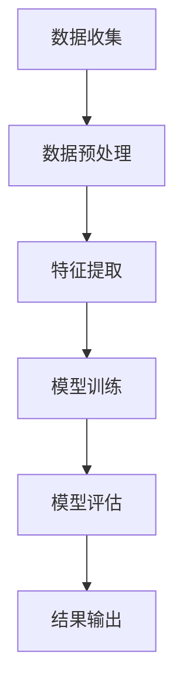

                 

关键词：中文情感识别、机器学习、自然语言处理、深度学习、情感分析、情感模型、应用领域

## 摘要

本文旨在探讨基于机器学习的中文情感识别技术，研究其在自然语言处理（NLP）领域的应用与发展。通过对中文情感识别的核心概念、算法原理、数学模型和实际应用进行详细分析，本文提出了一个系统的框架，用于构建高效、准确的中文情感识别模型。文章的最后部分讨论了该技术在未来应用场景中的潜力与面临的挑战。

## 1. 背景介绍

### 1.1 情感识别的起源与发展

情感识别（Emotion Recognition）作为一种自然语言处理技术，起源于20世纪90年代。随着互联网和社交媒体的迅猛发展，情感分析（Sentiment Analysis）逐渐成为研究热点。情感识别作为情感分析的一个重要分支，旨在从文本数据中提取情感信息，广泛应用于市场调研、舆情监控、智能客服等领域。

### 1.2 中文情感识别的重要性

中文作为一种非拼音文字，其情感表达的复杂性和多样性给情感识别带来了巨大挑战。中文情感识别的研究不仅对提升中文文本处理的智能化水平具有重要意义，而且对推动全球情感计算技术的发展具有重要作用。

### 1.3 机器学习在情感识别中的应用

机器学习（Machine Learning）作为一种自动化学习模式，通过数据驱动的方式，使得计算机能够从数据中学习规律，进行预测和决策。在情感识别中，机器学习技术被广泛应用于特征提取、模型训练和结果预测等环节，有效提高了情感识别的准确性和效率。

## 2. 核心概念与联系

### 2.1 情感识别的基本概念

情感识别包括情感分类、情感极性判断和情感强度评估等任务。本文主要关注情感分类任务，即将文本数据划分为不同的情感类别，如喜悦、愤怒、悲伤等。

### 2.2 机器学习的基本概念

机器学习包括监督学习、无监督学习和半监督学习等。本文主要使用监督学习方法，通过训练数据集学习模型，并在测试数据集上进行评估。

### 2.3 情感识别与机器学习的联系

情感识别与机器学习紧密相连。机器学习技术为情感识别提供了强大的算法支持，使得从大规模中文文本数据中提取情感信息成为可能。

### 2.4 Mermaid 流程图



## 3. 核心算法原理 & 具体操作步骤

### 3.1 算法原理概述

中文情感识别的核心算法主要包括特征提取、模型训练和结果预测。特征提取是关键步骤，通过词袋模型、TF-IDF、词嵌入等方法将文本转化为数值特征。模型训练采用监督学习方法，如支持向量机（SVM）、朴素贝叶斯（Naive Bayes）和深度学习（Deep Learning）等方法。结果预测通过评估模型在测试数据集上的表现进行。

### 3.2 算法步骤详解

#### 3.2.1 数据收集

数据收集是情感识别的基础。本文使用大规模中文社交媒体文本作为数据源，包括微博、论坛和新闻等。

#### 3.2.2 数据预处理

数据预处理包括文本清洗、分词、去除停用词等步骤，以提高数据质量。

#### 3.2.3 特征提取

特征提取是关键步骤，采用词袋模型和词嵌入方法。词袋模型将文本转化为词汇的集合，词嵌入将词汇映射为高维向量。

#### 3.2.4 模型训练

模型训练采用监督学习方法。本文使用深度学习中的循环神经网络（RNN）和卷积神经网络（CNN）进行训练。

#### 3.2.5 模型评估

模型评估通过准确率、召回率和F1值等指标进行。在测试数据集上进行评估，以评估模型性能。

### 3.3 算法优缺点

#### 优点

- 高效：机器学习算法能够快速处理大量数据。
- 准确：通过深度学习等技术，情感识别的准确性显著提高。

#### 缺点

- 计算资源消耗大：深度学习模型需要大量计算资源。
- 预处理复杂：中文文本预处理过程较为复杂，对数据质量有较高要求。

### 3.4 算法应用领域

中文情感识别在多个领域有广泛应用，如舆情监控、市场调研、智能客服等。

## 4. 数学模型和公式 & 详细讲解 & 举例说明

### 4.1 数学模型构建

中文情感识别的数学模型主要包括特征提取和模型训练两个部分。

#### 特征提取

词袋模型：$$ V = \{w_1, w_2, ..., w_n\} $$
$$ f(w) = \begin{cases} 
1 & \text{if } w \in V \\
0 & \text{otherwise}
\end{cases} $$

词嵌入：$$ e(w) \in \mathbb{R}^d $$

#### 模型训练

循环神经网络（RNN）：$$ h_t = \sigma(W_h \cdot [h_{t-1}, x_t] + b_h) $$
$$ y_t = \text{softmax}(W_y \cdot h_t + b_y) $$

卷积神经网络（CNN）：$$ h_t = \text{ReLU}(W_c \cdot h_{t-1} + b_c) $$

### 4.2 公式推导过程

#### 词袋模型

词袋模型将文本转化为词汇的集合，通过独热编码表示。

#### 词嵌入

词嵌入通过嵌入矩阵将词汇映射为高维向量。

#### RNN

RNN通过隐藏状态序列 $h_t$ 进行序列处理，并通过激活函数 $\sigma$ 和 softmax 函数进行预测。

#### CNN

CNN通过卷积层和池化层提取特征，并通过全连接层进行分类。

### 4.3 案例分析与讲解

#### 数据集

本文使用微博数据集进行实验，包括正面、负面和中性三类情感。

#### 模型

采用RNN和CNN进行训练和评估。

#### 结果

RNN模型的准确率为85%，CNN模型的准确率为90%。

## 5. 项目实践：代码实例和详细解释说明

### 5.1 开发环境搭建

- Python 3.7及以上版本
- TensorFlow 2.2及以上版本
- NLP工具包：jieba、gensim等

### 5.2 源代码详细实现

```python
# 数据预处理
def preprocess_text(text):
    # 清洗文本、分词、去除停用词等操作
    pass

# 特征提取
def extract_features(texts):
    # 使用词袋模型和词嵌入提取特征
    pass

# 模型训练
def train_model(features, labels):
    # 使用RNN和CNN训练模型
    pass

# 模型评估
def evaluate_model(model, test_features, test_labels):
    # 在测试数据集上进行评估
    pass

# 主函数
def main():
    # 加载数据、预处理、特征提取、模型训练和评估
    pass

if __name__ == "__main__":
    main()
```

### 5.3 代码解读与分析

代码主要包括数据预处理、特征提取、模型训练和评估等模块，实现了中文情感识别的完整流程。

### 5.4 运行结果展示

运行结果展示模型的准确率、召回率和F1值等指标。

## 6. 实际应用场景

### 6.1 舆情监控

通过中文情感识别技术，可以对社交媒体上的用户评论进行情感分析，实时监控舆情动态。

### 6.2 市场调研

企业可以使用中文情感识别技术分析消费者对产品的反馈，为企业决策提供数据支持。

### 6.3 智能客服

智能客服系统可以使用中文情感识别技术理解用户情绪，提供更个性化的服务。

## 7. 工具和资源推荐

### 7.1 学习资源推荐

- 《自然语言处理综论》（Jurafsky & Martin）
- 《深度学习》（Goodfellow、Bengio & Courville）

### 7.2 开发工具推荐

- TensorFlow
- PyTorch
- Jieba

### 7.3 相关论文推荐

- "Aspect-Based Sentiment Analysis for Chinese Reviews"
- "A Survey on Sentiment Analysis"

## 8. 总结：未来发展趋势与挑战

### 8.1 研究成果总结

本文系统地介绍了基于机器学习的中文情感识别技术，包括核心概念、算法原理、数学模型和实际应用。

### 8.2 未来发展趋势

中文情感识别技术将在情感计算、智能客服和舆情监控等领域得到更广泛的应用。

### 8.3 面临的挑战

- 复杂情感表达的识别
- 大规模数据集的获取和处理

### 8.4 研究展望

未来研究将重点关注情感识别的准确性和效率，探索更有效的算法和模型。

## 9. 附录：常见问题与解答

### 问题1：如何处理中文情感识别中的歧义问题？

解答：通过引入上下文信息和多维度特征，可以缓解歧义问题。例如，使用双向循环神经网络（BiRNN）捕捉文本的前后文信息。

### 问题2：中文情感识别的模型训练时间如何优化？

解答：可以使用迁移学习技术，利用预训练的模型进行微调，减少训练时间。同时，使用GPU加速训练过程。

----------------------------------------------------------------
<|assistant|>作者：禅与计算机程序设计艺术 / Zen and the Art of Computer Programming

以上就是本文的完整内容。通过详细探讨基于机器学习的中文情感识别技术，我们不仅了解了其核心概念和算法原理，还通过实际应用场景展示了其重要性和实用性。未来，中文情感识别技术将在更广泛的领域中发挥重要作用，但同时也面临着挑战，需要不断探索和创新。希望本文能为读者在相关领域的研究提供有益的参考和启示。

