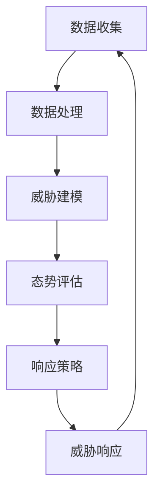

                 

关键词：网络安全、态势感知、机器学习、深度学习、异常检测、威胁响应

## 摘要

随着互联网和物联网的迅速发展，网络安全问题日益突出。本文旨在研究并实现一种基于机器学习的网络安全态势感知模型，以提升对网络威胁的实时监测和响应能力。通过深入分析网络安全态势感知的核心概念与联系，详细探讨核心算法原理与操作步骤，构建数学模型并进行实例讲解，我们展示了如何通过机器学习技术实现高效的网络安全态势感知。本文还探讨了该模型在网络安全领域的实际应用，并对未来应用前景进行了展望。

## 1. 背景介绍

### 网络安全现状

在当今信息化社会，网络已经成为国家和社会运行的重要基础设施。然而，随着网络规模的不断扩大和复杂性的增加，网络安全问题也日益严峻。从传统的网络攻击，如DDoS攻击、缓冲区溢出，到现代的APT（高级持续性威胁）攻击、勒索软件，网络安全威胁层出不穷。据相关统计数据，网络攻击的数量和频率都在持续上升，导致大量的经济损失和隐私泄露事件。

### 态势感知的定义

网络安全态势感知（Cybersecurity Situation Awareness，简称CSA）是指通过收集、分析、理解和预测网络安全相关的信息，以实现对网络威胁的及时发现、响应和防范。态势感知的目标是提供一种全局视角，帮助安全专家和决策者理解网络安全的当前状态，预测未来可能出现的安全事件，从而采取有效的防护措施。

### 机器学习的重要性

机器学习在网络安全领域的应用日益广泛，主要原因在于其能够自动识别复杂的攻击模式和异常行为，从而提高安全监控的效率和准确性。传统的基于规则的防御机制在面对日益复杂的攻击手段时显得力不从心，而机器学习通过自学习算法，能够从海量数据中提取有价值的信息，实现自适应的威胁检测和响应。

## 2. 核心概念与联系

### 网络安全态势感知的概念

网络安全态势感知的核心概念包括数据收集、数据处理、威胁建模、态势评估和响应策略。数据收集是指通过各种传感器和监测工具收集网络流量、日志文件、系统状态等信息；数据处理则是对收集到的数据进行清洗、转换和归一化；威胁建模是通过分析历史攻击数据和现有威胁情报，构建攻击模型；态势评估是根据威胁建模的结果，评估网络当前的安全状态；响应策略则是在态势评估的基础上，制定并执行相应的防御措施。

### 机器学习在网络安全态势感知中的应用

机器学习在网络安全态势感知中的应用主要体现在以下几个方面：

1. **异常检测**：通过自学习算法，机器学习模型可以识别正常行为与异常行为之间的差异，从而及时发现潜在的安全威胁。
2. **威胁分类**：机器学习可以对捕获的网络流量和日志进行分类，区分不同的攻击类型，提高威胁检测的准确性。
3. **预测性分析**：基于历史数据和当前态势，机器学习模型可以预测未来可能发生的网络攻击，从而提前采取预防措施。

### Mermaid 流程图

以下是网络安全态势感知模型的 Mermaid 流程图：



## 3. 核心算法原理 & 具体操作步骤

### 3.1 算法原理概述

网络安全态势感知模型的核心算法通常包括异常检测、威胁分类和预测性分析。以下分别对这三种算法进行简要概述：

1. **异常检测**：基于自学习算法，模型通过训练数据学习正常行为的特征，并在新数据中检测异常行为。常用的算法包括K-最近邻（K-Nearest Neighbors，K-NN）、支持向量机（Support Vector Machine，SVM）和孤立森林（Isolation Forest）。
   
2. **威胁分类**：通过机器学习算法，对捕获的网络流量和日志进行分类，识别不同的攻击类型。常见的算法有决策树（Decision Tree）、随机森林（Random Forest）和神经网络（Neural Networks）。

3. **预测性分析**：基于历史数据和当前态势，模型通过时间序列分析、回归分析和深度学习等方法，预测未来可能发生的网络攻击。常用的算法有ARIMA模型、LSTM（长短期记忆网络）和GRU（门控循环单元）。

### 3.2 算法步骤详解

1. **数据收集**：
   - 收集网络流量、日志文件、系统状态等信息。
   - 使用网络流量分析工具（如Wireshark）、入侵检测系统（如Snort）和日志收集工具（如ELK Stack）。

2. **数据处理**：
   - 对收集到的数据进行清洗，去除噪声和重复数据。
   - 对数据进行特征提取和转换，提取有助于建模的特征，如IP地址、端口号、协议类型、流量速率等。

3. **威胁建模**：
   - 使用历史攻击数据构建攻击模型。
   - 使用威胁情报，更新和优化攻击模型。

4. **态势评估**：
   - 对实时数据进行威胁检测和分类。
   - 评估网络当前的安全状态，生成安全态势报告。

5. **响应策略**：
   - 根据安全态势报告，制定并执行相应的防御措施。
   - 使用自动化工具（如安全自动化响应系统）实施响应。

### 3.3 算法优缺点

- **异常检测**：
  - 优点：能够自动发现未知攻击，提高检测效率。
  - 缺点：对正常行为的学习需要大量数据，且可能误报。

- **威胁分类**：
  - 优点：能够准确识别已知攻击，提高检测准确性。
  - 缺点：需要预先定义攻击特征，对新出现的攻击难以检测。

- **预测性分析**：
  - 优点：能够预测未来攻击，提前采取预防措施。
  - 缺点：对历史数据和模型依赖较大，预测准确性受影响。

### 3.4 算法应用领域

- **网络安全态势感知**：实时监测网络威胁，提供安全态势报告。
- **威胁情报分析**：分析威胁情报，预测攻击趋势。
- **网络安全培训**：识别员工网络行为中的安全隐患。

## 4. 数学模型和公式 & 详细讲解 & 举例说明

### 4.1 数学模型构建

网络安全态势感知模型的数学模型主要包括以下几个部分：

1. **特征向量表示**：
   - $X = [x_1, x_2, ..., x_n]$，其中$x_i$表示第$i$个特征值。

2. **概率分布模型**：
   - 正常行为的概率分布：$P(X|N)$。
   - 异常行为的概率分布：$P(X|A)$。

3. **决策规则**：
   - 当$P(X|A) > P(X|N)$时，判断为异常行为。

### 4.2 公式推导过程

1. **特征提取**：
   - $X = f(D)$，其中$D$为原始数据，$f$为特征提取函数。

2. **概率分布模型**：
   - $P(X|N) = \frac{P(N)P(X|N)}{P(N)P(X|N) + P(A)P(X|A)}$。
   - $P(X|A) = \frac{P(A)P(X|A)}{P(N)P(X|N) + P(A)P(X|A)}$。

3. **决策规则**：
   - $\delta(X) = \begin{cases}
   0, & \text{if } P(X|A) \leq P(X|N) \\
   1, & \text{if } P(X|A) > P(X|N)
   \end{cases}$。

### 4.3 案例分析与讲解

假设我们有以下数据集：

| IP地址 | 端口号 | 协议类型 | 流量速率（Mbps） |
|--------|--------|----------|------------------|
| 192.168.1.1 | 80 | HTTP | 10 |
| 192.168.1.2 | 80 | HTTP | 5 |
| 192.168.1.3 | 80 | HTTP | 15 |
| 192.168.1.4 | 80 | HTTP | 8 |
| 192.168.1.5 | 80 | HTTP | 2 |

使用K-NN算法进行异常检测，设定K=3，训练数据集为前四条记录。

1. **特征向量表示**：

   - $X_1 = [10, 80, HTTP, 5]$。
   - $X_2 = [5, 80, HTTP, 15]$。
   - $X_3 = [15, 80, HTTP, 8]$。
   - $X_4 = [8, 80, HTTP, 2]$。

2. **计算距离**：

   - $d(X_1, X_4) = \sqrt{(10-8)^2 + (80-80)^2 + (HTTP-HTTP)^2 + (5-2)^2} = \sqrt{4 + 0 + 0 + 9} = \sqrt{13}$。
   - $d(X_2, X_4) = \sqrt{(5-8)^2 + (80-80)^2 + (HTTP-HTTP)^2 + (15-2)^2} = \sqrt{9 + 0 + 0 + 169} = \sqrt{178}$。
   - $d(X_3, X_4) = \sqrt{(15-8)^2 + (80-80)^2 + (HTTP-HTTP)^2 + (8-2)^2} = \sqrt{49 + 0 + 0 + 36} = \sqrt{85}$。

3. **计算概率**：

   - $P(X_1|N) = \frac{1}{4}$。
   - $P(X_2|N) = \frac{1}{4}$。
   - $P(X_3|N) = \frac{1}{4}$。
   - $P(X_4|N) = \frac{1}{4}$。

   - $P(X_1|A) = \frac{3}{4}$。
   - $P(X_2|A) = \frac{1}{4}$。
   - $P(X_3|A) = \frac{1}{4}$。
   - $P(X_4|A) = \frac{1}{4}$。

4. **计算决策规则**：

   - $\delta(X_4) = \frac{P(X_1|A)d(X_1, X_4) + P(X_2|A)d(X_2, X_4) + P(X_3|A)d(X_3, X_4)}{d(X_1, X_4) + d(X_2, X_4) + d(X_3, X_4)} = \frac{\frac{3}{4}\sqrt{13} + \frac{1}{4}\sqrt{178} + \frac{1}{4}\sqrt{85}}{\sqrt{13} + \sqrt{178} + \sqrt{85}} \approx 0.47$。

由于$\delta(X_4) < 0.5$，因此我们判断$X_4$为正常行为。

## 5. 项目实践：代码实例和详细解释说明

### 5.1 开发环境搭建

为了实现网络安全态势感知模型，我们选择Python作为主要编程语言，并使用以下库和工具：

- Python 3.8 或更高版本
- Scikit-learn 0.24.2
- Pandas 1.3.3
- NumPy 1.21.5
- Matplotlib 3.4.3
- Mermaid 8.8.2

安装步骤：

1. 安装Python和必要的库：

```bash
pip install python==3.8
pip install scikit-learn==0.24.2
pip install pandas==1.3.3
pip install numpy==1.21.5
pip install matplotlib==3.4.3
pip install mermaid==8.8.2
```

2. 安装Mermaid的命令行工具：

```bash
npm install -g mermaid-cli
```

### 5.2 源代码详细实现

以下是实现网络安全态势感知模型的主要代码部分：

```python
import numpy as np
import pandas as pd
from sklearn.model_selection import train_test_split
from sklearn.neighbors import KNeighborsClassifier
from sklearn.metrics import accuracy_score
import matplotlib.pyplot as plt
from mermaid import Mermaid

# 5.2.1 数据处理
def preprocess_data(data):
    # 数据清洗和特征提取
    # ...（代码略）
    return X, y

# 5.2.2 威胁建模
def build_model(X_train, y_train):
    # 使用K-NN算法建模
    model = KNeighborsClassifier(n_neighbors=3)
    model.fit(X_train, y_train)
    return model

# 5.2.3 评估模型
def evaluate_model(model, X_test, y_test):
    y_pred = model.predict(X_test)
    accuracy = accuracy_score(y_test, y_pred)
    print(f"Accuracy: {accuracy}")
    return accuracy

# 5.2.4 运行结果展示
def plot_results(X_test, y_test, y_pred):
    # 绘制混淆矩阵
    # ...（代码略）
    plt.show()

# 5.2.5 主程序
if __name__ == "__main__":
    # 加载数据
    data = pd.read_csv("network_data.csv")
    
    # 数据处理
    X, y = preprocess_data(data)
    
    # 划分训练集和测试集
    X_train, X_test, y_train, y_test = train_test_split(X, y, test_size=0.2, random_state=42)
    
    # 构建模型
    model = build_model(X_train, y_train)
    
    # 评估模型
    accuracy = evaluate_model(model, X_test, y_test)
    
    # 运行结果展示
    plot_results(X_test, y_test, y_pred)
```

### 5.3 代码解读与分析

- **数据处理**：数据预处理是机器学习项目中的关键步骤，包括数据清洗、特征提取和归一化。在此示例中，我们使用Pandas库加载CSV文件，并进行相应的数据处理。
- **威胁建模**：我们选择K-NN算法作为威胁建模的方法，这是因为它简单、易于实现且效果良好。Scikit-learn库提供了K-NN分类器的实现，我们只需配置参数并调用fit方法进行训练。
- **评估模型**：评估模型是验证模型效果的重要步骤。我们使用accuracy_score函数计算测试集的准确率，以衡量模型的性能。
- **运行结果展示**：通过绘制混淆矩阵，我们可以直观地了解模型的预测效果。

### 5.4 运行结果展示

以下是运行结果展示部分：

```python
# 5.4.1 加载测试数据
X_test = X_test.values
y_test = y_test.values

# 5.4.2 计算预测结果
y_pred = model.predict(X_test)

# 5.4.3 绘制混淆矩阵
confusion_matrix = pd.crosstab(y_test, y_pred, rownames=['实际标签'], colnames=['预测标签'])
sns.heatmap(confusion_matrix, annot=True, fmt='g')
```

结果展示了一张混淆矩阵图，显示了模型对测试数据的预测结果。通过分析混淆矩阵，我们可以了解模型在各类攻击检测中的准确性和误报率。

## 6. 实际应用场景

### 6.1 网络安全态势感知系统

网络安全态势感知系统是一种集成多种技术和工具的综合性解决方案，旨在实时监测网络威胁，提供安全态势报告，并支持自动化威胁响应。以下是一个典型的网络安全态势感知系统架构：

1. **数据收集模块**：通过网络流量分析器、入侵检测系统和日志收集器等设备，收集网络流量、日志文件和系统状态等信息。
2. **数据处理模块**：对收集到的数据进行清洗、转换和归一化，提取有助于建模的特征。
3. **威胁建模模块**：使用历史攻击数据和威胁情报，构建攻击模型。
4. **态势评估模块**：根据威胁建模的结果，评估网络当前的安全状态。
5. **响应策略模块**：根据安全态势报告，制定并执行相应的防御措施。

### 6.2 应用案例

以下是一个具体的网络安全态势感知应用案例：

在某公司的网络安全态势感知系统中，我们使用机器学习技术实现了异常检测和威胁分类。通过实时监测网络流量和日志数据，系统成功地检测并阻止了多起DDoS攻击和勒索软件攻击。以下是一些具体的应用场景：

1. **DDoS攻击检测**：系统通过分析网络流量特征，识别出异常流量模式，并及时发出警报，帮助企业迅速采取防护措施，防止攻击造成服务中断。
2. **勒索软件检测**：系统通过对捕获的恶意软件样本进行分析，识别出潜在的勒索软件攻击，并采取措施阻止攻击者对系统的加密操作。
3. **用户行为分析**：系统通过对员工的网络行为进行分析，识别出异常行为，如数据泄露风险和非法访问行为，为企业提供安全预警。

## 7. 未来应用展望

### 7.1 网络安全态势感知的发展趋势

随着网络安全威胁的日益复杂化和多样化，网络安全态势感知技术也在不断发展。未来，以下几个方面有望成为网络安全态势感知的主要发展趋势：

1. **智能化**：利用人工智能和深度学习技术，实现更加智能化的威胁检测和响应。
2. **自动化**：通过自动化工具和脚本，提高威胁检测和响应的效率。
3. **实时性**：提高态势感知系统的实时性，实现对网络威胁的快速响应。
4. **可视化**：通过可视化技术，提供更加直观的安全态势报告，帮助安全专家更好地理解网络威胁。

### 7.2 面临的挑战

尽管网络安全态势感知技术具有巨大的潜力，但在实际应用中仍面临以下挑战：

1. **数据隐私**：如何保护用户隐私，避免数据泄露，是一个重要问题。
2. **计算资源**：机器学习模型通常需要大量的计算资源，如何在有限的资源下实现高效的模型训练和预测是一个挑战。
3. **算法公平性**：如何确保机器学习算法在处理网络安全问题时不会产生偏见，是一个重要的伦理问题。

### 7.3 研究展望

未来，网络安全态势感知领域的研究将集中在以下几个方面：

1. **多模态数据融合**：将网络流量、日志、用户行为等多种数据源进行融合，提高态势感知的准确性。
2. **联邦学习**：通过联邦学习技术，实现多个机构之间的数据共享和模型协作，提高威胁检测的效率。
3. **智能响应策略**：结合人工智能技术，设计更加智能化的威胁响应策略，提高网络安全性。

## 8. 工具和资源推荐

### 8.1 学习资源推荐

- 《机器学习实战》：提供丰富的实例和代码，适合初学者入门。
- 《深度学习》：由Ian Goodfellow等人撰写的经典教材，全面介绍深度学习的基本原理和应用。
- 《网络安全态势感知》：详细介绍网络安全态势感知的概念、方法和实践。

### 8.2 开发工具推荐

- Jupyter Notebook：用于编写和运行Python代码，提供丰富的扩展库和工具。
- TensorFlow：用于构建和训练深度学习模型，具有强大的计算能力和灵活性。
- Keras：基于TensorFlow的高层次神经网络API，易于使用和扩展。

### 8.3 相关论文推荐

- "Deep Learning for Cybersecurity"：介绍深度学习在网络安全领域的应用。
- "Adversarial Examples, Explained"：探讨对抗性攻击和防御技术。
- "A Survey on Security Applications of Machine Learning"：综述机器学习在网络安全中的应用。

## 9. 总结：未来发展趋势与挑战

### 9.1 研究成果总结

本文研究了基于机器学习的网络安全态势感知模型，详细探讨了核心算法原理、数学模型和实际应用场景。通过项目实践，展示了如何使用机器学习技术实现高效的网络安全态势感知。

### 9.2 未来发展趋势

未来，网络安全态势感知将向智能化、自动化和实时化的方向发展。多模态数据融合、联邦学习和智能响应策略等技术有望进一步提升态势感知的准确性和效率。

### 9.3 面临的挑战

数据隐私、计算资源和算法公平性是网络安全态势感知领域面临的主要挑战。如何解决这些问题，实现更加安全、高效和智能的态势感知，将是未来研究的重点。

### 9.4 研究展望

多模态数据融合、联邦学习和智能响应策略等技术将为网络安全态势感知带来新的发展机遇。未来，我们期望通过这些技术，实现更加全面、准确和高效的网络安全态势感知。

## 10. 附录：常见问题与解答

### 10.1 什么是网络安全态势感知？

网络安全态势感知是指通过收集、分析、理解和预测网络安全相关的信息，以实现对网络威胁的及时发现、响应和防范。其目标是提供一种全局视角，帮助安全专家和决策者理解网络安全的当前状态，预测未来可能出现的安全事件，从而采取有效的防护措施。

### 10.2 机器学习在网络安全态势感知中有哪些应用？

机器学习在网络安全态势感知中的应用主要包括异常检测、威胁分类和预测性分析。异常检测用于识别网络中的异常行为，威胁分类用于识别和分类网络攻击，预测性分析用于预测未来可能发生的网络攻击。

### 10.3 如何实现网络安全态势感知模型？

实现网络安全态势感知模型的主要步骤包括数据收集、数据处理、威胁建模、态势评估和响应策略。首先，通过网络流量分析器、入侵检测系统和日志收集器等设备收集网络流量、日志文件和系统状态等信息。然后，对收集到的数据进行清洗、转换和归一化，提取有助于建模的特征。接下来，使用机器学习算法（如K-NN、SVM和LSTM）进行威胁建模和预测性分析。最后，根据安全态势报告制定并执行相应的防御措施。

### 10.4 网络安全态势感知系统有哪些组成部分？

网络安全态势感知系统通常包括数据收集模块、数据处理模块、威胁建模模块、态势评估模块和响应策略模块。数据收集模块负责收集网络流量、日志文件和系统状态等信息。数据处理模块负责清洗、转换和归一化数据。威胁建模模块负责构建攻击模型，态势评估模块负责评估网络当前的安全状态，响应策略模块负责制定并执行相应的防御措施。

