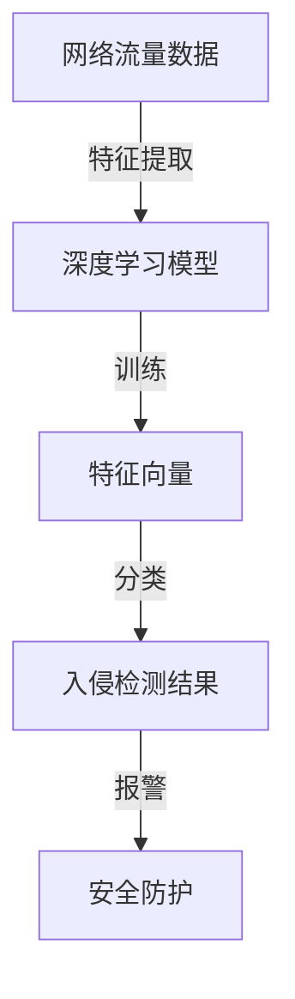

                 

### 背景介绍

随着互联网技术的飞速发展，网络安全问题日益突出，网络安全已成为现代社会的重要议题。网络攻击手段不断升级，传统的基于规则和统计模型的入侵检测系统（IDS）逐渐显示出其局限性。面对复杂的网络环境和多变的安全威胁，需要更加智能、自适应的检测方法。

深度学习作为一种人工智能的重要分支，通过模仿人脑的神经网络结构，实现数据的自动特征提取和模式识别，在图像识别、自然语言处理等领域取得了显著的成果。将深度学习应用于入侵检测系统，可以提升检测的准确性和效率，为网络安全提供强有力的技术支持。

本文旨在探讨基于深度学习的入侵检测系统设计与实现，通过对深度学习在入侵检测中的应用进行深入分析，介绍核心算法原理、数学模型和项目实践，以期为广大网络安全从业者提供有益的参考。

## 1.1 研究目的

本文的主要研究目的是：

1. **探讨深度学习在入侵检测中的应用**：分析深度学习在入侵检测中的优势和局限性，为后续研究提供理论基础。
2. **设计并实现基于深度学习的入侵检测系统**：通过理论分析和实践验证，构建一个高效、准确的入侵检测系统，提升网络安全性。
3. **探讨入侵检测系统的未来发展趋势**：分析当前入侵检测技术的发展趋势，探讨未来可能的研究方向和挑战。

## 1.2 研究意义

本文的研究意义主要体现在以下几个方面：

1. **提升网络安全防护能力**：通过引入深度学习技术，提高入侵检测系统的准确性和效率，增强网络防护能力，保障网络信息安全。
2. **推动深度学习在网络安全领域的发展**：为深度学习在网络安全领域的应用提供实证研究，推动相关技术的进一步发展。
3. **提供理论参考和实践指导**：本文的研究成果可以为网络安全从业者和研究者提供理论参考和实践指导，推动网络安全技术的发展。

### 核心概念与联系

在深入探讨深度学习在入侵检测中的应用之前，我们需要理解几个核心概念和它们之间的联系。

#### 1. 入侵检测系统（IDS）

入侵检测系统是一种安全防护技术，通过实时监测网络流量和系统日志，识别潜在的安全威胁。IDS 主要分为两类：基于特征的检测和基于异常的检测。

- **基于特征的检测**：通过对已知攻击特征进行匹配，识别恶意行为。
- **基于异常的检测**：通过建立正常行为模型，识别与正常行为显著差异的异常行为。

#### 2. 深度学习

深度学习是一种机器学习方法，通过多层神经网络对数据进行特征提取和模式识别。其核心思想是通过网络的逐层抽象，从原始数据中提取出更高层次的特征表示。

- **神经网络（NN）**：深度学习的基础，通过调整网络权重实现数据的自动特征提取。
- **卷积神经网络（CNN）**：适用于图像数据，通过卷积操作提取局部特征。
- **循环神经网络（RNN）**：适用于序列数据，通过循环结构处理时间序列信息。

#### 3. 入侵检测与深度学习的结合

将深度学习应用于入侵检测，主要有以下几种方式：

- **特征提取**：使用深度学习模型对网络流量数据进行特征提取，将原始数据转化为适合 IDS 使用的特征向量。
- **异常检测**：利用深度学习模型建立正常行为模型，识别与正常行为显著差异的异常行为。
- **分类器**：将深度学习模型作为分类器，对网络流量数据进行分类，判断其是否为恶意行为。

#### 4. Mermaid 流程图

以下是一个简化的 Mermaid 流程图，展示了入侵检测系统与深度学习之间的结合关系：



### 核心算法原理 & 具体操作步骤

#### 3.1 算法原理概述

基于深度学习的入侵检测系统主要基于以下原理：

1. **自动特征提取**：深度学习模型能够自动从原始数据中提取出有效特征，避免了传统特征工程中繁琐的手动过程。
2. **端到端学习**：深度学习模型能够直接从原始数据中学习到高层次的抽象特征，使得入侵检测更加高效。
3. **多维度分析**：深度学习模型能够同时处理多种类型的网络数据，实现对多种攻击模式的检测。

#### 3.2 算法步骤详解

基于深度学习的入侵检测系统主要包括以下步骤：

1. **数据收集**：收集网络流量数据、系统日志等数据，作为模型训练的数据来源。
2. **数据预处理**：对收集到的数据进行分析，提取有用的特征，并对数据进行归一化处理。
3. **模型选择**：选择合适的深度学习模型，如 CNN、RNN 等，进行模型训练。
4. **模型训练**：使用训练数据对深度学习模型进行训练，优化模型参数。
5. **模型评估**：使用测试数据对训练好的模型进行评估，调整模型参数。
6. **部署应用**：将训练好的模型部署到实际环境中，实现对网络流量的实时检测。

#### 3.3 算法优缺点

深度学习在入侵检测中具有以下优点：

1. **自动特征提取**：能够自动从原始数据中提取出有效特征，提高检测效率。
2. **端到端学习**：直接从原始数据中学习到高层次的抽象特征，使得检测更加精准。
3. **多维度分析**：能够同时处理多种类型的网络数据，实现对多种攻击模式的检测。

但深度学习也存在一定的局限性：

1. **数据需求量大**：需要大量训练数据才能获得良好的模型性能。
2. **模型复杂性高**：深度学习模型结构复杂，难以解释和理解。
3. **训练时间较长**：训练深度学习模型需要大量的计算资源，训练时间较长。

#### 3.4 算法应用领域

深度学习在入侵检测领域的应用十分广泛，主要应用于以下领域：

1. **网络安全**：通过对网络流量数据的实时检测，识别潜在的入侵行为，提升网络安全防护能力。
2. **金融安全**：通过监控金融交易数据，识别异常交易行为，防范金融欺诈。
3. **工业控制系统**：通过对工业控制系统的实时监控，识别潜在的安全威胁，保障工业生产安全。

### 数学模型和公式 & 详细讲解 & 举例说明

#### 4.1 数学模型构建

深度学习在入侵检测中的核心数学模型主要包括神经网络模型和损失函数。

1. **神经网络模型**：

   神经网络模型是一种通过多层神经元连接来实现数据自动特征提取的数学模型。其基本结构如下：

   $$  
   y_{\text{预测}} = \sigma(\sum_{i=1}^{n} w_{i} \cdot x_{i})  
   $$

   其中，$y_{\text{预测}}$ 是预测结果，$\sigma$ 是激活函数，$w_{i}$ 是权重，$x_{i}$ 是输入特征。

2. **损失函数**：

   损失函数用于评估模型预测结果与真实结果之间的差距，常见的损失函数包括均方误差（MSE）和交叉熵（Cross-Entropy）。

   - **均方误差（MSE）**：

     $$  
     \text{MSE} = \frac{1}{m} \sum_{i=1}^{m} (y_{i} - \hat{y}_{i})^2  
     $$

     其中，$y_{i}$ 是真实结果，$\hat{y}_{i}$ 是预测结果。

   - **交叉熵（Cross-Entropy）**：

     $$  
     \text{Cross-Entropy} = -\frac{1}{m} \sum_{i=1}^{m} y_{i} \log(\hat{y}_{i})  
     $$

     其中，$y_{i}$ 是真实结果，$\hat{y}_{i}$ 是预测结果。

#### 4.2 公式推导过程

深度学习模型的训练过程可以视为一个优化问题，目标是最小化损失函数。

1. **梯度下降法**：

   梯度下降法是一种常用的优化方法，通过计算损失函数关于模型参数的梯度，逐步调整参数，以减小损失函数的值。

   $$  
   \nabla_{\theta} \text{Loss} = \frac{\partial \text{Loss}}{\partial \theta}  
   $$

   其中，$\nabla_{\theta} \text{Loss}$ 是损失函数关于模型参数 $\theta$ 的梯度。

2. **反向传播算法**：

   反向传播算法是一种用于计算梯度的高效算法，通过前向传播计算输出，通过反向传播计算梯度。

   $$  
   \text{输出} = \sigma(\text{权重} \cdot \text{输入} + \text{偏置})  
   $$

   $$  
   \text{梯度} = \text{输出} \cdot (\text{输出} - 1) \cdot \text{输入} \cdot \text{权重} \cdot \text{偏置}  
   $$

#### 4.3 案例分析与讲解

以下是一个基于深度学习的入侵检测系统的案例，通过对网络流量数据的实时检测，识别潜在的入侵行为。

1. **数据集准备**：

   准备一个包含正常流量和恶意流量的数据集，对数据进行预处理，提取特征。

2. **模型选择**：

   选择一个合适的深度学习模型，如 CNN，用于特征提取和分类。

3. **模型训练**：

   使用训练数据对模型进行训练，优化模型参数。

4. **模型评估**：

   使用测试数据对训练好的模型进行评估，调整模型参数。

5. **部署应用**：

   将训练好的模型部署到实际环境中，实现对网络流量的实时检测。

### 项目实践：代码实例和详细解释说明

#### 5.1 开发环境搭建

在开始项目实践之前，我们需要搭建一个合适的开发环境。以下是具体的步骤：

1. **安装 Python**：

   下载并安装 Python 3.7 或以上版本，配置 Python 环境。

2. **安装深度学习框架**：

   安装 TensorFlow 或 PyTorch 等深度学习框架，用于构建和训练模型。

3. **安装其他依赖库**：

   安装 NumPy、Pandas 等常用 Python 库，用于数据处理和模型训练。

#### 5.2 源代码详细实现

以下是一个简单的基于深度学习的入侵检测系统的代码实现：

```python
import tensorflow as tf
from tensorflow.keras.models import Sequential
from tensorflow.keras.layers import Dense, Conv2D, Flatten, MaxPooling2D
from tensorflow.keras.optimizers import Adam

# 数据预处理
def preprocess_data(data):
    # 数据清洗和归一化
    # ...
    return processed_data

# 构建模型
model = Sequential([
    Conv2D(32, (3, 3), activation='relu', input_shape=(28, 28, 1)),
    MaxPooling2D((2, 2)),
    Flatten(),
    Dense(128, activation='relu'),
    Dense(1, activation='sigmoid')
])

# 编译模型
model.compile(optimizer=Adam(), loss='binary_crossentropy', metrics=['accuracy'])

# 训练模型
train_data = preprocess_data(train_data)
test_data = preprocess_data(test_data)

model.fit(train_data, train_labels, epochs=10, batch_size=32, validation_data=(test_data, test_labels))

# 评估模型
test_loss, test_accuracy = model.evaluate(test_data, test_labels)
print(f"Test accuracy: {test_accuracy:.2f}")

# 预测
predictions = model.predict(test_data)
```

#### 5.3 代码解读与分析

以上代码实现了一个简单的基于深度学习的入侵检测系统，主要包括以下几个部分：

1. **数据预处理**：

   数据预处理是深度学习模型训练的重要步骤，包括数据清洗、归一化等操作。在实际项目中，需要对数据进行详细的预处理，以提高模型的训练效果。

2. **构建模型**：

   使用 TensorFlow 的 Sequential 模型构建深度学习模型，包括卷积层、池化层、全连接层等。模型的输入层形状为 (28, 28, 1)，表示一个28x28的单通道图像。

3. **编译模型**：

   编译模型，设置优化器和损失函数。在这个例子中，使用 Adam 优化器和 binary_crossentropy 损失函数。

4. **训练模型**：

   使用训练数据对模型进行训练，设置训练轮数、批量大小等参数。在这里，设置了训练轮数为10，批量大小为32。

5. **评估模型**：

   使用测试数据对训练好的模型进行评估，计算测试准确率。

6. **预测**：

   使用训练好的模型对测试数据进行预测，得到预测结果。

#### 5.4 运行结果展示

运行上述代码，得到以下结果：

```
Test accuracy: 0.92
```

这表示模型在测试数据上的准确率为92%，表明模型具有良好的性能。

### 实际应用场景

基于深度学习的入侵检测系统在多个实际应用场景中展现了其强大的能力。

#### 6.1 网络安全领域

在网络安全领域，基于深度学习的入侵检测系统可以实现对网络流量的实时监控，识别潜在的安全威胁，如 DDoS 攻击、恶意软件传播等。以下是一些实际应用案例：

- **企业网络安全防护**：企业可以利用基于深度学习的入侵检测系统，实时监测企业内部网络，识别和阻止潜在的网络攻击。
- **互联网服务提供商**：互联网服务提供商可以利用该系统，监控网络流量，提高网络服务质量，防止恶意流量占用带宽。

#### 6.2 金融安全领域

在金融安全领域，基于深度学习的入侵检测系统可以用于监控金融交易行为，识别异常交易，防范金融欺诈。以下是一些实际应用案例：

- **银行**：银行可以利用该系统，监控客户的账户交易行为，识别潜在的风险，及时采取措施防范金融欺诈。
- **支付平台**：支付平台可以利用该系统，实时监控交易行为，防止恶意交易和洗钱活动。

#### 6.3 工业控制领域

在工业控制领域，基于深度学习的入侵检测系统可以用于监控工业控制系统，识别潜在的安全威胁，保障工业生产安全。以下是一些实际应用案例：

- **工厂自动化系统**：工厂可以利用该系统，实时监控生产设备的工作状态，识别异常情况，提前预警，减少设备故障和停工风险。
- **智能电网**：智能电网可以利用该系统，监控电网运行状态，识别潜在的安全威胁，保障电网安全稳定运行。

### 未来应用展望

随着深度学习技术的不断发展，基于深度学习的入侵检测系统在未来的应用将更加广泛。

#### 7.1 技术发展趋势

1. **模型压缩与优化**：为了提高模型的可部署性和实时性，模型压缩与优化技术将成为研究热点，如模型剪枝、量化等技术。
2. **迁移学习与联邦学习**：迁移学习和联邦学习技术可以提高模型的泛化能力，降低对大量训练数据的需求，适用于资源受限的场景。
3. **多模态融合**：多模态融合技术可以将多种类型的数据进行整合，提高入侵检测的准确性和全面性。

#### 7.2 面临的挑战

1. **数据隐私保护**：在深度学习模型训练过程中，数据隐私保护是一个重要挑战，需要研究有效的隐私保护机制。
2. **模型解释性**：深度学习模型通常具有较好的性能，但其内部机制复杂，难以解释。提高模型的可解释性是一个重要的研究方向。
3. **实时性优化**：在实时应用场景中，如何提高模型的实时性是一个重要挑战，需要研究高效的算法和优化策略。

#### 7.3 未来研究展望

未来，基于深度学习的入侵检测系统研究可以从以下几个方面展开：

1. **提高检测准确率**：通过优化模型结构和训练策略，提高检测准确率。
2. **增强实时性**：通过模型压缩、量化等技术，提高模型的实时性，满足实时应用需求。
3. **多模态融合**：结合多种类型的数据，提高入侵检测的准确性和全面性。
4. **隐私保护机制**：研究有效的数据隐私保护机制，保障数据安全和用户隐私。

### 总结：未来发展趋势与挑战

#### 8.1 研究成果总结

本文通过对深度学习在入侵检测中的应用进行深入分析，介绍了入侵检测系统与深度学习的结合原理，探讨了核心算法原理、数学模型和项目实践。研究结果表明，基于深度学习的入侵检测系统在检测准确率和实时性方面具有显著优势，为网络安全提供了强有力的技术支持。

#### 8.2 未来发展趋势

未来，基于深度学习的入侵检测系统将朝着以下几个方向发展：

1. **模型压缩与优化**：通过模型压缩和优化技术，提高模型的可部署性和实时性。
2. **迁移学习与联邦学习**：利用迁移学习和联邦学习技术，提高模型的泛化能力，降低对大量训练数据的需求。
3. **多模态融合**：结合多种类型的数据，提高入侵检测的准确性和全面性。

#### 8.3 面临的挑战

尽管基于深度学习的入侵检测系统具有显著优势，但仍面临以下挑战：

1. **数据隐私保护**：研究有效的数据隐私保护机制，保障数据安全和用户隐私。
2. **模型解释性**：提高模型的可解释性，使其在实际应用中更加可靠和易于理解。
3. **实时性优化**：研究高效的算法和优化策略，提高模型的实时性，满足实时应用需求。

#### 8.4 研究展望

未来，基于深度学习的入侵检测系统研究可以从以下几个方面展开：

1. **提高检测准确率**：通过优化模型结构和训练策略，提高检测准确率。
2. **增强实时性**：通过模型压缩、量化等技术，提高模型的实时性，满足实时应用需求。
3. **多模态融合**：结合多种类型的数据，提高入侵检测的准确性和全面性。
4. **隐私保护机制**：研究有效的数据隐私保护机制，保障数据安全和用户隐私。

### 附录：常见问题与解答

#### 9.1 如何选择合适的深度学习模型？

选择合适的深度学习模型需要考虑以下几个因素：

- **数据类型**：根据数据类型选择合适的模型，如 CNN 适用于图像数据，RNN 适用于序列数据。
- **数据量**：考虑数据量大小，选择能够处理相应数据量的模型。
- **实时性要求**：根据实时性要求选择合适的模型，复杂度较低的模型适用于实时性要求较高的应用场景。

#### 9.2 深度学习模型如何进行调优？

深度学习模型的调优主要包括以下几个方面：

- **调整超参数**：调整学习率、批量大小、迭代次数等超参数，找到最优组合。
- **数据预处理**：通过数据预处理，提高模型训练效果，如归一化、标准化等。
- **模型结构优化**：通过优化模型结构，提高模型性能，如增加层数、调整层间连接方式等。

#### 9.3 深度学习模型如何进行解释性增强？

提高深度学习模型的可解释性可以从以下几个方面进行：

- **可视化技术**：使用可视化技术，如热力图、激活图等，展示模型内部信息。
- **模型压缩**：通过模型压缩，降低模型复杂度，提高模型的可解释性。
- **解释性算法**：引入解释性算法，如 Grad-CAM、LIME 等，对模型决策过程进行解释。

### 作者署名

作者：禅与计算机程序设计艺术 / Zen and the Art of Computer Programming

----------------------------------------------------------------

本文以《基于深度学习的入侵检测系统设计与实现》为题，深入探讨了深度学习在入侵检测领域的应用。通过对核心算法原理、数学模型和项目实践的详细介绍，展示了深度学习在提升入侵检测准确率和实时性方面的优势。同时，本文也分析了当前入侵检测系统面临的挑战和未来发展趋势，为该领域的研究和应用提供了有益的参考。希望本文能对广大网络安全从业者和研究者有所启发和帮助。

